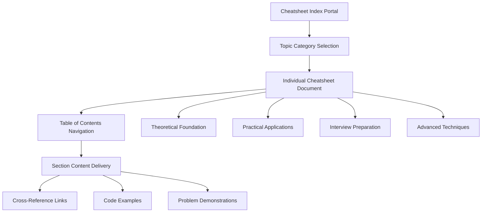

# Comprehensive Algorithm Cheatsheet System Design

## Overview

The Algorithm Cheatsheet System is an educational resource platform designed to provide comprehensive, high-quality reference materials for fundamental algorithm and data structure topics. This system extends the existing cheatsheet infrastructure to include eight new critical algorithmic domains: Bit Manipulation, Backtracking Recursion, Greedy Algorithms, Mathematics Algorithms, Heap, Hashing, Linked List, and Tries.

### Purpose and Educational Value

The cheatsheet system serves as a bridge between theoretical algorithm knowledge and practical implementation, providing students, developers, and interview candidates with structured, comprehensive references that combine theoretical foundations with practical applications. Each cheatsheet follows a standardized format ensuring consistent quality and comprehensive coverage exceeding 6000 words per topic.

### Integration with Existing Platform

This feature seamlessly integrates with the current visualization project infrastructure, leveraging the existing cheatsheet directory structure and maintaining consistency with established patterns for array, dynamic programming, graph, and other algorithm topics.

## Architecture

### Content Structure Framework

The cheatsheet system follows a hierarchical information architecture designed for progressive learning and quick reference:



### Document Organization Hierarchy

Each cheatsheet follows a standardized ten-section structure ensuring comprehensive coverage:

1. **Definition and Intuition** - Conceptual foundation and real-world analogies
2. **Key Properties and Rules** - Mathematical foundations and invariants
3. **Patterns and Use Cases** - Recognition strategies and application scenarios
4. **Step-by-Step Approaches** - Methodical problem-solving frameworks
5. **Common Algorithms** - Core algorithmic implementations and variations
6. **Edge Cases** - Boundary conditions and error handling
7. **Complexity Analysis** - Time and space complexity considerations
8. **Example Problems** - Detailed worked solutions
9. **Problem Categories** - Taxonomic organization of related problems
10. **Pro Tips and Interview Tricks** - Expert insights and optimization strategies

### Content Quality Standards

Each cheatsheet adheres to rigorous quality standards:

- **Comprehensiveness**: Minimum 6000 words ensuring thorough topic coverage
- **Technical Accuracy**: Mathematically precise definitions and algorithmic descriptions
- **Educational Clarity**: Progressive complexity with clear explanations
- **Practical Relevance**: Industry-relevant examples and interview-focused content
- **Consistent Formatting**: Standardized markdown structure with proper sectioning

## Topic-Specific Design Specifications

### Bit Manipulation Cheatsheet

**Core Focus Areas:**
- Binary representation fundamentals and two's complement arithmetic
- Bitwise operators (AND, OR, XOR, NOT, left shift, right shift) with mathematical properties
- Bit manipulation patterns for optimization and space efficiency
- Common bit tricks for power-of-two detection, bit counting, and mask operations
- Advanced techniques including Brian Kernighan's algorithm and bit manipulation in dynamic programming

**Specialized Content Sections:**
- Binary number system conversion and representation
- Bitwise operation truth tables and mathematical properties
- Bit manipulation algorithms for subset generation and permutation
- Hardware-level optimization techniques and compiler considerations
- Interview problems categorization: basic operations, optimization tricks, and advanced applications

### Backtracking Recursion Cheatsheet

**Core Focus Areas:**
- Recursive problem decomposition and subproblem identification
- Backtracking algorithmic template and decision tree exploration
- State space representation and pruning strategies
- Memoization integration with recursive backtracking
- Complexity analysis for recursive algorithms including recurrence relations

**Specialized Content Sections:**
- Recursion mathematical foundations and proof techniques
- Backtracking decision tree visualization and state management
- Classic problems taxonomy: permutations, combinations, N-Queens, Sudoku solving
- Optimization techniques including branch and bound integration
- Memory management considerations for deep recursion

### Greedy Algorithms Cheatsheet

**Core Focus Areas:**
- Greedy choice property and optimal substructure verification
- Algorithm correctness proof techniques including exchange arguments
- Problem recognition patterns for greedy applicability
- Classic greedy algorithms across multiple domains
- Counterexamples and when greedy approaches fail

**Specialized Content Sections:**
- Mathematical foundations of greedy algorithms and matroid theory
- Proof techniques for greedy algorithm correctness
- Problem classification framework for greedy vs dynamic programming decisions
- Advanced greedy techniques in graph algorithms and scheduling
- Interview problem patterns and recognition strategies

### Mathematics Algorithms Cheatsheet

**Core Focus Areas:**
- Number theory fundamentals including prime numbers, GCD, and modular arithmetic
- Combinatorics and probability in algorithmic contexts
- Numerical algorithms for computation and approximation
- Mathematical optimization techniques in algorithm design
- Discrete mathematics applications in computer science

**Specialized Content Sections:**
- Prime number algorithms including Sieve of Eratosthenes variations
- Modular arithmetic operations and applications in cryptography
- Combinatorial algorithms for counting and enumeration
- Numerical methods for root finding and optimization
- Mathematical proof techniques relevant to algorithm correctness

### Heap Data Structure Cheatsheet

**Core Focus Areas:**
- Heap property maintenance and tree structure relationships
- Binary heap implementation with array representation
- Heap operations complexity analysis and optimization
- Priority queue applications and use case identification
- Advanced heap variants including Fibonacci heaps and binomial heaps

**Specialized Content Sections:**
- Heap mathematical properties and invariant maintenance
- Heapify algorithm analysis and implementation variations
- Priority queue problem patterns and application scenarios
- Heap-based algorithms for sorting and selection problems
- Advanced heap structures for specialized applications

### Hashing Algorithms Cheatsheet

**Core Focus Areas:**
- Hash function design principles and collision resolution strategies
- Hash table implementation and load factor considerations
- Cryptographic hashing and security applications
- Distributed hashing and consistent hashing techniques
- Hash-based algorithm optimization strategies

**Specialized Content Sections:**
- Hash function mathematical properties and distribution analysis
- Collision resolution techniques comparison and performance analysis
- Hash table resizing strategies and amortized complexity
- Cryptographic hash function applications and security considerations
- Advanced hashing techniques for large-scale systems

### Linked List Data Structure Cheatsheet

**Core Focus Areas:**
- Linked list variants and structural properties
- Pointer manipulation techniques and memory management
- Common linked list algorithms and traversal patterns
- Advanced techniques including cycle detection and merging
- Performance comparison with array-based structures

**Specialized Content Sections:**
- Memory layout and pointer arithmetic in linked structures
- Linked list algorithm complexity analysis and optimization
- Advanced manipulation techniques for doubly and multiply linked lists
- Cycle detection algorithms and mathematical foundations
- Integration with other data structures for hybrid approaches

### Tries Data Structure Cheatsheet

**Core Focus Areas:**
- Trie structure fundamentals and tree-based string storage
- Prefix-based operations and string matching algorithms
- Memory optimization techniques including compressed tries
- Applications in autocomplete, spell checking, and IP routing
- Advanced trie variants including suffix tries and radix trees

**Specialized Content Sections:**
- Trie mathematical properties and space complexity analysis
- Implementation strategies for node representation and memory management
- String processing algorithms using trie data structures
- Prefix matching and longest common prefix algorithms
- Advanced applications in text processing and information retrieval

## Implementation Strategy

### File Organization Structure

The cheatsheet files are organized within the existing `/cheatsheettrickstips/` directory following established naming conventions:

```
cheatsheettrickstips/
├── index.html (updated with new cheatsheet links)
├── bitmanipulation.md
├── backtrackingrecursion.md  
├── greedyalgorithms.md
├── mathematicsalgorithms.md
├── heap.md
├── hashing.md
├── linkedlist.md
├── tries.md
└── [existing cheatsheets...]
```

### Content Development Methodology

**Phase 1: Foundation Development**
- Theoretical framework establishment for each topic
- Mathematical foundation documentation
- Core algorithm identification and cataloging

**Phase 2: Practical Application Integration**
- Problem pattern identification and categorization
- Example problem development with detailed solutions
- Interview-focused content creation

**Phase 3: Advanced Content Enhancement**
- Expert-level techniques and optimization strategies
- Cross-topic integration and relationship mapping
- Performance analysis and complexity considerations

### Quality Assurance Framework

**Technical Review Process:**
- Algorithmic accuracy verification through multiple review cycles
- Mathematical proof validation for correctness claims
- Code example testing and verification
- Complexity analysis accuracy confirmation

**Educational Effectiveness Validation:**
- Progressive learning path verification
- Clarity and comprehensibility assessment
- Practical applicability evaluation
- Interview preparation relevance confirmation

## User Experience Design

### Navigation and Accessibility

The cheatsheet system provides multiple navigation pathways to accommodate different learning styles and use cases:

**Hierarchical Navigation:**
- Topic-based browsing through the main index portal
- Section-level navigation within individual cheatsheets
- Cross-reference linking between related concepts

**Search and Discovery:**
- Content-based search functionality within cheatsheets
- Problem pattern recognition aids
- Algorithmic technique lookup tables

### Content Presentation Strategy

**Progressive Disclosure:**
- Foundational concepts presented before advanced techniques
- Complexity information provided at appropriate learning points
- Optional deep-dive sections for advanced users

**Multi-Modal Learning Support:**
- Textual explanations with mathematical notation
- Algorithmic pseudocode with implementation notes
- Problem examples with step-by-step solutions
- Visual diagrams using Mermaid notation where applicable

### Mobile and Responsive Considerations

The cheatsheet content is designed for optimal consumption across device types:
- Markdown format ensures consistent rendering across platforms
- Section-based organization supports mobile scrolling patterns
- Code examples formatted for narrow screen readability
- Cross-reference links optimized for touch navigation

## Integration Points

### Existing Platform Alignment

The new cheatsheets integrate seamlessly with the current platform architecture:

**Index Portal Enhancement:**
- Updated main index.html with new cheatsheet category cards
- Consistent styling and navigation patterns
- Integrated statistics and progress tracking

**Cross-Reference Integration:**
- Links to related visualization modules where applicable
- References to existing algorithm implementations
- Problem solving pathway suggestions

### Future Extensibility Framework

The cheatsheet system design accommodates future expansion:

**Modular Content Architecture:**
- Template-based structure for new topic additions
- Standardized formatting enabling automated processing
- Plugin architecture for enhanced functionality

**Community Contribution Support:**
- Version control integration for collaborative development
- Content review and approval workflows
- Quality metric tracking and improvement identification

## Educational Impact Objectives

### Learning Outcome Targets

The cheatsheet system is designed to achieve specific educational objectives:

**Knowledge Acquisition:**
- Comprehensive understanding of fundamental algorithmic concepts
- Practical problem-solving skill development
- Interview preparation confidence building

**Skill Development:**
- Pattern recognition abilities for algorithmic problem identification
- Implementation strategy formulation capabilities
- Optimization technique application proficiency

**Professional Preparation:**
- Industry-standard algorithm knowledge acquisition
- Technical interview readiness enhancement
- Continuous learning foundation establishment

### Assessment and Feedback Integration

While the cheatsheets serve as reference materials, they include elements supporting self-assessment:

**Knowledge Verification Points:**
- Problem examples with detailed solution explanations
- Complexity analysis challenges for understanding verification
- Implementation hints for practical skill development

**Progress Tracking Support:**
- Sectioned content enabling modular consumption
- Cross-reference tracking for knowledge graph building
- Practical problem completion indicators
