# Heap and Union-Find Visualizations Design

```mermaid
graph TD
    A[User Interface] --> B[Header]
    A --> C[Problem Statement]
    A --> D[Solution Approach Tabs]
    A --> E[Input Controls]
    A --> F[Visualization Controls]
    A --> G[Visualization Area]
    A --> H[Pseudo Code]
    A --> I[Test Cases]
    
    F --> J[Play/Pause]
    F --> K[Previous/Next Step]
    F --> L[Speed Control]
    
    E --> M[Array Input]
    E --> N[K Value Input]
    E --> O[Graph Controls]
    E --> P[Meeting Time Input]
    E --> Q[Task Parameters]
    
    G --> R[Heap Visualizations]
    G --> S[Union-Find Visualizations]
    
    R --> T[Top K Elements]
    R --> U[Merge K Sorted Lists]
    R --> V[Find Median from Data Stream]
    R --> W[Task Scheduler]
    R --> X[Ugly Number II]
    R --> Y[Meeting Rooms II]
    R --> Z[K Closest Points to Origin]
    
    S --> AA[Number of Connected Components]
    S --> AB[Graph Valid Tree]
    S --> AC[Accounts Merge]
    S --> AD[Redundant Connection II]
    S --> AE[Most Stones Removed]
    
    style A fill:#3b82f6,stroke:#3b82f6,color:white
    style B fill:#2563eb,stroke:#2563eb,color:white
    style C fill:#2563eb,stroke:#2563eb,color:white
    style D fill:#2563eb,stroke:#2563eb,color:white
    style E fill:#2563eb,stroke:#2563eb,color:white
    style F fill:#2563eb,stroke:#2563eb,color:white
    style G fill:#2563eb,stroke:#2563eb,color:white
    style H fill:#2563eb,stroke:#2563eb,color:white
    style I fill:#2563eb,stroke:#2563eb,color:white
    style J fill:#10b981,stroke:#10b981,color:white
    style K fill:#10b981,stroke:#10b981,color:white
    style L fill:#3b82f6,stroke:#3b82f6,color:white
    style M fill:#3b82f6,stroke:#3b82f6,color:white
    style N fill:#3b82f6,stroke:#3b82f6,color:white
    style O fill:#3b82f6,stroke:#3b82f6,color:white
    style P fill:#3b82f6,stroke:#3b82f6,color:white
    style Q fill:#3b82f6,stroke:#3b82f6,color:white
    style R fill:#3b82f6,stroke:#3b82f6,color:white
    style S fill:#3b82f6,stroke:#3b82f6,color:white
    style T fill:#3b82f6,stroke:#3b82f6,color:white
    style U fill:#3b82f6,stroke:#3b82f6,color:white
    style V fill:#3b82f6,stroke:#3b82f6,color:white
    style W fill:#3b82f6,stroke:#3b82f6,color:white
    style X fill:#f59e0b,stroke:#f59e0b,color:white
    style Y fill:#f59e0b,stroke:#f59e0b,color:white
    style Z fill:#f59e0b,stroke:#f59e0b,color:white
    style AA fill:#f59e0b,stroke:#f59e0b,color:white
    style AB fill:#f59e0b,stroke:#f59e0b,color:white
    style AC fill:#f59e0b,stroke:#f59e0b,color:white
    style AD fill:#f59e0b,stroke:#f59e0b,color:white
    style AE fill:#f59e0b,stroke:#f59e0b,color:white
```

## Visualization Architecture
Each visualization will follow a consistent architecture pattern with the following components:

```mermaid
graph TD
    A[User Interface] --> B[Header]
    A --> C[Problem Statement]
    A --> D[Solution Approach Tabs]
    A --> E[Input Controls]
    A --> F[Visualization Controls]
    A --> G[Visualization Area]
    A --> H[Pseudo Code]
    A --> I[Test Cases]
    
    F --> J[Play/Pause]
    F --> K[Previous/Next Step]
    F --> L[Speed Control]
    
    E --> M[Array Input]
    E --> N[K Value Input]
    E --> O[Graph Controls]
    E --> P[Meeting Time Input]
    E --> Q[Task Parameters]
    
    G --> R[Heap Visualizations]
    G --> S[Union-Find Visualizations]
    
    R --> T[Top K Elements]
    R --> U[Merge K Sorted Lists]
    R --> V[Find Median from Data Stream]
    R --> W[Task Scheduler]
    R --> X[Ugly Number II]
    R --> Y[Meeting Rooms II]
    R --> Z[K Closest Points to Origin]
    
    S --> AA[Number of Connected Components]
    S --> AB[Graph Valid Tree]
    S --> AC[Accounts Merge]
    S --> AD[Redundant Connection II]
    S --> AE[Most Stones Removed]
```

The architecture will maintain consistency with existing visualizations while adding specific components for heap and union-find algorithms. Each visualization will have its own implementation details while following the overall structure.

## 1. Folder Structure
- Create `heap/` folder for heap-related visualizations with 7 visualizations:
  * Top K Elements
  * Merge K Sorted Lists (different approach)
  * Find Median from Data Stream
  * Task Scheduler (heap approach)
  * Ugly Number II
  * Meeting Rooms II
  * K Closest Points to Origin
- Create `unionfind/` folder for union-find visualizations with 5 visualizations:
  * Number of Connected Components
  * Graph Valid Tree
  * Accounts Merge
  * Redundant Connection II
  * Most Stones Removed

## 2. Visualization Requirements

### Heap Visualizations
1. **Top K Elements**
   - Show array of numbers with heap building process using CSS grid
   - Highlight K largest elements with color coding
   - Include step-by-step extraction with animation
   - Implement play/pause, previous/next controls
   - Use similar template structure to binary search visualization
   - Include input controls for array and K value
   - Show pseudo code for heap implementation

2. **Merge K Sorted Lists**
   - Visualize min-heap approach for merging with color coding
   - Show different approaches comparison (heap vs divide-and-conquer vs brute force)
   - Include side-by-side visualization for different approaches
   - Demonstrate heap-based merging process step-by-step
   - Implement interactive controls for adjusting lists
   - Show pseudo code for each approach
   - Include test cases for different scenarios

3. **Find Median from Data Stream**
   - Visualize two heaps approach (max-heap and min-heap) with side-by-side visualization
   - Show rebalancing process with animation
   - Demonstrate add/remove operations with visual cues
   - Include interactive input for adding/removing elements
   - Implement speed control slider
   - Show current median value prominently
   - Include pseudo code for add and find operations

4. **Task Scheduler (heap approach)**
   - Show task scheduling with cooldown visualization using timeline
   - Visualize heap-based frequency tracking with color coding
   - Demonstrate idle slot calculation with step-by-step explanation
   - Include interactive controls for adjusting task parameters
   - Show task execution timeline with color coding
   - Implement speed control and step-by-step navigation
   - Include pseudo code for scheduling algorithm

5. **Ugly Number II**
   - Show multiple pointer approach vs heap approach comparison
   - Visualize number generation process with animation
   - Demonstrate prime multiplication steps with visual highlighting
   - Include interactive controls for adjusting parameters
   - Show multiplication factors and generated numbers
   - Implement visualization of both approaches for comparison
   - Include pseudo code for both approaches

6. **Meeting Rooms II**
   - Visualize heap-based room allocation with color coding
   - Show chronological ordering approach with timeline
   - Demonstrate process for determining minimum rooms needed
   - Include interactive controls for adjusting meeting times
   - Show meeting timeline with room assignments
   - Implement visualization of both approaches for comparison
   - Include pseudo code for room allocation algorithm

7. **K Closest Points to Origin**
   - Visualize points on coordinate plane with SVG
   - Show heap-based distance calculation with animation
   - Demonstrate k-closest selection process with visual highlighting
   - Include interactive controls for adjusting points and K value
   - Show distance calculations for each point
   - Implement visualization using SVG for coordinate plane
   - Include pseudo code for closest points algorithm

### Union-Find Visualizations
1. **Number of Connected Components**
   - Visualize graph with multiple components using SVG
   - Show union-find process with animation
   - Demonstrate component counting with visual feedback
   - Include interactive controls for adding/removing edges
   - Show parent array and rank array visualization
   - Implement step-by-step execution
   - Include pseudo code for union-find operations

2. **Graph Valid Tree**
   - Visualize tree validation process with SVG
   - Show cycle detection with animation
   - Demonstrate connected component check
   - Include interactive controls for adjusting graph
   - Show edge processing steps
   - Implement visualization of cycle detection
   - Include pseudo code for tree validation

3. **Accounts Merge**
   - Visualize email-account relationships with graph
   - Show union-find for account merging with animation
   - Demonstrate connected component grouping with color coding
   - Include interactive controls for adjusting accounts
   - Show email-account mapping
   - Implement visualization of merging process
   - Include pseudo code for account merging

4. **Redundant Connection II**
   - Visualize directed graph cycle detection with SVG
   - Show special case handling with animation
   - Demonstrate multiple parent scenario
   - Include interactive controls for adjusting graph
   - Show parent array and rank array
   - Implement visualization of directed edge processing
   - Include pseudo code for redundant connection detection

5. **Most Stones Removed**
   - Visualize stone grid with SVG
   - Show row/column connection with animation
   - Demonstrate maximum removal strategy with visual feedback
   - Include interactive controls for adjusting stone positions
   - Show parent array and rank array
   - Implement visualization of removal strategy
   - Include pseudo code for stone removal algorithm

## 3. UI/UX Consistency
- Follow existing visualization style using Tailwind CSS
- Use consistent color schemes and fonts from existing visualizations
- Include interactive controls:
  * Play/Pause
  * Previous/Next step
  * Speed control slider
  * Step-by-step explanation
- Implement responsive design for all visualizations
- Use consistent layout with problem statement, visualization area, controls, and pseudo code
- Maintain consistent card styling and layout
- Implement similar animation styles and transitions
- Use consistent test case formatting
- Follow existing navigation bar pattern
- Implement similar code highlighting style

## 4. Index Page Update
- Add new entries to index.html for all 12 visualizations
- Create new categories in index.html:
  * 'heap' category with 7 visualizations
  * 'unionfind' category with 5 visualizations
- Update category counts:
  * Add 'heap' category with count 7
  * Add 'unionfind' category with count 5
- Include category filters in index.html with proper styling
- Ensure links work in index.html with correct paths
- Maintain existing category filter functionality
- Add new category buttons with active state handling
- Update total visualization count in 'All' category
- Ensure search functionality works with new categories
- Maintain responsive design for updated index.html
- Add category filter buttons for heap and unionfind
- Update JavaScript filter functions to handle new categories

## 5. Technical Implementation
- Use HTML/CSS with Tailwind CSS for visualization
- Follow existing file structure and naming conventions
- Implement consistent navigation and layout
- Maintain code style consistency with existing files
- Use similar template structure to other visualizations:
  * Problem statement section with card styling
  * Solution approach tabs for different algorithms
  * Input section with controls for parameters
  * Visualization area with appropriate elements
  * Pseudo code section with code highlighting
  * Test cases section with examples
- Implement consistent HTML structure:
  * Main container with max-w-6xl mx-auto
  * Card sections with consistent styling
  * Visualization controls in dedicated card
  * Pseudo code with syntax highlighting
  * Responsive grid layout for components
- Implement visualization-specific components:
  * Heap visualizations using CSS grid and color coding
  * Union-find visualizations using SVG for graphs
  * Coordinate plane visualizations using SVG for K closest points
  * Timeline visualizations for task scheduling
- Implement algorithm-specific controls:
  * For heap: K value, array size, heap type
  * For union-find: node count, edge controls
  * For meeting rooms: meeting time inputs
  * For median: add/remove controls
- Follow existing code patterns for animation:
  * Step-based animation system
  * Global state management
  * DOM manipulation patterns
  * Control functions
- Follow existing JavaScript patterns:
  * Global variables for state management
  * generateSteps() function for algorithm steps
  * applyStep() function for visualization updates
  * updateVisualization() function for UI updates
  * Control functions (prev(), next(), togglePlay())
- Implement similar CSS classes for visualization elements:
  * .array-element for array bars
  * color classes for element states (current, left, right, etc.)
  * .card for consistent container styling
  * Responsive grid layout for components
  * CSS classes for union-find visualization (node, edge, component highlighting)
- Use consistent JavaScript patterns:
  * Global state variables
  * Step-based animation system
  * DOM manipulation functions
  * Event handlers for controls
  * Responsive design functions
- Implement responsive design with Tailwind CSS
- Use similar color coding scheme for visualization elements:
  * Blue for current elements
  * Green for left/valid elements
  * Indigo for right elements
  * Yellow for mid elements
  * Red for result elements
  * Orange for parent pointers in union-find
  * Purple for rank values in union-find
- Implement step-based animation system
- Use similar JavaScript structure with global variables:
  * array, currentStep, isPlaying, steps
  * generateSteps(), applyStep(), updateVisualization()
- Implement similar DOM element IDs for visualization components
- Add visualization-specific controls where needed:
  * For heap: array size, K value, heap type
  * For union-find: number of nodes, edge controls

## 6. Testing
- Verify all visualizations work in major browsers (Chrome, Firefox, Safari)
- Test responsive design on different screen sizes (mobile, tablet, desktop)
- Ensure links work in index.html with correct paths
- Validate HTML syntax for all visualization files
- Test interactive controls functionality (play/pause, step navigation, speed control)
- Verify visualization accuracy for each algorithm
- Ensure code consistency with existing files
- Test algorithm logic and visualization synchronization
- Validate responsive design across all visualizations
- Test edge cases and error handling in visualizations

## 7. Technical Requirements
- Create 12 new visualization files in appropriate folders
- Implement consistent template structure with existing visualizations
- Use Tailwind CSS for styling and responsive design
- Implement step-based animation system for each visualization
- Include interactive controls for all visualizations
  * Play/Pause
  * Previous/Next Step
  * Speed Control
- Add visualization-specific controls where needed
  * For heap: array size, K value, heap type
  * For union-find: node count, edge controls
  * For meeting rooms: meeting time inputs
  * For median: add/remove controls
- Implement responsive design for all visualizations
- Ensure consistent navigation with other pages
- Maintain code style consistency with existing files
- Implement proper error handling for edge cases

## 8. Implementation Plan

1. First Implementation
   - Create heap/ and unionfind/ folders
   - Implement Top K Elements and Number of Connected Components
   - Update index.html with new categories and links
   - Verify basic functionality

2. Core Visualizations
   - Implement Merge K Sorted Lists and Graph Valid Tree
   - Implement Find Median from Data Stream and Accounts Merge
   - Ensure consistent UI/UX across all visualizations

3. Advanced Visualizations
   - Implement Task Scheduler and Redundant Connection II
   - Implement Ugly Number II and Most Stones Removed
   - Implement Meeting Rooms II and K Closest Points to Origin

4. Finalization
   - Update index.html with complete category structure
   - Verify responsive design for all visualizations
   - Test cross-browser compatibility
   - Finalize documentation and code comments

## 9. Timeline Estimation
- Day 1: Folder structure, basic template, index.html updates
- Day 2: Top K Elements and Number of Connected Components
- Day 3: Merge K Sorted Lists and Graph Valid Tree
- Day 4: Find Median from Data Stream and Accounts Merge
- Day 5: Task Scheduler and Redundant Connection II
- Day 6: Ugly Number II and Most Stones Removed
- Day 7: Meeting Rooms II and K Closest Points to Origin
- Day 8: Final testing and documentation