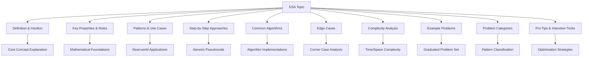
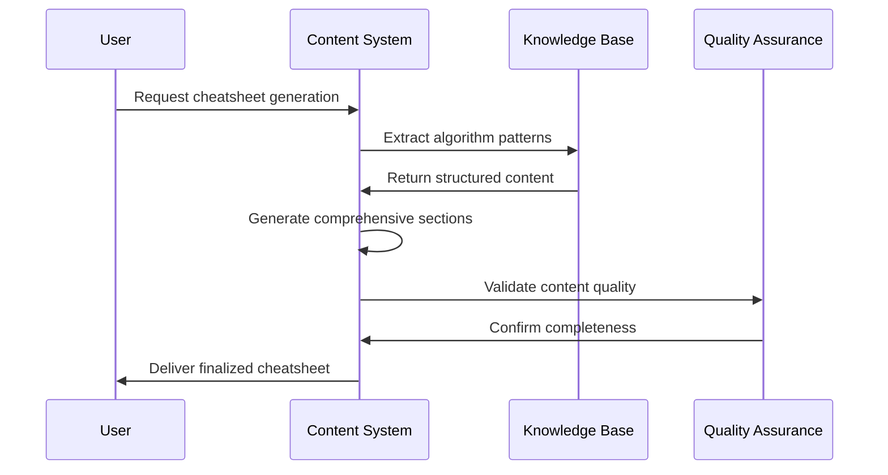
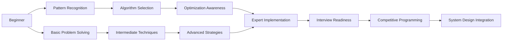

# DSA Cheatsheet Content Generation System Design

## Overview

This design document outlines the strategic approach for transforming existing empty markdown files in the `cheatsheettrickstips` folder into comprehensive Data Structures and Algorithms (DSA) cheatsheets. The system will generate detailed reference materials covering seven core DSA topics: Arrays, Dynamic Programming, Geometry, Graphs, Queue & Stack, Strings, and Trees.

The cheatsheets serve as comprehensive interview preparation resources, providing theoretical foundations, practical applications, algorithmic approaches, and problem-solving strategies. Each cheatsheet will contain a minimum of 6,000 words, structured to support rapid knowledge acquisition and retention for technical interviews and competitive programming.

## Architecture

### Content Structure Framework

The cheatsheet system follows a standardized 10-section architecture designed for optimal learning and reference:

### Target File Mapping

| File | Topic Coverage | Core Algorithms | Problem Complexity Range |
|------|---------------|-----------------|--------------------------|
| `array.md` | Array Manipulation, Two Pointers, Sliding Window, Sorting | Binary Search, Kadane's Algorithm, Dutch National Flag | Easy → Hard |
| `dp.md` | Dynamic Programming, Memoization, Optimization | Knapsack, LCS, Edit Distance, Coin Change | Medium → Hard |
| `geometry.md` | Computational Geometry, Coordinate Systems | Convex Hull, Line Intersection, Point-in-Polygon | Medium → Hard |
| `graph.md` | Graph Theory, Traversal, Shortest Paths | DFS, BFS, Dijkstra, Union-Find, Topological Sort | Easy → Hard |
| `queuestack.md` | Linear Data Structures, LIFO/FIFO | Monotonic Stack, Queue Operations, Deque | Easy → Medium |
| `string.md` | String Processing, Pattern Matching | KMP, Rabin-Karp, Trie, Suffix Arrays | Easy → Hard |
| `tree.md` | Tree Structures, Binary Trees, BST | Tree Traversals, LCA, Segment Trees, Fenwick Trees | Easy → Hard |

## Content Generation Strategy

### Section-by-Section Content Framework

#### Definition & Intuition
Provides foundational understanding through:
- Clear conceptual explanations in natural language
- Visual analogies and real-world metaphors
- Historical context and algorithmic motivation
- Relationship to broader computer science concepts

#### Key Properties & Rules
Documents essential characteristics including:
- Mathematical properties and invariants
- Fundamental constraints and limitations
- Performance characteristics and trade-offs
- Structural requirements and assumptions

#### Patterns & Use Cases
Identifies practical applications through:
- Common problem patterns and variations
- Industry-specific use cases
- Optimization scenarios and constraints
- Integration with other algorithmic techniques

#### Step-by-Step Approaches
Provides systematic problem-solving methodology:
- Generic algorithmic templates
- Decision trees for approach selection
- Pseudocode for common operations
- Implementation considerations and optimizations

#### Common Algorithms
Comprehensive algorithm coverage including:
- Detailed algorithm descriptions
- Implementation complexity analysis
- Variant algorithms and optimizations
- Comparative analysis of approaches

#### Edge Cases
Critical corner case documentation:
- Boundary conditions and limits
- Null and empty input handling
- Overflow and underflow scenarios
- Performance degradation cases

#### Complexity Analysis
Thorough performance evaluation:
- Big O notation for time complexity
- Space complexity analysis
- Best, average, and worst-case scenarios
- Amortized analysis where applicable

#### Example Problems
Curated problem sets featuring:
- Progressive difficulty levels (Easy → Medium → Hard)
- Diverse problem variations
- Solution approaches and optimizations
- Common pitfalls and debugging strategies

#### Problem Categories
Systematic pattern classification:
- Sub-pattern identification and grouping
- Cross-topic pattern relationships
- Problem difficulty progression
- Interview frequency and importance ratings

#### Pro Tips & Interview Tricks
Practical optimization strategies:
- Implementation shortcuts and optimizations
- Common mistakes and avoidance strategies
- Interview-specific preparation techniques
- Memory aids and mental models

## Detailed Topic Specifications

### Array Cheatsheet Design

**Core Focus Areas:**
- Array manipulation and transformation techniques
- Two-pointer methodologies for optimization
- Sliding window patterns for subarray problems
- In-place algorithm implementations
- Sorting and searching optimizations

**Algorithm Coverage:**
- Binary Search and variants (rotated arrays, duplicate elements)
- Kadane's Algorithm for maximum subarray
- Dutch National Flag for three-way partitioning
- Moore's Voting Algorithm for majority elements
- Cycle detection in arrays using Floyd's algorithm

**Problem Categories:**
- Subarray and subsequence problems
- Array rotation and reversal operations
- Duplicate detection and removal
- Merge operations and interval problems
- Matrix traversal and transformation

### Dynamic Programming Cheatsheet Design

**Core Focus Areas:**
- Memoization vs tabulation approaches
- State space design and transition functions
- Optimization problem solving strategies
- Multi-dimensional DP considerations
- Space optimization techniques

**Algorithm Coverage:**
- Classic DP patterns (Knapsack, LCS, Edit Distance)
- Interval DP for range-based problems
- Digit DP for number-based constraints
- Tree DP for hierarchical structures
- Bitmask DP for subset enumeration

**Problem Categories:**
- Linear DP (climbing stairs, house robber)
- 2D Grid DP (path counting, minimum path sum)
- String DP (palindromes, pattern matching)
- Subsequence DP (increasing subsequences)
- Game theory DP (optimal play strategies)

### Graph Cheatsheet Design

**Core Focus Areas:**
- Graph representation strategies
- Traversal algorithm optimizations
- Shortest path algorithms and applications
- Connected components and strongly connected components
- Topological sorting and cycle detection

**Algorithm Coverage:**
- DFS and BFS with optimization techniques
- Dijkstra's algorithm and A* search
- Bellman-Ford for negative edge handling
- Floyd-Warshall for all-pairs shortest paths
- Union-Find with path compression and union by rank

**Problem Categories:**
- Graph traversal and connectivity
- Shortest path and distance problems
- Minimum spanning tree construction
- Network flow and matching problems
- Graph coloring and scheduling

### Tree Cheatsheet Design

**Core Focus Areas:**
- Binary tree properties and operations
- Binary search tree maintenance
- Balanced tree structures and rotations
- Tree traversal optimizations
- Advanced tree data structures

**Algorithm Coverage:**
- Tree traversal algorithms (inorder, preorder, postorder)
- Lowest Common Ancestor algorithms
- Segment tree and Fenwick tree operations
- Trie construction and pattern matching
- Heavy-light decomposition for path queries

**Problem Categories:**
- Tree construction and validation
- Path and ancestor queries
- Tree modification and balancing
- Range query and update operations
- Tree-based dynamic programming

## Content Quality Assurance Framework

### Word Count Requirements

Each cheatsheet must achieve a minimum of 6,000 words through:
- Comprehensive theoretical explanations (1,500+ words)
- Detailed algorithm descriptions (1,200+ words)
- Extensive problem analysis (1,800+ words)
- Implementation strategies and optimizations (900+ words)
- Interview preparation content (600+ words)

### Content Validation Criteria

**Technical Accuracy:**
- Algorithm correctness verification
- Complexity analysis validation
- Edge case completeness assessment
- Code example testing and verification

**Educational Effectiveness:**
- Progressive difficulty structuring
- Clear explanation sequencing
- Practical applicability demonstration
- Memory aid integration

**Interview Preparation Value:**
- High-frequency problem coverage
- Company-specific pattern inclusion
- Time-constrained solution strategies
- Common mistake identification

## Implementation Considerations

### Content Generation Workflow

### Cross-Reference Integration

The cheatsheet system leverages existing visualization project content:
- Algorithm implementations from HTML files
- Problem patterns from category directories
- Educational content from existing documentation
- Interactive examples for concept reinforcement

### Maintenance and Evolution Strategy

**Content Updates:**
- Regular problem set refreshing with trending interview questions
- Algorithm optimization technique updates
- Industry-specific use case additions
- Performance benchmark updates

**Quality Improvements:**
- User feedback integration for clarity enhancement
- Expert review incorporation for technical accuracy
- Interview outcome analysis for effectiveness measurement
- Competitive programming trend integration

## Educational Impact Objectives

### Learning Outcome Targets

**Conceptual Understanding:**
- Deep comprehension of algorithmic principles
- Pattern recognition across problem domains
- Mathematical foundation establishment
- Complexity analysis proficiency

**Practical Application:**
- Efficient problem-solving methodology
- Implementation strategy selection
- Optimization technique application
- Debugging and troubleshooting skills

**Interview Performance:**
- Rapid problem pattern identification
- Structured solution articulation
- Time-efficient implementation
- Edge case consideration habits

### Skill Development Progression

The cheatsheet system serves as a comprehensive knowledge transfer mechanism, transforming theoretical understanding into practical problem-solving capability while maintaining focus on interview preparation and professional development objectives.