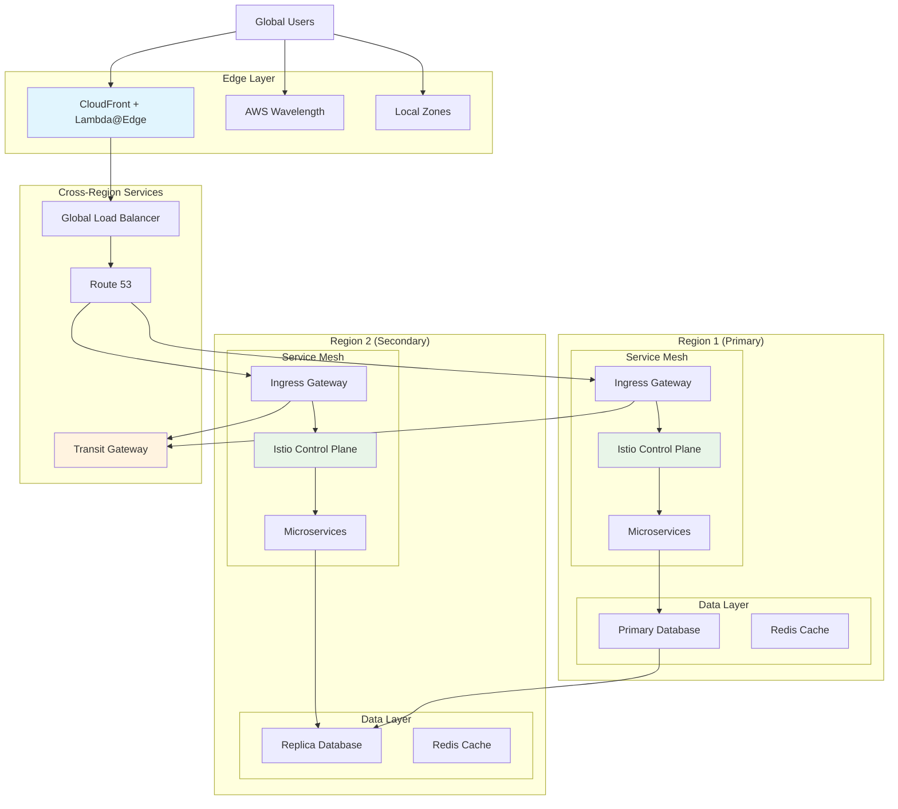

# Advanced Networking Patterns

## What are Advanced Networking Patterns and Why Should You Care?

Think of advanced networking patterns like the sophisticated traffic management systems used in major metropolitan areas. While basic networking is like having simple traffic lights and stop signs, advanced patterns are like having smart highway systems with dynamic routing, express lanes that adjust based on traffic conditions, and integrated multi-modal transportation networks.

Imagine you're designing the transportation infrastructure for a futuristic smart city:
- **Multi-region architectures** are like having multiple interconnected cities that work together seamlessly
- **Service mesh implementations** are like having an intelligent traffic control system that optimally routes every vehicle
- **Edge computing patterns** are like having neighborhood service centers so residents don't need to travel downtown for everything
- **Zero trust networking** is like having security checkpoints that verify every person and vehicle at every step of their journey

These patterns solve complex problems that simple networking approaches can't handle effectively, especially as your applications become more distributed, security-sensitive, and globally deployed.

**Critical business scenarios:**
1. **Global applications** - Serving users across continents with consistent performance and availability
2. **Complex microservices** - Managing communication between hundreds of interdependent services
3. **Regulatory compliance** - Meeting strict data residency and security requirements across multiple jurisdictions

## The Building Blocks

### Multi-Region Architecture: Building Connected Cities
**What it is:** Distributing your application infrastructure across multiple AWS regions to achieve global scale, improved performance, and disaster recovery capabilities.

**Real-world analogy:** Multi-region architecture is like a multinational corporation with regional headquarters around the world. Each location can operate independently if needed, but they're all connected and coordinated to provide seamless global service.

**Multi-Region Patterns:**

**Active-Active Multi-Region:**
- **All regions serve traffic simultaneously**
- Users are routed to the closest or best-performing region
- Data is synchronized between regions in near real-time
- Provides the best performance and highest availability
- More complex to implement and maintain

**Active-Passive (Disaster Recovery):**
- **Primary region handles all traffic**
- Secondary regions are ready but inactive
- Failover occurs only during primary region outages
- Simpler to implement but longer recovery times
- Lower ongoing costs but higher potential downtime

**Regional Specialization:**
- **Different regions serve different purposes**
- Example: US for North American users, Europe for EU compliance, Asia for APAC performance
- May have different data sets or application features per region
- Optimizes for specific regulatory or performance requirements

💡 **Pro Tip:** Start with active-passive for disaster recovery, then evolve to active-active as your requirements and complexity management capabilities mature.

### Microservices Networking: The Intelligent Traffic Grid
**What it is:** Sophisticated networking patterns designed to handle communication between large numbers of small, independent services.

**Real-world analogy:** Microservices networking is like managing a bustling downtown district where hundreds of businesses need to communicate with each other efficiently, securely, and reliably, despite constantly changing relationships and varying traffic patterns.

**Key Microservices Networking Challenges:**

**Service Discovery:**
- Services need to find each other dynamically
- Locations change as services scale up/down
- Health checking ensures traffic only goes to healthy instances
- Load balancing distributes traffic efficiently across instances

**Communication Patterns:**
- **Synchronous:** Direct API calls between services (REST, GraphQL)
- **Asynchronous:** Message queues and event streaming (SQS, SNS, Kinesis)
- **Mixed patterns:** Combination based on specific use case requirements

**Network Security:**
- **Service-to-service authentication:** Ensure services are who they claim to be
- **Encryption in transit:** Protect data flowing between services
- **Network segmentation:** Isolate services based on security requirements
- **Policy enforcement:** Centralized security policies across all services

### Edge Computing: Neighborhood Service Centers
**What it is:** Processing data and serving content from locations closer to end users to reduce latency and improve performance.

**Real-world analogy:** Edge computing is like having neighborhood service centers that can handle most common requests locally, so residents don't need to travel to the downtown headquarters for every transaction.

**AWS Edge Computing Services:**

**CloudFront with Lambda@Edge:**
- **Execute code at edge locations** during content delivery
- **Customize content** based on user location, device, or other criteria
- **A/B testing** and personalization at the edge
- **Security functions** like authentication and bot detection

**AWS Wavelength:**
- **Ultra-low latency** applications at 5G network edges
- **Real-time gaming** and augmented reality applications
- **IoT data processing** close to device locations
- **Edge analytics** for time-sensitive decisions

**Local Zones:**
- **AWS infrastructure** in metropolitan areas
- **Single-digit millisecond latency** for specific geographic areas
- **Media production** and real-time applications
- **Hybrid cloud** for latency-sensitive workloads

### Network Function Virtualization: Software-Defined Everything
**What it is:** Implementing traditional network hardware functions (firewalls, load balancers, routers) as software running on standard computing infrastructure.

**Real-world analogy:** Network Function Virtualization is like replacing physical traffic lights, toll booths, and inspection stations with smart software systems that can be instantly reconfigured, moved, or scaled up based on changing conditions.

**NFV in AWS:**

**Software Load Balancing:**
- **Application Load Balancer:** Layer 7 load balancing with advanced features
- **Network Load Balancer:** High-performance Layer 4 load balancing
- **Container-based load balancing:** Service mesh and ingress controllers

**Virtual Firewalls:**
- **AWS Network Firewall:** Managed network security service
- **Security Groups:** Instance-level virtual firewalls
- **Third-party solutions:** Partner firewalls running on EC2

**Software-Defined WAN:**
- **AWS Transit Gateway:** Centralized connectivity hub
- **VPC peering:** Direct VPC-to-VPC connections
- **AWS Direct Connect Gateway:** Multi-VPC connectivity over dedicated connections

## How Advanced Patterns Work Together

## Real-World Advanced Pattern Applications

### Global Gaming Platform
**Challenge:** Provide consistent, low-latency gaming experience to millions of players worldwide.

**Advanced Architecture:**
- **Multi-region deployment:** Game servers in 8 regions globally
- **Edge computing:** Lambda@Edge for player authentication and matchmaking
- **Service mesh:** Istio for complex inter-service communication
- **Real-time data sync:** Global database replication with conflict resolution

**Pattern Implementation:**
1. **Player connection:** Route to nearest region using Route 53 latency-based routing
2. **Matchmaking:** Edge functions match players from similar regions
3. **Game session:** Ultra-low latency communication using Wavelength zones
4. **Data persistence:** Multi-region database with eventual consistency
5. **Analytics:** Real-time event streaming across all regions

**Results:** Achieved sub-50ms latency for 95% of global players while maintaining 99.99% availability.

### Financial Services Microservices Platform
**Challenge:** Build a secure, compliant microservices platform for real-time financial transactions.

**Advanced Security Patterns:**
- **Zero trust networking:** Every service call is authenticated and encrypted
- **Service mesh security:** Mutual TLS for all inter-service communication
- **Network segmentation:** Different compliance zones with strict traffic controls
- **Multi-region compliance:** Data residency requirements across multiple jurisdictions

**Implementation:**
1. **Service mesh deployment:** Istio with comprehensive security policies
2. **Zero trust implementation:** No implicit trust between any services
3. **Compliance zones:** Separate network segments for different regulatory requirements
4. **Cross-region governance:** Centralized policy management across all regions
5. **Audit and monitoring:** Complete visibility into all network traffic

**Results:** Achieved SOC 2 and PCI compliance while processing millions of transactions daily.

### IoT Data Processing Platform
**Challenge:** Process and analyze data from millions of IoT devices with varying latency requirements.

**Edge-Heavy Architecture:**
- **Wavelength deployment:** Ultra-low latency processing for critical sensors
- **Lambda@Edge:** Data filtering and aggregation at edge locations
- **Multi-tier processing:** Real-time, near-real-time, and batch processing layers
- **Global data distribution:** Intelligent data placement based on access patterns

**Data Flow:**
1. **Device data:** Collected at nearest Wavelength or edge location
2. **Edge processing:** Critical decisions made locally with <10ms latency
3. **Regional aggregation:** Data summarized and forwarded to regional hubs
4. **Global analytics:** Cross-regional analysis for business insights
5. **Machine learning:** Global ML models updated with edge-processed data

**Results:** Reduced critical response times from 200ms to 8ms while processing 10TB of IoT data daily.

## Best Practices and Pro Tips

### Multi-Region Design Principles
💡 **Pro Tip:** Design for region failure from day one - don't try to retrofit multi-region capabilities later.

**Data consistency strategy:**
- **Choose consistency model carefully:** Strong vs. eventual consistency based on business requirements
- **Implement conflict resolution:** Define clear rules for handling data conflicts
- **Regional data placement:** Understand data residency and sovereignty requirements
- **Cross-region replication:** Balance consistency, performance, and cost

**Failover and recovery:**
- **Automated failover:** Implement automated detection and failover procedures
- **Graceful degradation:** Design services to function with reduced capabilities during failures
- **Recovery testing:** Regular testing of failover and recovery procedures
- **Monitoring and alerting:** Comprehensive monitoring across all regions

### Service Mesh Best Practices
💡 **Pro Tip:** Start with observability features of service mesh before implementing complex traffic management.

**Implementation strategy:**
- **Gradual adoption:** Start with a few services and expand systematically
- **Observability first:** Implement monitoring and tracing before advanced features
- **Security integration:** Integrate with existing security and compliance systems
- **Performance testing:** Understand service mesh overhead and plan accordingly

**Configuration management:**
- **GitOps for mesh config:** Manage service mesh configuration through version control
- **Environment parity:** Ensure consistency across development, staging, and production
- **Policy as code:** Define and manage security and traffic policies programmatically
- **Rollback procedures:** Plan for quick rollback of problematic configurations

### Edge Computing Optimization
💡 **Pro Tip:** Not all processing should be moved to the edge - carefully evaluate what benefits from edge placement.

**Edge placement decisions:**
- **Latency-sensitive operations:** Authentication, real-time decisions, content personalization
- **Bandwidth optimization:** Data filtering, compression, format optimization
- **User experience:** A/B testing, device-specific customization
- **Security functions:** DDoS protection, bot detection, rate limiting

**Cost optimization:**
- **Function efficiency:** Optimize edge functions for minimal execution time
- **Caching strategies:** Leverage edge caching to reduce origin requests
- **Regional distribution:** Balance edge presence with actual user distribution
- **Monitoring costs:** Track edge computing costs and optimize based on value delivered

### Zero Trust Network Implementation
💡 **Pro Tip:** Implement zero trust gradually - start with highest-risk services and expand systematically.

**Implementation phases:**
1. **Inventory and classify:** Understand all services and their security requirements
2. **Implement authentication:** Ensure all services can authenticate each other
3. **Encrypt communications:** Implement encryption for all inter-service communication
4. **Policy enforcement:** Define and enforce granular access policies
5. **Monitoring and audit:** Comprehensive logging and monitoring of all access

**Common challenges:**
- **Performance overhead:** Balance security with performance requirements
- **Complexity management:** Keep zero trust implementation manageable
- **Legacy integration:** Handle services that can't easily adopt zero trust principles
- **Operational overhead:** Ensure security team can manage increased complexity

## Integration with Emerging Technologies

### AI/ML Integration
- **Edge AI:** Machine learning inference at edge locations
- **Network optimization:** AI-driven traffic routing and optimization
- **Anomaly detection:** ML-based detection of unusual network patterns
- **Predictive scaling:** AI-driven capacity planning and auto-scaling

### Blockchain Integration
- **Distributed consensus:** Blockchain networks across multiple regions
- **Smart contract execution:** Edge computing for blockchain applications
- **Identity management:** Blockchain-based identity for zero trust networking
- **Supply chain tracking:** Global blockchain networks with edge data collection

### Quantum Computing Preparation
- **Quantum-safe encryption:** Preparing for post-quantum cryptography
- **Hybrid classical-quantum:** Network designs supporting quantum computing integration
- **Quantum key distribution:** Ultra-secure communication for sensitive applications

## Advanced Troubleshooting for Complex Patterns

### Multi-Region Debugging
**Challenges:** Distributed systems make troubleshooting more complex
**Solutions:**
- **Distributed tracing:** End-to-end request tracing across regions
- **Correlation IDs:** Track requests across all services and regions
- **Centralized logging:** Aggregate logs from all regions for analysis
- **Regional health dashboards:** Clear visibility into each region's status

### Service Mesh Observability
**Monitoring requirements:**
- **Service-to-service metrics:** Latency, error rates, traffic volume
- **Mesh control plane health:** Monitor Istio/service mesh infrastructure
- **Policy compliance:** Ensure security policies are being enforced
- **Performance impact:** Monitor overhead introduced by service mesh

### Edge Computing Monitoring
**Edge-specific challenges:**
- **Distributed monitoring:** Collecting metrics from hundreds of edge locations
- **Limited visibility:** Edge environments may have monitoring constraints
- **Performance optimization:** Identifying and optimizing slow edge functions
- **Cost tracking:** Understanding edge computing costs and ROI

Remember: Advanced networking patterns are like conducting a symphony orchestra where every musician is in a different city - it requires sophisticated coordination, clear communication protocols, and masterful orchestration to create beautiful music together!