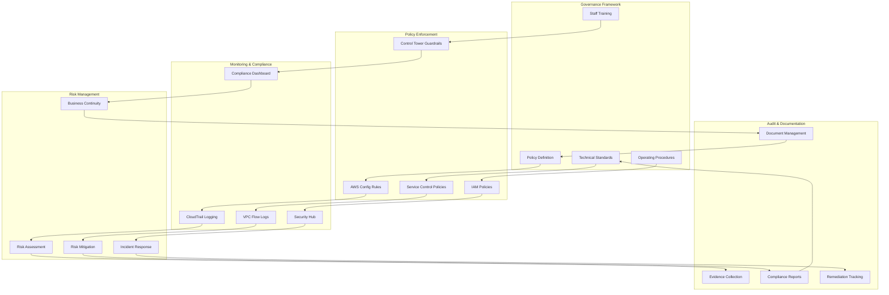

# Compliance and Governance

## What is Network Compliance and Governance and Why Should You Care?

Think of network compliance and governance like the legal framework and city planning regulations that govern how a major metropolitan area operates. Just as a city needs building codes, zoning laws, environmental regulations, and public safety standards to function properly and protect its citizens, your AWS network infrastructure needs comprehensive governance frameworks to ensure security, compliance, and operational excellence.

Imagine you're the chief regulatory officer for a smart city:
- **Network compliance** is like ensuring all buildings meet safety codes, environmental standards, and accessibility requirements
- **Policy enforcement** is like having automated systems that check permits and enforce regulations without requiring manual inspections
- **Audit trails** are like maintaining detailed records of every permit, inspection, and modification for regulatory review
- **Risk management** is like having contingency plans for natural disasters, security threats, and infrastructure failures

Without proper governance, your network infrastructure is like a city built without planning - it might work initially, but it becomes increasingly dangerous, inefficient, and impossible to manage as it grows.

**Critical business scenarios:**
1. **Regulatory compliance** - Meeting strict requirements for industries like healthcare, finance, and government
2. **Enterprise governance** - Maintaining consistent policies across large, complex organizations
3. **Security and risk management** - Protecting against threats while maintaining business continuity

## The Building Blocks

### Network Compliance Framework: The Legal Foundation
**What it is:** A structured approach to ensuring your network infrastructure meets all applicable regulatory, industry, and organizational requirements.

**Real-world analogy:** Network compliance is like having a comprehensive legal department that ensures every aspect of your city's operations meets federal, state, and local regulations. They don't just react to problems - they proactively ensure everything is designed and operated to meet all applicable standards.

**Common Compliance Requirements:**

**Data Residency and Sovereignty:**
- **Geographic restrictions:** Data must remain within specific countries or regions
- **Cross-border transfer limitations:** Strict controls on international data movement
- **Local processing requirements:** Some data must be processed locally, not in foreign cloud regions
- **Jurisdiction compliance:** Understanding which laws apply based on data location and user location

**Industry-Specific Regulations:**
- **HIPAA (Healthcare):** Strict data protection and access controls for medical information
- **PCI DSS (Payment Cards):** Network security requirements for credit card data processing
- **SOX (Financial Reporting):** Internal controls and audit trails for financial data
- **GDPR (EU Privacy):** Comprehensive data protection and privacy requirements

**Government and Defense:**
- **FedRAMP:** Cloud security requirements for US federal agencies
- **ITAR:** Export control regulations for defense and aerospace
- **IL4/IL5:** Department of Defense impact level requirements
- **FISMA:** Federal information security management requirements

💡 **Pro Tip:** Understand compliance requirements early in your architecture design - retrofitting compliance is much more expensive and complex.

### Policy Enforcement: The Automated Regulatory System
**What it is:** Automated systems and processes that ensure network configurations continuously meet policy requirements without relying on manual oversight.

**Real-world analogy:** Policy enforcement is like having smart city systems that automatically check building permits, monitor environmental compliance, and ensure safety standards are maintained. Instead of sending inspectors to every site manually, you have sensors and automated systems that continuously verify compliance.

**AWS Policy Enforcement Tools:**

**AWS Config:**
- **Configuration compliance:** Automatically check if resources meet defined standards
- **Drift detection:** Alert when configurations change from approved baselines
- **Remediation:** Automatically fix common compliance violations
- **Historical tracking:** Maintain complete audit trail of all configuration changes

**AWS Organizations:**
- **Service Control Policies (SCPs):** Prevent non-compliant actions across multiple accounts
- **Account governance:** Centralized management of multiple AWS accounts
- **Billing and cost controls:** Ensure spending stays within approved limits
- **Cross-account policy enforcement:** Consistent policies across entire organization

**IAM Policies and Roles:**
- **Least privilege access:** Ensure users only have necessary permissions
- **Role-based access control:** Organize permissions around job functions
- **Temporary access:** Time-limited permissions for specific tasks
- **Cross-account access:** Secure access across organizational boundaries

### Documentation and Audit Trails: The Historical Record
**What it is:** Comprehensive documentation and logging systems that provide complete visibility into network operations for compliance and audit purposes.

**Real-world analogy:** Documentation and audit trails are like having a city's complete historical record - every permit issued, every inspection performed, every modification made. When auditors or regulators ask questions, you can provide detailed, verifiable documentation of everything that happened and why.

**Documentation Requirements:**

**Network Architecture Documentation:**
- **Design documents:** Complete network topology and design rationale
- **Security documentation:** Security controls and their implementation
- **Change management:** Documentation of all changes and their approvals
- **Standard operating procedures:** Step-by-step procedures for common operations

**Audit Trail Components:**
- **CloudTrail logs:** Complete API call history with user attribution
- **VPC Flow Logs:** Network traffic analysis and security monitoring
- **Config history:** Changes to resource configurations over time
- **Access logs:** Who accessed what resources and when

### Risk Management: The Contingency Planning System
**What it is:** Systematic identification, assessment, and mitigation of risks that could impact network operations or compliance posture.

**Real-world analogy:** Risk management is like having a comprehensive emergency management system for your city. You've identified all potential threats (earthquakes, floods, cyber attacks), assessed their likelihood and impact, and developed specific response plans for each scenario.

**Network Risk Categories:**

**Security Risks:**
- **Data breaches:** Unauthorized access to sensitive information
- **DDoS attacks:** Service disruption from malicious traffic
- **Insider threats:** Risks from authorized users with malicious intent
- **Supply chain attacks:** Compromise through third-party services or software

**Operational Risks:**
- **Service outages:** Infrastructure failures affecting business operations
- **Configuration errors:** Human mistakes that compromise security or functionality
- **Capacity limitations:** Insufficient resources to handle demand
- **Dependency failures:** Third-party service failures affecting your operations

**Compliance Risks:**
- **Regulatory violations:** Actions that violate applicable laws or regulations
- **Policy drift:** Gradual deviation from approved configurations
- **Audit failures:** Inability to demonstrate compliance during audits
- **Data governance failures:** Improper handling of sensitive or regulated data

## How Compliance and Governance Work Together

## Real-World Compliance Applications

### Healthcare Data Platform (HIPAA Compliance)
**Challenge:** Build a healthcare analytics platform that processes protected health information (PHI) while meeting HIPAA requirements.

**Compliance Requirements:**
- **Data encryption:** All PHI must be encrypted in transit and at rest
- **Access controls:** Strict role-based access with audit trails
- **Data residency:** PHI must remain within approved geographic boundaries
- **Audit logging:** Complete audit trail of all PHI access and modifications

**Implementation Strategy:**
1. **Network isolation:** Dedicated VPCs for PHI processing with no internet access
2. **Encryption everywhere:** KMS encryption for all data storage and VPC endpoints for service access
3. **Access controls:** IAM roles with time-limited access and MFA requirements
4. **Monitoring:** Comprehensive logging with CloudTrail, Config, and VPC Flow Logs
5. **Documentation:** Detailed security policies and procedures documentation

**Results:** Achieved HIPAA compliance certification and passed multiple external audits.

### Financial Services Multi-Region Platform (SOX/PCI Compliance)
**Challenge:** Global investment firm needs multi-region trading platform meeting SOX and PCI DSS requirements.

**Complex Compliance Requirements:**
- **Data segregation:** Trading data must be isolated from other business data
- **Change controls:** All infrastructure changes require approval and audit trails
- **Access segregation:** Separation of duties between development and production access
- **Cross-border controls:** Different regulations in each operating jurisdiction

**Governance Implementation:**
1. **Multi-account strategy:** Separate accounts for different business functions and environments
2. **Centralized policy management:** AWS Organizations with SCPs for consistent policy enforcement
3. **Automated compliance checking:** Config rules for continuous compliance monitoring
4. **Regional data governance:** Different compliance configurations for different jurisdictions
5. **Comprehensive audit trails:** Centralized logging and monitoring across all accounts and regions

**Results:** Passed SOX 404 audit and achieved PCI DSS Level 1 certification across all regions.

### Government Cloud Platform (FedRAMP Compliance)
**Challenge:** Deploy cloud platform for US federal agencies meeting FedRAMP High requirements.

**Stringent Security Requirements:**
- **Continuous monitoring:** Real-time security monitoring and incident response
- **Strict access controls:** Multi-factor authentication and privileged access management
- **Data protection:** Advanced encryption and data loss prevention
- **Supply chain security:** Verification of all components and dependencies

**Implementation Approach:**
1. **AWS GovCloud deployment:** Use FedRAMP-authorized cloud infrastructure
2. **Comprehensive monitoring:** Deploy Security Hub, GuardDuty, and custom monitoring solutions
3. **Zero trust architecture:** No implicit trust between any system components
4. **Automated compliance:** Continuous compliance checking and automated remediation
5. **Regular auditing:** Quarterly compliance assessments and external audits

**Results:** Achieved FedRAMP High authorization and serves multiple federal agencies.

## Best Practices and Pro Tips

### Compliance-First Architecture Design
💡 **Pro Tip:** Build compliance requirements into your architecture from the beginning - don't try to add them later.

**Design principles:**
- **Data classification:** Understand what types of data you're handling and their requirements
- **Principle of least privilege:** Design access controls to provide minimum necessary permissions
- **Defense in depth:** Multiple layers of security controls for comprehensive protection
- **Audit by design:** Build in logging and monitoring capabilities from the start

**Architecture patterns:**
- **Network segmentation:** Isolate different types of data and workloads
- **Encrypted communications:** All network traffic should be encrypted
- **Centralized logging:** Aggregate all logs for comprehensive audit trails
- **Automated compliance checking:** Build compliance verification into your deployment processes

### Policy Management Strategy
💡 **Pro Tip:** Start with a small set of critical policies and gradually expand rather than trying to implement everything at once.

**Policy development:**
- **Risk-based prioritization:** Focus on policies that address the highest risks first
- **Clear documentation:** Policies should be clearly written and easily understood
- **Regular review:** Policies should be reviewed and updated regularly
- **Exception handling:** Clear process for handling policy exceptions when necessary

**Implementation approach:**
- **Gradual rollout:** Implement policies in phases to avoid overwhelming teams
- **Testing and validation:** Test policies in non-production environments first
- **Training and communication:** Ensure all team members understand policy requirements
- **Monitoring and enforcement:** Continuous monitoring to ensure policies are being followed

### Audit Preparation and Management
💡 **Pro Tip:** Maintain audit readiness continuously rather than scrambling when audits are announced.

**Ongoing audit preparation:**
- **Documentation maintenance:** Keep all compliance documentation current and organized
- **Evidence collection:** Systematically collect and organize evidence of compliance
- **Regular self-assessments:** Perform internal audits to identify and fix issues
- **Remediation tracking:** Maintain clear tracking of all compliance issues and their resolution

**Audit execution:**
- **Clear point of contact:** Designate experienced team members to work with auditors
- **Evidence presentation:** Organize evidence in clear, easy-to-understand formats
- **Responsive communication:** Provide timely responses to auditor requests
- **Continuous improvement:** Use audit findings to improve compliance processes

### Risk Management Integration
💡 **Pro Tip:** Integrate compliance risk management with your overall business risk management processes.

**Risk assessment process:**
- **Regular risk assessments:** Systematic evaluation of compliance risks
- **Threat modeling:** Understand specific threats to your compliance posture
- **Impact analysis:** Understand business impact of different compliance failures
- **Mitigation planning:** Develop specific plans to address identified risks

**Risk monitoring:**
- **Continuous monitoring:** Real-time monitoring of compliance-related risks
- **Incident response:** Clear procedures for responding to compliance incidents
- **Regular reporting:** Regular risk reporting to management and stakeholders
- **Improvement cycles:** Use risk information to continuously improve compliance posture

## Common Compliance Challenges and Solutions

### Challenge: "Compliance requirements are constantly changing!"
**Symptoms:** Difficulty keeping up with regulatory changes, frequent compliance violations

**Solutions:**
- **Regulatory monitoring:** Subscribe to regulatory updates and industry publications
- **Legal consultation:** Regular consultation with compliance and legal experts
- **Flexible architecture:** Design systems that can adapt to changing requirements
- **Automated compliance checking:** Implement automated tools that can be updated as requirements change

### Challenge: "Multi-region compliance is too complex!"
**Symptoms:** Different requirements in different jurisdictions, conflicting regulations

**Solutions:**
- **Regional specialization:** Design different compliance approaches for different regions
- **Data sovereignty planning:** Careful planning of data location and movement
- **Local expertise:** Work with local compliance experts in each jurisdiction
- **Centralized governance:** Maintain centralized oversight while allowing regional flexibility

### Challenge: "Audit preparation is overwhelming!"
**Symptoms:** Panic when audits are announced, difficulty finding required evidence

**Solutions:**
- **Continuous audit readiness:** Maintain audit-ready documentation continuously
- **Automated evidence collection:** Use tools to automatically collect and organize compliance evidence
- **Regular self-audits:** Perform internal audits to identify and fix issues proactively
- **Clear documentation standards:** Maintain consistent, high-quality documentation

### Challenge: "Compliance is slowing down development!"
**Symptoms:** Long delays for compliance reviews, development teams frustrated with compliance requirements

**Solutions:**
- **Shift-left compliance:** Build compliance checking into development processes
- **Automated compliance testing:** Automate compliance verification in CI/CD pipelines
- **Developer training:** Train developers on compliance requirements and best practices
- **Clear guidance:** Provide clear, actionable guidance for meeting compliance requirements

## Integration with DevOps and Automation

### Compliance as Code
**Pattern:** Implement compliance requirements as code that can be version-controlled, tested, and automated.

**Implementation:**
- **Policy as code:** Define compliance policies in code using tools like Open Policy Agent
- **Infrastructure as code:** Include compliance requirements in infrastructure templates
- **Automated testing:** Test compliance requirements as part of CI/CD pipelines
- **Configuration management:** Manage compliance configurations through version control

### Continuous Compliance Monitoring
**Pattern:** Continuous monitoring and automated remediation of compliance issues.

**Components:**
- **Real-time monitoring:** Continuous monitoring of compliance status
- **Automated remediation:** Automatic fixing of common compliance issues
- **Alert integration:** Integration with incident response and notification systems
- **Trend analysis:** Analysis of compliance trends and patterns over time

### Compliance Integration in CI/CD
**Pattern:** Integration of compliance checking into development and deployment processes.

**Pipeline integration:**
- **Pre-deployment checks:** Verify compliance before deploying changes
- **Security scanning:** Automated security and compliance scanning of code and infrastructure
- **Approval workflows:** Required approvals for changes affecting compliance
- **Rollback procedures:** Quick rollback procedures for compliance violations

Remember: Compliance and governance are like having a well-designed legal framework for your digital city - they provide the structure and protection needed for sustainable growth while ensuring everyone operates safely and responsibly within the established guidelines!