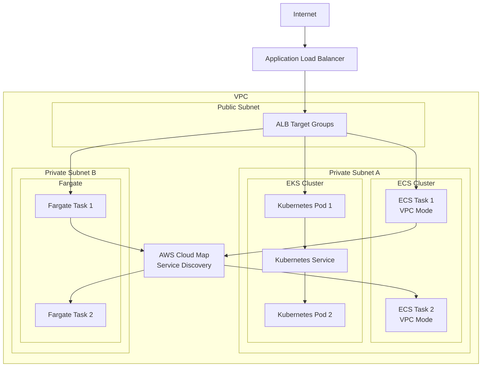

# Container Networking

## What is Container Networking and Why Should You Care?

Think of container networking like designing the communication system for a massive shipping port where thousands of containers are constantly arriving, departing, and being rearranged. Each container needs to:
- Find and communicate with other containers
- Access external services and the internet
- Be discovered by load balancers and users
- Maintain security boundaries
- Scale up and down dynamically

In the traditional world, you might have a few large buildings (VMs) with known addresses. In the container world, you have thousands of small apartments (containers) that are constantly moving between different buildings, and you need a smart system to keep track of where everything is and how it all connects.

**Critical business scenarios:**
1. **Microservices architecture** - Dozens of containerized services need to discover and communicate with each other
2. **Auto-scaling applications** - Containers are created and destroyed based on demand, requiring dynamic networking
3. **Multi-environment deployments** - Same application runs across development, staging, and production with different networking requirements

## The Building Blocks

### ECS Networking: The Managed Container Platform
**What it is:** Amazon ECS (Elastic Container Service) with built-in networking that integrates seamlessly with AWS VPC.

**Real-world analogy:** ECS networking is like having a smart apartment complex manager who automatically assigns addresses to new residents, sets up their internet connections, updates the building directory, and ensures everyone can find each other - all without you having to manage the details.

**ECS Network Modes:**

**AWS VPC Mode (Recommended):**
- Each task gets its own elastic network interface (ENI)
- Full VPC networking features (security groups, NACLs)
- Direct integration with load balancers
- Think of it like giving each container its own apartment with a unique address

**Bridge Mode (Legacy):**
- Containers share the host's network interface
- Port mapping required to avoid conflicts
- Like having multiple roommates share one phone line - requires careful coordination

**Host Mode:**
- Containers use the host's network directly
- Highest performance but limited security isolation
- Like containers living directly in the host's house with no privacy walls

💡 **Pro Tip:** Always use AWS VPC mode for new ECS deployments. It provides the best security and integration with AWS services.

### EKS Networking: The Kubernetes Container Platform
**What it is:** Amazon EKS (Elastic Kubernetes Service) networking that provides Kubernetes-native networking on AWS infrastructure.

**Real-world analogy:** EKS networking is like managing a dynamic city where neighborhoods (pods) can contain multiple businesses (containers), and you need both internal streets (cluster networking) and highways (external connectivity) that can rapidly reconfigure as the city grows and changes.

**EKS Networking Components:**

**CNI (Container Network Interface) Plugin:**
- **AWS VPC CNI:** Default plugin that assigns VPC IP addresses to pods
- **Alternative CNIs:** Calico, Weave, Cilium for advanced networking features
- Think of CNI like the city planning department that decides how streets are laid out

**Pod Networking:**
- Each pod gets its own IP address from the VPC subnet
- Pods can communicate directly without NAT
- Like each apartment building having its own address on the city grid

**Service Discovery:**
- Kubernetes Services provide stable endpoints for dynamic pods
- Integrated with AWS load balancers for external access
- Like having a phone book that automatically updates when businesses move

### Fargate Networking: The Serverless Container Platform
**What it is:** AWS Fargate provides serverless container networking where you don't manage the underlying infrastructure.

**Real-world analogy:** Fargate networking is like staying in a luxury hotel where you get your own room (container) with full amenities (networking), but you don't need to worry about how the building is managed, who maintains the elevators, or how the internet connection works.

**Fargate Features:**
- **Automatic ENI assignment:** Each task gets its own network interface
- **VPC integration:** Full VPC networking without managing hosts
- **Security group assignment:** Direct security group assignment to tasks
- **No host management:** AWS handles all underlying networking infrastructure

**When to use Fargate:**
- You want to focus on applications, not infrastructure
- Variable or unpredictable workloads
- Development and testing environments
- Applications that don't require specific host configurations

## How Container Networking Works Together

## Real-World Applications

### Microservices E-commerce Platform
**Challenge:** 20+ microservices need to communicate reliably while scaling independently.

**ECS Architecture:**
- **Service Discovery:** AWS Cloud Map for automatic service registration
- **Load Balancing:** ALB with target groups for each service
- **Security:** Service-specific security groups
- **Scaling:** Auto Scaling based on CloudWatch metrics

**Service Communication Flow:**
1. User requests → ALB → Frontend service (ECS task)
2. Frontend → Service Discovery → User service
3. User service → Service Discovery → Payment service
4. Payment service → Service Discovery → Inventory service
5. All communications secured by service-specific security groups

### CI/CD Pipeline with Containers
**Challenge:** Build, test, and deploy applications using containerized pipelines.

**EKS Architecture:**
- **Build agents:** Kubernetes jobs for building applications
- **Test environments:** Ephemeral pods for running tests
- **Deployment:** Helm charts for application deployment
- **Monitoring:** Prometheus and Grafana for observability

**Pipeline Flow:**
1. Code commit triggers Jenkins running on EKS
2. Build job creates new pod for compilation
3. Test pods run automated tests in parallel
4. Successful builds trigger deployment to staging
5. Manual approval promotes to production

### Batch Processing with Fargate
**Challenge:** Process large datasets with variable compute requirements.

**Fargate Architecture:**
- **Event-driven:** S3 events trigger batch jobs
- **Auto-scaling:** Jobs scale from 0 to hundreds based on queue size
- **Cost optimization:** Pay only for actual compute time
- **No infrastructure management:** Focus purely on application logic

**Processing Flow:**
1. Data files uploaded to S3
2. Lambda function submits batch jobs to ECS
3. Fargate tasks automatically scale to process queue
4. Results written back to S3
5. Tasks automatically terminate when complete

## Best Practices and Pro Tips

### ECS Networking Best Practices
💡 **Pro Tip:** Use service discovery instead of hard-coded endpoints for service communication.

**Task Definition Optimization:**
- **Use AWS VPC mode** for all new services
- **Assign specific security groups** to each service type
- **Enable service discovery** for dynamic service location
- **Configure health checks** for reliable load balancing

**Resource Allocation:**
- **Right-size task resources** based on actual usage patterns
- **Use placement strategies** to optimize resource utilization
- **Monitor task networking metrics** with CloudWatch

### EKS Networking Best Practices
💡 **Pro Tip:** Plan your IP address space carefully - EKS can consume IP addresses quickly.

**CNI Configuration:**
- **Monitor IP address utilization** in your subnets
- **Use secondary CIDR blocks** if you run out of IPs
- **Consider alternative CNIs** for advanced networking features
- **Implement network policies** for pod-to-pod security

**Service Design:**
- **Use headless services** for direct pod communication
- **Implement readiness and liveness probes** for reliable networking
- **Leverage service mesh** (like Istio) for advanced traffic management
- **Monitor service discovery** with Kubernetes metrics

### Fargate Networking Best Practices
💡 **Pro Tip:** Fargate networking is simplified, but security groups and subnet design still matter.

**Security Configuration:**
- **Use least-privilege security groups** for each task type
- **Place Fargate tasks in private subnets** when possible
- **Implement proper IAM roles** for task networking access
- **Monitor network traffic** with VPC Flow Logs

**Performance Optimization:**
- **Choose appropriate subnet placement** for latency requirements
- **Use ALB target groups** for efficient load distribution
- **Implement connection pooling** in applications
- **Monitor network performance metrics**

## Common Challenges and Solutions

### Challenge: "Containers can't find each other!"
**Symptoms:** Service discovery failures, connection timeouts between services

**ECS Solutions:**
- **Verify service discovery configuration:** Ensure services are registered in Cloud Map
- **Check security groups:** Confirm services can communicate on required ports
- **DNS resolution:** Verify tasks can resolve service discovery names
- **Network connectivity:** Test basic connectivity between subnets

**EKS Solutions:**
- **Kubernetes service configuration:** Ensure services are properly defined
- **CoreDNS functionality:** Verify cluster DNS is working correctly
- **Network policies:** Check if network policies are blocking communication
- **CNI troubleshooting:** Verify CNI plugin is functioning correctly

### Challenge: "Running out of IP addresses!"
**Symptoms:** Pods/tasks fail to start, IP allocation errors

**Solutions:**
- **Add secondary CIDR blocks** to your VPC
- **Use multiple subnets** across availability zones
- **Implement IP address monitoring** with CloudWatch
- **Consider alternative CNI plugins** that use fewer IPs
- **Right-size your clusters** to avoid IP waste

### Challenge: "Container networking performance is poor!"
**Symptoms:** High latency between services, low throughput

**Optimization strategies:**
- **Use placement groups** for high-performance computing
- **Enable enhanced networking** on EC2 instances
- **Optimize instance types** for network performance
- **Implement connection pooling** and keep-alive connections
- **Monitor network metrics** to identify bottlenecks

### Challenge: "Security groups are becoming unmanageable!"
**Symptoms:** Hundreds of security group rules, unclear access patterns

**Solutions:**
- **Use service-based security groups** instead of instance-based
- **Implement automation** for security group management
- **Regular auditing** and cleanup of unused rules
- **Documentation** of security group purposes and relationships

## Integration Points

### With AWS Load Balancers
- **Application Load Balancer:** Automatic target registration for ECS and EKS
- **Network Load Balancer:** High-performance load balancing for low-latency applications
- **Target group integration:** Dynamic registration/deregistration of containers

### With Service Discovery
- **AWS Cloud Map:** Native integration with ECS and EKS
- **Kubernetes Services:** Built-in service discovery for EKS
- **Route 53 integration:** DNS-based service discovery across AWS

### With Monitoring Services
- **CloudWatch Container Insights:** Detailed container and cluster metrics
- **X-Ray:** Distributed tracing for containerized applications
- **Prometheus/Grafana:** Popular open-source monitoring stack for Kubernetes

### With Security Services
- **IAM roles for tasks:** Fine-grained permissions for containers
- **Secrets Manager:** Secure secrets injection into containers
- **Parameter Store:** Configuration management for containerized applications

## Advanced Container Networking Patterns

### Service Mesh Architecture
**Pattern:** Use a dedicated infrastructure layer for service-to-service communication.

**Implementation options:**
- **AWS App Mesh:** Managed service mesh for ECS and EKS
- **Istio on EKS:** Open-source service mesh with advanced features
- **Linkerd:** Lightweight service mesh focused on simplicity

**Benefits:**
- **Traffic management:** Advanced routing, retry, and failover capabilities
- **Security:** Mutual TLS encryption between services
- **Observability:** Detailed metrics and tracing for all service interactions

### Multi-Cluster Networking
**Pattern:** Connect multiple EKS clusters across regions or environments.

**Implementation:**
- **VPC Peering:** Connect clusters in different VPCs
- **Transit Gateway:** Hub-and-spoke connectivity for multiple clusters
- **Service mesh:** Cross-cluster service discovery and communication

### GitOps with Container Networking
**Pattern:** Infrastructure and application deployment managed through Git workflows.

**Tools and practices:**
- **ArgoCD/Flux:** GitOps operators for Kubernetes
- **Infrastructure as Code:** Terraform/CloudFormation for network infrastructure
- **Automated validation:** Testing network configurations before deployment

Remember: Container networking is like conducting an orchestra where every musician (container) needs to know when to play, who to listen to, and how to harmonize with others. The conductor (your networking strategy) ensures everything works together beautifully!