# Cost Optimization

## What is Network Cost Optimization and Why Should You Care?

Think of network cost optimization like being the budget director for a major transportation system. You need to ensure people and goods can move efficiently while keeping costs under control. Just as a city might have expensive toll roads, free surface streets, and cost-effective public transit options, AWS networking has various cost models that can dramatically impact your bill.

Imagine you're managing transportation costs for a large corporation:
- **Data transfer optimization** is like choosing between expensive overnight shipping and cost-effective ground transportation
- **Infrastructure right-sizing** is like not renting a massive truck when a small van will do
- **Traffic engineering** is like routing deliveries to avoid toll roads and minimize fuel costs
- **Usage monitoring** is like having GPS tracking that shows exactly where your transportation budget is going

Poor network cost management is like having a fleet of vehicles with no fuel efficiency monitoring - you might be spending 10x more than necessary and not even realize it until the monthly bill arrives.

**Critical business scenarios:**
1. **Unexpected data transfer charges** - When your AWS bill suddenly spikes due to inefficient data transfer patterns
2. **Over-provisioned infrastructure** - Paying for network capacity you don't actually need
3. **Multi-region deployments** - Balancing performance requirements with data transfer costs

## The Building Blocks

### Data Transfer Cost Management: Optimizing Your Shipping Routes
**What it is:** Understanding and optimizing the various charges associated with moving data in, out, and within AWS.

**Real-world analogy:** Data transfer costs are like shipping charges for a global business. Local deliveries within the same city (AZ) might be free, regional shipping (within AWS region) costs a moderate amount, and international shipping (out to internet) costs the most. Smart logistics planning can save enormous amounts of money.

**AWS Data Transfer Cost Structure:**

**Free Data Transfer:**
- **Inbound to AWS:** Most data coming into AWS is free
- **Same-AZ traffic:** Communication within the same availability zone
- **CloudFront to origins:** Traffic from CloudFront edge locations to AWS origins
- **Between AWS services:** Some service-to-service communication is free

**Moderate Cost Data Transfer:**
- **Cross-AZ within region:** Traffic between availability zones in same region
- **Cross-region within AWS:** Traffic between different AWS regions
- **VPC peering:** Traffic across VPC peering connections

**Higher Cost Data Transfer:**
- **Outbound to internet:** Traffic leaving AWS to external destinations
- **Direct Connect:** Dedicated connection data processing charges
- **Cross-region to internet:** Data leaving AWS from regions far from users

💡 **Pro Tip:** The biggest networking cost surprise is usually outbound data transfer - monitor this closely and optimize early.

### Infrastructure Right-Sizing: Not Paying for a Limousine When You Need a Compact Car
**What it is:** Matching your network infrastructure capacity to your actual requirements.

**Real-world analogy:** Infrastructure right-sizing is like choosing the right vehicle for each job. You wouldn't rent a massive moving truck to pick up groceries, and you wouldn't use a small car to move furniture. Each network component should match its intended workload.

**Common Right-Sizing Opportunities:**

**Load Balancer Optimization:**
- **ALB vs NLB:** Choose based on actual requirements, not just preference
- **Target group consolidation:** Reduce number of target groups where possible
- **Health check frequency:** Balance responsiveness with cost
- **Cross-zone load balancing:** Understand when the improved distribution justifies the cost

**NAT Gateway Sizing:**
- **Bandwidth tiers:** Choose appropriate performance tier for your needs
- **Regional deployment:** Balance redundancy needs with cost
- **Alternative patterns:** Consider VPC endpoints to reduce NAT Gateway usage

**Direct Connect Capacity:**
- **Start small:** Begin with smaller capacity and scale based on actual usage
- **Hosted connections:** Consider hosted connections for smaller bandwidth needs
- **Multiple connections:** Sometimes multiple smaller connections are more cost-effective

### Traffic Engineering for Cost Optimization: Smart Route Planning
**What it is:** Designing your network architecture to minimize expensive data transfers while maintaining performance.

**Real-world analogy:** Traffic engineering for cost is like being a smart logistics coordinator who finds ways to deliver everything customers need while avoiding expensive toll roads, peak-hour surcharges, and unnecessary long-distance trips.

**Cost-Aware Architecture Patterns:**

**Locality Optimization:**
- **Process data where it lives:** Avoid moving large datasets unnecessarily
- **Regional data placement:** Store data close to where it's processed
- **Caching strategies:** Reduce repetitive data transfers with intelligent caching
- **Edge processing:** Use Lambda@Edge to process requests closer to users

**Service Integration Optimization:**
- **VPC endpoints:** Avoid internet charges for AWS service communication
- **Same-AZ placement:** Keep tightly coupled services in same availability zone
- **Efficient protocols:** Choose protocols that minimize chatter and overhead
- **Compression:** Implement data compression for large transfers

### Cost Monitoring and Analysis: Your Financial Dashboard
**What it is:** Comprehensive tracking and analysis of network-related costs to identify optimization opportunities.

**Real-world analogy:** Cost monitoring is like having a detailed expense tracking system that shows exactly where every dollar goes, identifies trends and anomalies, and provides actionable insights for reducing costs without impacting service quality.

**Key Cost Monitoring Components:**

**AWS Cost Explorer:**
- **Service-level breakdown:** See costs by individual AWS services
- **Resource-level detail:** Identify expensive individual resources
- **Trend analysis:** Understand how costs change over time
- **Forecasting:** Predict future costs based on current trends

**Custom Cost Tracking:**
- **Resource tagging:** Tag resources to track costs by project, environment, or team
- **Cost allocation:** Understand which business units or applications drive costs
- **Budget alerts:** Proactive notifications when costs exceed thresholds
- **Regular reviews:** Scheduled cost optimization reviews

## How Cost Optimization Works Together

```mermaid
graph TB
    subgraph "Cost Optimization Strategy"
        Monitor[Cost Monitoring]
        Analyze[Cost Analysis]
        Optimize[Optimization Implementation]
        Validate[Cost Validation]
    end
    
    subgraph "Data Transfer Optimization"
        VPCEnd[VPC Endpoints]
        CDN[CloudFront CDN]
        Caching[Intelligent Caching]
        Compression[Data Compression]
    end
    
    subgraph "Infrastructure Right-Sizing"
        LBSize[Load Balancer Sizing]
        NATSize[NAT Gateway Optimization]
        DXSize[Direct Connect Sizing]
        InstanceSize[Instance Optimization]
    end
    
    subgraph "Traffic Engineering"
        SameAZ[Same-AZ Placement]
        LocalProcess[Local Processing]
        EfficientProtocols[Protocol Optimization]
        BatchOps[Batch Operations]
    end
    
    subgraph "Monitoring Tools"
        CostExplorer[AWS Cost Explorer]
        CloudWatch[CloudWatch Metrics]
        Budgets[AWS Budgets]
        Tags[Resource Tagging]
    end
    
    Monitor --> Analyze
    Analyze --> Optimize
    Optimize --> Validate
    Validate --> Monitor
    
    Optimize --> VPCEnd
    Optimize --> CDN
    Optimize --> Caching
    
    Optimize --> LBSize
    Optimize --> NATSize
    Optimize --> DXSize
    
    Optimize --> SameAZ
    Optimize --> LocalProcess
    Optimize --> EfficientProtocols
    
    Monitor --> CostExplorer
    Monitor --> CloudWatch
    Monitor --> Budgets
    Monitor --> Tags
```

## Real-World Cost Optimization Applications

### E-commerce Platform Cost Reduction
**Challenge:** E-commerce company's AWS bill doubled after implementing global expansion, primarily due to data transfer costs.

**Cost Analysis Findings:**
- 60% of costs from outbound data transfer for product images
- Redundant cross-region data replication
- Inefficient API calls generating excessive traffic
- Over-provisioned NAT Gateways in all regions

**Optimization Strategy:**
1. **CloudFront implementation:** Reduced origin data transfer by 80%
2. **S3 Transfer Acceleration:** Faster uploads with lower costs
3. **VPC endpoints:** Eliminated internet charges for AWS service access
4. **Regional optimization:** Consolidated to fewer regions with strategic placement

**Results:** 65% reduction in network costs while improving global performance.

### Data Analytics Pipeline Optimization
**Challenge:** Big data company facing massive data transfer costs for analytics workloads.

**Cost Challenge:**
- Processing 10TB daily across multiple AWS services
- Cross-region data movement for compliance requirements
- High Direct Connect costs with inconsistent utilization
- Expensive cross-AZ traffic for distributed processing

**Optimization Approach:**
1. **Data locality:** Moved processing closer to data sources
2. **Compression implementation:** Reduced data transfer volumes by 40%
3. **VPC endpoints:** Free S3 and DynamoDB access from VPC
4. **Regional strategy:** Optimized regional data placement for compliance and cost
5. **Direct Connect optimization:** Right-sized capacity and implemented traffic engineering

**Results:** 50% reduction in data transfer costs while maintaining processing performance.

### Startup Infrastructure Cost Management
**Challenge:** Rapidly growing startup needs to optimize network costs while scaling infrastructure.

**Cost Constraints:**
- Limited budget requiring careful cost management
- Unpredictable traffic patterns making capacity planning difficult
- Need for high availability without over-provisioning

**Optimization Strategy:**
1. **Auto Scaling integration:** Dynamic capacity based on actual demand
2. **Burstable instances:** Cost-effective for variable workloads
3. **Reserved capacity:** Committed to baseline capacity for predictable savings
4. **Cost monitoring automation:** Automated alerts and optimization recommendations

**Results:** Maintained 99.9% availability while keeping network costs under 5% of total infrastructure budget.

## Best Practices and Pro Tips

### Data Transfer Cost Management
💡 **Pro Tip:** Use CloudFront for any content served to users - it almost always reduces costs while improving performance.

**Effective strategies:**
- **CloudFront for everything:** Not just static content, but dynamic content too
- **VPC endpoints first:** Always check if VPC endpoints can replace internet routing
- **Regional consolidation:** Carefully evaluate whether you need resources in every region
- **Compression everywhere:** Implement compression for all data transfers over 1MB

**Cost monitoring:**
- **Set up billing alerts:** Get notified before costs spiral out of control
- **Regular cost reviews:** Monthly analysis of data transfer patterns
- **Tag everything:** Use consistent tagging for accurate cost allocation
- **Trend analysis:** Understand seasonal and growth patterns in your costs

### Infrastructure Optimization Strategy
💡 **Pro Tip:** Start with monitoring and measurement before making optimization changes.

**Right-sizing methodology:**
1. **Establish baselines:** Understand current utilization and costs
2. **Identify opportunities:** Look for over-provisioned or underutilized resources
3. **Test changes:** Implement optimizations in non-production first
4. **Measure impact:** Verify both cost and performance impact
5. **Iterate:** Continuously optimize based on changing requirements

**Common optimization wins:**
- **Load balancer consolidation:** Combine similar applications under fewer load balancers
- **NAT Gateway optimization:** Consider shared NAT Gateways for lower-traffic environments
- **Instance family updates:** Newer instance families often offer better price/performance
- **Reserved Instance strategy:** Commit to baseline capacity for significant discounts

### Architectural Cost Optimization
💡 **Pro Tip:** Design cost-awareness into your architecture from the beginning - retrofitting is much harder.

**Cost-aware design principles:**
- **Data gravity:** Keep processing close to data storage
- **Service locality:** Place related services in the same AZ when possible
- **Efficient communication:** Design APIs to minimize chattiness
- **Caching layers:** Implement multiple levels of caching to reduce origin traffic

**Multi-region strategy:**
- **Selective replication:** Only replicate data that actually needs to be in multiple regions
- **Regional specialization:** Different regions can serve different purposes
- **Traffic engineering:** Route traffic efficiently to minimize cross-region charges
- **Compliance optimization:** Meet requirements with minimal data movement

## Common Cost Optimization Challenges

### Challenge: "Our data transfer costs are out of control!"
**Symptoms:** Unexpected spikes in AWS bills, high percentage of costs from data transfer

**Diagnostic approach:**
1. **Cost Explorer analysis:** Break down costs by service and resource
2. **VPC Flow Logs:** Identify high-volume traffic patterns
3. **CloudTrail analysis:** Understand what operations are generating traffic
4. **Application review:** Look for inefficient data access patterns

**Optimization solutions:**
- **Implement CloudFront:** Often the quickest win for outbound traffic costs
- **VPC endpoints:** Eliminate internet charges for AWS service access
- **Caching strategies:** Reduce repetitive data transfers
- **Application optimization:** Fix inefficient code patterns generating excessive traffic

### Challenge: "We're paying for capacity we don't use!"
**Symptoms:** High infrastructure costs with low utilization metrics

**Assessment process:**
1. **Utilization analysis:** Review CloudWatch metrics for actual usage
2. **Capacity planning:** Right-size based on actual requirements plus buffer
3. **Auto Scaling review:** Ensure scaling policies match usage patterns
4. **Reserved Instance analysis:** Optimize commitment strategy

**Solutions:**
- **Rightsize instances:** Move to smaller instance types where appropriate
- **Implement Auto Scaling:** Dynamic capacity based on demand
- **Reserved Instance optimization:** Commit to baseline capacity for savings
- **Scheduled scaling:** Anticipate predictable usage patterns

### Challenge: "Multi-region deployment is too expensive!"
**Symptoms:** High cross-region data transfer costs, expensive redundancy

**Cost-benefit analysis:**
1. **Requirements review:** Verify actual need for multi-region deployment
2. **Traffic analysis:** Understand cross-region communication patterns
3. **Alternative architectures:** Consider regional specialization vs. full replication

**Optimization strategies:**
- **Selective replication:** Only replicate truly critical data
- **Regional caching:** Use local caches to reduce cross-region traffic
- **Async replication:** Use asynchronous patterns where real-time isn't required
- **Traffic engineering:** Intelligent routing to minimize expensive transfers

## Integration with Cost Management Tools

### AWS Native Cost Tools
- **Cost Explorer:** Detailed cost analysis and trending
- **AWS Budgets:** Proactive cost monitoring and alerting
- **Cost and Usage Reports:** Detailed billing data for analysis
- **Trusted Advisor:** Automated cost optimization recommendations

### Third-Party Cost Management
- **CloudHealth:** Multi-cloud cost optimization platform
- **CloudCheckr:** Comprehensive cloud cost management
- **Spot by NetApp:** Infrastructure cost optimization
- **Custom solutions:** Build your own cost monitoring and optimization tools

### Automation for Cost Optimization
- **Lambda-based optimization:** Automated right-sizing and cleanup
- **Scheduled scaling:** Automatic capacity adjustment based on time/usage patterns
- **Policy enforcement:** Prevent costly misconfigurations through automation
- **Cost anomaly detection:** Machine learning-based cost spike detection

## Advanced Cost Optimization Patterns

### FinOps Integration
**Pattern:** Integrate network cost optimization into broader financial operations practices.

**Implementation:**
- **Cross-functional teams:** Include network engineers in FinOps processes
- **Cost accountability:** Clear ownership of network costs by business units
- **Regular optimization cycles:** Scheduled reviews and optimization sprints
- **Measurement and KPIs:** Track cost optimization as a key performance indicator

### Predictive Cost Management
**Pattern:** Use data analytics to predict and prevent cost issues before they occur.

**Components:**
- **Cost forecasting:** Predict future costs based on growth trends
- **Anomaly detection:** Identify unusual cost patterns early
- **Capacity planning:** Optimize capacity reservations based on predictions
- **Scenario modeling:** Model cost impact of architectural changes

### Cost-Aware Architecture Evolution
**Pattern:** Continuously evolve architecture based on cost and performance data.

**Practices:**
- **Regular architecture reviews:** Evaluate cost-effectiveness of current design
- **Cost impact analysis:** Assess cost implications of all architectural changes
- **Performance vs. cost trade-offs:** Make informed decisions about acceptable trade-offs
- **Technology refresh cycles:** Regular evaluation of new AWS services for cost optimization

Remember: Network cost optimization is like being a savvy shopper who gets the best value without sacrificing quality. It requires understanding the pricing models, monitoring your usage patterns, and continuously optimizing based on actual needs rather than assumptions!