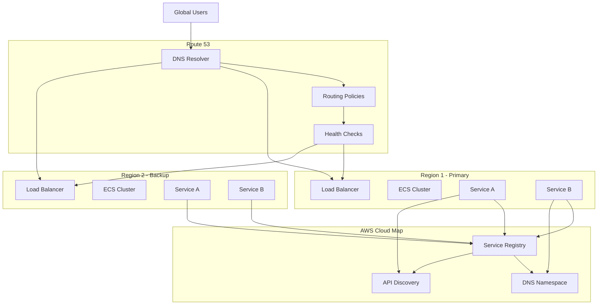

# DNS and Service Discovery

## What is DNS and Service Discovery and Why Should You Care?

Think of DNS and service discovery like the combination of a phone book and a smart receptionist for your digital city. Just as you need to know how to reach businesses and people in a real city, your applications need to know how to find and communicate with each other in the cloud.

Imagine you're running a large corporate campus:
- **DNS (Route 53)** is like the main directory at the entrance that tells visitors which building houses which department
- **Service Discovery** is like having smart receptionists on each floor who know exactly where everyone sits and can direct people even when someone moves offices
- **Health Checks** are like security guards who verify that departments are actually open and available before sending visitors there
- **Traffic Policies** are like having different entrances for different types of visitors (employees, customers, deliveries)

Without proper DNS and service discovery, your applications would be like people wandering around a campus with no signs, no directories, and no way to find what they're looking for.

**Critical business scenarios:**
1. **Microservices architecture** - Dozens of services need to find and communicate with each other dynamically
2. **Multi-region deployment** - Users need to be routed to the closest or healthiest region automatically
3. **Blue-green deployments** - Traffic needs to be switched seamlessly between old and new versions

## The Building Blocks

### Route 53 DNS Service
**What it is:** AWS's highly available and scalable Domain Name System (DNS) web service.

**Real-world analogy:** Route 53 is like having the world's most reliable postal system that not only delivers mail to the right address but also knows when someone has moved, is temporarily unavailable, or when there's a faster route to reach them.

**Core functions:**
- **Domain registration:** Buying and managing domain names
- **DNS hosting:** Translating domain names to IP addresses
- **Health monitoring:** Checking if your services are healthy
- **Traffic routing:** Directing users to the best endpoint

**Why it's called Route 53:** DNS uses port 53, and Route 53 routes your DNS queries - clever naming by AWS!

💡 **Pro Tip:** Route 53 is a global service - you don't choose a region for it, and it automatically provides high availability across all AWS regions.

### DNS Record Types
**A Records:** Direct mapping from domain name to IPv4 address
- Example: `api.example.com` → `192.0.2.1`
- Use for: Simple domain to IP mappings

**CNAME Records:** Alias from one domain name to another
- Example: `www.example.com` → `example.com`
- Use for: Redirecting subdomains to main domains or other services

**ALIAS Records:** AWS-specific record that acts like CNAME but for root domains
- Example: `example.com` → Load Balancer DNS name
- Use for: Pointing root domains to AWS resources like load balancers

**MX Records:** Mail exchange records for email routing
**TXT Records:** Text records for verification and configuration

### Route 53 Routing Policies
**Simple Routing:** One record with one or more IP addresses
- **When to use:** Basic DNS resolution with no special requirements
- **Real-world analogy:** Like having one phone number for a business

**Weighted Routing:** Distribute traffic across multiple endpoints based on assigned weights
- **When to use:** A/B testing, gradual rollouts, load distribution
- **Example:** 70% traffic to new version, 30% to old version

**Latency-Based Routing:** Route traffic to the endpoint with the lowest latency
- **When to use:** Global applications where performance matters
- **How it works:** Route 53 measures latency from user locations to your endpoints

**Failover Routing:** Automatic failover between primary and secondary endpoints
- **When to use:** Disaster recovery scenarios
- **Requirements:** Health checks on primary endpoint

**Geolocation Routing:** Route traffic based on the geographic location of users
- **When to use:** Compliance requirements, localized content
- **Example:** European users go to EU servers, US users go to US servers

**Geoproximity Routing:** Route traffic based on location with bias adjustments
- **When to use:** When you want to shift traffic gradually between regions
- **Advanced feature:** Can adjust the "size" of geographic regions

**Multi-value Answer Routing:** Return multiple healthy IP addresses
- **When to use:** Simple load balancing with health checks
- **Benefit:** Client can try multiple IPs if one fails

### Health Checks
**What they do:** Monitor the health and performance of your application endpoints.

**Types of health checks:**
1. **HTTP/HTTPS health checks:** Check if a web page returns successfully
2. **TCP health checks:** Check if a port is accepting connections
3. **Calculated health checks:** Combine multiple health checks with Boolean logic
4. **CloudWatch alarm health checks:** Use CloudWatch metrics to determine health

**Real-world analogy:** Health checks are like having a team of inspectors who continuously verify that your restaurants are open, serving food, and meeting quality standards.

### Service Discovery
**What it is:** The process of automatically detecting and registering services so other services can find them.

**AWS Cloud Map:** AWS's service discovery service that:
- Automatically registers and deregisters services
- Provides API-based and DNS-based discovery
- Integrates with ECS, EKS, and other compute services
- Maintains a real-time registry of service locations

**Real-world analogy:** Service discovery is like having a smart building directory that automatically updates when companies move floors, change phone numbers, or when new businesses open.

## How It All Works Together

## Real-World Applications

### Global E-commerce Platform
**Challenge:** Route customers to the closest data center while ensuring high availability.

**DNS Strategy:**
- **Latency-based routing** for primary traffic distribution
- **Failover routing** to backup regions during outages
- **Health checks** monitoring application endpoints every 30 seconds
- **Weighted routing** for gradual rollout of new features

**Service Discovery:**
- **Cloud Map** for internal service communication
- **ECS Service Discovery** for containerized microservices
- **DNS-based discovery** for simple service-to-service calls

**Traffic Flow:**
1. User queries `shop.example.com`
2. Route 53 determines user's location and endpoint health
3. Returns IP of closest healthy load balancer
4. If primary region fails, automatically routes to backup
5. Internal services discover each other via Cloud Map

### Microservices Architecture
**Challenge:** 50+ microservices need to discover and communicate with each other dynamically.

**Architecture:**
- **Internal DNS zones** for service discovery
- **Service mesh integration** with AWS App Mesh
- **API-based discovery** for real-time service location
- **Health monitoring** of all service endpoints

**Service Registration Flow:**
1. Service starts up and registers with Cloud Map
2. Health checks begin monitoring the service
3. Other services can discover it via DNS or API calls
4. When service scales or moves, registration updates automatically

### Multi-Environment Development
**Challenge:** Manage DNS for development, staging, and production environments.

**DNS Structure:**
- `api.prod.example.com` → Production API servers
- `api.staging.example.com` → Staging environment
- `api.dev.example.com` → Development environment

**Benefits:**
- **Environment isolation** through separate DNS zones
- **Easy switching** between environments during testing
- **Automated deployment** integration with DNS updates
- **Cost optimization** by using different routing policies per environment

## Best Practices and Pro Tips

### DNS Design Principles
💡 **Pro Tip:** Design your DNS hierarchy to match your organizational structure and deployment patterns.

**Hierarchical naming:**
- `service.environment.region.example.com`
- `api.prod.us-east-1.example.com`
- `database.staging.eu-west-1.example.com`

**TTL (Time To Live) strategy:**
- **Long TTLs (300-3600 seconds):** For stable resources
- **Short TTLs (60-300 seconds):** For resources that change frequently
- **Very short TTLs (30-60 seconds):** During deployments or failover scenarios

### Health Check Optimization
💡 **Pro Tip:** Design health check endpoints specifically for monitoring - don't just use your homepage.

**Effective health checks:**
- **Lightweight endpoints:** `/health` or `/status` that don't require heavy processing
- **Dependency checks:** Verify that databases and external services are reachable
- **Meaningful responses:** Return specific status codes and messages
- **Fast response times:** Health checks should complete quickly

**Health check frequency:**
- **Standard checks:** Every 30 seconds for most applications
- **Fast failover:** Every 10 seconds for critical applications
- **Cost consideration:** More frequent checks cost more money

### Service Discovery Strategy
💡 **Pro Tip:** Choose between DNS-based and API-based discovery based on your application's needs.

**DNS-based discovery:**
- **Pros:** Simple, works with any application, automatic caching
- **Cons:** TTL delays, limited metadata
- **Best for:** Simple architectures, applications that don't change frequently

**API-based discovery:**
- **Pros:** Real-time updates, rich metadata, precise control
- **Cons:** More complex integration, requires SDK
- **Best for:** Dynamic microservices, applications requiring real-time updates

### Route 53 Cost Optimization
💡 **Pro Tip:** Understand Route 53 pricing to optimize costs without sacrificing functionality.

**Cost factors:**
- **Hosted zones:** $0.50 per hosted zone per month
- **DNS queries:** $0.40 per million queries (first billion)
- **Health checks:** $0.50 per health check per month
- **Traffic flow:** Additional charges for advanced traffic management

**Optimization strategies:**
- **Consolidate zones:** Use fewer hosted zones when possible
- **Optimize health checks:** Use calculated health checks to reduce individual check count
- **Cache-friendly TTLs:** Longer TTLs reduce query volume

## Common Challenges and Solutions

### Challenge: "DNS changes aren't taking effect!"
**Symptoms:** Old IP addresses still being returned, traffic going to wrong endpoints

**Diagnostic approach:**
1. **Check TTL values:** Changes may be cached based on previous TTL
2. **Verify record types:** Ensure you're using the correct record type
3. **DNS propagation:** Changes take time to propagate globally
4. **Local caching:** Your local DNS cache might be stale

**Solutions:**
- **Reduce TTL** before making changes (plan ahead!)
- **Use dig or nslookup** to verify changes from different locations
- **Wait for propagation:** DNS changes can take up to 48 hours globally
- **Clear local cache:** Flush DNS cache on your machine

### Challenge: "Health checks are flapping!"
**Symptoms:** Services marked as healthy/unhealthy repeatedly

**Root causes:**
- **Aggressive timeout settings:** Health checks timing out inconsistently
- **Application performance issues:** Slow responses causing timeouts
- **Network connectivity problems:** Intermittent network issues
- **Inadequate health check design:** Checks are too sensitive

**Solutions:**
- **Tune health check parameters:** Adjust timeout and interval settings
- **Improve health check endpoints:** Make them more reliable and faster
- **Use multiple health checkers:** Route 53 uses multiple global checkers
- **Monitor CloudWatch metrics:** Track health check status over time

### Challenge: "Service discovery is slow!"
**Symptoms:** Applications can't find services quickly, connection delays

**Optimization strategies:**
- **Choose appropriate discovery method:** DNS vs. API based on needs
- **Implement caching:** Cache service locations in applications
- **Optimize TTL values:** Balance freshness with performance
- **Use connection pooling:** Reduce overhead of service lookups

### Challenge: "Failover isn't working!"
**Symptoms:** Traffic continues going to failed endpoints

**Troubleshooting steps:**
1. **Verify health checks:** Ensure they're properly configured and running
2. **Check routing policy:** Confirm failover routing is set up correctly
3. **Review health check criteria:** May be too lenient or too strict
4. **Test failover scenarios:** Regularly test your failover mechanisms

## Integration Points

### With Load Balancers
- **ALIAS records:** Point domains to load balancers without hardcoding IPs
- **Health check integration:** Use load balancer health checks in Route 53
- **Multi-region failover:** Failover between load balancers in different regions

### With Container Services
- **ECS Service Discovery:** Automatic registration of ECS tasks
- **EKS integration:** Works with Kubernetes service discovery
- **Fargate networking:** Seamless integration with serverless containers

### With Content Delivery
- **CloudFront integration:** Use Route 53 for CDN domain management
- **Edge location routing:** Route users to closest CloudFront edge
- **Origin failover:** Automatic failover between origins

### With Monitoring
- **CloudWatch integration:** Health check metrics and alarms
- **X-Ray integration:** DNS resolution tracing
- **Cost monitoring:** Track Route 53 usage and costs

## Advanced Patterns

### Blue-Green Deployment with DNS
**Pattern:** Use weighted routing to gradually shift traffic between versions
1. **Initial state:** 100% traffic to blue environment
2. **Deploy green:** New version deployed but receives 0% traffic
3. **Gradual shift:** 10% → 25% → 50% → 75% → 100% to green
4. **Rollback capability:** Can instantly shift back to blue if issues arise

### Multi-Region Active-Active
**Pattern:** Serve traffic from multiple regions simultaneously
- **Latency-based routing:** Route users to closest region
- **Health check failover:** Automatic failover when regions go down
- **Weighted distribution:** Balance load across regions

### Service Mesh Integration
**Pattern:** Combine Route 53 with service mesh for comprehensive service communication
- **External discovery:** Route 53 for external service discovery
- **Internal mesh:** Service mesh for internal service-to-service communication
- **Unified observability:** Combined monitoring across both systems

Remember: DNS and service discovery are the nervous system of your cloud architecture - they need to be fast, reliable, and intelligent to keep your applications communicating effectively!