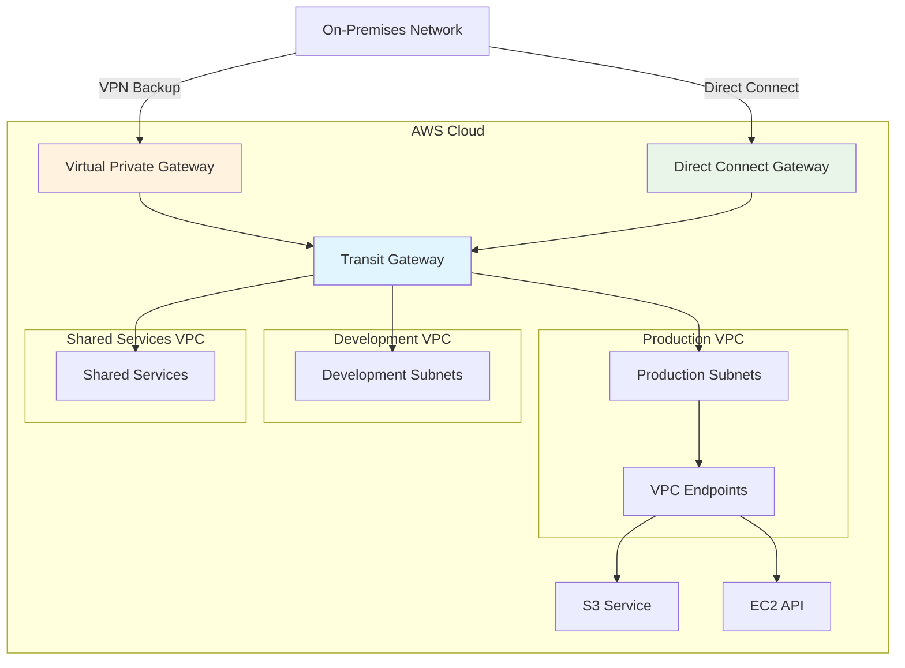

# Hybrid Cloud Networking

## What is Hybrid Cloud Networking and Why Should You Care?

Think of hybrid cloud networking like building bridges between islands where you have some resources living on your main island (on-premises) and others on a neighboring island (AWS cloud). You need reliable, secure bridges that allow people and goods to move freely between the islands while maintaining the unique characteristics of each location.

Imagine you're expanding your business across multiple locations:
- **VPN Connections** are like having secure courier services that encrypt sensitive documents before sending them over public roads
- **Direct Connect** is like building your own private highway between locations - faster, more reliable, but requiring significant upfront investment
- **Transit Gateway** is like having a central transportation hub where all your locations connect, making it easy to add new sites
- **AWS PrivateLink** is like having dedicated phone lines to specific AWS services without using the public telephone network

**Critical business scenarios:**
1. **Enterprise cloud migration** - Moving workloads to AWS while maintaining on-premises systems during transition
2. **Hybrid data processing** - Using cloud burst capabilities while keeping sensitive data on-premises
3. **Multi-cloud connectivity** - Connecting AWS to other cloud providers or SaaS applications

## The Building Blocks

### VPN Connections: The Secure Tunnel
**What it is:** Encrypted network connections that tunnel through the public internet to connect your on-premises network to AWS.

**Real-world analogy:** VPN connections are like having a secure armored truck service that picks up your sensitive packages from your office, drives them over public roads in a tamper-proof vehicle, and delivers them safely to your AWS facility.

**Types of VPN Connections:**

**Site-to-Site VPN:**
- Connects your entire on-premises network to AWS
- IPsec encryption for security
- Redundant tunnels for high availability
- Think of it like building a secure bridge between two office buildings

**Client VPN:**
- Individual users connect to AWS resources
- Remote access for mobile workforce
- Like giving each employee a secure key to access the building

**When to use VPN:**
- **Quick setup** needed for hybrid connectivity
- **Cost-sensitive** projects (lower upfront costs than Direct Connect)
- **Variable bandwidth** requirements
- **Backup connectivity** for Direct Connect
- **Temporary projects** or proof-of-concepts

💡 **Pro Tip:** Always set up redundant VPN tunnels across multiple availability zones for high availability.

### Direct Connect: The Private Highway
**What it is:** Dedicated physical network connections that bypass the public internet entirely.

**Real-world analogy:** Direct Connect is like building your own private toll road between your headquarters and AWS. You get guaranteed capacity, consistent performance, and no public traffic to slow you down.

**Direct Connect Components:**

**Physical Connection:**
- Dedicated fiber optic connection to AWS
- Bandwidth options from 50 Mbps to 100 Gbps
- Located in AWS Direct Connect locations globally

**Virtual Interfaces (VIFs):**
- **Private VIF:** Connects to your VPC through Virtual Private Gateway
- **Public VIF:** Connects to AWS public services (S3, DynamoDB) with private routing
- **Transit VIF:** Connects to Transit Gateway for multi-VPC access

**When to use Direct Connect:**
- **High bandwidth requirements** (>1 Gbps consistently)
- **Predictable network costs** (especially for large data transfer volumes)
- **Compliance requirements** mandating private connectivity
- **Consistent performance** needs for critical applications
- **Long-term hybrid architecture** (ROI improves over time)

⚠️ **Important:** Direct Connect doesn't provide encryption by default - combine with VPN for encrypted hybrid connectivity.

### Transit Gateway: The Central Hub
**What it is:** A network transit hub that connects multiple VPCs, on-premises networks, and other AWS accounts through a single gateway.

**Real-world analogy:** Transit Gateway is like a major airport hub that connects flights from many different cities. Instead of needing direct flights between every pair of cities, everyone connects through the hub, making the network much simpler to manage.

**Transit Gateway Benefits:**
- **Simplified connectivity:** One connection point for multiple networks
- **Scalable architecture:** Easily add new VPCs or on-premises networks
- **Centralized routing:** Manage all routing through one service
- **Cross-account connectivity:** Connect networks across AWS accounts

**Use cases:**
- **Multi-VPC architectures** with complex interconnectivity needs
- **Large enterprise** migrations with many network segments
- **Multi-account** organizations requiring centralized networking
- **Network segmentation** with centralized security controls

### AWS PrivateLink: The Direct Service Connection
**What it is:** Private connectivity to AWS services and third-party applications without traversing the public internet.

**Real-world analogy:** PrivateLink is like having dedicated phone lines to specific businesses. Instead of calling through the public phone system, you have direct lines that are private, secure, and don't go through any public exchanges.

**PrivateLink Components:**

**VPC Endpoints:**
- Interface endpoints for most AWS services
- Gateway endpoints for S3 and DynamoDB
- Private IP addresses within your VPC

**Endpoint Services:**
- Expose your own services to other VPCs
- Third-party services available through PrivateLink
- Cross-account service sharing

**When to use PrivateLink:**
- **Security requirements** for AWS service access
- **Network isolation** from public internet
- **Service sharing** between VPCs or accounts
- **Third-party integrations** requiring private connectivity

## How Hybrid Networking Works Together

## Real-World Applications

### Enterprise Cloud Migration
**Challenge:** Migrate 500+ applications from on-premises to AWS while maintaining business continuity.

**Hybrid Architecture:**
- **Direct Connect** for high-bandwidth data replication
- **VPN backup** for redundancy and disaster recovery
- **Transit Gateway** to connect multiple VPCs and on-premises
- **PrivateLink** for secure access to AWS services

**Migration Phases:**
1. **Foundation:** Establish Direct Connect and basic VPC connectivity
2. **Pilot:** Migrate non-critical applications using VPN
3. **Wave migration:** Move application groups systematically
4. **Optimization:** Implement PrivateLink and optimize routing
5. **Decommission:** Gradually reduce on-premises footprint

### Multi-Cloud Integration
**Challenge:** Connect AWS to other cloud providers and SaaS applications securely.

**Architecture:**
- **PrivateLink** for AWS service access
- **VPN connections** to other cloud providers
- **Transit Gateway** as central routing hub
- **Direct Connect** for high-volume inter-cloud traffic

**Integration patterns:**
- **Data synchronization** between cloud providers
- **Cross-cloud disaster recovery**
- **Multi-cloud analytics** pipelines
- **Vendor-agnostic** application deployment

### Branch Office Connectivity
**Challenge:** Connect 50+ branch offices to AWS while maintaining central security policies.

**Solution:**
- **AWS Site-to-Site VPN** for each branch office
- **Transit Gateway** for centralized connectivity
- **Centralized security** through shared services VPC
- **AWS Global Accelerator** for improved performance

**Benefits:**
- **Simplified management** through centralized hub
- **Consistent security** policies across all branches
- **Easy addition** of new branch offices
- **Cost optimization** through shared resources

## Best Practices and Pro Tips

### VPN Best Practices
💡 **Pro Tip:** Always configure both VPN tunnels for high availability, even if you're using them for backup.

**Configuration optimization:**
- **Use both tunnels** in active-active mode when possible
- **Configure BGP** for dynamic routing and automatic failover
- **Monitor tunnel health** with CloudWatch metrics
- **Test failover scenarios** regularly

**Security considerations:**
- **Use strong encryption** (AES-256, SHA-256)
- **Implement perfect forward secrecy**
- **Regular certificate rotation**
- **Monitor for unauthorized access attempts**

### Direct Connect Optimization
💡 **Pro Tip:** Start with a smaller Direct Connect and scale up based on actual usage patterns.

**Capacity planning:**
- **Monitor bandwidth utilization** over time
- **Plan for growth** but don't over-provision initially
- **Use multiple connections** for redundancy
- **Consider hosted connections** for smaller bandwidth needs

**Cost optimization:**
- **Use data transfer pricing** calculator for ROI analysis
- **Implement traffic engineering** to optimize path selection
- **Consider regional differences** in Direct Connect pricing
- **Monitor and optimize** VIF usage

### Transit Gateway Strategy
💡 **Pro Tip:** Design your route table strategy before connecting multiple networks to Transit Gateway.

**Route table design:**
- **Segmentation strategy:** Separate route tables for different environments
- **Default routes:** Carefully plan default route propagation
- **Security groups:** Use centralized security policies where possible
- **Monitoring:** Implement comprehensive monitoring of inter-VPC traffic

## Common Challenges and Solutions

### Challenge: "VPN performance is inconsistent!"
**Symptoms:** Variable throughput, high latency, intermittent connectivity

**Optimization strategies:**
- **Enable jumbo frames** on your network equipment
- **Optimize MTU sizes** for VPN tunnels
- **Use both VPN tunnels** for load balancing
- **Monitor CloudWatch metrics** for tunnel health
- **Consider Direct Connect** for consistent performance

### Challenge: "Direct Connect costs are higher than expected!"
**Symptoms:** Unexpected data transfer charges, high monthly bills

**Cost analysis approach:**
1. **Break down charges** by data transfer direction
2. **Analyze traffic patterns** to identify optimization opportunities
3. **Compare with VPN costs** for different scenarios
4. **Optimize routing** to minimize cross-region transfers

**Solutions:**
- **Right-size bandwidth** based on actual usage
- **Use VPC endpoints** to reduce data transfer
- **Implement traffic engineering** for cost optimization
- **Consider multiple smaller connections** vs. one large connection

### Challenge: "Complex routing with Transit Gateway!"
**Symptoms:** Traffic not reaching intended destinations, routing loops

**Troubleshooting approach:**
1. **Review route tables** systematically
2. **Check route propagation** settings
3. **Verify security groups** and NACLs
4. **Use VPC Flow Logs** to trace traffic paths

**Solutions:**
- **Document routing design** before implementation
- **Use route table associations** strategically
- **Implement route table naming conventions**
- **Test connectivity** incrementally as you add networks

### Challenge: "PrivateLink endpoints not resolving!"
**Symptoms:** DNS resolution failures, unable to reach AWS services

**Diagnostic steps:**
1. **Verify VPC DNS settings** (enableDnsHostnames, enableDnsSupport)
2. **Check endpoint security groups**
3. **Confirm route table associations**
4. **Test DNS resolution** from different subnets

## Integration Points

### With Security Services
- **CloudTrail:** Monitor all hybrid networking API calls
- **Config:** Track configuration changes across hybrid resources
- **Security Hub:** Centralized security monitoring across environments
- **GuardDuty:** Threat detection for hybrid network traffic

### With Monitoring Services
- **CloudWatch:** Comprehensive metrics for all hybrid components
- **VPC Flow Logs:** Network traffic analysis across hybrid connections
- **X-Ray:** Distributed tracing across hybrid applications
- **Systems Manager:** Hybrid infrastructure management

### With Compute Services
- **EC2:** Seamless integration with hybrid networking
- **Lambda:** VPC connectivity for serverless hybrid applications
- **ECS/EKS:** Container networking across hybrid environments

## Cost Optimization Strategies

### Hybrid Connectivity Cost Management
💡 **Pro Tip:** Understand the different cost models for each connectivity option.

**Cost factors:**
- **VPN:** Hourly connection charges plus data transfer
- **Direct Connect:** Port hours plus data transfer (often cheaper for high volume)
- **Transit Gateway:** Hourly charges plus data processing fees
- **PrivateLink:** Hourly endpoint charges plus data processing

**Optimization strategies:**
- **Right-size connections** based on actual usage
- **Use VPC endpoints** to reduce data transfer costs
- **Implement intelligent routing** to minimize cross-region traffic
- **Regular cost reviews** and optimization assessments

### Traffic Engineering for Cost Optimization
- **Local processing:** Keep data processing close to data sources
- **Intelligent routing:** Route traffic through most cost-effective paths
- **Caching strategies:** Reduce repetitive data transfers
- **Compression:** Implement data compression for large transfers

Remember: Hybrid cloud networking is like building bridges between different worlds - it requires careful planning, solid engineering, and ongoing maintenance to ensure secure, reliable, and cost-effective connectivity!