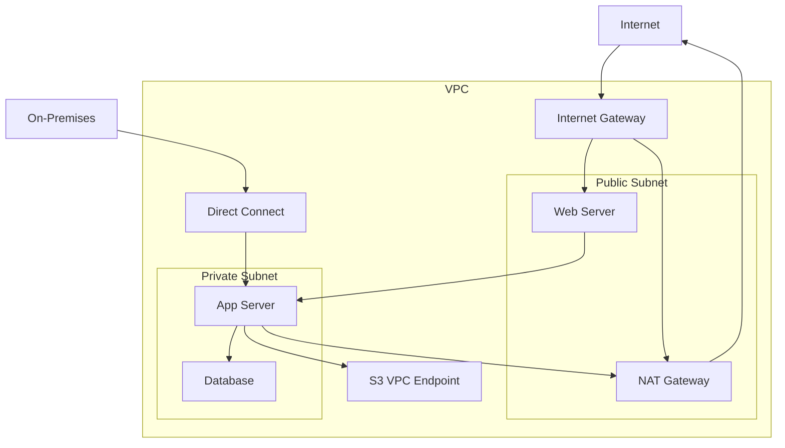

# Internet Connectivity

## What is Internet Connectivity and Why Should You Care?

Think of internet connectivity in AWS like designing the entry and exit points for your digital city. Just as a real city needs highways, toll booths, and bridges to connect to the outside world, your AWS applications need carefully designed pathways to communicate with the internet while maintaining security and control.

Imagine you're running a secure corporate campus. You need:
- **Main gates** (Internet Gateways) where visitors and employees can enter and exit freely
- **Service entrances** (NAT Gateways) where internal staff can go out for supplies but outsiders can't come in
- **Private tunnels** (VPC Endpoints) that connect directly to trusted partners without going through public roads
- **Dedicated highways** (Direct Connect) for high-volume, predictable traffic to your headquarters

**Critical real-world scenarios:**
1. **Customer-facing web application** - Users need fast, reliable access while your databases stay protected
2. **API-driven business** - Partners need secure access to your services while maintaining performance
3. **Data analytics platform** - You need to pull data from external sources while keeping processing internal

## The Building Blocks

### Internet Gateway (IGW)
**What it is:** The main entrance to your VPC that allows bidirectional internet connectivity.

**Real-world analogy:** Think of an IGW like the main gate of a shopping mall. Customers can freely enter and exit, staff can come and go, and delivery trucks can access the loading docks.

**When to use it:** 
- Web servers that need to serve traffic directly to users
- Jump boxes (bastion hosts) for administrative access
- Any resource that needs both incoming and outgoing internet connections

💡 **Pro Tip:** Each VPC can have only one Internet Gateway. It's highly available by design.

### NAT Gateway
**What it is:** A managed service that allows resources in private subnets to access the internet while preventing inbound internet traffic.

**Real-world analogy:** A NAT Gateway is like a secure reception desk at a corporate office. Employees can ask the receptionist to make outbound calls, but random people can't walk in and start talking to employees.

**When to use it:**
- Application servers that need to download patches or updates
- Backend services that call external APIs
- Any private resource that needs outbound internet access

**NAT Gateway vs NAT Instance:**
- **NAT Gateway:** Managed service, highly available, better performance, more expensive
- **NAT Instance:** EC2 instance you manage, single point of failure, cheaper, more control

### VPC Endpoints
**What it is:** Private connections between your VPC and supported AWS services that don't require internet routing.

**Real-world analogy:** VPC endpoints are like private elevators that connect your office directly to trusted business partners in the same building.

**Types:**
- **Gateway Endpoints:** Available for S3 and DynamoDB only, no charge for endpoint
- **Interface Endpoints:** Available for most AWS services, creates ENI in your subnet, charged per hour

### Direct Connect
**What it is:** A dedicated physical network connection between your data center and AWS.

**Real-world analogy:** If the public internet is like city roads with traffic lights, Direct Connect is like having your own private highway.

**When to consider:**
- Transferring large amounts of data regularly (>1TB/month)
- Applications requiring consistent network performance
- Compliance requirements for private connectivity

## How It All Works Together

## Real-World Applications

### E-commerce Platform
**Architecture:**
- Internet Gateway for web servers serving customer traffic
- NAT Gateway for application servers calling payment APIs
- VPC Endpoints for accessing S3 and DynamoDB
- Databases remain completely isolated

### Enterprise Hybrid Cloud
**Architecture:**
- Direct Connect for reliable connectivity to on-premises systems
- VPC Endpoints for accessing AWS services without internet routing
- NAT Gateway for limited outbound access for updates
- No Internet Gateway to ensure compliance

### Data Analytics Platform
**Architecture:**
- Direct Connect for high-volume data ingestion
- S3 Gateway Endpoint for cost-effective data storage access
- Interface Endpoints for analytics services
- Internet Gateway for dashboard access

## Best Practices and Pro Tips

### Internet Gateway Best Practices
💡 **Pro Tip:** Only attach an IGW if you actually need bidirectional internet connectivity.
- One IGW per VPC (AWS enforced)
- Only route public subnets to the IGW
- Use specific security group rules
- Use Elastic IPs for stable public addresses

### NAT Gateway Optimization
💡 **Pro Tip:** Deploy one NAT Gateway per AZ for high availability.
- Choose the right bandwidth tier for your needs
- Monitor data processing charges
- Consider cost vs. availability trade-offs

### VPC Endpoint Strategy
💡 **Pro Tip:** Use Gateway Endpoints for S3 and DynamoDB unless you need Interface Endpoint features.
- Gateway Endpoints: No hourly charges, automatically HA
- Interface Endpoints: More control, higher costs, cross-VPC access

### Common Pitfalls to Avoid
⚠️ Single NAT Gateway creating single point of failure
⚠️ Over-provisioning Direct Connect bandwidth
⚠️ Using expensive Interface Endpoints when Gateway would work
⚠️ Overly permissive security groups on public resources

## Common Challenges and Solutions

### "Private instances can't reach the internet!"
**Solution steps:**
1. Create NAT Gateway in public subnet
2. Update private subnet route table to point 0.0.0.0/0 to NAT Gateway
3. Ensure NAT Gateway's subnet routes to Internet Gateway
4. Check security group rules

### "VPC Endpoint isn't working!"
**Diagnostic approach:**
1. Check DNS resolution for private IP addresses
2. Verify route tables (Gateway Endpoints)
3. Check security groups (Interface Endpoints)
4. Review endpoint policies

### "Internet traffic costs are high!"
**Solutions:**
- Implement VPC Endpoints for AWS service traffic
- Use CloudFront for content delivery
- Consider Direct Connect for high-volume traffic
- Monitor and optimize data transfer patterns

## Integration Points

### With Compute Services
- EC2 instances inherit subnet connectivity configuration
- Lambda functions can use VPC networking for private resource access
- ECS/EKS use VPC networking for container communication

### With Storage Services
- S3 benefits from Gateway VPC Endpoints for cost/performance
- EFS uses standard VPC networking with mount targets
- EBS relies on consistent instance connectivity

### With Security Services
- CloudTrail logs all networking API calls
- GuardDuty analyzes VPC Flow Logs for threats
- Network Firewall provides additional internet-bound protection

## Cost Optimization

### Data Transfer Management
💡 **Pro Tip:** Monitor data transfer costs - they're often the biggest networking expense.
- Use VPC Endpoints for AWS service traffic
- Implement CloudFront for global content delivery
- Optimize cross-AZ traffic patterns

### Infrastructure Right-Sizing
- Choose appropriate NAT Gateway performance tiers
- Start small with Direct Connect and scale based on usage
- Monitor Interface Endpoint usage and costs

Remember: Internet connectivity is your application's lifeline to the outside world - design it to be secure, reliable, and cost-effective!