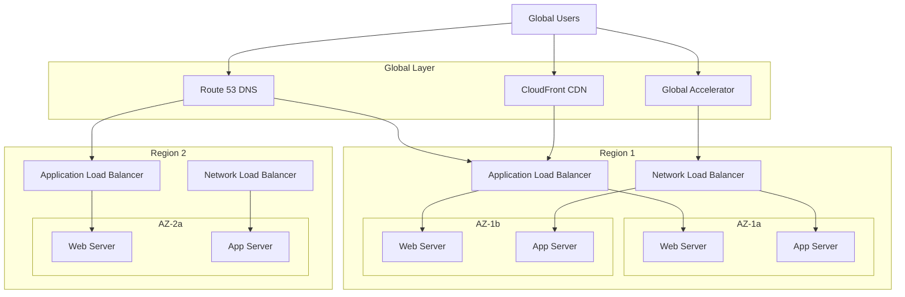

# Load Balancing

## What is Load Balancing and Why Should You Care?

Think of load balancing like managing the flow of customers in a busy restaurant. Without a host/hostess directing people to available tables, customers would all cluster at the entrance, some tables would be overcrowded while others sit empty, and service would be chaotic. A load balancer is your digital host/hostess, intelligently distributing incoming requests across multiple servers to ensure optimal performance and availability.

Imagine you're running a popular pizza delivery service:
- **Application Load Balancer (ALB)** is like a smart receptionist who knows each cook's specialties and directs pizza orders to the right kitchen based on the type of pizza ordered
- **Network Load Balancer (NLB)** is like an express lane that instantly routes calls to any available cook without asking questions - pure speed
- **Classic Load Balancer** is like the old-school approach where the manager just points to the next cook in line
- **Global Load Balancer** is like having franchise locations worldwide and directing customers to their nearest restaurant

**Critical business scenarios:**
1. **E-commerce during peak sales** - Distributing thousands of concurrent shoppers across multiple web servers
2. **Gaming platform** - Ultra-low latency requirements for real-time multiplayer games
3. **Global SaaS application** - Routing users to the closest data center for optimal performance

## The Building Blocks

### Application Load Balancer (ALB)
**What it is:** Layer 7 (HTTP/HTTPS) load balancer that makes intelligent routing decisions based on content.

**Real-world analogy:** Think of ALB like a sophisticated concierge at a luxury hotel. They don't just point you toward elevators - they understand your specific needs (business meeting vs. spa appointment) and direct you to the appropriate floor, service, or even specific staff member who can best help you.

**When to use it:**
- Web applications with HTTP/HTTPS traffic
- Microservices architectures where different paths need different services
- Applications requiring SSL termination
- When you need advanced routing based on URL paths, headers, or query parameters

**Key features:**
- **Content-based routing:** Route `/api/*` to API servers, `/images/*` to image servers
- **Host-based routing:** Route different domains to different target groups
- **HTTP/2 and WebSocket support:** Modern protocol support
- **WAF integration:** Built-in protection against common web attacks

💡 **Pro Tip:** ALB is perfect for containerized applications where you need intelligent traffic distribution.

### Network Load Balancer (NLB)
**What it is:** Layer 4 (TCP/UDP) load balancer designed for ultra-high performance and low latency.

**Real-world analogy:** Think of NLB like an express lane at a toll booth. It doesn't care what's in your car or where you're going - it just gets you through as fast as possible to any available lane. No questions asked, no delays, just pure speed.

**When to use it:**
- Gaming applications requiring ultra-low latency
- IoT applications with millions of connections
- TCP/UDP protocols that ALB doesn't support
- Applications requiring static IP addresses
- When you need to preserve source IP addresses

**Key features:**
- **Sub-millisecond latency:** Fastest load balancing option
- **Static IP addresses:** Each AZ gets a static IP
- **Extreme performance:** Millions of requests per second
- **Source IP preservation:** Backend servers see the original client IP

💡 **Pro Tip:** NLB is ideal when raw performance matters more than intelligent routing.

### Classic Load Balancer (CLB)
**What it is:** Legacy load balancer that operates at both Layer 4 and Layer 7 but with limited features.

**Real-world analogy:** CLB is like the first-generation GPS systems - they get you where you need to go, but they don't know about traffic conditions, road construction, or faster alternate routes.

**When to use it:**
- Legacy applications that were built for CLB
- Simple load balancing needs without advanced features
- Applications running in EC2-Classic (deprecated)

**Migration path:** AWS recommends migrating to ALB or NLB for new applications.

⚠️ **Important:** Consider migrating existing CLB implementations to ALB or NLB for better features and cost optimization.

### Global Load Balancer (Route 53 + CloudFront)
**What it is:** DNS-based and CDN-based global traffic distribution to route users to the closest or best-performing endpoint.

**Real-world analogy:** Think of global load balancing like a worldwide chain of restaurants. When someone searches for "your restaurant," they're automatically directed to the nearest location. If that location is closed or overcrowded, they're smoothly redirected to the next best option.

**Components:**
- **Route 53:** DNS-based routing with health checks
- **CloudFront:** CDN with origin failover
- **Global Accelerator:** Anycast IP addresses for improved performance

**When to use it:**
- Multi-region applications serving global users
- Disaster recovery scenarios
- Performance optimization for international users

## How It All Works Together

## Real-World Applications

### High-Traffic E-commerce Platform
**Challenge:** Handle Black Friday traffic spikes while maintaining fast response times.

**Architecture:**
- **CloudFront** for global content delivery and DDoS protection
- **ALB** for intelligent routing of web traffic with WAF integration
- **NLB** for internal service-to-service communication requiring low latency
- **Route 53** for DNS failover to backup regions

**Traffic flow:**
1. Global users → CloudFront → ALB
2. ALB routes based on URL paths: `/api/*` → API servers, `/checkout/*` → checkout services
3. Internal microservices use NLB for high-performance communication
4. Route 53 health checks automatically failover to backup region during outages

### Real-Time Gaming Platform
**Challenge:** Support millions of concurrent players with ultra-low latency requirements.

**Architecture:**
- **Global Accelerator** with anycast IPs for optimal routing
- **NLB** for game server connections requiring minimal latency
- **ALB** for web dashboard and API traffic
- **Route 53** geolocation routing to nearest game regions

**Why this works:**
- NLB provides sub-millisecond latency for game traffic
- Global Accelerator optimizes network path to reduce latency
- Players are routed to the closest game servers
- Web traffic and game traffic are handled separately

### Microservices Architecture
**Challenge:** Route different API endpoints to appropriate microservices while maintaining security.

**Architecture:**
- **ALB** with path-based routing for external API traffic
- **Internal NLBs** for service-to-service communication
- **Service discovery** integration for dynamic target registration
- **SSL termination** at ALB level

**Routing rules:**
- `/user/*` → User service target group
- `/payment/*` → Payment service target group
- `/inventory/*` → Inventory service target group
- Internal services communicate via NLB for performance

## Best Practices and Pro Tips

### ALB Best Practices
💡 **Pro Tip:** Use target groups to organize your backend resources logically, not just randomly.

- **Target group strategy:** Create separate target groups for different services or environments
- **Health check tuning:** Adjust health check intervals and thresholds based on your application's behavior
- **SSL certificate management:** Use AWS Certificate Manager for free SSL certificates
- **Sticky sessions:** Only use when absolutely necessary - they reduce load distribution effectiveness

### NLB Optimization
💡 **Pro Tip:** Enable cross-zone load balancing if you need even distribution across AZs.

- **Connection draining:** Configure deregistration delay to allow existing connections to complete
- **Source IP preservation:** Understand when you need it vs. when it impacts performance
- **Health checks:** Use TCP health checks for faster detection of unhealthy targets
- **Performance monitoring:** Watch connection counts and latency metrics

### Global Load Balancing Strategy
💡 **Pro Tip:** Combine Route 53 health checks with CloudWatch alarms for intelligent failover.

- **Health check placement:** Monitor from multiple global locations
- **Failover timing:** Balance between quick recovery and avoiding false positives
- **Geographic routing:** Consider compliance requirements for data locality
- **Cost optimization:** Use Route 53 health checks strategically to minimize costs

### Security Considerations
💡 **Pro Tip:** Load balancers are often the first line of defense - secure them properly.

- **Security groups:** Only allow necessary traffic to load balancers
- **WAF integration:** Use AWS WAF with ALB for application-layer protection
- **SSL/TLS configuration:** Use modern TLS versions and strong cipher suites
- **Access logging:** Enable access logs for security monitoring and troubleshooting

## Common Challenges and Solutions

### Challenge: "Load balancer health checks are failing!"
**Symptoms:** Targets marked as unhealthy, traffic not reaching backend servers

**Diagnostic approach:**
1. **Check target health:** Verify targets are actually healthy
2. **Health check configuration:** Ensure path, port, and protocol are correct
3. **Security groups:** Confirm load balancer can reach targets on health check port
4. **Application response:** Verify application responds correctly to health check requests

**Solutions:**
- Adjust health check path to a lightweight endpoint
- Tune health check intervals and thresholds
- Fix security group rules between load balancer and targets
- Implement proper health check endpoints in applications

### Challenge: "Uneven traffic distribution!"
**Symptoms:** Some servers getting much more traffic than others

**Root causes and solutions:**
- **Sticky sessions enabled:** Disable unless absolutely necessary
- **Different instance types:** Ensure targets have similar capacity
- **Cross-zone load balancing disabled:** Enable for even AZ distribution
- **Connection draining issues:** Tune deregistration delay settings

### Challenge: "High latency through load balancer!"
**Symptoms:** Response times increase when using load balancer vs. direct connection

**Optimization steps:**
1. **Choose right load balancer type:** NLB for latency-sensitive applications
2. **Target group configuration:** Minimize health check overhead
3. **SSL termination placement:** Consider where to terminate SSL
4. **Connection pooling:** Implement on both sides of load balancer

### Challenge: "SSL certificate management is complex!"
**Solutions:**
- **Use AWS Certificate Manager:** Free SSL certificates with automatic renewal
- **Wildcard certificates:** Cover multiple subdomains with one certificate
- **Certificate monitoring:** Set up CloudWatch alarms for certificate expiration
- **Multiple certificates:** ALB supports multiple certificates with SNI

## Integration Points

### With Auto Scaling
- **Target tracking:** Use load balancer metrics for scaling decisions
- **Health checks:** Auto Scaling can use load balancer health checks
- **Connection draining:** Coordinate with Auto Scaling for graceful instance termination

### With Container Services
- **ECS:** Automatic target registration and deregistration
- **EKS:** Integration with Kubernetes ingress controllers
- **Fargate:** Seamless integration with serverless containers

### With Security Services
- **WAF:** Application-layer protection for ALB
- **Shield:** DDoS protection for load balancers
- **CloudTrail:** API call logging for compliance
- **GuardDuty:** Threat detection based on load balancer logs

### With Monitoring Services
- **CloudWatch:** Comprehensive metrics and alarms
- **X-Ray:** Distributed tracing through load balancers
- **Access logs:** Detailed request logging for analysis

## Cost Optimization

### Load Balancer Cost Management
💡 **Pro Tip:** Understand that load balancer costs include both hourly charges and request-based charges.

- **Right-sizing:** Choose the appropriate load balancer type for your needs
- **Target group optimization:** Minimize number of target groups
- **Health check frequency:** Balance health detection speed with cost
- **Data transfer optimization:** Understand cross-AZ transfer charges

### Performance vs. Cost Trade-offs
- **ALB vs. NLB:** ALB has more features but NLB might be more cost-effective for simple use cases
- **Cross-zone load balancing:** Improves distribution but increases data transfer costs
- **Health check intervals:** More frequent checks cost more but detect failures faster

Remember: Load balancing is like having a skilled traffic director for your applications - invest in getting it right, and your users will enjoy fast, reliable service even during the busiest times!