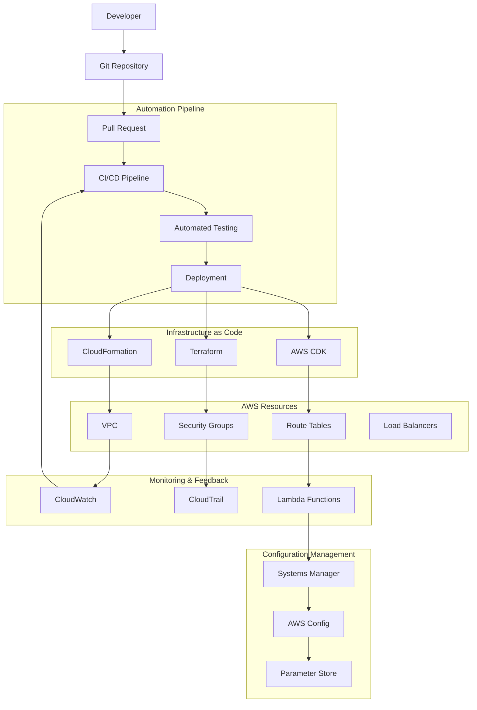

# Network Automation

## What is Network Automation and Why Should You Care?

Think of network automation like building a smart city that can manage itself. Instead of having traffic controllers manually directing every intersection, road repairs happening randomly, and new infrastructure being built without coordination, you have intelligent systems that automatically optimize traffic flow, predict maintenance needs, and seamlessly integrate new components.

Imagine you're managing a growing metropolitan area:
- **Infrastructure as Code** is like having detailed blueprints that can automatically construct buildings, roads, and utilities exactly the same way every time
- **Automation tools** are like having smart city management systems that handle routine tasks without human intervention
- **Configuration management** is like having standards and processes that ensure every traffic light, road sign, and building follows the same specifications
- **Network testing** is like having continuous safety inspections that catch problems before they affect citizens

Manual network management is like trying to manage a modern city with paper maps and rotary phones - it's slow, error-prone, and doesn't scale.

**Critical business scenarios:**
1. **Rapid scaling** - Deploying consistent network infrastructure as your business grows
2. **Multi-environment management** - Maintaining identical network configurations across development, staging, and production
3. **Compliance and governance** - Ensuring network configurations meet security and regulatory requirements consistently

## The Building Blocks

### Infrastructure as Code (IaC): The Digital Blueprints
**What it is:** Managing and provisioning network infrastructure through code rather than manual processes.

**Real-world analogy:** Infrastructure as Code is like having detailed architectural blueprints and construction robots that can build identical buildings anywhere in the world. Instead of relying on individual craftsmen who might interpret instructions differently, you have precise specifications that produce consistent results every time.

**IaC Tools for AWS Networking:**

**AWS CloudFormation:**
- Native AWS service for infrastructure provisioning
- JSON/YAML templates define resources and relationships
- Built-in rollback and error handling
- Integrated with AWS services and permissions

**Terraform:**
- Multi-cloud infrastructure provisioning tool
- HCL (HashiCorp Configuration Language) syntax
- State management for tracking infrastructure changes
- Extensive provider ecosystem including AWS

**AWS CDK (Cloud Development Kit):**
- Define infrastructure using familiar programming languages
- Higher-level abstractions than CloudFormation
- Automatic generation of CloudFormation templates
- Built-in best practices and patterns

**When to use IaC:**
- **Consistent deployments** across multiple environments
- **Version control** for infrastructure changes
- **Rapid environment provisioning** for development and testing
- **Compliance requirements** for infrastructure documentation

💡 **Pro Tip:** Start with CloudFormation or CDK for AWS-specific deployments, consider Terraform for multi-cloud scenarios.

### Network Automation Tools: The Smart Management Systems
**What they are:** Services and scripts that automatically handle routine network management tasks.

**Real-world analogy:** Network automation tools are like having a team of highly efficient city managers who never sleep, never make mistakes, and can handle thousands of routine tasks simultaneously - from updating traffic light timing to processing building permits to managing utility connections.

**AWS Automation Services:**

**AWS Systems Manager:**
- **Parameter Store:** Centralized configuration management
- **Automation Documents:** Runbooks for common tasks
- **Patch Manager:** Automated patching of network components
- **Session Manager:** Secure access without SSH keys

**AWS Lambda:**
- **Event-driven automation:** Respond to network events automatically
- **Scheduled tasks:** Regular maintenance and optimization
- **API integration:** Connect different AWS services seamlessly
- **Cost-effective:** Pay only for actual execution time

**AWS Config:**
- **Configuration monitoring:** Track changes to network resources
- **Compliance rules:** Automatically detect non-compliant configurations
- **Remediation actions:** Automatically fix common configuration issues
- **Change history:** Complete audit trail of infrastructure changes

### Configuration Management: The Standards and Processes
**What it is:** Ensuring consistent configuration across all network components and environments.

**Real-world analogy:** Configuration management is like having building codes and standards that ensure every structure in your city meets safety requirements, follows zoning laws, and integrates properly with utilities and transportation systems.

**Configuration Management Approaches:**

**Declarative Configuration:**
- Define the desired end state
- Tools automatically determine how to achieve it
- Self-healing when configurations drift
- Examples: CloudFormation, Terraform

**Imperative Configuration:**
- Define step-by-step instructions
- More control over the process
- Requires more detailed scripting
- Examples: AWS CLI scripts, custom Lambda functions

**GitOps Workflows:**
- Store all configurations in Git repositories
- Automated deployment triggered by Git commits
- Peer review process for all changes
- Complete change history and rollback capability

### Network Testing: The Continuous Safety Inspections
**What it is:** Automated testing of network configurations, connectivity, and performance to catch issues before they impact users.

**Real-world analogy:** Network testing is like having a team of inspectors who continuously check every bridge, tunnel, and road in your city to ensure they're safe, efficient, and meeting standards. They run simulated emergency scenarios and stress tests to identify potential problems before they cause real issues.

**Types of Network Testing:**

**Connectivity Testing:**
- Automated ping and traceroute tests
- Application-level health checks
- Service discovery validation
- Cross-region connectivity verification

**Performance Testing:**
- Bandwidth and latency measurements
- Load testing of network components
- Stress testing under high traffic
- Baseline establishment and drift detection

**Security Testing:**
- Automated security group validation
- Network ACL compliance checking
- Vulnerability scanning of network endpoints
- Penetration testing automation

**Configuration Testing:**
- Infrastructure template validation
- Policy compliance checking
- Best practices verification
- Drift detection from desired state

## How Network Automation Works Together

## Real-World Applications

### Multi-Environment Network Deployment
**Challenge:** Maintain identical network configurations across development, staging, and production environments.

**Automation Strategy:**
- **Parameterized templates:** Single template with environment-specific parameters
- **GitOps workflow:** Environment promotion through Git branches
- **Automated testing:** Validate each environment after deployment
- **Configuration drift detection:** Alert when environments diverge

**Implementation:**
1. **Base template:** Define core network architecture in CloudFormation
2. **Parameter files:** Environment-specific values (IP ranges, instance sizes)
3. **Pipeline automation:** Automatic deployment when parameters change
4. **Validation testing:** Automated connectivity and security tests
5. **Monitoring integration:** Real-time alerts for configuration drift

### Compliance-Driven Network Automation
**Challenge:** Ensure all network configurations meet strict regulatory requirements in a financial services environment.

**Automation Architecture:**
- **Policy as Code:** Define compliance rules as automated checks
- **Continuous compliance:** Real-time monitoring and alerting
- **Automatic remediation:** Fix non-compliant configurations automatically
- **Audit trail:** Complete documentation of all changes

**Compliance Automation Flow:**
1. **Policy definition:** Encode compliance requirements as Config rules
2. **Deployment validation:** Check all deployments against policies
3. **Continuous monitoring:** Real-time compliance status dashboard
4. **Automatic remediation:** Lambda functions fix common violations
5. **Reporting:** Automated compliance reports for auditors

### Disaster Recovery Automation
**Challenge:** Automatically recreate entire network infrastructure in backup regions during disasters.

**DR Automation Components:**
- **Cross-region templates:** Identical infrastructure definitions for multiple regions
- **Automated failover:** Event-driven disaster recovery triggers
- **Data synchronization:** Automated backup and restore processes
- **Testing automation:** Regular DR testing without impacting production

**Recovery Process:**
1. **Failure detection:** CloudWatch alarms trigger DR procedures
2. **Infrastructure deployment:** Automated creation of backup region resources
3. **Data restoration:** Automated restore from backups
4. **DNS switching:** Automatic Route 53 failover to backup region
5. **Validation testing:** Automated verification of restored services

## Best Practices and Pro Tips

### Infrastructure as Code Best Practices
💡 **Pro Tip:** Treat your infrastructure code with the same discipline as application code - version control, testing, and peer review.

**Template Organization:**
- **Modular design:** Create reusable templates for common patterns
- **Parameter strategy:** Use parameters for environment-specific values
- **Output management:** Provide outputs for integration with other templates
- **Documentation:** Include clear descriptions for all resources and parameters

**Version Control Strategy:**
- **Branching model:** Use Git flow or similar for infrastructure changes
- **Peer review:** Require reviews for all infrastructure changes
- **Change documentation:** Clear commit messages explaining changes
- **Release tagging:** Tag stable versions for easy rollback

### Automation Development Workflow
💡 **Pro Tip:** Start small with automation - automate the most repetitive and error-prone tasks first.

**Development Process:**
1. **Identify repetitive tasks:** Look for manual processes done frequently
2. **Create automation scripts:** Start with simple scripts for common tasks
3. **Add error handling:** Robust error handling and logging
4. **Implement testing:** Validate automation in non-production environments
5. **Gradual rollout:** Deploy automation incrementally with monitoring

**Testing Strategy:**
- **Syntax validation:** Check templates for syntax errors before deployment
- **Dry run testing:** Use --dry-run flags to validate without changes
- **Integration testing:** Test complete workflows in staging environments
- **Rollback testing:** Verify rollback procedures work correctly

### Configuration Management Strategy
💡 **Pro Tip:** Use centralized configuration management to maintain consistency across all environments and services.

**Configuration Hierarchy:**
- **Global settings:** Configurations that apply across all environments
- **Environment-specific:** Values that change between dev/staging/prod
- **Service-specific:** Configurations unique to particular services
- **Runtime overrides:** Dynamic configurations that can change during operation

**Secret Management:**
- **AWS Secrets Manager:** For sensitive configuration values
- **Parameter Store:** For non-sensitive configuration
- **IAM integration:** Least-privilege access to configuration values
- **Rotation policies:** Regular rotation of secrets and credentials

### Monitoring and Alerting for Automation
💡 **Pro Tip:** Monitor your automation systems as carefully as you monitor your applications.

**Key Metrics:**
- **Deployment success rates:** Track automation success/failure rates
- **Deployment duration:** Monitor how long automated processes take
- **Configuration drift:** Alert when actual configurations deviate from desired state
- **Error patterns:** Identify common automation failures

**Alerting Strategy:**
- **Failure notifications:** Immediate alerts for automation failures
- **Performance degradation:** Alerts when automation becomes slow
- **Security events:** Notifications for unauthorized configuration changes
- **Compliance violations:** Real-time alerts for policy violations

## Common Challenges and Solutions

### Challenge: "Automation is breaking things!"
**Symptoms:** Deployments failing, unexpected resource changes, service outages

**Solutions:**
- **Implement proper testing:** Test all automation in non-production environments
- **Add validation steps:** Verify prerequisites before making changes
- **Improve error handling:** Graceful handling of failure scenarios
- **Implement rollback procedures:** Quick recovery when automation fails
- **Use blue-green deployments:** Minimize risk with parallel environments

### Challenge: "Configuration drift is constant!"
**Symptoms:** Environments become inconsistent over time, manual changes overriding automation

**Solutions:**
- **Enforce automation-only changes:** Block manual changes through IAM policies
- **Implement drift detection:** Use AWS Config or custom monitoring
- **Automatic remediation:** Scripts that automatically fix common drift
- **Regular reconciliation:** Scheduled processes to restore desired state
- **Education and training:** Ensure team understands importance of automation

### Challenge: "Automation is too complex to maintain!"
**Symptoms:** Automation scripts breaking frequently, difficult to modify, team avoiding automation

**Solutions:**
- **Simplify automation:** Break complex automation into smaller, manageable pieces
- **Improve documentation:** Clear documentation for all automation processes
- **Standardize approaches:** Use consistent patterns and tools across team
- **Regular refactoring:** Continuously improve and simplify automation code
- **Training investment:** Ensure team has skills to maintain automation

### Challenge: "Automation is slow and doesn't scale!"
**Symptoms:** Deployments taking too long, automation choking on large environments

**Solutions:**
- **Parallel processing:** Run automation tasks in parallel when possible
- **Incremental updates:** Only update resources that actually changed
- **Caching strategies:** Cache expensive operations and API calls
- **Resource optimization:** Right-size automation infrastructure
- **Async processing:** Use queues and async patterns for long-running operations

## Integration Points

### With DevOps Tools
- **Jenkins/GitLab CI:** Integration with existing CI/CD pipelines
- **Ansible/Chef/Puppet:** Configuration management tool integration
- **Monitoring tools:** Datadog, New Relic integration for automation monitoring

### With AWS Services
- **CloudWatch Events:** Trigger automation based on AWS events
- **SNS/SQS:** Messaging and queuing for automation workflows
- **Step Functions:** Orchestrate complex multi-step automation
- **API Gateway:** Expose automation capabilities as APIs

### With Security and Compliance
- **CloudTrail:** Audit trail for all automated changes
- **Config Rules:** Automated compliance checking
- **Security Hub:** Centralized security findings from automation
- **IAM:** Fine-grained permissions for automation systems

## Advanced Automation Patterns

### Event-Driven Network Automation
**Pattern:** Automatically respond to network events with appropriate actions.

**Implementation:**
- **CloudWatch Events:** Trigger automation based on AWS service events
- **Lambda functions:** Lightweight automation for simple responses
- **Step Functions:** Complex workflows for multi-step automation
- **SNS notifications:** Alert teams about automation actions

### Self-Healing Network Infrastructure
**Pattern:** Automatically detect and fix common network issues without human intervention.

**Components:**
- **Health monitoring:** Continuous monitoring of network components
- **Anomaly detection:** Machine learning to identify unusual patterns
- **Automatic remediation:** Scripts to fix common problems
- **Escalation procedures:** Human notification for complex issues

### GitOps for Network Infrastructure
**Pattern:** Manage network infrastructure through Git workflows with full version control and peer review.

**Workflow:**
1. **Infrastructure changes:** Proposed as pull requests
2. **Automated validation:** CI/CD pipeline tests changes
3. **Peer review:** Team reviews all infrastructure modifications
4. **Automated deployment:** Merge triggers automatic deployment
5. **Monitoring:** Continuous monitoring of deployed changes

Remember: Network automation is like having a highly skilled assistant who never gets tired, never makes careless mistakes, and can work 24/7 to keep your infrastructure running smoothly. Invest time in building good automation, and it will pay dividends in reliability, consistency, and team productivity!