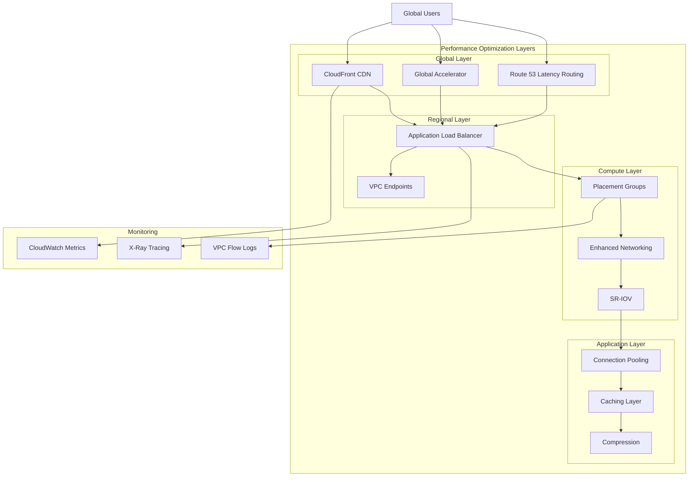

# Network Performance

## What is Network Performance and Why Should You Care?

Think of network performance like designing the transportation system for a bustling metropolis. Just as a city needs fast highways, efficient traffic lights, and smart routing to keep people and goods flowing smoothly, your AWS applications need optimized network paths, proper bandwidth allocation, and intelligent traffic management to deliver excellent user experiences.

Imagine you're the traffic commissioner for a major city:
- **Bandwidth optimization** is like adding more lanes to busy highways
- **Latency optimization** is like synchronizing traffic lights and creating express routes
- **Throughput maximization** is like optimizing loading docks and delivery schedules
- **Performance monitoring** is like having traffic cameras and sensors everywhere to spot problems before they become gridlock

Poor network performance is like having a city with traffic jams everywhere - even if you have the best restaurants and shops, people won't visit if they can't get there efficiently.

**Critical business scenarios:**
1. **Real-time applications** - Gaming, video conferencing, and trading platforms where milliseconds matter
2. **Data-intensive workloads** - Big data analytics, machine learning, and backup operations requiring high throughput
3. **Global applications** - Serving users worldwide with consistent performance regardless of location

## The Building Blocks

### Bandwidth Optimization: Adding More Lanes
**What it is:** Ensuring you have sufficient network capacity to handle your traffic volumes without congestion.

**Real-world analogy:** Bandwidth optimization is like ensuring your highways have enough lanes for rush hour traffic. You need to understand traffic patterns, identify bottlenecks, and add capacity where it's needed most.

**Key strategies:**

**Instance Network Performance:**
- **Choose appropriate instance types:** Each EC2 instance type has different network performance characteristics
- **Baseline vs. burstable:** Understand when you get consistent performance vs. temporary bursts
- **Network-optimized instances:** Use instances designed for high network performance when needed

**Enhanced Networking:**
- **SR-IOV:** Single Root I/O Virtualization for higher packet-per-second performance
- **Elastic Network Adapter (ENA):** AWS's custom network interface for improved performance
- **DPDK support:** Data Plane Development Kit for ultra-high performance applications

**When to focus on bandwidth:**
- High-volume data transfers
- Streaming media applications
- Backup and disaster recovery operations
- Large-scale data analytics workloads

💡 **Pro Tip:** Network performance is instance-dependent - a t3.micro has very different capabilities than a c5n.18xlarge.

### Latency Optimization: Creating Express Routes
**What it is:** Minimizing the time it takes for data to travel between points in your network.

**Real-world analogy:** Latency optimization is like creating express routes and eliminating unnecessary stops. Every traffic light, detour, and checkpoint adds time to the journey.

**Latency reduction strategies:**

**Regional Selection:**
- **Choose regions closest to users:** Physical distance directly impacts latency
- **Consider compliance requirements:** Sometimes you can't use the closest region
- **Multiple region deployment:** Serve users from their nearest region

**Availability Zone Placement:**
- **Same-AZ deployment:** Minimize latency between tightly coupled services
- **Cross-AZ considerations:** Balance availability needs with latency requirements
- **Placement groups:** Use cluster placement groups for ultra-low latency

**Network Path Optimization:**
- **Direct connections:** Minimize network hops between services
- **VPC endpoints:** Avoid internet routing for AWS service access
- **Local processing:** Process data close to where it's generated or consumed

### Throughput Maximization: Optimizing Traffic Flow
**What it is:** Getting the maximum amount of useful data through your network connections.

**Real-world analogy:** Throughput maximization is like optimizing a shipping port - it's not just about having big ships (bandwidth), but also efficient loading/unloading processes, smart scheduling, and avoiding bottlenecks at the docks.

**Throughput optimization techniques:**

**Connection Management:**
- **Connection pooling:** Reuse connections instead of creating new ones
- **Keep-alive connections:** Maintain persistent connections for frequent communication
- **Multiplexing:** Send multiple requests over the same connection
- **Compression:** Reduce the amount of data transmitted

**Protocol Optimization:**
- **HTTP/2 and HTTP/3:** Use modern protocols with better multiplexing
- **TCP tuning:** Optimize TCP window sizes and congestion control
- **UDP for appropriate use cases:** When you need speed over reliability

**Application-Level Optimization:**
- **Caching strategies:** Reduce network requests through intelligent caching
- **Asynchronous processing:** Don't block on network operations
- **Batch operations:** Combine multiple small requests into larger ones

### Performance Monitoring: Your Network Dashboard
**What it is:** Continuous observation and measurement of network performance metrics to identify issues and optimization opportunities.

**Real-world analogy:** Performance monitoring is like having a comprehensive traffic control center with cameras, sensors, and real-time dashboards that show you exactly what's happening across your entire transportation network.

**Key metrics to monitor:**

**Network Utilization:**
- **Bandwidth usage:** How much of your available capacity is being used
- **Packet rates:** Packets per second for different types of traffic
- **Connection counts:** Number of active network connections

**Performance Metrics:**
- **Latency:** Round-trip time for network requests
- **Jitter:** Variation in latency over time
- **Packet loss:** Percentage of packets that don't reach their destination
- **Throughput:** Actual data transfer rates achieved

## How Performance Optimization Works Together

## Real-World Applications

### High-Frequency Trading Platform
**Challenge:** Minimize latency for financial trading applications where microseconds determine profitability.

**Performance Architecture:**
- **Cluster placement groups:** Ensure all instances are in the same physical rack
- **Enhanced networking (ENA):** Maximum packet-per-second performance
- **C5n instances:** Network-optimized instances with up to 100 Gbps networking
- **Same-AZ deployment:** Minimize network hops between trading components

**Optimizations implemented:**
- **Custom AMIs** with optimized network drivers
- **Kernel bypass** using DPDK for ultra-low latency
- **Direct memory access** to network interfaces
- **Real-time monitoring** with microsecond-level precision

**Results:** Reduced average latency from 500μs to 50μs, improving trading performance significantly.

### Global Video Streaming Service
**Challenge:** Deliver high-quality video content to millions of global users with minimal buffering.

**Performance Strategy:**
- **CloudFront CDN** with edge locations worldwide
- **Origin Shield** for additional caching layer
- **Adaptive bitrate streaming** based on network conditions
- **Regional content optimization** based on user location

**Bandwidth management:**
- **Multiple CDN providers** for redundancy and optimization
- **Intelligent routing** based on real-time performance metrics
- **Content pre-positioning** at edge locations
- **Compression optimization** for different device types

**Monitoring and optimization:**
- **Real-time performance metrics** from edge locations
- **User experience monitoring** with client-side metrics
- **Automatic failover** to backup origins during issues

### Large-Scale Data Analytics Pipeline
**Challenge:** Process petabytes of data efficiently across multiple AWS services.

**Throughput Optimization:**
- **Instance selection:** R5n and C5n instances for network-intensive workloads
- **Parallel processing:** Distribute workloads across multiple instances
- **S3 Transfer Acceleration** for faster data uploads
- **VPC endpoints** to avoid internet routing for AWS service access

**Data transfer optimization:**
- **Multi-part uploads** for large files
- **Compression algorithms** optimized for different data types
- **Local processing** to minimize data movement
- **Intelligent data partitioning** to optimize network patterns

## Best Practices and Pro Tips

### Instance Selection for Network Performance
💡 **Pro Tip:** Network performance varies dramatically between instance types - choose wisely based on your workload.

**Understanding instance network performance:**
- **Baseline performance:** Minimum guaranteed network performance
- **Burst performance:** Temporary higher performance using credits
- **Network-optimized instances:** C5n, M5n, R5n series for high network performance
- **Placement groups:** Cluster, partition, and spread placement for different needs

**Performance characteristics by use case:**
- **High throughput:** Use largest instance sizes with enhanced networking
- **Low latency:** Use cluster placement groups in same AZ
- **High packet rates:** Choose instances with SR-IOV support
- **Consistent performance:** Avoid burstable instance types for critical workloads

### Application-Level Performance Optimization
💡 **Pro Tip:** Often the biggest performance gains come from optimizing your application, not just the infrastructure.

**Connection management best practices:**
- **Connection pooling:** Reuse connections to reduce establishment overhead
- **HTTP keep-alive:** Maintain persistent connections for multiple requests
- **Circuit breakers:** Prevent cascading failures during network issues
- **Timeout tuning:** Set appropriate timeouts for different types of operations

**Data transfer optimization:**
- **Compression:** Use gzip or brotli compression for text-based content
- **Caching:** Implement multi-layer caching strategies
- **Batching:** Combine multiple small operations into larger ones
- **Asynchronous processing:** Don't block on network operations

### Global Performance Optimization
💡 **Pro Tip:** Use AWS global infrastructure to bring your applications closer to users.

**Global distribution strategies:**
- **CloudFront CDN:** Cache static content at edge locations
- **Global Accelerator:** Improve performance for dynamic content
- **Multi-region deployment:** Serve users from their nearest region
- **Edge computing:** Process data closer to users with Lambda@Edge

### Monitoring and Alerting Strategy
💡 **Pro Tip:** Establish performance baselines and alert on deviations, not just absolute thresholds.

**Key performance indicators:**
- **Response time percentiles:** Monitor 50th, 95th, and 99th percentiles
- **Error rates:** Track failed requests and their causes
- **Throughput trends:** Monitor requests per second over time
- **Resource utilization:** CPU, memory, and network usage patterns

## Common Challenges and Solutions

### Challenge: "Network performance is inconsistent!"
**Symptoms:** Variable response times, intermittent slowdowns, unpredictable throughput

**Diagnostic approach:**
1. **Check instance types:** Verify you're using appropriate instance sizes
2. **Monitor CloudWatch metrics:** Look for network utilization patterns
3. **Analyze placement:** Ensure optimal placement group configuration
4. **Review application code:** Look for inefficient network usage patterns

**Solutions:**
- **Upgrade to larger instance types** for consistent network performance
- **Implement proper monitoring** to identify performance patterns
- **Optimize application networking** code and connection handling
- **Use placement groups** for latency-sensitive applications

### Challenge: "High latency between services!"
**Symptoms:** Slow inter-service communication, poor user experience

**Optimization strategies:**
- **Same-AZ deployment:** Place tightly coupled services in same availability zone
- **VPC endpoints:** Avoid internet routing for AWS service access
- **Connection pooling:** Reduce connection establishment overhead
- **Caching layers:** Implement Redis or ElastiCache for frequently accessed data
- **Asynchronous patterns:** Use message queues for non-critical communications

### Challenge: "Bandwidth limitations affecting performance!"
**Symptoms:** Slow data transfers, upload/download bottlenecks

**Solutions:**
- **Instance right-sizing:** Choose instances with appropriate network performance
- **Enhanced networking:** Ensure ENA drivers are installed and configured
- **Parallel transfers:** Use multiple connections for large data transfers
- **S3 Transfer Acceleration:** For faster uploads to S3
- **Content delivery:** Use CloudFront for global content distribution

### Challenge: "Monitoring network performance is complex!"
**Symptoms:** Lack of visibility into network performance, difficulty troubleshooting

**Monitoring implementation:**
- **CloudWatch dashboards:** Create comprehensive network performance dashboards
- **Custom metrics:** Implement application-level performance monitoring
- **VPC Flow Logs:** Analyze network traffic patterns and issues
- **X-Ray tracing:** Track request performance across distributed services
- **Third-party tools:** Consider tools like New Relic, Datadog for advanced monitoring

## Integration Points

### With Content Delivery
- **CloudFront:** Global content delivery for improved performance
- **Lambda@Edge:** Process requests closer to users
- **Origin Shield:** Additional caching layer for origin protection

### With Compute Services
- **EC2 placement groups:** Optimize instance placement for performance
- **Auto Scaling:** Scale based on network performance metrics
- **ECS/EKS:** Container networking optimization strategies

### With Storage Services
- **S3 Transfer Acceleration:** Faster uploads using CloudFront edge locations
- **EFS performance modes:** Choose appropriate performance characteristics
- **EBS optimization:** Optimized instances for storage performance

### With Database Services
- **RDS performance insights:** Monitor database network performance
- **ElastiCache:** In-memory caching for reduced database load
- **Connection pooling:** Optimize database connection management

## Advanced Performance Patterns

### Edge Computing Architecture
**Pattern:** Process data and serve content from locations closer to users.

**Implementation:**
- **Lambda@Edge:** Execute code at CloudFront edge locations
- **CloudFront Functions:** Lightweight edge computing for simple operations
- **AWS Wavelength:** Ultra-low latency at telecom edge locations

### Network Function Virtualization
**Pattern:** Implement network functions (load balancing, firewalls) in software.

**AWS services:**
- **Network Load Balancer:** Layer 4 load balancing with ultra-low latency
- **AWS Transit Gateway:** Centralized routing and connectivity
- **AWS Network Firewall:** Managed network security at scale

### Performance Testing and Optimization
**Pattern:** Continuous performance testing and optimization cycles.

**Best practices:**
- **Load testing:** Regular testing under realistic traffic conditions
- **Performance baselines:** Establish and maintain performance benchmarks
- **Gradual optimization:** Make incremental improvements and measure impact
- **A/B testing:** Test performance optimizations with real user traffic

Remember: Network performance optimization is like tuning a race car - every component needs to work in harmony, and small improvements can compound into significant gains. Focus on measuring, understanding, and systematically optimizing each layer of your network stack!