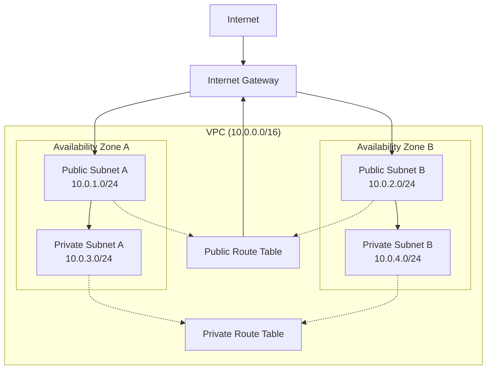

# Networking Fundamentals

## What is AWS Networking and Why Should You Care?

Think of AWS networking like designing the road system for a smart city. Just as a city needs well-planned roads, traffic lights, and districts to function efficiently, your cloud applications need a carefully designed network infrastructure to communicate securely and reliably.

Imagine you're the mayor of a digital city (your AWS environment). You need to:
- Create neighborhoods (VPCs) where different groups of residents (applications) can live
- Build roads (subnets) that connect these neighborhoods
- Install traffic management systems (route tables) to direct traffic efficiently
- Ensure emergency services (availability zones) can reach everywhere even if one area has problems

This matters because poor network design is like having a city with confusing roads - everything slows down, security becomes a nightmare, and scaling becomes nearly impossible. Get it right, and your applications communicate seamlessly while staying secure and cost-effective.

**Real-world scenarios where this is critical:**
1. **E-commerce platform** - Your web servers, databases, and payment systems need secure, fast communication
2. **Enterprise migration** - Moving on-premises infrastructure to AWS while maintaining connectivity to existing systems
3. **Multi-region disaster recovery** - Ensuring your applications can failover seamlessly across geographic regions

## The Building Blocks

### Virtual Private Cloud (VPC)
**What it is:** Your own private section of AWS where you have complete control over the network environment.

**Why it exists:** Just like you wouldn't want strangers walking through your house, you don't want other AWS customers' traffic mixing with yours. A VPC creates your isolated network boundary.

**Real-world analogy:** Think of a VPC like a gated community. You own the entire community, decide who can enter, how the streets are laid out, and what rules everyone follows. Other gated communities (other customers' VPCs) exist nearby but are completely separate.

**When to use it:** Every AWS deployment needs at least one VPC. You might create multiple VPCs to separate environments (development, staging, production) or different business units.

💡 **Pro Tip:** Start with one VPC per environment per region. Don't create separate VPCs unless you have a specific business or compliance requirement for complete network isolation.

### Subnet Architecture
**What it is:** Subdivisions within your VPC that help organize resources and control traffic flow.

**Why it exists:** Even within your gated community (VPC), you want different neighborhoods - maybe one for family homes (web servers), one for commercial buildings (databases), and one for utilities (management systems).

**Real-world analogy:** Subnets are like different neighborhoods in your gated community. You might have:
- **Public subnets** = The commercial district where shops (web servers) face the street and customers can visit directly
- **Private subnets** = Residential areas where homes (databases) are protected from direct street access
- **Isolated subnets** = High-security zones like a military base within your community

**When to use each type:**
- **Public subnets:** Web servers, load balancers, NAT gateways - anything that needs direct internet access
- **Private subnets:** Application servers, databases, internal tools - resources that should only be accessed from within your network
- **Isolated subnets:** Highly sensitive systems that should have no internet connectivity at all

### Availability Zones (AZs)
**What it is:** Physically separate data centers within a region that provide redundancy and high availability.

**Why it exists:** Natural disasters, power outages, and equipment failures happen. Having multiple locations ensures your application keeps running even if one location goes down.

**Real-world analogy:** Think of AZs like having branch offices in different parts of the same city. If a fire damages one building, your other offices keep operating. Each office has its own power, internet, and staff, but they're all connected and can work together.

**When to use multiple AZs:** Always! For any production workload, spread your resources across at least two AZs. This is like having backup generators - you hope you never need them, but you'll be grateful when you do.

⚠️ **Important:** Communication between AZs is fast (sub-millisecond latency) but does cost money. Factor this into your architecture decisions.

### Route Tables
**What it is:** The GPS system for your network that tells traffic where to go.

**Why it exists:** Without route tables, network traffic would be like mail without postal codes - it wouldn't know where to go. Route tables provide the directions.

**Real-world analogy:** Route tables are like the street signs and GPS in your city. When someone wants to drive from the residential neighborhood to the commercial district, the route table tells them which roads to take. You can have different route tables for different neighborhoods, just like how some areas might have restricted access roads.

**How they work:**
- Each subnet must be associated with exactly one route table
- Route tables contain rules (routes) that determine where network traffic goes
- More specific routes take priority over general ones (longest prefix match)

## How It All Works Together

## Real-World Applications

### Scenario 1: E-commerce Platform
**The Challenge:** Building a secure, scalable online store that can handle traffic spikes during sales events.

**The Solution:**
- **VPC** spans multiple AZs for high availability
- **Public subnets** host load balancers and web servers that customers access directly
- **Private subnets** contain application servers and databases protected from direct internet access
- **Route tables** ensure secure communication paths between tiers

**Business Impact:** Handles Black Friday traffic without downtime, protects customer data, and scales automatically.

### Scenario 2: Enterprise Hybrid Cloud
**The Challenge:** A bank needs to migrate some applications to AWS while keeping others on-premises due to regulations.

**The Solution:**
- **VPC** designed to integrate with existing on-premises network
- **Multiple subnets** segment different types of workloads based on compliance requirements
- **Careful IP planning** ensures no conflicts with existing corporate networks
- **Route tables** control which traffic can flow between cloud and on-premises

**Business Impact:** Reduces infrastructure costs while maintaining security and compliance requirements.

### Scenario 3: Multi-Tier SaaS Application
**The Challenge:** A software company needs to isolate customer data while sharing common services.

**The Solution:**
- **Separate VPCs** for each major customer or environment
- **Shared services VPC** for common components like monitoring and logging
- **Standardized subnet architecture** across all VPCs for operational consistency
- **Hub-and-spoke routing** model for efficient resource sharing

**Business Impact:** Ensures data isolation for compliance while reducing operational overhead through shared services.

### Scenario 4: Development Environment Isolation
**The Challenge:** A development team needs separate environments for development, testing, and staging that don't interfere with each other.

**The Solution:**
- **Separate VPCs** for each environment to ensure complete isolation
- **Consistent subnet design** across environments for easy deployment
- **Environment-specific route tables** with different access controls
- **Automated provisioning** to quickly spin up new environments

**Business Impact:** Accelerates development cycles while preventing environment conflicts and accidental production access.

## Best Practices and Pro Tips

### IP Address Planning
💡 **Pro Tip:** Plan your IP address space like you're designing a growing city. Leave room for expansion!

- **Use non-overlapping CIDR blocks** across all VPCs to enable future connectivity
- **Reserve larger blocks** than you think you need - IP addresses are free, but redesigning is expensive
- **Follow RFC 1918** for private networks: 10.0.0.0/8, 172.16.0.0/12, 192.168.0.0/16
- **Document your addressing scheme** - future you will thank present you

### Multi-AZ Distribution
💡 **Pro Tip:** Always design for failure from day one, even if you're starting small.

- **Spread critical resources** across at least two AZs
- **Use even numbers** of subnets so you can distribute evenly across AZs
- **Consider AZ capacity** - some AZs might have limited instance types available
- **Test failover scenarios** regularly to ensure they work when needed

### Subnet Sizing
💡 **Pro Tip:** Start with /24 subnets unless you have a specific reason for different sizes.

- **/24 subnets** provide 251 usable IP addresses (AWS reserves 5 per subnet)
- **Smaller subnets** (/25, /26) for special purposes like NAT gateways
- **Larger subnets** (/23, /22) only if you need hundreds of instances
- **Remember:** You can't resize subnets after creation

### Common Pitfalls to Avoid

⚠️ **Overlapping IP ranges:** This prevents VPC peering and creates routing nightmares
⚠️ **Single AZ deployment:** Your application will have downtime during AZ failures
⚠️ **Too many small subnets:** Creates unnecessary complexity and routing overhead
⚠️ **Ignoring future growth:** Running out of IP space requires complete network redesign
⚠️ **Poor documentation:** Undocumented network designs become unmaintainable

## Common Challenges and Solutions

### Challenge: "I'm running out of IP addresses!"
**Symptoms:** Can't launch new instances, subnet shows as full
**Solution:**
1. **Immediate:** Create new, larger subnets and migrate resources
2. **Long-term:** Redesign with better IP planning
3. **Prevention:** Use IP address management tools and monitoring

### Challenge: "My application can't reach the database!"
**Symptoms:** Connection timeouts, "destination unreachable" errors
**Diagnostic approach:**
1. Check route tables - is there a path between subnets?
2. Verify security groups - are the ports open?
3. Confirm network ACLs - are they blocking traffic?
4. Test with VPC Flow Logs to see where packets are being dropped

### Challenge: "Cross-AZ communication is expensive!"
**Symptoms:** Unexpected data transfer charges
**Solution:**
1. **Design apps** to minimize cross-AZ traffic
2. **Use local storage** where possible (EBS, instance store)
3. **Implement caching** to reduce database queries
4. **Monitor costs** with AWS Cost Explorer

### Challenge: "Network performance is inconsistent!"
**Symptoms:** Variable latency, throughput issues
**Solution:**
1. **Use placement groups** for high-performance computing
2. **Enable enhanced networking** on supported instance types
3. **Choose instance types** with appropriate network performance
4. **Monitor CloudWatch metrics** for network utilization

## Integration with Other AWS Services

### Compute Services
- **EC2 instances** launch into specific subnets and inherit their routing
- **Lambda functions** can be configured to run in your VPC for database access
- **ECS and EKS** use VPC networking for container communication

### Storage Services
- **EBS volumes** are AZ-specific and must be in the same AZ as the EC2 instance
- **EFS** can be mounted from multiple AZs with mount targets in each subnet
- **S3** can be accessed via VPC endpoints to avoid internet routing

### Database Services
- **RDS** instances are placed in DB subnet groups spanning multiple AZs
- **ElastiCache** clusters require subnet groups for high availability
- **DynamoDB** can use VPC endpoints for secure access without internet routing

### Security Services
- **IAM** controls who can modify network configurations
- **CloudTrail** logs all network-related API calls for auditing
- **Config** monitors network configuration changes and compliance

## Performance Considerations

### Bandwidth Optimization
- **Instance types** have different network performance levels
- **Enhanced networking** provides higher bandwidth and lower latency
- **Placement groups** optimize network performance for HPC workloads
- **Multi-path networking** can increase total throughput

### Latency Optimization
- **Same-AZ placement** minimizes latency but reduces availability
- **Regional selection** - choose regions closest to your users
- **CDN integration** - use CloudFront for global content delivery
- **Connection pooling** - reduce connection establishment overhead

Remember: AWS networking is like building the foundation of your house - get it right from the start, and everything else becomes easier. Take shortcuts, and you'll be doing expensive renovations later!