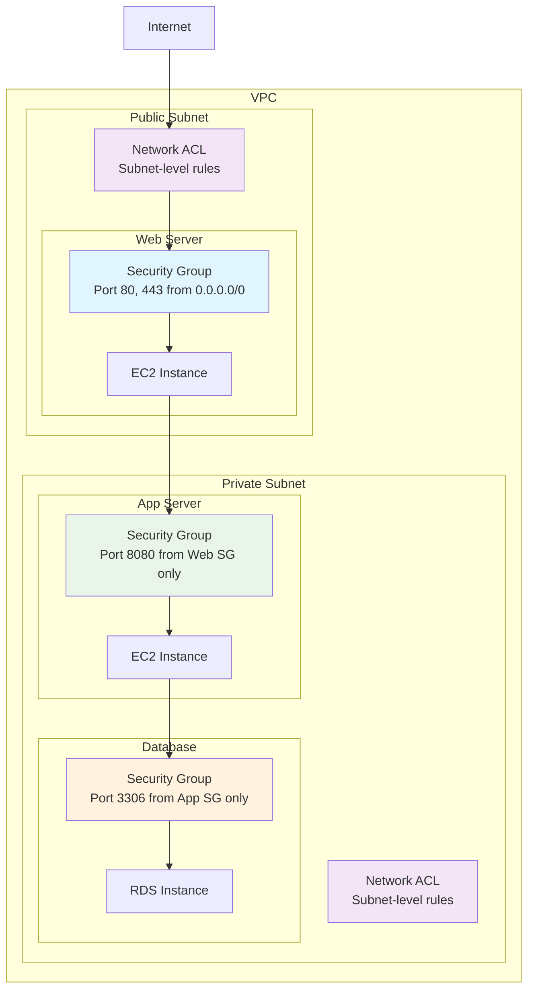

# Security Groups and NACLs

## What are Security Groups and NACLs and Why Should You Care?

Think of AWS network security like designing a multi-layered security system for a high-end corporate building. You wouldn't rely on just one lock on the front door - you'd have multiple layers of security, each with different strengths and purposes.

Imagine you're the security director for a corporate campus:
- **Security Groups** are like having personal bodyguards assigned to each employee. These bodyguards know exactly who each person is allowed to talk to, what meetings they can attend, and what resources they can access. They travel with the person and make decisions in real-time.
- **Network ACLs (NACLs)** are like checkpoint guards at each building entrance. They check everyone coming and going based on simple rules: "Do you have the right badge? Are you on the approved list? Are you coming from an authorized location?"

Both layers work together: even if someone gets past the building checkpoint (NACL), they still need to get past the personal bodyguard (Security Group) to access specific resources.

**Critical business scenarios:**
1. **Multi-tier web application** - Web servers, application servers, and databases each need different security rules
2. **Compliance requirements** - Financial or healthcare data requires strict access controls and audit trails
3. **Development environment isolation** - Preventing accidental access between different project environments

## The Building Blocks

### Security Groups: The Personal Bodyguards
**What they are:** Virtual firewalls that control traffic at the instance level using stateful rules.

**Real-world analogy:** Security groups are like having a highly trained personal assistant who knows your calendar, your preferences, and your security clearance. When someone wants to meet with you, the assistant checks: "Is this person on the approved list? Is this meeting scheduled? Does this person have the right credentials?" If all checks pass, the meeting happens. If you initiate a meeting with someone else, your assistant automatically allows the response back to you.

**Key characteristics:**
- **Stateful:** If you allow inbound traffic, the response is automatically allowed back out
- **Instance-level:** Applied directly to EC2 instances, Lambda functions, RDS databases, etc.
- **Allow rules only:** You can only specify what to allow, not what to deny
- **Real-time changes:** Changes take effect immediately without rebooting instances

**When to use Security Groups:**
- **Application-layer security:** Controlling which services can talk to which
- **Dynamic environments:** Where resources are frequently added/removed
- **Granular access control:** When you need precise control over specific ports and protocols
- **Multi-tier architectures:** Different rules for web, app, and database tiers

💡 **Pro Tip:** Security groups are the primary security mechanism in AWS - master them first, then add NACLs for additional defense.

### Network ACLs: The Building Checkpoints
**What they are:** Stateless firewalls that control traffic at the subnet level using numbered rules.

**Real-world analogy:** Network ACLs are like security checkpoints at building entrances. Every person entering or leaving must show their credentials and state their business. The guards follow a strict checklist: "Badge number 1-1000 are allowed, badge numbers 1001-2000 are denied, everyone else is questioned individually." They don't remember previous interactions - each crossing is evaluated independently.

**Key characteristics:**
- **Stateless:** Inbound and outbound traffic are evaluated separately
- **Subnet-level:** Applied to all traffic entering or leaving a subnet
- **Allow and deny rules:** You can explicitly allow or deny traffic
- **Rule evaluation order:** Rules are processed in numerical order (lowest number first)
- **Default behavior:** Default NACL allows all traffic; custom NACLs deny all traffic by default

**When to use NACLs:**
- **Compliance requirements:** When you need explicit deny rules for audit purposes
- **Subnet-level protection:** Protecting entire subnets from unauthorized access
- **Additional defense layer:** Adding extra security on top of security groups
- **Broad traffic control:** Blocking entire IP ranges or protocols

⚠️ **Important:** NACLs are stateless, so you must create both inbound and outbound rules for bidirectional communication.

### The Interaction Between Security Groups and NACLs
**Traffic evaluation flow:**
1. **Inbound traffic:** NACL inbound rules → Security Group inbound rules → Instance
2. **Outbound traffic:** Security Group outbound rules → NACL outbound rules → Internet

**Defense in depth strategy:**
- **NACLs** provide broad, subnet-level filtering
- **Security Groups** provide precise, instance-level control
- **Both layers** must allow traffic for it to reach your instances

## How Security Groups and NACLs Work Together



## Real-World Applications

### Three-Tier Web Application Security
**Challenge:** Secure a web application with web servers, application servers, and database servers.

**Security Group Strategy:**
- **Web Tier SG:** Allow HTTP (80) and HTTPS (443) from anywhere (0.0.0.0/0)
- **App Tier SG:** Allow port 8080 from Web Tier SG only
- **Database Tier SG:** Allow port 3306 from App Tier SG only
- **Admin SG:** Allow SSH (22) from company IP range only

**NACL Strategy:**
- **Public Subnet NACL:** Allow HTTP/HTTPS inbound, ephemeral ports outbound
- **Private Subnet NACL:** Allow internal communication, deny direct internet access

**Traffic Flow Security:**
1. User requests reach web servers through public NACL and web SG
2. Web servers communicate with app servers through app SG
3. App servers access database through database SG
4. Admins can SSH through admin SG from company network only

### Multi-Environment Isolation
**Challenge:** Ensure development, staging, and production environments are completely isolated.

**Architecture:**
- **Separate VPCs** for each environment
- **Environment-specific security groups** with clear naming conventions
- **NACLs** for additional subnet-level isolation
- **No cross-environment security group references**

**Security Group Naming:**
- `prod-web-sg`, `prod-app-sg`, `prod-db-sg`
- `staging-web-sg`, `staging-app-sg`, `staging-db-sg`
- `dev-web-sg`, `dev-app-sg`, `dev-db-sg`

### Compliance-Driven Security Architecture
**Challenge:** Meet strict financial services compliance requirements with audit trails.

**Implementation:**
- **Explicit deny rules** in NACLs for audit compliance
- **Granular security groups** for principle of least privilege
- **Comprehensive logging** of all security group changes
- **Regular access reviews** and automated compliance checking

**Compliance features:**
- **CloudTrail logging** of all security group modifications
- **Config rules** to detect non-compliant configurations
- **AWS Security Hub** for centralized security posture management

## Best Practices and Pro Tips

### Security Group Design Principles
💡 **Pro Tip:** Design security groups around application tiers and functions, not individual instances.

**Effective security group strategy:**
- **Tier-based groups:** Create separate groups for web, app, and database tiers
- **Function-based groups:** Separate groups for different application functions
- **Admin access groups:** Dedicated groups for administrative access
- **Cross-reference groups:** Reference other security groups instead of IP addresses

**Security group naming conventions:**
- `{environment}-{tier}-{function}-sg`
- Examples: `prod-web-frontend-sg`, `staging-app-api-sg`, `dev-db-mysql-sg`

### NACL Best Practices
💡 **Pro Tip:** Start with the default NACL and only create custom NACLs when you have specific requirements.

**When to use custom NACLs:**
- **Compliance requirements** mandate explicit deny rules
- **Subnet-level protection** is needed for sensitive workloads
- **Additional defense** against misconfigurations

**NACL rule numbering:**
- **Reserve low numbers (1-100)** for critical deny rules
- **Use increments of 100** for normal rules (100, 200, 300)
- **Leave gaps** for future rule insertion

### Security Group Rule Management
💡 **Pro Tip:** Use security group references instead of IP addresses whenever possible.

**Instead of:** `Allow port 3306 from 10.0.1.0/24`
**Use:** `Allow port 3306 from app-tier-sg`

**Benefits of security group references:**
- **Dynamic updates:** When instances are added/removed, rules update automatically
- **Reduced maintenance:** No need to update IP addresses manually
- **Better security:** Follows the principle of least privilege more precisely
- **Easier auditing:** Clear relationship between application tiers

### Common Security Patterns

**Bastion Host Pattern:**
```
Admin Users → SSH → Bastion Host (in public subnet) → SSH → Private Instances
Security Groups: admin-access-sg → bastion-sg → private-admin-sg
```

**Load Balancer Pattern:**
```
Internet → Load Balancer → Web Servers → App Servers → Database
Security Groups: alb-sg → web-sg → app-sg → db-sg
```

**Cross-VPC Communication:**
```
VPC A resources → VPC Peering → VPC B resources
Security Groups: Reference security groups by ID across VPCs
```

## Common Challenges and Solutions

### Challenge: "My application can't connect to the database!"
**Symptoms:** Connection timeouts, "destination unreachable" errors

**Diagnostic approach:**
1. **Check security groups:** Does the app SG allow outbound to DB port? Does DB SG allow inbound from app SG?
2. **Verify NACLs:** Do subnet NACLs allow the required traffic?
3. **Confirm ports:** Are you using the correct port numbers?
4. **Test connectivity:** Use telnet or nc to test basic connectivity

**Common issues:**
- **Forgot outbound rules:** Many people forget that custom NACLs deny outbound by default
- **Wrong port numbers:** Database might be running on non-standard port
- **Security group references:** Using IP addresses instead of security group references
- **Ephemeral ports:** NACLs need to allow return traffic on ephemeral ports

### Challenge: "Security group rules are getting out of control!"
**Symptoms:** Hundreds of rules, overlapping permissions, unclear purpose

**Solutions:**
- **Consolidate similar rules:** Group related instances into the same security group
- **Use security group references:** Instead of individual IP addresses
- **Implement naming conventions:** Clear, consistent naming for easy identification
- **Regular auditing:** Review and clean up unused rules quarterly
- **Documentation:** Maintain clear documentation of purpose for each rule

### Challenge: "NACL rules aren't working as expected!"
**Symptoms:** Traffic being blocked unexpectedly, intermittent connectivity issues

**Common NACL mistakes:**
- **Stateless nature:** Forgetting to create both inbound and outbound rules
- **Rule order:** Higher-numbered deny rules being overridden by lower-numbered allow rules
- **Ephemeral ports:** Not allowing return traffic on high-numbered ports
- **Rule conflicts:** Conflicting rules causing unexpected behavior

**Debugging approach:**
1. **Check rule order:** Remember rules are processed in numerical order
2. **Verify both directions:** Ensure both inbound and outbound rules exist
3. **Use VPC Flow Logs:** See exactly where traffic is being blocked
4. **Test incrementally:** Add rules one at a time to isolate issues

### Challenge: "How do I handle ephemeral ports with NACLs?"
**Understanding ephemeral ports:** Return traffic from connections uses random high-numbered ports (1024-65535)

**Solutions:**
- **Allow ephemeral port range:** Create outbound rules allowing ports 1024-65535
- **Use security groups primarily:** Security groups handle ephemeral ports automatically
- **Consider application requirements:** Some applications use specific port ranges

## Integration Points

### With Compute Services
- **EC2 instances:** Primary use case for security groups
- **Lambda functions:** Can use security groups when running in VPCs
- **ECS/EKS:** Containers inherit security groups from their tasks/pods

### With Database Services
- **RDS instances:** Use security groups for database access control
- **ElastiCache:** Security groups control access to cache clusters
- **DocumentDB:** MongoDB-compatible database with security group integration

### With Load Balancers
- **Application Load Balancers:** Use security groups for traffic control
- **Network Load Balancers:** Traffic passes through without security group evaluation
- **Classic Load Balancers:** Support security groups for traffic filtering

### With Monitoring and Compliance
- **VPC Flow Logs:** Monitor accepted and rejected traffic
- **CloudTrail:** Log all security group and NACL changes
- **Config Rules:** Automated compliance checking for security configurations
- **Security Hub:** Centralized security finding aggregation

## Advanced Security Patterns

### Zero Trust Network Architecture
**Principle:** Never trust, always verify - even internal traffic requires explicit permission.

**Implementation:**
- **Micro-segmentation:** Each service has its own security group
- **Explicit permissions:** No broad network access rules
- **Regular rotation:** Periodic review and update of access permissions
- **Monitoring:** Comprehensive logging and alerting on all network traffic

### Security Group Automation
**Automated management:**
- **Infrastructure as Code:** Define security groups in CloudFormation/Terraform
- **Dynamic updates:** Lambda functions that update rules based on events
- **Compliance automation:** Automatic remediation of non-compliant configurations

### Cross-Account Security
**Patterns for multi-account architectures:**
- **Security group sharing:** Limited cross-account security group references
- **Transit Gateway integration:** Centralized security policies across accounts
- **Resource Access Manager:** Sharing security configurations across organization

## Cost and Performance Considerations

### Security Group Limits and Optimization
**AWS Limits (per region):**
- 2,500 security groups per VPC
- 60 inbound rules per security group
- 60 outbound rules per security group
- 5 security groups per network interface

**Optimization strategies:**
- **Consolidate similar rules:** Group related instances together
- **Use CIDR blocks:** Instead of individual IP addresses when appropriate
- **Regular cleanup:** Remove unused security groups and rules

### Performance Impact
**Security group performance:**
- **Minimal overhead:** Security groups are implemented in AWS hypervisor
- **Real-time updates:** Changes take effect immediately
- **Stateful efficiency:** Return traffic doesn't require additional rule evaluation

**NACL performance:**
- **Slightly higher overhead:** Stateless evaluation requires more processing
- **Rule count impact:** More rules can slightly impact performance
- **Best practice:** Keep NACL rules simple and focused

Remember: Network security in AWS is like wearing both a seatbelt and having airbags in your car - security groups and NACLs work together to provide multiple layers of protection. Design them thoughtfully, and they'll keep your applications secure without getting in the way of legitimate traffic!