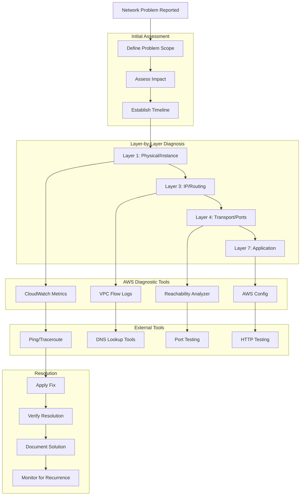

# Troubleshooting and Diagnostics

## What is Network Troubleshooting and Why Should You Care?

Think of network troubleshooting like being a detective in a busy city where traffic problems can have complex, interconnected causes. A simple "traffic jam" might be caused by a broken traffic light, a road closure, an accident, poor traffic signal timing, or even a major event across town affecting overall traffic patterns.

Imagine you're the chief of police for network traffic:
- **Systematic troubleshooting** is like having a proven investigation methodology that helps you find the real cause quickly
- **Diagnostic tools** are like having forensic equipment, traffic cameras, and witness interviews at your disposal
- **Performance monitoring** is like having a city-wide surveillance system that spots problems before they become emergencies
- **Proactive monitoring** is like having patrol officers who know the neighborhood and can spot trouble brewing

Without good troubleshooting skills and tools, you're like a detective trying to solve crimes blindfolded - you might eventually stumble onto the answer, but it takes much longer and causes more damage.

**Critical business scenarios:**
1. **Service outages** - When applications are completely unavailable and every minute costs money
2. **Performance degradation** - When everything works but is unacceptably slow, affecting user experience
3. **Security incidents** - When unusual network traffic patterns indicate potential attacks or breaches

## The Building Blocks

### Systematic Troubleshooting Approach: The Investigation Methodology
**What it is:** A structured process for diagnosing network issues that ensures you find the root cause efficiently.

**Real-world analogy:** Systematic troubleshooting is like having a proven police investigation procedure. You don't just randomly search for clues - you have a methodical approach that starts with the most likely causes and systematically eliminates possibilities until you find the truth.

**The OSI Model Approach:**
Work through network layers systematically:

**Layer 1 (Physical):** 
- Check if instances are running
- Verify network interfaces are attached
- Confirm availability zone health

**Layer 2 (Data Link):**
- Verify MAC addresses and local networking
- Check instance-level network configuration
- Validate enhanced networking features

**Layer 3 (Network):**
- Check IP address assignments
- Verify routing tables and routes
- Confirm subnet configurations

**Layer 4 (Transport):**
- Verify port connectivity
- Check security group rules
- Test with telnet/nc for basic connectivity

**Layer 7 (Application):**
- Test application-specific protocols
- Verify load balancer health checks
- Check application logs and errors

💡 **Pro Tip:** Start with the most common causes first - security groups, routing, and DNS issues account for 80% of network problems.

### Network Connectivity Issues: Finding the Broken Links
**What they are:** Problems preventing traffic from reaching its intended destination.

**Real-world analogy:** Network connectivity issues are like road closures in your city. Sometimes a bridge is completely out (hard failure), sometimes there's construction slowing everything down (performance issue), and sometimes the GPS is giving wrong directions (routing problem).

**Common Connectivity Problems:**

**Security Group Issues:**
- **Symptoms:** Connection timeouts, "destination unreachable" errors
- **Diagnosis:** Check both source and destination security groups
- **Testing:** Use security group rule analyzer or manual review

**Route Table Problems:**
- **Symptoms:** Traffic going to wrong destinations or nowhere
- **Diagnosis:** Trace route tables from source to destination
- **Testing:** Use VPC Reachability Analyzer

**DNS Resolution Failures:**
- **Symptoms:** "Host not found" errors, intermittent connectivity
- **Diagnosis:** Test DNS resolution with dig/nslookup
- **Testing:** Check VPC DNS settings and Route 53 configuration

**Network ACL Blocking:**
- **Symptoms:** Asymmetric connectivity, works one direction only
- **Diagnosis:** Remember NACLs are stateless - check both directions
- **Testing:** Temporarily allow all traffic to isolate NACL issues

### Performance Troubleshooting: Finding the Traffic Jams
**What it is:** Diagnosing why network connections are slow or inconsistent.

**Real-world analogy:** Performance troubleshooting is like figuring out why traffic is moving slowly through your city. It might be rush hour congestion (bandwidth limitations), poorly timed traffic lights (latency issues), or construction reducing lane capacity (resource constraints).

**Performance Diagnostic Process:**

**Establish Baseline:**
- **Normal performance metrics:** What should performance look like?
- **Historical data:** CloudWatch metrics from when things worked well
- **Comparative analysis:** How does performance compare to similar setups?

**Identify Bottlenecks:**
- **Bandwidth saturation:** Are you hitting instance network limits?
- **Latency spikes:** Where is additional delay being introduced?
- **Packet loss:** Are packets being dropped somewhere in the path?
- **Connection limits:** Are you hitting concurrent connection limits?

**Common Performance Issues:**
- **Instance network limits:** Wrong instance type for network requirements
- **Cross-AZ traffic:** Unnecessary traffic between availability zones
- **Inefficient protocols:** Using chatty protocols or poor connection management
- **Application bottlenecks:** Database queries, external API calls, processing delays

### Security Investigation: Spotting the Suspicious Activity
**What it is:** Analyzing network traffic patterns to identify security threats or policy violations.

**Real-world analogy:** Security investigation is like having detective work combined with traffic pattern analysis. You're looking for unusual behavior - cars driving in circles, suspicious vehicles in restricted areas, or traffic patterns that don't match normal business hours.

**Security Diagnostic Tools:**

**VPC Flow Logs Analysis:**
- **Traffic patterns:** Who is talking to whom and when
- **Blocked connections:** What traffic is being denied and why
- **Anomaly detection:** Unusual traffic volumes or destinations
- **Compliance verification:** Ensuring traffic follows approved patterns

**GuardDuty Findings:**
- **Threat detection:** Automated identification of malicious activity
- **Behavioral analysis:** Machine learning-based anomaly detection
- **Intelligence feeds:** Known malicious IP addresses and domains
- **Investigation workflows:** Guided response to security findings

**Common Security Issues:**
- **Unauthorized access attempts:** Brute force attacks, scanning
- **Data exfiltration:** Unusual outbound traffic patterns
- **Compromised instances:** Instances communicating with known bad actors
- **Policy violations:** Traffic that shouldn't be allowed per security policies

## Diagnostic Tools and Techniques

## Real-World Troubleshooting Scenarios

### E-commerce Site Outage During Black Friday
**Problem:** Major e-commerce site becomes completely inaccessible during peak traffic.

**Systematic Investigation:**
1. **Impact assessment:** Complete outage affecting all users globally
2. **Initial triage:** Check CloudWatch dashboards for obvious patterns
3. **Layer 4 diagnosis:** Load balancer health checks failing
4. **Root cause:** Auto Scaling group hit maximum capacity, no healthy targets
5. **Immediate fix:** Increase Auto Scaling limits and launch emergency capacity
6. **Long-term solution:** Implement better capacity planning and load testing

**Lessons learned:**
- **Proactive monitoring:** Set up alerts before hitting capacity limits
- **Load testing:** Regular testing under realistic traffic conditions
- **Capacity planning:** Build buffers for unexpected traffic spikes

### Intermittent Database Connection Issues
**Problem:** Application occasionally can't connect to database, causing user errors.

**Investigation Process:**
1. **Pattern analysis:** Issues happen randomly, affecting ~5% of requests
2. **Security group review:** Rules appear correct for database access
3. **Connection pool analysis:** Application hitting database connection limits
4. **DNS investigation:** Some requests resolving to wrong database endpoint
5. **Root cause:** DNS caching issues with RDS failover endpoint

**Resolution:**
- **Immediate:** Clear DNS caches and restart application servers
- **Long-term:** Implement proper connection pooling with retry logic
- **Monitoring:** Add detailed connection metrics and DNS resolution monitoring

### Suspected Security Breach
**Problem:** Security team alerts about unusual outbound traffic from production environment.

**Security Investigation:**
1. **VPC Flow Logs analysis:** Large data transfers to unknown external IPs
2. **Instance inspection:** One web server showing unusual CPU and network activity
3. **Process analysis:** Unauthorized cryptocurrency mining software discovered
4. **Impact assessment:** No customer data accessed, but compute resources compromised
5. **Containment:** Isolate affected instance and rebuild from clean AMI

**Response actions:**
- **Immediate:** Block malicious IPs and isolate compromised resources
- **Investigation:** Determine attack vector and scope of compromise
- **Prevention:** Implement better monitoring and access controls
- **Documentation:** Complete incident report and lessons learned

## Best Practices and Pro Tips

### Effective Troubleshooting Methodology
💡 **Pro Tip:** Always start by clearly defining the problem before diving into solutions.

**Problem Definition:**
- **What exactly is broken?** Be specific about symptoms
- **When did it start?** Timeline helps identify potential causes
- **Who is affected?** Scope helps prioritize and focus investigation
- **What changed recently?** Changes often correlate with problems

**Documentation Strategy:**
- **Record your steps:** Document what you've checked and ruled out
- **Save evidence:** Screenshots, log entries, configuration snapshots
- **Share findings:** Keep team updated on investigation progress
- **Create runbooks:** Document solutions for future reference

### Proactive Monitoring Setup
💡 **Pro Tip:** Set up monitoring that tells you about problems before your users do.

**Essential Monitoring:**
- **Application health checks:** Monitor end-to-end application functionality
- **Infrastructure metrics:** CPU, memory, network, and disk utilization
- **Business metrics:** Transaction rates, error rates, response times
- **Security monitoring:** Unusual access patterns and security events

**Alerting Strategy:**
- **Tiered alerts:** Different urgency levels for different types of issues
- **Escalation procedures:** Clear escalation path when alerts aren't addressed
- **Alert fatigue prevention:** Tune alerts to minimize false positives
- **Runbook integration:** Link alerts to troubleshooting procedures

### Diagnostic Tool Mastery
💡 **Pro Tip:** Learn to use AWS native diagnostic tools effectively - they're often more powerful than external tools.

**AWS Native Tools:**
- **VPC Reachability Analyzer:** Test connectivity between AWS resources
- **CloudWatch Insights:** Query VPC Flow Logs and application logs
- **X-Ray:** Trace requests across distributed applications
- **Systems Manager Session Manager:** Access instances without SSH

**Command Line Tools:**
- **AWS CLI:** Programmatic access to AWS services and configurations
- **dig/nslookup:** DNS troubleshooting and validation
- **traceroute/mtr:** Network path analysis
- **netstat/ss:** Connection and port analysis

### Common Troubleshooting Pitfalls
⚠️ **Assumption errors:** Don't assume you know the cause - verify everything
⚠️ **Tunnel vision:** Consider multiple potential causes, not just the obvious one
⚠️ **Change fatigue:** Remember that multiple issues can occur simultaneously
⚠️ **Documentation neglect:** Failing to document solutions leads to repeated investigations

## Integration with Monitoring and Alerting

### CloudWatch Integration
- **Custom metrics:** Application-specific performance indicators
- **Composite alarms:** Complex alerting logic combining multiple metrics
- **Anomaly detection:** Machine learning-based threshold setting
- **Dashboard sharing:** Centralized visibility for entire team

### Third-Party Tool Integration
- **Log aggregation:** ELK stack, Splunk for centralized log analysis
- **APM tools:** New Relic, Datadog for application performance monitoring
- **Network monitoring:** Tools like ThousandEyes for end-to-end visibility
- **Collaboration:** Integration with Slack, PagerDuty for incident response

### Automation in Troubleshooting
- **Automated diagnostics:** Scripts that perform common diagnostic steps
- **Self-healing systems:** Automatic remediation for known issues
- **Runbook automation:** Automate manual troubleshooting procedures
- **Chatbots:** Slack/Teams bots that can run diagnostic commands

## Advanced Troubleshooting Patterns

### Distributed Tracing
**Pattern:** Track requests across multiple services to identify bottlenecks and failures.

**Implementation:**
- **AWS X-Ray:** Native distributed tracing service
- **OpenTracing:** Industry standard for distributed tracing
- **Service maps:** Visualize service dependencies and performance
- **Error correlation:** Link errors back to specific code paths

### Chaos Engineering
**Pattern:** Intentionally introduce failures to test system resilience and troubleshooting procedures.

**Practices:**
- **Failure injection:** Simulate network partitions, instance failures
- **Game days:** Scheduled exercises to practice incident response
- **Blast radius limitation:** Start small and gradually increase scope
- **Learning integration:** Document lessons learned and improve systems

### Incident Response Optimization
**Pattern:** Streamline incident response with defined procedures and automation.

**Components:**
- **Incident classification:** Clear severity levels and response procedures
- **Communication templates:** Pre-written updates for different types of incidents
- **Automated escalation:** Trigger escalation when issues aren't resolved quickly
- **Post-incident reviews:** Systematic analysis to prevent recurrence

Remember: Network troubleshooting is like being a skilled detective - you need the right tools, proven methodologies, and the persistence to follow clues until you find the truth. The better your diagnostic skills, the faster you can restore service and prevent future issues!