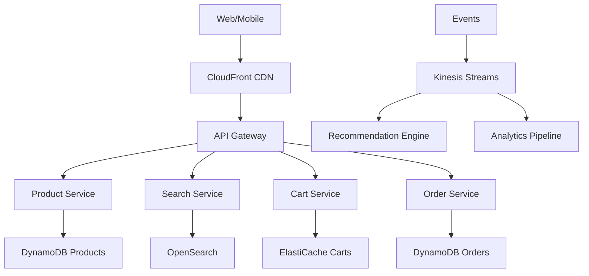
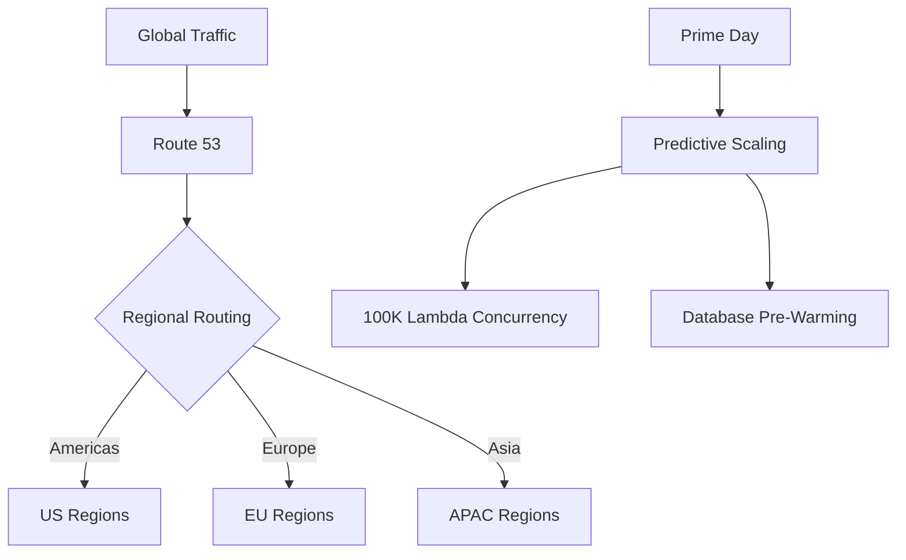
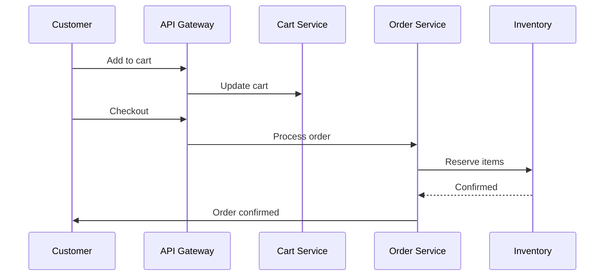
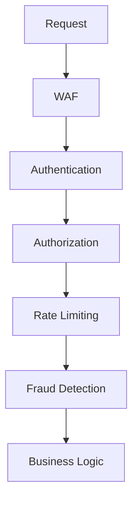

# Amazon-Scale E-commerce: AWS Serverless Architecture

## 1. Business Context & Requirements

Amazon serves 300+ million customers worldwide, processing millions of orders daily across 350+ million products. The platform handles massive traffic spikes during Prime Day and holiday seasons while maintaining personalized experiences.

**Core Requirements:**
- **Scale**: 600+ million daily page views, 3+ billion product searches
- **Performance**: <100ms API response, <3 second page loads
- **Inventory**: Real-time updates across millions of products
- **Personalization**: Individual recommendations for 300+ million customers
- **Orders**: 1+ million daily orders with complex fulfillment
- **Global**: 200+ countries with localized experiences

**Success Metrics:**
- Cart conversion >15%, Search satisfaction >85%
- Order accuracy >99.9%, Platform availability 99.99%
- Personalization drives >35% of sales

**Constraints:**
- Real-time inventory across global fulfillment centers
- Complex pricing with promotions and regional variations
- Financial compliance and data privacy regulations
- Third-party seller and vendor integrations

## 2. Architecture Overview

Event-driven microservices handle catalog management, order processing, inventory synchronization, and personalized experiences across a globally distributed platform.

**Core Principles:**
- Domain-driven service boundaries (catalog, orders, inventory, customers)
- Event sourcing for audit trails and analytics
- CQRS for optimized read/write patterns
- Multi-layer caching for performance
- Search-first product discovery

**Primary AWS Services:**
- **API Gateway**: 1B+ daily API calls with intelligent caching
- **Lambda**: Business logic, transformations, integrations
- **DynamoDB**: Product catalog, customer data, orders
- **ElastiCache**: Product cache and customer sessions
- **Kinesis**: Customer interactions, inventory, order events
- **EventBridge**: Workflow orchestration
- **OpenSearch**: Product search and recommendations



## 3. Detailed Component Design

### API Layer
- Customer-facing gateway with aggressive caching
- Mobile-optimized API with compression
- Partner integration endpoints
- WAF protection and rate limiting

### Compute Functions
**Product Catalog:**
- `product-detail-service`: Product page requests
- `category-browse-service`: Navigation and filtering
- `inventory-availability-service`: Real-time stock status

**Search & Discovery:**
- `search-query-processor`: Search with auto-complete
- `recommendation-engine`: Personalized recommendations
- `trending-products-service`: Popular items

**Order Management:**
- `cart-management-service`: Shopping cart operations
- `checkout-processor`: Payment and validation
- `order-fulfillment-service`: Warehouse coordination

### Data Layer
**DynamoDB Tables:**
```
Products: PK=product_id, SK=variant_id
- GSI: category+price, brand+date
- Attributes: title, price, images, specs

Customers: PK=customer_id, SK=profile_type
- GSI: geographic_region
- Attributes: profile_data, preferences

Orders: PK=customer_id, SK=order_date+id
- GSI: order_id, LSI: status
- Attributes: order_details, payment
```

**ElastiCache:** Shopping carts, recommendations, sessions
**OpenSearch:** Product search, analytics, recommendations

## 4. Scalability & Performance

### Traffic Spike Management
**Prime Day Preparation:**
- Capacity planning 30 days ahead
- Resource pre-warming 24 hours before
- Global content caching
- Read replica creation

**Real-Time Scaling:**
- Lambda: 10K to 100K+ concurrent executions
- DynamoDB: 90% utilization auto-scaling
- ElastiCache: Automatic node addition
- API Gateway: 500K RPS burst capacity

### Global Distribution
- Primary regions: US-East, EU-West, Asia-Pacific
- Localized product catalogs
- DynamoDB Global Tables
- 400+ CloudFront edge locations



## 5. Real-Time Processing

### Personalization Engine
**Real-Time Recommendations:**
1. Customer interaction captured via Kinesis
2. Stream processing analyzes behavioral patterns
3. Lambda calculates updated recommendation scores
4. ElastiCache refreshes recommendations
5. Next page load includes updates

**Data Sources:**
- Page views with dwell time
- Search queries and interactions
- Cart operations and purchase history
- Browsing patterns and preferences

### Inventory Management
**Real-Time Updates:**
- Sales: Immediate inventory decrements
- Restocking: Supplier delivery triggers
- Transfers: Inter-warehouse tracking
- Returns: Damage/return adjustments

**Multi-Channel Sync:**
- Marketplace sellers (15-minute sync)
- Physical stores for omnichannel
- Warehouse management systems
- Supplier inventory feeds

### Order Workflows
**EventBridge Orchestration:**
- Order placement and payment
- Fulfillment assignment
- Picking and packing updates
- Shipping and delivery confirmation



## 6. Security Implementation

### Authentication & Authorization
- Cognito User Pools with MFA
- Social login integration
- Account takeover protection
- Secure session management

### Data Protection
- PII encryption with customer-managed keys
- PCI DSS compliance for payments
- Order history encryption
- Anonymized search analytics

### Fraud Detection
- Real-time transaction monitoring
- ML anomaly detection models
- Device fingerprinting
- Geolocation validation



## 7. DevOps & Monitoring

### Deployment Pipeline
- Blue-green deployments
- Feature flags for gradual rollouts
- Canary releases with monitoring
- Regional deployment staging
- Emergency rollback procedures

### Monitoring
**Business Metrics:**
- Conversion rates and search success
- Recommendation effectiveness
- Customer satisfaction scores

**Technical Metrics:**
- API P99 latency tracking
- Database performance monitoring
- Cache hit rates optimization
- Application error tracking

## 8. Product Search and Recommendation Deep Dive

### OpenSearch Implementation
**Search Architecture:**
- Product documents with searchable attributes
- Faceted navigation (category, brand, price)
- Auto-complete with query suggestions
- Spell correction and query expansion

**Ranking Algorithm:**
- Relevance scoring with business rules
- Popularity and sales velocity
- Customer review ratings
- Personalization factors

### Machine Learning Pipeline
**Recommendation Models:**
- Collaborative filtering for similar customers
- Content-based filtering for similar products
- Deep learning for complex patterns
- A/B testing for algorithm optimization

**Real-Time Scoring:**
- Batch model training nightly
- Stream processing for current session
- Individual score computation on-demand
- Trending content integration

## 9. Production Considerations

### Cost Optimization
- Lambda memory optimization (30% cost reduction)
- Reserved DynamoDB capacity
- S3 Intelligent Tiering
- Regional data locality

### Disaster Recovery
- Multi-region active-active deployment
- Cross-region data replication
- 5-minute failover capability
- Monthly disaster recovery testing

### Performance Benchmarking
- Load testing at 10x peak traffic
- Chaos engineering for resilience
- Performance regression prevention
- Quarterly capacity planning

### Future Roadmap
**Technology Evolution:**
- Serverless containers for ML workloads
- Enhanced real-time personalization
- Edge computing optimization
- Voice commerce integration

**Business Growth:**
- Support for 10x transaction volume
- Global marketplace expansion
- Omnichannel integration
- AI-powered customer service

This serverless architecture enables Amazon to deliver personalized shopping experiences at massive scale while maintaining operational efficiency and cost optimization.