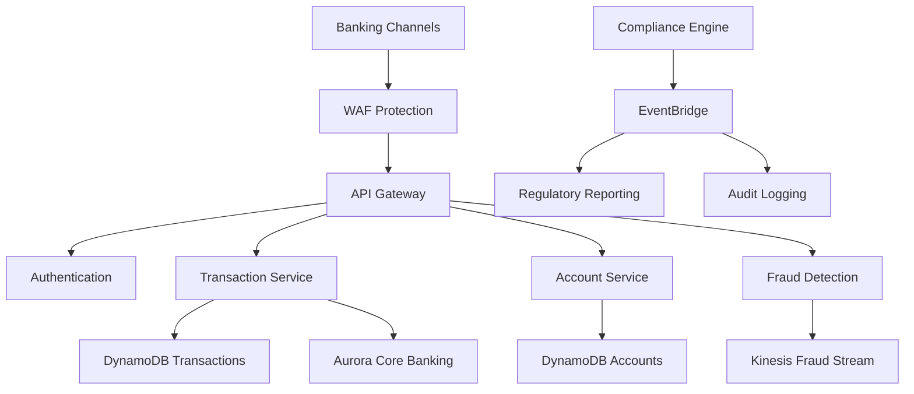
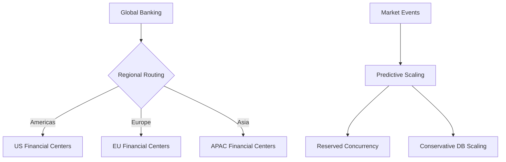
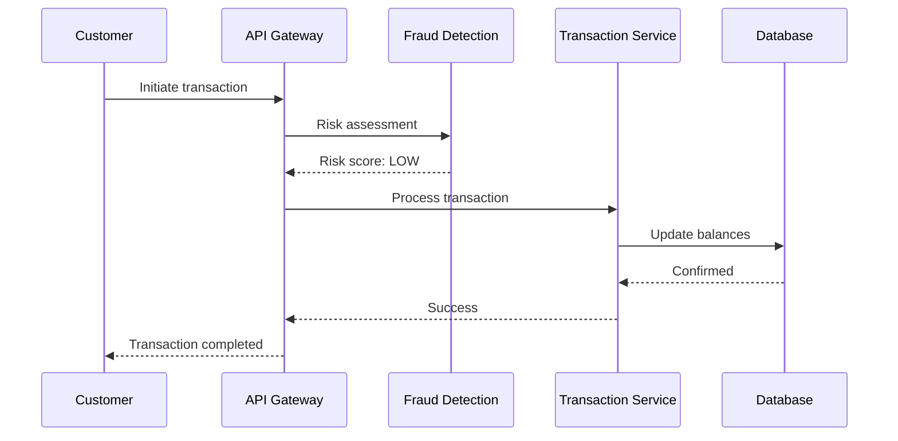
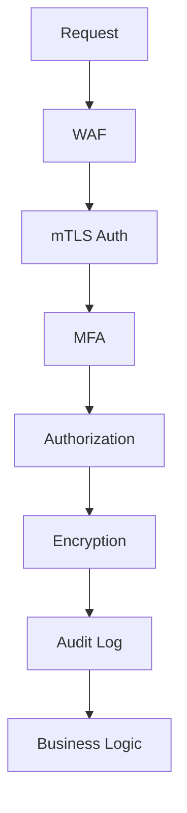

# Banking-Scale Financial Services: AWS Serverless Architecture

## 1. Business Context & Requirements

Modern banking serves millions of customers with real-time transaction processing, fraud detection, and regulatory compliance while handling massive transaction volumes with zero tolerance for data loss.

**Core Requirements:**
- **Scale**: Process 100+ million daily transactions globally
- **Performance**: <50ms transaction authorization, <100ms balance inquiries
- **Reliability**: 99.99% uptime with zero data loss tolerance
- **Security**: Multi-layer fraud detection and real-time risk assessment
- **Compliance**: Real-time regulatory reporting and audit trails
- **Global Operations**: 24/7 across multiple time zones and currencies

**Success Metrics:**
- Transaction success rate >99.95% with sub-second processing
- Fraud detection accuracy >99% with <0.1% false positives
- Regulatory reporting 100% accurate and timely
- Customer satisfaction >95% for digital banking
- Cost per transaction <$0.005 including compliance

**Constraints:**
- Strict regulatory compliance (PCI DSS, SOX, Basel III, GDPR)
- Real-time AML and KYC checks
- Multi-currency and cross-border transaction support
- Legacy core banking system integration
- Disaster recovery with zero data loss (RPO = 0)

## 2. Architecture Overview

Event-driven microservices process financial transactions, manage risk assessment, and ensure regulatory compliance with strong consistency guarantees and comprehensive audit trails.

**Core Principles:**
- ACID transactions for financial operations
- Event sourcing for immutable audit trails
- CQRS for optimized read/write patterns
- Zero-trust security model
- Regulatory-first design approach

**Primary AWS Services:**
- **API Gateway**: Secure financial endpoints with comprehensive logging
- **Lambda**: Transaction processing, fraud detection, compliance
- **DynamoDB**: Account balances, transactions, customer profiles
- **Aurora Serverless**: Core banking data with ACID compliance
- **Kinesis**: Real-time transaction and fraud detection streams
- **EventBridge**: Complex financial workflow orchestration
- **S3**: Regulatory document storage with immutable versioning



## 3. Detailed Component Design

### API Layer Security
- mTLS authentication for all requests
- API key management with rotating keys
- Transaction-specific rate limiting
- Complete request/response audit logging
- WAF rules for financial attack protection

### Compute Functions
**Transaction Processing:**
- `transaction-validator`: Format and business rule validation
- `balance-checker`: Real-time balance verification
- `payment-processor`: Multiple payment type handling
- `settlement-engine`: End-of-day settlement and reconciliation

**Risk Management:**
- `fraud-detector`: Real-time ML-based fraud scoring
- `aml-screener`: Anti-money laundering watchlist checks
- `kyc-validator`: Know-your-customer verification
- `risk-calculator`: Real-time risk assessment

**Compliance:**
- `regulatory-reporter`: Automated report generation
- `audit-logger`: Immutable audit trail maintenance
- `data-classifier`: Automatic data classification
- `retention-manager`: Data retention policy enforcement

### Data Layer
**DynamoDB Financial Tables:**
```
Account Balances: PK=account_id, SK=balance_type
- Conditional writes prevent race conditions
- Strong consistency required
- Attributes: amount, currency, version

Transaction History: PK=account_id, SK=timestamp+id
- GSI: transaction_id for lookups
- TTL: Regulatory compliance based
- Encrypted sensitive data

Customer Profiles: PK=customer_id, SK=profile_type
- Customer-managed KMS encryption
- Access logging for compliance
- Risk scores and KYC data
```

**Aurora Serverless:** ACID compliance, point-in-time recovery
**ElastiCache:** Real-time balances, fraud scores, exchange rates

## 4. Scalability & Performance

### Transaction Volume Scaling
**Predictive Scaling:**
- Calendar-based pre-scaling for known events
- Market event monitoring for volatility
- ML models predict transaction volumes
- Follow-the-sun regional optimization

**Auto-Scaling:**
- Lambda reserved concurrency for critical functions
- Conservative DynamoDB scaling for consistency
- Aurora read replica auto-scaling
- Custom API Gateway throttling by customer tier

### Global Operations
- Primary regions in major financial centers
- Cross-region replication with zero RPO
- Data residency for regulatory compliance
- Latency optimization for transaction routing



## 5. Real-Time Processing

### Fraud Detection
**Real-Time Pipeline:**
1. Transaction capture triggers fraud analysis
2. Feature engineering for risk indicators
3. ML models generate risk scores <10ms
4. Business rules for additional validation
5. Decision: approve, decline, or verify

**ML Models:**
- Behavioral analysis of spending patterns
- Velocity checks for frequency/amount
- Geolocation-based risk assessment
- Device fingerprinting validation

### AML Monitoring
- Real-time watchlist screening (OFAC, sanctions)
- Transaction pattern analysis for suspicious activity
- Customer due diligence monitoring
- Automated suspicious activity reporting (SAR)

### Risk Assessment
- Real-time credit scoring for decisions
- Portfolio risk monitoring
- Stress testing with scenario analysis
- Regulatory capital requirement calculations



## 6. Security Implementation

### Zero-Trust Banking Security
**Authentication:**
- Multi-factor authentication for all operations
- Certificate-based system-to-system communication
- Privileged access management with time limits
- Continuous risk-based authentication

**Data Protection:**
- All data encrypted with customer-managed KMS keys
- TLS 1.3 for all communications
- Hardware Security Module (HSM) integration
- Automated sensitive data exposure detection

### Compliance Security
**PCI DSS:**
- Payment card data tokenization and encryption
- Segmented networks for card processing
- Strict cardholder data access controls
- Continuous card processing monitoring

**SOX Compliance:**
- Automated financial reporting controls
- Immutable audit logs for all operations
- Automated duty separation enforcement
- Controlled deployment with approval workflows



## 7. DevOps & Monitoring

### Regulatory-Compliant Pipeline
- Mandatory peer review with regulatory sign-off
- Automated security and compliance testing
- Regulatory approval workflow for changes
- Scheduled deployments during low-activity periods

### Monitoring
**Business Metrics:**
- Transaction success rates and fraud accuracy
- Compliance metrics and regulatory reporting
- Customer experience and satisfaction scores

**Technical Metrics:**
- API P99 latency for all operations
- Database transaction throughput
- Security incident tracking
- Infrastructure availability monitoring

## 8. Payment Processing Deep Dive

### Multi-Channel Processing
**Payment Types:**
- ACH batch processing
- Real-time wire transfers
- Credit/debit card transactions
- Digital wallet integrations

**Settlement Architecture:**
- Real-time settlement for critical transactions
- End-of-day batch processing for ACH
- Cross-border correspondent banking
- Automated regulatory settlement reporting

### Core Banking Integration
- Secure mainframe system interfaces
- Real-time data synchronization
- Immediate account posting
- Automated system reconciliation

## 9. Production Considerations

### Cost Optimization
- Function right-sizing for financial workloads
- Reserved capacity for predictable operations
- Intelligent storage tiering for documents
- Direct Connect for reduced transfer costs

### Disaster Recovery
**Zero Data Loss:**
- Continuous cross-region replication
- Point-in-time recovery capabilities
- Automated failover procedures
- Regular disaster recovery testing

**Business Continuity:**
- Multiple data center operations
- Real-time backup validation
- Emergency operations procedures
- Regulatory notification protocols

### Performance Benchmarking
- Load testing for peak transaction volumes
- Chaos engineering for system resilience
- Performance regression prevention
- Real-time capacity monitoring and alerting

### Future Roadmap
**Technology Evolution:**
- Enhanced ML for fraud detection
- Blockchain integration for settlements
- Quantum-resistant cryptography
- Advanced analytics for risk management

**Regulatory Adaptation:**
- Open banking API compliance
- Central bank digital currency (CBDC) support
- Enhanced privacy regulations
- Real-time regulatory reporting automation

This serverless architecture enables banks to process millions of transactions daily while maintaining strict regulatory compliance, real-time fraud detection, and zero data loss requirements at global scale.