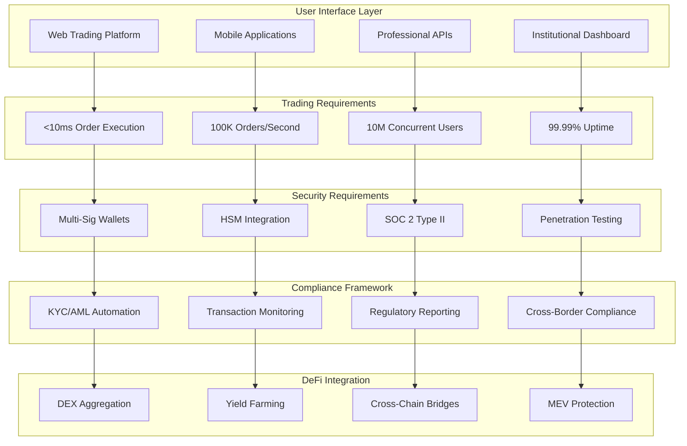
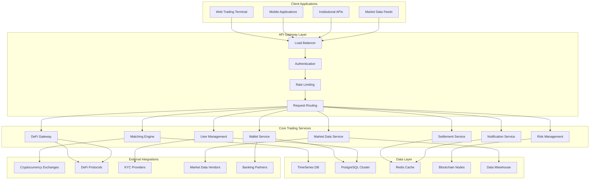
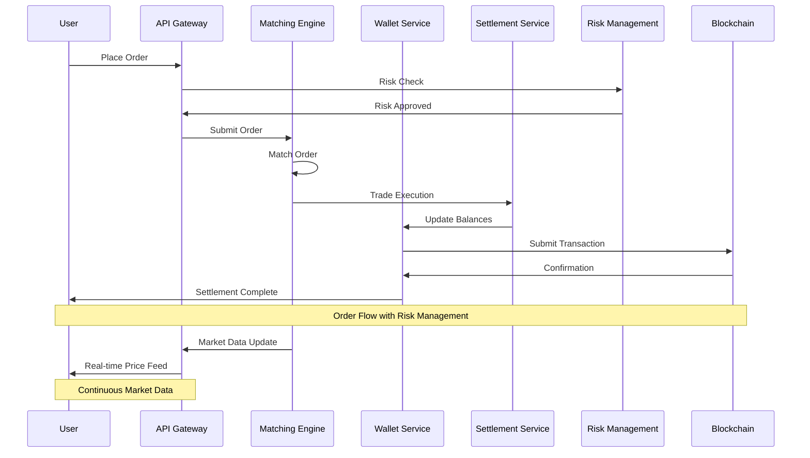
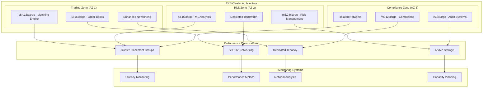
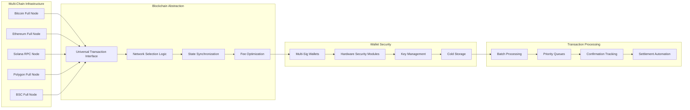
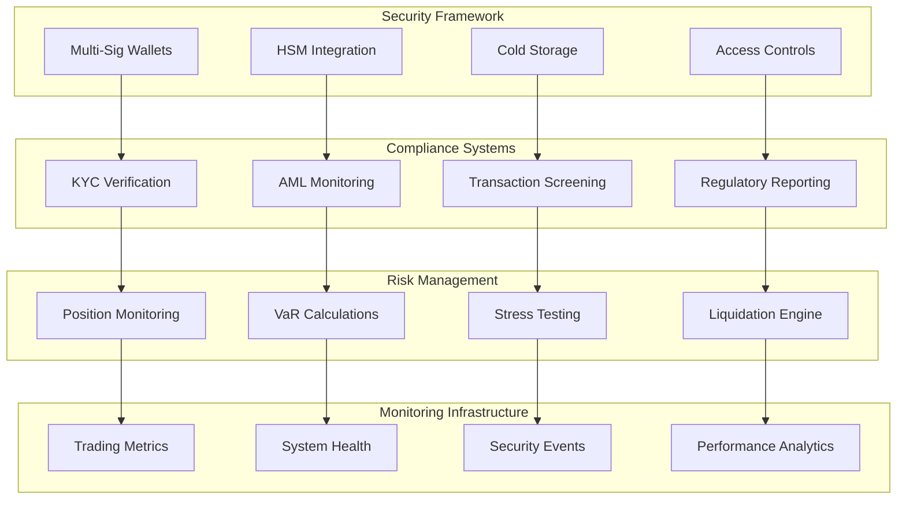
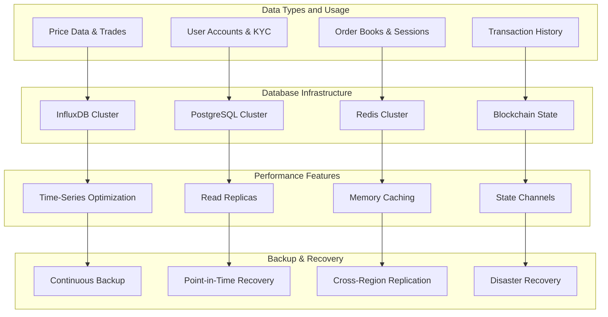
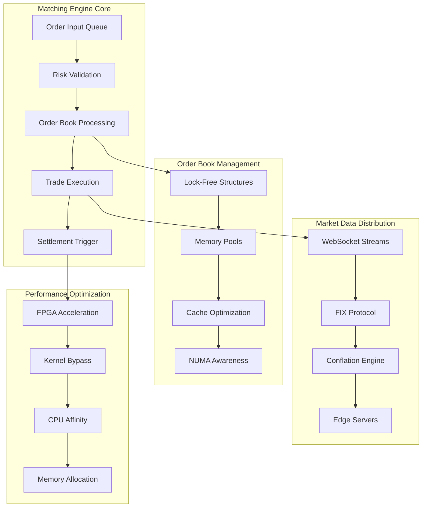
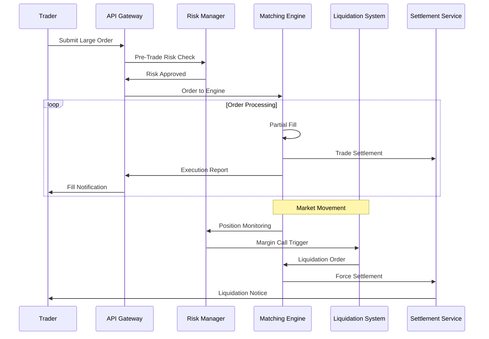
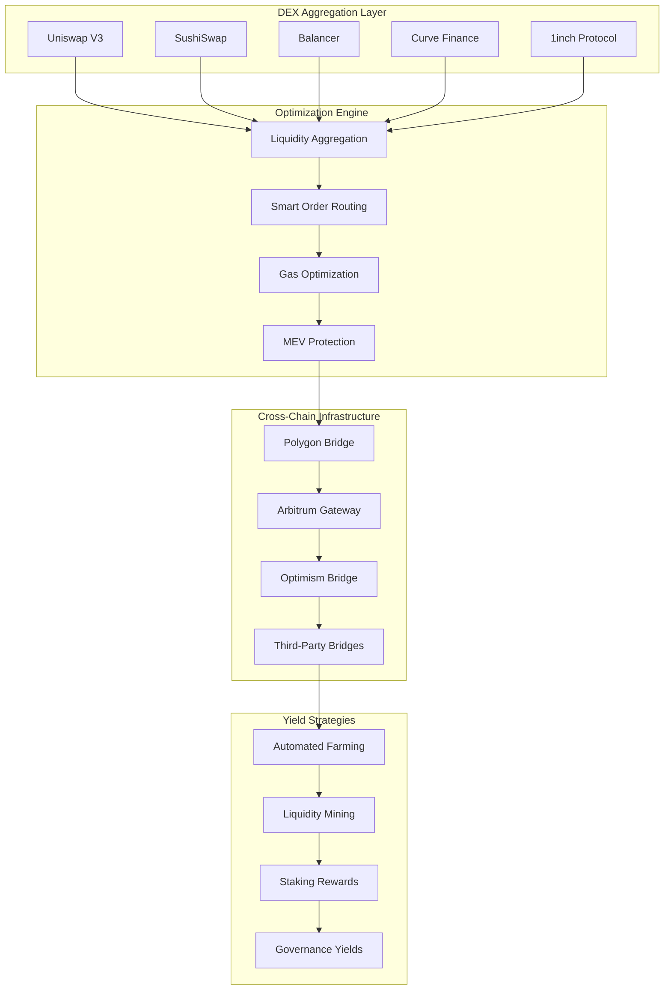

# Cryptocurrency and DeFi Trading Platform - Comprehensive Case Study

## Executive Summary & Market Context

### Cryptocurrency Market Opportunity and Scale

The global cryptocurrency market has evolved into a $3 trillion ecosystem, representing one of the fastest-growing financial sectors in human history. Decentralized Finance (DeFi) protocols have accumulated over $200 billion in Total Value Locked (TVL), while institutional adoption continues accelerating with major corporations, banks, and governments integrating digital assets into their operations.

This comprehensive case study presents the architecture and implementation strategy for a large-scale cryptocurrency and DeFi trading platform designed to serve 50 million users globally, processing over 100,000 transactions per second with daily trading volumes exceeding $10 billion. The platform addresses critical market inefficiencies while providing institutional-grade security and regulatory compliance across multiple jurisdictions.

The cryptocurrency trading landscape faces significant challenges including fragmented liquidity across exchanges, prohibitively high gas fees for DeFi interactions, persistent security vulnerabilities leading to billions in losses, and evolving regulatory uncertainty across global markets. Traditional centralized exchanges struggle with single points of failure, while decentralized exchanges suffer from poor user experience and limited institutional features.

### Problem Statement and Market Gaps

Current cryptocurrency trading infrastructure suffers from fundamental limitations that restrict market efficiency and institutional adoption:

**Liquidity Fragmentation**: Trading volume splits across hundreds of exchanges and DEX protocols, creating price inefficiencies and increased slippage costs. Market makers struggle to provide unified liquidity across fragmented venues.

**Performance Bottlenecks**: Existing platforms cannot match traditional finance performance standards, with order execution latencies measured in seconds rather than microseconds. High-frequency trading strategies remain largely inaccessible due to technical limitations.

**Security Vulnerabilities**: The cryptocurrency industry has experienced over $3 billion in security breaches annually, with smart contract vulnerabilities, private key compromises, and exchange hacks creating systemic risks for institutional adoption.

**Regulatory Uncertainty**: Evolving compliance requirements across jurisdictions create operational complexity for global platforms. KYC/AML obligations, securities regulations, and tax reporting requirements demand sophisticated compliance infrastructure.

**User Experience Barriers**: Complex DeFi interactions, high transaction fees, and poor mobile experiences limit mainstream adoption. Professional traders require sophisticated tools while retail users need simplified interfaces.

### Solution Architecture and Value Proposition

Our cryptocurrency and DeFi trading platform provides a comprehensive solution combining centralized exchange performance with decentralized finance innovation:

**Unified Liquidity Pool**: Advanced order routing algorithm aggregates liquidity across major exchanges, DEX protocols, and OTC markets, ensuring optimal execution for all order sizes.

**High-Performance Trading Engine**: Sub-10 millisecond order matching with microsecond latency market data distribution. FPGA-accelerated matching engine handles 100,000+ orders per second with deterministic execution.

**Institutional-Grade Security**: Multi-signature wallets with hardware security module integration, air-gapped cold storage, and comprehensive penetration testing ensure institutional custody standards.

**Global Compliance Framework**: Automated KYC/AML screening, real-time transaction monitoring, and jurisdiction-specific regulatory reporting enable compliant operations across major markets.

**DeFi Integration Gateway**: Seamless access to yield farming, liquidity mining, and cross-chain swaps with automated gas optimization and MEV protection strategies.

### Success Metrics and Performance Targets

The platform targets ambitious performance and business metrics reflecting institutional trading requirements:

**Trading Performance**: Sub-10 millisecond order execution with 99.99% availability during market hours. Order matching engine processes 100,000+ orders per second with deterministic FIFO execution.

**User Experience**: Support for 10 million concurrent users with seamless mobile and web experiences. Sub-second account funding and withdrawal confirmations across major blockchains.

**Security Standards**: Zero security breaches with comprehensive penetration testing, bug bounty programs, and formal smart contract verification. Multi-signature wallet security with hardware security module integration.

**Regulatory Compliance**: 100% compliant operations across major jurisdictions including United States, European Union, and Asia-Pacific regions. Automated AML screening with real-time suspicious activity reporting.

**Business Growth**: $5 billion Total Value Locked within first year, $500 million annual revenue through trading fees and DeFi yield sharing. Strategic partnerships with major market makers and institutional clients.

### Investment Framework and Financial Projections

Platform development requires $1 billion investment distributed across technology infrastructure, regulatory compliance, security auditing, and market development initiatives:

**Technology Infrastructure**: $400 million for high-performance trading systems, blockchain infrastructure, security systems, and global data center deployment.

**Regulatory Compliance**: $200 million for legal frameworks, compliance technology, regulatory filings, and ongoing monitoring systems across multiple jurisdictions.

**Security and Auditing**: $150 million for comprehensive security auditing, penetration testing, formal verification, insurance coverage, and ongoing security monitoring.

**Business Development**: $250 million for market maker partnerships, institutional client acquisition, strategic partnerships, and global market expansion initiatives.

Revenue projections demonstrate strong unit economics with projected $500 million annual revenue within three years through trading fees (0.1% average), DeFi yield sharing (10% of generated yields), and institutional services. Market maker partnerships provide guaranteed minimum trading volumes while institutional custody services generate recurring revenue streams.

### Regulatory Compliance and Global Operations

Comprehensive compliance framework addresses evolving regulatory requirements across major jurisdictions:

**United States Compliance**: SEC securities regulations, CFTC derivatives oversight, FinCEN money services business registration, and state-level money transmitter licenses.

**European Union Framework**: MiFID II investment services regulation, 5AMLD anti-money laundering directive, GDPR data protection requirements, and individual country crypto regulations.

**Asia-Pacific Regulations**: Japan FSA virtual currency exchange licensing, Singapore MAS digital payment token regulations, Hong Kong SFC professional investor requirements, and South Korea KYC obligations.

**Global Standards**: FATF travel rule implementation, SOC 2 Type II certification, ISO 27001 information security management, and ongoing regulatory monitoring across emerging markets.

## System Requirements & Trading Specifications

### Functional Requirements

#### Advanced Trading Engine Capabilities

The platform's trading engine provides comprehensive order management and execution capabilities designed for both retail and institutional traders.

**Order Types and Execution**: Support for market orders with immediate execution, limit orders with price-time priority, stop-loss orders with slippage protection, and take-profit orders with partial fill capabilities. Advanced order types include iceberg orders for large position building, time-weighted average price (TWAP) execution for institutional trades, and volume-weighted average price (VWAP) strategies for optimal market impact reduction.

**Algorithmic Trading Infrastructure**: RESTful API and WebSocket streaming interfaces enable programmatic trading with sub-millisecond latency. FIX protocol support provides institutional-grade connectivity for professional trading firms. Co-location services offer direct market access with microsecond execution latencies.

**Market Making Support**: Dedicated market maker APIs with enhanced order management, inventory tracking, and risk management tools. Liquidity incentive programs with reduced fees and rebate structures encourage market maker participation across all trading pairs.

**Cross-Exchange Arbitrage**: Intelligent order routing identifies arbitrage opportunities across connected exchanges and DEX protocols. Automated execution engines capitalize on price discrepancies while managing inventory risk and transaction costs.

#### Comprehensive Wallet Management System

Multi-blockchain wallet infrastructure supports secure custody and transaction management across major cryptocurrency networks.

**Multi-Signature Security**: Threshold signature schemes require multiple key signatures for transaction authorization. Hardware security module integration ensures private keys never exist in plaintext. Air-gapped signing procedures provide maximum security for large-value transactions.

**Hot and Cold Storage Integration**: Automated hot wallet management maintains optimal liquidity for user withdrawals while minimizing security exposure. Cold storage systems secure majority user funds with multi-layered security protocols and regular security audits.

**Cross-Chain Functionality**: Native support for Bitcoin, Ethereum, Solana, Polygon, Binance Smart Chain, and emerging blockchain networks. Automated bridge protocols enable seamless cross-chain asset transfers with optimal routing and cost minimization.

**Key Recovery and Backup**: Secure key recovery mechanisms protect against key loss while maintaining security standards. Distributed backup systems with geographic redundancy ensure business continuity during disaster scenarios.

#### DeFi Protocol Integration

Seamless integration with major DeFi protocols provides users access to yield generation opportunities and advanced trading strategies.

**DEX Aggregation**: Integration with Uniswap, SushiSwap, PancakeSwap, Balancer, and other major decentralized exchanges. Intelligent routing algorithms identify optimal execution paths considering price impact, slippage, and gas costs.

**Yield Farming Automation**: Automated yield farming strategies across major protocols including Compound, Aave, Yearn Finance, and Convex. Smart contract interactions optimize gas costs while maximizing yield generation through compound interest strategies.

**Liquidity Mining Programs**: Participation in protocol liquidity mining programs with automated reward claiming and compound strategies. Risk assessment algorithms evaluate impermanent loss exposure and optimal position sizing.

**Cross-Chain DeFi Access**: Bridge aggregation enables DeFi participation across multiple blockchain networks. Optimal routing considers bridge fees, security assumptions, and capital efficiency for cross-chain yield opportunities.

#### User Experience and Account Management

Comprehensive user experience designed for both novice and professional traders with intuitive interfaces and advanced functionality.

**KYC and Onboarding**: Streamlined know-your-customer verification with document upload, identity verification, and risk assessment. Automated compliance screening against sanctions lists and PEP databases.

**Portfolio Management**: Real-time portfolio tracking with profit and loss calculation, asset allocation analysis, and performance attribution. Tax reporting tools generate comprehensive reports for regulatory compliance.

**Risk Management Tools**: Position sizing calculators, risk metrics dashboards, and automated stop-loss management. Margin calculation engines provide real-time margin requirements and liquidation risk assessment.

**Educational Resources**: Comprehensive trading guides, market analysis, and DeFi protocol explanations. Interactive tutorials guide users through platform features and advanced trading strategies.

### Non-Functional Requirements

#### Performance and Scalability Specifications

Ultra-high performance requirements ensure institutional-grade trading capabilities with minimal latency and maximum throughput.

**Order Execution Performance**: Sub-10 millisecond order matching with deterministic execution guarantees. Matching engine processes 100,000+ orders per second during peak trading periods. Market data distribution achieves microsecond latency for price updates and order book changes.

**Concurrent User Support**: Platform supports 10 million concurrent users with seamless experience across web and mobile interfaces. Auto-scaling infrastructure accommodates traffic spikes during market volatility events.

**Transaction Processing Capacity**: System processes 1 billion transactions daily across all supported blockchain networks. Batch transaction optimization reduces gas costs while maintaining execution speed.

**Global Latency Optimization**: Sub-100 millisecond response times globally through strategic data center placement and CDN optimization. Direct connectivity to major cryptocurrency exchanges minimizes market data latency.

#### Security and Reliability Framework

Comprehensive security architecture protects user funds and data while ensuring operational reliability.

**Uptime Requirements**: 99.99% availability target with planned maintenance limited to 4 hours monthly during low-volume periods. Mean time to recovery (MTTR) of less than 60 seconds for critical system components.

**Disaster Recovery**: Recovery time objective (RTO) of 15 minutes and recovery point objective (RPO) of 5 minutes. Multi-region deployment ensures service continuity during regional outages.

**Security Standards**: SOC 2 Type II certification, ISO 27001 compliance, and regular penetration testing by third-party security firms. Bug bounty programs incentivize security research and vulnerability disclosure.

**Regulatory Compliance**: Automated compliance monitoring ensures adherence to KYC/AML requirements, tax reporting obligations, and jurisdiction-specific regulations. Real-time transaction monitoring identifies suspicious activities for investigation.

## High-Level Architecture Design

### Architecture Philosophy and Design Principles

The cryptocurrency trading platform embraces a high-performance, event-driven architecture optimized for ultra-low latency trading and massive scalability while maintaining institutional-grade security standards.

#### Event-Driven Architecture

Event-driven design patterns enable real-time responsiveness to market conditions and user actions while maintaining system decoupling and scalability.

**Order Book Events**: Real-time order book updates stream to connected clients with microsecond precision. Event sourcing patterns maintain complete audit trails of all trading activity for regulatory compliance and system recovery.

**Trade Settlement Events**: Automated settlement workflows trigger upon trade execution, initiating blockchain transactions, updating account balances, and generating compliance records. Event-driven settlement reduces counterparty risk and operational complexity.

**Blockchain Confirmation Events**: Smart contract monitoring systems detect blockchain confirmations, automatically updating user balances and triggering dependent workflows. Multi-chain event processing ensures consistent state across all supported networks.

**Risk Management Events**: Real-time risk calculations trigger automated responses including position liquidations, margin calls, and trading restrictions. Event-driven risk management ensures rapid response to changing market conditions.

#### High-Frequency Trading Optimization

Architecture optimizations enable microsecond-latency trading required for institutional high-frequency trading strategies.

**Memory-Optimized Design**: In-memory order books with lock-free data structures minimize memory allocation overhead. CPU cache optimization and memory pool management reduce garbage collection impact on latency-sensitive operations.

**FPGA Acceleration**: Field-programmable gate arrays accelerate critical trading functions including order matching, risk calculations, and market data processing. Hardware acceleration provides deterministic performance characteristics.

**Network Optimization**: Kernel bypass networking with user-space TCP stacks eliminates operating system overhead. Direct memory access and zero-copy networking minimize data movement overhead.

**Co-location Infrastructure**: Physical proximity to major exchanges and data centers reduces network latency to microsecond levels. Dedicated fiber connections provide consistent, low-latency market data feeds.

#### Security-First Design Principles

Comprehensive security architecture protects against sophisticated attacks while maintaining operational efficiency.

**Zero-Trust Network Architecture**: All system communications require authentication and authorization regardless of network location. Micro-segmentation prevents lateral movement within infrastructure.

**Defense in Depth**: Multiple security layers protect against various attack vectors. Redundant security controls ensure system resilience against sophisticated threat actors.

**Cryptographic Security**: End-to-end encryption protects all sensitive data in transit and at rest. Hardware security modules protect cryptographic keys with tamper-resistant hardware.

**Operational Security**: Secure development practices, code auditing, and comprehensive testing prevent vulnerabilities in production systems. Regular security assessments identify and remediate potential weaknesses.

### Core Trading Services Architecture

#### High-Performance Matching Engine Service

The core matching engine provides ultra-low latency order execution with deterministic performance characteristics.

**Order Book Management**: Lock-free order book data structures enable concurrent read/write operations without blocking. Price-time priority matching ensures fair execution while maintaining optimal performance.

**Matching Algorithms**: First-in-first-out (FIFO) matching provides transparent execution with minimal market impact. Pro-rata allocation algorithms distribute large orders across multiple market participants fairly.

**Market Data Distribution**: Real-time market data streams provide order book depth, recent trades, and statistical information. WebSocket and FIX protocol interfaces serve different client requirements.

**Performance Monitoring**: Comprehensive latency monitoring tracks order processing performance across all system components. Real-time alerting identifies performance degradation requiring immediate attention.

#### Advanced Wallet Service

Multi-blockchain wallet infrastructure provides secure custody and transaction management across all supported networks.

**Multi-Signature Wallet Management**: Threshold signature schemes with configurable signing requirements provide institutional-grade security. Hardware security module integration ensures private keys remain secure throughout transaction signing processes.

**Hot and Cold Storage Orchestration**: Intelligent balance management maintains optimal hot wallet liquidity while maximizing cold storage security. Automated rebalancing algorithms minimize security exposure while ensuring withdrawal availability.

**Cross-Chain Transaction Management**: Universal transaction interface abstracts blockchain-specific implementation details. Automated gas optimization and fee estimation ensure cost-effective transaction execution across all networks.

**Key Management and Recovery**: Distributed key generation and backup procedures protect against key loss scenarios. Multi-party computation enables secure key operations without single points of failure.

#### Settlement Service

Automated settlement workflows ensure efficient trade settlement and blockchain transaction processing.

**Real-Time Settlement**: Immediate settlement for supported trading pairs reduces counterparty risk. Netting algorithms minimize blockchain transaction costs through batch processing.

**Blockchain Confirmation Tracking**: Multi-blockchain monitoring systems track transaction confirmations across all supported networks. Automated retry mechanisms handle failed transactions with exponential backoff strategies.

**Reconciliation Systems**: Continuous reconciliation processes ensure consistency between internal records and blockchain state. Automated discrepancy detection triggers investigation and resolution workflows.

**Settlement Risk Management**: Pre-settlement risk checks prevent settlement failures due to insufficient balances or network congestion. Dynamic fee adjustment ensures timely transaction confirmation during network congestion.

#### Risk Management Service

Comprehensive risk management protects platform and users from various financial and operational risks.

**Position Risk Monitoring**: Real-time calculation of portfolio risk metrics including Value at Risk (VaR), portfolio delta, and concentration limits. Automated position sizing recommendations optimize risk-adjusted returns.

**Margin Management**: Dynamic margin calculations consider market volatility, position correlation, and liquidity factors. Automated margin calls and liquidation procedures protect against negative account balances.

**Counterparty Risk Assessment**: Credit scoring algorithms evaluate counterparty creditworthiness for OTC trades and institutional services. Dynamic credit limits adjust based on market conditions and counterparty behavior.

**Market Risk Analysis**: Stress testing and scenario analysis evaluate portfolio performance under various market conditions. Risk reporting provides comprehensive risk analytics for internal management and regulatory compliance.

#### Market Data Service

Real-time market data distribution provides comprehensive pricing information and market analytics.

**Price Data Aggregation**: Multi-source price feeds from exchanges, DEX protocols, and OTC markets provide comprehensive market coverage. Sophisticated algorithms detect and filter erroneous price data.

**Order Book Distribution**: Real-time order book depth streaming with microsecond latency updates. Multiple distribution channels serve different client requirements including WebSocket, FIX, and REST APIs.

**Analytics and Indicators**: Technical analysis indicators, volatility calculations, and market statistics support trading decision-making. Historical data analysis provides backtesting capabilities for algorithmic strategies.

**Market Surveillance**: Automated market surveillance detects unusual trading patterns, potential manipulation, and regulatory violations. Real-time alerting enables rapid response to market irregularities.

#### User Management Service

Comprehensive user lifecycle management with integrated compliance and security features.

**Identity Verification**: Multi-tier KYC verification with document validation, biometric authentication, and third-party identity verification services. Risk-based authentication adjusts verification requirements based on user behavior patterns.

**Account Management**: Unified account management across trading, custody, and DeFi services. Role-based access controls support institutional clients with multiple users and permission hierarchies.

**Compliance Screening**: Automated screening against sanctions lists, politically exposed person (PEP) databases, and adverse media monitoring. Ongoing monitoring ensures continued compliance throughout customer relationship.

**Customer Support Integration**: Integrated ticketing system with blockchain transaction tracking and account history access. Automated case routing ensures appropriate expertise handles specific issue types.

#### DeFi Gateway Service

Seamless integration with decentralized finance protocols provides users access to yield generation and advanced trading strategies.

**Protocol Aggregation**: Integration with major DeFi protocols including Uniswap, Compound, Aave, Curve, and emerging protocols. Unified interface abstracts protocol-specific implementation details.

**Yield Optimization**: Automated yield farming strategies identify optimal yield opportunities across protocols. Risk-adjusted yield calculations consider impermanent loss, smart contract risk, and liquidity factors.

**Cross-Chain DeFi Access**: Bridge aggregation enables DeFi participation across multiple blockchain networks. Intelligent routing considers bridge security, fees, and capital efficiency.

**MEV Protection**: Maximal extractable value (MEV) protection strategies shield users from frontrunning and sandwich attacks. Private mempool submission and time-based ordering reduce MEV exploitation.

## Infrastructure & Blockchain Architecture

### EKS Cluster Design and Performance Optimization

The Amazon Elastic Kubernetes Service (EKS) cluster provides the foundation for high-performance trading operations with specialized configurations optimized for ultra-low latency and massive scalability.

#### Performance-Optimized Node Configuration

Dedicated node groups with specialized hardware configurations support different workload requirements across the trading platform.

**High-Frequency Trading Nodes**: c5n.18xlarge instances with enhanced networking capabilities provide the computational power and network performance required for microsecond-latency trading operations. These nodes feature 72 vCPUs, 192 GB RAM, and 100 Gbps networking with SR-IOV support for maximum performance.

**General Application Nodes**: m5.24xlarge instances handle standard application workloads including user management, market data distribution, and API services. These balanced compute instances provide 96 vCPUs and 384 GB RAM for memory-intensive applications.

**Storage-Optimized Nodes**: i3.16xlarge instances with NVMe SSD storage provide high-IOPS database operations and caching services. Local SSD storage ensures minimal latency for time-series data and order book storage.

**GPU-Accelerated Nodes**: p3.16xlarge instances with NVIDIA V100 GPUs accelerate machine learning workloads for fraud detection, algorithmic trading, and risk analysis. GPU acceleration enables real-time AI inference for trading decisions.

#### Multi-Availability Zone Deployment Strategy

Strategic deployment across three availability zones ensures high availability while optimizing for trading performance.

**Trading Zone Segregation**: Dedicated availability zones for trading engine operations minimize cross-AZ latency while maintaining redundancy. Primary trading operations concentrate in a single AZ with synchronized backup systems in secondary zones.

**Risk Management Isolation**: Risk management systems operate in separate availability zones to ensure continued operation during trading system failures. Independent infrastructure prevents cascade failures affecting risk calculations.

**Compliance and Audit Systems**: Compliance monitoring and audit systems deploy in isolated zones with restricted network access. Separation ensures regulatory systems remain operational during trading system maintenance or failures.

#### Network Optimization and Low-Latency Configuration

Advanced networking configurations minimize latency and maximize throughput for trading operations.

**Enhanced Networking**: SR-IOV enabled instances with enhanced networking provide consistent low-latency performance. Dedicated bandwidth allocation prevents network contention during peak trading periods.

**Placement Groups**: Cluster placement groups ensure trading components deploy in close physical proximity within data centers. Placement optimization reduces inter-service communication latency to microsecond levels.

**Dedicated Tenancy**: Critical trading systems utilize dedicated hosts to eliminate "noisy neighbor" effects from other workloads. Hardware isolation ensures consistent performance characteristics.

**Network Monitoring**: Real-time network performance monitoring tracks latency, packet loss, and bandwidth utilization. Automated alerting identifies network issues affecting trading performance.

### Database Architecture and Data Management

Polyglot persistence strategy employs specialized database technologies optimized for different aspects of cryptocurrency trading operations.

#### Time-Series Database Infrastructure

InfluxDB clusters provide high-performance storage and analysis for financial time-series data.

**Price Data Storage**: Optimized storage for high-frequency price data, order book snapshots, and trade history. Data retention policies balance storage costs with regulatory requirements for historical data preservation.

**Performance Metrics**: Trading system performance metrics including order latency, execution times, and system throughput. Real-time analytics enable performance optimization and capacity planning.

**Market Analytics**: Technical indicators, volatility calculations, and market statistics for trading decision support. Continuous aggregation provides real-time analytics for institutional clients.

**Regulatory Reporting**: Comprehensive audit trails for all trading activities supporting regulatory compliance and internal audit requirements. Immutable storage prevents data tampering while enabling efficient querying.

#### PostgreSQL Cluster Configuration

High-availability PostgreSQL clusters manage user accounts, compliance records, and transactional data.

**User Account Management**: Secure storage of user profiles, KYC documentation, and account settings. Encryption at rest and in transit protects sensitive personal information.

**Compliance Records**: Comprehensive storage of AML screening results, transaction monitoring alerts, and regulatory filings. Audit trails track all access to compliance-sensitive information.

**Settlement Records**: Detailed records of all trade settlements, blockchain transactions, and reconciliation data. Strong consistency guarantees ensure accurate financial record keeping.

**Configuration Management**: System configuration data, trading pair settings, and fee structures. Version control tracks configuration changes with rollback capabilities.

#### Redis Cluster for High-Performance Caching

Redis clusters provide sub-millisecond data access for trading-critical information.

**Order Book Caching**: In-memory order book storage enables microsecond access to current market depth. Persistent storage ensures order book recovery during system restarts.

**Session Management**: User session data, authentication tokens, and real-time preferences. Distributed caching ensures consistent user experience across load-balanced infrastructure.

**Rate Limiting**: Distributed rate limiting prevents API abuse while ensuring fair resource allocation. Real-time counters track usage across all service endpoints.

**Real-Time Pricing**: Current market prices, 24-hour statistics, and derived calculations. Sub-millisecond access ensures trading decisions use the most current market information.

#### Blockchain Node Infrastructure

Dedicated blockchain nodes provide direct access to major cryptocurrency networks.

**Full Node Operations**: Complete blockchain validation for Bitcoin, Ethereum, and major altcoin networks. Full nodes ensure transaction verification independence without relying on third-party services.

**Light Client Integration**: Resource-efficient light clients for smaller cryptocurrency networks. Selective blockchain monitoring reduces infrastructure costs while maintaining network connectivity.

**Node Monitoring**: Comprehensive monitoring of blockchain node health, synchronization status, and network connectivity. Automated alerts ensure rapid response to node failures or network issues.

**Security Hardening**: Blockchain nodes deploy with enhanced security configurations including network segmentation, access controls, and intrusion detection systems.

### Blockchain Infrastructure and Multi-Chain Support

#### Cross-Chain Architecture Design

Unified architecture supports multiple blockchain networks with consistent interfaces and security standards.

**Blockchain Abstraction Layer**: Universal interface abstracts network-specific implementation details enabling consistent application development across different blockchains. Standardized transaction formats simplify multi-chain operations.

**Network Selection Logic**: Intelligent routing selects optimal blockchain networks based on transaction requirements, costs, and performance characteristics. Dynamic network selection adapts to changing network conditions.

**State Synchronization**: Consistent state management across multiple blockchain networks ensures accurate balance tracking and transaction history. Event-driven synchronization maintains real-time consistency.

**Failover Mechanisms**: Automatic failover between blockchain nodes and network providers ensures continued operations during network outages or node failures.

#### Transaction Processing Optimization

Advanced transaction processing techniques minimize costs and maximize throughput across blockchain networks.

**Batch Transaction Processing**: Intelligent batching combines multiple user transactions into single blockchain transactions reducing gas costs. Dynamic batching algorithms optimize for cost and confirmation time.

**Fee Optimization**: Real-time fee estimation and optimization ensures cost-effective transaction submission. Dynamic fee adjustment responds to network congestion while maintaining confirmation speed.

**Transaction Acceleration**: Priority transaction processing for time-sensitive operations including liquidations and arbitrage trades. Express lanes ensure critical transactions receive immediate processing.

**Confirmation Monitoring**: Multi-level confirmation tracking provides confidence levels for different transaction values. Risk-based confirmation requirements balance security with operational efficiency.

#### Multi-Signature Wallet Security

Institutional-grade wallet security with hardware security module integration.

**Threshold Signatures**: Configurable threshold signature schemes require multiple authorized signatures for transaction approval. Flexible threshold configurations support different security requirements across asset types and transaction sizes.

**Hardware Security Modules**: Tamper-resistant HSM integration protects private keys with military-grade security. Hardware-based key generation and storage eliminate software-based attack vectors.

**Key Ceremony Procedures**: Formal key generation and backup procedures ensure secure key management throughout the key lifecycle. Documented procedures support audit requirements and operational continuity.

**Geographic Distribution**: Distributed key storage across multiple geographic locations protects against localized disasters or security breaches. Multi-jurisdiction key storage provides additional legal protection.

## Performance Optimization & Scaling

### Latency Optimization Strategies

Ultra-low latency optimization ensures competitive advantage in high-frequency trading while maintaining system reliability and scalability.

#### Hardware Optimization

Specialized hardware configurations minimize latency at every system layer from network interface to application processing.

**FPGA Acceleration**: Field-programmable gate arrays accelerate critical trading functions including order matching, risk calculations, and market data processing. Custom FPGA implementations provide deterministic performance with sub-microsecond execution times.

**High-Frequency Memory**: DDR4 and DDR5 memory configurations with optimized timings reduce memory access latency. Large memory configurations enable entire order books and market data to reside in memory without disk access.

**NVMe Storage Arrays**: Ultra-fast NVMe storage provides microsecond disk access for persistent data storage. Storage-class memory integration bridges the gap between volatile memory and persistent storage.

**Network Interface Optimization**: Specialized network interface cards with hardware timestamping and kernel bypass capabilities minimize network processing overhead. Direct memory access eliminates CPU involvement in network packet processing.

#### Software Optimization Techniques

Advanced software optimization techniques eliminate unnecessary overhead in critical trading paths.

**Lock-Free Programming**: Lock-free data structures and algorithms eliminate thread synchronization overhead. Wait-free algorithms guarantee progress for all threads regardless of other thread behavior.

**Zero-Copy Networking**: Network processing eliminates data copying between kernel and user space. Direct packet processing from network interface to application reduces CPU overhead and latency.

**Kernel Bypass Technologies**: User-space networking stacks bypass kernel processing for ultra-low latency packet handling. Custom protocol implementations optimize for trading-specific communication patterns.

**CPU Affinity and Isolation**: Critical trading processes bind to dedicated CPU cores with interrupt isolation. CPU isolation prevents operating system interference with latency-sensitive processing.

### Horizontal Scaling Architecture

#### Microservices Scaling Strategy

Independent service scaling enables optimal resource allocation based on varying demand patterns across different platform components.

**Service-Specific Scaling**: Individual microservices scale independently based on their specific load characteristics. Trading engine services scale differently from user management or market data services.

**Load Balancing Algorithms**: Advanced load balancing distributes requests based on service capacity, current load, and health status. Weighted round-robin and least-connections algorithms optimize resource utilization.

**Circuit Breaker Patterns**: Circuit breakers prevent cascade failures by isolating failing services. Automatic service isolation maintains overall system stability during partial failures.

**Auto-Scaling Policies**: Predictive auto-scaling anticipates demand patterns based on historical data and market events. Proactive scaling prevents performance degradation during traffic spikes.

## Operational Excellence & Future Roadmap

### DevOps and Deployment Excellence

Comprehensive DevOps practices ensure reliable, secure, and efficient deployment of platform updates while maintaining continuous operation of trading services.

#### CI/CD Pipeline Architecture

Advanced continuous integration and deployment pipelines enable rapid, safe deployment of platform improvements.

**Automated Testing Framework**: Comprehensive test suites including unit tests, integration tests, performance tests, and security scans. Parallel test execution reduces pipeline duration while maintaining thorough validation.

**Security Integration**: Static application security testing (SAST) and dynamic application security testing (DAST) integrated throughout the development pipeline. Container vulnerability scanning prevents deployment of insecure images.

**Performance Validation**: Automated performance testing validates latency requirements, throughput capabilities, and resource utilization before production deployment. Load testing simulates production traffic patterns.

#### Infrastructure as Code

Comprehensive infrastructure automation ensures consistent, repeatable deployments across all environments.

**Terraform Infrastructure**: Complete infrastructure definition using Terraform enables consistent environment provisioning. Modular Terraform configurations support different environment requirements while maintaining consistency.

**Kubernetes Orchestration**: Comprehensive Kubernetes manifests define application deployment, scaling, and networking requirements. Helm charts provide template-based deployment across different environments.

### Future Innovation Pipeline

#### Layer 2 Blockchain Integration

Advanced blockchain scaling solutions reduce transaction costs while maintaining security and decentralization.

**Optimistic Rollups**: Integration with Optimism and Arbitrum enables low-cost, high-throughput Ethereum transactions. Rollup technology provides Ethereum security guarantees with dramatically reduced costs.

**Zero-Knowledge Rollups**: ZK-rollup integration provides instant finality and enhanced privacy for trading operations. Advanced cryptographic proofs enable scalable, private transactions.

**State Channels**: Payment and state channel integration enables off-chain trading with on-chain settlement. Channel networks provide instant, low-cost microtransactions for high-frequency trading.

#### Institutional Service Expansion

Comprehensive institutional services provide enterprise-grade trading infrastructure for professional clients.

**Prime Brokerage Services**: Multi-prime brokerage capabilities with credit facilities, margin financing, and trade execution services. Institutional-grade settlement and custody services.

**Algorithmic Execution**: Advanced execution algorithms including TWAP, VWAP, implementation shortfall, and custom strategy development. Algorithm customization for specific institutional requirements.

**Custody Solutions**: Institutional custody services with segregated accounts, audit trails, and regulatory reporting. Integration with traditional financial infrastructure for institutional clients.

#### Artificial Intelligence Integration

Advanced AI and machine learning capabilities enhance trading performance, risk management, and operational efficiency.

**Predictive Analytics**: Machine learning models predict market movements, volatility patterns, and liquidity conditions. Predictive insights support trading strategy optimization and risk management.

**Fraud Detection**: Advanced AI algorithms detect fraudulent activities, market manipulation, and suspicious trading patterns. Real-time fraud prevention protects platform integrity and user funds.

**Algorithmic Trading**: AI-powered trading algorithms adapt to changing market conditions and optimize execution strategies. Reinforcement learning enables continuous strategy improvement.

**Natural Language Processing**: NLP analysis of news, social media, and market sentiment provides additional trading signals and risk indicators. Sentiment analysis influences automated trading decisions.

## Conclusion

The Cryptocurrency and DeFi Trading Platform represents a comprehensive solution addressing the evolving needs of the digital asset ecosystem. Through innovative architecture combining ultra-low latency trading infrastructure with sophisticated DeFi integration, the platform enables both retail and institutional participants to access the full spectrum of cryptocurrency trading opportunities.

The platform's high-performance trading engine with sub-10 millisecond execution, comprehensive security framework with institutional-grade custody, and seamless DeFi integration create a unique value proposition in the competitive cryptocurrency exchange landscape. Advanced risk management, regulatory compliance automation, and global scalability ensure the platform can serve diverse market participants across multiple jurisdictions.

Key architectural innovations including FPGA acceleration, lock-free programming, and zero-trust security enable competitive advantage while maintaining operational excellence. The comprehensive monitoring and observability framework ensures reliable operation during various market conditions and scaling scenarios.

Future roadmap initiatives including Layer 2 integration, quantum computing preparation, and AI-powered features position the platform for continued innovation and market leadership. The modular architecture enables rapid adaptation to emerging technologies and regulatory requirements while maintaining core trading performance and security standards.

This architectural framework provides a solid foundation for building a world-class cryptocurrency trading platform capable of competing with traditional financial infrastructure while leveraging the unique advantages of blockchain technology and decentralized finance protocols.

## Security Architecture & Compliance

### Multi-Layer Security Framework

Comprehensive security architecture implements defense-in-depth strategies protecting against sophisticated threats while maintaining operational efficiency for high-frequency trading operations.

#### Wallet Security and Key Management

Institutional-grade wallet security protects user funds through multiple layers of cryptographic and operational security controls.

**Multi-Signature Wallet Architecture**: Advanced threshold signature schemes require multiple authorized signatures for transaction approval. Configurable threshold requirements adapt to different asset values and risk profiles while maintaining operational efficiency.

**Hardware Security Module Integration**: Military-grade hardware security modules protect private keys with tamper-resistant hardware. HSM integration ensures private keys never exist in plaintext memory while enabling high-performance transaction signing.

**Air-Gapped Cold Storage**: Majority user funds secure in air-gapped cold storage systems with multi-layered physical and digital security. Cold storage procedures follow industry best practices with documented key ceremonies and geographic distribution.

**Key Recovery and Backup**: Secure key recovery mechanisms protect against key loss scenarios while maintaining security standards. Distributed backup procedures with geographic redundancy ensure business continuity during disaster scenarios.

#### Infrastructure Security Controls

Comprehensive infrastructure security protects against network-based attacks and unauthorized access.

**Network Segmentation**: Micro-segmentation isolates critical trading systems from general infrastructure. Zero-trust network architecture requires authentication and authorization for all communications.

**Intrusion Detection Systems**: Advanced intrusion detection monitors network traffic, system logs, and user behavior for suspicious activities. Machine learning algorithms detect anomalous patterns indicating potential security threats.

**DDoS Protection**: Multi-layered DDoS protection including cloud-based scrubbing, on-premises mitigation, and application-layer protection. Automated response systems maintain service availability during large-scale attacks.

**Vulnerability Management**: Continuous vulnerability scanning and automated patch management across all infrastructure components. Risk-based prioritization ensures critical vulnerabilities receive immediate attention.

#### Application Security Framework

Secure development practices and comprehensive testing protect against application-layer vulnerabilities.

**Secure Development Lifecycle**: Comprehensive security integration throughout development processes including threat modeling, secure coding standards, and security testing. Security requirements definition ensures security considerations influence architectural decisions.

**Code Auditing**: Regular security audits by independent third-party firms identify potential vulnerabilities in application code. Automated static analysis tools continuously scan code for security issues during development.

**Penetration Testing**: Regular penetration testing by external security firms validates security controls effectiveness. Comprehensive testing covers application layer, infrastructure, and social engineering attack vectors.

**Bug Bounty Programs**: Extensive bug bounty programs incentivize security research and responsible vulnerability disclosure. Graduated reward structures encourage disclosure of high-impact vulnerabilities.

### Regulatory Compliance and AML Framework

#### Know Your Customer (KYC) Verification

Comprehensive identity verification supporting multiple jurisdiction requirements while maintaining user experience.

**Multi-Tier Verification**: Risk-based verification requirements adapt to user behavior, transaction patterns, and jurisdiction requirements. Progressive verification enables basic functionality while encouraging full compliance.

**Document Validation**: Advanced document verification using machine learning algorithms detects forged or altered identification documents. Multi-factor verification combines document analysis with biometric authentication.

**Biometric Authentication**: Facial recognition and liveness detection prevent identity fraud and account takeovers. Biometric data processing complies with privacy regulations while enhancing security.

**Third-Party Verification**: Integration with specialized KYC providers ensures comprehensive identity verification coverage. Multiple verification sources provide redundancy and improved accuracy.

#### Anti-Money Laundering (AML) Monitoring

Real-time transaction monitoring and suspicious activity detection ensure regulatory compliance across all jurisdictions.

**Transaction Monitoring**: Real-time analysis of all transactions using machine learning algorithms trained on suspicious activity patterns. Behavioral analysis detects unusual patterns indicating potential money laundering activities.

**Sanctions Screening**: Automated screening against global sanctions lists including OFAC, UN, EU, and jurisdiction-specific restrictions. Real-time screening prevents transactions with sanctioned individuals or entities.

**Suspicious Activity Reporting**: Automated suspicious activity report generation and filing with appropriate regulatory authorities. Comprehensive audit trails support regulatory investigations and examinations.

**Customer Risk Assessment**: Dynamic customer risk scoring based on transaction patterns, geographic location, and behavioral analysis. Risk-based controls adjust monitoring intensity and transaction limits.

#### Regulatory Reporting and Compliance

Automated compliance reporting ensures adherence to evolving regulatory requirements across multiple jurisdictions.

**Automated Reporting**: Comprehensive transaction reporting to regulatory authorities including trade reporting, large transaction reporting, and suspicious activity reports. Automated report generation ensures timely and accurate compliance.

**Audit Trail Management**: Immutable audit trails track all system activities, user actions, and administrative changes. Comprehensive logging supports regulatory examinations and internal auditing requirements.

**Data Retention Policies**: Automated data retention management ensures compliance with various jurisdiction requirements while optimizing storage costs. Secure data deletion procedures comply with privacy regulations.

**Regulatory Change Management**: Systematic monitoring of regulatory changes across all operating jurisdictions with automated impact assessment and implementation tracking.

### Operational Security Procedures

#### Employee Security and Access Controls

Comprehensive personnel security ensures human elements don't compromise platform security.

**Background Checks**: Thorough background verification for all employees with access to sensitive systems or customer data. Ongoing monitoring ensures continued suitability for security-sensitive positions.

**Access Control Management**: Role-based access controls with principle of least privilege implementation. Regular access reviews ensure permissions remain appropriate for current responsibilities.

**Security Training**: Mandatory security awareness training for all employees with specialized training for security-sensitive roles. Regular phishing simulations test and improve security awareness.

**Incident Response Training**: Regular incident response drills ensure employees understand procedures for various security scenarios. Tabletop exercises test coordination and communication during simulated incidents.

#### Key Ceremony and Operational Procedures

Formal procedures govern high-security operations including key generation and emergency procedures.

**Key Generation Ceremonies**: Documented procedures for cryptographic key generation with multiple witnesses and comprehensive audit trails. Secure key generation environments prevent compromise during creation.

**Emergency Procedures**: Comprehensive emergency response procedures for various scenarios including security breaches, key compromise, and natural disasters. Emergency authorization procedures maintain security while enabling rapid response.

**Change Management**: Formal change management procedures ensure security controls remain effective during system modifications. Security impact assessment prevents inadvertent security weakening.

**Vendor Security**: Comprehensive third-party risk management including security assessments, contractual security requirements, and ongoing monitoring of vendor security posture.

## Monitoring & Risk Management

### Real-Time Trading Monitoring

Comprehensive monitoring systems provide real-time visibility into trading operations, system performance, and market conditions enabling rapid response to operational issues.

#### Trading Performance Metrics

Advanced monitoring systems track critical trading performance indicators ensuring optimal system operation.

**Order Execution Latency**: Microsecond-precision measurement of order processing latency from receipt to execution. Real-time latency monitoring identifies performance degradation requiring immediate attention.

**Fill Rate Analysis**: Comprehensive analysis of order fill rates across different order types, market conditions, and time periods. Fill rate optimization ensures users receive optimal execution quality.

**Slippage Monitoring**: Real-time tracking of execution slippage relative to market conditions and order characteristics. Slippage analysis identifies liquidity issues and optimization opportunities.

**Market Impact Assessment**: Quantitative measurement of order market impact across different order sizes and execution strategies. Market impact analytics support algorithm optimization and client reporting.

#### System Health Monitoring

Comprehensive infrastructure monitoring ensures optimal system performance and rapid issue detection.

**Infrastructure Metrics**: Real-time monitoring of server performance, network connectivity, database performance, and blockchain node status. Automated alerting enables proactive response to infrastructure issues.

**Application Performance**: Detailed monitoring of application response times, error rates, and resource utilization. Performance trending identifies capacity constraints before they impact users.

**Blockchain Connectivity**: Continuous monitoring of blockchain node synchronization, network connectivity, and transaction confirmation times. Automated failover ensures continued operation during blockchain network issues.

**Security Monitoring**: Real-time security event correlation and analysis detecting potential threats and unauthorized activities. Security information and event management (SIEM) systems provide comprehensive security visibility.

### Advanced Risk Management Systems

#### Position Risk Management

Sophisticated risk management protects both platform and users from excessive financial exposure.

**Real-Time P&L Calculation**: Continuous profit and loss calculation for all user positions considering mark-to-market valuation and unrealized gains/losses. Real-time risk metrics enable proactive risk management.

**Value at Risk (VaR) Analysis**: Advanced VaR calculations using historical simulation, Monte Carlo methods, and parametric approaches. Multiple VaR methodologies provide comprehensive risk assessment under different market scenarios.

**Stress Testing**: Regular stress testing evaluates portfolio performance under extreme market conditions. Scenario analysis considers various market crash scenarios, liquidity crises, and operational failures.

**Concentration Risk Monitoring**: Real-time monitoring of position concentration across assets, strategies, and counterparties. Concentration limits prevent excessive exposure to any single risk factor.

#### Counterparty Risk Assessment

Comprehensive counterparty risk management protects against credit losses and operational risks.

**Credit Scoring**: Dynamic credit scoring algorithms evaluate counterparty creditworthiness based on trading history, financial information, and market behavior. Credit limits adjust automatically based on changing risk profiles.

**Margin Requirements**: Sophisticated margin calculations considering portfolio correlation, volatility, and liquidity factors. Dynamic margin adjustments respond to changing market conditions and position risk.

**Collateral Management**: Automated collateral management ensures adequate security for margin positions and OTC trades. Collateral optimization balances risk protection with capital efficiency.

**Default Management**: Comprehensive default management procedures including position liquidation, loss allocation, and recovery procedures. Default waterfall mechanisms protect platform and users during counterparty failures.

#### Market Risk Analysis

Advanced market risk analytics provide comprehensive understanding of portfolio risk exposure.

**Volatility Monitoring**: Real-time volatility tracking across all trading pairs with historical volatility analysis and forecasting. Volatility-based position sizing optimizes risk-adjusted returns.

**Correlation Analysis**: Dynamic correlation monitoring identifies portfolio concentration risks and diversification opportunities. Correlation breakdown detection alerts to changing market dynamics.

**Liquidity Risk Assessment**: Comprehensive liquidity analysis considering market depth, trading volumes, and liquidation costs. Liquidity-adjusted position limits prevent excessive illiquid position accumulation.

**Tail Risk Management**: Advanced tail risk measures including Expected Shortfall and extreme value analysis. Tail risk management protects against low-probability, high-impact events.

## Trading Engine & Order Management

### High-Performance Matching Engine Architecture

The core matching engine represents the heart of the trading platform, designed for ultra-low latency execution with deterministic performance characteristics meeting institutional trading requirements.

#### Advanced Order Book Management

Sophisticated order book data structures optimize for both performance and functionality while maintaining strict price-time priority execution.

**Lock-Free Data Structures**: Advanced concurrent data structures eliminate locking overhead while maintaining thread safety. Lock-free order books enable multiple threads to process orders simultaneously without blocking operations.

**Memory Pool Management**: Pre-allocated memory pools eliminate dynamic memory allocation overhead during order processing. Fixed-size object pools prevent memory fragmentation and garbage collection pauses affecting latency.

**Cache Optimization**: Data structure layout optimizes CPU cache utilization with cache-line aligned data and prefetch strategies. Memory access patterns minimize cache misses during high-frequency order processing.

**NUMA Awareness**: Non-uniform memory access optimization ensures order processing utilizes local memory banks. NUMA-aware thread scheduling improves performance on multi-socket systems.

#### Sophisticated Matching Algorithms

Advanced matching algorithms support various order types while maintaining fairness and optimal execution.

**Price-Time Priority**: Strict price-time priority ensures orders receive execution based on price improvement and submission time. Deterministic execution provides transparent and fair order processing.

**Pro-Rata Allocation**: Large orders receive proportional fills when multiple orders exist at the same price level. Pro-rata algorithms ensure fair distribution among market participants.

**Iceberg Order Processing**: Large iceberg orders reveal only small portions to the market while maintaining hidden quantity. Smart iceberg algorithms minimize market impact for institutional trades.

**Stop Order Management**: Sophisticated stop order processing with price monitoring and automatic conversion to market orders. Advanced stop algorithms prevent slippage during volatile market conditions.

#### Market Data Distribution System

Real-time market data distribution provides comprehensive pricing information with microsecond-level updates.

**WebSocket Streaming**: High-performance WebSocket servers distribute real-time order book updates, trade executions, and market statistics. Connection management handles millions of concurrent connections efficiently.

**FIX Protocol Support**: Financial Information Exchange protocol implementation provides institutional-grade market data distribution. FIX gateways support various protocol versions and customizations.

**Conflation and Throttling**: Intelligent message conflation reduces bandwidth requirements during high-volume periods while preserving critical information. Configurable throttling prevents client overflow.

**Geographic Distribution**: Global market data distribution through edge servers minimizes latency for international clients. Strategic placement reduces round-trip times for price-sensitive applications.

### Order Types and Advanced Trading Features

#### Comprehensive Order Type Support

Extensive order type support accommodates various trading strategies from simple retail trades to sophisticated institutional algorithms.

**Basic Order Types**: Market orders provide immediate execution at current market prices with guaranteed fills. Limit orders offer price protection with execution only at specified price levels or better.

**Conditional Orders**: Stop-loss orders automatically convert to market orders when trigger prices activate. Take-profit orders secure gains by automatically selling at predetermined profit levels.

**Time-Based Orders**: Fill-or-kill orders require immediate complete execution or cancellation. Immediate-or-cancel orders partially fill available quantity and cancel remaining portions.

**Advanced Execution**: Time-weighted average price (TWAP) algorithms spread large orders over specified time periods. Volume-weighted average price (VWAP) strategies optimize execution based on historical volume patterns.

#### Algorithmic Trading Infrastructure

Comprehensive API infrastructure supports sophisticated algorithmic trading strategies with institutional-grade connectivity.

**RESTful API Services**: Comprehensive REST API provides account management, order placement, and historical data access. Rate limiting and authentication ensure secure and fair API usage.

**WebSocket Real-Time Feeds**: Low-latency WebSocket connections provide real-time market data, order updates, and execution confirmations. Dedicated channels optimize bandwidth and processing for different data types.

**FIX Protocol Gateway**: Full FIX 4.2 and 4.4 implementation supports institutional trading workflows. Customizable message formats accommodate specific client requirements and trading strategies.

**Co-Location Services**: Physical co-location options provide direct market access with sub-millisecond latency. Dedicated infrastructure eliminates network variability for latency-sensitive strategies.

#### Margin Trading and Risk Management

Advanced margin trading capabilities with comprehensive risk management protect both platform and users from excessive risk exposure.

**Margin Calculation Engine**: Real-time margin requirements calculation considering portfolio correlation, volatility, and liquidity factors. Dynamic margin adjustments respond to changing market conditions.

**Cross and Isolated Margin**: Flexible margin modes allow users to choose between cross-portfolio margin and isolated position margin. Different modes support various risk management preferences.

**Liquidation Engine**: Automated liquidation procedures protect against negative account balances during adverse market movements. Intelligent liquidation algorithms minimize market impact while ensuring risk containment.

**Funding Rate Management**: Automated funding rate calculations for perpetual contracts maintain price convergence with underlying assets. Dynamic funding adjustments reflect market supply and demand.

#### Derivatives and Advanced Products

Sophisticated derivatives trading capabilities provide institutional-grade product offerings.

**Futures Contracts**: Cash-settled and physically-delivered futures contracts with automated expiry and settlement procedures. Multiple expiry dates and contract sizes accommodate different trading requirements.

**Perpetual Swaps**: Perpetual contracts without expiry dates using funding rate mechanisms. Advanced perpetual features include multiple margin modes and leverage options.

**Options Trading**: European and American-style options with automated premium calculations and exercise procedures. Greeks calculations provide comprehensive risk analytics for options portfolios.

**Structured Products**: Custom structured products including range-bound notes, barrier options, and leveraged tokens. Advanced structuring capabilities support institutional client requirements.

## DeFi Integration & Yield Farming

### DEX Aggregation and Liquidity Optimization

Sophisticated decentralized exchange aggregation provides users optimal execution across the fragmented DeFi landscape while minimizing costs and maximizing returns.

#### Multi-DEX Integration Architecture

Comprehensive integration with major decentralized exchanges creates a unified liquidity pool for optimal trade execution.

**Protocol Integration**: Native integration with Uniswap V2/V3, SushiSwap, Balancer, Curve Finance, and emerging DEX protocols. Universal adapter patterns enable rapid integration of new protocols without architectural changes.

**Liquidity Aggregation**: Intelligent liquidity aggregation combines order books and automated market maker pools to identify optimal execution paths. Real-time liquidity monitoring ensures accurate price discovery across all venues.

**Smart Order Routing**: Advanced routing algorithms split large orders across multiple DEX venues to minimize price impact and slippage. Dynamic routing adjusts to changing liquidity conditions and gas prices.

**Gas Optimization**: Sophisticated gas optimization strategies reduce transaction costs through batch operations, optimal gas price estimation, and layer-2 integration. Dynamic gas management responds to network congestion patterns.

#### Cross-Chain DeFi Access

Seamless cross-chain functionality enables DeFi participation across multiple blockchain ecosystems.

**Bridge Aggregation**: Integration with major cross-chain bridges including Polygon Bridge, Arbitrum, Optimism, and third-party solutions. Intelligent bridge selection optimizes for security, speed, and cost.

**Multi-Chain Yield Farming**: Automated yield farming across Ethereum, Polygon, Binance Smart Chain, Avalanche, and other networks. Cross-chain yield optimization identifies best opportunities regardless of blockchain.

**Unified Portfolio View**: Consolidated portfolio management across all supported blockchain networks. Real-time synchronization provides accurate cross-chain portfolio valuation and performance analytics.

**Risk Management**: Comprehensive risk assessment for cross-chain operations including bridge security analysis, network stability monitoring, and smart contract risk evaluation.

### Automated Yield Farming Strategies

#### Intelligent Yield Optimization

Sophisticated algorithms identify and execute optimal yield farming strategies while managing associated risks.

**Yield Strategy Engine**: Machine learning algorithms analyze historical yields, volatility patterns, and risk factors to identify optimal farming opportunities. Continuous strategy optimization adapts to changing market conditions.

**Automated Compounding**: Smart contract automation compounds yield farming rewards to maximize returns through frequent reinvestment. Gas-efficient compounding strategies optimize for network conditions and yield rates.

**Impermanent Loss Management**: Advanced algorithms assess impermanent loss risk for liquidity provision strategies. Dynamic hedging strategies minimize impermanent loss while maintaining yield generation.

**Risk-Adjusted Returns**: Comprehensive risk assessment considering smart contract risk, protocol governance risk, and market volatility. Risk-adjusted yield calculations provide transparent return expectations.

#### Liquidity Mining and Staking

Automated participation in protocol incentive programs maximizes token rewards while managing operational complexity.

**Protocol Monitoring**: Continuous monitoring of liquidity mining programs across major DeFi protocols. Automated detection of new programs and changing reward structures ensures optimal participation.

**Stake Management**: Automated staking and unstaking procedures optimize for reward collection while maintaining liquidity requirements. Dynamic staking adjusts to changing validator performance and reward rates.

**Governance Participation**: Automated governance token management including proposal voting and delegation strategies. Governance optimization maximizes voting power while generating additional yields.

**Reward Optimization**: Intelligent reward claiming and conversion strategies maximize value while minimizing transaction costs. Automated reward compounding accelerates portfolio growth.

### Smart Contract Security and Integration

#### Comprehensive Security Framework

Extensive security measures protect user funds and platform integrity when interacting with DeFi protocols.

**Smart Contract Auditing**: Comprehensive security audits of all integrated protocols with ongoing monitoring for newly discovered vulnerabilities. Third-party audit verification ensures independent security assessment.

**Formal Verification**: Mathematical verification of critical smart contract functionality using formal methods. Automated verification tools continuously validate contract behavior against specifications.

**Bug Bounty Programs**: Extensive bug bounty programs incentivize security research and vulnerability disclosure. Coordinated disclosure procedures ensure responsible vulnerability handling.

**Emergency Response**: Rapid response procedures for smart contract vulnerabilities or exploits. Emergency pause mechanisms protect user funds during security incidents.

#### Protocol Risk Assessment

Advanced risk management framework evaluates and monitors DeFi protocol safety.

**Security Scoring**: Quantitative security scoring for all integrated protocols considering audit history, track record, and governance quality. Dynamic scoring adjusts to new information and changing conditions.

**Governance Analysis**: Comprehensive analysis of protocol governance structures, token distribution, and decision-making processes. Governance risk assessment influences integration decisions and user warnings.

**Economic Security**: Analysis of protocol economic incentives, token economics, and potential attack vectors. Economic security assessment evaluates long-term protocol sustainability.

**Monitoring Systems**: Real-time monitoring of protocol behavior, governance proposals, and security incidents. Automated alerting enables rapid response to emerging risks.

