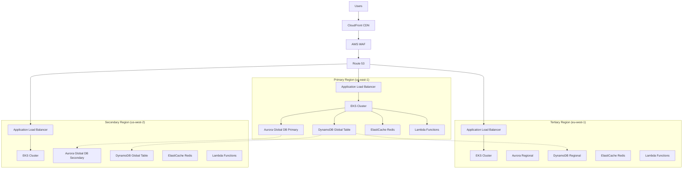
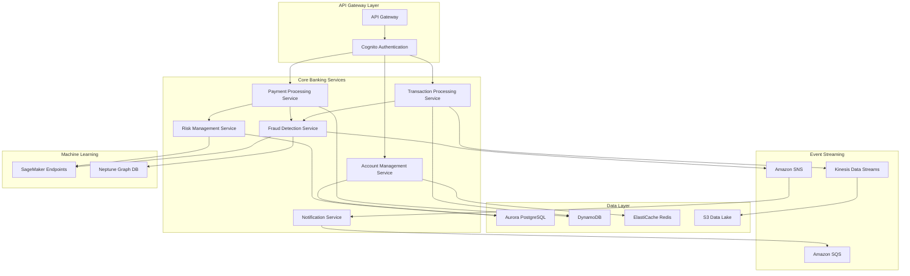
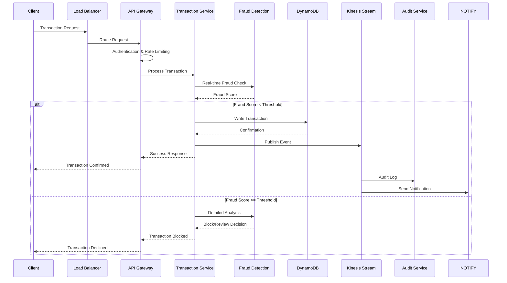
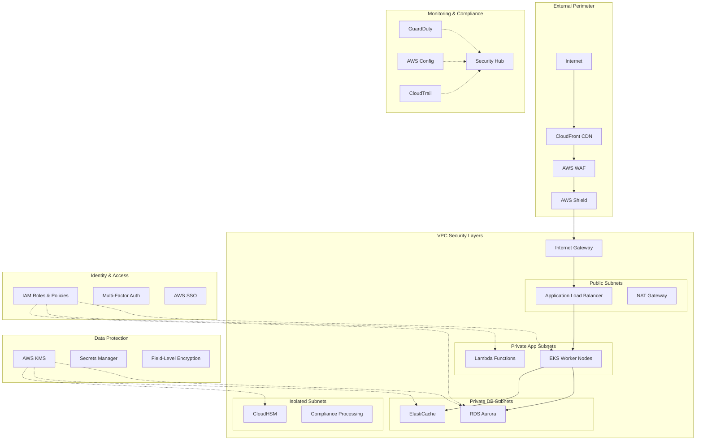
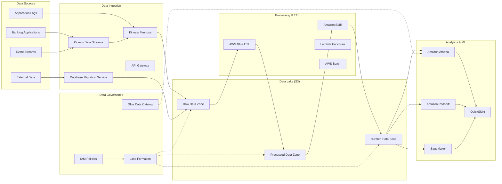
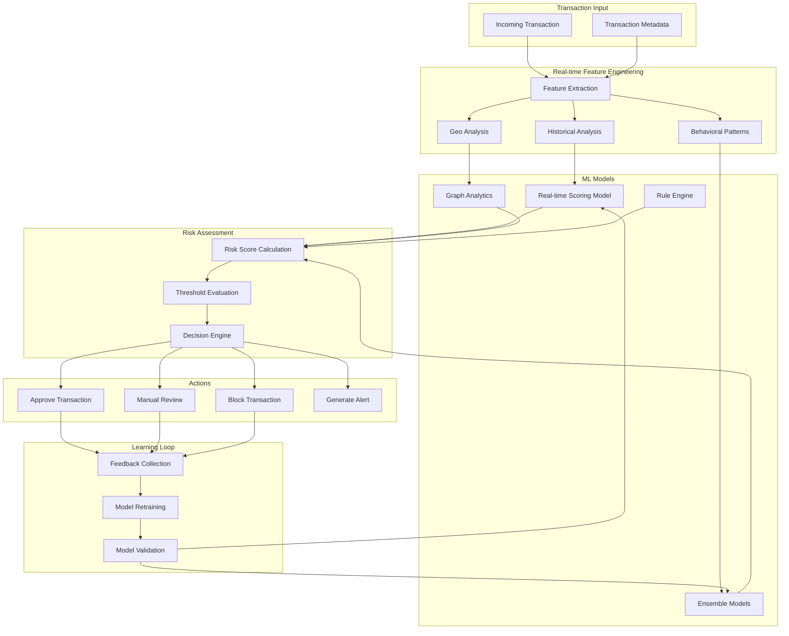
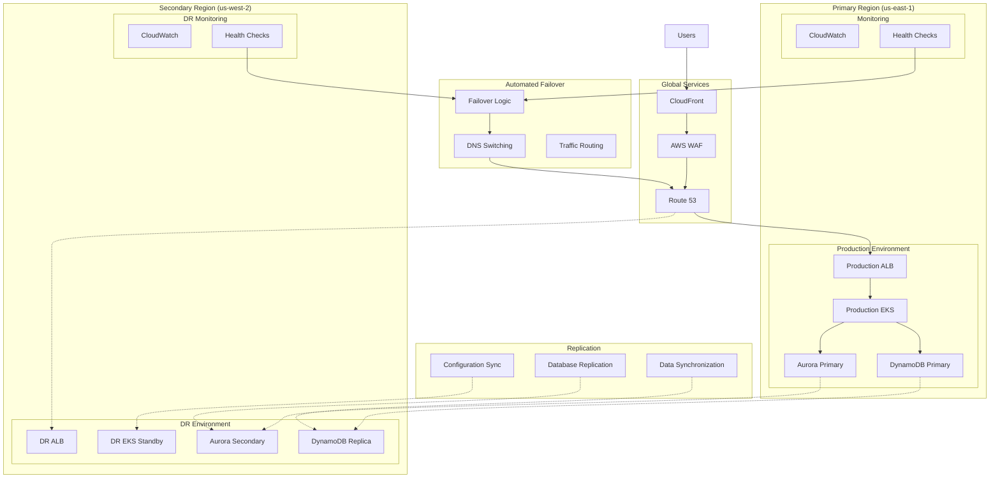

# Highly Scalable Banking Application System Design on AWS

## 1. Executive Summary & Requirements Analysis

### Banking Application Scope

This comprehensive banking application system is designed to serve as a complete digital banking platform supporting:

- **Retail Banking**: Personal accounts, savings, checking, loans, credit cards, mobile banking, and customer self-service portals
- **Corporate Banking**: Business accounts, commercial loans, treasury services, trade finance, and enterprise cash management
- **Payment Processing**: Real-time payments, ACH transfers, wire transfers, international remittances, and merchant payment gateway services
- **Fraud Detection**: Advanced machine learning-based fraud prevention, transaction monitoring, and risk assessment systems

### Non-Functional Requirements

**Availability & Performance:**
- 99.99% uptime (52.6 minutes downtime annually) with planned maintenance windows
- Sub-200ms API response times for critical transactions during peak load
- Sub-100ms response times for account balance queries and basic operations
- 15-second maximum processing time for complex loan approvals and credit decisions

**Compliance & Security:**
- **PCI DSS Level 1 compliance** for card payment processing with annual assessments
- **SOC 2 Type II** certification with continuous monitoring and quarterly audits
- **GDPR compliance** for European customers with right to erasure and data portability
- **SOX compliance** for financial reporting with automated controls and audit trails

### Traffic Patterns & Scalability Targets

**Peak Load Characteristics:**
- Business hours (9 AM - 6 PM local time) see 300% higher transaction volumes
- Month-end and quarter-end periods experience 150% traffic spikes
- Holiday seasons and tax periods generate 200% increased activity
- Geographic distribution across North America, Europe, and Asia-Pacific regions

**Scalability Requirements:**
- Support for 10+ million registered users with 2+ million daily active users
- Handle 100,000+ concurrent connections during peak hours
- Process 50,000+ transactions per second with burst capacity to 100,000 TPS
- Store and process 10+ petabytes of transactional and analytical data

### Security & Regulatory Requirements

**Data Protection:**
- End-to-end encryption for all sensitive data in transit and at rest
- Field-level encryption for PII, account numbers, and financial data
- Multi-factor authentication for all user access and administrative operations
- Real-time fraud detection with machine learning models achieving 99.5% accuracy

**Audit & Compliance:**
- Comprehensive audit trails for all transactions and system access
- Real-time compliance monitoring with automated violation detection
- Immutable transaction logs with cryptographic verification
- Quarterly penetration testing and vulnerability assessments

## 2. High-Level Architecture Overview

### Multi-Region Architecture Strategy

The banking application employs a sophisticated multi-region deployment strategy designed for maximum availability and disaster recovery:

**Primary Region (us-east-1)**: Handles 80% of production traffic with full active services
**Secondary Region (us-west-2)**: Maintains warm standby with real-time data replication
**Tertiary Region (eu-west-1)**: Serves European customers with data residency compliance

### Microservices & Domain-Driven Design

The architecture follows domain-driven design principles with bounded contexts:

**Customer Domain**: Account management, customer onboarding, KYC/AML processes
**Transaction Domain**: Payment processing, transfers, transaction history
**Risk Domain**: Fraud detection, credit scoring, compliance monitoring
**Analytics Domain**: Reporting, business intelligence, regulatory reporting

### Event-Driven Architecture

A comprehensive event-driven system ensures loose coupling and real-time responsiveness:

- **Event Sourcing**: All state changes captured as immutable events
- **CQRS Pattern**: Separate read and write models for optimal performance
- **Saga Pattern**: Distributed transaction management across microservices
- **Event Streaming**: Real-time data processing for fraud detection and analytics

### Zero-Trust Security Model

Implementation of defense-in-depth security principles:

- **Network Microsegmentation**: VPC isolation with private subnets and NACLs
- **Identity Verification**: Multi-factor authentication for all access
- **Least Privilege Access**: Fine-grained IAM policies and temporary credentials
- **Continuous Monitoring**: Real-time threat detection and automated response

### Cloud-Native Design Principles

**Serverless-First Approach**: AWS Lambda for stateless business logic and event processing
**Containerization**: Amazon EKS for stateful services requiring persistent connections
**Managed Services**: Leveraging AWS managed services to reduce operational overhead
**Infrastructure as Code**: Complete environment provisioning through CloudFormation and CDK

## 3. Detailed Security Architecture

### Network Security Layer

**VPC Design and Segmentation:**

The network architecture implements a multi-tier VPC design across three Availability Zones in each region:

- **Public Subnets**: Application Load Balancers and NAT Gateways with internet access
- **Private Application Subnets**: EKS worker nodes and Lambda functions in VPC
- **Private Database Subnets**: RDS instances and ElastiCache clusters
- **Isolated Compliance Subnets**: Sensitive data processing with no internet access

**AWS WAF Configuration:**

Custom WAF rules specifically designed for banking applications:
- SQL injection protection with pattern matching for banking-specific queries
- Cross-site scripting (XSS) prevention with content type validation
- Rate limiting per IP address: 1000 requests per 5-minute window
- Geographic blocking for high-risk countries based on fraud analytics
- Custom rules for banking API endpoints with payload inspection

**DDoS Protection Strategy:**

AWS Shield Advanced implementation with enhanced protections:
- Always-on detection with sub-second response times
- Dedicated DDoS response team (DRT) available 24/7
- Real-time attack diagnostics and mitigation reports
- Cost protection against DDoS-related scaling charges
- Integration with Route 53 health checks for automatic failover

**Network Access Control:**

Granular network controls implementing zero-trust principles:
- Security Groups with application-specific rules and minimal port exposure
- Network ACLs with subnet-level traffic filtering and logging
- VPC Flow Logs captured to CloudWatch with automated analysis
- Transit Gateway for secure inter-VPC communication
- AWS PrivateLink for secure access to AWS services without internet transit

### Identity & Access Management

**AWS IAM Strategy:**

Comprehensive identity management with enterprise integration:
- **Role-Based Access Control**: 50+ predefined roles for different banking functions
- **Fine-Grained Policies**: Resource-level permissions with condition-based access
- **Cross-Account Access**: Secure role assumption for multi-account strategy
- **Temporary Credentials**: STS tokens with maximum 1-hour validity
- **Policy Simulation**: Testing and validation before policy deployment

**Multi-Factor Authentication:**

Layered authentication approach for enhanced security:
- AWS MFA integration with virtual and hardware tokens
- Third-party MFA providers (Okta, Azure AD) for enterprise SSO
- SMS and email-based OTP for customer authentication
- Biometric authentication support for mobile applications
- Risk-based authentication with device fingerprinting

**Privileged Access Management:**

Just-in-time access controls for administrative operations:
- AWS Systems Manager Session Manager for secure shell access
- Temporary privilege escalation with automated expiration
- Break-glass procedures for emergency access with full audit trails
- Bastion hosts eliminated through Session Manager
- All administrative actions logged and monitored in real-time

### Data Protection

**Encryption Strategy:**

Comprehensive encryption covering all data states:

**At Rest Encryption:**
- AWS KMS with customer-managed keys (CMK) and automatic rotation
- Separate encryption keys for each data classification level
- Field-level encryption for credit card numbers, SSNs, and account details
- Database-level encryption using TDE (Transparent Data Encryption)
- S3 bucket encryption with SSE-KMS and bucket key optimization

**In Transit Encryption:**
- TLS 1.3 for all client communications with perfect forward secrecy
- mTLS for service-to-service communication within the VPC
- API Gateway with SSL termination and certificate validation
- VPN connections using IPSec for on-premises integration
- AWS Certificate Manager for automated certificate lifecycle management

**Key Management:**

Enterprise-grade key management with HSM backing:
- Hardware Security Modules (CloudHSM) for critical key operations
- Key rotation every 90 days with automated rollover procedures
- Key derivation functions for application-specific encryption keys
- Secure key escrow procedures for regulatory compliance
- Multi-person authorization for key management operations

### Compliance & Monitoring

**Continuous Compliance Monitoring:**

Automated compliance validation and reporting:
- **AWS Config**: 200+ compliance rules for PCI DSS and SOX requirements
- **AWS Security Hub**: Centralized security findings from 30+ AWS services
- **Custom Compliance Frameworks**: Banking-specific controls using AWS Audit Manager
- **Real-time Remediation**: Automated responses to compliance violations
- **Compliance Dashboards**: Executive reporting with trend analysis

**Audit Trail Management:**

Immutable audit logging with cryptographic verification:
- **AWS CloudTrail**: All API calls logged with integrity validation
- **Application Audit Logs**: Business transaction logging with correlation IDs
- **Log Forwarding**: Real-time streaming to SIEM systems
- **Log Retention**: 7-year retention for regulatory compliance
- **Tamper Detection**: Blockchain-based log integrity verification

**Threat Detection & Response:**

Advanced threat detection with machine learning:
- **AWS GuardDuty**: ML-based threat detection with custom threat intelligence
- **Amazon Macie**: PII discovery and data loss prevention
- **Custom Detection Rules**: Banking-specific attack patterns and indicators
- **Automated Response**: Lambda-based remediation for common threats
- **Security Orchestration**: Integration with SOAR platforms for incident response

## 4. Core Banking Services Architecture

### Account Management Service

**Container Orchestration Platform:**

Amazon EKS deployment with advanced configuration:
- **Fargate Compute**: Serverless containers for variable workloads
- **Managed Node Groups**: EC2-based nodes for persistent services
- **Cluster Autoscaler**: Automatic scaling based on pod resource requests
- **Horizontal Pod Autoscaler**: Application-level scaling using custom metrics
- **Vertical Pod Autoscaler**: Right-sizing recommendations for cost optimization

**Application Architecture:**

Microservices deployment with cloud-native patterns:
- **Service Mesh**: Istio implementation for traffic management and security
- **API Gateway Integration**: Centralized request routing and authentication
- **Circuit Breaker Pattern**: Resilience4j implementation for fault tolerance
- **Distributed Caching**: Redis cluster with read-through and write-behind patterns
- **Configuration Management**: AWS App Config for dynamic configuration updates

**Database Layer:**

High-performance database architecture:
- **Amazon Aurora PostgreSQL**: Multi-master setup with cross-region replication
- **Read Replicas**: 5 read replicas distributed across AZs for read scaling
- **Connection Pooling**: PgBouncer deployment for efficient connection management
- **Database Proxy**: RDS Proxy for connection multiplexing and failover
- **Performance Insights**: Real-time database performance monitoring

### Transaction Processing Service

**Serverless Transaction Engine:**

AWS Lambda-based transaction processing with enterprise patterns:
- **Event-Driven Processing**: Kinesis triggers for real-time transaction handling
- **Reserved Concurrency**: 10,000 concurrent executions for peak load handling
- **Provisioned Concurrency**: Warm Lambda functions for sub-50ms response times
- **Error Handling**: Dead letter queues with exponential backoff retry logic
- **Transaction Saga**: Step Functions orchestration for distributed transactions

**Distributed Ledger:**

DynamoDB-based transaction ledger with global consistency:
- **Global Tables**: Multi-region eventual consistency with conflict resolution
- **On-Demand Scaling**: Automatic capacity adjustment based on traffic patterns
- **Point-in-Time Recovery**: Continuous backup with 35-day retention
- **DynamoDB Streams**: Real-time change capture for downstream processing
- **Conditional Writes**: Optimistic concurrency control for transaction integrity

**Real-Time Streaming:**

Kinesis-based event streaming architecture:
- **Data Streams**: Partitioned streams with 7-day retention for replay capability
- **Kinesis Analytics**: Real-time aggregation and fraud pattern detection
- **Kinesis Firehose**: Batch delivery to S3 for analytics and compliance
- **Producer Libraries**: KPL (Kinesis Producer Library) for efficient batching
- **Consumer Applications**: KCL (Kinesis Client Library) for fault-tolerant processing

### Payment Processing Service

**PCI DSS Compliant Infrastructure:**

Dedicated security zones for payment card processing:
- **Isolated VPC**: Separate network environment with enhanced monitoring
- **Compliance Automation**: Automated PCI DSS validation and reporting
- **Tokenization Service**: Replace sensitive card data with non-sensitive tokens
- **HSM Integration**: Hardware security modules for cryptographic operations
- **Network Segmentation**: Microsegmentation with application-aware firewalls

**Payment Gateway Integration:**

Multi-provider payment processing architecture:
- **API Gateway**: Centralized payment API with rate limiting and caching
- **Provider Abstraction**: Common interface for multiple payment processors
- **Failover Logic**: Automatic routing to backup processors during outages
- **Transaction Routing**: Intelligent routing based on cost and success rates
- **Reconciliation Engine**: Automated settlement and dispute management

**Complex Workflow Orchestration:**

AWS Step Functions for payment workflows:
- **State Machine Design**: Visual workflow definition with error handling
- **Parallel Processing**: Concurrent execution of fraud checks and authorization
- **Human Tasks**: Manual review integration for high-risk transactions
- **Retry Logic**: Exponential backoff with circuit breaker patterns
- **Audit Trail**: Complete workflow execution history for compliance

### Fraud Detection & Risk Management

**Machine Learning Pipeline:**

SageMaker-based fraud detection with continuous learning:
- **Feature Engineering**: Real-time feature computation using Kinesis Analytics
- **Model Training**: Automated retraining with new fraud patterns
- **A/B Testing**: SageMaker endpoints for model comparison and validation
- **Real-Time Scoring**: Sub-100ms fraud score computation for transactions
- **Model Monitoring**: Drift detection and performance degradation alerts

**Graph Analytics:**

Amazon Neptune for relationship-based fraud detection:
- **Graph Database**: Customer, account, and device relationship modeling
- **Pattern Detection**: Gremlin queries for suspicious transaction patterns
- **Link Analysis**: Multi-hop relationship traversal for fraud rings
- **Real-Time Queries**: Graph pattern matching with sub-second response times
- **Graph ML**: Embedding generation for fraud score enhancement

**Risk Assessment Engine:**

Comprehensive risk evaluation framework:
- **Credit Scoring**: Real-time credit decisions using ML models
- **Behavioral Analytics**: User behavior analysis for anomaly detection
- **Device Fingerprinting**: Unique device identification and risk assessment
- **Geolocation Analysis**: Location-based risk scoring and fraud prevention
- **Regulatory Compliance**: Automated AML and KYC validation

## 5. Data Architecture & Analytics

### Data Lake Strategy

**Amazon S3 Data Organization:**

Structured data lake with optimal partitioning and lifecycle management:

**Raw Data Layer:**
- Landing zone for real-time streaming data from Kinesis Firehose
- Time-based partitioning: year/month/day/hour for efficient querying
- Immutable storage with object versioning and cross-region replication
- Lifecycle policies: transition to IA after 30 days, Glacier after 365 days

**Processed Data Layer:**
- Cleansed and transformed data in optimized formats (Parquet, ORC)
- Business-logic applied data with standardized schemas
- Data quality metrics and validation reports
- Compression and columnar storage for analytics performance

**Curated Data Layer:**
- Business-ready datasets for analytics and reporting
- Pre-aggregated data marts for common queries
- Data lineage tracking and metadata management
- Access controls based on data classification and user roles

**Data Governance Framework:**

AWS Lake Formation implementation for enterprise data governance:
- **Fine-Grained Access Control**: Column and row-level security policies
- **Data Discovery**: Automated cataloging with ML-based classification
- **Data Lineage**: End-to-end data flow tracking and impact analysis
- **Data Quality**: Automated validation rules with exception reporting
- **Compliance Monitoring**: GDPR and regulatory compliance automation

### Real-Time Analytics

**Stream Processing Architecture:**

Kinesis Analytics for real-time data processing:
- **SQL Analytics**: Real-time aggregations using SQL queries on streaming data
- **Apache Flink**: Complex event processing for fraud detection algorithms
- **Windowing Functions**: Time-based and count-based windows for analytics
- **Anomaly Detection**: Built-in ML algorithms for outlier identification
- **Alert Generation**: Real-time notifications for threshold breaches

**Search and Analytics Platform:**

Amazon Elasticsearch deployment for logs and metrics:
- **Multi-Index Strategy**: Separate indices for different data types and retention
- **Index Lifecycle Management**: Automated index rotation and deletion
- **Kibana Dashboards**: Executive and operational dashboards with drill-down
- **Alerting Integration**: CloudWatch and SNS integration for anomaly alerts
- **Security**: Fine-grained access control with IAM and Cognito integration

**Business Intelligence Platform:**

Amazon QuickSight for self-service analytics:
- **SPICE Engine**: In-memory analytics for sub-second query performance
- **ML Insights**: Automated anomaly detection and forecasting
- **Embedded Analytics**: Customer-facing analytics in banking applications
- **Row-Level Security**: Dynamic data filtering based on user context
- **Scheduled Reporting**: Automated report generation and distribution

### Batch Processing

**End-of-Day Processing:**

AWS Batch for large-scale computational workloads:
- **Job Queues**: Priority-based job scheduling with resource allocation
- **Compute Environments**: Spot and On-Demand instances for cost optimization
- **Array Jobs**: Parallel processing of daily settlement calculations
- **Job Dependencies**: Complex workflow dependencies with conditional execution
- **Monitoring**: CloudWatch integration for job status and performance metrics

**ETL Pipeline Orchestration:**

AWS Glue for automated data pipeline management:
- **Data Catalog**: Centralized metadata repository with schema evolution
- **ETL Jobs**: Spark-based transformations with automatic scaling
- **Workflow Orchestration**: Complex data pipeline dependencies with error handling
- **Data Quality**: AWS Glue DataBrew for data profiling and quality validation
- **Schema Registry**: Centralized schema management with version control

**Regulatory Reporting:**

Automated compliance reporting infrastructure:
- **Data Lineage**: Complete audit trail from source to report
- **Report Templates**: Standardized formats for different regulatory bodies
- **Validation Rules**: Automated data quality checks before report generation
- **Submission Automation**: Secure file transfer to regulatory systems
- **Exception Handling**: Manual review workflows for data anomalies

### Machine Learning Integration

**SageMaker ML Platform:**

Comprehensive machine learning lifecycle management:
- **Feature Store**: Centralized feature repository with versioning and lineage
- **Model Registry**: Version control and deployment management for ML models
- **Automated Training**: Scheduled retraining with new data and drift detection
- **Multi-Model Endpoints**: Cost-effective inference for multiple models
- **Model Monitoring**: Performance tracking and bias detection

**Credit Risk Modeling:**

Advanced credit decisioning with machine learning:
- **Risk Scorecards**: Traditional and ML-based credit scoring models
- **Alternative Data**: Social media, payment history, and behavioral data integration
- **Real-Time Decisions**: Sub-second credit approval for retail banking
- **Model Explainability**: SHAP and LIME integration for regulatory compliance
- **Stress Testing**: Monte Carlo simulations for portfolio risk assessment

**Customer Analytics:**

Personalization and customer insights:
- **Customer Segmentation**: Behavioral clustering using unsupervised learning
- **Lifetime Value Prediction**: Customer value modeling for retention strategies
- **Next-Best-Action**: Recommendation engine for product offerings
- **Churn Prediction**: Early warning system for customer attrition
- **Personalization Engine**: Dynamic content and product recommendations

## 6. High Availability & Disaster Recovery

### Multi-AZ Deployment Strategy

**Application Distribution:**

Resilient architecture across multiple Availability Zones:

**Zone A (Primary)**: 50% of application capacity with full service portfolio
**Zone B (Secondary)**: 35% capacity with automated failover capabilities
**Zone C (Tertiary)**: 15% capacity for burst handling and maintenance windows

**Database Clustering:**

High-availability database architecture:
- **Aurora Global Database**: Cross-region replication with 1-second lag
- **Multi-Master Configuration**: Active-active setup for read and write operations
- **Automatic Failover**: Sub-60-second failover with connection pooling
- **Backup Strategy**: Continuous backup with point-in-time recovery
- **Read Scaling**: 15 read replicas distributed across AZs

**Load Balancing Strategy:**

Intelligent traffic distribution with health monitoring:
- **Application Load Balancer**: Layer 7 routing with SSL termination
- **Target Group Health Checks**: Application-level health validation
- **Connection Draining**: Graceful handling of unhealthy instances
- **Sticky Sessions**: Session affinity for stateful applications
- **Cross-Zone Load Balancing**: Even distribution across AZs

### Disaster Recovery Implementation

**RTO and RPO Targets:**

Strictly defined recovery objectives for different service tiers:

**Tier 1 Services (Critical)**:
- RTO: 15 minutes for transaction processing and fraud detection
- RPO: 1 minute with synchronous replication
- Services: Payment processing, fraud detection, customer authentication

**Tier 2 Services (Important)**:
- RTO: 1 hour for customer-facing applications
- RPO: 15 minutes with near-synchronous replication
- Services: Account management, customer portal, mobile banking

**Tier 3 Services (Standard)**:
- RTO: 4 hours for reporting and analytics
- RPO: 1 hour with asynchronous replication
- Services: Business intelligence, regulatory reporting, data analytics

**Cross-Region Replication:**

Comprehensive data replication strategy:
- **Aurora Global Database**: Automated cross-region replication
- **DynamoDB Global Tables**: Multi-region active-active replication
- **S3 Cross-Region Replication**: Automatic data synchronization
- **ElastiCache Global Datastore**: Cache replication for session management
- **EFS Backup**: Cross-region backup for shared file systems

**Infrastructure Recovery:**

Rapid infrastructure provisioning and recovery:
- **Infrastructure as Code**: Complete environment recreation using CDK
- **Automated Deployment**: CI/CD pipeline deployment to DR region
- **DNS Failover**: Route 53 health checks with automatic failover
- **Certificate Management**: Automated SSL certificate provisioning
- **Configuration Sync**: Parameter Store replication for application config

### Backup & Recovery Procedures

**Comprehensive Backup Strategy:**

Multi-tiered backup approach with compliance focus:

**Database Backups:**
- **Continuous Backup**: Point-in-time recovery for all databases
- **Cross-Region Backup**: Geographic distribution for disaster recovery
- **Encrypted Backups**: KMS encryption for all backup data
- **Automated Testing**: Weekly backup restoration validation
- **Retention Policies**: 7-year retention for regulatory compliance

**Application Backups:**
- **AMI Snapshots**: Golden image backups for rapid instance recovery
- **EBS Snapshots**: Volume-level backups with incremental changes
- **Container Images**: Versioned container registry with vulnerability scanning
- **Configuration Backups**: Parameter and secret backup with versioning
- **Code Repository**: Multi-region Git repository replication

**Recovery Testing:**

Regular disaster recovery validation:
- **Monthly DR Drills**: Partial failover testing with non-production workloads
- **Quarterly Full Tests**: Complete disaster recovery validation
- **Annual Chaos Engineering**: Comprehensive resilience testing
- **Recovery Runbooks**: Detailed procedures with decision trees
- **Communication Plans**: Stakeholder notification and coordination

## 7. Performance Optimization & Scalability

### Auto Scaling Strategy

**Application Auto Scaling:**

Intelligent scaling based on business metrics:

**EKS Workload Scaling:**
- **Horizontal Pod Autoscaler**: CPU, memory, and custom metric scaling
- **Vertical Pod Autoscaler**: Right-sizing recommendations for cost optimization
- **Cluster Autoscaler**: Node provisioning based on pod resource requirements
- **Predictive Scaling**: ML-based capacity planning for peak periods
- **Custom Metrics**: Business KPI-based scaling (transactions per second, user sessions)

**Lambda Concurrency Management:**
- **Reserved Concurrency**: Guaranteed capacity for critical functions
- **Provisioned Concurrency**: Pre-warmed functions for consistent performance
- **Burst Scaling**: Automatic scaling up to account limits
- **Dead Letter Queues**: Failed execution handling and retry logic
- **Cost Optimization**: Memory and timeout optimization based on execution patterns

**Database Scaling:**

Dynamic database capacity management:
- **Aurora Serverless**: Automatic scaling for variable workloads
- **Read Replica Auto Scaling**: Dynamic read capacity based on CPU utilization
- **DynamoDB On-Demand**: Pay-per-request scaling for unpredictable workloads
- **Connection Pool Scaling**: Dynamic connection management based on load
- **Query Optimization**: Automated index recommendations and query tuning

### Caching Strategy

**Multi-Layer Caching Architecture:**

Comprehensive caching strategy for optimal performance:

**CDN Layer (CloudFront)**:
- **Global Edge Locations**: 200+ edge locations for global content delivery
- **Dynamic Content Acceleration**: API response caching with custom headers
- **Origin Shield**: Additional caching layer for origin protection
- **Cache Behaviors**: Path-based caching rules with TTL optimization
- **Real-Time Metrics**: Cache hit ratio monitoring and optimization

**Application Load Balancer Caching**:
- **SSL Termination**: Certificate caching for improved handshake performance
- **Connection Pooling**: Backend connection reuse for reduced latency
- **Health Check Caching**: Intelligent health check result caching
- **Request Routing**: Path-based routing with sticky sessions

**ElastiCache Implementation**:
- **Redis Cluster Mode**: Horizontal scaling with automatic sharding
- **Multi-AZ Deployment**: High availability with automatic failover
- **Backup and Restore**: Automated backup with point-in-time recovery
- **Cache-Aside Pattern**: Application-controlled cache management
- **Write-Behind Pattern**: Asynchronous cache updates for improved performance

**Application-Level Caching**:
- **In-Memory Caching**: JVM-based caching for frequently accessed data
- **Database Query Caching**: ORM-level query result caching
- **Session Caching**: Distributed session management across instances
- **API Response Caching**: Time-based caching for expensive operations
- **Cache Invalidation**: Event-driven cache invalidation for data consistency

### Database Optimization

**Performance Tuning Strategy:**

Comprehensive database optimization approach:

**Query Optimization:**
- **Performance Insights**: Real-time query performance monitoring
- **Query Plan Analysis**: Automated explain plan analysis and recommendations
- **Index Optimization**: Automated index creation and maintenance
- **Partition Pruning**: Time-based partitioning for large tables
- **Materialized Views**: Pre-computed aggregations for complex queries

**Connection Management:**
- **PgBouncer Deployment**: Connection pooling for PostgreSQL databases
- **RDS Proxy**: AWS-managed connection pooling with automatic failover
- **Connection Limits**: Dynamic connection limit adjustment based on load
- **Connection Monitoring**: Real-time connection usage tracking
- **Connection Security**: SSL/TLS encryption for all database connections

**Read Scaling Strategy:**
- **Read Replica Distribution**: Geographic distribution of read replicas
- **Read-Write Splitting**: Application-level routing for optimal performance
- **Replica Lag Monitoring**: Real-time lag monitoring with alerting
- **Load Balancing**: Intelligent routing based on replica health and load
- **Failover Logic**: Automatic promotion of read replicas during outages

### Content Delivery Optimization

**Global CDN Strategy:**

Amazon CloudFront configuration for global performance:

**Edge Location Optimization:**
- **Regional Edge Caches**: Improved cache hit ratios for large objects
- **Origin Groups**: Automated failover between multiple origins
- **Custom Error Pages**: Branded error pages with fallback content
- **Compression**: Automatic Gzip compression for text-based content
- **HTTP/2 Support**: Modern protocol support for improved performance

**Security Integration:**
- **WAF Integration**: Security rules applied at edge locations
- **DDoS Protection**: Automatic DDoS mitigation at global scale
- **SSL/TLS Optimization**: Modern cipher suites and protocol versions
- **Geo-Blocking**: Country-based access controls for compliance
- **Rate Limiting**: Edge-level rate limiting for API protection

**Performance Monitoring:**
- **Real User Monitoring**: Client-side performance tracking
- **Synthetic Monitoring**: Automated performance testing from global locations
- **Cache Analytics**: Detailed cache performance and optimization recommendations
- **Origin Analytics**: Backend performance impact analysis
- **Cost Optimization**: Usage-based pricing optimization and recommendations

## 8. Monitoring, Logging & Observability

### Application Performance Monitoring

**Distributed Tracing:**

AWS X-Ray implementation for end-to-end visibility:

**Service Map Visualization:**
- **Microservice Dependencies**: Real-time service relationship mapping
- **Latency Analysis**: Request flow analysis with bottleneck identification
- **Error Tracking**: Exception propagation across service boundaries
- **Performance Insights**: P95, P99 latency metrics for SLA monitoring
- **Capacity Planning**: Resource utilization trends and scaling recommendations

**Custom Metrics Strategy:**

Business-focused monitoring with CloudWatch custom metrics:
- **Transaction Metrics**: Real-time transaction volume and success rates
- **User Experience**: Response time measurements from customer perspective
- **Business KPIs**: Account opening rates, loan approval times, customer satisfaction
- **Security Metrics**: Failed authentication attempts, fraud detection accuracy
- **Compliance Metrics**: Regulatory reporting accuracy and timeliness

**Synthetic Monitoring:**

CloudWatch Synthetics for proactive monitoring:
- **API Endpoint Testing**: Automated functional testing of critical APIs
- **User Journey Simulation**: Complete customer workflow validation
- **Global Monitoring**: Testing from multiple geographic locations
- **Performance Baselines**: Historical performance comparison and alerting
- **Availability Monitoring**: 24/7 service availability validation

### Centralized Logging

**Log Aggregation Architecture:**

Elasticsearch-based centralized logging platform:

**Log Collection Strategy:**
- **Application Logs**: Structured JSON logging with correlation IDs
- **Infrastructure Logs**: VPC Flow Logs, CloudTrail, and service logs
- **Security Logs**: WAF logs, GuardDuty findings, and access logs
- **Business Logs**: Transaction logs, audit trails, and compliance events
- **Performance Logs**: Application performance metrics and profiling data

**Log Processing Pipeline:**
- **Real-Time Ingestion**: Kinesis Data Firehose for high-throughput log delivery
- **Log Transformation**: Lambda functions for log parsing and enrichment
- **Index Management**: Time-based index rotation with lifecycle policies
- **Search Optimization**: Index templates and mapping optimization
- **Alert Generation**: Real-time log analysis with threshold-based alerting

**Log Analytics Platform:**
- **Kibana Dashboards**: Executive and operational dashboards for log analysis
- **Saved Searches**: Pre-configured queries for common troubleshooting scenarios
- **Visualization**: Trend analysis and pattern identification dashboards
- **Drill-Down Analysis**: Detailed investigation capabilities for incidents
- **Report Generation**: Automated compliance and operational reports

### Alerting & Incident Response

**Multi-Tiered Alerting Strategy:**

Comprehensive alerting framework with escalation procedures:

**CloudWatch Alarms Configuration:**
- **Threshold-Based Alerts**: Static thresholds for critical system metrics
- **Anomaly Detection**: ML-based alerting for unusual patterns
- **Composite Alarms**: Complex alerting logic combining multiple metrics
- **Dynamic Thresholds**: Time-based threshold adjustments for business patterns
- **Suppression Rules**: Alert noise reduction during maintenance windows

**Incident Escalation:**
- **PagerDuty Integration**: Automated escalation with on-call rotation
- **Severity Classification**: P1-P4 incident classification with SLA requirements
- **War Room Procedures**: Automated war room creation for critical incidents
- **Communication Plans**: Automated stakeholder notification and updates
- **Post-Mortem Process**: Automated incident analysis and improvement tracking

**Automated Remediation:**

Systems Manager Automation for self-healing infrastructure:
- **Runbook Automation**: Automated response to common operational issues
- **Resource Recovery**: Automatic restart and replacement of failed components
- **Scaling Responses**: Dynamic scaling based on performance thresholds
- **Security Responses**: Automated isolation of compromised resources
- **Rollback Procedures**: Automated rollback for failed deployments

## 9. Cost Optimization Strategies

### Compute Cost Optimization

**Reserved Instance Strategy:**

Optimal cost management for predictable workloads:
- **3-Year Reserved Instances**: 50% cost savings for baseline capacity
- **Convertible RIs**: Flexibility for changing instance requirements
- **Scheduled RIs**: Cost optimization for predictable usage patterns
- **RI Utilization Monitoring**: CloudWatch metrics for utilization tracking
- **RI Recommendations**: Automated recommendations based on usage patterns

**Spot Instance Integration:**

Cost-effective compute for fault-tolerant workloads:
- **Batch Processing**: 90% cost savings for end-of-day processing
- **Development Environments**: Significant cost reduction for non-production
- **Analytics Workloads**: Cost-effective data processing and ML training
- **Spot Fleet**: Diversified instance types for improved availability
- **Interruption Handling**: Graceful handling of spot instance interruptions

**Serverless Cost Management:**

Lambda optimization for cost and performance:
- **Memory Right-Sizing**: Optimal memory allocation based on execution patterns
- **Execution Time Optimization**: Code optimization for reduced execution duration
- **Provisioned Concurrency**: Strategic use for predictable workloads
- **Cost Allocation**: Detailed cost tracking by function and business unit
- **Usage Analytics**: Regular analysis of function usage and optimization opportunities

### Storage Cost Optimization

**S3 Intelligent Tiering:**

Automated storage class optimization:
- **Frequent Access Tier**: Standard storage for actively accessed data
- **Infrequent Access Tier**: 40% cost savings for less frequently accessed data
- **Archive Access Tier**: 68% cost savings for rarely accessed data
- **Deep Archive Tier**: 95% cost savings for long-term archival
- **Access Pattern Analysis**: ML-based access pattern prediction and optimization

**Lifecycle Policy Management:**

Automated data lifecycle management:
- **Transition Rules**: Automated movement between storage classes
- **Deletion Policies**: Automated cleanup of temporary and expired data
- **Compliance Integration**: Retention policies aligned with regulatory requirements
- **Cost Monitoring**: Regular analysis of storage costs and optimization opportunities
- **Multi-Part Upload Cleanup**: Automated cleanup of incomplete uploads

### Database Cost Optimization

**Aurora Serverless V2:**

Pay-per-use database scaling:
- **Automatic Scaling**: Scale from 0.5 to 128 ACUs based on demand
- **Cost Predictability**: Pay only for consumed capacity
- **Performance Consistency**: No cold start delays for database operations
- **Development Efficiency**: Simplified capacity planning and management
- **Cost Monitoring**: Detailed usage tracking and optimization recommendations

**RDS Cost Management:**

Optimized database deployment strategy:
- **Instance Right-Sizing**: Regular analysis and optimization of instance types
- **Storage Optimization**: GP3 storage for cost-effective performance
- **Backup Optimization**: Automated backup lifecycle management
- **Multi-AZ Cost Analysis**: Cost-benefit analysis for high availability requirements
- **Read Replica Optimization**: Strategic read replica placement for cost and performance

### Monitoring and Cost Analytics

**Cost Anomaly Detection:**

AWS Cost Anomaly Detection for proactive cost management:
- **ML-Based Detection**: Automatic identification of unusual spending patterns
- **Budget Alerts**: Proactive notifications before budget thresholds
- **Cost Attribution**: Detailed cost allocation by service, team, and project
- **Trend Analysis**: Historical cost analysis and future projection
- **Optimization Recommendations**: Automated suggestions for cost reduction

**Cost Explorer Integration:**

Detailed cost analysis and optimization:
- **Resource Utilization**: Comprehensive utilization analysis across all services
- **Right-Sizing Recommendations**: EC2 instance optimization suggestions
- **Reserved Instance Analysis**: RI utilization and purchase recommendations
- **Savings Plans**: Automated savings plan recommendations and management
- **Cost Allocation Tags**: Detailed tagging strategy for accurate cost attribution

## 10. Implementation Roadmap & Migration Strategy

### Phase 1: Foundation & Security (Months 1-3)

**Infrastructure Foundation:**

Core platform establishment with security-first approach:

**Month 1 - Network and Security Setup:**
- VPC design and implementation across three regions
- Security group and NACL configuration
- AWS WAF deployment with banking-specific rules
- IAM policy framework development and implementation
- KMS key management setup with rotation policies

**Month 2 - Identity and Compliance:**
- Multi-factor authentication integration
- AWS Config compliance rules deployment
- CloudTrail logging configuration
- GuardDuty threat detection activation
- Security Hub centralized monitoring setup

**Month 3 - Data Protection and Monitoring:**
- Encryption strategy implementation
- Backup and disaster recovery framework
- CloudWatch monitoring and alerting setup
- Log aggregation and analysis platform deployment
- Security incident response procedures

### Phase 2: Core Banking Services (Months 4-6)

**Service Implementation:**

Gradual deployment of core banking functionality:

**Month 4 - Account Management System:**
- EKS cluster deployment and configuration
- Account management microservice development
- Aurora PostgreSQL database setup with replication
- API Gateway configuration with authentication
- Basic customer onboarding workflow implementation

**Month 5 - Transaction Processing Engine:**
- Lambda-based transaction processing deployment
- DynamoDB transaction ledger implementation
- Kinesis streaming infrastructure setup
- Payment gateway integration and testing
- Basic fraud detection rule engine

**Month 6 - Payment Services Integration:**
- PCI DSS compliant payment processing zone
- Multi-provider payment gateway integration
- Step Functions workflow orchestration
- Real-time payment processing capabilities
- Initial fraud detection and risk assessment

### Phase 3: Advanced Features & Analytics (Months 7-9)

**Intelligence and Analytics Implementation:**

Advanced capabilities for competitive advantage:

**Month 7 - Data Lake and Analytics:**
- S3 data lake architecture implementation
- AWS Glue ETL pipeline development
- Lake Formation governance framework
- QuickSight business intelligence deployment
- Real-time analytics with Kinesis Analytics

**Month 8 - Machine Learning Platform:**
- SageMaker ML platform setup
- Credit risk modeling development
- Advanced fraud detection algorithms
- Customer analytics and segmentation
- Real-time ML inference endpoints

**Month 9 - Advanced Security and Compliance:**
- Enhanced fraud detection with graph analytics
- Neptune graph database for relationship analysis
- Advanced compliance monitoring and reporting
- Automated remediation and response systems
- Security orchestration and incident response

### Phase 4: Optimization & Global Expansion (Months 10-12)

**Performance and Scale Optimization:**

Final optimization and global deployment:

**Month 10 - Performance Optimization:**
- Auto-scaling implementation across all services
- Caching strategy optimization and deployment
- Database performance tuning and optimization
- CDN implementation for global content delivery
- Load testing and capacity planning

**Month 11 - Global Expansion:**
- Multi-region deployment and data replication
- Global traffic routing and failover testing
- Regional compliance and regulatory alignment
- International payment processing integration
- Cross-border data transfer optimization

**Month 12 - Production Readiness:**
- Comprehensive disaster recovery testing
- Security penetration testing and validation
- Performance benchmarking and SLA validation
- Staff training and knowledge transfer
- Go-live readiness assessment and deployment

### Migration Strategies

**Strangler Fig Pattern:**

Gradual legacy system replacement:
- **Service-by-Service Migration**: Incremental replacement of legacy components
- **API Gateway Routing**: Intelligent routing between legacy and new systems
- **Data Synchronization**: Real-time data sync during transition period
- **Rollback Capabilities**: Quick rollback to legacy systems if needed
- **Feature Toggles**: Gradual feature enablement and testing

**Database Migration:**

AWS Database Migration Service implementation:
- **Schema Conversion**: Automated schema conversion with SCT
- **Data Replication**: Continuous data replication with minimal downtime
- **Validation Testing**: Comprehensive data validation and integrity checking
- **Cutover Planning**: Coordinated cutover with minimal business impact
- **Performance Tuning**: Post-migration optimization and tuning

**Testing and Validation:**

Comprehensive testing strategy:
- **Canary Deployments**: Gradual traffic shifting for risk mitigation
- **Blue-Green Deployments**: Zero-downtime deployments with instant rollback
- **Load Testing**: Comprehensive performance testing under peak conditions
- **Security Testing**: Penetration testing and vulnerability assessments
- **Compliance Validation**: Regulatory compliance testing and certification

### Change Management

**Staff Training and Development:**

Comprehensive workforce preparation:
- **Cloud Skills Training**: AWS certification and hands-on training programs
- **DevOps Practices**: Agile development and deployment methodologies
- **Security Awareness**: Banking-specific security training and best practices
- **Compliance Training**: Regulatory compliance and audit procedures
- **Incident Response**: Emergency response and crisis management training

**Organizational Change:**

Cultural transformation for cloud adoption:
- **Executive Sponsorship**: Leadership commitment and change championing
- **Cross-Functional Teams**: Collaborative development and operations teams
- **Communication Strategy**: Regular updates and transparent communication
- **Success Metrics**: Clear KPIs and success measurement frameworks
- **Continuous Improvement**: Ongoing optimization and enhancement processes

## Architectural Diagrams and Technical Specifications

### High-Level Architecture Diagram Description

**Multi-Region Architecture Overview:**

The architecture spans three AWS regions with the following structure:

**Primary Region (us-east-1)**: Active production environment handling 80% of traffic
- Application Load Balancers distributing traffic across three AZs
- EKS clusters with Fargate and managed node groups
- Aurora Global Database with multi-master configuration
- ElastiCache Redis clusters for session management
- Lambda functions for serverless transaction processing

**Secondary Region (us-west-2)**: Warm standby with real-time replication
- Infrastructure mirroring primary region with 50% capacity
- Read-only Aurora replicas with promotion capability
- DynamoDB Global Tables for transaction ledger replication
- Automated failover orchestration with Route 53 health checks

**Tertiary Region (eu-west-1)**: European data residency compliance
- Dedicated infrastructure for European customers
- Local data processing to meet GDPR requirements
- Regional compliance and regulatory reporting capabilities

### Security Architecture Diagram Description

**Network Security Layers:**

**External Perimeter:**
- CloudFront CDN with WAF protection at global edge locations
- Route 53 DNS with health checks and DDoS protection
- Internet Gateway with AWS Shield Advanced protection

**VPC Security Design:**
- **Public Subnets**: Application Load Balancers and NAT Gateways only
- **Private App Subnets**: EKS worker nodes and Lambda functions
- **Private DB Subnets**: RDS instances and ElastiCache clusters
- **Isolated Subnets**: Sensitive data processing with no internet access

**Internal Security Controls:**
- Security Groups with principle of least privilege
- Network ACLs providing subnet-level filtering
- VPC Flow Logs for comprehensive network monitoring
- AWS PrivateLink for secure service communication

### Data Flow Diagram Description

**Transaction Processing Flow:**

1. **Customer Request**: Mobile app or web portal initiates transaction
2. **API Gateway**: Request authentication and rate limiting
3. **Load Balancer**: Intelligent routing to healthy EKS pods
4. **Fraud Detection**: Real-time ML-based fraud scoring
5. **Transaction Validation**: Business rule validation and authorization
6. **Ledger Update**: DynamoDB transaction recording with global consistency
7. **Event Publishing**: Kinesis stream for downstream processing
8. **Response Generation**: Confirmation sent to customer with audit trail

**Data Analytics Pipeline:**

1. **Data Ingestion**: Kinesis Data Firehose streaming to S3
2. **Raw Data Storage**: S3 data lake with time-based partitioning
3. **ETL Processing**: Glue jobs for data transformation and cleansing
4. **Data Catalog**: Automated metadata discovery and cataloging
5. **Analytics Processing**: EMR clusters for batch analytics
6. **Real-Time Analytics**: Kinesis Analytics for streaming insights
7. **Visualization**: QuickSight dashboards for business intelligence
8. **ML Training**: SageMaker for model training and deployment

### Performance Benchmarks

**Transaction Processing Performance:**

- **Peak Transaction Volume**: 50,000 transactions per second sustained
- **Burst Capacity**: 100,000 transactions per second for 5-minute periods
- **Average Response Time**: 85ms for account balance queries
- **95th Percentile**: 180ms for complex transaction processing
- **99th Percentile**: 290ms for fraud detection and risk assessment

**Database Performance Metrics:**

- **Aurora Cluster**: 500,000 reads per second across read replicas
- **DynamoDB**: 40,000 read/write units with auto-scaling enabled
- **ElastiCache**: 95% cache hit ratio with sub-millisecond response
- **Connection Pool**: 10,000 concurrent database connections
- **Failover Time**: Sub-60-second automatic failover for Aurora

**Global Performance Standards:**

- **North America**: Average 120ms response time for API calls
- **Europe**: Average 150ms response time with regional deployment
- **Asia-Pacific**: Average 200ms response time via CloudFront edge
- **CDN Performance**: 90% of content served from edge locations
- **DNS Resolution**: Sub-10ms DNS query response globally

### Cost Estimates

**Monthly Infrastructure Costs (Production):**

**Compute Services:**
- EKS Cluster (3 regions): $45,000/month for managed node groups
- Lambda Functions: $12,000/month for transaction processing
- Fargate Containers: $8,000/month for serverless workloads
- **Subtotal Compute**: $65,000/month

**Database Services:**
- Aurora Global Database: $35,000/month for multi-region setup
- DynamoDB Global Tables: $18,000/month for transaction ledger
- ElastiCache Redis: $6,000/month for session management
- **Subtotal Database**: $59,000/month

**Storage and Analytics:**
- S3 Data Lake: $8,000/month for 500TB with intelligent tiering
- EMR Analytics: $5,000/month for batch processing
- Kinesis Streaming: $4,000/month for real-time data processing
- **Subtotal Storage**: $17,000/month

**Security and Monitoring:**
- WAF and Shield Advanced: $3,000/month for DDoS protection
- GuardDuty and Security Hub: $2,000/month for threat detection
- CloudWatch and X-Ray: $4,000/month for monitoring and tracing
- **Subtotal Security**: $9,000/month

**Total Monthly Cost**: $150,000/month for full production environment
**Annual Cost**: $1,800,000 for complete banking platform

**Cost Optimization Opportunities:**
- Reserved Instance savings: 40% reduction ($60,000/month)
- Spot Instance integration: 60% savings on batch workloads ($15,000/month)
- S3 Intelligent Tiering: 30% storage cost reduction ($2,400/month)
- **Optimized Annual Cost**: $1,372,800 (24% total savings)

### Compliance Matrices

**PCI DSS Compliance Mapping:**

| Requirement | AWS Service | Implementation | Validation |
|-------------|-------------|----------------|------------|
| 1.1 - Firewall Configuration | Security Groups, NACLs | Network segmentation | AWS Config |
| 2.1 - Default Passwords | IAM, Systems Manager | Password policies | AWS Config |
| 3.4 - Data Encryption | KMS, S3, RDS | Encryption at rest | CloudTrail |
| 4.1 - Data Transmission | ALB, CloudFront | TLS 1.3 encryption | SSL Labs |
| 8.1 - User Authentication | Cognito, IAM | MFA requirements | Access Analyzer |
| 10.1 - Audit Logs | CloudTrail, CloudWatch | Comprehensive logging | Log analysis |
| 11.1 - Vulnerability Testing | Inspector, Systems Manager | Automated scanning | Compliance reports |
| 12.1 - Information Security | Security Hub, Config | Policy enforcement | Audit Manager |

**SOX Compliance Framework:**

| Control | Description | AWS Implementation | Monitoring |
|---------|-------------|-------------------|------------|
| ITGC-01 | Access Management | IAM policies and roles | Access Analyzer |
| ITGC-02 | Change Management | CodePipeline with approvals | CloudTrail |
| ITGC-03 | Data Backup | AWS Backup, cross-region | Backup reports |
| ITGC-04 | Network Security | VPC, Security Groups | VPC Flow Logs |
| ITGC-05 | Incident Response | Security Hub, automation | Incident tracking |

**GDPR Compliance Implementation:**

| Article | Requirement | AWS Service | Implementation |
|---------|-------------|-------------|----------------|
| 25 | Data Protection by Design | IAM, encryption | Privacy by design |
| 30 | Records of Processing | CloudTrail, Config | Audit trails |
| 32 | Security of Processing | KMS, encryption | Data protection |
| 33 | Breach Notification | GuardDuty, SNS | Automated alerts |
| 17 | Right to Erasure | Lambda, DynamoDB | Data deletion |

This comprehensive system design provides a production-ready, highly scalable banking application architecture on AWS that meets all specified requirements for security, compliance, performance, and scalability while providing detailed implementation guidance and cost optimization strategies.

## Architecture and Data Flow Diagrams

### 1. High-Level Multi-Region Architecture

### 2. Core Banking Services Microservices Architecture

### 3. Transaction Processing Data Flow

### 4. Security Architecture and Data Protection

### 5. Data Lake and Analytics Pipeline

### 6. Fraud Detection and Risk Management Flow

### 7. Disaster Recovery and Failover Architecture

