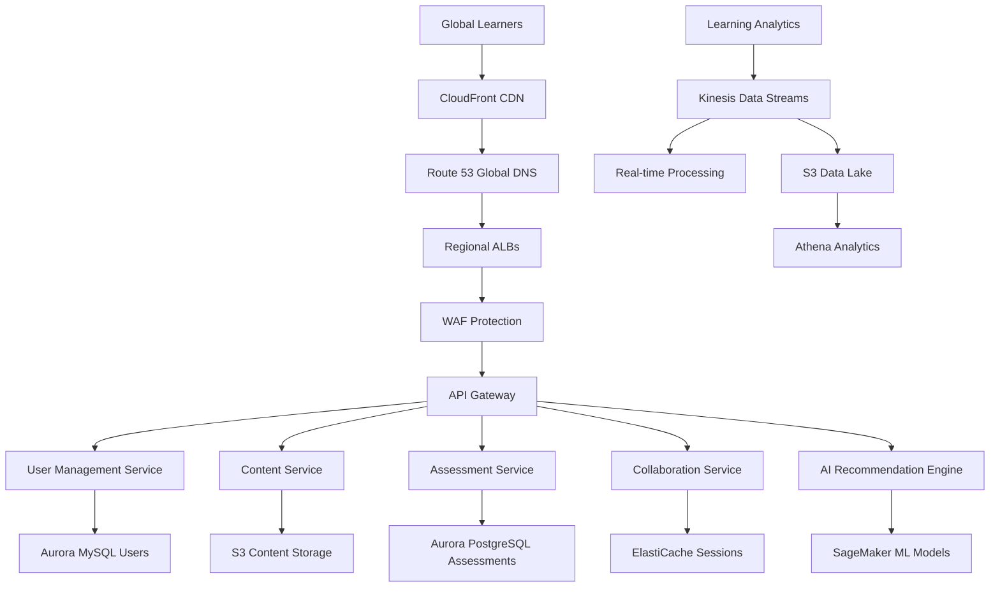
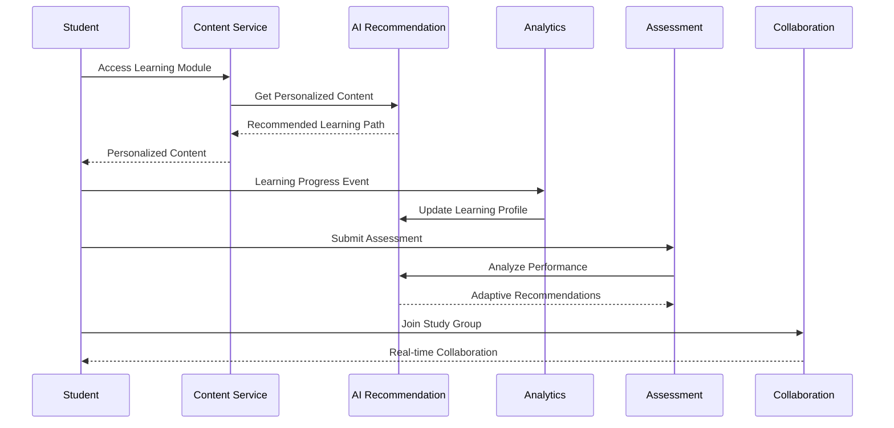
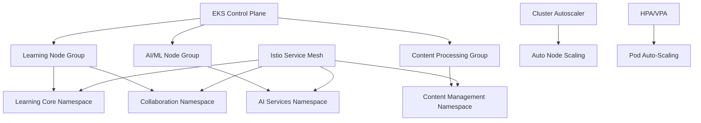
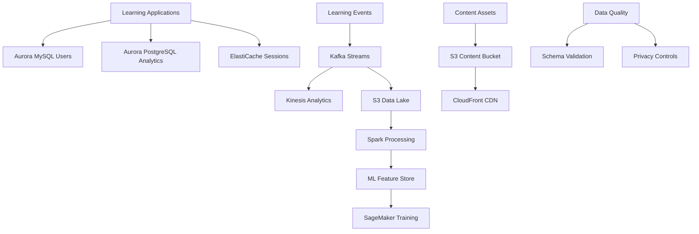
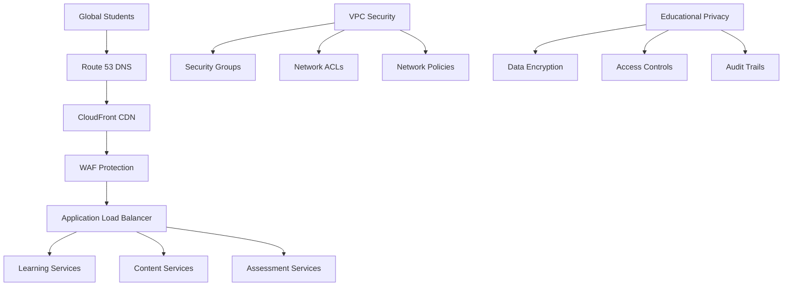
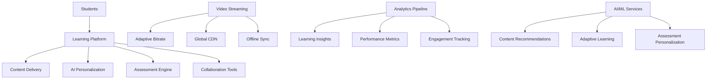

# Global E-Learning Platform with AI: Container-Based Architecture on AWS

## 1. Business Context & Requirements

The global e-learning platform serves 50+ million students worldwide across K-12, higher education, and professional development segments. The platform delivers personalized learning experiences through AI-powered content recommendations, real-time collaboration tools, and adaptive assessment systems while supporting multiple languages and cultural contexts.

**Core Business Requirements:**
- **Global Scale**: Support 50+ million concurrent users across 150+ countries
- **Personalization**: AI-driven learning paths adapted to individual student needs
- **Real-Time Collaboration**: Live classrooms, group projects, and peer interactions
- **Content Delivery**: High-quality video streaming with adaptive bitrate
- **Assessment**: Automated grading and proctoring with anti-cheating measures
- **Accessibility**: WCAG 2.1 AA compliance and multi-language support

**Success Metrics:**
- Learning engagement: >80% course completion rates with 4.5+ star ratings
- Platform availability: 99.9% uptime during peak learning hours
- Video quality: <2 second start time, <1% buffering events
- AI accuracy: >90% precision for content recommendations and assessment
- Global performance: <200ms response times across all regions

**Technical Constraints:**
- COPPA and FERPA compliance for student data protection
- Multi-tenant architecture supporting institutional customization
- Real-time synchronization for collaborative learning activities
- Scalable assessment system handling 10+ million tests monthly
- Content delivery optimization for varying network conditions globally

**Market Opportunity:**
The global e-learning market exceeds $400 billion with 15%+ annual growth driven by digital transformation in education. Competitive advantages include personalized AI tutoring, seamless mobile-desktop experience, and comprehensive analytics for educators. The platform targets educational institutions, corporate training, and individual learners seeking flexible, personalized education solutions.

## 2. High-Level Architecture

The e-learning platform architecture emphasizes scalability, personalization, and real-time collaboration through microservices deployed on Kubernetes. The system integrates AI/ML services for content personalization while maintaining strict data privacy and educational compliance requirements.

**System Design Philosophy:**
- **Learner-Centric Design**: All services optimized for student learning outcomes and engagement
- **AI-First Approach**: Machine learning integrated throughout the learning experience
- **Multi-Tenancy**: Scalable architecture supporting thousands of educational institutions
- **Mobile-First**: Responsive design with offline learning capabilities
- **Global Accessibility**: Internationalization and accessibility built into every component

**Key Architectural Decisions:**
- **Kubernetes-Native**: Cloud-native deployment with container orchestration
- **Event-Driven Architecture**: Asynchronous processing for learning analytics and notifications
- **Microservices Boundaries**: Services aligned with educational domains (content, assessment, collaboration)
- **CDN-First Strategy**: Global content delivery optimized for educational media
- **Data Privacy by Design**: GDPR and educational privacy regulations built into architecture

**Multi-Region Deployment Strategy:**
- **Primary Regions**: US-East (Virginia), EU-West (Ireland), Asia-Pacific (Singapore)
- **Edge Regions**: 12 additional regions for content delivery and user proximity
- **Data Residency**: Student data stored in compliance with local educational regulations
- **Disaster Recovery**: Active-passive setup with 15-minute RTO for critical services



**Service Interaction Patterns:**
The architecture implements both synchronous and asynchronous communication patterns optimized for educational workflows. Real-time features use WebSocket connections while analytics processing leverages event streaming for scalability.



## 3. EKS Cluster Architecture

The EKS cluster architecture supports diverse educational workloads from real-time collaboration to batch ML processing. Multiple specialized node groups optimize resources for different service types while maintaining cost efficiency and performance.

**Multi-Cluster Strategy:**
- **Learning Cluster**: Handles user-facing educational services with optimized networking
- **AI/ML Cluster**: Dedicated cluster for machine learning workloads with GPU nodes
- **Content Processing Cluster**: Manages video transcoding and content processing
- **Analytics Cluster**: Processes learning analytics and generates insights

**Node Group Configuration:**
```yaml
# User-Facing Services Node Group
learningNodeGroup:
  instanceTypes: ["m6i.xlarge", "m6i.2xlarge", "m6i.4xlarge"]
  capacityType: MIXED  # Spot and On-Demand for cost optimization
  subnets: ["subnet-learning-1a", "subnet-learning-1b", "subnet-learning-1c"]
  minSize: 15
  maxSize: 200
  desiredSize: 30
  labels:
    workload: "learning"
    tier: "frontend"
  spotAllocationStrategy: "diversified"
  onDemandPercentage: 30

# AI/ML Node Group with GPU
aiNodeGroup:
  instanceTypes: ["g4dn.xlarge", "g4dn.2xlarge"]
  capacityType: ON_DEMAND
  subnets: ["subnet-ai-1a", "subnet-ai-1b"]
  minSize: 2
  maxSize: 20
  desiredSize: 5
  labels:
    workload: "ai-ml"
    gpu: "enabled"
  taints:
    - key: "gpu"
      value: "ai-workload"
      effect: "NoSchedule"
```

**Namespace Organization:**
```yaml
# Educational Domain Namespaces
namespaces:
  learning-core:        # Core learning services
    labels:
      tier: "critical"
      data-sensitivity: "high"
  content-management:   # Content and media services
    labels:
      tier: "high"
      storage-intensive: "true"
  ai-services:         # ML and AI services
    labels:
      tier: "high"
      compute-intensive: "true"
  collaboration:       # Real-time collaboration tools
    labels:
      tier: "critical"
      real-time: "true"
  analytics:          # Learning analytics and reporting
    labels:
      tier: "standard"
      batch-processing: "true"
```

**Auto-Scaling Configuration:**
```yaml
# Cluster Autoscaler Configuration
clusterAutoscaler:
  nodeGroups:
    learning:
      scaleUpCooldown: 60s
      scaleDownCooldown: 300s
      scaleUpUtilization: 0.7
      scaleDownUtilization: 0.3
    ai-ml:
      scaleUpCooldown: 120s
      scaleDownCooldown: 600s
      scaleUpUtilization: 0.8
      scaleDownUtilization: 0.2
```

**Service Mesh with Istio:**
- **Traffic Management**: Intelligent routing for A/B testing educational features
- **Security**: Automatic mTLS for all service communication
- **Observability**: Distributed tracing for learning journey analysis
- **Canary Deployments**: Safe rollout of new educational features

**Resource Management:**
- **Quality of Service**: Guaranteed resources for real-time collaboration services
- **Priority Classes**: Critical learning services get scheduling priority
- **Pod Disruption Budgets**: Ensure availability during maintenance windows
- **Resource Quotas**: Prevent resource contention between educational tenants



## 4. Database & Data Architecture

The database architecture balances transactional consistency for user data with analytical performance for learning insights. A polyglot persistence approach uses specialized databases optimized for different educational use cases.

**Aurora MySQL for User Management:**
```yaml
# Primary User Database Configuration
auroraUserCluster:
  engine: aurora-mysql
  version: "8.0.mysql_aurora.3.02.0"
  instanceClass: db.r6g.xlarge
  instances: 3
  multiAZ: true
  globalCluster: true
  regions: ["us-east-1", "eu-west-1", "ap-southeast-1"]
  storageEncrypted: true
  kmsKeyId: "arn:aws:kms:region:account:key/user-data-key"
  backupRetentionPeriod: 30
  deleteProtection: true
```

**Aurora PostgreSQL for Learning Analytics:**
```yaml
# Analytics Database Configuration
auroraAnalyticsCluster:
  engine: aurora-postgresql
  version: "14.6"
  instanceClass: db.r6g.2xlarge
  instances: 5
  readerInstances: 3
  multiAZ: true
  storageEncrypted: true
  performanceInsights: true
  monitoringInterval: 60
```

**Database Performance Optimization:**
- **Connection Pooling**: PgBouncer and ProxySQL for efficient connection management
- **Read Scaling**: Aurora Auto Scaling adds readers based on CPU and connection metrics
- **Query Optimization**: Materialized views for complex learning analytics queries
- **Partitioning**: Time-based partitioning for learning event data

**Data Processing Pipeline:**
```yaml
# Kafka Configuration for Learning Events
kafkaConfig:
  clusterSize: 6
  replicationFactor: 3
  partitions: 30
  retentionMs: 2592000000  # 30 days
  topics:
    learning-events:
      partitions: 50
      replicationFactor: 3
      cleanupPolicy: "delete"
    assessment-events:
      partitions: 20
      replicationFactor: 3
      cleanupPolicy: "compact"
    collaboration-events:
      partitions: 30
      replicationFactor: 3
      cleanupPolicy: "delete"
```

**S3 Data Lake Architecture:**
- **Raw Learning Data**: Unprocessed learning events and interactions (JSON/Parquet)
- **Processed Analytics**: Cleaned and enriched data for reporting (Delta Lake)
- **Content Assets**: Educational videos, documents, and multimedia content
- **ML Training Data**: Feature stores and training datasets for AI models
- **Backup and Archive**: Long-term retention for compliance and research

**Real-Time Data Processing:**
```yaml
# Kinesis Analytics for Real-Time Insights
kinesisAnalytics:
  applications:
    - name: "real-time-engagement"
      inputStreams:
        - "learning-events-stream"
      outputStreams:
        - "engagement-alerts"
      sql: |
        CREATE STREAM engagement_alerts AS
        SELECT student_id, course_id, engagement_score
        FROM SOURCE_SQL_STREAM_001
        WHERE engagement_score < 0.3
        GROUP BY student_id, course_id
        RANGE INTERVAL '5' MINUTE;
```

**Data Quality and Governance:**
- **Schema Registry**: Confluent Schema Registry for event schema management
- **Data Validation**: Real-time validation of learning events against schemas
- **Privacy Controls**: Automated PII detection and anonymization
- **Audit Trails**: Complete lineage tracking for educational data



## 5. Networking & Security

The network architecture implements educational data protection standards with fine-grained access controls and content delivery optimization. Security design follows zero-trust principles while supporting global accessibility requirements.

**VPC Network Design:**
```yaml
# Multi-Tier VPC Architecture
vpc:
  cidr: "10.0.0.0/16"
  enableDnsHostnames: true
  enableDnsSupport: true
  subnets:
    public:
      web-1a: "10.0.1.0/24"
      web-1b: "10.0.2.0/24"
      web-1c: "10.0.3.0/24"
    private:
      app-1a: "10.0.11.0/24"
      app-1b: "10.0.12.0/24"
      app-1c: "10.0.13.0/24"
    data:
      db-1a: "10.0.21.0/24"
      db-1b: "10.0.22.0/24"
      db-1c: "10.0.23.0/24"
    ai:
      ml-1a: "10.0.31.0/24"
      ml-1b: "10.0.32.0/24"
```

**Application Load Balancer Configuration:**
```yaml
# Multi-Service ALB Configuration
albConfig:
  scheme: internet-facing
  ipAddressType: ipv4
  subnets: ["subnet-web-1a", "subnet-web-1b", "subnet-web-1c"]
  securityGroups: ["sg-alb-learning"]
  listeners:
    - port: 443
      protocol: HTTPS
      certificates:
        - certificateArn: "arn:aws:acm:region:account:certificate/learning-platform"
      rules:
        - priority: 100
          conditions:
            - field: host-header
              values: ["api.learningplatform.com"]
          actions:
            - type: forward
              targetGroup: "tg-api-services"
        - priority: 200
          conditions:
            - field: path-pattern
              values: ["/collaboration/*"]
          actions:
            - type: forward
              targetGroup: "tg-collaboration"
```

**CDN and Content Delivery:**
```yaml
# CloudFront Distribution for Educational Content
cloudFrontConfig:
  distribution:
    origins:
      - domainName: "content.learningplatform.com"
        originPath: "/educational-content"
        customHeaders:
          - headerName: "X-Educational-Token"
            headerValue: "${aws:SecureString:/learning/content-token}"
    behaviors:
      - pathPattern: "/videos/*"
        targetOrigin: "s3-content-origin"
        viewerProtocol: "redirect-to-https"
        cachePolicyId: "video-optimized-policy"
        compress: true
      - pathPattern: "/api/*"
        targetOrigin: "alb-api-origin"
        viewerProtocol: "https-only"
        cachePolicyId: "api-cache-policy"
        ttl:
          default: 0
          maximum: 300
```

**Security Groups and Network Policies:**
```yaml
# Kubernetes Network Policies for Education Services
apiVersion: networking.k8s.io/v1
kind: NetworkPolicy
metadata:
  name: learning-core-policy
  namespace: learning-core
nspec:
  podSelector:
    matchLabels:
      tier: learning
  policyTypes:
  - Ingress
  - Egress
  ingress:
  - from:
    - namespaceSelector:
        matchLabels:
          name: collaboration
    - podSelector:
        matchLabels:
          app: api-gateway
    ports:
    - protocol: TCP
      port: 8080
  egress:
  - to:
    - namespaceSelector:
        matchLabels:
          name: ai-services
    ports:
    - protocol: TCP
      port: 8080
```

**WAF Rules for Educational Platform:**
```yaml
# WAF Configuration for Learning Platform
wafRules:
  - name: "BlockEducationalSpam"
    priority: 1
    statement:
      rateBasedStatement:
        limit: 1000
        aggregateKeyType: "IP"
        scopeDownStatement:
          byteMatchStatement:
            fieldToMatch:
              uriPath: {}
            textTransformations:
              - priority: 0
                type: "LOWERCASE"
            searchString: "/api/assessment"
  - name: "ProtectStudentData"
    priority: 2
    statement:
      sqliMatchStatement:
        fieldToMatch:
          body: {}
        textTransformations:
          - priority: 1
            type: "URL_DECODE"
```

**Educational Data Privacy:**
- **Encryption**: All student data encrypted with educational-grade encryption
- **Access Controls**: Role-based access aligned with educational hierarchies
- **Data Anonymization**: Automatic anonymization for analytics and research
- **Audit Logging**: Complete audit trail for student data access



## 6. Monitoring & Observability Stack

The observability stack provides comprehensive visibility into learning outcomes, system performance, and educational analytics. Monitoring focuses on both technical metrics and educational KPIs to ensure optimal learning experiences.

**Prometheus Operator for Educational Metrics:**
```yaml
# Prometheus Configuration for Learning Platform
prometheus:
  prometheusSpec:
    retention: 30d
    storageSpec:
      volumeClaimTemplate:
        spec:
          accessModes: ["ReadWriteOnce"]
          resources:
            requests:
              storage: 200Gi
          storageClassName: gp3
    additionalScrapeConfigs: |
      - job_name: 'learning-services'
        kubernetes_sd_configs:
          - role: pod
            namespaces:
              names:
                - learning-core
                - content-management
                - ai-services
        relabel_configs:
          - source_labels: [__meta_kubernetes_pod_annotation_prometheus_io_scrape]
            action: keep
            regex: true
```

**Custom Educational Metrics:**
```yaml
# Learning-Specific Metrics
educationalMetrics:
  engagement:
    - name: "student_session_duration_seconds"
      type: "histogram"
      labels: ["course_id", "student_id", "device_type"]
    - name: "learning_module_completion_rate"
      type: "gauge"
      labels: ["module_id", "difficulty_level"]
  assessment:
    - name: "assessment_completion_time_seconds"
      type: "histogram"
      labels: ["assessment_type", "subject"]
    - name: "assessment_score_distribution"
      type: "histogram"
      buckets: [0.6, 0.7, 0.8, 0.9, 1.0]
  content:
    - name: "video_streaming_quality"
      type: "gauge"
      labels: ["resolution", "bitrate", "region"]
```

**Grafana Dashboards for Education:**
```yaml
**Grafana Dashboards for Education:**
```yaml
# Educational Analytics Dashboards
grafana:
  dashboards:
    learning-analytics:
      title: "Learning Analytics Overview"
      panels:
        - title: "Student Engagement Trends"
          type: "time-series"
          targets:
            - expr: "rate(student_session_duration_seconds_sum[5m])"
        - title: "Course Completion Rates"
          type: "stat"
          targets:
            - expr: "avg(learning_module_completion_rate) by (course_id)"
```

## 7. Application Architecture

The application architecture implements domain-driven design principles focused on educational workflows. Microservices are organized around educational capabilities with emphasis on personalization, collaboration, and assessment.

**Educational Microservices Design:**
- **User Management**: Student profiles, instructor accounts, institutional administration
- **Content Management**: Learning materials, multimedia content, curriculum organization
- **Assessment Engine**: Quiz creation, automated grading, performance analytics
- **Collaboration Platform**: Real-time chat, group projects, peer review systems
- **AI Recommendation**: Personalized learning paths, content suggestions, adaptive learning

```yaml
# Learning Service Deployment
apiVersion: apps/v1
kind: Deployment
metadata:
  name: content-service
  namespace: content-management
spec:
  replicas: 8
  selector:
    matchLabels:
      app: content-service
  template:
    spec:
      containers:
      - name: content-service
        image: learning-platform/content-service:2.1.0
        resources:
          requests:
            memory: "2Gi"
            cpu: "500m"
          limits:
            memory: "4Gi"
            cpu: "2"
```

## 8. AI/ML Pipeline and SageMaker Integration

The AI/ML pipeline powers personalized learning through recommendation engines, content analysis, and adaptive assessments. SageMaker provides scalable machine learning for educational insights.

**SageMaker Model Training:**
```yaml
sagemakerTraining:
  jobName: "learning-recommendation-model"
  algorithmSpecification:
    trainingImage: "learning-platform/recommendation-algorithm:latest"
  inputDataConfig:
    - channelName: "training"
      dataSource:
        s3DataSource:
          s3Uri: "s3://learning-ml-data/training/recommendations/"
  resourceConfig:
    instanceType: "ml.p3.2xlarge"
    instanceCount: 2
```

## 9. DevOps & CI/CD

The DevOps pipeline implements educational-specific deployment strategies with comprehensive testing for learning outcomes.

```yaml
# GitOps with ArgoCD
apiVersion: argoproj.io/v1alpha1
kind: Application
metadata:
  name: learning-platform
spec:
  source:
    repoURL: https://github.com/learning-platform/k8s-manifests
    targetRevision: main
  destination:
    server: https://kubernetes.default.svc
    namespace: learning-core
```

## 10. Security & Compliance

Security architecture implements educational data protection standards with COPPA and FERPA compliance.

```yaml
# Educational Data Security Policy
apiVersion: v1
kind: Pod
spec:
  securityContext:
    runAsNonRoot: true
    runAsUser: 1000
    fsGroup: 1000
  containers:
  - name: learning-service
    securityContext:
      allowPrivilegeEscalation: false
      readOnlyRootFilesystem: true
```

## 11. Performance & Scalability

Performance optimization focuses on global accessibility and real-time collaboration requirements.

```yaml
# Horizontal Pod Autoscaling
apiVersion: autoscaling/v2
kind: HorizontalPodAutoscaler
metadata:
  name: learning-service-hpa
spec:
  minReplicas: 10
  maxReplicas: 100
  metrics:
  - type: Resource
    resource:
      name: cpu
      target:
        type: Utilization
        averageUtilization: 70
```

## 12. Disaster Recovery

Disaster recovery ensures educational continuity with minimal disruption to learning activities.

**Multi-Region Strategy:**
- Primary regions for major student populations
- Real-time data replication for user profiles and progress
- Automated failover for critical learning services
- 15-minute RTO for core educational functionality

## 13. Video Streaming and Content Delivery Deep Dive

The video streaming architecture delivers high-quality educational content globally with adaptive bitrate streaming and offline capabilities.

**Video Processing Pipeline:**
```yaml
# Video Processing Workflow
videoProcessing:
  input: "s3://learning-content-raw/"
  outputs:
    - resolution: "1080p"
      bitrate: "5000k"
      codec: "h264"
    - resolution: "720p" 
      bitrate: "2500k"
      codec: "h264"
    - resolution: "480p"
      bitrate: "1000k"
      codec: "h264"
  captions:
    - language: "en"
      format: "srt"
    - language: "es"
      format: "srt"
```

**AI-Powered Personalization Engine:**
The personalization system adapts content and learning paths based on individual student behavior and performance.

```java
@Service
public class PersonalizationService {
    
    public LearningPath generatePersonalizedPath(String studentId, String courseId) {
        StudentProfile profile = getStudentProfile(studentId);
        CourseContent content = getCourseContent(courseId);
        
        // AI-powered path generation
        PersonalizationRequest request = PersonalizationRequest.builder()
            .studentProfile(profile)
            .courseContent(content)
            .learningObjectives(content.getObjectives())
            .build();
            
        return aiRecommendationService.generateLearningPath(request);
    }
}
```

**Real-Time Collaboration Features:**
- Live virtual classrooms with video conferencing
- Collaborative document editing and annotation
- Real-time chat and discussion forums
- Peer review and group project management
- Interactive whiteboards and screen sharing

**Learning Analytics Dashboard:**
Comprehensive analytics provide insights into student progress, engagement, and learning outcomes.



This comprehensive e-learning platform architecture demonstrates how containerized systems on AWS can deliver personalized, scalable education experiences. The platform leverages AI/ML for personalization, real-time collaboration tools, and global content delivery to support millions of learners worldwide while maintaining educational compliance and accessibility standards.