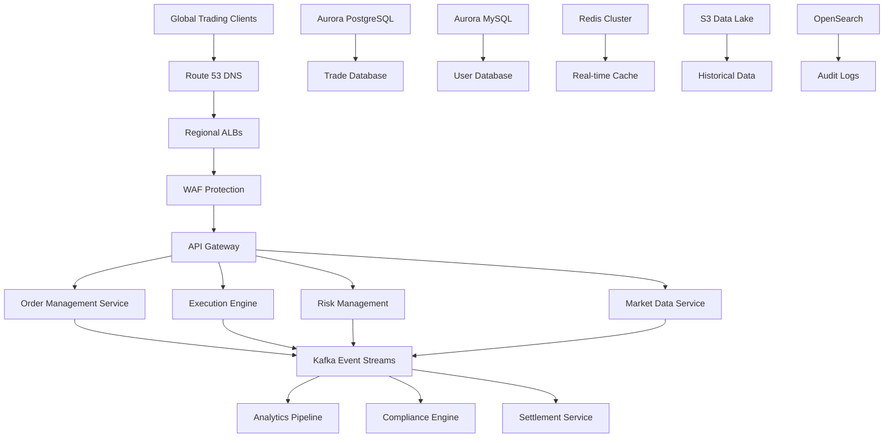
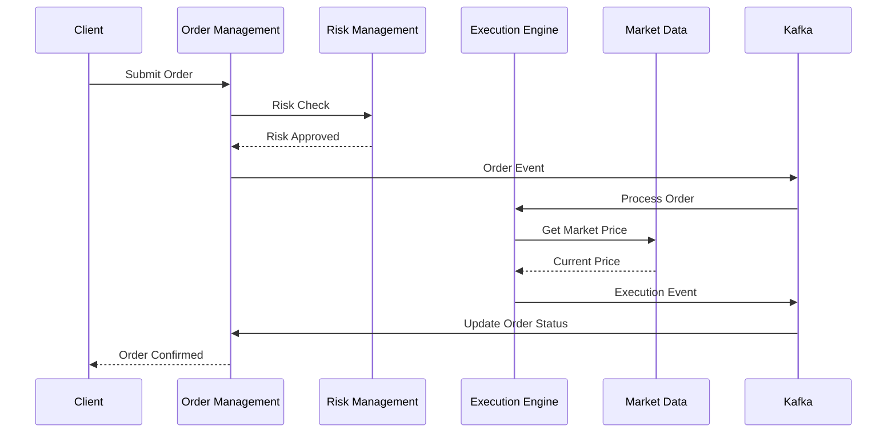
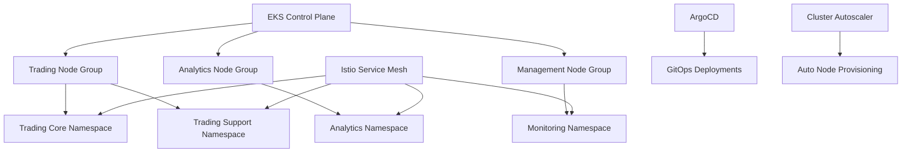
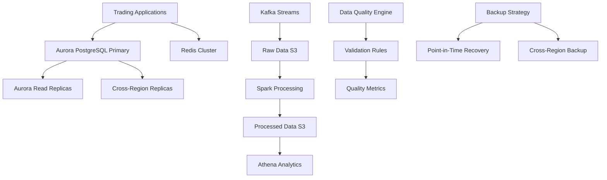
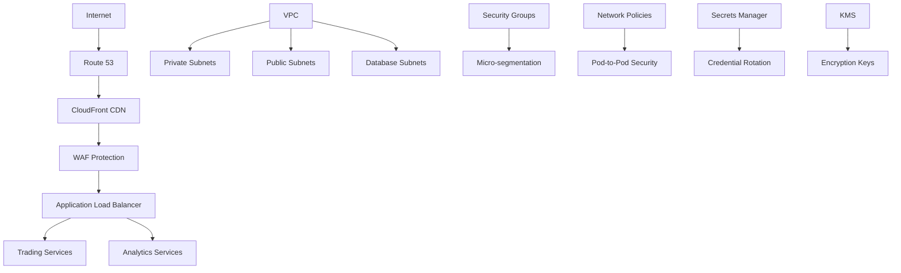
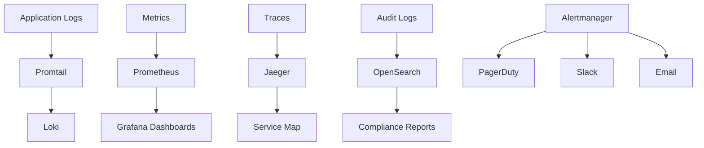
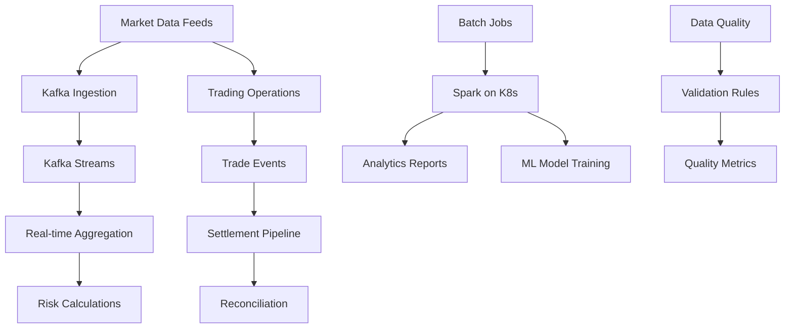
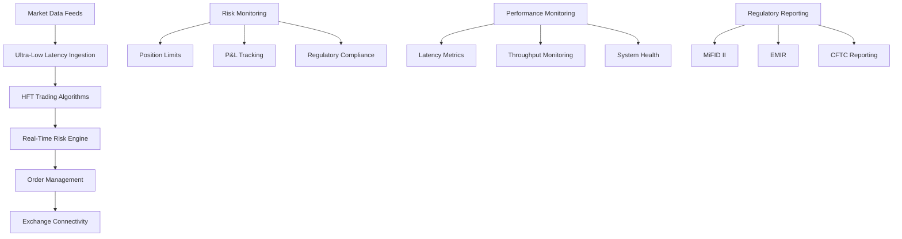

# Global Fintech Trading Platform: Container-Based Architecture on AWS

## 1. Business Context & Requirements

The global fintech trading platform serves institutional and retail traders across multiple asset classes including equities, futures, options, and cryptocurrencies. The platform processes over 10 million trades daily with microsecond-level latency requirements for high-frequency trading (HFT) operations while maintaining strict regulatory compliance across multiple jurisdictions.

**Core Business Requirements:**
- **Ultra-Low Latency**: Sub-100 microsecond order execution for HFT operations
- **High Throughput**: Process 1+ million orders per second during peak trading hours
- **Global Scale**: Support trading across 50+ exchanges in 25+ countries
- **Regulatory Compliance**: Meet MiFID II, Dodd-Frank, and regional financial regulations
- **Risk Management**: Real-time position monitoring and automated risk controls
- **Market Data**: Real-time ingestion from 200+ market data providers

**Success Metrics:**
- Order-to-execution latency: <100 microseconds for HFT, <10ms for retail
- System availability: 99.99% during trading hours with zero data loss
- Trade settlement accuracy: 100% with automated reconciliation
- Risk calculation speed: <1ms for portfolio risk assessment
- Market data latency: <500 microseconds from exchange to application

**Technical Constraints:**
- Regulatory audit trails requiring immutable transaction logs
- Cross-border data residency requirements for customer data
- Real-time stress testing and scenario analysis capabilities
- Integration with legacy trading systems and settlement networks
- 24/7 operations across global trading sessions (Asia, Europe, Americas)

**Market Opportunity:**
The global algorithmic trading market is valued at $15+ billion with 20% annual growth. Competitive advantages include superior latency, advanced risk management, and comprehensive regulatory compliance automation. The platform targets institutional clients requiring sophisticated trading infrastructure with transparent pricing and reduced operational overhead.

## 2. High-Level Architecture

The trading platform architecture prioritizes deterministic performance, fault tolerance, and regulatory compliance through a microservices-based design deployed across multiple AWS regions. The system employs event-driven patterns with CQRS (Command Query Responsibility Segregation) to separate trading operations from analytics workloads.

**System Design Philosophy:**
- **Domain-Driven Design**: Services organized around trading domains (order management, execution, settlement, risk)
- **Event Sourcing**: Immutable event store for complete audit trails and system reconstruction
- **Microservices Decomposition**: Loosely coupled services with clear ownership boundaries
- **Circuit Breaker Pattern**: Graceful degradation during market volatility or system stress
- **Multi-Region Active-Active**: Simultaneous trading operations across regions for proximity to exchanges

**Key Architectural Decisions:**
- **Container-First Strategy**: All services containerized for consistent deployment and scaling
- **Kubernetes-Native**: Leverage K8s operators for database management and service orchestration
- **Message-Driven Architecture**: Apache Kafka for reliable, ordered message delivery
- **CQRS Implementation**: Separate read/write models optimized for trading vs analytics workloads
- **Polyglot Persistence**: Different databases optimized for specific use cases

**Multi-Region Deployment Strategy:**
- **Primary Regions**: US-East (New York), EU-West (London), Asia-Pacific (Tokyo)
- **Data Locality**: Customer data and orders processed in home region
- **Cross-Region Replication**: Real-time replication for disaster recovery and compliance
- **Market Proximity**: Services deployed close to major exchanges for latency optimization



**Service Interaction Patterns:**
The architecture implements asynchronous communication for non-critical paths while maintaining synchronous patterns for latency-sensitive trading operations. Event sourcing ensures all trading events are captured immutably, enabling complete system reconstruction and regulatory reporting.



## 3. EKS Cluster Architecture

The EKS cluster architecture supports ultra-low latency trading operations through optimized node configurations, dedicated resource allocation, and sophisticated auto-scaling policies. Multiple cluster configurations serve different workload types while maintaining isolation and performance guarantees.

**Multi-Cluster Strategy:**
- **Trading Cluster**: Dedicated to latency-sensitive trading operations with optimized networking
- **Analytics Cluster**: Handles batch processing, reporting, and machine learning workloads
- **Management Cluster**: Hosts monitoring, logging, and operational tools
- **DR Cluster**: Disaster recovery cluster in secondary region for failover operations

**Node Group Configuration:**
```yaml
# High-Performance Trading Nodes
tradingNodeGroup:
  instanceTypes: ["c6i.4xlarge", "c6i.8xlarge"]
  capacityType: ON_DEMAND
  subnets: ["subnet-trading-1a", "subnet-trading-1b", "subnet-trading-1c"]
  minSize: 10
  maxSize: 100
  desiredSize: 20
  labels:
    workload: "trading"
    latency: "ultra-low"
  taints:
    - key: "trading"
      value: "dedicated"
      effect: "NoSchedule"
```

**Auto-Scaling Policies:**
- **Predictive Scaling**: Pre-scale based on market opening times and historical patterns
- **Reactive Scaling**: Sub-30 second scaling based on CPU, memory, and custom metrics
- **Market Event Scaling**: Automatic scaling during high volatility periods
- **Cost Optimization**: Spot instances for non-critical workloads with mixed instance types

**Namespace Organization:**
```yaml
# Namespace Strategy
namespaces:
  trading-core:     # Core trading services
    labels:
      tier: "critical"
      sla: "ultra-high"
  trading-support:  # Supporting services
    labels:
      tier: "high"
      sla: "high"  
  analytics:        # Analytics and reporting
    labels:
      tier: "standard"
      sla: "medium"
  monitoring:       # Observability stack
    labels:
      tier: "critical"
      sla: "high"
```

**RBAC Security Configuration:**
- **Service Accounts**: Dedicated service accounts for each microservice with minimal permissions
- **Role-Based Access**: Granular roles based on job functions (trader, analyst, operator, auditor)
- **Pod Security Standards**: Enforced security contexts and security policies
- **Network Policies**: Micro-segmentation between services and namespaces

**Service Mesh Integration:**
- **Istio Service Mesh**: Advanced traffic management, security, and observability
- **mTLS**: Automatic mutual TLS for all service-to-service communication
- **Traffic Policies**: Fine-grained traffic routing and load balancing
- **Security Policies**: Authorization policies based on service identity

**Cluster Operations:**
- **GitOps with ArgoCD**: Declarative configuration management and automated deployments
- **Helm Charts**: Standardized application packaging and configuration management
- **Cluster Autoscaler**: Automatic node provisioning based on pod scheduling requirements
- **Pod Disruption Budgets**: Ensure service availability during cluster maintenance



## 4. Database & Data Architecture

The database architecture balances ACID compliance for financial transactions with high-performance read capabilities for real-time analytics. Aurora PostgreSQL serves as the primary transactional database while specialized databases handle specific use cases like caching and time-series data.

**Aurora PostgreSQL Configuration:**
```yaml
# Primary Trading Database
auroraCluster:
  engine: aurora-postgresql
  version: "14.6"
  instanceClass: db.r6g.2xlarge
  instances: 3
  multiAZ: true
  storageEncrypted: true
  backupRetentionPeriod: 35
  preferredBackupWindow: "03:00-04:00"
  preferredMaintenanceWindow: "sun:04:00-sun:05:00"
```

**Read Replica Strategy:**
- **Regional Read Replicas**: 5 read replicas per region for analytics workloads
- **Cross-Region Replicas**: 2 replicas in each secondary region for disaster recovery
- **Read Scaling**: Aurora Auto Scaling adds replicas based on CPU and connection metrics
- **Connection Pooling**: PgBouncer deployed as sidecar containers for connection management

**Database Performance Tuning:**
- **Connection Pooling**: Maximum 1000 connections per instance with intelligent routing
- **Query Optimization**: Materialized views for complex analytical queries
- **Indexing Strategy**: Covering indexes for frequent trading queries
- **Partitioning**: Table partitioning by date for historical trade data

**Data Pipeline Architecture:**
```yaml
# Kafka Configuration for Data Streaming
kafkaCluster:
  brokers: 9
  replicationFactor: 3
  partitions: 50
  retentionMs: 604800000  # 7 days
  topics:
    - trade-events
    - market-data
    - risk-events
    - settlement-events
```

**Stream Processing with Kafka:**
- **Trade Event Stream**: Real-time trade execution events for settlement processing
- **Market Data Stream**: High-frequency market data for pricing and risk calculations
- **Risk Event Stream**: Position updates and risk metric calculations
- **Audit Stream**: Immutable audit trail for regulatory compliance

**S3 Data Lake Architecture:**
- **Raw Data Zone**: Unprocessed market data and trade events (Parquet format)
- **Processed Zone**: Cleaned and enriched data for analytics (Delta Lake format)
- **Analytics Zone**: Aggregated data and machine learning features
- **Archive Zone**: Historical data with Glacier storage for compliance retention

**Data Quality and Validation:**
- **Real-time Validation**: Schema validation for all incoming data streams
- **Data Lineage**: Complete tracking of data transformations for audit purposes
- **Quality Metrics**: Automated data quality monitoring with alerting
- **Reconciliation**: Automated daily reconciliation between systems



## 5. Networking & Security

The network architecture implements defense-in-depth security with micro-segmentation, zero-trust principles, and optimized routing for ultra-low latency trading operations. VPC design follows AWS best practices while accommodating the unique requirements of financial services.

**VPC Architecture:**
```yaml
# Multi-AZ VPC Configuration
vpc:
  cidr: "10.0.0.0/16"
  enableDnsHostnames: true
  enableDnsSupport: true
  subnets:
    private:
      trading-1a: "10.0.1.0/24"
      trading-1b: "10.0.2.0/24"  
      trading-1c: "10.0.3.0/24"
    public:
      alb-1a: "10.0.101.0/24"
      alb-1b: "10.0.102.0/24"
      alb-1c: "10.0.103.0/24"
    database:
      db-1a: "10.0.201.0/24"
      db-1b: "10.0.202.0/24"
      db-1c: "10.0.203.0/24"
```

**Security Groups Configuration:**
- **Trading Services**: Strict ingress rules allowing only necessary ports (8080, 8443)
- **Database Access**: Restricted to application security groups on PostgreSQL port (5432)
- **Load Balancer**: HTTPS traffic (443) from WAF with health check ports
- **Management**: SSH access restricted to bastion hosts with session manager

**Application Load Balancer Configuration:**
```yaml
# ALB for Trading Services
albConfig:
  scheme: internet-facing
  subnets: ["subnet-alb-1a", "subnet-alb-1b", "subnet-alb-1c"]
  securityGroups: ["sg-alb-trading"]
  listeners:
    - port: 443
      protocol: HTTPS
      certificateArn: "arn:aws:acm:region:account:certificate/cert-id"
      rules:
        - priority: 100
          conditions:
            - field: path-pattern
              values: ["/api/trading/*"]
          actions:
            - type: forward
              targetGroup: "tg-trading-services"
```

**Route 53 Health Checks:**
- **Multi-Region Failover**: Automatic failover to secondary region based on health checks
- **Latency-Based Routing**: Route traffic to lowest latency endpoint for trading operations
- **Weighted Routing**: Gradual traffic shifting for blue/green deployments
- **Health Check Monitoring**: Deep health checks including database connectivity

**WAF Security Rules:**
```yaml
# WAF Configuration for Trading Platform
wafRules:
  - name: "BlockSQLInjection"
    priority: 1
    statement:
      sqliMatchStatement:
        fieldToMatch: {body: {}, queryString: {}, uriPath: {}}
        textTransformations:
          - priority: 1
            type: "URL_DECODE"
  - name: "RateLimitTrading"
    priority: 2
    statement:
      rateBasedStatement:
        limit: 10000
        aggregateKeyType: "IP"
```

**Network Policies for EKS:**
- **Namespace Isolation**: Default deny policies with explicit allow rules
- **Service-to-Service**: Micro-segmentation between trading services
- **Database Access**: Restricted database access to authorized services only
- **External Access**: Controlled egress to market data providers and exchanges

**Secrets Management:**
- **AWS Secrets Manager**: Database credentials, API keys, and certificates
- **External Secrets Operator**: Kubernetes integration for automatic secret rotation
- **Encryption**: All secrets encrypted with customer-managed KMS keys
- **Access Control**: IAM policies and RBAC for secret access authorization



## 6. Monitoring & Observability Stack

The comprehensive observability stack provides real-time visibility into trading operations, system performance, and business metrics. The monitoring architecture supports both operational alerting and regulatory reporting requirements through multiple specialized tools.

**Prometheus Operator Setup:**
```yaml
# Prometheus Configuration
prometheus:
  prometheusSpec:
    retention: 15d
    storageSpec:
      volumeClaimTemplate:
        spec:
          accessModes: ["ReadWriteOnce"]
          resources:
            requests:
              storage: 100Gi
          storageClassName: gp3
    resources:
      requests:
        memory: 4Gi
        cpu: 2
      limits:
        memory: 8Gi
        cpu: 4
    ruleSelector:
      matchLabels:
        prometheus: trading-platform
```

**Custom Trading Metrics:**
- **Order Latency**: Histogram metrics for order processing times
- **Trade Volume**: Counter metrics for trade volume by asset class
- **Risk Metrics**: Gauge metrics for portfolio risk and exposure
- **Market Data Latency**: Histogram for market data feed latency
- **Settlement Status**: Counter for settlement success/failure rates

**Grafana Dashboard Management:**
```yaml
# Grafana Configuration
grafana:
  adminPassword: ${GRAFANA_ADMIN_PASSWORD}
  persistence:
    enabled: true
    size: 50Gi
    storageClassName: gp3
  plugins:
    - grafana-piechart-panel
    - grafana-worldmap-panel
    - yesoreyeram-boomtable-panel
  dashboardProviders:
    dashboards.yaml:
      apiVersion: 1
      providers:
        - name: 'trading-dashboards'
          folder: 'Trading'
          options:
            path: /var/lib/grafana/dashboards/trading
```

**Key Grafana Dashboards:**
- **Trading Operations**: Real-time order flow, execution metrics, and latency monitoring
- **Risk Management**: Portfolio risk, position limits, and compliance metrics
- **System Performance**: Infrastructure metrics, database performance, and service health
- **Business Intelligence**: Trading volumes, revenue metrics, and customer analytics

**Loki Log Collection Strategy:**
```yaml
# Loki Configuration
loki:
  config:
    schema_config:
      configs:
        - from: 2020-10-24
          store: boltdb-shipper
          object_store: s3
          schema: v11
          index:
            prefix: index_
            period: 24h
    storage_config:
      boltdb_shipper:
        active_index_directory: /loki/boltdb-shipper-active
        cache_location: /loki/boltdb-shipper-cache
        shared_store: s3
      aws:
        s3: s3://trading-platform-logs
        region: us-east-1
```

**Log Parsing and Enrichment:**
- **Structured Logging**: JSON format with correlation IDs for trade tracing
- **Log Enrichment**: Automatic addition of customer ID, trade ID, and session context
- **Sensitive Data Masking**: Automatic masking of PII and financial data in logs
- **Compliance Logging**: Separate audit logs for regulatory requirements

**OpenSearch Cluster Configuration:**
```yaml
# OpenSearch for Audit and Compliance
openSearch:
  masterNodes: 3
  dataNodes: 6
  instanceType: r6g.large.search
  dedicatedMasterEnabled: true
  ebsEnabled: true
  volumeSize: 100
  volumeType: gp3
  encryptionAtRestEnabled: true
  nodeToNodeEncryptionEnabled: true
```

**OpenSearch Index Management:**
- **Hot-Warm Architecture**: Recent logs on fast storage, older logs on warm nodes
- **Index Lifecycle**: Automated rollover and deletion based on retention policies
- **Security**: Role-based access control with Active Directory integration
- **Performance**: Optimized mappings and aggregations for compliance queries

**Distributed Tracing with Jaeger:**
- **Service Mesh Integration**: Automatic trace collection via Istio
- **Custom Instrumentation**: Business context in trading operation traces
- **Sampling Strategy**: Intelligent sampling based on transaction value and type
- **Trace Correlation**: Link traces across service boundaries for end-to-end visibility

**Alerting Strategy:**
```yaml
# Critical Trading Alerts
alerting:
  groups:
    - name: trading.critical
      rules:
        - alert: HighOrderLatency
          expr: histogram_quantile(0.95, trading_order_duration_seconds) > 0.1
          for: 30s
          labels:
            severity: critical
          annotations:
            summary: "Trading order latency is above threshold"
        - alert: DatabaseConnectionErrors
          expr: increase(postgresql_connection_errors_total[5m]) > 10
          for: 1m
          labels:
            severity: critical
```



## 7. Application Architecture

The application architecture implements domain-driven design principles with microservices organized around trading business capabilities. Each service is containerized with optimized resource allocation and implements resilience patterns for high-availability operations.

**Microservice Design Patterns:**
- **Domain Boundaries**: Services aligned with trading domains (orders, execution, settlement, risk)
- **API Gateway Pattern**: Centralized routing, authentication, and rate limiting
- **Circuit Breaker**: Hystrix-style circuit breakers for external service calls
- **Bulkhead Pattern**: Resource isolation between critical and non-critical operations
- **Saga Pattern**: Distributed transaction management for multi-service workflows

**Container Strategy:**
```dockerfile
# Optimized Trading Service Container
FROM openjdk:17-jre-slim

# Non-root user for security
RUN groupadd -r trading && useradd -r -g trading trading

# Application JAR
COPY target/trading-service.jar /app/
RUN chown trading:trading /app/trading-service.jar

# JVM optimizations for low latency
ENV JAVA_OPTS="-XX:+UseG1GC -XX:MaxGCPauseMillis=10 -XX:+UseStringDeduplication"

USER trading
EXPOSE 8080 8443
ENTRYPOINT ["java", "-jar", "/app/trading-service.jar"]
```

**Service Configuration:**
```yaml
# Trading Service Deployment
apiVersion: apps/v1
kind: Deployment
metadata:
  name: trading-service
  namespace: trading-core
spec:
  replicas: 10
  selector:
    matchLabels:
      app: trading-service
  template:
    metadata:
      labels:
        app: trading-service
        version: v1
    spec:
      containers:
      - name: trading-service
        image: trading-platform/trading-service:1.2.3
        ports:
        - containerPort: 8080
        - containerPort: 8443
        resources:
          requests:
            memory: "2Gi"
            cpu: "1000m"
          limits:
            memory: "4Gi"
            cpu: "2000m"
        env:
        - name: DATABASE_URL
          valueFrom:
            secretKeyRef:
              name: database-credentials
              key: url
        livenessProbe:
          httpGet:
            path: /health/live
            port: 8080
          initialDelaySeconds: 30
          periodSeconds: 10
        readinessProbe:
          httpGet:
            path: /health/ready
            port: 8080
          initialDelaySeconds: 5
          periodSeconds: 5
```

**Inter-Service Communication:**
- **Synchronous**: gRPC for low-latency trading operations
- **Asynchronous**: Kafka for event-driven workflows and audit trails
- **Service Discovery**: Kubernetes native service discovery with Istio enhancement
- **Load Balancing**: Intelligent load balancing based on response time and queue depth

**API Gateway Implementation:**
```yaml
# Kong API Gateway Configuration
apiVersion: configuration.konghq.com/v1
kind: KongIngress
metadata:
  name: trading-api
route:
  methods:
  - GET
  - POST
  - PUT
  - DELETE
  strip_path: false
upstream:
  hash_on: header
  hash_on_header: "X-Customer-ID"
proxy:
  connect_timeout: 1000
  read_timeout: 5000
  write_timeout: 5000
```

**Event-Driven Patterns:**
- **Event Sourcing**: All trading events stored as immutable facts
- **CQRS**: Separate command and query models for optimal performance
- **Saga Orchestration**: Distributed transaction coordination
- **Event Streaming**: Real-time event processing with Kafka Streams

## 8. Data Processing Pipeline

The data processing pipeline handles high-velocity market data ingestion, real-time trade processing, and complex analytics workloads. The architecture supports both streaming and batch processing patterns with exactly-once semantics for financial accuracy.

**Kafka Streams Processing:**
```java
// Market Data Processing Stream
StreamsBuilder builder = new StreamsBuilder();
KStream<String, MarketData> marketDataStream = builder.stream("market-data");

marketDataStream
    .filter((key, value) -> value.getPrice() > 0)
    .groupByKey()
    .windowedBy(TimeWindows.of(Duration.ofMillis(100)))
    .aggregate(
        () -> new PriceAggregate(),
        (key, value, aggregate) -> aggregate.update(value),
        Materialized.as("price-aggregates")
    )
    .toStream()
    .to("aggregated-prices");
```

**Spark on Kubernetes:**
```yaml
# Spark Application for Batch Analytics
apiVersion: sparkoperator.k8s.io/v1beta2
kind: SparkApplication
metadata:
  name: trading-analytics
  namespace: analytics
spec:
  type: Scala
  mode: cluster
  image: trading-platform/spark:3.3.0
  sparkVersion: 3.3.0
  mainClass: com.trading.analytics.RiskAnalytics
  mainApplicationFile: s3a://trading-analytics/risk-analytics.jar
  arguments:
    - "--input-path"
    - "s3a://trading-data/trades/date={{ds}}"
    - "--output-path"
    - "s3a://trading-analytics/risk-reports/date={{ds}}"
  driver:
    cores: 2
    memory: 4g
    serviceAccount: spark-driver
  executor:
    cores: 2
    instances: 10
    memory: 4g
```

**Real-Time Analytics Pipeline:**
- **Stream Processing**: Kafka Streams for real-time aggregations and calculations
- **Complex Event Processing**: Esper CEP engine for pattern detection
- **Machine Learning**: Real-time ML inference for fraud detection and risk scoring
- **Time Series Analysis**: InfluxDB for high-frequency market data analysis

**Data Quality Framework:**
```yaml
# Great Expectations Data Quality Checks
expectations:
  - expectation_type: expect_column_values_to_not_be_null
    kwargs:
      column: trade_id
  - expectation_type: expect_column_values_to_be_between
    kwargs:
      column: trade_amount
      min_value: 0.01
      max_value: 1000000
  - expectation_type: expect_column_values_to_match_regex
    kwargs:
      column: currency_pair
      regex: "^[A-Z]{3}/[A-Z]{3}$"
```

**Batch Processing Workflows:**
- **End-of-Day Settlement**: Nightly batch jobs for trade settlement and reconciliation
- **Risk Calculations**: Portfolio risk metrics computed hourly
- **Regulatory Reporting**: Daily, weekly, and monthly compliance reports
- **Data Archival**: Automated archival of historical data to S3 Glacier



## 9. DevOps & CI/CD

The DevOps pipeline implements GitOps principles with automated testing, security scanning, and progressive deployment strategies. Infrastructure as Code ensures consistent environments while maintaining compliance with financial regulations.

**Infrastructure as Code with Terraform:**
```hcl
# EKS Cluster Configuration
module "eks" {
  source = "terraform-aws-modules/eks/aws"
  version = "~> 19.0"

  cluster_name    = "trading-platform-${var.environment}"
  cluster_version = "1.27"

  vpc_id     = module.vpc.vpc_id
  subnet_ids = module.vpc.private_subnets

  eks_managed_node_groups = {
    trading = {
      instance_types = ["c6i.4xlarge"]
      capacity_type  = "ON_DEMAND"
      min_size      = 10
      max_size      = 100
      desired_size  = 20

      k8s_labels = {
        Environment = var.environment
        Application = "trading"
      }

      taints = {
        trading = {
          key    = "trading"
          value  = "dedicated"
          effect = "NO_SCHEDULE"
        }
      }
    }
  }
}
```

**GitOps with ArgoCD:**
```yaml
# ArgoCD Application for Trading Services
apiVersion: argoproj.io/v1alpha1
kind: Application
metadata:
  name: trading-services
  namespace: argocd
spec:
  project: trading-platform
  source:
    repoURL: https://github.com/trading-platform/k8s-manifests
    targetRevision: main
    path: environments/production/trading
  destination:
    server: https://kubernetes.default.svc
    namespace: trading-core
  syncPolicy:
    automated:
      prune: true
      selfHeal: true
    syncOptions:
      - CreateNamespace=true
      - RespectIgnoreDifferences=true
```

**CI/CD Pipeline with GitHub Actions:**
```yaml
# .github/workflows/trading-service.yml
name: Trading Service CI/CD

on:
  push:
    branches: [main, develop]
  pull_request:
    branches: [main]

jobs:
  test:
    runs-on: ubuntu-latest
    steps:
      - uses: actions/checkout@v3
      - name: Setup Java
        uses: actions/setup-java@v3
        with:
          java-version: '17'
          distribution: 'temurin'
      - name: Run Tests
        run: ./mvnw test
      - name: Security Scan
        uses: securecodewarrior/github-action-add-sarif@v1
        with:
          sarif-file: target/security-scan.sarif

  build:
    needs: test
    runs-on: ubuntu-latest
    steps:
      - uses: actions/checkout@v3
      - name: Build and Push Image
        uses: docker/build-push-action@v4
        with:
          context: .
          push: true
          tags: |
            trading-platform/trading-service:${{ github.sha }}
            trading-platform/trading-service:latest
```

**Helm Chart Management:**
```yaml
# Helm Chart for Trading Service
apiVersion: v2
name: trading-service
description: Trading service Helm chart
type: application
version: 1.0.0
appVersion: "1.2.3"

dependencies:
  - name: postgresql
    version: 12.1.0
    repository: https://charts.bitnami.com/bitnami
    condition: postgresql.enabled
  - name: redis
    version: 17.3.0
    repository: https://charts.bitnami.com/bitnami
    condition: redis.enabled
```

**Multi-Stage Deployment Strategy:**
- **Development**: Automated deployment on feature branch merges
- **Staging**: Full integration testing with synthetic data
- **Pre-Production**: Limited production traffic for validation
- **Production**: Blue-green deployment with automated rollback

**Automated Testing Pipeline:**
- **Unit Tests**: JUnit tests with 90%+ code coverage requirement
- **Integration Tests**: Testcontainers for database and message queue testing
- **Contract Tests**: Pact testing for service interface validation
- **End-to-End Tests**: Selenium tests for critical trading workflows
- **Performance Tests**: JMeter load testing with latency validation
- **Security Tests**: OWASP ZAP security scanning and dependency checking

## 10. Security & Compliance

Security architecture implements defense-in-depth with zero-trust principles, comprehensive audit trails, and automated compliance validation. The platform meets stringent financial regulations while maintaining operational efficiency.

**Container Security:**
```yaml
# Pod Security Standards
apiVersion: v1
kind: Pod
metadata:
  name: trading-service
spec:
  securityContext:
    runAsNonRoot: true
    runAsUser: 1000
    runAsGroup: 1000
    fsGroup: 1000
    seccompProfile:
      type: RuntimeDefault
  containers:
  - name: trading-service
    securityContext:
      allowPrivilegeEscalation: false
      readOnlyRootFilesystem: true
      capabilities:
        drop:
        - ALL
      privileged: false
    volumeMounts:
    - name: tmp
      mountPath: /tmp
  volumes:
  - name: tmp
    emptyDir: {}
```

**Runtime Security with Falco:**
```yaml
# Falco Rules for Trading Platform
- rule: Unexpected Trading Service Network Activity
  desc: Detect unexpected network connections from trading services
  condition: >
    spawned_process and
    container.image.repository="trading-platform/trading-service" and
    not proc.name in (java, sh, bash) and
    fd.type=network
  output: >
    Suspicious network activity in trading service
    (user=%user.name command=%proc.cmdline container=%container.id)
  priority: HIGH
```

**Data Encryption Strategy:**
- **Encryption at Rest**: AES-256 encryption for all data stores with customer-managed KMS keys
- **Encryption in Transit**: TLS 1.3 for all communications with certificate pinning
- **Field-Level Encryption**: Sensitive financial data encrypted at application level
- **Key Rotation**: Automated key rotation every 90 days with zero-downtime

**Identity and Access Management:**
```yaml
# RBAC for Trading Operations
apiVersion: rbac.authorization.k8s.io/v1
kind: Role
metadata:
  namespace: trading-core
  name: trading-operator
rules:
- apiGroups: [""]
  resources: ["pods", "services"]
  verbs: ["get", "list", "watch"]
- apiGroups: ["apps"]
  resources: ["deployments"]
  verbs: ["get", "list", "watch", "patch"]
---
apiVersion: rbac.authorization.k8s.io/v1
kind: RoleBinding
metadata:
  name: trading-operator-binding
  namespace: trading-core
subjects:
- kind: User
  name: trading-team
  apiGroup: rbac.authorization.k8s.io
roleRef:
  kind: Role
  name: trading-operator
  apiGroup: rbac.authorization.k8s.io
```

**Compliance Automation:**
- **Policy as Code**: Open Policy Agent (OPA) for automated compliance validation
- **Audit Logging**: Immutable audit logs with cryptographic integrity
- **Access Controls**: Role-based access with principle of least privilege
- **Data Classification**: Automated data discovery and classification

**Vulnerability Management:**
- **Container Scanning**: Trivy and Snyk for container vulnerability assessment
- **Dependency Scanning**: Automated scanning of application dependencies
- **Runtime Protection**: Real-time threat detection and response
- **Penetration Testing**: Quarterly security assessments by third parties

## 11. Performance & Scalability

Performance optimization focuses on ultra-low latency requirements while maintaining horizontal scalability for varying market conditions. The architecture implements multiple optimization strategies across application, infrastructure, and data layers.

**Application Performance Tuning:**
```yaml
# JVM Optimization for Trading Services
env:
  - name: JAVA_OPTS
    value: >
      -XX:+UseG1GC
      -XX:MaxGCPauseMillis=10
      -XX:+UnlockExperimentalVMOptions
      -XX:+UseStringDeduplication
      -XX:+OptimizeStringConcat
      -Xms4g -Xmx4g
      -XX:+AlwaysPreTouch
      -XX:+UseTransparentHugePages
```

**Horizontal Pod Autoscaling:**
```yaml
apiVersion: autoscaling/v2
kind: HorizontalPodAutoscaler
metadata:
  name: trading-service-hpa
  namespace: trading-core
spec:
  scaleTargetRef:
    apiVersion: apps/v1
    kind: Deployment
    name: trading-service
  minReplicas: 10
  maxReplicas: 100
  metrics:
  - type: Resource
    resource:
      name: cpu
      target:
        type: Utilization
        averageUtilization: 70
  - type: Pods
    pods:
      metric:
        name: trading_orders_per_second
      target:
        type: AverageValue
        averageValue: "1000"
  behavior:
    scaleUp:
      stabilizationWindowSeconds: 30
      policies:
      - type: Percent
        value: 50
        periodSeconds: 30
    scaleDown:
      stabilizationWindowSeconds: 300
      policies:
      - type: Percent
        value: 10
        periodSeconds: 60
```

**Vertical Pod Autoscaling:**
```yaml
apiVersion: autoscaling.k8s.io/v1
kind: VerticalPodAutoscaler
metadata:
  name: trading-service-vpa
spec:
  targetRef:
    apiVersion: apps/v1
    kind: Deployment
    name: trading-service
  updatePolicy:
    updateMode: "Auto"
  resourcePolicy:
    containerPolicies:
    - containerName: trading-service
      minAllowed:
        cpu: 500m
        memory: 1Gi
      maxAllowed:
        cpu: 4
        memory: 8Gi
```

**Database Performance Optimization:**
- **Connection Pooling**: PgBouncer with transaction-level pooling
- **Query Optimization**: Prepared statements and materialized views
- **Indexing Strategy**: Covering indexes for frequent trading queries
- **Read Replicas**: Geographic distribution for read workloads

**Caching Strategy:**
- **Application Cache**: In-memory caching with Caffeine for frequently accessed data
- **Distributed Cache**: Redis cluster for shared cache across service instances
- **Database Cache**: Aurora's built-in buffer pool optimization
- **CDN Cache**: CloudFront for static assets and API responses

**Network Performance:**
- **Enhanced Networking**: SR-IOV for improved network performance
- **Placement Groups**: Cluster placement groups for low-latency communication
- **Dedicated Tenancy**: Dedicated instances for predictable performance
- **Network Optimization**: TCP tuning and kernel bypass techniques

## 12. Disaster Recovery

Disaster recovery strategy ensures business continuity with zero data loss tolerance and minimal recovery times. The multi-region architecture supports both automated failover and manual disaster declaration procedures.

**Multi-Region Failover Strategy:**
```yaml
# Route 53 Health Check Configuration
healthCheck:
  type: HTTPS
  resourcePath: "/health/trading-systems"
  failureThreshold: 3
  requestInterval: 30
  regions:
    - us-east-1
    - eu-west-1
    - ap-northeast-1
  cloudWatchAlarmsRegion: us-east-1
  sufficientDataHealthStatus: Success
```

**Backup and Recovery Procedures:**
- **Database Backups**: Continuous backups with 35-day retention and cross-region replication
- **Configuration Backups**: GitOps ensures all configurations are versioned and recoverable
- **Data Replication**: Real-time replication of critical trading data across regions
- **State Preservation**: Event sourcing allows complete system state reconstruction

**RTO/RPO Objectives:**
- **Critical Trading Systems**: RTO 60 seconds, RPO 0 (zero data loss)
- **Analytics and Reporting**: RTO 15 minutes, RPO 5 minutes
- **Historical Data**: RTO 4 hours, RPO 1 hour
- **Administrative Systems**: RTO 8 hours, RPO 4 hours

**Automated Recovery Testing:**
```yaml
# Chaos Engineering with Litmus
apiVersion: litmuschaos.io/v1alpha1
kind: ChaosEngine
metadata:
  name: trading-platform-chaos
  namespace: trading-core
spec:
  engineState: 'active'
  appinfo:
    appns: 'trading-core'
    applabel: 'app=trading-service'
  chaosServiceAccount: litmus
  experiments:
  - name: pod-delete
    spec:
      components:
        env:
        - name: TOTAL_CHAOS_DURATION
          value: '60'
        - name: CHAOS_INTERVAL
          value: '10'
        - name: FORCE
          value: 'false'
```

## 13. High-Frequency Trading Architecture Deep Dive

The high-frequency trading (HFT) architecture implements ultra-low latency optimizations across the entire stack, from network hardware to application code. The system achieves sub-100 microsecond order execution through specialized infrastructure and software optimizations.

**Low-Latency Infrastructure:**
```yaml
# Dedicated HFT Node Group
hftNodeGroup:
  instanceTypes: ["c6in.8xlarge"]
  placementGroup:
    name: "hft-cluster"
    strategy: "cluster"
  enhancedNetworking: true
  sriovNetSupport: true
  ebsOptimized: true
  nodeLabels:
    trading-type: "hft"
    latency: "ultra-low"
  nodeTaints:
    - key: "hft"
      value: "dedicated"
      effect: "NoSchedule"
```

**Real-Time Risk Management System:**
The risk management system operates with microsecond latency to evaluate and approve trades before execution:

```java
// Real-Time Risk Calculator
@Component
public class RealTimeRiskCalculator {
    
    private final CircuitBreaker circuitBreaker;
    private final RiskCache riskCache;
    
    @Async
    public CompletableFuture<RiskDecision> calculateRisk(Order order) {
        return CompletableFuture.supplyAsync(() -> {
            // Position size validation
            Position currentPosition = riskCache.getPosition(order.getSymbol());
            if (currentPosition.getSize() + order.getQuantity() > getPositionLimit()) {
                return RiskDecision.REJECT;
            }
            
            // Real-time P&L calculation
            double unrealizedPnL = calculateUnrealizedPnL(currentPosition, getCurrentPrice());
            if (unrealizedPnL < getRiskTolerance()) {
                return RiskDecision.REJECT;
            }
            
            return RiskDecision.APPROVE;
        }, riskExecutor);
    }
}
```

**Market Data Ingestion Pipeline:**
High-frequency market data processing with specialized protocols and optimizations:

```yaml
# Market Data Processing Configuration
marketData:
  protocols:
    - name: "FIX"
      version: "4.4"
      multicast: true
      compression: false
    - name: "ITCH"
      version: "5.0"
      binary: true
      zerocopy: true
  processing:
    batchSize: 1000
    flushInterval: "100us"
    bufferSize: "64MB"
    cpuAffinity: [2, 3, 4, 5]
```

**Regulatory Reporting Automation:**
Automated compliance reporting with real-time transaction reporting and audit trails:

```java
// MiFID II Transaction Reporting
@Service
public class MiFIDReportingService {
    
    @EventListener
    public void handleTradeExecution(TradeExecutionEvent event) {
        TransactionReport report = TransactionReport.builder()
            .transactionReferenceNumber(event.getTradeId())
            .tradingVenue(event.getVenue())
            .instrumentIdentification(event.getInstrument())
            .buyerIdentification(event.getBuyer())
            .sellerIdentification(event.getSeller())
            .quantity(event.getQuantity())
            .price(event.getPrice())
            .tradingDateTime(event.getExecutionTime())
            .build();
            
        reportingClient.submitReport(report, Duration.ofMinutes(15));
    }
}
```

**Performance Monitoring for HFT:**
```yaml
# Ultra-Low Latency Metrics
prometheus:
  rules:
    - alert: OrderLatencyHigh
      expr: histogram_quantile(0.99, trading_order_latency_microseconds) > 100
      for: 10s
      annotations:
        summary: "HFT order latency exceeded 100 microseconds"
    - alert: MarketDataLag
      expr: trading_market_data_lag_microseconds > 500
      for: 5s
      annotations:
        summary: "Market data lag exceeded 500 microseconds"
```

**Trading Algorithm Deployment:**
Kubernetes-native deployment of trading algorithms with resource guarantees:

```yaml
apiVersion: apps/v1
kind: Deployment
metadata:
  name: momentum-trading-algo
  namespace: trading-algorithms
spec:
  replicas: 3
  selector:
    matchLabels:
      app: momentum-algo
  template:
    metadata:
      labels:
        app: momentum-algo
    spec:
      nodeSelector:
        trading-type: hft
      tolerations:
      - key: "hft"
        operator: "Equal"
        value: "dedicated"
        effect: "NoSchedule"
      containers:
      - name: momentum-algo
        image: trading-algorithms/momentum:latest
        resources:
          requests:
            memory: "8Gi"
            cpu: "4"
          limits:
            memory: "8Gi"
            cpu: "4"
        env:
        - name: ALGORITHM_CONFIG
          valueFrom:
            configMapKeyRef:
              name: momentum-config
              key: config.yaml
```



This comprehensive fintech trading platform architecture demonstrates how containerized systems on AWS can meet the stringent requirements of financial services while maintaining operational excellence, regulatory compliance, and ultra-low latency performance. The platform leverages modern cloud-native technologies to provide a scalable, secure, and highly available trading infrastructure capable of handling institutional-grade workloads.