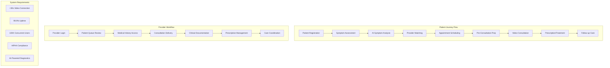
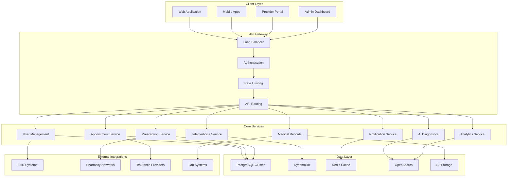
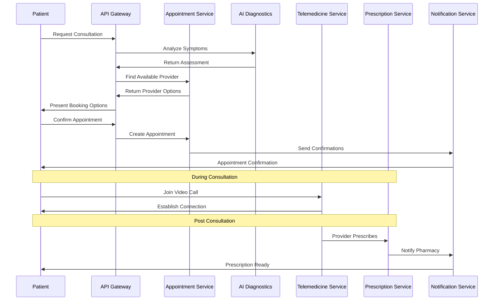
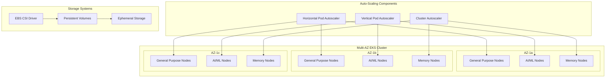
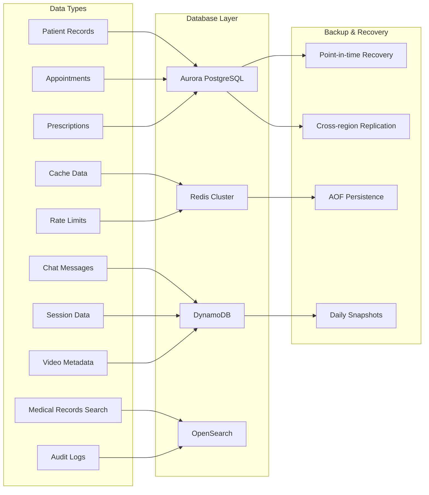
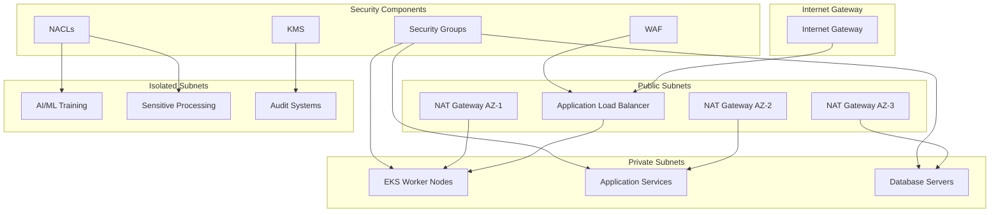
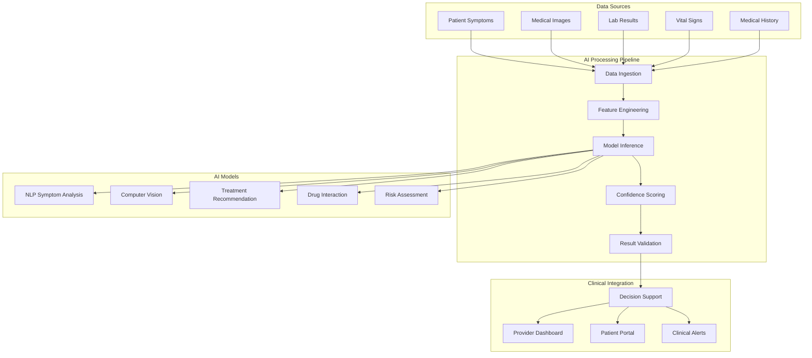
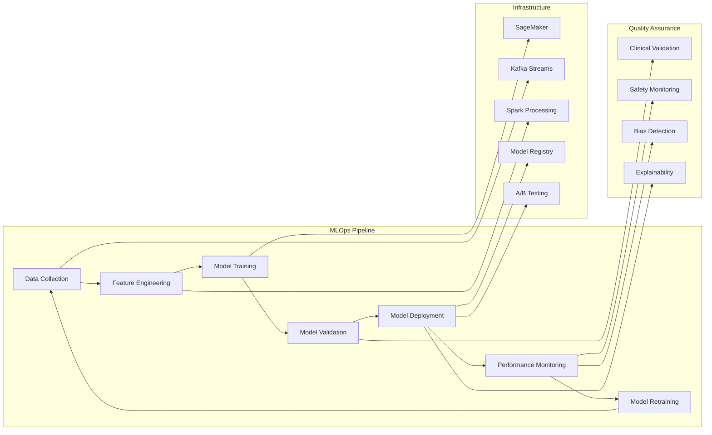
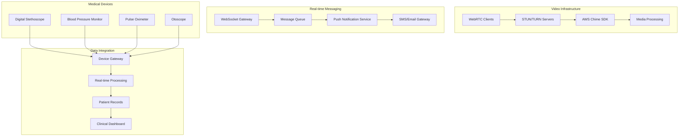
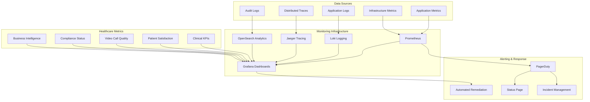

# Healthcare AI Telemedicine Platform - Comprehensive Case Study

## Executive Summary & Business Context

### Market Opportunity and Scale

The global telemedicine market is experiencing unprecedented growth, projected to reach $250 billion by 2025, driven by the COVID-19 pandemic's acceleration of digital health adoption. This comprehensive case study presents the architecture and implementation strategy for a large-scale healthcare AI telemedicine platform designed to serve 10 million patients and 100,000 healthcare providers globally, facilitating over 1 million daily consultations.

The platform addresses critical healthcare challenges including physician shortages, geographical barriers to care, and the urgent need for cost-effective healthcare delivery. With rural areas particularly underserved, our telemedicine solution bridges the gap between patients and quality healthcare providers, ensuring equitable access regardless of location.

### Problem Statement and Solution

Healthcare systems worldwide face mounting pressure from aging populations, chronic disease epidemics, and resource constraints. Traditional healthcare delivery models struggle with:

- **Access Barriers**: Geographic limitations preventing patients from reaching specialists
- **Cost Inefficiencies**: High overhead costs for physical infrastructure and in-person consultations
- **Provider Shortage**: Insufficient specialist availability in underserved regions
- **Care Coordination**: Fragmented health records and poor communication between providers
- **Diagnostic Delays**: Limited access to timely medical expertise and second opinions

Our AI-enhanced telemedicine platform provides a comprehensive solution by combining cutting-edge video communication technology with artificial intelligence for symptom analysis, medical image processing, and treatment recommendations. The platform integrates seamlessly with existing Electronic Health Record (EHR) systems, pharmacy networks, and insurance providers.

### Success Metrics and Business Impact

The platform targets ambitious performance and business metrics:

- **Patient Satisfaction**: >95% satisfaction rate with consultation quality and user experience
- **Technical Performance**: <30 seconds video connection establishment time
- **Reliability**: 99.9% platform uptime with automated failover capabilities
- **Clinical Outcomes**: 40% reduction in healthcare delivery costs while maintaining quality
- **Revenue Projections**: $2 billion projected revenue within five years of deployment

### Investment and Financial Framework

The platform development requires a $500 million investment distributed across infrastructure, development, regulatory compliance, and market penetration. This investment supports:

- **Technology Infrastructure**: $200 million for cloud infrastructure, AI model development, and security systems
- **Regulatory Compliance**: $100 million for HIPAA, FDA approvals, and international healthcare standards
- **Market Development**: $150 million for user acquisition, provider onboarding, and partnership development
- **Operations and Support**: $50 million for customer support, maintenance, and continuous improvement

### Regulatory Compliance Framework

Compliance with healthcare regulations forms the foundation of our platform design:

- **HIPAA Compliance**: Comprehensive privacy and security safeguards for Protected Health Information (PHI)
- **FDA Regulations**: Medical device software compliance for AI diagnostic tools
- **International Standards**: ISO 27001 for information security, ISO 13485 for medical device quality
- **Regional Compliance**: GDPR for European operations, local healthcare regulations for global expansion

## System Requirements & Constraints

### Functional Requirements

#### Patient-Facing Features

The platform provides comprehensive patient capabilities designed for intuitive use across all demographics and technical skill levels. Patients access services through web browsers and mobile applications, ensuring consistent experience across devices.

**Registration and Profile Management**: Streamlined patient onboarding with identity verification, insurance validation, and medical history capture. The system supports social login integration while maintaining strict security protocols for healthcare data.

**Intelligent Symptom Checker**: AI-powered symptom analysis using natural language processing to understand patient descriptions and provide preliminary assessments. The system guides patients to appropriate care levels and specialist recommendations.

**Appointment Scheduling**: Advanced scheduling system with real-time provider availability, automated matching based on symptoms and specialization, and flexible rescheduling options. Integration with provider calendars ensures accurate availability representation.

**Medical History Access**: Comprehensive view of patient medical records, test results, prescriptions, and consultation notes. Patients control data sharing permissions and can generate portable health summaries.

**Telemedicine Consultations**: High-definition video and audio consultations with screen sharing capabilities, medical device integration for vital signs collection, and secure messaging throughout the care continuum.

#### Provider Tools and Capabilities

Healthcare providers receive professional-grade tools optimized for clinical workflows and efficiency.

**Provider Dashboard**: Centralized view of patient queue, upcoming appointments, pending tasks, and clinical alerts. Customizable interface adapts to different medical specialties and workflow preferences.

**Consultation Interface**: Clinical-grade video platform with medical image viewing, electronic prescribing, clinical note templates, and integration with decision support tools.

**E-Prescribing System**: Direct integration with pharmacy networks, drug interaction checking, insurance formulary verification, and prescription tracking. Supports controlled substance prescribing where legally permitted.

**Clinical Documentation**: Voice-to-text transcription, structured data entry templates, clinical decision support integration, and automated coding suggestions for billing purposes.

#### AI and Integration Capabilities

**Medical AI Services**: Machine learning models for medical image analysis, symptom correlation, treatment recommendation engines, and clinical decision support. Models continuously improve through federated learning while maintaining patient privacy.

**EHR Integration**: FHIR-compliant interfaces for seamless integration with major Electronic Health Record systems including Epic, Cerner, and Allscripts. Bidirectional data exchange ensures comprehensive patient records.

**Pharmacy Network Integration**: Real-time connections to national pharmacy chains, independent pharmacies, and mail-order services. Prescription verification, insurance coverage checking, and delivery coordination.

**Insurance Verification**: Automated eligibility verification, prior authorization management, claims processing integration, and real-time benefit information.

### Non-Functional Requirements

#### Performance Specifications

The platform architecture prioritizes performance optimization across all user touchpoints and system operations.

**Response Time Requirements**: Web pages load within 2 seconds under normal conditions, with graceful degradation during peak usage. Video calls establish connections within 30 seconds, maintaining high-quality audio and video throughout sessions.

**Concurrent User Support**: The system supports 100,000 concurrent users during peak hours, with automatic scaling to accommodate sudden traffic spikes. Load testing validates performance under 150% expected peak capacity.

**Video Call Capacity**: Simultaneous support for 50,000 active video consultations with automatic quality adjustment based on bandwidth availability. Intelligent routing ensures optimal connection paths.

**Prescription Processing**: Capability to process and verify 1 million prescriptions daily with real-time pharmacy integration and insurance verification.

#### Scalability Architecture

**Horizontal Scaling**: Microservices architecture enables independent scaling of individual components based on demand patterns. Kubernetes orchestration provides automatic pod scaling and resource optimization.

**Database Scaling**: Multi-master database configuration with read replicas distributed globally for reduced latency. Automated sharding for high-volume data tables.

**Content Delivery**: Global CDN distribution for static assets, medical images, and cached content. Edge computing capabilities for real-time AI inference.

#### Security and Privacy Framework

**End-to-End Encryption**: All data transmission encrypted using TLS 1.3 protocols. Database encryption at rest using AES-256 with customer-managed keys.

**HIPAA Compliance**: Comprehensive Business Associate Agreements, audit logging, access controls, and breach notification procedures. Regular compliance audits and penetration testing.

**Zero-Trust Architecture**: All system access requires authentication and authorization regardless of network location. Micro-segmentation prevents lateral movement within the infrastructure.

#### Reliability and Availability

**Uptime Requirements**: 99.99% availability target with planned maintenance windows limited to 4 hours monthly during low-usage periods.

**Disaster Recovery**: Recovery Time Objective (RTO) of 15 minutes and Recovery Point Objective (RPO) of 5 minutes. Cross-region failover capabilities with automated health checking.

**Monitoring and Alerting**: Comprehensive monitoring across all system components with predictive alerting for potential issues. Mean Time to Recovery (MTTR) target of less than 5 minutes for critical system components.

## High-Level Architecture Design

### Architecture Philosophy

The Healthcare AI Telemedicine Platform embraces a cloud-native, microservices-based architecture designed for scalability, reliability, and regulatory compliance. Our architectural philosophy centers on several key principles that guide all technical decisions and implementation strategies.

**Microservices and Domain-Driven Design**: The platform decomposes complex healthcare workflows into discrete, loosely-coupled services aligned with clinical and business domains. Each microservice owns its data, implements specific business capabilities, and communicates through well-defined APIs. This approach enables independent development teams, technology diversity, and granular scaling based on usage patterns.

**API-First Development**: All system capabilities expose through RESTful APIs following OpenAPI specifications. This approach ensures consistent integration patterns, enables third-party ecosystem development, and supports future mobile and web application development without architectural changes.

**Event-Driven Communication**: Asynchronous messaging patterns using Apache Kafka enable real-time system coordination while maintaining service independence. Events capture business-significant occurrences like appointment bookings, prescription orders, and consultation completions, enabling reactive system behavior and audit trailing.

**Cloud-Native Infrastructure**: Kubernetes orchestration provides container management, service discovery, load balancing, and automated scaling. The platform leverages managed cloud services for databases, messaging, and specialized capabilities while maintaining portability across cloud providers.

**Security-First Design**: Zero-trust security model assumes breach scenarios and implements defense-in-depth strategies. Every service interaction requires authentication and authorization, with comprehensive audit logging and anomaly detection. Encryption protects data at rest and in transit using industry-standard algorithms.

**AI-Enhanced Capabilities**: Machine learning integration enhances clinical decision-making without replacing human judgment. AI models provide symptom analysis, medical image interpretation, and treatment recommendations while maintaining transparency and explainability for clinical validation.

**Interoperability Standards**: FHIR R4 compliance ensures seamless integration with existing healthcare systems. HL7 messaging standards enable real-time data exchange with Electronic Health Records, laboratory systems, and pharmacy networks.

### Core Services Architecture

#### User Management Service

The User Management Service provides centralized identity and access management for all platform participants including patients, healthcare providers, administrators, and third-party integrators.

**Identity Management**: Secure user registration with multi-factor authentication, identity verification, and role-based access control. Integration with external identity providers supports single sign-on for healthcare organizations.

**Profile Management**: Comprehensive user profile management including personal information, professional credentials for providers, specialty certifications, and communication preferences.

**Access Control**: Fine-grained permission management enabling precise control over data access and system capabilities. Dynamic role assignment based on organizational affiliations and clinical privileges.

#### Appointment Service

The Appointment Service orchestrates complex scheduling workflows while maintaining real-time availability synchronization across multiple providers and time zones.

**Availability Management**: Real-time provider calendar integration with automatic conflict resolution and buffer time management. Support for recurring availability patterns and special scheduling rules.

**Intelligent Matching**: AI-powered matching algorithm considering patient symptoms, provider specializations, language preferences, and geographical constraints. Load balancing across providers to optimize utilization.

**Notification and Reminders**: Automated reminder system using multiple channels including SMS, email, and push notifications. Configurable reminder schedules based on appointment types and patient preferences.

#### Telemedicine Service

The Telemedicine Service provides high-quality video and audio communication optimized for medical consultations with integrated clinical tools.

**Video Infrastructure**: WebRTC-based peer-to-peer connections with fallback to relay servers for challenging network conditions. Adaptive bitrate streaming maintains quality across varying bandwidth conditions.

**Session Management**: Secure session establishment with end-to-end encryption, session recording for compliance purposes, and automated session quality monitoring.

**Clinical Tools Integration**: Screen sharing for medical image review, virtual whiteboard for patient education, and integration with medical device data streams for real-time vital sign monitoring.

#### AI Diagnostics Service

The AI Diagnostics Service leverages machine learning models to assist clinical decision-making while maintaining human oversight and explainability.

**Symptom Analysis Engine**: Natural language processing analyzes patient-reported symptoms, generating differential diagnoses and recommending appropriate care levels. Integration with medical knowledge bases ensures current clinical guidelines.

**Medical Image Analysis**: Computer vision models analyze radiological images, dermatological photos, and other medical imagery to identify potential abnormalities and assist diagnostic workflows.

**Treatment Recommendation System**: Evidence-based treatment recommendation engine considering patient history, current symptoms, drug allergies, and clinical best practices. Integration with pharmaceutical databases ensures medication safety.

#### Prescription Service

The Prescription Service manages electronic prescribing workflows with comprehensive safety checking and pharmacy integration.

**E-Prescribing Workflow**: NCPDP SCRIPT standard implementation for electronic prescription transmission to pharmacies. Support for controlled substance prescribing where legally permitted.

**Safety Checking**: Comprehensive drug interaction checking, allergy verification, and dosage validation based on patient demographics and medical history.

**Insurance Integration**: Real-time insurance formulary checking, prior authorization management, and cost estimation to optimize patient affordability.

#### Medical Records Service

The Medical Records Service provides secure, FHIR-compliant storage and retrieval of patient health information with comprehensive audit trails.

**Document Management**: Secure storage of medical documents, test results, and imaging studies with automated metadata extraction and categorization.

**Data Integration**: Bidirectional integration with major EHR systems enabling seamless data exchange while maintaining data provenance and audit trails.

**Patient Data Control**: Patient-controlled data sharing with granular permissions enabling selective information sharing with healthcare providers.

## Infrastructure & Container Architecture

### EKS Cluster Design and Implementation

The Amazon Elastic Kubernetes Service (EKS) cluster forms the core orchestration platform for our microservices architecture, providing automated scaling, service discovery, and container lifecycle management across multiple availability zones.

#### Multi-Availability Zone Configuration

Our EKS cluster spans three availability zones within each AWS region to ensure high availability and fault tolerance. This configuration protects against single point of failure scenarios while providing optimal latency for end users.

**Primary Region Setup**: The primary cluster operates in US-East-1 with nodes distributed across us-east-1a, us-east-1b, and us-east-1c availability zones. Each zone maintains independent networking and storage resources while participating in the unified Kubernetes control plane.

**Node Group Segmentation**: Dedicated node groups optimize resource utilization and cost efficiency by matching workload requirements with appropriate instance types.

- **General Purpose Nodes**: c5.2xlarge instances handle standard web services, API gateways, and business logic microservices. These nodes provide 8 vCPUs and 16 GB RAM optimized for CPU-intensive workloads with moderate memory requirements.

- **AI/ML Workload Nodes**: g4dn.2xlarge instances equipped with NVIDIA T4 GPUs accelerate machine learning inference, medical image analysis, and natural language processing tasks. GPU-optimized nodes ensure low-latency AI model serving.

- **Memory-Intensive Nodes**: r5.large instances support databases, caching layers, and in-memory processing workloads requiring high memory-to-CPU ratios.

**Auto-Scaling Configuration**: Kubernetes Horizontal Pod Autoscaler (HPA) monitors CPU and memory utilization metrics, automatically scaling pod replicas based on demand. Vertical Pod Autoscaler (VPA) optimizes resource requests and limits for individual containers. Cluster Autoscaler manages node group sizing, adding or removing nodes based on pod scheduling requirements.

**Security Hardening**: Role-Based Access Control (RBAC) implements fine-grained permissions for service accounts, users, and external integrators. Pod Security Standards enforce security policies including non-root containers, read-only file systems, and restricted privilege escalation. Network policies provide micro-segmentation between services and namespaces.

**Storage Integration**: Container Storage Interface (CSI) drivers enable persistent storage for stateful applications. EBS CSI driver provides high-performance block storage for databases and file systems. Ephemeral storage handles temporary data, logs, and container image layers.

### Database Architecture and Data Management

The platform employs a polyglot persistence strategy, selecting optimal database technologies for specific use cases while maintaining ACID compliance and data consistency across service boundaries.

#### Aurora PostgreSQL Primary Database

Amazon Aurora PostgreSQL serves as the primary relational database for structured healthcare data requiring strong consistency and complex querying capabilities.

**Cluster Configuration**: Multi-master setup with three writer instances distributed across availability zones enables high availability and automatic failover. Read replicas in each region reduce query latency and distribute read workloads.

**Data Schema Design**: Patient records, appointment information, provider profiles, and prescription data utilize normalized relational schemas optimized for healthcare workflows. Foreign key relationships maintain referential integrity while enabling efficient JOIN operations.

**Backup and Recovery**: Automated daily backups with point-in-time recovery capabilities. Cross-region backup replication ensures disaster recovery capabilities with 99.999% durability guarantee.

**Performance Optimization**: Database parameter groups tuned for healthcare workloads with optimized connection pooling, query optimization, and memory allocation. Intelligent proxy routing distributes queries between writer and reader instances.

#### DynamoDB NoSQL Storage

Amazon DynamoDB provides low-latency, highly scalable storage for real-time application data and messaging systems.

**Table Design**: Chat messages, push notifications, session data, and video call metadata utilize single-table design patterns optimized for access patterns. Global Secondary Indexes (GSI) support complex query requirements.

**Auto-Scaling**: On-demand billing mode automatically scales read and write capacity based on traffic patterns. Predictable workloads utilize provisioned capacity with auto-scaling policies.

**Global Tables**: Multi-region replication ensures low-latency access for global users while maintaining eventual consistency across regions.

#### Redis Cluster Caching

Redis Cluster provides high-performance in-memory caching and session storage with sub-millisecond latency requirements.

**Cluster Configuration**: Six-node cluster with three master nodes and three replica nodes distributed across availability zones. Automatic failover and data sharding ensure high availability.

**Use Cases**: Session caching reduces database load, rate limiting protects against abuse, real-time data supports live dashboards, and prescription lookups accelerate e-prescribing workflows.

**Data Persistence**: AOF (Append Only File) persistence with fsync every second balances performance and durability. Daily backups to S3 provide disaster recovery capabilities.

#### OpenSearch Analytics Platform

Amazon OpenSearch Service enables full-text search, log analytics, and real-time monitoring across platform operations.

**Index Design**: Medical records search indexes support clinical terminology and natural language queries. Audit logs maintain immutable records for compliance reporting. System metrics and application logs enable operational monitoring.

**Performance Tuning**: Dedicated master nodes ensure cluster stability during high-indexing periods. Hot-warm-cold architecture optimizes storage costs while maintaining query performance.

**Security Integration**: Fine-grained access control with integration to AWS IAM and Active Directory. Field-level security protects sensitive PHI data based on user roles.

### Networking and Security Infrastructure

#### Virtual Private Cloud (VPC) Design

The network architecture implements defense-in-depth security principles with multiple isolation layers and comprehensive monitoring.

**Subnet Strategy**: 
- **Private Subnets**: Database servers, application containers, and sensitive processing workloads operate in private subnets without direct internet access.
- **Public Subnets**: Load balancers, NAT gateways, and bastion hosts occupy public subnets with restricted inbound access rules.
- **Isolated Subnets**: AI/ML training workloads and sensitive data processing utilize completely isolated subnets with no internet connectivity.

**Network Address Translation**: NAT Gateways in each availability zone enable outbound internet access for private subnet resources while preventing inbound connections. High availability NAT configuration ensures continued connectivity during gateway failures.

#### Load Balancing and Traffic Management

**Application Load Balancer (ALB)**: Layer 7 load balancing with SSL termination, health checks, and advanced routing capabilities. Host-based and path-based routing directs traffic to appropriate microservices.

**Health Check Configuration**: Comprehensive health checks monitor application responsiveness, database connectivity, and dependent service availability. Automatic traffic routing around unhealthy instances ensures service continuity.

**SSL/TLS Management**: AWS Certificate Manager provides automated SSL certificate provisioning, renewal, and deployment. TLS 1.3 encryption ensures strong security for all client connections.

#### Web Application Firewall (WAF)

AWS WAF protects against common web exploits and application-layer attacks while maintaining healthcare application functionality.

**Security Rules**: SQL injection prevention, cross-site scripting (XSS) protection, and malicious bot detection. Custom rules block suspicious patterns specific to healthcare applications.

**Rate Limiting**: API rate limiting prevents abuse and ensures fair resource allocation across users. Dynamic rate limiting adjusts thresholds based on user behavior patterns.

**Geo-Blocking**: Geographic restrictions block traffic from high-risk countries while allowing legitimate international users through approval workflows.

#### Encryption and Key Management

**Data Encryption**: All data encrypted at rest using AES-256 encryption with customer-managed keys. Database encryption, object storage encryption, and EBS volume encryption ensure comprehensive data protection.

**Key Management Service (KMS)**: Customer-managed keys with automatic rotation policies and comprehensive audit logging. Separate keys for different data classification levels enable granular access control.

**Transit Encryption**: TLS 1.3 for all external communications and internal service-to-service communication. Certificate pinning prevents man-in-the-middle attacks.

## AI/ML Integration & Data Pipeline

### Medical AI Models and Clinical Decision Support

The platform integrates sophisticated artificial intelligence models specifically designed for healthcare applications, enhancing clinical decision-making while maintaining physician oversight and patient safety.

#### Intelligent Symptom Analysis Engine

Our natural language processing system analyzes patient-reported symptoms, medical history, and demographic information to generate preliminary assessments and care recommendations.

**NLP Model Architecture**: Transformer-based language models fine-tuned on medical literature, clinical notes, and symptom databases. The model processes unstructured text input and maps symptoms to ICD-10 codes and differential diagnoses.

**Knowledge Base Integration**: Real-time integration with medical knowledge bases including UpToDate, medical textbooks, and clinical practice guidelines. Knowledge graphs connect symptoms, diseases, treatments, and contraindications.

**Confidence Scoring**: Probabilistic assessments accompany all AI recommendations, enabling healthcare providers to understand model certainty and make informed decisions about AI suggestions.

**Bias Detection and Mitigation**: Continuous monitoring for demographic bias in symptom assessment. Diverse training datasets and fairness constraints ensure equitable healthcare AI across all patient populations.

#### Advanced Medical Imaging Analysis

Computer vision models assist radiologists and specialists in analyzing medical images while maintaining human oversight for all diagnostic decisions.

**Convolutional Neural Networks**: Deep learning models trained on millions of medical images including X-rays, CT scans, MRI images, and dermatological photographs. Models detect abnormalities, measure structures, and flag urgent findings.

**Multi-Modal Fusion**: Integration of imaging data with patient clinical history, laboratory results, and vital signs provides comprehensive analysis context. Attention mechanisms highlight relevant image regions.

**Quality Assurance**: Automated image quality assessment ensures diagnostic-grade input before AI analysis. Poor quality images trigger automatic retake requests or manual review flags.

**Regulatory Compliance**: FDA 510(k) cleared algorithms for specific imaging applications. Comprehensive validation studies demonstrate equivalent or superior performance compared to human specialists.

#### Evidence-Based Treatment Recommendations

Clinical decision support system combines rule-based algorithms with machine learning to suggest appropriate treatments while considering patient-specific factors.

**Clinical Guidelines Integration**: Automated implementation of evidence-based clinical practice guidelines from medical societies and healthcare organizations. Guidelines update automatically as new evidence emerges.

**Personalization Engine**: Machine learning models consider patient demographics, medical history, allergies, current medications, and social determinants of health to personalize treatment recommendations.

**Drug Interaction Analysis**: Comprehensive medication interaction checking using pharmaceutical databases and machine learning models trained on adverse event reports. Real-time alerts prevent dangerous drug combinations.

**Outcome Prediction**: Predictive models estimate treatment success probability, potential side effects, and recovery timelines based on similar patient cohorts and historical outcomes.

### Machine Learning Operations (MLOps) Infrastructure

Robust MLOps practices ensure reliable, scalable, and compliant deployment of AI models in clinical environments.

#### Data Pipeline Architecture

**Real-Time Streaming**: Apache Kafka streams process patient data, clinical events, and system metrics in real-time. Stream processing enables immediate AI inference and real-time clinical alerts.

**Batch Processing**: Apache Spark handles large-scale data processing for model training, feature engineering, and historical analysis. Distributed computing ensures scalable processing of healthcare datasets.

**Data Quality Monitoring**: Automated data validation ensures input data quality and consistency. Anomaly detection identifies data drift, missing values, and inconsistent formats before model inference.

**Feature Engineering**: Automated feature extraction from raw healthcare data including natural language processing of clinical notes, time-series analysis of vital signs, and image feature extraction.

#### Model Training and Deployment Pipeline

**SageMaker Integration**: Amazon SageMaker provides managed machine learning infrastructure for distributed model training, hyperparameter optimization, and model evaluation.

**Automated Training**: Scheduled retraining pipelines ensure models remain current with evolving medical knowledge and patient populations. Federated learning techniques enable model improvement while maintaining patient privacy.

**Model Versioning**: Comprehensive model registry tracks model versions, training datasets, performance metrics, and deployment status. Rollback capabilities enable quick reversion to previous model versions.

**A/B Testing Framework**: Controlled experiments compare model versions in production environments while maintaining patient safety. Statistical significance testing determines optimal model selection.

**Performance Monitoring**: Real-time monitoring of model performance, prediction accuracy, and clinical outcomes. Drift detection algorithms identify when model retraining becomes necessary.

#### Clinical Validation and Safety

**Clinical Studies**: Prospective studies validate AI model performance in real clinical environments. Institutional Review Board (IRB) approval ensures ethical research practices and patient protection.

**Explainable AI**: Model interpretability techniques provide clinical reasoning explanations for AI recommendations. LIME and SHAP algorithms highlight important features influencing predictions.

**Safety Monitoring**: Continuous monitoring for adverse events potentially related to AI recommendations. Rapid response protocols enable immediate model suspension if safety concerns arise.

**Human-in-the-Loop**: All AI recommendations require human physician review and approval. AI serves as clinical decision support rather than autonomous diagnosis or treatment.

## DevOps & Deployment Strategy

### Infrastructure as Code (IaC)

Automated infrastructure provisioning ensures consistent, repeatable deployments while reducing human error and deployment time.

#### Terraform Implementation

**Modular Architecture**: Reusable Terraform modules for common infrastructure patterns including VPC setup, EKS clusters, database configurations, and security groups. Module versioning enables controlled infrastructure updates.

**Environment Management**: Separate Terraform workspaces for development, staging, and production environments. Environment-specific variable files customize configurations while maintaining consistent architecture.

**State Management**: Remote state storage in encrypted S3 buckets with DynamoDB locking prevents concurrent modifications. State backup and recovery procedures protect against data loss.

**Compliance Integration**: Terraform configurations embed security and compliance requirements ensuring all infrastructure meets healthcare regulatory standards.

#### GitOps Deployment Pipeline

**ArgoCD Implementation**: GitOps workflow automatically deploys application changes based on Git repository updates. Declarative configuration management ensures deployment consistency.

**Configuration Drift Detection**: Continuous monitoring identifies differences between desired and actual system state. Automatic remediation capabilities restore systems to desired configuration.

**Rollback Capabilities**: Automated rollback procedures enable rapid reversion to previous working configurations. Canary deployments minimize risk during updates.

**Multi-Environment Promotion**: Automated promotion pipeline advances changes through development, staging, and production environments based on testing results and approval workflows.

### Continuous Integration and Deployment

#### CI/CD Pipeline Architecture

**GitHub Actions Integration**: Automated testing, security scanning, and deployment workflows triggered by code commits. Parallel execution optimizes pipeline performance.

**Testing Strategy**: Comprehensive testing including unit tests, integration tests, security scans, and performance validation. Healthcare-specific compliance testing ensures regulatory adherence.

**Security Integration**: Static Application Security Testing (SAST) and Dynamic Application Security Testing (DAST) integrated into CI/CD pipeline. Container vulnerability scanning prevents deployment of insecure images.

**Deployment Strategies**: Blue-green deployments enable zero-downtime updates with immediate rollback capabilities. Canary releases gradually introduce changes while monitoring for issues.

#### Quality Assurance Framework

**Automated Testing**: Comprehensive test suites including unit tests, integration tests, end-to-end testing, and performance validation. Healthcare workflow testing ensures clinical functionality.

**Security Validation**: Automated security scanning identifies vulnerabilities, misconfigurations, and compliance violations before deployment. Penetration testing validates security controls.

**Performance Testing**: Load testing simulates production traffic patterns ensuring system performance under stress. Capacity planning prevents performance degradation during peak usage.

**Compliance Validation**: Automated HIPAA compliance checking, audit trail validation, and regulatory requirement verification. Manual compliance reviews supplement automated testing.

## Operational Excellence & Future Roadmap

### Day-2 Operations

Ongoing operational procedures ensure platform reliability, security, and continuous improvement after initial deployment.

#### Incident Response and Management

**24/7 Operations Center**: Global follow-the-sun support model provides continuous monitoring and rapid incident response. Specialized healthcare operations teams understand clinical workflow requirements.

**Automated Response**: Intelligent automation handles routine incidents including service restarts, resource scaling, and basic troubleshooting. Human intervention reserved for complex issues requiring clinical knowledge.

**Escalation Procedures**: Tiered escalation ensures appropriate expertise responds to incidents based on severity and impact. Direct communication channels with clinical leadership for patient-impacting issues.

**Root Cause Analysis**: Systematic investigation of incidents identifies underlying causes and prevents recurrence. Lessons learned integrate into platform improvements and operational procedures.

#### Capacity Planning and Resource Management

**Growth Projections**: Mathematical models predict user growth, consultation volume, and resource requirements based on market penetration and seasonal patterns. Proactive capacity planning prevents performance issues.

**Resource Optimization**: Continuous right-sizing of infrastructure resources balances performance with cost efficiency. Automated recommendations identify optimization opportunities.

**Cost Management**: Detailed cost allocation tracking enables optimization across services and departments. Reserved instance purchasing and spot instance utilization reduce operational costs.

**Performance Baselines**: Established performance benchmarks enable detection of gradual degradation and capacity constraints. Trend analysis identifies optimization opportunities.

#### Disaster Recovery and Business Continuity

**Multi-Region Architecture**: Active-active deployment across multiple AWS regions ensures service continuity during regional outages. Cross-region data replication maintains data consistency.

**Backup and Recovery**: Automated backup procedures with tested recovery processes ensure data protection. Regular disaster recovery drills validate recovery procedures and timing.

**Business Continuity Planning**: Comprehensive procedures maintain critical healthcare services during various disruption scenarios. Emergency communication plans ensure stakeholder coordination.

**Regulatory Compliance**: Disaster recovery procedures comply with healthcare regulations requiring specific recovery timeframes and data protection measures.

### Future Enhancements and Innovation Pipeline

#### Advanced AI and Machine Learning

**Federated Learning**: Collaborative machine learning enables model improvement across healthcare organizations while maintaining patient privacy. Differential privacy techniques protect individual patient data.

**Edge AI Deployment**: Local processing capabilities reduce latency for real-time AI inference. Edge computing enables functionality in low-connectivity environments.

**Personalized Medicine**: AI models consider genetic information, lifestyle factors, and environmental data to provide personalized treatment recommendations. Integration with genomic databases enhances precision medicine.

**Predictive Health Analytics**: Machine learning models predict health deterioration, disease outbreaks, and population health trends. Early intervention capabilities improve patient outcomes.

#### Integration Expansion

**Wearable Device Integration**: Continuous health monitoring through smartwatches, fitness trackers, and medical-grade wearables. Real-time health data enables proactive care management.

**Home Monitoring Systems**: Integration with home health monitoring devices including blood glucose monitors, blood pressure cuffs, and medication adherence systems.

**Chronic Care Management**: Specialized workflows for managing chronic conditions including diabetes, hypertension, and heart disease. Automated care plan adjustments based on patient data.

**Social Determinants Integration**: Incorporation of social, economic, and environmental factors into health assessments and treatment planning. Community resource integration supports comprehensive care.

#### Global Scaling and Localization

**International Expansion**: Additional regional deployments supporting local healthcare regulations and language requirements. Cultural adaptation of user interfaces and clinical workflows.

**Regulatory Compliance**: Adaptation to international healthcare regulations including GDPR, Health Canada requirements, and country-specific medical device regulations.

**Language Localization**: Multi-language support for patient interfaces, provider tools, and clinical documentation. Real-time translation capabilities for cross-language consultations.

**Currency and Payment Integration**: Support for international payment systems, insurance networks, and healthcare financing models.

#### Innovation Technologies

**Voice AI Integration**: Natural language processing for voice-controlled interfaces, automated clinical documentation, and verbal symptom assessment. Hands-free operation improves clinical workflow efficiency.

**Augmented Reality Consultations**: AR technology enables enhanced remote physical examinations, procedural guidance, and medical education. 3D visualization improves diagnostic capabilities.

**Virtual Reality Therapy**: VR applications for pain management, mental health therapy, and rehabilitation programs. Immersive experiences enhance treatment effectiveness.

**Blockchain Integration**: Distributed ledger technology for secure medical record sharing, pharmaceutical supply chain verification, and research data integrity. Patient-controlled data sharing enhances privacy.

### Platform Evolution Strategy

#### Technology Roadmap

**Quantum Computing Preparation**: Research into quantum computing applications for drug discovery, genetic analysis, and complex medical simulations. Quantum-resistant cryptography preparation.

**5G Network Optimization**: Enhanced mobile capabilities leveraging 5G networks for ultra-low latency video consultations and real-time medical device connectivity.

**Microservices Evolution**: Service mesh implementation for enhanced observability, security, and traffic management. Eventual migration to serverless architectures for specific workloads.

**AI Ethics Framework**: Comprehensive ethical guidelines for AI development and deployment in healthcare settings. Bias detection and mitigation strategies ensure equitable healthcare delivery.

#### Market Expansion Strategy

**Specialty Care Integration**: Expansion into specialized medical fields including mental health, dermatology, ophthalmology, and pediatrics. Specialty-specific workflows and AI models.

**Enterprise Solutions**: White-label platform offerings for healthcare organizations, employers, and insurance companies. Customizable branding and workflow integration.

**Research Platform**: Academic and pharmaceutical research capabilities including clinical trial management, data collection, and outcome tracking. Research-grade data analytics and reporting.

**Public Health Integration**: Population health monitoring, disease surveillance, and public health emergency response capabilities. Integration with government health agencies and emergency services.

## Conclusion

The Healthcare AI Telemedicine Platform represents a comprehensive solution addressing critical challenges in modern healthcare delivery. Through careful architectural design, robust security implementation, and innovative AI integration, the platform enables scalable, secure, and effective virtual healthcare services.

Key architectural principles including microservices design, cloud-native infrastructure, and comprehensive observability ensure the platform can scale to serve millions of patients while maintaining high availability and performance standards. The security-first approach with end-to-end encryption, comprehensive access controls, and regulatory compliance frameworks protects sensitive healthcare data while enabling seamless clinical workflows.

AI integration enhances clinical decision-making through symptom analysis, medical imaging interpretation, and treatment recommendations while maintaining human oversight and clinical validation. The platform's modular architecture enables continuous innovation and feature expansion without disrupting core healthcare services.

Operational excellence through comprehensive monitoring, automated incident response, and continuous improvement processes ensures reliable service delivery. The future roadmap incorporating advanced technologies, global expansion, and innovative healthcare applications positions the platform for long-term success in the evolving healthcare landscape.

This architectural framework provides a solid foundation for building a world-class telemedicine platform capable of transforming healthcare delivery, improving patient outcomes, and reducing healthcare costs while maintaining the highest standards of security, compliance, and clinical quality.

## Real-Time Communication Systems

### Video and Audio Infrastructure

High-quality video and audio communication forms the foundation of effective telemedicine consultations, requiring robust infrastructure optimized for medical use cases.

#### WebRTC Implementation for Medical Consultations

WebRTC (Web Real-Time Communication) provides peer-to-peer video and audio connections optimized for low latency and high reliability in healthcare environments.

**Optimized Connection Establishment**: STUN (Session Traversal Utilities for NAT) and TURN (Traversal Using Relays around NAT) servers ensure reliable connection establishment across various network configurations. Multiple TURN servers distributed globally provide backup connectivity options.

**Medical-Grade Quality**: Video quality optimization prioritizes clarity for visual examination over compression. Automatic resolution adjustment maintains quality while adapting to bandwidth constraints. Audio processing emphasizes speech clarity for accurate patient communication.

**Network Resilience**: Adaptive bitrate streaming adjusts quality based on real-time network conditions. Packet loss recovery algorithms maintain connection stability during network interruptions. Bandwidth estimation prevents connection drops during varying network conditions.

**Security Implementation**: End-to-end encryption using DTLS (Datagram Transport Layer Security) ensures HIPAA compliance. Identity verification prevents unauthorized access to video consultations. Session recording encryption protects stored consultation videos.

#### AWS Chime SDK Integration

Amazon Chime SDK provides scalable video infrastructure with enterprise-grade reliability and healthcare-specific features.

**Scalable Video Infrastructure**: Cloud-based video processing supports thousands of simultaneous consultations without quality degradation. Automatic scaling adjusts capacity based on demand patterns.

**Recording and Transcription**: Automated consultation recording with secure storage in compliance with healthcare regulations. Real-time transcription provides consultation notes and improves accessibility for hearing-impaired patients.

**Mobile Optimization**: Native iOS and Android SDKs provide consistent experience across devices. Battery optimization ensures extended consultation capabilities on mobile devices. Background processing maintains connections during brief app interruptions.

**Quality Monitoring**: Real-time quality metrics monitor audio/video performance, network conditions, and user experience. Automated alerts notify technical teams of quality issues requiring intervention.

### Messaging and Real-Time Notifications

#### WebSocket Communication Architecture

Real-time messaging capabilities support secure communication between patients and providers throughout the care continuum.

**Persistent Connections**: WebSocket connections maintain real-time communication channels with automatic reconnection handling. Connection pooling optimizes server resources while maintaining responsive messaging.

**Message Delivery Guarantees**: At-least-once delivery ensures critical messages reach recipients. Message acknowledgment tracking confirms successful delivery. Retry mechanisms handle temporary connectivity issues.

**Chat Features**: Typing indicators provide real-time conversation feedback. Message status tracking (sent, delivered, read) ensures communication clarity. File attachment support enables secure document sharing.

**Encryption and Security**: End-to-end encryption protects all messages using industry-standard algorithms. Message retention policies comply with healthcare record-keeping requirements. Access controls prevent unauthorized message access.

#### Push Notification System

Multi-channel notification system ensures timely communication across all patient touchpoints.

**Firebase Integration**: Cross-platform push notifications support iOS and Android devices with high delivery rates. Notification personalization based on user preferences and clinical urgency.

**Notification Types**: Appointment reminders, prescription ready alerts, test result notifications, and emergency communications. Smart scheduling prevents notification fatigue while ensuring critical messages reach patients.

**Delivery Optimization**: Intelligent delivery timing based on user time zones and activity patterns. Fallback mechanisms use SMS and email when push notifications fail.

**Compliance Considerations**: Notification content filtering prevents PHI exposure in notification previews. Opt-out mechanisms respect patient communication preferences while maintaining essential safety communications.

### Medical Device Integration

#### IoT Device Connectivity

Integration with medical devices enables real-time vital sign monitoring and automated data collection during telemedicine consultations.

**Supported Device Types**: Digital stethoscopes, otoscopes, blood pressure monitors, pulse oximeters, and thermometers. Bluetooth and Wi-Fi connectivity options accommodate various device capabilities.

**Real-Time Data Streaming**: Vital signs stream directly into consultation interfaces without manual data entry. Automated quality checks ensure measurement accuracy and flag anomalous readings.

**Device Authentication**: Secure device pairing prevents unauthorized connections. Device certificates ensure authenticity and prevent malicious device connections.

**Data Integration**: Automatic integration with patient records eliminates transcription errors. Trend analysis provides historical context for current measurements.

#### Device Management Platform

**Device Registration**: Centralized device inventory with tracking of device assignments, calibration status, and maintenance schedules. Automated device discovery simplifies setup processes.

**Firmware Management**: Over-the-air firmware updates ensure devices remain current with security patches and feature improvements. Staged rollouts prevent widespread device issues.

**Monitoring and Alerts**: Device health monitoring detects connectivity issues, battery levels, and calibration needs. Proactive alerts prevent device failures during critical consultations.

**Compliance Integration**: Device data automatically integrates with clinical workflows and documentation systems. Audit trails track device usage for regulatory compliance.

## Security Architecture & Compliance

### Identity and Access Management

Comprehensive identity management ensures secure access while supporting complex healthcare organizational structures and regulatory requirements.

#### Multi-Factor Authentication Framework

Robust authentication mechanisms protect against unauthorized access while maintaining usability for healthcare workflows.

**Authentication Methods**: SMS-based verification, email tokens, authenticator applications (Google Authenticator, Authy), and biometric authentication options. Risk-based authentication adjusts requirements based on access patterns and device trust levels.

**Adaptive Authentication**: Machine learning algorithms analyze login patterns, device characteristics, and geographic locations to identify suspicious access attempts. Step-up authentication requires additional verification for high-risk scenarios.

**Backup Authentication**: Multiple authentication method registration prevents account lockout scenarios. Emergency access codes enable account recovery during authenticator device loss.

**Compliance Integration**: Authentication logs provide comprehensive audit trails for regulatory compliance. Session management prevents concurrent logins from different locations without approval.

#### Role-Based Access Control (RBAC)

Granular permission system supports complex healthcare organizational hierarchies and clinical specializations.

**Healthcare Roles**: Patient, Primary Care Physician, Specialist, Nurse Practitioner, Pharmacist, Administrator, and Audit roles with specific permission sets. Custom roles support organizational-specific requirements.

**Permission Granularity**: Permissions control access to specific data types, patient populations, administrative functions, and system features. Time-based permissions support temporary access grants and shift-based restrictions.

**Hierarchical Permissions**: Department-based access controls align with hospital organizational structures. Delegation capabilities allow senior physicians to grant temporary access to colleagues.

**Emergency Access**: Break-glass procedures provide emergency access to critical patient information during urgent situations. All emergency access triggers immediate audit alerts and requires post-incident justification.

#### Single Sign-On (SSO) Integration

Seamless integration with existing healthcare organization identity providers reduces password fatigue while maintaining security.

**Protocol Support**: SAML 2.0, OAuth 2.0, and OpenID Connect protocols support integration with major identity providers including Active Directory, Okta, and Auth0.

**Provider Federation**: Multi-organization federation enables cross-institutional consultation while maintaining separate identity management. Trust relationships define data sharing permissions between organizations.

**Session Management**: Unified session management across integrated applications prevents repeated authentication requirements. Session timeout policies balance security with clinical workflow efficiency.

**Audit Integration**: SSO access logs integrate with organizational audit systems providing comprehensive access tracking across all connected applications.

### Data Protection and Privacy

#### Comprehensive Encryption Strategy

Multi-layered encryption protects patient data throughout its entire lifecycle from creation to deletion.

**Encryption at Rest**: AES-256 encryption protects all stored data including databases, file systems, and backup storage. Customer-managed encryption keys provide organizational control over data access.

**Encryption in Transit**: TLS 1.3 protocols encrypt all data transmission between clients and servers. Internal service communication utilizes mutual TLS authentication and encryption.

**Application-Level Encryption**: Field-level encryption provides additional protection for highly sensitive data such as Social Security numbers and genetic information. Tokenization replaces sensitive data with non-sensitive equivalents.

**Key Rotation**: Automated key rotation policies ensure encryption keys change regularly without service interruption. Emergency key rotation procedures enable rapid response to potential key compromise.

#### Patient Data Privacy Controls

**Consent Management**: Granular consent tracking enables patients to control how their data is used for treatment, research, and analytics. Consent withdrawal mechanisms respect patient privacy preferences.

**Data Minimization**: Access controls ensure users only access minimum necessary patient information for their specific role and responsibilities. Data masking protects sensitive information from unauthorized viewing.

**Audit Logging**: Comprehensive audit trails track all access to patient data including user identity, access time, data accessed, and actions performed. Immutable logs prevent tampering or deletion.

**Right to Deletion**: Secure data deletion processes ensure complete removal of patient data upon request while maintaining required healthcare records for legal compliance.

#### Compliance Framework Implementation

**HIPAA Compliance**: Business Associate Agreements (BAA) with all vendors and contractors. Regular compliance audits and staff training ensure ongoing HIPAA adherence.

**Risk Assessment**: Annual security risk assessments identify potential vulnerabilities and implement corrective actions. Continuous monitoring detects new risks and security threats.

**Incident Response**: Documented incident response procedures ensure rapid detection, containment, and reporting of security breaches. Breach notification procedures comply with legal requirements.

**Data Classification**: Automated data classification identifies and tags PHI, enabling appropriate security controls and access restrictions based on data sensitivity.

## Monitoring & Observability

### Comprehensive Monitoring Stack

End-to-end observability ensures system reliability, performance optimization, and proactive issue detection across all platform components.

#### Metrics and Performance Monitoring

**Prometheus Integration**: Time-series metrics collection provides detailed insights into system performance, resource utilization, and application behavior. Custom healthcare metrics track clinical KPIs and patient experience indicators.

**Service Level Indicators (SLI)**: Carefully selected metrics measure user experience including page load times, video call quality, appointment booking success rates, and prescription processing times.

**Service Level Objectives (SLO)**: Quantitative targets define acceptable performance levels including 99.9% uptime, <2 second page loads, and <30 second video call connections.

**Alerting Framework**: Multi-tier alerting system escalates issues based on severity and business impact. Alert fatigue reduction techniques ensure critical alerts receive immediate attention.

#### Distributed Tracing and Logging

**Jaeger Implementation**: Distributed tracing tracks requests across microservices enabling rapid root cause analysis for performance issues and errors. Request correlation provides end-to-end visibility.

**Centralized Logging**: Loki aggregates logs from all system components providing unified search and analysis capabilities. Structured logging enables automated parsing and correlation.

**Log Analytics**: OpenSearch enables complex log analysis including security event correlation, usage pattern analysis, and compliance reporting. Real-time alerting identifies suspicious activities.

**Correlation Analysis**: Automated correlation between metrics, traces, and logs accelerates troubleshooting and reduces mean time to resolution (MTTR).

#### Healthcare-Specific Monitoring

**Clinical Metrics**: Patient satisfaction scores, consultation completion rates, diagnosis accuracy metrics, and treatment outcome tracking. Real-time dashboards provide clinical leadership visibility.

**Compliance Monitoring**: Automated HIPAA audit trail analysis, access pattern monitoring, and regulatory compliance reporting. Proactive compliance alerts prevent violations.

**Quality Assurance**: Video call quality metrics, audio clarity measurements, and user experience scoring. Automated quality alerts trigger immediate resolution workflows.

**Business Intelligence**: Revenue tracking, provider utilization metrics, patient acquisition costs, and market penetration analysis. Executive dashboards provide strategic insights.

### Incident Response and Management

#### Automated Incident Detection

**Anomaly Detection**: Machine learning algorithms identify unusual patterns in system behavior, user activity, and clinical metrics. Predictive alerting prevents issues before patient impact.

**Health Check Automation**: Synthetic monitoring simulates patient and provider workflows identifying issues before real users encounter problems. Geographic health checks ensure global service availability.

**Cascade Failure Prevention**: Circuit breaker patterns prevent service failures from cascading throughout the system. Graceful degradation maintains core functionality during partial outages.

**Predictive Analytics**: Historical data analysis predicts potential system failures, capacity requirements, and maintenance needs. Proactive interventions prevent service disruptions.

#### Incident Response Procedures

**Escalation Policies**: Tiered response procedures ensure appropriate expertise responds to different incident types. On-call rotation distributes responsibility while maintaining coverage.

**Communication Protocols**: Automated status page updates, stakeholder notifications, and patient communication during service disruptions. Transparent communication maintains trust during incidents.

**Post-Incident Analysis**: Comprehensive post-mortem procedures identify root causes, contributing factors, and prevention strategies. Blameless culture encourages learning and improvement.

**Continuous Improvement**: Incident trending analysis identifies systemic issues requiring architectural or procedural changes. Regular review cycles implement lessons learned.

