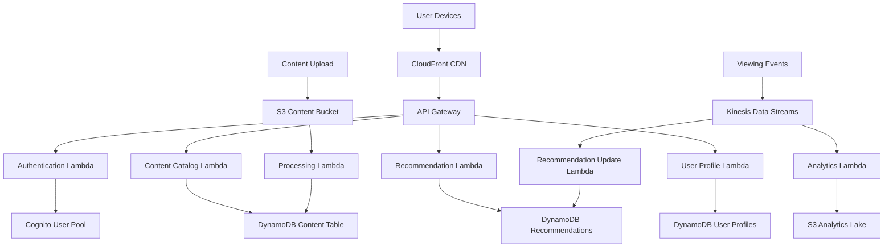
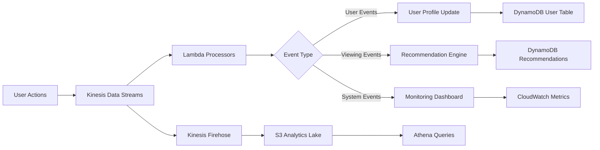
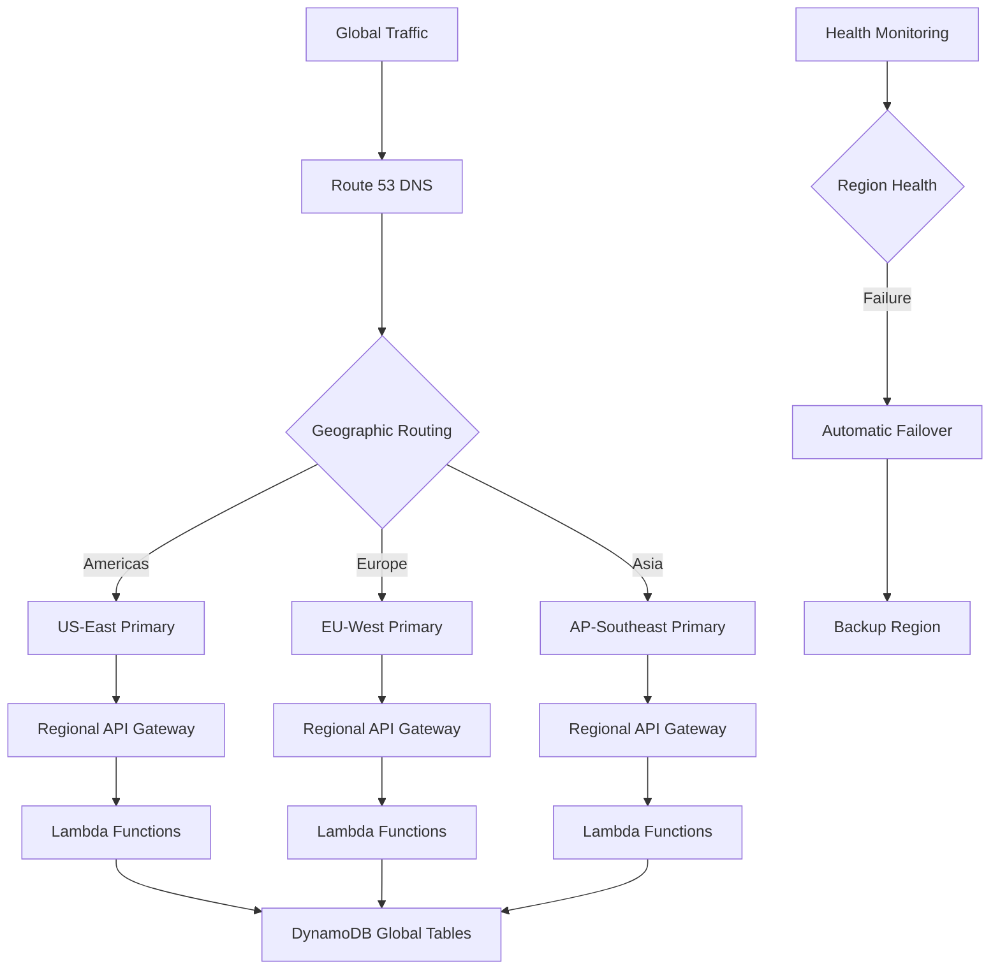
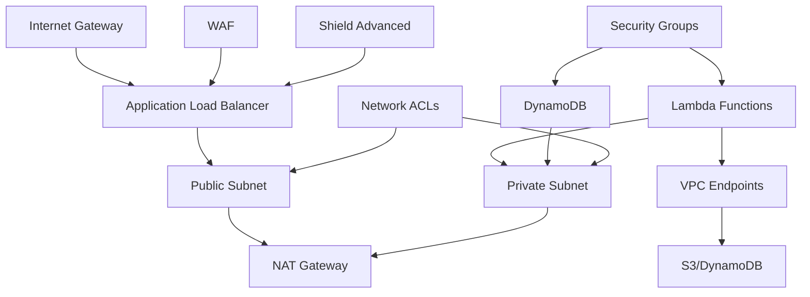
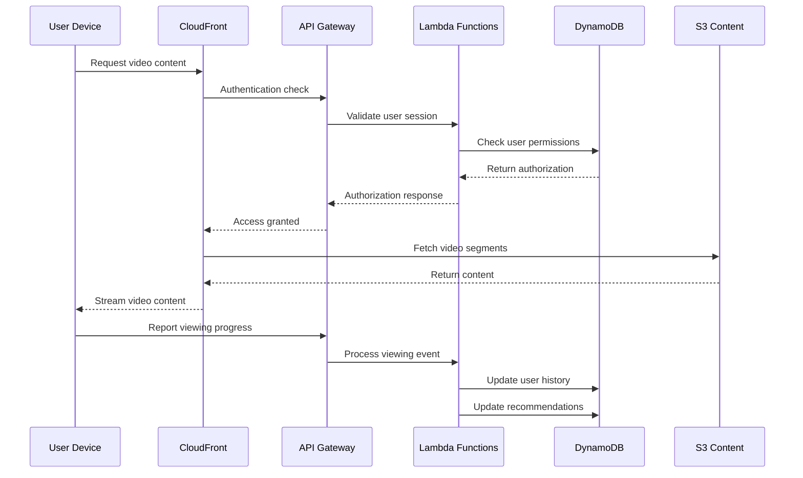

# Netflix-Scale Video Streaming: AWS Serverless Architecture

## 1. Business Context & Requirements

Netflix serves over 230 million subscribers worldwide, streaming billions of hours of content monthly across diverse devices and network conditions. The platform must handle massive spikes during popular content releases, maintain sub-second response times for user interactions, and deliver personalized experiences at unprecedented scale.

**Core Requirements:**
- **Scale**: Support 15,000+ concurrent streams per second during peak hours
- **Availability**: 99.99% uptime with global content delivery
- **Performance**: <100ms API response times, <3 second video start times
- **Personalization**: Real-time recommendation updates for 230M+ users
- **Content Management**: Handle 15,000+ titles with multi-language support
- **Analytics**: Process 500+ billion events daily for insights and recommendations

**Success Metrics:**
- Stream completion rates >85%
- User engagement time >2 hours daily average
- Content discovery through recommendations >80%
- Global content availability <5 second propagation
- Cost per stream <$0.01 including infrastructure

**Business Constraints:**
- Regulatory compliance across 190+ countries
- Content licensing restrictions by geography
- Variable bandwidth adaptation for mobile users
- Real-time fraud detection and prevention
- Multi-device synchronization across user accounts

The serverless approach enables Netflix to scale elastically while optimizing costs, as compute resources automatically adjust to viewing patterns that vary dramatically by time zone, content popularity, and seasonal events.

## 2. Architecture Overview

Netflix's serverless architecture leverages AWS's managed services to eliminate infrastructure management while achieving massive scale. The system employs event-driven patterns where user actions trigger cascading updates across recommendation engines, analytics pipelines, and content delivery networks.

**Core Architectural Principles:**
- **Microservices Decomposition**: Each business capability (user management, content catalog, recommendations, billing) operates as independent serverless functions
- **Event-Driven Communication**: Services communicate through events rather than direct calls, enabling loose coupling and better scalability
- **Data Locality**: User data and content are geographically distributed to minimize latency
- **Asynchronous Processing**: Heavy computations like recommendation model training occur asynchronously without blocking user interactions

**Primary AWS Services:**
- **API Gateway**: Handles 50M+ API calls daily with built-in throttling and caching
- **Lambda**: Processes user interactions, content metadata, and recommendation calculations
- **DynamoDB**: Stores user profiles, viewing history, and real-time recommendations
- **Kinesis**: Streams viewing events, user interactions, and system metrics
- **S3**: Manages content metadata, recommendation models, and analytics data
- **CloudFront**: Delivers content globally with edge caching
- **EventBridge**: Orchestrates complex workflows between microservices

**Key Architectural Decisions:**
- **Read-Heavy Optimization**: Implement aggressive caching strategies since users browse more than they watch
- **Geographic Distribution**: Deploy regional clusters to ensure sub-100ms response times globally
- **Event Sourcing**: Maintain complete audit trails of user interactions for recommendation improvement
- **CQRS Pattern**: Separate read and write operations for optimal performance at scale



## 3. Detailed Component Design

### API Layer Architecture

The API Gateway serves as the central nervous system, handling authentication, rate limiting, and request routing. Netflix implements a sophisticated multi-tier API strategy:

**Gateway Configuration:**
- **Primary Gateway**: Handles user-facing requests with 10,000 RPS burst capacity
- **Internal Gateway**: Manages service-to-service communication with higher limits
- **Analytics Gateway**: Dedicated endpoint for high-volume event ingestion
- **Admin Gateway**: Secure management interface with strict IP whitelisting

**Security Implementation:**
- JWT tokens with 15-minute expiration for user sessions
- API key validation for service-to-service calls
- WAF integration blocking malicious traffic patterns
- Rate limiting: 100 requests/minute per user, 10,000/minute per service

**Caching Strategy:**
- Content metadata cached for 5 minutes to balance freshness and performance
- User recommendations cached for 30 minutes with invalidation triggers
- Static assets cached at CloudFront edge locations for 24 hours

### Compute Layer: Lambda Organization

Netflix organizes Lambda functions around business capabilities rather than technical layers:

**User Management Functions:**
- `user-authentication`: Validates credentials and issues JWT tokens
- `user-profile-update`: Handles profile modifications with DynamoDB transactions
- `user-preferences`: Manages viewing preferences and parental controls
- `user-subscription`: Processes billing and subscription changes

**Content Management Functions:**
- `content-catalog-search`: Elasticsearch integration for content discovery
- `content-metadata-update`: Processes new content additions and modifications
- `content-recommendation`: Generates personalized recommendations using ML models
- `content-availability`: Determines content access based on geography and licensing

**Optimization Strategies:**
- **Warm-up Schedule**: Critical functions maintain warm containers during peak hours
- **Memory Allocation**: User-facing functions use 512MB for sub-100ms response times
- **Concurrency Limits**: Set to 10,000 per function to prevent downstream service overload
- **Dead Letter Queues**: Capture failed requests for retry and debugging

### Data Layer: Multi-Model Approach

**DynamoDB Design Patterns:**

*User Profiles Table:*
```
Partition Key: user_id
Sort Key: profile_type (main|preferences|viewing_history)
Attributes: profile_data (JSON), last_updated, geographic_region
GSI: geographic_region for regional analytics
```

*Content Catalog Table:*
```
Partition Key: content_id  
Sort Key: content_version
Attributes: title, description, metadata, availability_regions
GSI: genre + release_date for browse functionality
LSI: content_type for filtering
```

*Recommendations Table:*
```
Partition Key: user_id
Sort Key: recommendation_type + timestamp
Attributes: content_ids (list), confidence_scores, expiration_time
TTL: 24 hours for automatic cleanup
```

**Aurora Serverless for Analytics:**
- Complex analytical queries on viewing patterns
- Recommendation model training data preparation
- Business intelligence reporting and dashboards
- Automatic scaling from 0.5 to 128 ACUs based on query load

**S3 Data Architecture:**
- **Content Metadata**: Structured JSON files partitioned by region and genre
- **Analytics Lake**: Parquet files organized by date/hour for optimal querying
- **ML Models**: Versioned recommendation models with A/B testing capabilities
- **Backup Strategy**: Cross-region replication with glacier archival for compliance

### Event Processing Pipeline

**Event Categories:**
- **User Interactions**: Clicks, searches, profile updates (10M events/hour)
- **Viewing Events**: Play, pause, stop, completion (50M events/hour) 
- **System Events**: Function executions, errors, performance metrics (100M events/hour)
- **Business Events**: New content additions, promotion campaigns (1K events/hour)

**Kinesis Configuration:**
- **Data Streams**: 100 shards handling 500MB/second ingestion rate
- **Firehose**: Batches data to S3 every 60 seconds or 64MB batches
- **Analytics**: Real-time processing for trending content and anomaly detection



## 4. Scalability & Performance

### Auto-Scaling Strategies

Netflix implements multi-dimensional scaling across compute, storage, and network layers:

**Lambda Concurrency Management:**
- **Reserved Concurrency**: 5,000 for critical user-facing functions
- **Provisioned Concurrency**: 1,000 warm containers during peak hours (7-11 PM)
- **Burst Scaling**: Handles 10x traffic spikes during popular content releases
- **Regional Distribution**: Functions deployed across 15+ AWS regions for proximity

**DynamoDB Auto-Scaling:**
- **Target Utilization**: 70% for reads, 80% for writes to handle bursts
- **Scale-up Speed**: Doubles capacity within 15 minutes
- **Scale-down**: Gradual reduction over 4 hours to prevent oscillation
- **Global Tables**: Multi-region replication with eventual consistency

**API Gateway Scaling:**
- **Default Limits**: 10,000 RPS steady-state, 20,000 RPS burst
- **Custom Limits**: Up to 100,000 RPS for high-volume endpoints
- **Regional Endpoints**: Deployed in all regions for optimal latency
- **Edge-Optimized**: CloudFront integration for global distribution

### Geographic Scaling Patterns

**Multi-Region Strategy:**
- **Primary Regions**: US-East, EU-West, Asia-Pacific for major user populations
- **Secondary Regions**: 12 additional regions for content delivery and redundancy
- **Data Residency**: User data stored in home region with cross-region replication
- **Content Distribution**: 3 copies minimum across different geographic zones

**Regional Failover:**
- **Health Checks**: Multi-layer monitoring of API endpoints and databases
- **Automatic Failover**: Route 53 health checks trigger regional switches within 60 seconds
- **Data Synchronization**: DynamoDB Global Tables ensure data consistency
- **Graceful Degradation**: Reduced functionality during partial outages

### Performance Optimization Techniques

**Caching Hierarchies:**
- **L1 Cache**: Lambda memory caching for frequently accessed user data (30 seconds)
- **L2 Cache**: DynamoDB DAX for microsecond database responses
- **L3 Cache**: API Gateway caching for content metadata (5 minutes)
- **L4 Cache**: CloudFront edge caching for static assets (24 hours)

**Database Optimization:**
- **Hot Partitioning**: Distribute popular content across multiple DynamoDB partitions
- **Connection Pooling**: RDS Proxy for Aurora Serverless connections
- **Read Replicas**: 5 read replicas per region for Aurora clusters
- **Query Optimization**: Pre-computed recommendation scores updated asynchronously

**Network Performance:**
- **Content Delivery**: 200+ CloudFront edge locations globally
- **Connection Optimization**: HTTP/2 and connection keep-alive
- **Compression**: Gzip compression for API responses and content metadata
- **TCP Optimization**: AWS Global Accelerator for improved routing



## 5. Real-Time Processing

### Stream Processing Architecture

Netflix processes viewing events in real-time to update recommendations and detect viewing anomalies:

**Kinesis Analytics Applications:**
- **Trending Content**: Identifies rapidly growing viewership using sliding window calculations
- **Recommendation Updates**: Processes user interactions to refresh recommendation scores
- **Fraud Detection**: Analyzes viewing patterns for account sharing and abuse
- **Performance Monitoring**: Real-time system health metrics and alerting

**WebSocket API Implementation:**
Netflix uses WebSocket APIs for real-time features like synchronized viewing parties and live chat:

**Connection Management:**
- API Gateway WebSocket routes handle connection lifecycle
- Lambda functions process connect, disconnect, and message events
- DynamoDB stores active connection IDs for message routing
- Automatic cleanup of stale connections after 10 minutes

**Message Broadcasting:**
- Fan-out pattern for group viewing sessions
- Individual messaging for recommendation updates
- System notifications for content availability changes
- Real-time error reporting and user feedback

### Live Data Synchronization

**Multi-Device Synchronization:**
- User viewing position synchronized across devices within 5 seconds
- Profile changes propagated to all active sessions immediately
- Parental control updates applied in real-time
- Download queue synchronization for offline viewing

**Real-Time Recommendation Updates:**
When users interact with content, the system immediately updates recommendations:

1. **Event Capture**: User action captured via Kinesis Data Streams
2. **Stream Processing**: Kinesis Analytics calculates new recommendation scores
3. **Model Update**: Lambda function updates DynamoDB recommendation table
4. **Cache Invalidation**: API Gateway cache invalidated for affected user
5. **Client Notification**: WebSocket message sent to active user sessions

**Conflict Resolution:**
- Last-writer-wins for user preferences
- Vector clocks for viewing position synchronization
- Eventual consistency for non-critical updates
- Manual resolution for billing and subscription conflicts

## 6. Security Implementation

### Identity and Access Management

**Cognito Configuration:**
Netflix implements a sophisticated identity management system using AWS Cognito:

**User Pool Settings:**
- Multi-factor authentication for all accounts
- Password policies: 12+ characters, complexity requirements
- Account lockout after 5 failed attempts
- Device tracking and trusted device management

**Identity Federation:**
- Social login integration (Google, Facebook, Apple)
- Enterprise SSO for B2B partnerships
- SAML integration for corporate accounts
- OAuth 2.0 flows for third-party integrations

**IAM Role Strategy:**
- **User Roles**: Fine-grained permissions based on subscription tier
- **Service Roles**: Least-privilege access for Lambda functions
- **Admin Roles**: Time-limited elevated access with approval workflows
- **Cross-Account Roles**: Secure access to shared services and data

### Data Encryption and Protection

**Encryption at Rest:**
- DynamoDB tables encrypted with customer-managed KMS keys
- S3 buckets use SSE-KMS with automatic key rotation
- Aurora Serverless databases encrypted with TDE
- CloudWatch logs encrypted for compliance requirements

**Encryption in Transit:**
- TLS 1.3 for all API communications
- VPC endpoints for internal service communication
- AWS Certificate Manager for SSL certificate management
- HTTP Strict Transport Security (HSTS) headers

**Key Management:**
- AWS KMS with annual key rotation
- Separate keys for production, staging, and development environments
- Hardware Security Module (HSM) integration for high-value operations
- Key access logging and auditing

### Network Security and VPC Configuration

**VPC Architecture:**
- Multi-AZ deployment with private and public subnets
- NAT Gateways for outbound internet access from private subnets
- VPC endpoints for AWS service access without internet routing
- Network ACLs and Security Groups for defense in depth

**Security Group Configuration:**
- Lambda functions in private subnets with minimal security group rules
- Database access restricted to application security groups only
- Load balancer security groups allow HTTPS traffic only
- Administrative access through bastion hosts with time-limited access



## 7. DevOps & Monitoring

### Infrastructure as Code

Netflix employs AWS CDK (Cloud Development Kit) for infrastructure management:

**CDK Stack Organization:**
- **Foundation Stack**: VPC, security groups, IAM roles
- **Database Stack**: DynamoDB tables, Aurora clusters, Redis caches
- **Compute Stack**: Lambda functions, API Gateway configurations
- **Pipeline Stack**: CodePipeline and CodeBuild projects

**Deployment Patterns:**
- **Blue-Green Deployments**: Zero-downtime deployments with automatic rollback
- **Canary Releases**: 5% traffic to new versions with automated monitoring
- **Regional Rollouts**: Gradual deployment across geographic regions
- **Feature Flags**: Lambda environment variables control feature availability

### CI/CD Pipeline Architecture

**Multi-Stage Pipeline:**
1. **Source**: GitHub integration with webhook triggers
2. **Build**: CodeBuild compiles and packages Lambda functions
3. **Test**: Automated unit and integration testing with Jest and Pytest
4. **Security**: Static code analysis with SonarQube and dependency scanning
5. **Deploy**: Automated deployment to staging environment
6. **Validation**: Smoke tests and performance benchmarks
7. **Production**: Blue-green deployment with automated rollback triggers

**Pipeline Optimization:**
- Parallel build stages reduce deployment time to under 10 minutes
- Artifact caching accelerates subsequent builds by 60%
- Cross-region deployment orchestration ensures global consistency
- Automated rollback triggers activate on error rate increases >0.1%

### Monitoring and Observability

**CloudWatch Integration:**
Netflix implements comprehensive monitoring across all system layers:

**Application Metrics:**
- Lambda function duration, memory utilization, and error rates
- API Gateway request counts, latency percentiles, and error rates  
- DynamoDB read/write capacity utilization and throttling events
- Custom business metrics: user engagement, content popularity, recommendation accuracy

**X-Ray Tracing:**
- End-to-end request tracing across microservices
- Performance bottleneck identification in complex workflows
- Service map visualization for architecture understanding
- Custom annotations for business context in traces

**Alerting Strategy:**
- **Critical Alerts**: System outages, data corruption, security breaches (immediate notification)
- **Warning Alerts**: Performance degradation, capacity thresholds (5-minute delay)
- **Informational Alerts**: Deployment completions, scheduled maintenance (batch notifications)

**Log Aggregation:**
- Centralized logging with CloudWatch Logs Insights
- Structured JSON logging for efficient querying
- Log retention policies: 30 days operational, 7 years compliance
- Real-time log streaming to security monitoring tools

## 8. Video Processing and Content Delivery Deep Dive

### Video Processing Pipeline

Netflix's serverless video processing pipeline handles content ingestion, transcoding, and global distribution:

**Content Ingestion Workflow:**
1. **Upload Trigger**: S3 event triggers Lambda function when new content arrives
2. **Validation**: MediaInfo analysis validates video specifications and quality
3. **Metadata Extraction**: Automated extraction of duration, resolution, codec information
4. **Transcoding**: Step Functions orchestrates multiple Lambda functions for parallel processing
5. **Quality Assurance**: Automated testing of transcoded outputs for visual/audio quality
6. **Distribution**: Content replicated across global S3 buckets and CloudFront

**Transcoding Architecture:**
- **Parallel Processing**: Large videos split into segments for concurrent transcoding
- **Multiple Formats**: Generate 10+ quality levels from 240p to 4K for adaptive streaming
- **Audio Processing**: Multi-language audio tracks with subtitle integration
- **Thumbnail Generation**: Automated creation of preview images and video sprites

**Recommendation Engine Implementation:**

**Machine Learning Pipeline:**
Netflix's recommendation system processes user behavior in real-time:

**Data Collection:**
- Viewing patterns: completion rates, replay behavior, pause points
- User interactions: searches, ratings, list additions, browsing time
- Content features: genre, actors, directors, release date, popularity trends
- Contextual data: time of day, device type, geographic location

**Model Training:**
- **Collaborative Filtering**: User-item interaction matrices processed by Lambda functions
- **Content-Based Filtering**: Natural language processing of content descriptions
- **Deep Learning**: Neural networks trained on AWS SageMaker for complex pattern recognition
- **A/B Testing**: Multiple model versions tested simultaneously with random user assignment

**Real-Time Scoring:**
- **Batch Processing**: Nightly model training on historical data
- **Stream Processing**: Real-time updates based on current user sessions
- **Personalization**: Individual recommendation scores computed on-demand
- **Trending Integration**: Popular content boosted in recommendations

### CDN Optimization and Global Distribution

**CloudFront Configuration:**
- **Origin Strategy**: Multiple S3 buckets across regions for reduced latency
- **Caching Policies**: Video content cached for 24 hours, metadata for 5 minutes
- **Geographic Restrictions**: Content blocking based on licensing agreements
- **Custom Headers**: Device-specific optimizations and quality selection

**Edge Computing:**
- **Lambda@Edge**: Dynamic content personalization at edge locations
- **Geolocation**: Automatic language and content filtering
- **Device Detection**: Optimal video quality selection based on device capabilities
- **Security**: Token-based content access validation at edge



## 9. Production Considerations

### Cost Optimization Strategies

**Compute Cost Management:**
- **Lambda Optimization**: Right-sizing memory allocation reduces costs by 30%
- **Reserved Capacity**: Pre-purchasing DynamoDB capacity for predictable workloads
- **S3 Storage Classes**: Intelligent tiering automatically moves data to cheaper storage
- **CloudFront Optimization**: Cache hit ratio >95% reduces origin requests

**Resource Efficiency:**
- **Auto-Scaling**: Aggressive scaling policies prevent over-provisioning
- **Scheduled Scaling**: Predictive scaling based on historical viewing patterns
- **Regional Distribution**: Data locality reduces cross-region transfer costs
- **Compression**: Content compression reduces storage and bandwidth costs by 40%

**Cost Monitoring:**
- Real-time cost tracking with CloudWatch billing alarms
- Department-level cost allocation using resource tagging
- Weekly cost optimization reviews with automatic recommendations
- Yearly reserved instance planning and optimization

### Disaster Recovery Planning

**Multi-Region Strategy:**
- **Active-Active**: Primary regions serve traffic simultaneously
- **Failover Time**: Complete region failover within 5 minutes
- **Data Consistency**: DynamoDB Global Tables ensure cross-region synchronization
- **Testing**: Monthly disaster recovery drills with real traffic

**Backup Strategy:**
- **Point-in-Time Recovery**: DynamoDB continuous backups with 35-day retention
- **Cross-Region Replication**: Automated backup replication to 3+ regions
- **S3 Versioning**: Content versioning with lifecycle policies
- **Infrastructure Backups**: Daily snapshots of configuration and infrastructure code

### Performance Benchmarking

**Key Performance Indicators:**
- **API Response Time**: P99 <200ms for all user-facing endpoints
- **Video Start Time**: <3 seconds from user click to video playback
- **Recommendation Accuracy**: >75% user engagement with recommended content
- **System Availability**: 99.99% uptime with <1 minute MTTR

**Load Testing:**
- **Synthetic Testing**: Automated load tests simulate 10x peak traffic
- **Chaos Engineering**: Random service failures test system resilience
- **Performance Regression**: Automated testing prevents performance degradation
- **Capacity Planning**: Quarterly assessments of scaling requirements

### Future Scaling Roadmap

**Technology Evolution:**
- **Serverless Containers**: Migration to AWS Fargate for complex processing workloads
- **Machine Learning**: Enhanced recommendation algorithms with federated learning
- **Edge Computing**: Increased Lambda@Edge usage for personalization
- **5G Optimization**: Adaptive streaming algorithms for high-speed mobile networks

**Business Growth:**
- **Global Expansion**: Support for 50+ additional countries by 2025
- **Content Scale**: 10x increase in content library with automated processing
- **User Growth**: Architecture supports 1 billion concurrent users
- **Interactive Content**: Real-time multiplayer and social viewing features

**Operational Excellence:**
- **Zero-Touch Operations**: Fully automated deployment and scaling
- **Predictive Analytics**: AI-driven capacity planning and optimization
- **Security Enhancement**: Zero-trust architecture with continuous verification
- **Sustainability**: Carbon-neutral operations through optimized resource utilization

This comprehensive serverless architecture enables Netflix to deliver exceptional user experiences while maintaining operational efficiency at unprecedented scale. The event-driven, microservices-based approach provides the flexibility and resilience required for global entertainment streaming while optimizing costs through intelligent resource management.