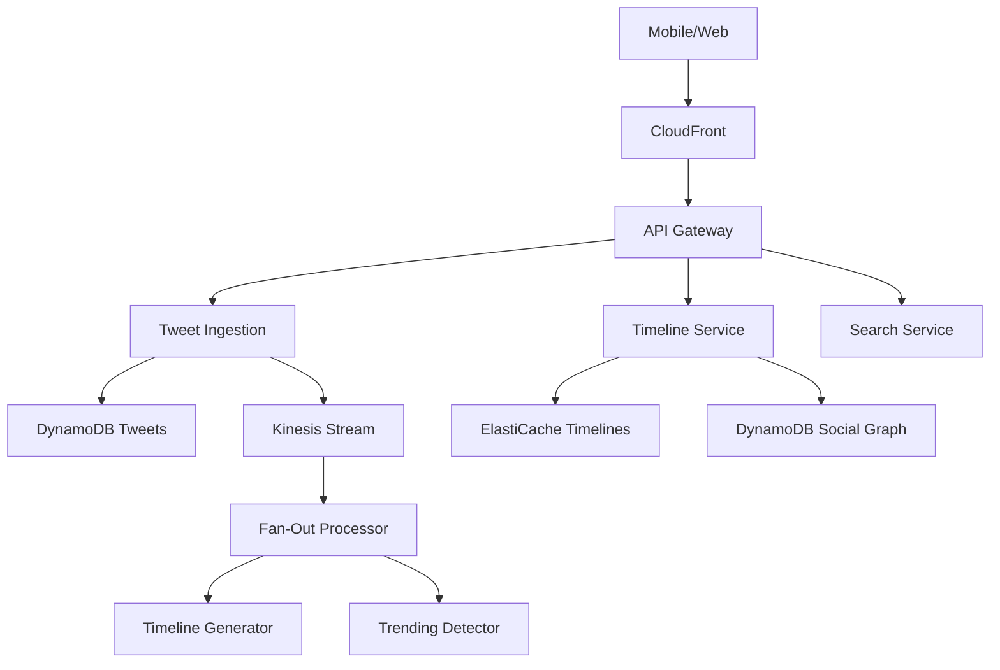
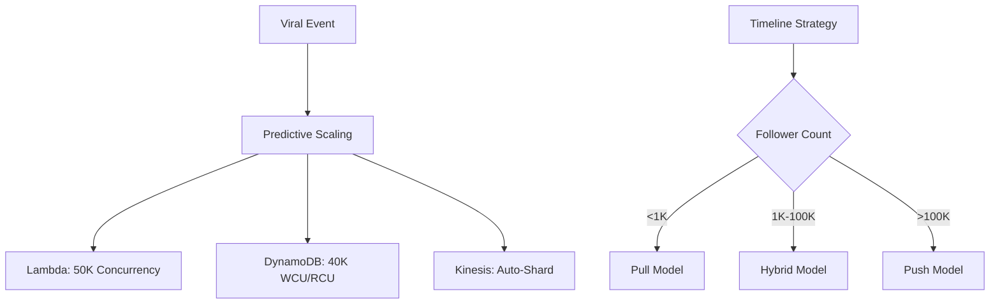
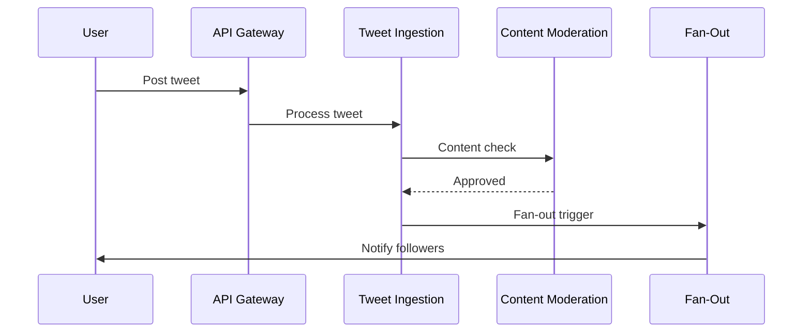
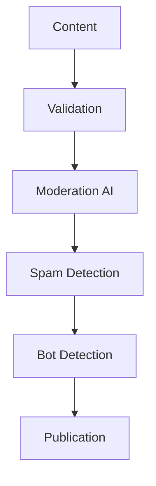

# Twitter-Scale Social Media: AWS Serverless Architecture

## 1. Business Context & Requirements

Twitter serves 450+ million monthly users generating 500+ million daily tweets. The platform handles real-time content distribution, trending detection, and personalized timelines while managing traffic spikes during global events.

**Core Requirements:**
- **Scale**: 500+ million daily tweets, 6,000 tweets/second average
- **Real-Time**: <100ms timeline updates, <500ms global tweet delivery
- **Viral Events**: Handle 100x traffic spikes during trending moments
- **Personalization**: Custom timelines for 450+ million users
- **Global Reach**: Real-time delivery across 200+ countries
- **Moderation**: Automated harmful content detection at scale

**Success Metrics:**
- Tweet delivery within 5 seconds to 99% of followers
- Timeline relevance >80% user engagement
- Trending detection within 15 minutes
- Platform availability 99.95% during major events
- Content moderation >95% accuracy, <1% false positives

**Constraints:**
- Real-time global content distribution
- Content moderation and data privacy compliance
- Multi-language support with cultural sensitivity
- Media partner and news organization integration

## 2. Architecture Overview

Event-driven microservices process social interactions, distribute content globally, and generate personalized experiences optimized for real-time social media patterns.

**Core Principles:**
- Fan-out pattern for tweet distribution
- Real-time streaming for continuous processing
- Graph processing for social relationships
- Content-first design for rapid creation/consumption
- Event-driven workflows for all interactions

**Primary AWS Services:**
- **API Gateway**: 2B+ daily API calls from apps and web
- **Lambda**: Tweet processing, timeline generation, moderation
- **DynamoDB**: User profiles, tweets, social graph
- **Kinesis**: Tweet streams, interactions, engagement events
- **ElastiCache**: Active timelines and trending topics
- **EventBridge**: Complex social workflow orchestration
- **OpenSearch**: Real-time search and trending detection



## 3. Detailed Component Design

### API Layer
- Public API for tweets, timelines, interactions
- Real-time WebSocket for live updates
- Partner API for media integrations
- Rate limiting: 300 tweets/hour, 100 searches/minute

### Compute Functions
**Tweet Processing:**
- `tweet-ingestion`: Validates and stores tweets
- `content-moderation`: AI-powered harmful content detection
- `media-processor`: Image/video processing
- `link-expander`: URL expansion and previews

**Timeline Generation:**
- `timeline-builder`: Personalized timeline construction
- `fan-out-processor`: Tweet distribution to followers
- `trending-detector`: Viral content identification
- `notification-dispatcher`: Push notifications

### Data Layer
**DynamoDB Tables:**
```
Tweets: PK=tweet_id
- GSI: user_id+timestamp, hashtag+timestamp
- Attributes: content, media, hashtags, mentions

Social Graph: PK=user_id, SK=relationship+target
- GSI: target_user_id+relationship
- Attributes: follow_date, interaction_frequency

Timeline Cache: PK=user_id, SK=timeline_type
- TTL: 6 hours
- Attributes: tweet_ids, last_updated
```

**ElastiCache:** Active timelines, trending topics, sessions
**OpenSearch:** Tweet search, trending analysis

## 4. Scalability & Performance

### Viral Content Handling
**Predictive Scaling:**
- Event calendar pre-scaling
- ML models predict viral content 15 minutes ahead
- Geographic patterns and time zone optimization
- Celebrity account activity triggers

**Auto-Scaling:**
- Lambda: 50K+ concurrent executions
- DynamoDB: Burst to 40K WCU/RCU
- Kinesis: Automatic shard splitting
- ElastiCache: Cluster auto-scaling

### Timeline Strategies
- **Pull Model**: Small accounts (<1K followers) on-demand
- **Push Model**: Large accounts (>100K) pre-computed
- **Hybrid Model**: Medium accounts with smart caching



## 5. Real-Time Processing

### Tweet Fan-Out
**Distribution Strategy:**
1. Tweet posted triggers fan-out processor
2. Active follower timelines updated immediately
3. Inactive users computed on next login
4. Celebrity accounts use pull model

**Performance:**
- Batch processing for efficiency
- Priority queues for mentions/replies
- Rate limiting to prevent overload
- Graceful degradation during extreme load

### Trending Detection
**Algorithm:**
1. Real-time hashtag extraction
2. Sliding window frequency analysis
3. Velocity calculation vs historical baseline
4. Geographic vs global pattern analysis
5. Spam filtering for artificial inflation

### Content Moderation
- Text analysis for harmful content
- Image recognition for inappropriate images
- Video content scanning
- Link analysis for malicious URLs
- Human escalation for complex cases



## 6. Security Implementation

### Content Security
- Multi-layer input validation
- Sophisticated rate limiting
- ML-based bot detection
- Coordinated behavior detection
- Privacy-first data handling

### Account Security
- Multi-factor authentication
- Account verification process
- Suspicious activity detection
- OAuth 2.0 for third-party apps



## 7. DevOps & Monitoring

### Deployment
- Feature flags for gradual rollouts
- Canary deployments (1% traffic)
- Blue-green for zero downtime
- Regional staged deployments

### Monitoring
**Business Metrics:**
- Tweet delivery success/latency
- Timeline engagement rates
- Trending accuracy metrics
- Content moderation performance

**Technical Metrics:**
- API P99 latency tracking
- Database throttling monitoring
- Stream processing lag
- Cache hit rates

## 8. Social Graph Processing Deep Dive

### Timeline Generation
**Personalization Factors:**
- Recency with time-based decay
- User interest and engagement history
- Social signals from followed accounts
- Content quality and virality indicators

**ML Models:**
- Interest modeling from user behavior
- Content understanding via NLP
- Engagement prediction models
- Timeline diversity optimization

### Graph Algorithms
**Relationship Types:**
- Follow graph (direct relationships)
- Interaction graph (derived from behavior)
- Interest graph (shared topics)
- Influence graph (weighted authority)

**Processing:**
- Community detection algorithms
- Influence score calculations
- Recommendation engine for follows
- Real-time graph updates

## 9. Production Considerations

### Cost Optimization
- Lambda memory optimization
- Reserved DynamoDB capacity
- ElastiCache right-sizing
- S3 lifecycle policies for media

### Disaster Recovery
- Multi-region active-active
- Cross-region replication
- 3-minute failover capability
- Weekly disaster recovery drills

### Performance Benchmarking
- Load testing for viral events
- Chaos engineering for resilience
- Performance regression prevention
- Real-time capacity monitoring

### Future Roadmap
**Technology Evolution:**
- Enhanced real-time ML
- Edge computing for timelines
- Advanced content understanding
- Improved moderation accuracy

**Business Growth:**
- Support for 1B+ users
- Enhanced creator tools
- Advanced analytics platform
- New content formats (audio, live video)

This serverless architecture enables Twitter to handle massive social media interactions in real-time while maintaining personalized experiences and content safety at global scale.