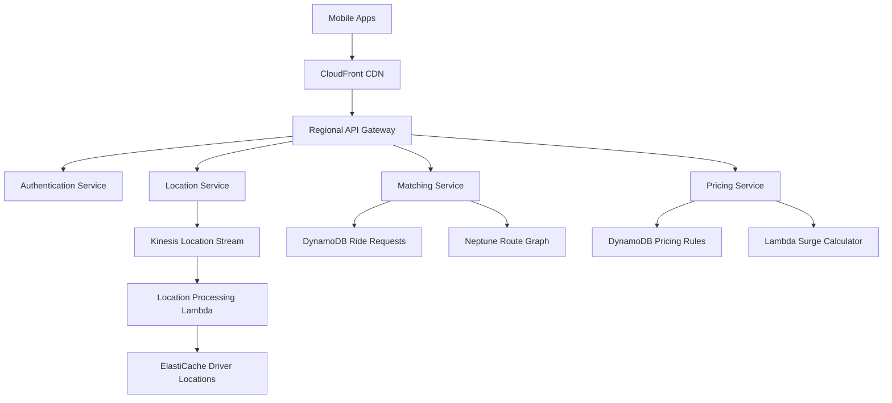
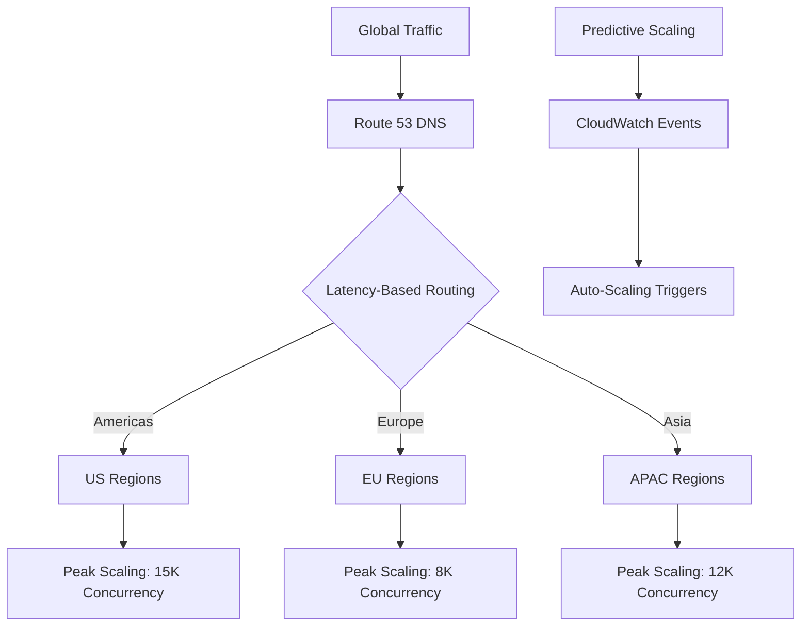
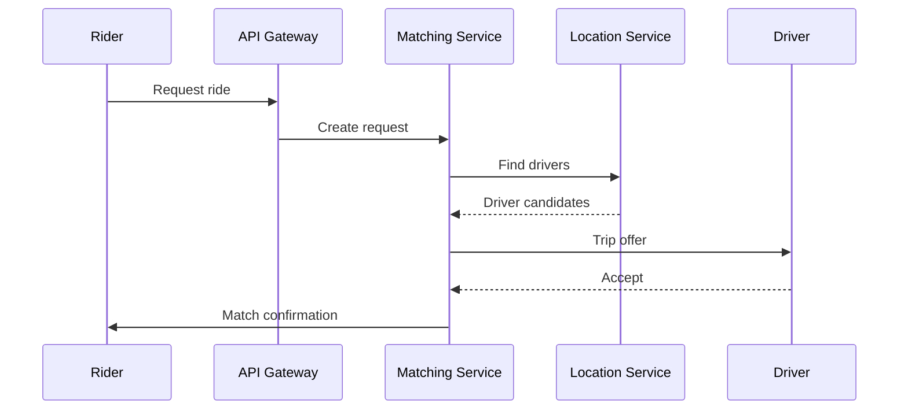
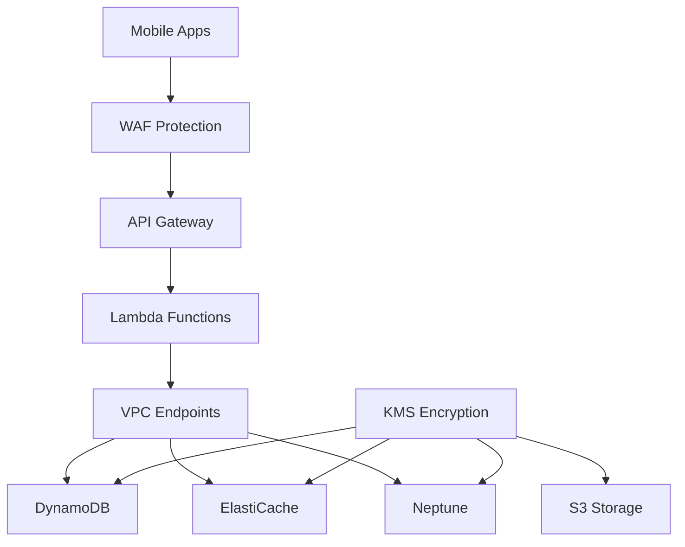

# Uber-Scale Ride Sharing: AWS Serverless Architecture

## 1. Business Context & Requirements

Uber operates in 900+ cities across 70+ countries, facilitating over 19 million trips daily. The platform must handle massive geographical data processing, dynamic pricing, and real-time location tracking while maintaining sub-second response times.

**Core Requirements:**
- **Scale**: Process 15+ million ride requests daily across global markets
- **Real-Time Performance**: <500ms driver-rider matching with optimal routing
- **Geographic Processing**: Handle 100+ million location updates per hour
- **Dynamic Pricing**: Real-time surge pricing based on supply and demand
- **Safety**: Real-time monitoring and emergency response capabilities
- **Multi-Service Platform**: Support rides, food delivery, freight, and financial services

**Success Metrics:**
- Matching efficiency >95% within 30 seconds
- ETA accuracy within ±2 minutes
- Driver utilization >70% active time
- Platform availability 99.99% during peak hours
- Dynamic pricing increases revenue 20-30% during peak demand

**Business Constraints:**
- Regulatory compliance across international markets
- Real-time financial transaction processing
- Multi-language and multi-currency support
- Integration with transportation authorities
- Privacy protection for location and payment data

## 2. Architecture Overview

Uber's serverless architecture processes location data, matches supply and demand, and orchestrates complex workflows using AWS's global infrastructure for consistent low-latency experiences.

**Core Principles:**
- **Event-Driven Architecture**: All interactions trigger specialized processing pipelines
- **Geographic Partitioning**: Data/services partitioned by regions for optimal performance
- **Real-Time Processing**: Location updates and matching with sub-second latency
- **Polyglot Persistence**: Optimized storage solutions for different data patterns
- **Circuit Breaker Pattern**: Graceful degradation during partial failures

**Primary AWS Services:**
- **API Gateway**: 500M+ daily API calls with geographic routing
- **Lambda**: Location processing, matching algorithms, business logic
- **DynamoDB**: User profiles, trip data, real-time driver states
- **Kinesis**: Location data, trip events, financial transactions
- **ElastiCache**: Active driver locations and route data caching
- **EventBridge**: Workflow orchestration between services
- **Neptune**: Geographic relationships and optimal routing



## 3. Detailed Component Design

### API Layer Architecture

**Gateway Configuration:**
- Regional gateways in 15+ AWS regions for optimal latency
- Mobile-optimized HTTP/2 with connection keep-alive
- Tiered rate limiting: riders 60/min, drivers 120/min, partners 1000/min
- Geographic routing to nearest regional services

**Security Implementation:**
- OAuth 2.0 mobile authentication with refresh token rotation
- Device fingerprinting for fraud detection
- Service-to-service API keys with automatic rotation
- WAF integration for DDoS protection

**Caching Strategy:**
- Driver locations: 5-second TTL for real-time accuracy
- Route data: 15-minute cache for static information
- Pricing rules: 30-second cache with immediate surge invalidation
- User profiles: 5-minute cache with update triggers

### Compute Layer: Location-Aware Functions

**Location Processing Functions:**
- `location-ingestion`: 100M+ hourly location updates
- `geofence-manager`: City boundary and service area validation
- `route-calculator`: Optimal routes with real-time traffic
- `eta-predictor`: ML-based arrival time predictions

**Matching Engine Functions:**
- `demand-aggregator`: Ride request processing and grouping
- `supply-tracker`: Real-time driver availability inventory
- `matching-algorithm`: Core rider-driver pairing logic
- `surge-detector`: Supply/demand imbalance identification

### Data Layer: Multi-Model Geographic Data

**DynamoDB Design:**

*Driver State Table:*
```
PK: driver_id | SK: timestamp
Attributes: location, status, vehicle_info, radius
GSI: city_region + status
TTL: 24 hours
```

*Trip Requests Table:*
```
PK: trip_id | SK: event_type
Attributes: rider_id, driver_id, locations, pricing
GSI: rider_id + request_time
```

**ElastiCache Real-Time Data:**
- Driver locations: Redis Geospatial for radius queries
- Active trips: Sub-millisecond status updates
- Route cache: Frequently requested routes (1 hour)
- Session data: Mobile app state management

**Neptune Graph Database:**
- Road networks for optimal route calculation
- Geographic relationships and boundaries
- Traffic patterns for route optimization
- Service relationships and preferences

## 4. Scalability & Performance

### Geographic and Temporal Scaling

**Multi-Region Strategy:**
- Independent deployments in 15+ AWS regions
- Data locality with cross-region replication
- Traffic routing to nearest healthy region
- Time zone-based compute resource scaling

**Auto-Scaling Configuration:**
- Lambda: 10,000 reserved concurrency for matching functions
- DynamoDB: 80% utilization scaling targets
- ElastiCache: Auto-scaling Redis with read replicas
- API Gateway: Custom regional rate limits

**Peak Hour Management:**
- ML models predict demand spikes 30 minutes ahead
- Calendar/weather API integration for preemptive scaling
- Progressive capacity increases prevent cold starts
- Critical function pre-warming during anticipated peaks

### Real-Time Location Processing

**Location Data Pipeline:**
- Ingestion: 100M+ updates/hour during peaks
- Processing latency: Sub-100ms app to cache update
- Driver updates: Every 5 seconds for accuracy
- GPS validation and signal smoothing

**Geographic Indexing:**
- Geohashing for efficient range queries
- Neptune R-Tree spatial indexing
- Optimized Haversine distance calculations
- Real-time geofence validation



## 5. Real-Time Processing

### Location Streaming and Driver Matching

**Location Stream Processing:**
- Kinesis: 100M+ location updates hourly
- Real-time driver density calculations
- Live ElastiCache geospatial index updates
- GPS spoofing and anomaly detection

**Real-Time Matching Algorithm:**
1. Request triggers Lambda execution
2. ElastiCache geospatial query finds nearby drivers
3. Neptune calculates optimal routes
4. Multi-factor scoring (distance, traffic, rating)
5. Simultaneous offers to top drivers
6. First acceptance triggers rider notification

### Dynamic Pricing Engine

**Real-Time Surge Calculation:**
- **Demand Analysis**: Request volume, wait times, cancellations
- **Supply Analysis**: Available drivers, positioning, response rates
- **Pricing Formula**: 
  ```
  Surge = Base_Rate * (1 + ((Demand - Supply) / Normalization))
  ```

**Event-Driven Workflow:**
- Trip lifecycle managed through EventBridge
- State transitions trigger automated processes
- Dead letter queues for failed events
- Complete audit trail for compliance



## 6. Security Implementation

### Identity and Access Management

**Authentication Architecture:**
- Cognito User Pools for riders and drivers
- Multi-factor authentication for drivers
- Device registration and trusted device management
- Session management with automatic timeout

**Authorization Strategy:**
- Fine-grained IAM roles for different user types
- Service-to-service authentication via IAM roles
- Geographic access controls based on service areas
- Emergency override procedures for safety incidents

### Data Protection

**Encryption Strategy:**
- All data encrypted at rest using KMS
- TLS 1.3 for all communications
- Location data anonymization for analytics
- PII encryption with customer-managed keys

**Network Security:**
- VPC endpoints for internal service communication
- WAF rules for API protection
- DDoS protection via AWS Shield Advanced
- Network segmentation for sensitive operations



## 7. DevOps & Monitoring

### Infrastructure as Code

**CDK Implementation:**
- Modular stack organization by service domain
- Environment-specific configurations
- Automated rollback capabilities
- Cross-region deployment orchestration

**CI/CD Pipeline:**
- GitHub integration with automated testing
- Blue-green deployments for zero downtime
- Canary releases with automated rollback
- Regional deployment coordination

### Monitoring and Observability

**CloudWatch Integration:**
- Custom metrics for business KPIs
- Lambda performance monitoring
- DynamoDB capacity utilization tracking
- Real-time alerting for critical issues

**X-Ray Tracing:**
- End-to-end request tracing
- Performance bottleneck identification
- Service dependency mapping
- Custom annotations for business context

## 8. Ride Matching and Route Optimization Deep Dive

### Advanced Matching Algorithm

**Multi-Factor Scoring System:**
- **Distance Weight**: Pickup distance with traffic consideration
- **Driver Rating**: Historical performance and user feedback
- **Vehicle Type**: Match vehicle to rider preferences
- **Route Efficiency**: Optimal driver positioning post-trip

**Machine Learning Integration:**
- Demand prediction models for driver positioning
- ETA accuracy improvements through historical data
- Dynamic route optimization based on traffic patterns
- Fraud detection for fake GPS signals

### Geographic Route Optimization

**Neptune Graph Implementation:**
- Street-level road network modeling
- Real-time traffic integration via external APIs
- Construction and event-based route adjustments
- Multi-modal transportation integration

**Route Calculation Performance:**
- Sub-second route computation for 95% of requests
- Parallel processing for complex multi-stop routes
- Caching of frequent route segments
- Fallback to simplified routing during high load

## 9. Production Considerations

### Cost Optimization

**Resource Efficiency:**
- Function memory optimization reduces costs 30%
- Reserved DynamoDB capacity for predictable workloads
- S3 Intelligent Tiering for analytics data
- ElastiCache right-sizing based on usage patterns

**Operational Excellence:**
- Automated scaling prevents over-provisioning
- Regional cost optimization through demand patterns
- Real-time cost monitoring with automated alerts
- Quarterly capacity planning and optimization reviews

### Disaster Recovery

**Multi-Region Resilience:**
- Active-active deployment across primary regions
- Cross-region data replication with 5-minute RPO
- Automated failover within 3 minutes
- Monthly disaster recovery testing

### Future Scaling Roadmap

**Technology Evolution:**
- Serverless containers for complex ML workloads
- Enhanced real-time analytics with Kinesis Analytics
- Edge computing for driver mobile app optimization
- 5G network optimization for improved location accuracy

**Business Growth Support:**
- Architecture supports 10x current transaction volume
- Global expansion framework for new markets
- Multi-modal transportation service integration
- Autonomous vehicle preparation and integration

This serverless architecture enables Uber to efficiently match millions of riders and drivers daily while maintaining real-time performance and global scalability.