# API Gateway Pattern

## 🚪 What is an API Gateway?

An API Gateway is like the **"front door"** of your application. Just like a hotel reception desk handles all guest requests and routes them to the right departments, an API Gateway receives all client requests and routes them to the appropriate backend services.

Think of it as a **smart proxy** that sits between your clients (web apps, mobile apps) and your backend services, providing a **single entry point** for all API calls.

## 🏗️ Basic Architecture

```mermaid
graph TB
    subgraph "Client Applications"
        WebApp[Web Application]
        MobileApp[Mobile App]
        ThirdParty[Third Party Apps]
        IoTDevices[IoT Devices]
    end
    
    subgraph "API Gateway Layer"
        Gateway[API Gateway<br/>🚪 Single Entry Point<br/>📋 Request Routing<br/>🔐 Authentication<br/>⚡ Rate Limiting<br/>📊 Monitoring]
    end
    
    subgraph "Backend Services"
        UserService[👤 User Service<br/>Port: 3001]
        ProductService[📦 Product Service<br/>Port: 3002]
        OrderService[🛒 Order Service<br/>Port: 3003]
        PaymentService[💳 Payment Service<br/>Port: 3004]
        NotificationService[📧 Notification Service<br/>Port: 3005]
    end
    
    WebApp --> Gateway
    MobileApp --> Gateway
    ThirdParty --> Gateway
    IoTDevices --> Gateway
    
    Gateway --> UserService
    Gateway --> ProductService
    Gateway --> OrderService
    Gateway --> PaymentService
    Gateway --> NotificationService
```



## 🎯 Why Use an API Gateway?

### Without API Gateway (Problems):

```mermaid
graph TB
    subgraph "Client Issues"
        WebApp1[Web App] 
        MobileApp1[Mobile App]
    end
    
    subgraph "Direct Service Calls"
        WebApp1 --> UserService1[User Service<br/>auth.company.com:3001]
        WebApp1 --> ProductService1[Product Service<br/>products.company.com:3002]
        WebApp1 --> OrderService1[Order Service<br/>orders.company.com:3003]
        
        MobileApp1 --> UserService1
        MobileApp1 --> ProductService1
        MobileApp1 --> OrderService1
    end
    
    subgraph "Problems"
        P1[❌ Multiple URLs to manage]
        P2[❌ Authentication in each service]
        P3[❌ No centralized rate limiting]
        P4[❌ CORS issues]
        P5[❌ Difficult monitoring]
    end
```


### With API Gateway (Solutions):

```mermaid
graph TB
    subgraph "Simplified Client"
        WebApp2[Web App]
        MobileApp2[Mobile App]
    end
    
    subgraph "API Gateway Benefits"
        Gateway2[API Gateway<br/>api.company.com<br/><br/>✅ Single URL<br/>✅ Centralized Auth<br/>✅ Rate Limiting<br/>✅ CORS Handling<br/>✅ Unified Monitoring]
    end
    
    subgraph "Backend Services"
        Services[Multiple Backend Services<br/>Hidden from clients]
    end
    
    WebApp2 --> Gateway2
    MobileApp2 --> Gateway2
    Gateway2 --> Services
```


## 🔧 Core Functions

### 1. **Request Routing**
Routes requests to the right backend service:


**Routing Rules Example**:
```
/api/users/*     → User Service (http://user-service:3001)
/api/products/*  → Product Service (http://product-service:3002)
/api/orders/*    → Order Service (http://order-service:3003)
/api/payments/*  → Payment Service (http://payment-service:3004)
```

### 2. **Authentication & Authorization**


**Authentication Flow**:
1. Client sends request with authentication token
2. Gateway validates token (JWT, API key, OAuth)
3. If valid, forwards request to backend service
4. If invalid, returns error immediately

### 3. **Rate Limiting**


**Example Rate Limiting Rules**:
```
Free Tier:     100 requests/hour
Premium Tier:  1000 requests/hour
Enterprise:    10000 requests/hour
Admin:         Unlimited
```

## 🌟 Advanced Features

### 1. **Request/Response Transformation**


**Use Cases**:
- Converting between JSON and XML
- Adding/removing fields
- Data validation and sanitization
- Legacy system integration

### 2. **Load Balancing**


### 3. **Caching**


**Caching Examples**:
```
GET /api/products        → Cache for 5 minutes
GET /api/users/profile   → Cache for 1 minute (user-specific)
GET /api/orders          → No cache (real-time data)
POST/PUT/DELETE          → Invalidate related cache
```

## 🏢 Real-World Examples

### 1. **Netflix API Gateway**


**Netflix's Special Features**:
- **Device-specific responses**: TV gets different data format than mobile
- **A/B testing**: Route percentage of traffic to experimental features
- **Chaos engineering**: Intentionally fail requests to test resilience

### 2. **Amazon API Gateway**


**Amazon's Unique Features**:
- **Serverless integration**: Direct integration with Lambda functions
- **AWS service proxy**: Call AWS services directly without backend code
- **Custom authorizers**: Lambda functions for complex authentication logic

### 3. **Kong API Gateway (Real Implementation)**


## 🛠️ Implementation Patterns

### 1. **Backend for Frontend (BFF)**

Different gateways for different client types:


**Benefits of BFF Pattern**:
- **Optimized responses** for each client type
- **Independent evolution** of client-specific APIs
- **Reduced over-fetching** of data

### 2. **Service Mesh vs API Gateway**


**When to Use Each**:
- **API Gateway**: External client communication, public APIs
- **Service Mesh**: Internal service communication, microservices
- **Hybrid**: Both external and internal traffic management

## 📊 Monitoring and Observability

### 1. **Key Metrics to Track**


### 2. **Distributed Tracing**


## ⚖️ Trade-offs and Considerations

### Benefits ✅

1. **Simplified Client Development**
   - Single endpoint to remember
   - Consistent authentication
   - Unified error handling

2. **Centralized Cross-cutting Concerns**
   - Authentication in one place
   - Rate limiting across all services
   - Logging and monitoring

3. **Backend Service Protection**
   - Services hidden from direct access
   - Request validation at gateway
   - DDoS protection

4. **API Evolution**
   - Version management
   - Gradual rollout of changes
   - Backward compatibility

### Challenges ❌

1. **Single Point of Failure**
   - Gateway down = entire API down
   - Need high availability setup

2. **Performance Bottleneck**
   - All requests go through gateway
   - Additional network hop
   - Latency increase

3. **Operational Complexity**
   - Another component to manage
   - Configuration management
   - Debugging complexity

4. **Vendor Lock-in**
   - Proprietary gateway features
   - Migration complexity

### Performance Impact

```mermaid
graph LR
    subgraph "Without Gateway"
        Client1[Client] -->|50ms| Service1[Service]
    end
    
    subgraph "With Gateway"
        Client2[Client] -->|10ms| Gateway[Gateway] -->|50ms| Service2[Service]
        Gateway -.->|Total: 60ms| Client2
    end
    
    subgraph "Optimized Gateway"
        Client3[Client] -->|5ms| OptGateway[Optimized Gateway<br/>+ Caching] -->|25ms| Service3[Service]
        OptGateway -.->|Total: 30ms<br/>(with cache)| Client3
    end
```

## 🚀 Best Practices

### 1. **High Availability Setup**


### 2. **Configuration Management**

```yaml
# Example API Gateway Configuration
routes:
  - path: "/api/users/*"
    service: "user-service"
    url: "http://user-service:3001"
    auth: required
    rate_limit: 1000/hour
    cache_ttl: 300
    
  - path: "/api/products/*"
    service: "product-service"
    url: "http://product-service:3002"
    auth: optional
    rate_limit: 5000/hour
    cache_ttl: 600
    
  - path: "/api/orders/*"
    service: "order-service"
    url: "http://order-service:3003"
    auth: required
    rate_limit: 500/hour
    cache_ttl: 0  # No caching for orders
```

### 3. **Error Handling Strategy**


### 4. **Security Best Practices**


## 🎯 When to Use API Gateway

### ✅ Use API Gateway When:
1. **Multiple client types** (web, mobile, IoT)
2. **Microservices architecture** with many services
3. **Cross-cutting concerns** like auth, logging, rate limiting
4. **Public API** that needs protection and management
5. **Legacy system integration** requiring transformation

### ❌ Avoid API Gateway When:
1. **Simple monolithic application** with few endpoints
2. **Internal-only services** with trusted clients
3. **Ultra-low latency requirements** where every millisecond counts
4. **Small team** without operational expertise
5. **Cost-sensitive** applications where additional infrastructure cost matters

## 📚 Popular API Gateway Solutions

### Open Source
- **Kong**: Plugin-based, high performance
- **Ambassador**: Kubernetes-native
- **Zuul**: Netflix's open-source gateway
- **Traefik**: Cloud-native with automatic service discovery

### Managed Services
- **AWS API Gateway**: Serverless, pay-per-request
- **Google Cloud Endpoints**: Integrated with GCP services
- **Azure API Management**: Enterprise features
- **Cloudflare**: Global edge network

### Enterprise
- **MuleSoft**: Full API lifecycle management
- **Apigee**: Google's enterprise API platform
- **WSO2**: Open-source with enterprise support

## 🎯 Key Takeaways

1. **API Gateway is essential** for microservices architectures
2. **Start simple** - don't over-engineer initially
3. **Plan for high availability** - gateway failure affects everything
4. **Monitor performance** - additional hop adds latency
5. **Choose the right tool** - consider your specific needs and constraints

The API Gateway pattern is crucial for modern distributed systems, providing a single entry point that simplifies client development while enabling sophisticated traffic management, security, and observability across your entire API ecosystem.
