# Anti-Patterns

## ⚠️ Overview

Anti-patterns are common solutions that appear beneficial but actually cause more problems than they solve. This guide covers architectural, distributed systems, data, and performance anti-patterns to help you avoid common pitfalls in system design.

## 📋 Table of Contents

### Common Anti-Patterns
1. [God Object Anti-Pattern](#1-god-object-anti-pattern)
2. [Spaghetti Code Anti-Pattern](#2-spaghetti-code-anti-pattern)
3. [Big Ball of Mud Anti-Pattern](#3-big-ball-of-mud-anti-pattern)
4. [Golden Hammer Anti-Pattern](#4-golden-hammer-anti-pattern)
5. [Premature Optimization Anti-Pattern](#5-premature-optimization-anti-pattern)

### Distributed Systems Anti-Patterns
6. [Distributed Monolith Anti-Pattern](#6-distributed-monolith-anti-pattern)
7. [Chatty Interface Anti-Pattern](#7-chatty-interface-anti-pattern)
8. [Shared Database Anti-Pattern](#8-shared-database-anti-pattern)
9. [Synchronous Communication Anti-Pattern](#9-synchronous-communication-anti-pattern)
10. [Missing Circuit Breaker Anti-Pattern](#10-missing-circuit-breaker-anti-pattern)

### Data Anti-Patterns
11. [Data Silos Anti-Pattern](#11-data-silos-anti-pattern)
12. [Data Duplication Anti-Pattern](#12-data-duplication-anti-pattern)
13. [Inconsistent Data Format Anti-Pattern](#13-inconsistent-data-format-anti-pattern)
14. [Missing Data Validation Anti-Pattern](#14-missing-data-validation-anti-pattern)
15. [Poor Data Quality Anti-Pattern](#15-poor-data-quality-anti-pattern)

### Performance Anti-Patterns
16. [N+1 Query Anti-Pattern](#16-n1-query-anti-pattern)
17. [Inefficient Caching Anti-Pattern](#17-inefficient-caching-anti-pattern)
18. [Memory Leak Anti-Pattern](#18-memory-leak-anti-pattern)
19. [Resource Contention Anti-Pattern](#19-resource-contention-anti-pattern)
20. [Blocking I/O Anti-Pattern](#20-blocking-io-anti-pattern)

---

## Common Anti-Patterns

## 1. God Object Anti-Pattern

### 🏛️ What is God Object?

God Object is a **massive class or module** that knows too much and does too much, violating the Single Responsibility Principle and creating maintenance nightmares.

### God Object Problems

```mermaid
graph TB
    subgraph "God Object Anti-Pattern"
        subgraph "God Object"
            GodClass[UserManager God Class<br/>- User authentication<br/>- User profile management<br/>- Email sending<br/>- Password validation<br/>- Database operations<br/>- File uploads<br/>- Logging<br/>- Caching<br/>- Payment processing<br/>- Notification sending<br/>- Report generation<br/>- Data validation<br/>...and much more]
        end
        
        subgraph "Problems Created"
            Problems[❌ Hard to understand<br/>❌ Difficult to test<br/>❌ Impossible to maintain<br/>❌ High coupling<br/>❌ Multiple reasons to change<br/>❌ Merge conflicts<br/>❌ Performance issues<br/>❌ Memory bloat]
        end
        
        subgraph "Impact on Team"
            TeamImpact[👥 Developer frustration<br/>🐛 More bugs introduced<br/>⏰ Longer development time<br/>🔧 Harder onboarding<br/>📈 Technical debt accumulation]
        end
        
        GodClass --> Problems
        Problems --> TeamImpact
    end
```



### Solution: Decompose into Focused Classes

```mermaid
graph TB
    subgraph "Refactored Solution"
        subgraph "Authentication Domain"
            AuthService[Authentication Service<br/>- Login/logout<br/>- Token management<br/>- Session handling]
            PasswordService[Password Service<br/>- Validation rules<br/>- Hashing<br/>- Reset functionality]
        end
        
        subgraph "User Management Domain"
            UserService[User Service<br/>- Profile operations<br/>- User lifecycle<br/>- Preferences]
            UserRepository[User Repository<br/>- Database operations<br/>- Data access<br/>- Queries]
        end
        
        subgraph "Communication Domain"
            EmailService[Email Service<br/>- Email sending<br/>- Template management<br/>- Delivery tracking]
            NotificationService[Notification Service<br/>- Push notifications<br/>- SMS sending<br/>- Alert management]
        end
        
        subgraph "Benefits"
            Benefits[✅ Single responsibility<br/>✅ Easy to test<br/>✅ Maintainable<br/>✅ Reusable<br/>✅ Team can work in parallel<br/>✅ Clear interfaces]
        end
    end
```

---

## 2. Spaghetti Code Anti-Pattern

### 🍝 What is Spaghetti Code?

Spaghetti Code has **complex, tangled control flow** with goto statements, nested conditions, and unclear program structure that's difficult to follow and maintain.

### Spaghetti Code Example

```mermaid
flowchart TD
    Start[Start] --> A[Check user input]
    A --> B{Valid input?}
    B -->|No| C[Show error]
    B -->|Yes| D[Process data]
    C --> E{Retry?}
    E -->|Yes| A
    E -->|No| F[Log error]
    D --> G{Data exists?}
    G -->|No| H[Create new]
    G -->|Yes| I[Update existing]
    H --> J{Success?}
    I --> K{Success?}
    J -->|No| F
    K -->|No| F
    J -->|Yes| L[Send notification]
    K -->|Yes| L
    F --> M{Critical error?}
    M -->|Yes| N[Alert admin]
    M -->|No| O[Continue]
    L --> P{Email enabled?}
    P -->|Yes| Q[Send email]
    P -->|No| R[Skip email]
    Q --> S{Email sent?}
    S -->|No| T[Log email failure]
    S -->|Yes| U[Update status]
    R --> U
    T --> U
    N --> End[End]
    O --> End
    U --> End
    
    subgraph "Problems"
        Problems[❌ Impossible to follow<br/>❌ Difficult to debug<br/>❌ Hard to modify<br/>❌ Testing nightmare<br/>❌ Bug-prone]
    end
```

### Solution: Structured Programming

```mermaid
graph TB
    subgraph "Structured Solution"
        subgraph "Main Flow"
            MainFlow[Main Process Flow<br/>1. Validate input<br/>2. Process data<br/>3. Send notifications<br/>4. Handle errors]
        end
        
        subgraph "Validation Module"
            Validation[Input Validation<br/>- Check required fields<br/>- Validate formats<br/>- Business rule validation]
        end
        
        subgraph "Data Processing Module"
            DataProcessing[Data Processing<br/>- Create or update logic<br/>- Database operations<br/>- Transaction management]
        end
        
        subgraph "Notification Module"
            Notification[Notification System<br/>- Email service<br/>- SMS service<br/>- Push notifications]
        end
        
        subgraph "Error Handling Module"
            ErrorHandling[Error Handling<br/>- Logging service<br/>- Alert service<br/>- Recovery procedures]
        end
        
        MainFlow --> Validation
        MainFlow --> DataProcessing
        MainFlow --> Notification
        MainFlow --> ErrorHandling
        
        subgraph "Benefits"
            Benefits[✅ Clear structure<br/>✅ Easy to follow<br/>✅ Testable modules<br/>✅ Maintainable<br/>✅ Reusable components]
        end
    end
```

---

## 3. Big Ball of Mud Anti-Pattern

### 🏗️ What is Big Ball of Mud?

Big Ball of Mud is a system that **lacks a perceivable architecture**, where components are haphazardly connected with no clear structure or organization.

### Big Ball of Mud Characteristics

```mermaid
graph TB
    subgraph "Big Ball of Mud Anti-Pattern"
        subgraph "Chaotic System"
            Component1[Component A] --> Component2[Component B]
            Component2 --> Component3[Component C]
            Component3 --> Component1
            Component1 --> Component4[Component D]
            Component4 --> Component2
            Component3 --> Component5[Component E]
            Component5 --> Component1
            Component4 --> Component5
            Component2 --> Component5
            Component5 --> Component3
            Component4 --> Component3
        end
        
        subgraph "Problems"
            Problems[❌ No clear boundaries<br/>❌ Tight coupling everywhere<br/>❌ Circular dependencies<br/>❌ Unpredictable behavior<br/>❌ Impossible to refactor<br/>❌ High risk changes<br/>❌ Knowledge silos<br/>❌ Technical debt]
        end
        
        subgraph "Causes"
            Causes[📈 Rapid growth pressure<br/>⏰ Time constraints<br/>👥 Team turnover<br/>📋 No architectural guidance<br/>🔧 Quick fixes accumulation<br/>💰 Cost-cutting measures]
        end
    end
```

### Solution: Layered Architecture

```mermaid
graph TB
    subgraph "Layered Architecture Solution"
        subgraph "Presentation Layer"
            UI[User Interface<br/>Web controllers<br/>API endpoints<br/>Request/response handling]
        end
        
        subgraph "Business Layer"
            Business[Business Logic<br/>Domain services<br/>Business rules<br/>Workflow orchestration]
        end
        
        subgraph "Data Access Layer"
            DataAccess[Data Access<br/>Repositories<br/>Database operations<br/>External API calls]
        end
        
        subgraph "Infrastructure Layer"
            Infrastructure[Infrastructure<br/>Logging<br/>Configuration<br/>Cross-cutting concerns]
        end
        
        UI --> Business
        Business --> DataAccess
        UI -.-> Infrastructure
        Business -.-> Infrastructure
        DataAccess -.-> Infrastructure
        
        subgraph "Benefits"
            Benefits[✅ Clear separation<br/>✅ Testable layers<br/>✅ Maintainable<br/>✅ Scalable<br/>✅ Team alignment]
        end
    end
```

---

## Distributed Systems Anti-Patterns

## 6. Distributed Monolith Anti-Pattern

### 🏗️ What is Distributed Monolith?

Distributed Monolith appears to be microservices but services are **tightly coupled**, requiring coordinated deployments and failing together.

### Distributed Monolith Problems

```mermaid
graph TB
    subgraph "Distributed Monolith Anti-Pattern"
        subgraph "Tightly Coupled Services"
            UserService[User Service] --> OrderService[Order Service]
            OrderService --> PaymentService[Payment Service]
            PaymentService --> InventoryService[Inventory Service]
            InventoryService --> ShippingService[Shipping Service]
            ShippingService --> UserService
            
            UserService -.-> SharedDB[(Shared Database)]
            OrderService -.-> SharedDB
            PaymentService -.-> SharedDB
        end
        
        subgraph "Problems"
            Problems[❌ Cannot deploy independently<br/>❌ Cascading failures<br/>❌ Shared database coupling<br/>❌ Synchronous call chains<br/>❌ All-or-nothing releases<br/>❌ No fault isolation<br/>❌ Microservices complexity<br/>❌ Monolith disadvantages]
        end
        
        subgraph "Warning Signs"
            Signs[🚨 Services always deploy together<br/>🚨 Database shared across services<br/>🚨 Long synchronous call chains<br/>🚨 Cannot test services in isolation<br/>🚨 One service failure breaks others]
        end
    end
```

### Solution: True Microservices

```mermaid
graph TB
    subgraph "True Microservices Solution"
        subgraph "Independent Services"
            UserSvc[User Service<br/>Independent deployment<br/>Own database<br/>Clear boundaries]
            OrderSvc[Order Service<br/>Independent deployment<br/>Own database<br/>Event-driven]
            PaymentSvc[Payment Service<br/>Independent deployment<br/>Own database<br/>Async processing]
        end
        
        subgraph "Loose Coupling"
            EventBus[Event Bus<br/>Asynchronous messaging<br/>Service decoupling<br/>Event-driven architecture]
        end
        
        subgraph "Independent Data"
            UserDB[(User DB)]
            OrderDB[(Order DB)]
            PaymentDB[(Payment DB)]
        end
        
        UserSvc --> UserDB
        OrderSvc --> OrderDB
        PaymentSvc --> PaymentDB
        
        UserSvc --> EventBus
        OrderSvc --> EventBus
        PaymentSvc --> EventBus
        
        subgraph "Benefits"
            Benefits[✅ Independent deployments<br/>✅ Fault isolation<br/>✅ Technology diversity<br/>✅ Team autonomy<br/>✅ Scalable development]
        end
    end
```

---

## 7. Chatty Interface Anti-Pattern

### 💬 What is Chatty Interface?

Chatty Interface requires **multiple fine-grained calls** to accomplish a single task, causing performance problems due to network overhead.

### Chatty Interface Example


### Solution: Coarse-Grained Interface


---

## Data Anti-Patterns

## 11. Data Silos Anti-Pattern

### 🏢 What are Data Silos?

Data Silos are **isolated data repositories** that cannot communicate with each other, preventing data sharing and creating inconsistencies.

### Data Silos Problems

```mermaid
graph TB
    subgraph "Data Silos Anti-Pattern"
        subgraph "Isolated Systems"
            CRMSilo[CRM System<br/>Customer data<br/>Isolated database<br/>No integration]
            
            ERPSilo[ERP System<br/>Financial data<br/>Separate database<br/>Custom format]
            
            MarketingSilo[Marketing System<br/>Campaign data<br/>Different database<br/>Unique schema]
            
            SalesSilo[Sales System<br/>Lead data<br/>Independent storage<br/>Proprietary format]
        end
        
        subgraph "Problems Created"
            Problems[❌ Duplicate customer data<br/>❌ Inconsistent information<br/>❌ Manual data reconciliation<br/>❌ Incomplete customer view<br/>❌ Reporting difficulties<br/>❌ Poor decision making<br/>❌ Compliance issues<br/>❌ Operational inefficiency]
        end
        
        subgraph "Business Impact"
            Impact[💰 Lost revenue opportunities<br/>😞 Poor customer experience<br/>⏰ Delayed insights<br/>📊 Inaccurate reporting<br/>🔧 Manual workarounds<br/>👥 Team frustration]
        end
    end
```



### Solution: Data Integration Platform


---

## Performance Anti-Patterns

## 16. N+1 Query Anti-Pattern

### 🔄 What is N+1 Query Problem?

N+1 Query Problem executes **one query to get a list**, then **N additional queries** to get related data for each item, causing severe performance issues.

### N+1 Query Example


### Solution: Eager Loading with Joins


### N+1 Solutions Comparison

```mermaid
graph TB
    subgraph "N+1 Query Solutions"
        subgraph "Eager Loading"
            EagerLoading[Eager Loading<br/>JOIN queries<br/>Single database call<br/>✅ Best for known access patterns<br/>❌ May over-fetch data]
        end
        
        subgraph "Batch Loading"
            BatchLoading[Batch Loading<br/>IN clause queries<br/>Minimal database calls<br/>✅ Flexible loading<br/>✅ Avoids over-fetching]
        end
        
        subgraph "DataLoader Pattern"
            DataLoader[DataLoader Pattern<br/>Request batching<br/>Automatic optimization<br/>✅ Transparent optimization<br/>✅ Caching built-in]
        end
        
        subgraph "Lazy Loading with Caching"
            LazyCache[Lazy Loading + Cache<br/>Load on demand<br/>Cache results<br/>✅ Memory efficient<br/>❌ Still multiple queries first time]
        end
    end
```



---

## 17. Inefficient Caching Anti-Pattern

### 🗄️ What is Inefficient Caching?

Inefficient Caching includes **wrong cache strategies**, **cache stampede**, **stale data issues**, and **memory waste** that hurt rather than help performance.

### Caching Anti-Patterns


### Efficient Caching Solutions


---

## 18. Memory Leak Anti-Pattern

### 🕳️ What are Memory Leaks?

Memory Leaks occur when applications **allocate memory** but **fail to release it**, causing gradual memory exhaustion and system crashes.

### Common Memory Leak Causes

```mermaid
graph TB
    subgraph "Memory Leak Anti-Pattern"
        subgraph "Leak Causes"
            UnreleasedResources[Unreleased Resources<br/>Database connections<br/>File handles<br/>Network sockets<br/>Timer objects]
            
            CircularReferences[Circular References<br/>Objects reference each other<br/>Garbage collector confused<br/>Memory never freed<br/>Growing heap size]
            
            StaticReferences[Static References<br/>Static collections<br/>Global variables<br/>Singleton objects<br/>Never garbage collected]
            
            EventListeners[Event Listeners<br/>Unremoved listeners<br/>DOM references<br/>Callback functions<br/>Memory accumulation]
        end
        
        subgraph "Symptoms"
            Symptoms[📈 Increasing memory usage<br/>🐌 Gradual performance degradation<br/>💥 OutOfMemoryError<br/>🔄 Frequent garbage collection<br/>❄️ Application freezing<br/>💀 System crashes]
        end
        
        subgraph "Detection Methods"
            Detection[🔍 Memory profiling<br/>📊 Heap dumps analysis<br/>📈 Memory monitoring<br/>🧪 Load testing<br/>⚠️ GC logs analysis]
        end
    end
```

### Memory Management Solutions


## Real-World Anti-Pattern Examples

### Twitter's Fail Whale (Scalability Anti-Patterns)

```mermaid
graph TB
    subgraph "Twitter's Early Scaling Issues"
        subgraph "Anti-Patterns Used"
            Monolith[Monolithic Architecture<br/>Single Ruby on Rails app<br/>Shared database<br/>No service boundaries]
            
            SyncProcessing[Synchronous Processing<br/>Tweet processing in request<br/>Timeline generation on demand<br/>Real-time fan-out]
            
            NoCache[Insufficient Caching<br/>Database queries for timelines<br/>No distributed caching<br/>Poor cache strategy]
        end
        
        subgraph "Problems Encountered"
            Problems[🐦 Frequent "Fail Whale"<br/>📈 Unable to handle growth<br/>🐌 Slow response times<br/>💥 Frequent outages<br/>😞 Poor user experience]
        end
        
        subgraph "Solutions Implemented"
            Solutions[🏗️ Service decomposition<br/>📊 Async message processing<br/>💾 Distributed caching<br/>🔄 Timeline pre-computation<br/>⚖️ Load balancing<br/>📈 Horizontal scaling]
        end
        
        Monolith --> Problems
        SyncProcessing --> Problems
        NoCache --> Problems
        Problems --> Solutions
    end
```

## 🎯 Key Takeaways

### Anti-Pattern Recognition ✅

1. **Watch for Warning Signs** - Complexity, performance issues, maintenance pain
2. **Question "Solutions"** - If it feels wrong, investigate alternatives
3. **Measure Impact** - Quantify the problems anti-patterns create
4. **Learn from Others** - Study how successful systems avoid these pitfalls
5. **Continuous Refactoring** - Address anti-patterns before they become critical
6. **Team Education** - Share knowledge about anti-patterns and solutions

### Prevention Strategies ✅

1. **Code Reviews** - Catch anti-patterns early in development
2. **Architecture Reviews** - Regular assessment of system design
3. **Performance Testing** - Identify performance anti-patterns under load
4. **Monitoring** - Track metrics that reveal anti-pattern symptoms
5. **Documentation** - Record architectural decisions and rationale
6. **Training** - Educate team on common anti-patterns and alternatives

### Refactoring Guidelines ✅

1. **Start Small** - Address one anti-pattern at a time
2. **Measure First** - Establish baseline metrics before refactoring
3. **Incremental Changes** - Avoid big-bang refactoring approaches
4. **Test Coverage** - Ensure good tests before refactoring
5. **Monitor Impact** - Track improvements after refactoring
6. **Document Changes** - Record what was changed and why

### Remember
> "Anti-patterns are not just bad code - they're systemic problems that compound over time. The key is recognizing them early and having the discipline to refactor before they become critical issues."

This comprehensive guide helps you identify and avoid common anti-patterns that can derail system design and development efforts. Understanding these anti-patterns is crucial for building maintainable, scalable, and reliable distributed systems.
