# Caching Patterns

## 🏃‍♂️ What is Caching?

Caching is like having a **"shortcut memory"** that stores frequently used data in a fast, easily accessible location. Instead of going to the original (slower) source every time, you can quickly grab the data from the cache.

Think of it like keeping **frequently used books on your desk** instead of walking to the library every time you need them. The desk (cache) is much faster to access than the library (database).

## 🏠 Real-World Analogy

```mermaid
graph TB
    subgraph "Library Analogy"
        Student[Student] --> Desk{Check Desk First}
        Desk -->|Book Found| QuickAccess[📚 Get Book from Desk<br/>⚡ 5 seconds]
        Desk -->|Book Not Found| Library[🏛️ Walk to Library<br/>⏱️ 10 minutes]
        Library --> BringBack[📚 Get Book + Bring Copy to Desk]
        BringBack --> Student
        QuickAccess --> Student
    end
    
    subgraph "System Analogy"
        User[User Request] --> Cache{Check Cache First}
        Cache -->|Cache Hit| FastResponse[💾 Return from Cache<br/>⚡ 1ms response]
        Cache -->|Cache Miss| Database[🗄️ Query Database<br/>⏱️ 100ms response]
        Database --> StoreInCache[💾 Store Result in Cache]
        StoreInCache --> User
        FastResponse --> User
    end
```



## 📊 Cache Performance Impact


**Performance Benefits**:
- **Cache Hit**: 100x faster (1ms vs 100ms)
- **Cache Miss**: Same speed initially, but future requests are fast
- **Overall**: 90% cache hit rate = 10x average performance improvement

## 🎯 Cache Patterns Overview

```mermaid
graph TB
    subgraph "Cache Patterns"
        subgraph "Read Patterns"
            CacheAside[Cache-Aside<br/>(Lazy Loading)]
            ReadThrough[Read-Through<br/>(Automatic Loading)]
        end
        
        subgraph "Write Patterns"
            WriteThrough[Write-Through<br/>(Immediate Sync)]
            WriteBehind[Write-Behind<br/>(Delayed Sync)]
            WriteAround[Write-Around<br/>(Skip Cache)]
        end
        
        subgraph "Advanced Patterns"
            RefreshAhead[Refresh-Ahead<br/>(Proactive Loading)]
            Distributed[Distributed Cache<br/>(Shared Cache)]
            MultiLevel[Multi-Level Cache<br/>(Cache Hierarchy)]
        end
    end
```

## 1️⃣ Cache-Aside Pattern (Lazy Loading)

**The most common pattern** - your application manages the cache manually.

### How It Works


### Implementation Example


### Real-World Example: Reddit


### Pros and Cons

✅ **Advantages**:
- **Simple to implement** and understand
- **Cache only what's needed** (lazy loading)
- **Application has full control** over cache logic
- **Cache failures don't break the system**

❌ **Disadvantages**:
- **Cache miss penalty** - first request is slow
- **Stale data possible** if cache and database get out of sync
- **Code complexity** - application manages cache logic

### Best For:
- **Read-heavy applications** (social media, news sites)
- **Applications with unpredictable access patterns**
- **When you want full control** over caching logic

## 2️⃣ Read-Through Pattern

**Cache automatically loads data** when there's a cache miss.

### How It Works


### Architecture Comparison


### Real-World Example: CDN

```mermaid
graph TB
    subgraph "CDN Read-Through Pattern"
        User[User] --> CDN[CDN Edge Server<br/>(Smart Cache)]
        
        CDN -->|Cache Hit| CachedImage[Return Cached Image<br/>⚡ Ultra Fast]
        CDN -->|Cache Miss| Origin[Origin Server<br/>(Database/Storage)]
        
        Origin --> ProcessImage[Process Image<br/>Resize, Optimize]
        ProcessImage --> StoreCDN[Store in CDN Cache<br/>TTL: 24 hours]
        StoreCDN --> ServeImage[Serve Image to User]
        
        CachedImage --> User
        ServeImage --> User
    end
```

### Pros and Cons

✅ **Advantages**:
- **Simplified application code** - cache handles loading
- **Consistent interface** - application always talks to cache
- **Automatic cache population** on misses

❌ **Disadvantages**:
- **Cache becomes a bottleneck** - all requests go through cache
- **Complex cache implementation** required
- **Cache failure breaks the system**

### Best For:
- **Consistent access patterns** where cache can predict needs
- **When you want to simplify application code**
- **CDN and proxy scenarios**

## 3️⃣ Write-Through Pattern

**Every write goes to both cache and database simultaneously.**

### How It Works


### Data Consistency Flow

```mermaid
graph TB
    subgraph "Write-Through Consistency"
        WriteRequest[Write Request<br/>Update User Email] --> Cache[Cache Layer]
        
        Cache --> UpdateCache[Update Cache<br/>user:123 → new email]
        Cache --> UpdateDB[Update Database<br/>user:123 → new email]
        
        UpdateCache --> Verify{Both Updates<br/>Successful?}
        UpdateDB --> Verify
        
        Verify -->|Yes| Success[✅ Write Successful<br/>Cache and DB in sync]
        Verify -->|No| Rollback[❌ Rollback Changes<br/>Maintain consistency]
    end
```



### Real-World Example: Banking System

```mermaid
graph TB
    subgraph "Banking Account Balance"
        ATM[ATM Transaction] --> BankingSystem[Banking System]
        
        BankingSystem --> CacheUpdate[Update Cache<br/>account:12345 → $1,000]
        BankingSystem --> DBUpdate[Update Database<br/>account:12345 → $1,000]
        
        CacheUpdate --> Verification{Both Updates<br/>Successful?}
        DBUpdate --> Verification
        
        Verification -->|Yes| TransactionComplete[✅ Transaction Complete<br/>Balance: $1,000]
        Verification -->|No| TransactionFailed[❌ Transaction Failed<br/>Try Again]
        
        subgraph "Immediate Consistency"
            NextATM[Next ATM Check] --> CacheRead[Read from Cache]
            CacheRead --> CurrentBalance[Shows: $1,000<br/>✅ Always Accurate]
        end
    end
```



### Pros and Cons

✅ **Advantages**:
- **Strong consistency** - cache and database always in sync
- **Fast reads** - data always available in cache
- **Simple read logic** - just read from cache

❌ **Disadvantages**:
- **Slower writes** - must write to both cache and database
- **Write complexity** - need to handle dual-write failures
- **Cache stores everything** - even rarely accessed data

### Best For:
- **Financial systems** where consistency is critical
- **Applications with heavy read loads** and occasional writes
- **When data accuracy is more important than write speed**

## 4️⃣ Write-Behind Pattern (Write-Back)

**Cache is updated immediately, database is updated later asynchronously.**

### How It Works


### Batching Strategy


### Real-World Example: Social Media

```mermaid
graph TB
    subgraph "Facebook-like Social Media"
        subgraph "User Actions (High Frequency)"
            Like[User Likes Post] --> CacheLike[Update Cache<br/>post:123 → +1 like]
            Comment[User Comments] --> CacheComment[Update Cache<br/>post:123 → new comment]
            Share[User Shares] --> CacheShare[Update Cache<br/>post:123 → +1 share]
        end
        
        CacheLike --> ImmediateResponse[⚡ Immediate UI Update]
        CacheComment --> ImmediateResponse
        CacheShare --> ImmediateResponse
        
        subgraph "Background Processing"
            CacheLike --> WriteQueue[Write Queue]
            CacheComment --> WriteQueue
            CacheShare --> WriteQueue
            
            WriteQueue --> BatchWriter[Batch Writer<br/>Every 10 seconds]
            BatchWriter --> Database[(Database<br/>Persistent Storage)]
        end
    end
```



### Pros and Cons

✅ **Advantages**:
- **Fastest write performance** - immediate response to user
- **Better database efficiency** - batched writes
- **Handles traffic spikes** well

❌ **Disadvantages**:
- **Data loss risk** - if cache fails before database write
- **Complex implementation** - need queue management
- **Eventual consistency** - database might be behind

### Best For:
- **High-frequency writes** (social media interactions, gaming scores)
- **When write speed is critical** for user experience
- **Systems that can tolerate some data loss**

## 5️⃣ Write-Around Pattern

**Writes bypass the cache and go directly to the database.**

### How It Works


### Use Case Example


### Pros and Cons

✅ **Advantages**:
- **Excellent for write-heavy workloads** with infrequent reads
- **Cache only stores frequently accessed data**
- **Prevents cache pollution** from one-time writes

❌ **Disadvantages**:
- **First read after write is slow** (cache miss)
- **Temporary inconsistency** between cache and database
- **More complex read logic**

### Best For:
- **Analytics and logging systems** (lots of writes, few reads)
- **Bulk data imports** that are rarely accessed
- **When cache space is limited** and expensive

## 6️⃣ Refresh-Ahead Pattern

**Proactively refresh cache before it expires.**

### How It Works



```mermaid
sequenceDiagram
    participant User as User
    participant App as Application
    participant Cache as Cache
    participant Refresher as Background Refresher
    participant DB as Database
    
    Note over User,DB: Normal Operation
    User->>App: Request data
    App->>Cache: Get data
    Cache-->>App: Return data (TTL: 2 min remaining)
    App-->>User: Fast response ⚡
    
    Note over Cache,DB: Proactive Refresh
    Cache->>Refresher: TTL < 3 minutes → trigger refresh
    Refresher->>DB: Fetch fresh data
    DB-->>Refresher: Return fresh data
    Refresher->>Cache: Update cache with fresh data
    
    Note over User,DB: Next Request (Always Fast)
    User->>App: Request same data
    App->>Cache: Get data
    Cache-->>App: Return fresh data (no miss!)
    App-->>User: Fast response ⚡
```

### Refresh Strategy


### Real-World Example: News Website


### Pros and Cons

✅ **Advantages**:
- **Eliminates cache miss penalty** for frequently accessed data
- **Always fresh data** without user-facing delays
- **Predictable performance** for critical data

❌ **Disadvantages**:
- **Increased complexity** - need background refresh system
- **More database load** - refreshing data that might not be accessed
- **Resource overhead** - background processes consume resources

### Best For:
- **Critical data** that must always be fast (homepage content)
- **Predictable access patterns** where you know what will be requested
- **When cache miss penalty is unacceptable**

## 🏢 Multi-Level Caching

**Multiple cache layers for optimal performance.**

```mermaid
graph TB
    subgraph "Multi-Level Cache Architecture"
        User[User Request] --> L1[L1 Cache: Browser<br/>Size: 10MB<br/>Speed: 1ms<br/>TTL: 5 minutes]
        
        L1 -->|Miss| L2[L2 Cache: CDN<br/>Size: 100GB<br/>Speed: 10ms<br/>TTL: 1 hour]
        
        L2 -->|Miss| L3[L3 Cache: Application<br/>Size: 10GB<br/>Speed: 50ms<br/>TTL: 30 minutes]
        
        L3 -->|Miss| L4[L4 Cache: Database<br/>Size: 1TB<br/>Speed: 100ms<br/>TTL: 24 hours]
        
        L4 -->|Miss| Storage[(Persistent Storage<br/>Speed: 1000ms)]
        
        subgraph "Cache Characteristics"
            Speed[Speed: Faster → Slower]
            Size[Size: Smaller → Larger]
            Cost[Cost: Expensive → Cheap]
        end
    end
```

### Real-World Example: E-commerce Product Page

```mermaid
graph TB
    subgraph "E-commerce Multi-Level Caching"
        Customer[Customer] --> Browser[Browser Cache<br/>Product images, CSS, JS<br/>TTL: 1 day]
        
        Browser -->|Miss| CDN[CDN Cache<br/>Product images, static content<br/>TTL: 1 week]
        
        CDN -->|Miss| AppCache[Application Cache<br/>Product details, prices<br/>TTL: 5 minutes]
        
        AppCache -->|Miss| DBCache[Database Cache<br/>Query results<br/>TTL: 1 hour]
        
        DBCache -->|Miss| Database[(Database<br/>Master product data)]
        
        subgraph "Performance Results"
            Browser --> B1[1ms - Instant]
            CDN --> B2[50ms - Very Fast]
            AppCache --> B3[100ms - Fast]
            DBCache --> B4[200ms - Acceptable]
            Database --> B5[500ms - Slow]
        end
    end
```

## 📊 Cache Invalidation Strategies

**"There are only two hard things in Computer Science: cache invalidation and naming things."**

### Invalidation Patterns

```mermaid
graph TB
    subgraph "Cache Invalidation Strategies"
        subgraph "Time-Based"
            TTL[TTL (Time To Live)<br/>Expire after X minutes]
            Sliding[Sliding Window<br/>Extend TTL on access]
        end
        
        subgraph "Event-Based"
            WriteInvalidate[Write Invalidation<br/>Clear cache on data update]
            TagBased[Tag-Based<br/>Invalidate related data]
        end
        
        subgraph "Manual"
            AdminInvalidate[Admin Invalidation<br/>Manual cache clearing]
            APIInvalidate[API Invalidation<br/>Programmatic clearing]
        end
    end
```

### Tag-Based Invalidation Example

```mermaid
graph TB
    subgraph "E-commerce Tag-Based Invalidation"
        subgraph "Cache Entries with Tags"
            Product[Product:123<br/>Tags: product, category:electronics]
            Category[Category:electronics<br/>Tags: category, navigation]
            UserCart[User:456:cart<br/>Tags: user:456, cart]
        end
        
        subgraph "Invalidation Events"
            PriceUpdate[Product Price Updated] --> InvalidateProduct[Invalidate tag: product]
            CategoryChange[Category Modified] --> InvalidateCategory[Invalidate tag: category]
            UserLogout[User Logout] --> InvalidateUser[Invalidate tag: user:456]
        end
        
        InvalidateProduct --> Product
        InvalidateCategory --> Product
        InvalidateCategory --> Category
        InvalidateUser --> UserCart
    end
```

## ⚖️ Cache Trade-offs

### Performance vs Consistency

```mermaid
graph LR
    subgraph "Performance vs Consistency Spectrum"
        HighConsistency[High Consistency<br/>Write-Through<br/>Slower writes<br/>Always accurate]
        
        MediumConsistency[Medium Consistency<br/>Cache-Aside<br/>Balanced performance<br/>Mostly accurate]
        
        HighPerformance[High Performance<br/>Write-Behind<br/>Fastest writes<br/>Eventually consistent]
    end
    
    HighConsistency -.-> MediumConsistency -.-> HighPerformance
```

### Memory vs Speed Trade-offs

```mermaid
graph TB
    subgraph "Cache Size vs Performance"
        subgraph "Small Cache"
            SmallCache[Cache Size: 100MB<br/>Hit Rate: 60%<br/>Cost: Low<br/>Performance: Good]
        end
        
        subgraph "Medium Cache"
            MediumCache[Cache Size: 1GB<br/>Hit Rate: 85%<br/>Cost: Medium<br/>Performance: Great]
        end
        
        subgraph "Large Cache"
            LargeCache[Cache Size: 10GB<br/>Hit Rate: 95%<br/>Cost: High<br/>Performance: Excellent]
        end
        
        SmallCache --> MediumCache --> LargeCache
        
        subgraph "Diminishing Returns"
            Returns[Each 10x size increase<br/>gives smaller performance gain]
        end
    end
```

## 🎯 Choosing the Right Cache Pattern

### Decision Matrix

```mermaid
flowchart TD
    Start[Choose Cache Pattern] --> ReadHeavy{Read Heavy<br/>Workload?}
    
    ReadHeavy -->|Yes| ConsistencyImportant{Consistency<br/>Critical?}
    ReadHeavy -->|No| WriteHeavy{Write Heavy<br/>Workload?}
    
    ConsistencyImportant -->|Yes| WriteThrough[Write-Through<br/>Pattern]
    ConsistencyImportant -->|No| CacheAside[Cache-Aside<br/>Pattern]
    
    WriteHeavy -->|Yes| WritePattern{Write Speed<br/>Important?}
    WritePattern -->|Yes| WriteBehind[Write-Behind<br/>Pattern]
    WritePattern -->|No| WriteAround[Write-Around<br/>Pattern]
    
    WriteHeavy -->|No| Mixed{Mixed<br/>Workload?}
    Mixed -->|Yes| RefreshAhead[Refresh-Ahead<br/>Pattern]
```

### Use Case Recommendations

| Use Case | Best Pattern | Why |
|----------|--------------|-----|
| **Social Media Feed** | Cache-Aside + Write-Behind | Fast reads, eventual consistency OK |
| **Banking System** | Write-Through | Strong consistency required |
| **Analytics Dashboard** | Write-Around + Refresh-Ahead | Infrequent reads, always fresh data |
| **E-commerce Product** | Multi-Level Caching | Different data has different access patterns |
| **News Website** | Refresh-Ahead | Predictable access, must be fast |
| **Gaming Leaderboard** | Write-Behind | High-frequency updates |

## 📚 Key Takeaways

### Cache Pattern Selection ✅

1. **Cache-Aside**: Most flexible, good for most applications
2. **Write-Through**: When consistency is more important than speed
3. **Write-Behind**: When write speed is critical
4. **Write-Around**: For write-heavy, read-light workloads
5. **Refresh-Ahead**: For predictable, critical data access
6. **Multi-Level**: For complex applications with varied data access

### Implementation Best Practices ✅

1. **Start simple** with Cache-Aside pattern
2. **Monitor cache hit rates** - aim for 80%+ for frequently accessed data
3. **Set appropriate TTL** values based on data change frequency
4. **Plan for cache failures** - system should work without cache
5. **Use consistent naming** for cache keys
6. **Implement proper monitoring** and alerting

### Common Mistakes to Avoid ❌

1. **Caching everything** - cache only frequently accessed data
2. **Ignoring cache invalidation** - stale data causes bugs
3. **Not monitoring cache performance** - cache can become bottleneck
4. **Choosing wrong cache size** - too small = low hit rate, too large = waste
5. **Not planning for cache warmup** - cold cache causes poor performance

### Remember
> "Caching is not just about speed - it's about building systems that can handle scale gracefully while providing excellent user experience."

Caching patterns are fundamental to building high-performance systems. The key is understanding your access patterns, consistency requirements, and performance goals to choose the right pattern for each use case.
