# Circuit Breaker Pattern

## ⚡ What is the Circuit Breaker Pattern?

The Circuit Breaker pattern is like an **electrical circuit breaker** in your home. Just as an electrical breaker automatically cuts power when there's a dangerous overload, a software circuit breaker **stops requests to a failing service** to prevent cascading failures and give the system time to recover.

Think of it as a **"smart switch"** that protects your system from wasting resources on calls that are likely to fail.

## 🏠 Real-World Analogy

```mermaid
graph TB
    subgraph "Your Home Electrical System"
        PowerSource[Power Source] --> Breaker{Circuit Breaker}
        Breaker -->|Normal| Appliances[Kitchen Appliances]
        Breaker -->|Overload Detected| TripBreaker[⚡ BREAKER TRIPS<br/>Power Cut Off]
        
        subgraph "Protection"
            TripBreaker --> Protection[🛡️ Prevents:<br/>- Fire hazard<br/>- Equipment damage<br/>- House damage]
        end
    end
    
    subgraph "Software System"
        ServiceA[Service A] --> CircuitBreaker{Circuit Breaker}
        CircuitBreaker -->|Normal| ServiceB[Service B]
        CircuitBreaker -->|Failures Detected| TripSoftware[⚡ CIRCUIT OPENS<br/>Requests Blocked]
        
        subgraph "System Protection"
            TripSoftware --> SoftwareProtection[🛡️ Prevents:<br/>- Cascading failures<br/>- Resource exhaustion<br/>- System overload]
        end
    end
```

## 🔄 Circuit Breaker States

The circuit breaker has **three states**, just like a light switch but smarter:


### 1. **CLOSED State** (Normal Operation)
- **What it does**: Allows all requests to pass through
- **Monitoring**: Counts failures and successes
- **Analogy**: Light switch is ON, electricity flows normally

```mermaid
sequenceDiagram
    participant Client
    participant CircuitBreaker
    participant Service
    
    Note over CircuitBreaker: STATE: CLOSED
    
    Client->>CircuitBreaker: Request 1
    CircuitBreaker->>Service: Forward request
    Service-->>CircuitBreaker: Success ✅
    CircuitBreaker-->>Client: Success response
    
    Client->>CircuitBreaker: Request 2
    CircuitBreaker->>Service: Forward request
    Service-->>CircuitBreaker: Success ✅
    CircuitBreaker-->>Client: Success response
    
    Note over CircuitBreaker: Failure count: 0/5
```



### 2. **OPEN State** (Circuit Tripped)
- **What it does**: Blocks all requests immediately
- **Response**: Returns error without calling the service
- **Analogy**: Circuit breaker has tripped, no electricity flows

```mermaid
sequenceDiagram
    participant Client
    participant CircuitBreaker
    participant Service
    
    Note over CircuitBreaker: STATE: OPEN
    Note over Service: Service is down/slow
    
    Client->>CircuitBreaker: Request 1
    CircuitBreaker-->>Client: ❌ Circuit Open Error<br/>(Immediate response)
    
    Client->>CircuitBreaker: Request 2
    CircuitBreaker-->>Client: ❌ Circuit Open Error<br/>(Immediate response)
    
    Note over CircuitBreaker: No calls to service<br/>Saving resources
```



### 3. **HALF-OPEN State** (Testing Recovery)
- **What it does**: Allows limited requests to test if service recovered
- **Decision**: If test succeeds → CLOSED, if fails → OPEN
- **Analogy**: Carefully testing if it's safe to turn power back on

```mermaid
sequenceDiagram
    participant Client
    participant CircuitBreaker
    participant Service
    
    Note over CircuitBreaker: STATE: HALF-OPEN
    Note over CircuitBreaker: Testing recovery...
    
    Client->>CircuitBreaker: Request 1
    CircuitBreaker->>Service: Test request
    Service-->>CircuitBreaker: Success ✅
    CircuitBreaker-->>Client: Success response
    
    Note over CircuitBreaker: Test passed!<br/>STATE: CLOSED
    
    Client->>CircuitBreaker: Request 2
    CircuitBreaker->>Service: Normal request
    Service-->>CircuitBreaker: Success ✅
    CircuitBreaker-->>Client: Success response
```



## 🎯 Why Use Circuit Breaker?

### Problem: Cascading Failures

Without circuit breaker, failures cascade through the system:

```mermaid
graph TB
    subgraph "Cascading Failure Scenario"
        User[User Request] --> ServiceA[Service A<br/>Healthy]
        ServiceA --> ServiceB[Service B<br/>Healthy]
        ServiceB --> ServiceC[Service C<br/>💥 FAILING]
        
        subgraph "What Happens"
            ServiceC --> Timeout1[Service C: 30s timeout]
            Timeout1 --> BackPressure[Service B: Queues up requests]
            BackPressure --> MoreTimeout[Service A: Also starts timing out]
            MoreTimeout --> SystemDown[💥 ENTIRE SYSTEM SLOW/DOWN]
        end
    end
```



### Solution: Circuit Breaker Protection

With circuit breaker, failures are contained:

```mermaid
graph TB
    subgraph "Circuit Breaker Protection"
        User2[User Request] --> ServiceA2[Service A<br/>Healthy]
        ServiceA2 --> ServiceB2[Service B<br/>Healthy]
        ServiceB2 --> CB[🔒 Circuit Breaker<br/>OPEN]
        CB -.->|Blocked| ServiceC2[Service C<br/>💥 FAILING]
        
        subgraph "Benefits"
            CB --> FastFail[⚡ Fast Fail Response]
            FastFail --> ResourceSave[💾 Resources Saved]
            ResourceSave --> SystemStable[✅ System Remains Stable]
        end
    end
```



## 🛠️ Implementation Example

### Basic Circuit Breaker Logic


### Configuration Parameters

```yaml
circuit_breaker:
  failure_threshold: 5          # Open after 5 failures
  timeout: 60000               # Wait 60 seconds before testing
  success_threshold: 3         # Need 3 successes to close
  monitoring_window: 60000     # Monitor failures over 60 seconds
  
  # Advanced settings
  slow_call_threshold: 5000    # Consider >5s as failure
  minimum_requests: 10         # Need 10 requests before evaluating
  failure_rate_threshold: 50   # Open if >50% requests fail
```

## 🌍 Real-World Examples

### 1. **Netflix Hystrix**

Netflix pioneered circuit breakers in microservices:


**Netflix's Strategy**:
- **Fail fast**: Don't wait for timeouts
- **Fallback responses**: Show cached/default content
- **Real-time monitoring**: Dashboard shows circuit breaker states
- **Graceful degradation**: Partial functionality instead of total failure

### 2. **Amazon's Circuit Breaker Implementation**


### 3. **Microservices E-commerce Example**

```mermaid
graph TB
    subgraph "E-commerce Application"
        Frontend[Web Frontend]
        
        subgraph "Core Services with Circuit Breakers"
            OrderService[Order Service<br/>🔒 Circuit Breaker]
            PaymentService[Payment Service<br/>🔒 Circuit Breaker]
            InventoryService[Inventory Service<br/>🔒 Circuit Breaker]
            EmailService[Email Service<br/>🔒 Circuit Breaker]
        end
        
        Frontend --> OrderService
        OrderService --> PaymentService
        OrderService --> InventoryService
        OrderService --> EmailService
        
        subgraph "Fallback Strategies"
            PaymentFallback[Queue Payment<br/>for Later Processing]
            InventoryFallback[Allow Purchase<br/>with Warning]
            EmailFallback[Queue Email<br/>for Later Sending]
        end
        
        PaymentService -.->|Circuit Open| PaymentFallback
        InventoryService -.->|Circuit Open| InventoryFallback
        EmailService -.->|Circuit Open| EmailFallback
    end
```



**Fallback Strategies**:
- **Payment fails**: Queue payment for later processing
- **Inventory check fails**: Allow purchase with "subject to availability" warning
- **Email service fails**: Queue email notifications for later delivery

## 🔧 Advanced Patterns

### 1. **Circuit Breaker with Bulkhead Pattern**

Isolate different types of requests:


### 2. **Adaptive Circuit Breaker**

Circuit breaker that learns from patterns:


### 3. **Multi-Level Circuit Breakers**

Different circuit breakers for different failure types:


## 📊 Monitoring and Metrics

### Key Metrics to Track


### Alerting Strategy

```mermaid
graph TB
    subgraph "Circuit Breaker Alerts"
        subgraph "Immediate Alerts"
            CircuitOpen[🚨 Circuit Opened<br/>High Priority]
            HighFailureRate[⚠️ High Failure Rate<br/>Medium Priority]
        end
        
        subgraph "Trend Alerts"
            FrequentTrips[📊 Frequent Circuit Trips<br/>Investigation Needed]
            LongRecovery[⏱️ Long Recovery Times<br/>Performance Issue]
        end
        
        subgraph "Health Alerts"
            ServiceDown[💥 Service Consistently Down<br/>Infrastructure Issue]
            ConfigIssue[⚙️ Circuit Breaker Misconfigured<br/>Tuning Needed]
        end
    end
    
    subgraph "Response Actions"
        CircuitOpen --> PagerDuty[Page On-Call Engineer]
        HighFailureRate --> SlackAlert[Slack Notification]
        FrequentTrips --> JiraTicket[Create Investigation Ticket]
        LongRecovery --> PerformanceReview[Schedule Performance Review]
    end
```



## ⚖️ Trade-offs and Considerations

### Benefits ✅

1. **Prevents Cascading Failures**
   - Stops failures from spreading through the system
   - Protects upstream services from overload

2. **Improves System Resilience**
   - System remains partially functional during outages
   - Faster recovery when services come back online

3. **Resource Protection**
   - Prevents thread pool exhaustion
   - Reduces unnecessary network calls

4. **Better User Experience**
   - Fast failure responses instead of long timeouts
   - Graceful degradation with fallback responses

### Challenges ❌

1. **Complexity**
   - Additional component to configure and monitor
   - Need to tune thresholds for each service

2. **False Positives**
   - Circuit may trip during temporary spikes
   - Need careful tuning to avoid unnecessary trips

3. **Fallback Logic**
   - Need to implement meaningful fallback responses
   - Fallback logic adds code complexity

4. **Testing Challenges**
   - Hard to test all failure scenarios
   - Circuit breaker behavior in different states

### Configuration Challenges

```mermaid
graph TB
    subgraph "Configuration Dilemma"
        subgraph "Too Sensitive"
            TooSensitive[Threshold Too Low<br/>e.g., 2 failures]
            TooSensitiveResult[❌ False positives<br/>❌ Unnecessary trips<br/>❌ Reduced availability]
        end
        
        subgraph "Too Tolerant"
            TooTolerant[Threshold Too High<br/>e.g., 50 failures]
            TooTolerantResult[❌ Slow to detect issues<br/>❌ Resource waste<br/>❌ Cascading failures]
        end
        
        subgraph "Just Right"
            JustRight[Optimal Threshold<br/>e.g., 5-10 failures]
            JustRightResult[✅ Quick failure detection<br/>✅ Minimal false positives<br/>✅ System protection]
        end
    end
```



## 🎯 Best Practices

### 1. **Threshold Configuration**

```yaml
# Service-specific configurations
services:
  user_service:
    failure_threshold: 5      # Low threshold for critical service
    timeout: 30000           # Quick recovery for user-facing
    
  analytics_service:
    failure_threshold: 10     # Higher threshold for non-critical
    timeout: 120000          # Longer recovery time acceptable
    
  email_service:
    failure_threshold: 20     # Very tolerant for async service
    timeout: 300000          # Long recovery time acceptable
```

### 2. **Implement Meaningful Fallbacks**


### 3. **Gradual Recovery Testing**


## 🚀 Implementation Tools

### Popular Libraries

1. **Netflix Hystrix** (Java)
   - Most mature implementation
   - Rich monitoring and dashboards
   - Extensive configuration options

2. **Resilience4j** (Java)
   - Modern, lightweight alternative to Hystrix
   - Functional programming style
   - Better performance

3. **Polly** (.NET)
   - Comprehensive resilience library
   - Circuit breaker, retry, timeout policies
   - Easy to use fluent API

4. **PyBreaker** (Python)
   - Simple circuit breaker implementation
   - Decorator-based usage
   - Redis support for distributed scenarios

### Cloud Provider Solutions


## 📚 Key Takeaways

### When to Use Circuit Breaker ✅
1. **Microservices architectures** with service dependencies
2. **External API integrations** that might be unreliable
3. **Database connections** that might timeout
4. **Any remote call** that could fail or be slow

### When NOT to Use Circuit Breaker ❌
1. **Internal method calls** within the same process
2. **Simple applications** with few dependencies
3. **Batch processing** where failures should be retried
4. **Systems where partial failure is unacceptable**

### Implementation Checklist
- [ ] Identify services that need protection
- [ ] Configure appropriate thresholds
- [ ] Implement meaningful fallback responses
- [ ] Set up monitoring and alerting
- [ ] Test circuit breaker behavior
- [ ] Plan for gradual rollout
- [ ] Document configuration decisions

### Remember
> "The circuit breaker pattern is not just about handling failures - it's about building systems that fail gracefully and recover quickly."

The Circuit Breaker pattern is essential for building resilient distributed systems. It provides a safety net that prevents cascading failures while giving your system time to recover from issues. The key is proper configuration and meaningful fallback strategies that maintain user experience even when things go wrong.
