# Cloud Patterns

## ☁️ Overview

Cloud patterns are architectural solutions that help organizations design, migrate, and optimize applications for cloud environments. This comprehensive guide covers cloud-native patterns, migration strategies, and multi-cloud approaches that enable scalable, resilient, and cost-effective cloud solutions.

## 📋 Table of Contents

### Cloud-Native Patterns
1. [Twelve-Factor App Pattern](#1-twelve-factor-app-pattern)
2. [Container Pattern](#2-container-pattern)
3. [Serverless Pattern](#3-serverless-pattern)
4. [Function as a Service (FaaS) Pattern](#4-function-as-a-service-faas-pattern)
5. [Infrastructure as Code Pattern](#5-infrastructure-as-code-pattern)

### Cloud Migration Patterns
6. [Lift and Shift Pattern](#6-lift-and-shift-pattern)
7. [Re-platforming Pattern](#7-re-platforming-pattern)
8. [Refactoring Pattern](#8-refactoring-pattern)
9. [Re-architecting Pattern](#9-re-architecting-pattern)
10. [Hybrid Cloud Pattern](#10-hybrid-cloud-pattern)

### Multi-Cloud Patterns
11. [Cloud Agnostic Pattern](#11-cloud-agnostic-pattern)
12. [Multi-Cloud Deployment Pattern](#12-multi-cloud-deployment-pattern)
13. [Cloud Bursting Pattern](#13-cloud-bursting-pattern)
14. [Federated Cloud Pattern](#14-federated-cloud-pattern)

---

## Cloud-Native Patterns

## 1. Twelve-Factor App Pattern

### 📋 What is Twelve-Factor App?

The Twelve-Factor App is a **methodology for building cloud-native applications** that are portable, scalable, and maintainable. It defines best practices for modern application development in cloud environments.

### The Twelve Factors


### Twelve-Factor Implementation Example


### Twelve-Factor Benefits


---

## 2. Container Pattern

### 📦 What is Container Pattern?

Container Pattern packages applications with their dependencies into **lightweight, portable containers** that can run consistently across different environments.

### Container Architecture


### Container Benefits vs Virtual Machines

```mermaid
graph TB
    subgraph "Containers vs Virtual Machines"
        subgraph "Virtual Machines"
            VMHost[Physical Host<br/>Host OS]
            Hypervisor[Hypervisor<br/>VMware, VirtualBox]
            VM1[VM 1<br/>Guest OS<br/>App + Dependencies]
            VM2[VM 2<br/>Guest OS<br/>App + Dependencies]
            VM3[VM 3<br/>Guest OS<br/>App + Dependencies]
            
            VMHost --> Hypervisor
            Hypervisor --> VM1
            Hypervisor --> VM2
            Hypervisor --> VM3
            
            VMChar[Characteristics:<br/>❌ Heavy resource usage<br/>❌ Slow startup (minutes)<br/>❌ Large storage footprint<br/>✅ Strong isolation]
        end
        
        subgraph "Containers"
            ContainerHost[Physical Host<br/>Host OS]
            ContainerRuntime[Container Runtime<br/>Docker, containerd]
            Container1[Container 1<br/>App + Dependencies]
            Container2[Container 2<br/>App + Dependencies]
            Container3[Container 3<br/>App + Dependencies]
            
            ContainerHost --> ContainerRuntime
            ContainerRuntime --> Container1
            ContainerRuntime --> Container2
            ContainerRuntime --> Container3
            
            ContainerChar[Characteristics:<br/>✅ Lightweight<br/>✅ Fast startup (seconds)<br/>✅ Small storage footprint<br/>✅ Good isolation]
        end
    end
```

### Container Orchestration with Kubernetes


### Real-World Example: Netflix Container Strategy

```mermaid
graph TB
    subgraph "Netflix Container Implementation"
        subgraph "Development"
            Microservices[700+ Microservices<br/>Java, Python, Node.js]
            ContainerImages[Container Images<br/>Base images with security patches<br/>Application-specific layers]
        end
        
        subgraph "Container Platform"
            Titus[Titus Container Platform<br/>Netflix's container orchestrator<br/>Built on Apache Mesos]
            AWS[AWS Infrastructure<br/>EC2 instances<br/>Auto Scaling Groups]
        end
        
        subgraph "Operations"
            Spinnaker[Spinnaker<br/>Deployment pipelines<br/>Blue-green deployments]
            Monitoring[Atlas + Spectator<br/>Container metrics<br/>Application monitoring]
        end
        
        Microservices --> ContainerImages
        ContainerImages --> Titus
        Titus --> AWS
        Titus --> Spinnaker
        Titus --> Monitoring
        
        subgraph "Benefits Achieved"
            Benefits[🚀 Faster deployments<br/>📈 Better resource utilization<br/>🔧 Consistent environments<br/>⚡ Improved developer productivity]
        end
    end
```



---

## 3. Serverless Pattern

### ⚡ What is Serverless Pattern?

Serverless Pattern allows developers to **build and run applications without managing servers**. The cloud provider handles server provisioning, scaling, and maintenance automatically.

### Serverless Architecture


### Serverless Benefits and Challenges


### Serverless Use Cases

```mermaid
graph TB
    subgraph "Serverless Use Cases"
        subgraph "Web Applications"
            WebApp[Web Applications<br/>Static sites + APIs<br/>JAMstack architecture<br/>Example: Blog, Portfolio]
        end
        
        subgraph "Data Processing"
            DataPipeline[Data Processing<br/>ETL pipelines<br/>Real-time analytics<br/>Example: Log processing]
        end
        
        subgraph "Event Processing"
            EventDriven[Event-Driven Apps<br/>File processing<br/>Database triggers<br/>Example: Image resizing]
        end
        
        subgraph "Microservices"
            Microservice[Microservices<br/>Independent functions<br/>API-first design<br/>Example: User service]
        end
        
        subgraph "Automation"
            Automation[Automation Tasks<br/>Scheduled jobs<br/>Infrastructure automation<br/>Example: Backup scripts]
        end
    end
```

### Real-World Example: Coca-Cola Serverless Vending

```mermaid
graph TB
    subgraph "Coca-Cola Serverless Vending Machine"
        subgraph "Vending Machine"
            VendingMachine[Smart Vending Machine<br/>IoT sensors<br/>Payment processing<br/>Inventory tracking]
        end
        
        subgraph "Serverless Backend"
            APIGateway[API Gateway<br/>REST endpoints<br/>Request routing]
            
            PaymentFunction[Payment Function<br/>Process payments<br/>Fraud detection]
            InventoryFunction[Inventory Function<br/>Track stock levels<br/>Reorder alerts]
            AnalyticsFunction[Analytics Function<br/>Sales data<br/>Customer insights]
            NotificationFunction[Notification Function<br/>Maintenance alerts<br/>Stock notifications]
        end
        
        subgraph "Data Storage"
            DynamoDB[(DynamoDB<br/>Transaction records<br/>Inventory data)]
            S3[(S3<br/>Analytics data<br/>Machine logs)]
        end
        
        subgraph "External Services"
            PaymentGateway[Payment Gateway<br/>Credit card processing]
            SupplyChain[Supply Chain System<br/>Inventory management]
        end
        
        VendingMachine --> APIGateway
        APIGateway --> PaymentFunction
        APIGateway --> InventoryFunction
        APIGateway --> AnalyticsFunction
        APIGateway --> NotificationFunction
        
        PaymentFunction --> DynamoDB
        PaymentFunction --> PaymentGateway
        InventoryFunction --> DynamoDB
        InventoryFunction --> SupplyChain
        AnalyticsFunction --> S3
        NotificationFunction --> SupplyChain
        
        subgraph "Results"
            Results[💰 60% cost reduction<br/>⚡ Zero server management<br/>📈 Global scaling<br/>🔧 Faster feature deployment]
        end
    end
```

---

## 4. Function as a Service (FaaS) Pattern

### 🔧 What is FaaS Pattern?

FaaS allows developers to **deploy individual functions** to the cloud that are executed in response to events. It's the core implementation of serverless computing.

### FaaS Architecture Components


### FaaS Execution Lifecycle


### FaaS Providers Comparison

```mermaid
graph TB
    subgraph "FaaS Providers Comparison"
        subgraph "AWS Lambda"
            AWSLambda[AWS Lambda<br/>✅ Mature ecosystem<br/>✅ 15-minute max runtime<br/>✅ Rich event sources<br/>❌ Vendor lock-in]
        end
        
        subgraph "Google Cloud Functions"
            GCF[Google Cloud Functions<br/>✅ Fast cold starts<br/>✅ Good integration with GCP<br/>✅ HTTP functions<br/>❌ 9-minute max runtime]
        end
        
        subgraph "Azure Functions"
            AzureFunctions[Azure Functions<br/>✅ Multiple hosting plans<br/>✅ Durable functions<br/>✅ .NET ecosystem<br/>❌ Complex pricing]
        end
        
        subgraph "Vercel Functions"
            VercelFunctions[Vercel Functions<br/>✅ Edge deployment<br/>✅ Web-focused<br/>✅ Simple deployment<br/>❌ Limited runtimes]
        end
        
        subgraph "Cloudflare Workers"
            CloudflareWorkers[Cloudflare Workers<br/>✅ Edge computing<br/>✅ V8 isolates<br/>✅ No cold starts<br/>❌ Limited APIs]
        end
    end
```



### FaaS Best Practices


---

## 5. Infrastructure as Code Pattern

### 🏗️ What is Infrastructure as Code?

Infrastructure as Code (IaC) manages and provisions **infrastructure through code** rather than manual processes, enabling version control, automation, and repeatability.

### IaC Architecture


### IaC Tools Comparison

```mermaid
graph TB
    subgraph "Infrastructure as Code Tools"
        subgraph "Terraform"
            Terraform[Terraform<br/>✅ Multi-cloud support<br/>✅ Rich ecosystem<br/>✅ State management<br/>❌ Learning curve]
            
            TerraformExample[Example:<br/>resource "aws_instance" "web" {<br/>  ami = "ami-12345"<br/>  instance_type = "t3.micro"<br/>}]
        end
        
        subgraph "AWS CloudFormation"
            CloudFormation[CloudFormation<br/>✅ Native AWS integration<br/>✅ Rollback support<br/>✅ Stack management<br/>❌ AWS-only]
            
            CFExample[Example:<br/>Resources:<br/>  WebServer:<br/>    Type: AWS::EC2::Instance<br/>    Properties:<br/>      ImageId: ami-12345]
        end
        
        subgraph "Azure ARM"
            ARM[Azure ARM Templates<br/>✅ Native Azure integration<br/>✅ JSON-based<br/>✅ Parameter support<br/>❌ Azure-only]
            
            ARMExample[Example:<br/>"type": "Microsoft.Compute/virtualMachines"<br/>"apiVersion": "2021-03-01"<br/>"properties": {...}]
        end
        
        subgraph "Pulumi"
            Pulumi[Pulumi<br/>✅ Real programming languages<br/>✅ Multi-cloud<br/>✅ Type safety<br/>❌ Newer ecosystem]
            
            PulumiExample[Example:<br/>const instance = new aws.ec2.Instance(<br/>  "web", { ami: "ami-12345" }<br/>)]
        end
    end
```

### IaC Workflow Example


### Real-World Example: Spotify IaC Implementation

```mermaid
graph TB
    subgraph "Spotify Infrastructure as Code"
        subgraph "Development Teams"
            Squad1[Squad 1<br/>Playlist Service]
            Squad2[Squad 2<br/>Search Service]
            Squad3[Squad 3<br/>User Service]
        end
        
        subgraph "IaC Platform"
            Backstage[Backstage<br/>Developer portal<br/>Service catalog<br/>Infrastructure templates]
            
            TerraformModules[Terraform Modules<br/>Reusable components<br/>Best practices<br/>Security compliance]
            
            GitOps[GitOps Workflow<br/>Git-based deployments<br/>Automated reconciliation<br/>Audit trail]
        end
        
        subgraph "Google Cloud Platform"
            GKE[Google Kubernetes Engine<br/>Container orchestration<br/>Auto-scaling<br/>Service mesh]
            
            CloudSQL[Cloud SQL<br/>Managed databases<br/>High availability<br/>Automated backups]
            
            PubSub[Cloud Pub/Sub<br/>Message queuing<br/>Event streaming<br/>Real-time processing]
        end
        
        Squad1 --> Backstage
        Squad2 --> Backstage
        Squad3 --> Backstage
        
        Backstage --> TerraformModules
        TerraformModules --> GitOps
        
        GitOps --> GKE
        GitOps --> CloudSQL
        GitOps --> PubSub
        
        subgraph "Benefits Achieved"
            Benefits[🚀 Faster service deployment<br/>🔧 Consistent infrastructure<br/>📊 Better cost management<br/>🛡️ Improved security compliance]
        end
    end
```



---

## Cloud Migration Patterns

## 6. Lift and Shift Pattern

### 📦 What is Lift and Shift?

Lift and Shift (also called **"Rehosting"**) moves applications from on-premises to cloud **with minimal changes**. It's the fastest migration approach but doesn't leverage cloud-native benefits.

### Lift and Shift Architecture

```mermaid
graph TB
    subgraph "Lift and Shift Migration"
        subgraph "On-Premises (Before)"
            OnPremServer[Physical Servers<br/>Windows/Linux VMs<br/>Fixed capacity]
            OnPremDB[(On-Prem Database<br/>Oracle, SQL Server<br/>Local storage)]
            OnPremLB[Hardware Load Balancer<br/>F5, Citrix NetScaler<br/>Fixed configuration]
            OnPremStorage[SAN Storage<br/>Expensive hardware<br/>Limited scalability]
        end
        
        subgraph "Cloud (After)"
            CloudVM[Cloud VMs<br/>EC2, Azure VMs<br/>Same OS and apps]
            CloudDB[(Cloud Database<br/>RDS, Azure SQL<br/>Managed service)]
            CloudLB[Cloud Load Balancer<br/>ELB, Azure LB<br/>Elastic scaling]
            CloudStorage[Cloud Storage<br/>EBS, Azure Disk<br/>Scalable volumes]
        end
        
        OnPremServer -.->|Migrate| CloudVM
        OnPremDB -.->|Migrate| CloudDB
        OnPremLB -.->|Replace| CloudLB
        OnPremStorage -.->|Replace| CloudStorage
        
        subgraph "Migration Approach"
            Approach[🔄 Minimal code changes<br/>⚡ Fastest migration<br/>💰 Immediate cost savings<br/>🔧 Familiar operations]
        end
    end
```



### Lift and Shift Process

```mermaid
sequenceDiagram
    participant OnPrem as On-Premises
    participant Assessment as Assessment Tools
    participant CloudMigration as Cloud Migration Service
    participant CloudInfra as Cloud Infrastructure
    
    Note over OnPrem,CloudInfra: Phase 1: Assessment
    OnPrem->>Assessment: Discover applications
    Assessment->>Assessment: Analyze dependencies
    Assessment->>Assessment: Calculate costs
    Assessment-->>OnPrem: Migration plan
    
    Note over OnPrem,CloudInfra: Phase 2: Preparation
    OnPrem->>CloudInfra: Provision target infrastructure
    CloudInfra-->>OnPrem: Infrastructure ready
    
    Note over OnPrem,CloudInfra: Phase 3: Migration
    OnPrem->>CloudMigration: Start data replication
    CloudMigration->>CloudInfra: Replicate data continuously
    
    OnPrem->>CloudMigration: Cutover window
    CloudMigration->>CloudInfra: Final data sync
    CloudMigration->>CloudInfra: Switch traffic
    CloudInfra-->>OnPrem: Migration complete
    
    Note over OnPrem,CloudInfra: Phase 4: Optimization
    CloudInfra->>CloudInfra: Right-size instances
    CloudInfra->>CloudInfra: Implement monitoring
    CloudInfra->>CloudInfra: Optimize costs
```

### Lift and Shift Use Cases

```mermaid
graph TB
    subgraph "Lift and Shift Use Cases"
        subgraph "Good Candidates"
            LegacyApps[Legacy Applications<br/>Monolithic architecture<br/>Difficult to modify<br/>Stable requirements]
            
            TimeConstraints[Time Constraints<br/>Urgent data center closure<br/>Contract expiration<br/>Compliance deadlines]
            
            ProofOfConcept[Proof of Concept<br/>Test cloud environment<br/>Learn cloud operations<br/>Build confidence]
        end
        
        subgraph "Poor Candidates"
            HighlyCustomized[Highly Customized<br/>Hardware dependencies<br/>Custom drivers<br/>Specialized configurations]
            
            LicensingIssues[Licensing Issues<br/>BYOL restrictions<br/>Audit requirements<br/>Cost implications]
            
            PerformanceSensitive[Performance Sensitive<br/>Low latency requirements<br/>High I/O workloads<br/>Real-time processing]
        end
    end
```

### Real-World Example: General Electric Lift and Shift

```mermaid
graph TB
    subgraph "GE Digital Lift and Shift Migration"
        subgraph "Challenge"
            Challenge[Challenge:<br/>9,000 applications<br/>Multiple data centers<br/>Aggressive timeline<br/>$500M+ cost savings target]
        end
        
        subgraph "Migration Strategy"
            Phase1[Phase 1: Infrastructure Apps<br/>Email, file shares<br/>Development environments<br/>Low-risk applications]
            
            Phase2[Phase 2: Business Apps<br/>ERP systems<br/>CRM applications<br/>Manufacturing systems]
            
            Phase3[Phase 3: Critical Apps<br/>Core business systems<br/>Customer-facing apps<br/>Revenue-generating systems]
        end
        
        subgraph "AWS Implementation"
            EC2[EC2 Instances<br/>Right-sized VMs<br/>Reserved instances<br/>Spot instances for dev/test]
            
            RDS[RDS Databases<br/>Managed database service<br/>Automated backups<br/>Multi-AZ deployment]
            
            S3[S3 Storage<br/>Object storage<br/>Lifecycle policies<br/>Cost optimization]
        end
        
        Challenge --> Phase1
        Phase1 --> Phase2
        Phase2 --> Phase3
        
        Phase1 --> EC2
        Phase2 --> RDS
        Phase3 --> S3
        
        subgraph "Results"
            Results[💰 $500M+ saved over 5 years<br/>⚡ 50% faster deployment<br/>🔧 Reduced operational overhead<br/>📈 Improved scalability]
        end
    end
```

---

## 7. Re-platforming Pattern

### 🔄 What is Re-platforming?

Re-platforming (also called **"Lift, Tinker, and Shift"**) involves **minimal modifications** to applications to take advantage of cloud capabilities without changing the core architecture.

### Re-platforming Approach

```mermaid
graph TB
    subgraph "Re-platforming Pattern"
        subgraph "Original Application"
            MonolithApp[Monolithic Application<br/>Traditional architecture<br/>On-premises deployment]
            SelfManagedDB[(Self-Managed Database<br/>Manual backups<br/>Limited scaling)]
            BasicLB[Basic Load Balancer<br/>Static configuration<br/>No auto-scaling]
        end
        
        subgraph "Re-platformed Application"
            SameApp[Same Application Code<br/>Minimal changes<br/>Cloud-optimized config]
            ManagedDB[(Managed Database<br/>RDS, Azure SQL<br/>Automated operations)]
            CloudLB[Cloud Load Balancer<br/>Auto-scaling<br/>Health checks]
            
            subgraph "Cloud Services Added"
                Monitoring[Cloud Monitoring<br/>CloudWatch, Azure Monitor<br/>Application insights]
                CDN[Content Delivery Network<br/>CloudFront, Azure CDN<br/>Global distribution]
                Caching[Managed Caching<br/>ElastiCache, Azure Cache<br/>Performance optimization]
            end
        end
        
        MonolithApp -.->|Minimal changes| SameApp
        SelfManagedDB -.->|Replace with managed| ManagedDB
        BasicLB -.->|Upgrade| CloudLB
        
        SameApp --> Monitoring
        SameApp --> CDN
        SameApp --> Caching
    end
```

### Re-platforming Benefits

```mermaid
graph TB
    subgraph "Re-platforming Benefits"
        subgraph "Operational Benefits"
            ReducedMaintenance[Reduced Maintenance<br/>Managed services<br/>Automated patching<br/>Less operational overhead]
            
            ImprovedReliability[Improved Reliability<br/>High availability<br/>Automated backups<br/>Disaster recovery]
            
            BetterMonitoring[Better Monitoring<br/>Cloud-native tools<br/>Real-time metrics<br/>Automated alerting]
        end
        
        subgraph "Performance Benefits"
            AutoScaling[Auto Scaling<br/>Dynamic capacity<br/>Cost optimization<br/>Performance elasticity]
            
            GlobalDistribution[Global Distribution<br/>CDN integration<br/>Edge locations<br/>Reduced latency]
            
            ManagedCaching[Managed Caching<br/>Redis, Memcached<br/>Performance boost<br/>Easy scaling]
        end
        
        subgraph "Cost Benefits"
            PayAsYouUse[Pay-as-you-use<br/>No upfront costs<br/>Usage-based billing<br/>Cost transparency]
            
            ReducedLicensing[Reduced Licensing<br/>Managed service included<br/>No separate DB licenses<br/>Simplified procurement]
        end
    end
```

### Re-platforming Example: Database Migration

```mermaid
sequenceDiagram
    participant App as Application
    participant OnPremDB as On-Premises Database
    participant MigrationTool as Database Migration Tool
    participant RDS as Amazon RDS
    
    Note over App,RDS: Phase 1: Setup
    App->>OnPremDB: Current operations
    MigrationTool->>RDS: Create target database
    MigrationTool->>RDS: Configure security groups
    
    Note over App,RDS: Phase 2: Initial Data Load
    MigrationTool->>OnPremDB: Extract data
    MigrationTool->>RDS: Load initial data
    OnPremDB->>MigrationTool: Continue replication
    
    Note over App,RDS: Phase 3: Continuous Replication
    OnPremDB->>MigrationTool: Stream changes
    MigrationTool->>RDS: Apply changes
    App->>OnPremDB: Normal operations continue
    
    Note over App,RDS: Phase 4: Cutover
    App->>App: Stop writes (maintenance window)
    MigrationTool->>RDS: Final sync
    App->>RDS: Switch connection string
    App->>RDS: Resume operations
    
    Note over App,RDS: Phase 5: Cleanup
    App->>RDS: Validate operations
    MigrationTool->>OnPremDB: Decommission old database
```

### Real-World Example: Airbnb Re-platforming

```mermaid
graph TB
    subgraph "Airbnb Re-platforming Journey"
        subgraph "Original Architecture"
            RailsApp[Ruby on Rails Monolith<br/>Single application<br/>MySQL database<br/>Basic deployment]
        end
        
        subgraph "Re-platformed Architecture"
            SameRails[Same Rails Application<br/>Minimal code changes<br/>Cloud-optimized configuration]
            
            subgraph "AWS Services Added"
                RDSMySQL[(Amazon RDS MySQL<br/>Managed database<br/>Multi-AZ deployment<br/>Automated backups)]
                
                ElastiCache[ElastiCache<br/>Redis caching<br/>Session storage<br/>Performance boost]
                
                CloudFront[CloudFront CDN<br/>Static asset delivery<br/>Global distribution<br/>Reduced load times]
                
                ELB[Elastic Load Balancer<br/>Auto-scaling<br/>Health checks<br/>Traffic distribution]
            end
        end
        
        subgraph "Gradual Service Extraction"
            PaymentService[Payment Service<br/>Extracted from monolith<br/>Microservice architecture<br/>Independent scaling]
            
            SearchService[Search Service<br/>Elasticsearch-based<br/>Dedicated infrastructure<br/>Optimized for search]
        end
        
        RailsApp --> SameRails
        SameRails --> RDSMySQL
        SameRails --> ElastiCache
        SameRails --> CloudFront
        SameRails --> ELB
        
        SameRails -.->|Gradual extraction| PaymentService
        SameRails -.->|Gradual extraction| SearchService
        
        subgraph "Results"
            Results[📈 10x traffic growth handled<br/>⚡ 50% faster page loads<br/>💰 30% cost reduction<br/>🛡️ Improved reliability]
        end
    end
```

---

## 8. Refactoring Pattern

### 🔧 What is Refactoring Pattern?

Refactoring involves **significant changes** to application architecture and code to optimize for cloud environments while maintaining the same functionality.

### Refactoring Strategies

```mermaid
graph TB
    subgraph "Cloud Refactoring Strategies"
        subgraph "Application Refactoring"
            MonolithBreakdown[Monolith Breakdown<br/>Extract microservices<br/>Domain-driven design<br/>Service boundaries]
            
            StatelessDesign[Stateless Design<br/>Remove server affinity<br/>External session storage<br/>Horizontal scaling]
            
            CloudNativeAPIs[Cloud-Native APIs<br/>Leverage managed services<br/>Event-driven architecture<br/>Serverless functions]
        end
        
        subgraph "Data Refactoring"
            DatabaseDecomposition[Database Decomposition<br/>Database per service<br/>Polyglot persistence<br/>Data consistency patterns]
            
            CachingStrategy[Caching Strategy<br/>Distributed caching<br/>Cache-aside pattern<br/>Performance optimization]
            
            DataPipelines[Data Pipelines<br/>ETL modernization<br/>Stream processing<br/>Real-time analytics]
        end
        
        subgraph "Infrastructure Refactoring"
            ContainerAdoption[Container Adoption<br/>Docker containerization<br/>Kubernetes orchestration<br/>Immutable infrastructure]
            
            CICDPipelines[CI/CD Pipelines<br/>Automated testing<br/>Blue-green deployment<br/>Infrastructure as code]
            
            ObservabilityStack[Observability Stack<br/>Distributed tracing<br/>Centralized logging<br/>Metrics collection]
        end
    end
```

### Refactoring Process

```mermaid
sequenceDiagram
    participant Team as Development Team
    participant Assessment as Architecture Assessment
    participant Planning as Migration Planning
    participant Implementation as Implementation
    participant Testing as Testing & Validation
    participant Deployment as Deployment
    
    Team->>Assessment: Analyze current architecture
    Assessment->>Assessment: Identify refactoring opportunities
    Assessment->>Assessment: Define target architecture
    Assessment-->>Team: Refactoring recommendations
    
    Team->>Planning: Create migration roadmap
    Planning->>Planning: Prioritize components
    Planning->>Planning: Define success metrics
    Planning-->>Team: Detailed migration plan
    
    loop For each component
        Team->>Implementation: Refactor component
        Implementation->>Implementation: Implement cloud patterns
        Implementation->>Implementation: Optimize for cloud
        Implementation-->>Team: Refactored component
        
        Team->>Testing: Test refactored component
        Testing->>Testing: Performance testing
        Testing->>Testing: Integration testing
        Testing-->>Team: Validation results
        
        Team->>Deployment: Deploy to production
        Deployment->>Deployment: Monitor performance
        Deployment->>Deployment: Validate functionality
        Deployment-->>Team: Deployment success
    end
```

### Strangler Fig Pattern for Gradual Refactoring

```mermaid
graph TB
    subgraph "Strangler Fig Pattern"
        subgraph "Phase 1: Initial State"
            LegacyApp1[Legacy Monolith<br/>All functionality<br/>Single deployment<br/>Shared database]
            Users1[Users] --> LegacyApp1
        end
        
        subgraph "Phase 2: Gradual Replacement"
            APIGateway[API Gateway<br/>Request routing<br/>Traffic splitting]
            LegacyApp2[Legacy Monolith<br/>Reduced functionality<br/>Core features only]
            NewService1[New Microservice 1<br/>User management<br/>Cloud-native]
            NewService2[New Microservice 2<br/>Payment processing<br/>Serverless]
            
            Users2[Users] --> APIGateway
            APIGateway --> LegacyApp2
            APIGateway --> NewService1
            APIGateway --> NewService2
        end
        
        subgraph "Phase 3: Complete Migration"
            APIGateway2[API Gateway<br/>Full routing<br/>Load balancing]
            NewService3[New Microservice 1<br/>User management]
            NewService4[New Microservice 2<br/>Payment processing]
            NewService5[New Microservice 3<br/>Order management]
            NewService6[New Microservice 4<br/>Inventory management]
            
            Users3[Users] --> APIGateway2
            APIGateway2 --> NewService3
            APIGateway2 --> NewService4
            APIGateway2 --> NewService5
            APIGateway2 --> NewService6
        end
        
        LegacyApp1 -.->|Extract services| LegacyApp2
        LegacyApp2 -.->|Complete replacement| NewService3
    end
```

### Real-World Example: Netflix Refactoring Journey

```mermaid
graph TB
    subgraph "Netflix Cloud Refactoring"
        subgraph "2008: Monolithic Architecture"
            DVDMonolith[DVD Rental Monolith<br/>Single application<br/>Oracle database<br/>Data center deployment]
        end
        
        subgraph "2010-2012: Initial Cloud Migration"
            StreamingApp[Streaming Application<br/>Refactored for cloud<br/>MySQL on AWS<br/>Horizontal scaling]
            
            InitialServices[Initial Services<br/>User service<br/>Catalog service<br/>Recommendation service]
        end
        
        subgraph "2012-2016: Microservices Evolution"
            APIGateway[Zuul API Gateway<br/>Request routing<br/>Circuit breakers<br/>Load balancing]
            
            CoreServices[700+ Microservices<br/>Domain-driven design<br/>Independent deployment<br/>Polyglot architecture]
            
            DataServices[Data Services<br/>Cassandra clusters<br/>Event sourcing<br/>Real-time analytics]
        end
        
        subgraph "2016-Present: Cloud-Native Platform"
            ServiceMesh[Service Mesh<br/>Inter-service communication<br/>Security policies<br/>Observability]
            
            ServerlessComponents[Serverless Components<br/>AWS Lambda functions<br/>Event-driven processing<br/>Cost optimization]
            
            GlobalDistribution[Global Distribution<br/>Multi-region deployment<br/>Edge computing<br/>Content delivery]
        end
        
        DVDMonolith --> StreamingApp
        StreamingApp --> InitialServices
        InitialServices --> APIGateway
        APIGateway --> CoreServices
        CoreServices --> DataServices
        DataServices --> ServiceMesh
        ServiceMesh --> ServerlessComponents
        ServerlessComponents --> GlobalDistribution
        
        subgraph "Results"
            Results[🌍 Global scale: 200M+ users<br/>⚡ 99.99% availability<br/>💰 Billions in cost savings<br/>🚀 Rapid feature deployment]
        end
    end
```

---

## 9. Re-architecting Pattern

### 🏗️ What is Re-architecting?

Re-architecting involves **completely redesigning** applications using cloud-native patterns and services. It provides maximum cloud benefits but requires the most effort.

### Re-architecting Transformation

```mermaid
graph TB
    subgraph "Re-architecting Transformation"
        subgraph "Legacy Architecture"
            LegacyMonolith[Legacy Monolith<br/>Tightly coupled<br/>Shared database<br/>Synchronous communication<br/>Manual scaling]
            
            LegacyDB[(Relational Database<br/>Single point of failure<br/>Limited scalability<br/>Manual backups)]
            
            LegacyInfra[Legacy Infrastructure<br/>Physical servers<br/>Manual deployment<br/>Limited monitoring]
        end
        
        subgraph "Cloud-Native Architecture"
            Microservices[Microservices<br/>Loosely coupled<br/>Domain-driven design<br/>Independent deployment]
            
            APIGateway[API Gateway<br/>Request routing<br/>Authentication<br/>Rate limiting]
            
            EventBus[Event Bus<br/>Asynchronous communication<br/>Event-driven architecture<br/>Pub-sub patterns]
            
            subgraph "Data Layer"
                ServiceDB1[(Service DB 1<br/>Polyglot persistence)]
                ServiceDB2[(Service DB 2<br/>NoSQL, caching)]
                ServiceDB3[(Service DB 3<br/>Time-series data)]
            end
            
            subgraph "Cloud Services"
                Serverless[Serverless Functions<br/>Event processing<br/>Auto-scaling<br/>Pay-per-use]
                
                ManagedServices[Managed Services<br/>Databases, queues<br/>Monitoring, security<br/>Automated operations]
                
                ContainerPlatform[Container Platform<br/>Kubernetes<br/>Auto-scaling<br/>Service mesh]
            end
        end
        
        LegacyMonolith -.->|Complete redesign| Microservices
        LegacyDB -.->|Decompose| ServiceDB1
        LegacyDB -.->|Decompose| ServiceDB2
        LegacyDB -.->|Decompose| ServiceDB3
        LegacyInfra -.->|Replace| ContainerPlatform
        
        APIGateway --> Microservices
        Microservices --> EventBus
        Microservices --> ServiceDB1
        Microservices --> ServiceDB2
        Microservices --> ServiceDB3
        EventBus --> Serverless
        Microservices --> ManagedServices
    end
```

### Re-architecting Principles

```mermaid
graph TB
    subgraph "Cloud-Native Re-architecting Principles"
        subgraph "Design Principles"
            CloudFirst[Cloud-First Design<br/>Leverage managed services<br/>Auto-scaling by default<br/>Pay-as-you-use model]
            
            EventDriven[Event-Driven Architecture<br/>Asynchronous communication<br/>Loose coupling<br/>Reactive systems]
            
            DataDriven[Data-Driven Decisions<br/>Real-time analytics<br/>Machine learning integration<br/>Data as a product]
        end
        
        subgraph "Operational Principles"
            DevOpsIntegration[DevOps Integration<br/>CI/CD pipelines<br/>Infrastructure as code<br/>Automated testing]
            
            ObservabilityFirst[Observability First<br/>Distributed tracing<br/>Centralized logging<br/>Comprehensive monitoring]
            
            SecurityByDesign[Security by Design<br/>Zero trust architecture<br/>Encryption everywhere<br/>Identity-based access]
        end
        
        subgraph "Scalability Principles"
            HorizontalScaling[Horizontal Scaling<br/>Stateless services<br/>Load distribution<br/>Elastic capacity]
            
            GlobalDistribution[Global Distribution<br/>Multi-region deployment<br/>Edge computing<br/>Content delivery]
            
            CostOptimization[Cost Optimization<br/>Right-sizing resources<br/>Spot instances<br/>Reserved capacity]
        end
    end
```

### Re-architecting Implementation Strategy

```mermaid
graph TB
    subgraph "Re-architecting Implementation"
        subgraph "Phase 1: Foundation"
            CloudPlatform[Cloud Platform Setup<br/>Account structure<br/>Security baseline<br/>Networking foundation]
            
            CICDPipeline[CI/CD Pipeline<br/>Automated testing<br/>Deployment automation<br/>Infrastructure as code]
            
            MonitoringStack[Monitoring Stack<br/>Centralized logging<br/>Metrics collection<br/>Alerting system]
        end
        
        subgraph "Phase 2: Core Services"
            UserService[User Service<br/>Authentication<br/>Profile management<br/>Cloud-native design]
            
            DataPlatform[Data Platform<br/>Data lakes<br/>Stream processing<br/>Analytics services]
            
            APIGateway[API Gateway<br/>Request routing<br/>Security enforcement<br/>Rate limiting]
        end
        
        subgraph "Phase 3: Business Logic"
            BusinessServices[Business Services<br/>Domain microservices<br/>Event-driven<br/>Serverless functions]
            
            IntegrationLayer[Integration Layer<br/>Message queues<br/>Event streaming<br/>Workflow orchestration]
            
            DataServices[Data Services<br/>CQRS implementation<br/>Event sourcing<br/>Analytics APIs]
        end
        
        subgraph "Phase 4: Optimization"
            PerformanceTuning[Performance Tuning<br/>Auto-scaling policies<br/>Caching strategies<br/>Database optimization]
            
            CostOptimization[Cost Optimization<br/>Resource right-sizing<br/>Reserved instances<br/>Spot instance usage]
            
            SecurityHardening[Security Hardening<br/>Zero trust implementation<br/>Compliance validation<br/>Threat detection]
        end
        
        CloudPlatform --> UserService
        CICDPipeline --> BusinessServices
        MonitoringStack --> DataServices
        
        UserService --> BusinessServices
        DataPlatform --> IntegrationLayer
        APIGateway --> DataServices
        
        BusinessServices --> PerformanceTuning
        IntegrationLayer --> CostOptimization
        DataServices --> SecurityHardening
    end
```

### Real-World Example: Capital One Re-architecting

```mermaid
graph TB
    subgraph "Capital One Cloud-Native Transformation"
        subgraph "Legacy Banking System"
            MainframeCore[Mainframe Core<br/>COBOL applications<br/>Batch processing<br/>Monolithic architecture]
            
            LegacyChannels[Legacy Channels<br/>Branch systems<br/>Call center apps<br/>ATM networks]
        end
        
        subgraph "Cloud-Native Platform"
            APIFirst[API-First Architecture<br/>RESTful services<br/>GraphQL endpoints<br/>Real-time APIs]
            
            MicroservicesCore[Microservices Core<br/>Account services<br/>Transaction processing<br/>Risk management]
            
            DataPlatform[Modern Data Platform<br/>Real-time streaming<br/>Machine learning<br/>Advanced analytics]
            
            DigitalChannels[Digital Channels<br/>Mobile apps<br/>Web applications<br/>Chatbots]
        end
        
        subgraph "AWS Cloud Services"
            EKS[Amazon EKS<br/>Container orchestration<br/>Auto-scaling<br/>Service mesh]
            
            Lambda[AWS Lambda<br/>Serverless functions<br/>Event processing<br/>Cost optimization]
            
            DataLake[Data Lake<br/>S3 storage<br/>Athena queries<br/>EMR processing]
            
            MLServices[ML Services<br/>SageMaker<br/>Fraud detection<br/>Risk modeling]
        end
        
        MainframeCore -.->|Complete redesign| MicroservicesCore
        LegacyChannels -.->|Modernize| DigitalChannels
        
        APIFirst --> MicroservicesCore
        MicroservicesCore --> DataPlatform
        DataPlatform --> DigitalChannels
        
        MicroservicesCore --> EKS
        DataPlatform --> Lambda
        DataPlatform --> DataLake
        DataPlatform --> MLServices
        
        subgraph "Transformation Results"
            Results[💰 $2.6B+ annual savings<br/>⚡ 10x faster deployment<br/>🛡️ Enhanced security<br/>📊 Real-time insights<br/>🚀 Innovation acceleration]
        end
    end
```

---

## 10. Hybrid Cloud Pattern

### 🌐 What is Hybrid Cloud?

Hybrid Cloud combines **on-premises infrastructure** with **public cloud services**, allowing data and applications to be shared between them for greater flexibility and optimization.

### Hybrid Cloud Architecture

```mermaid
graph TB
    subgraph "Hybrid Cloud Architecture"
        subgraph "On-Premises Environment"
            PrivateCloud[Private Cloud<br/>VMware vSphere<br/>OpenStack<br/>Kubernetes]
            
            LegacySystems[Legacy Systems<br/>Mainframes<br/>Core banking<br/>ERP systems]
            
            SensitiveData[(Sensitive Data<br/>Customer PII<br/>Financial records<br/>Compliance data)]
        end
        
        subgraph "Hybrid Connectivity"
            VPN[VPN Connection<br/>Site-to-site VPN<br/>Encrypted tunnel<br/>Backup connectivity]
            
            DirectConnect[Direct Connect<br/>AWS Direct Connect<br/>Azure ExpressRoute<br/>Dedicated bandwidth]
            
            HybridServices[Hybrid Services<br/>Identity federation<br/>Data synchronization<br/>Workload orchestration]
        end
        
        subgraph "Public Cloud Environment"
            CloudServices[Cloud Services<br/>Compute, storage<br/>Managed databases<br/>AI/ML services]
            
            DevTestEnv[Dev/Test Environments<br/>Elastic capacity<br/>Cost-effective<br/>Rapid provisioning]
            
            AnalyticsWorkloads[Analytics Workloads<br/>Big data processing<br/>Machine learning<br/>Data warehousing]
        end
        
        PrivateCloud --> VPN
        PrivateCloud --> DirectConnect
        LegacySystems --> HybridServices
        SensitiveData --> HybridServices
        
        VPN --> CloudServices
        DirectConnect --> DevTestEnv
        HybridServices --> AnalyticsWorkloads
    end
```

### Hybrid Cloud Use Cases

```mermaid
graph TB
    subgraph "Hybrid Cloud Use Cases"
        subgraph "Data Sovereignty"
            DataCompliance[Data Compliance<br/>Keep sensitive data on-premises<br/>Meet regulatory requirements<br/>Control data location]
            
            FinancialServices[Financial Services<br/>Core banking on-premises<br/>Analytics in cloud<br/>Regulatory compliance]
        end
        
        subgraph "Workload Optimization"
            CloudBursting[Cloud Bursting<br/>Handle traffic spikes<br/>Elastic capacity<br/>Cost optimization]
            
            DevTestCloud[Dev/Test in Cloud<br/>Production on-premises<br/>Cost-effective testing<br/>Rapid provisioning]
        end
        
        subgraph "Gradual Migration"
            PhasesMigration[Phased Migration<br/>Gradual cloud adoption<br/>Risk mitigation<br/>Learning curve]
            
            LegacyIntegration[Legacy Integration<br/>Connect old and new systems<br/>Maintain existing investments<br/>Modernize incrementally]
        end
        
        subgraph "Disaster Recovery"
            DRStrategy[Disaster Recovery<br/>Cloud as DR site<br/>Cost-effective backup<br/>Quick recovery]
            
            BackupStrategy[Backup Strategy<br/>Cloud storage for backups<br/>Long-term retention<br/>Geographic distribution]
        end
    end
```

### Hybrid Cloud Management

```mermaid
graph TB
    subgraph "Hybrid Cloud Management"
        subgraph "Management Plane"
            UnifiedConsole[Unified Management Console<br/>Single pane of glass<br/>Cross-cloud visibility<br/>Centralized control]
            
            PolicyManagement[Policy Management<br/>Security policies<br/>Compliance rules<br/>Governance framework]
            
            CostManagement[Cost Management<br/>Multi-cloud billing<br/>Resource optimization<br/>Budget controls]
        end
        
        subgraph "Operational Tools"
            Monitoring[Hybrid Monitoring<br/>Infrastructure metrics<br/>Application performance<br/>Cross-cloud alerting]
            
            Automation[Automation Tools<br/>Workflow orchestration<br/>Provisioning automation<br/>Configuration management]
            
            Security[Security Management<br/>Identity federation<br/>Threat detection<br/>Compliance monitoring]
        end
        
        subgraph "Data Management"
            DataSync[Data Synchronization<br/>Real-time replication<br/>Batch transfers<br/>Conflict resolution]
            
            DataGovernance[Data Governance<br/>Data classification<br/>Access controls<br/>Audit trails]
            
            Backup[Backup & Recovery<br/>Cross-cloud backups<br/>Disaster recovery<br/>Point-in-time recovery]
        end
        
        UnifiedConsole --> Monitoring
        PolicyManagement --> Security
        CostManagement --> Automation
        
        Monitoring --> DataSync
        Security --> DataGovernance
        Automation --> Backup
    end
```

### Real-World Example: BMW Hybrid Cloud

```mermaid
graph TB
    subgraph "BMW Hybrid Cloud Strategy"
        subgraph "On-Premises Core"
            ManufacturingCore[Manufacturing Core<br/>Production line systems<br/>Quality control<br/>Supply chain management]
            
            DesignSystems[Design Systems<br/>CAD applications<br/>Simulation software<br/>Intellectual property]
            
            CorporateData[(Corporate Data<br/>Employee records<br/>Financial data<br/>Compliance data)]
        end
        
        subgraph "Hybrid Integration"
            ConnectedCar[Connected Car Platform<br/>Vehicle telemetry<br/>Real-time data streaming<br/>IoT integration]
            
            DataPipeline[Data Pipeline<br/>Manufacturing to cloud<br/>Real-time analytics<br/>Predictive maintenance]
        end
        
        subgraph "AWS Public Cloud"
            IoTAnalytics[IoT Analytics<br/>Vehicle data processing<br/>Predictive insights<br/>Machine learning]
            
            CustomerApps[Customer Applications<br/>BMW ConnectedDrive<br/>Mobile applications<br/>Digital services]
            
            DataLake[Data Lake<br/>Vehicle data storage<br/>Customer analytics<br/>Business intelligence]
        end
        
        ManufacturingCore --> ConnectedCar
        DesignSystems --> DataPipeline
        CorporateData --> DataPipeline
        
        ConnectedCar --> IoTAnalytics
        DataPipeline --> CustomerApps
        DataPipeline --> DataLake
        
        subgraph "Business Value"
            Value[🚗 Connected vehicle services<br/>🔧 Predictive maintenance<br/>📊 Data-driven insights<br/>💰 New revenue streams<br/>⚡ Faster innovation]
        end
    end
```

---

## Multi-Cloud Patterns

## 11. Cloud Agnostic Pattern

### 🔄 What is Cloud Agnostic Pattern?

Cloud Agnostic Pattern designs applications to run on **any cloud provider** without modification, avoiding vendor lock-in and enabling portability across different cloud platforms.

### Cloud Agnostic Architecture

```mermaid
graph TB
    subgraph "Cloud Agnostic Architecture"
        subgraph "Application Layer"
            Application[Cloud Agnostic Application<br/>Standard APIs<br/>Portable code<br/>Configuration-driven]
        end
        
        subgraph "Abstraction Layer"
            CloudAbstraction[Cloud Abstraction Layer<br/>Unified APIs<br/>Provider adapters<br/>Service mapping]
            
            subgraph "Standard Interfaces"
                ComputeInterface[Compute Interface<br/>Standard VM/container APIs<br/>Auto-scaling abstractions]
                StorageInterface[Storage Interface<br/>Object storage APIs<br/>Database abstractions]
                NetworkInterface[Network Interface<br/>Load balancer APIs<br/>DNS abstractions]
            end
        end
        
        subgraph "Cloud Providers"
            AWS[Amazon Web Services<br/>EC2, S3, RDS<br/>Lambda, CloudFront]
            Azure[Microsoft Azure<br/>VMs, Blob Storage<br/>SQL Database, Functions]
            GCP[Google Cloud Platform<br/>Compute Engine, Cloud Storage<br/>Cloud SQL, Cloud Functions]
            Others[Other Providers<br/>IBM Cloud, Oracle Cloud<br/>Alibaba Cloud, DigitalOcean]
        end
        
        Application --> CloudAbstraction
        CloudAbstraction --> ComputeInterface
        CloudAbstraction --> StorageInterface
        CloudAbstraction --> NetworkInterface
        
        ComputeInterface --> AWS
        ComputeInterface --> Azure
        ComputeInterface --> GCP
        ComputeInterface --> Others
        
        StorageInterface --> AWS
        StorageInterface --> Azure
        StorageInterface --> GCP
        StorageInterface --> Others
    end
```

### Cloud Agnostic Technologies

```mermaid
graph TB
    subgraph "Cloud Agnostic Technology Stack"
        subgraph "Container Technologies"
            Docker[Docker Containers<br/>Portable application packaging<br/>Consistent runtime environment]
            Kubernetes[Kubernetes<br/>Container orchestration<br/>Available on all major clouds]
        end
        
        subgraph "Infrastructure as Code"
            Terraform[Terraform<br/>Multi-cloud provisioning<br/>Provider-agnostic syntax]
            Pulumi[Pulumi<br/>Programming language IaC<br/>Multi-cloud support]
            Ansible[Ansible<br/>Configuration management<br/>Cloud-agnostic playbooks]
        end
        
        subgraph "Application Frameworks"
            CloudNative[Cloud-Native Frameworks<br/>Spring Boot, Express.js<br/>Platform-independent]
            Serverless[Serverless Frameworks<br/>Framework abstractions<br/>Multi-provider deployment]
        end
        
        subgraph "Data Technologies"
            PostgreSQL[PostgreSQL<br/>Open-source database<br/>Available as managed service]
            Redis[Redis<br/>Caching and data store<br/>Multi-cloud compatibility]
            Elasticsearch[Elasticsearch<br/>Search and analytics<br/>Consistent across providers]
        end
        
        Docker --> Kubernetes
        Terraform --> CloudNative
        PostgreSQL --> Redis
        Ansible --> Serverless
    end
```

### Cloud Agnostic Implementation Example

```yaml
# Terraform Cloud Agnostic Configuration
variable "cloud_provider" {
  description = "Target cloud provider"
  type        = string
  default     = "aws"
  validation {
    condition = contains(["aws", "azure", "gcp"], var.cloud_provider)
    error_message = "Cloud provider must be aws, azure, or gcp."
  }
}

# Compute Resource
resource "aws_instance" "app_server" {
  count         = var.cloud_provider == "aws" ? 1 : 0
  ami           = var.aws_ami
  instance_type = var.instance_type
  tags = {
    Name = "app-server"
  }
}

resource "azurerm_virtual_machine" "app_server" {
  count               = var.cloud_provider == "azure" ? 1 : 0
  name                = "app-server"
  location            = var.azure_location
  resource_group_name = var.resource_group_name
  vm_size            = var.instance_type
}

resource "google_compute_instance" "app_server" {
  count        = var.cloud_provider == "gcp" ? 1 : 0
  name         = "app-server"
  machine_type = var.instance_type
  zone         = var.gcp_zone
}

# Database Resource (using local values for abstraction)
locals {
  database_config = {
    aws = {
      engine         = "postgres"
      instance_class = "db.t3.micro"
    }
    azure = {
      version = "12"
      sku_name = "B_Gen5_1"
    }
    gcp = {
      tier = "db-f1-micro"
      database_version = "POSTGRES_12"
    }
  }
}
```

### Benefits and Challenges

```mermaid
graph TB
    subgraph "Cloud Agnostic Trade-offs"
        subgraph "Benefits"
            VendorIndependence[Vendor Independence<br/>No lock-in<br/>Negotiating power<br/>Risk mitigation]
            
            Portability[Application Portability<br/>Easy migration<br/>Multi-cloud deployment<br/>Disaster recovery]
            
            CostOptimization[Cost Optimization<br/>Compare pricing<br/>Use best deals<br/>Avoid vendor premium]
            
            ComplianceFlexibility[Compliance Flexibility<br/>Choose compliant regions<br/>Meet data sovereignty<br/>Regulatory requirements]
        end
        
        subgraph "Challenges"
            FeatureLimitations[Feature Limitations<br/>Lowest common denominator<br/>Miss provider-specific features<br/>Performance trade-offs]
            
            ComplexityOverhead[Complexity Overhead<br/>Abstraction layers<br/>Additional testing<br/>Maintenance burden]
            
            PerformanceImpact[Performance Impact<br/>Abstraction overhead<br/>Sub-optimal configurations<br/>Generic optimizations]
            
            SkillRequirements[Skill Requirements<br/>Multi-cloud expertise<br/>Tool knowledge<br/>Architecture complexity]
        end
    end
```

---

## 12. Multi-Cloud Deployment Pattern

### 🌐 What is Multi-Cloud Deployment?

Multi-Cloud Deployment runs applications across **multiple cloud providers simultaneously**, distributing workloads to optimize for performance, cost, compliance, and risk mitigation.

### Multi-Cloud Architecture

```mermaid
graph TB
    subgraph "Multi-Cloud Deployment Architecture"
        subgraph "Global Load Balancer"
            DNS[Global DNS<br/>Route 53, Cloudflare<br/>Geographic routing<br/>Health-based routing]
        end
        
        subgraph "AWS Region"
            AWSServices[AWS Services<br/>EC2, Lambda<br/>RDS, S3<br/>CloudFront CDN]
            AWSUsers[North America Users]
        end
        
        subgraph "Azure Region"
            AzureServices[Azure Services<br/>VMs, Functions<br/>SQL Database, Blob Storage<br/>Azure CDN]
            AzureUsers[Europe Users]
        end
        
        subgraph "Google Cloud Region"
            GCPServices[GCP Services<br/>Compute Engine, Cloud Functions<br/>Cloud SQL, Cloud Storage<br/>Cloud CDN]
            GCPUsers[Asia-Pacific Users]
        end
        
        subgraph "Data Synchronization"
            DataSync[Data Synchronization<br/>Cross-cloud replication<br/>Event streaming<br/>Conflict resolution]
        end
        
        AWSUsers --> DNS
        AzureUsers --> DNS
        GCPUsers --> DNS
        
        DNS --> AWSServices
        DNS --> AzureServices
        DNS --> GCPServices
        
        AWSServices --> DataSync
        AzureServices --> DataSync
        GCPServices --> DataSync
    end
```

### Multi-Cloud Deployment Strategies

```mermaid
graph TB
    subgraph "Multi-Cloud Deployment Strategies"
        subgraph "Active-Active"
            ActiveActive[Active-Active<br/>All clouds serve traffic<br/>Load distribution<br/>High availability<br/>Complex data sync]
        end
        
        subgraph "Active-Passive"
            ActivePassive[Active-Passive<br/>Primary cloud active<br/>Secondary for failover<br/>Disaster recovery<br/>Simpler architecture]
        end
        
        subgraph "Workload Distribution"
            WorkloadDist[Workload Distribution<br/>Different apps per cloud<br/>Specialized workloads<br/>Cost optimization<br/>Compliance requirements]
        end
        
        subgraph "Geographic Distribution"
            GeoDist[Geographic Distribution<br/>Regional cloud selection<br/>Data locality<br/>Latency optimization<br/>Regulatory compliance]
        end
    end
```

### Multi-Cloud Data Management

```mermaid
sequenceDiagram
    participant App1 as AWS Application
    participant DataSync as Data Sync Service
    participant App2 as Azure Application
    participant App3 as GCP Application
    participant EventBus as Global Event Bus
    
    Note over App1,EventBus: Write Operation
    App1->>DataSync: Update user profile
    DataSync->>DataSync: Validate and process
    DataSync->>EventBus: Publish UserUpdated event
    
    EventBus->>App2: UserUpdated event
    EventBus->>App3: UserUpdated event
    
    App2->>App2: Update local cache
    App3->>App3: Update local cache
    
    Note over App1,EventBus: Conflict Resolution
    App2->>DataSync: Conflicting update
    DataSync->>DataSync: Apply conflict resolution rules
    DataSync->>EventBus: Publish resolved state
    
    EventBus->>App1: StateResolved event
    EventBus->>App3: StateResolved event
```

### Real-World Example: Spotify Multi-Cloud

```mermaid
graph TB
    subgraph "Spotify Multi-Cloud Strategy"
        subgraph "Google Cloud Platform (Primary)"
            GCPCore[Core Services<br/>User management<br/>Music streaming<br/>Recommendation engine]
            
            GCPData[Data Platform<br/>BigQuery analytics<br/>Machine learning<br/>Data processing]
        end
        
        subgraph "Amazon Web Services (Secondary)"
            AWSBackup[Backup & DR<br/>Cross-cloud replication<br/>Disaster recovery<br/>Data archival]
            
            AWSSpecialized[Specialized Workloads<br/>Content delivery<br/>Edge computing<br/>Specific services]
        end
        
        subgraph "Multi-Cloud Benefits"
            RiskMitigation[Risk Mitigation<br/>Avoid single point of failure<br/>Provider diversification<br/>Negotiating leverage]
            
            CostOptimization[Cost Optimization<br/>Best pricing per service<br/>Reserved capacity optimization<br/>Spot instance usage]
            
            PerformanceOpt[Performance Optimization<br/>Geographic distribution<br/>Service specialization<br/>Latency reduction]
        end
        
        GCPCore --> AWSBackup
        GCPData --> AWSSpecialized
        
        GCPCore --> RiskMitigation
        AWSBackup --> CostOptimization
        GCPData --> PerformanceOpt
        
        subgraph "Results"
            Results[🌍 Global availability<br/>💰 15% cost reduction<br/>⚡ 99.95% uptime<br/>🛡️ Enhanced resilience]
        end
    end
```

---

## 13. Cloud Bursting Pattern

### ☁️ What is Cloud Bursting?

Cloud Bursting automatically **scales applications to public cloud** when on-premises capacity is exceeded, providing elastic capacity while maintaining primary operations on-premises.

### Cloud Bursting Architecture

```mermaid
graph TB
    subgraph "Cloud Bursting Pattern"
        subgraph "On-Premises Infrastructure"
            OnPremApps[On-Premises Applications<br/>Normal workload<br/>Baseline capacity<br/>Primary operations]
            
            LoadBalancer[Load Balancer<br/>Traffic distribution<br/>Capacity monitoring<br/>Burst trigger]
            
            OnPremCapacity[On-Premises Capacity<br/>Fixed resources<br/>80% utilization threshold<br/>Cost-effective baseline]
        end
        
        subgraph "Hybrid Connectivity"
            VPN[Secure VPN<br/>Encrypted connection<br/>Low latency<br/>Reliable connectivity]
            
            BurstController[Burst Controller<br/>Capacity monitoring<br/>Auto-scaling triggers<br/>Workload orchestration]
        end
        
        subgraph "Public Cloud"
            CloudInstances[Cloud Instances<br/>Auto-scaled resources<br/>Elastic capacity<br/>Overflow handling]
            
            CloudLB[Cloud Load Balancer<br/>Traffic distribution<br/>Health monitoring<br/>Seamless integration]
        end
        
        OnPremApps --> LoadBalancer
        LoadBalancer --> OnPremCapacity
        LoadBalancer --> BurstController
        BurstController --> VPN
        VPN --> CloudInstances
        CloudInstances --> CloudLB
        CloudLB --> OnPremApps
    end
```

### Cloud Bursting Triggers

```mermaid
graph TB
    subgraph "Cloud Bursting Triggers"
        subgraph "Resource-Based Triggers"
            CPUThreshold[CPU Utilization<br/>> 80% for 5 minutes<br/>Scale out to cloud<br/>Automatic monitoring]
            
            MemoryThreshold[Memory Usage<br/>> 85% threshold<br/>Memory pressure<br/>Performance impact]
            
            NetworkThreshold[Network Bandwidth<br/>Saturated connections<br/>Traffic spikes<br/>User experience impact]
        end
        
        subgraph "Time-Based Triggers"
            ScheduledBursting[Scheduled Bursting<br/>Predictable traffic patterns<br/>Business hours scaling<br/>Seasonal adjustments]
            
            EventBursting[Event-Driven Bursting<br/>Black Friday sales<br/>Product launches<br/>Marketing campaigns]
        end
        
        subgraph "Application-Based Triggers"
            QueueDepth[Queue Depth<br/>Message backlog<br/>Processing delays<br/>SLA violations]
            
            ResponseTime[Response Time<br/>Latency degradation<br/>User experience<br/>Performance SLAs]
        end
    end
```

### Cloud Bursting Workflow

```mermaid
sequenceDiagram
    participant OnPrem as On-Premises
    participant Monitor as Monitoring System
    participant BurstController as Burst Controller
    participant CloudProvider as Cloud Provider
    participant LoadBalancer as Load Balancer
    
    Note over OnPrem,LoadBalancer: Normal Operations
    OnPrem->>Monitor: Resource metrics
    Monitor->>Monitor: CPU: 60%, Memory: 70%
    
    Note over OnPrem,LoadBalancer: Traffic Spike
    OnPrem->>Monitor: Increased load
    Monitor->>Monitor: CPU: 85%, Memory: 90%
    Monitor->>BurstController: Trigger cloud burst
    
    BurstController->>CloudProvider: Launch cloud instances
    CloudProvider-->>BurstController: Instances ready
    BurstController->>LoadBalancer: Add cloud endpoints
    
    LoadBalancer->>OnPrem: Route traffic (70%)
    LoadBalancer->>CloudProvider: Route traffic (30%)
    
    Note over OnPrem,LoadBalancer: Load Decreases
    Monitor->>Monitor: CPU: 65%, Memory: 75%
    Monitor->>BurstController: Scale down trigger
    
    BurstController->>LoadBalancer: Remove cloud endpoints
    BurstController->>CloudProvider: Terminate instances
    LoadBalancer->>OnPrem: Route all traffic (100%)
```

### Cloud Bursting Use Cases

```mermaid
graph TB
    subgraph "Cloud Bursting Use Cases"
        subgraph "E-commerce"
            EcommerceScenario[E-commerce Platform<br/>Black Friday traffic<br/>10x normal load<br/>Temporary capacity needs]
            
            EcommerceBenefit[Benefits:<br/>💰 Cost-effective scaling<br/>⚡ Handle traffic spikes<br/>🛡️ Maintain performance<br/>📊 Revenue protection]
        end
        
        subgraph "Media Processing"
            MediaScenario[Media Processing<br/>Video encoding jobs<br/>Batch processing<br/>Variable workloads]
            
            MediaBenefit[Benefits:<br/>🎬 Faster processing<br/>💰 Pay-per-use model<br/>📈 Elastic capacity<br/>⏱️ Reduced time-to-market]
        end
        
        subgraph "Financial Services"
            FinancialScenario[Financial Trading<br/>Market volatility<br/>Risk calculations<br/>Compliance requirements]
            
            FinancialBenefit[Benefits:<br/>📊 Real-time processing<br/>🛡️ Data sovereignty<br/>💰 Cost optimization<br/>⚡ Performance scaling]
        end
        
        subgraph "Scientific Computing"
            ScientificScenario[Scientific Research<br/>Computational modeling<br/>Data analysis<br/>Irregular workloads]
            
            ScientificBenefit[Benefits:<br/>🔬 Accelerated research<br/>💰 Resource optimization<br/>📈 Scalable computing<br/>🌍 Global collaboration]
        end
    end
```

---

## 14. Federated Cloud Pattern

### 🤝 What is Federated Cloud?

Federated Cloud creates a **unified management layer** across multiple cloud providers, enabling seamless resource sharing, workload distribution, and centralized governance while maintaining provider independence.

### Federated Cloud Architecture

```mermaid
graph TB
    subgraph "Federated Cloud Architecture"
        subgraph "Federation Control Plane"
            FederationAPI[Federation API<br/>Unified interface<br/>Cross-cloud orchestration<br/>Resource abstraction]
            
            PolicyEngine[Policy Engine<br/>Governance rules<br/>Compliance enforcement<br/>Security policies]
            
            ResourceScheduler[Resource Scheduler<br/>Workload placement<br/>Cost optimization<br/>Performance optimization]
        end
        
        subgraph "Cloud Provider A"
            CloudA[AWS Cloud<br/>Kubernetes cluster<br/>Compute resources<br/>Storage services]
            
            AgentA[Federation Agent<br/>Local resource management<br/>Status reporting<br/>Policy enforcement]
        end
        
        subgraph "Cloud Provider B"
            CloudB[Azure Cloud<br/>Kubernetes cluster<br/>Compute resources<br/>Storage services]
            
            AgentB[Federation Agent<br/>Local resource management<br/>Status reporting<br/>Policy enforcement]
        end
        
        subgraph "Cloud Provider C"
            CloudC[GCP Cloud<br/>Kubernetes cluster<br/>Compute resources<br/>Storage services]
            
            AgentC[Federation Agent<br/>Local resource management<br/>Status reporting<br/>Policy enforcement]
        end
        
        FederationAPI --> ResourceScheduler
        PolicyEngine --> ResourceScheduler
        
        ResourceScheduler --> AgentA
        ResourceScheduler --> AgentB
        ResourceScheduler --> AgentC
        
        AgentA --> CloudA
        AgentB --> CloudB
        AgentC --> CloudC
    end
```

### Federated Cloud Benefits

```mermaid
graph TB
    subgraph "Federated Cloud Benefits"
        subgraph "Operational Benefits"
            UnifiedManagement[Unified Management<br/>Single control plane<br/>Consistent operations<br/>Reduced complexity]
            
            ResourceOptimization[Resource Optimization<br/>Cross-cloud scheduling<br/>Capacity utilization<br/>Cost efficiency]
            
            AutomatedGovernance[Automated Governance<br/>Policy enforcement<br/>Compliance monitoring<br/>Security controls]
        end
        
        subgraph "Business Benefits"
            VendorNeutrality[Vendor Neutrality<br/>Avoid lock-in<br/>Negotiating power<br/>Risk diversification]
            
            GlobalReach[Global Reach<br/>Worldwide presence<br/>Local compliance<br/>Performance optimization]
            
            CostOptimization[Cost Optimization<br/>Best pricing<br/>Reserved capacity<br/>Spot instances]
        end
        
        subgraph "Technical Benefits"
            HighAvailability[High Availability<br/>Cross-cloud redundancy<br/>Disaster recovery<br/>Fault tolerance]
            
            Scalability[Elastic Scalability<br/>Unlimited capacity<br/>Auto-scaling<br/>Performance optimization]
            
            Interoperability[Interoperability<br/>Standard APIs<br/>Data portability<br/>Service integration]
        end
    end
```

### Federation Implementation with Kubernetes

```mermaid
graph TB
    subgraph "Kubernetes Federation"
        subgraph "Federation Control Plane"
            FedAPI[Federation API Server<br/>Multi-cluster management<br/>Resource synchronization<br/>Policy distribution]
            
            FedController[Federation Controller<br/>Cross-cluster scheduling<br/>Service discovery<br/>Load balancing]
        end
        
        subgraph "AWS EKS Cluster"
            EKSCluster[EKS Cluster<br/>us-west-2<br/>Production workloads<br/>High availability]
            
            EKSServices[Services:<br/>- User Service<br/>- Payment Service<br/>- Inventory Service]
        end
        
        subgraph "Azure AKS Cluster"
            AKSCluster[AKS Cluster<br/>europe-west1<br/>EU compliance<br/>Data sovereignty]
            
            AKSServices[Services:<br/>- User Service (replica)<br/>- Analytics Service<br/>- Reporting Service]
        end
        
        subgraph "GCP GKE Cluster"
            GKECluster[GKE Cluster<br/>asia-southeast1<br/>Low latency<br/>Regional presence]
            
            GKEServices[Services:<br/>- User Service (replica)<br/>- Search Service<br/>- Recommendation Service]
        end
        
        FedAPI --> FedController
        FedController --> EKSCluster
        FedController --> AKSCluster
        FedController --> GKECluster
        
        EKSCluster --> EKSServices
        AKSCluster --> AKSServices
        GKECluster --> GKEServices
    end
```

### Real-World Example: CERN Federated Cloud

```mermaid
graph TB
    subgraph "CERN Federated Cloud for Scientific Computing"
        subgraph "CERN Data Center"
            CERNInfra[CERN Infrastructure<br/>Large Hadron Collider<br/>Data processing<br/>Physics simulations]
            
            CERNStorage[(CERN Storage<br/>Petabytes of data<br/>Experimental results<br/>Research datasets)]
        end
        
        subgraph "Federation Layer"
            WLCGFederation[WLCG Federation<br/>Worldwide LHC Computing Grid<br/>Resource sharing<br/>Workload distribution]
            
            HTCondor[HTCondor<br/>Job scheduling<br/>Resource matching<br/>Fault tolerance]
        end
        
        subgraph "Partner Institutions"
            FNAL[Fermilab (US)<br/>Tier-1 computing<br/>Data replication<br/>Analysis jobs]
            
            RAL[RAL (UK)<br/>Tier-1 computing<br/>Data storage<br/>Grid services]
            
            IN2P3[IN2P3 (France)<br/>Tier-1 computing<br/>Data processing<br/>User analysis]
        end
        
        subgraph "Commercial Clouds"
            AWSScience[AWS for Science<br/>Burst capacity<br/>Machine learning<br/>Data analytics]
            
            GoogleCloud[Google Cloud<br/>AI/ML services<br/>Data processing<br/>Collaboration tools]
        end
        
        CERNInfra --> WLCGFederation
        CERNStorage --> HTCondor
        
        WLCGFederation --> FNAL
        WLCGFederation --> RAL
        WLCGFederation --> IN2P3
        WLCGFederation --> AWSScience
        WLCGFederation --> GoogleCloud
        
        subgraph "Scientific Impact"
            Impact[🔬 Higgs boson discovery<br/>🌍 Global collaboration<br/>📊 Petabyte-scale processing<br/>⚡ 50,000+ scientists<br/>💡 Breakthrough research]
        end
    end
```

## 🎯 Key Takeaways

### Cloud Pattern Selection ✅

1. **Start with Cloud-Native Principles** - Twelve-factor app methodology provides solid foundation
2. **Containers for Portability** - Docker and Kubernetes enable consistent deployment across environments
3. **Serverless for Event-Driven Workloads** - Use FaaS for sporadic, event-driven processing
4. **Infrastructure as Code Always** - Version control and automate all infrastructure
5. **Choose Migration Strategy Based on Risk** - Lift-and-shift for speed, re-architecting for optimization
6. **Hybrid for Compliance** - Use hybrid cloud when data sovereignty is required
7. **Multi-cloud for Resilience** - Distribute risk across providers for critical applications

### Implementation Guidelines ✅

1. **Security First** - Implement security at every layer from the start
2. **Monitor Everything** - Comprehensive observability across all cloud environments
3. **Automate Operations** - CI/CD, auto-scaling, and self-healing systems
4. **Cost Optimization** - Right-size resources, use reserved instances, implement governance
5. **Plan for Disaster Recovery** - Multi-region deployment and backup strategies
6. **Skills Development** - Invest in cloud-native skills and certifications
7. **Governance Framework** - Establish policies for multi-cloud management

### Common Pitfalls to Avoid ❌

1. **Vendor Lock-in Without Strategy** - Understand the trade-offs of cloud-specific services
2. **Lift-and-Shift Everything** - Some applications benefit from refactoring
3. **Ignoring Data Gravity** - Consider data transfer costs and latency
4. **Poor Cost Management** - Implement cost monitoring and optimization from day one
5. **Inadequate Security** - Don't assume cloud providers handle all security
6. **Over-Engineering** - Start simple and add complexity as needed
7. **Neglecting Compliance** - Understand regulatory requirements for your industry

### Remember
> "Cloud patterns are not just about technology - they're about enabling business agility, innovation, and global scale. The key is choosing the right pattern for your specific requirements, constraints, and goals."

This comprehensive guide provides the foundation for implementing effective cloud patterns. Each pattern addresses specific challenges in cloud adoption and optimization, and success comes from understanding when and how to apply them appropriately for your organization's needs.
