# Communication Patterns

## 📡 Overview

Communication patterns define how services, components, and systems exchange information in distributed architectures. This comprehensive guide covers synchronous, asynchronous, and integration patterns that enable reliable, scalable, and maintainable inter-service communication.

## 📋 Table of Contents

### Synchronous Communication
1. [Request-Response Pattern](#1-request-response-pattern)
2. [Remote Procedure Call (RPC) Pattern](#2-remote-procedure-call-rpc-pattern)
3. [RESTful API Pattern](#3-restful-api-pattern)
4. [GraphQL Pattern](#4-graphql-pattern)
5. [Webhook Pattern](#5-webhook-pattern)

### Asynchronous Communication
6. [Message Queue Pattern](#6-message-queue-pattern)
7. [Publish-Subscribe Pattern](#7-publish-subscribe-pattern)
8. [Event Streaming Pattern](#8-event-streaming-pattern)
9. [Command Query Responsibility Segregation (CQRS)](#9-command-query-responsibility-segregation-cqrs)
10. [Event Sourcing Pattern](#10-event-sourcing-pattern)

### Integration Patterns
11. [Enterprise Service Bus (ESB) Pattern](#11-enterprise-service-bus-esb-pattern)
12. [Message Router Pattern](#12-message-router-pattern)
13. [Content-Based Router Pattern](#13-content-based-router-pattern)
14. [Message Translator Pattern](#14-message-translator-pattern)
15. [Message Filter Pattern](#15-message-filter-pattern)

---

## Synchronous Communication Patterns

## 1. Request-Response Pattern

### 🔄 What is Request-Response?

The Request-Response pattern is the **most fundamental communication pattern** where a client sends a request to a server and waits for a response. It's **synchronous** and **blocking** - the client cannot proceed until it receives a response.

### Basic Request-Response Flow


### HTTP Request-Response Example

```mermaid
graph TB
    subgraph "HTTP Request-Response"
        Client[Web Client] --> Request[HTTP Request<br/>GET /api/users/123<br/>Headers: Authorization, Accept<br/>Body: (empty for GET)]
        
        Request --> Server[Web Server]
        Server --> Processing[Request Processing<br/>1. Authentication<br/>2. Authorization<br/>3. Business Logic<br/>4. Data Access]
        
        Processing --> Response[HTTP Response<br/>Status: 200 OK<br/>Headers: Content-Type, Cache-Control<br/>Body: User JSON data]
        
        Response --> Client
    end
```

### Characteristics

- ✅ **Simple to understand** and implement
- ✅ **Immediate feedback** - know result right away
- ✅ **Error handling** - clear success/failure indication
- ❌ **Blocking** - client waits for response
- ❌ **Tight coupling** - client and server must be available simultaneously
- ❌ **Scalability limits** - server must handle concurrent requests

### Use Cases

- **Web APIs** - REST endpoints, GraphQL queries
- **Database queries** - SQL SELECT statements
- **Authentication** - Login/logout operations
- **Real-time operations** - Payment processing, inventory checks

---

## 2. Remote Procedure Call (RPC) Pattern

### 🔌 What is RPC?

RPC makes **remote function calls look like local function calls**. The client calls a function that appears to be local but actually executes on a remote server.

### RPC Architecture

```mermaid
graph TB
    subgraph "RPC Pattern"
        subgraph "Client Side"
            ClientApp[Client Application] --> ClientStub[Client Stub<br/>Local proxy]
            ClientStub --> Marshalling[Request Marshalling<br/>Serialize parameters]
        end
        
        subgraph "Network"
            Marshalling --> Network[Network Transport<br/>HTTP, TCP, etc.]
        end
        
        subgraph "Server Side"
            Network --> Unmarshalling[Request Unmarshalling<br/>Deserialize parameters]
            Unmarshalling --> ServerStub[Server Stub<br/>Dispatcher]
            ServerStub --> ServerApp[Server Application<br/>Actual function execution]
            
            ServerApp --> ResponseMarshalling[Response Marshalling<br/>Serialize result]
            ResponseMarshalling --> Network
        end
        
        Network --> ClientUnmarshalling[Response Unmarshalling<br/>Deserialize result]
        ClientUnmarshalling --> ClientApp
    end
```

### gRPC Example


### RPC Types Comparison

```mermaid
graph TB
    subgraph "RPC Types"
        subgraph "Traditional RPC"
            TRPC[Traditional RPC<br/>✅ Simple<br/>❌ Language-specific<br/>❌ Tight coupling]
        end
        
        subgraph "JSON-RPC"
            JRPC[JSON-RPC<br/>✅ Language-agnostic<br/>✅ Human-readable<br/>❌ Verbose]
        end
        
        subgraph "gRPC"
            GRPC[gRPC<br/>✅ High performance<br/>✅ Type safety<br/>✅ Streaming support<br/>❌ Learning curve]
        end
        
        subgraph "Apache Thrift"
            Thrift[Apache Thrift<br/>✅ Multi-language<br/>✅ Compact binary<br/>❌ Complex setup]
        end
    end
```



### gRPC Service Definition Example

```protobuf
// user_service.proto
syntax = "proto3";

service UserService {
  rpc GetUser(GetUserRequest) returns (User);
  rpc CreateUser(CreateUserRequest) returns (User);
  rpc UpdateUser(UpdateUserRequest) returns (User);
  rpc DeleteUser(DeleteUserRequest) returns (Empty);
  rpc ListUsers(ListUsersRequest) returns (stream User);
}

message User {
  string id = 1;
  string name = 2;
  string email = 3;
  int64 created_at = 4;
}

message GetUserRequest {
  string id = 1;
}
```

---

## 3. RESTful API Pattern

### 🌐 What is REST?

REST (Representational State Transfer) is an **architectural style** for designing web services that uses **HTTP methods** and **URLs** to represent resources and operations.

### REST Principles

```mermaid
graph TB
    subgraph "REST Principles"
        subgraph "Stateless"
            Stateless[Stateless<br/>Each request contains all needed info<br/>Server doesn't store client state]
        end
        
        subgraph "Resource-Based"
            ResourceBased[Resource-Based<br/>URLs represent resources<br/>Not actions or operations]
        end
        
        subgraph "HTTP Methods"
            HTTPMethods[HTTP Methods<br/>GET, POST, PUT, DELETE<br/>Standard operations]
        end
        
        subgraph "Representations"
            Representations[Multiple Representations<br/>JSON, XML, HTML<br/>Client chooses format]
        end
        
        subgraph "HATEOAS"
            HATEOAS[HATEOAS<br/>Hypermedia as Engine<br/>Self-describing responses]
        end
    end
```

### REST API Design

```mermaid
graph TB
    subgraph "RESTful API Design"
        subgraph "Resource URLs"
            Users[/users - Collection]
            User[/users/{id} - Individual Resource]
            UserOrders[/users/{id}/orders - Sub-resource]
            Order[/orders/{id} - Individual Resource]
        end
        
        subgraph "HTTP Methods"
            GET[GET - Retrieve resource(s)]
            POST[POST - Create new resource]
            PUT[PUT - Update entire resource]
            PATCH[PATCH - Partial update]
            DELETE[DELETE - Remove resource]
        end
        
        subgraph "Status Codes"
            Success[2xx - Success<br/>200 OK, 201 Created, 204 No Content]
            ClientError[4xx - Client Error<br/>400 Bad Request, 401 Unauthorized, 404 Not Found]
            ServerError[5xx - Server Error<br/>500 Internal Server Error, 503 Service Unavailable]
        end
    end
```

### REST API Example

```http
# Get all users
GET /api/users
Response: 200 OK
[
  {"id": 1, "name": "John", "email": "john@example.com"},
  {"id": 2, "name": "Jane", "email": "jane@example.com"}
]

# Get specific user
GET /api/users/1
Response: 200 OK
{
  "id": 1,
  "name": "John",
  "email": "john@example.com",
  "links": {
    "self": "/api/users/1",
    "orders": "/api/users/1/orders"
  }
}

# Create new user
POST /api/users
Content-Type: application/json
{
  "name": "Bob",
  "email": "bob@example.com"
}
Response: 201 Created
Location: /api/users/3

# Update user
PUT /api/users/1
Content-Type: application/json
{
  "id": 1,
  "name": "John Smith",
  "email": "johnsmith@example.com"
}
Response: 200 OK

# Delete user
DELETE /api/users/1
Response: 204 No Content
```

### REST Maturity Model


---

## 4. GraphQL Pattern

### 🔍 What is GraphQL?

GraphQL is a **query language** and **runtime** that allows clients to request exactly the data they need, reducing over-fetching and under-fetching problems common with REST APIs.

### GraphQL Architecture


### GraphQL vs REST Comparison

```mermaid
graph TB
    subgraph "REST API Issues"
        RESTProblems[REST Problems<br/>❌ Over-fetching data<br/>❌ Under-fetching (N+1)<br/>❌ Multiple round trips<br/>❌ API versioning]
        
        RESTExample[REST Example:<br/>GET /users/1 → Full user object<br/>GET /users/1/posts → All posts<br/>GET /posts/1/comments → All comments<br/>3 requests, lots of unused data]
    end
    
    subgraph "GraphQL Solution"
        GraphQLBenefits[GraphQL Benefits<br/>✅ Fetch exactly what you need<br/>✅ Single request<br/>✅ Strong type system<br/>✅ No versioning needed]
        
        GraphQLExample[GraphQL Example:<br/>Single query gets user name,<br/>last 5 post titles, and<br/>comment count for each post<br/>1 request, minimal data]
    end
```

### GraphQL Query Example

```graphql
# GraphQL Schema
type User {
  id: ID!
  name: String!
  email: String!
  posts: [Post!]!
}

type Post {
  id: ID!
  title: String!
  content: String!
  author: User!
  comments: [Comment!]!
}

type Query {
  user(id: ID!): User
  posts(limit: Int): [Post!]!
}

# GraphQL Query
query GetUserWithPosts($userId: ID!) {
  user(id: $userId) {
    name
    email
    posts(limit: 5) {
      title
      comments {
        id
      }
    }
  }
}

# Response - exactly what was requested
{
  "data": {
    "user": {
      "name": "John Doe",
      "email": "john@example.com",
      "posts": [
        {
          "title": "My First Post",
          "comments": [{"id": "1"}, {"id": "2"}]
        }
      ]
    }
  }
}
```

### GraphQL Resolver Pattern


---

## 5. Webhook Pattern

### 🔗 What are Webhooks?

Webhooks are **"reverse APIs"** where the server calls the client when specific events occur. Instead of polling for updates, the client registers a callback URL and gets notified immediately when something happens.

### Webhook Architecture

```mermaid
graph TB
    subgraph "Webhook Pattern"
        subgraph "Setup Phase"
            ClientApp[Client Application] --> Registration[Webhook Registration<br/>POST /webhooks<br/>{"url": "https://client.com/callback", "events": ["user.created", "order.completed"]}]
            Registration --> WebhookProvider[Webhook Provider<br/>Stores callback URLs]
        end
        
        subgraph "Event Phase"
            Event[Event Occurs<br/>User created, Order completed] --> WebhookProvider
            WebhookProvider --> CallbackRequest[HTTP POST to callback URL<br/>{"event": "user.created", "data": {...}}]
            CallbackRequest --> ClientApp
            ClientApp --> Acknowledgment[HTTP 200 OK<br/>Event processed successfully]
        end
    end
```

### Webhook Delivery Flow


### Webhook Security


### Real-World Example: GitHub Webhooks

```mermaid
graph TB
    subgraph "GitHub Webhook Example"
        subgraph "Setup"
            Developer[Developer] --> GitHubRepo[GitHub Repository]
            GitHubRepo --> WebhookConfig[Webhook Configuration<br/>URL: https://ci-server.com/github-webhook<br/>Events: push, pull_request]
        end
        
        subgraph "Event Flow"
            PushEvent[Developer pushes code] --> GitHubRepo
            GitHubRepo --> WebhookDelivery[Webhook Delivery<br/>POST /github-webhook<br/>{"action": "push", "repository": {...}, "commits": [...]}]
            WebhookDelivery --> CIServer[CI Server<br/>Triggers build pipeline]
            CIServer --> BuildProcess[Build Process<br/>Run tests, deploy]
        end
    end
```

---

## Asynchronous Communication Patterns

## 6. Message Queue Pattern

### 📬 What is Message Queue?

Message Queue enables **asynchronous communication** where producers send messages to a queue, and consumers process them independently. This **decouples** producers from consumers in time and space.

### Message Queue Architecture


### Message Queue Benefits


### Message Queue Types

```mermaid
graph TB
    subgraph "Message Queue Types"
        subgraph "Point-to-Point"
            P2P[Point-to-Point Queue<br/>One producer → One consumer<br/>Message consumed once<br/>Example: Task processing]
        end
        
        subgraph "Work Queue"
            WorkQueue[Work Queue<br/>Multiple consumers<br/>Load distribution<br/>Example: Image processing]
        end
        
        subgraph "Priority Queue"
            PriorityQueue[Priority Queue<br/>Messages have priorities<br/>High priority first<br/>Example: Alert processing]
        end
        
        subgraph "Dead Letter Queue"
            DLQ[Dead Letter Queue<br/>Failed messages<br/>Manual intervention<br/>Example: Error handling]
        end
    end
```



### Real-World Example: E-commerce Order Processing


---

## 7. Publish-Subscribe Pattern

### 📢 What is Publish-Subscribe?

Publish-Subscribe (Pub-Sub) pattern allows **multiple subscribers** to receive messages from **publishers** through **topics or channels**. Publishers don't know who the subscribers are.

### Pub-Sub Architecture


### Topic-Based vs Content-Based Routing

```mermaid
graph TB
    subgraph "Pub-Sub Routing Types"
        subgraph "Topic-Based"
            TopicBased[Topic-Based Routing<br/>Subscribe to topics<br/>user.*, order.placed<br/>Hierarchical topics]
            
            TopicExample[Example:<br/>Topic: "ecommerce.orders.placed"<br/>Subscribers get all order placement events<br/>Simple and fast]
        end
        
        subgraph "Content-Based"
            ContentBased[Content-Based Routing<br/>Subscribe based on message content<br/>Filter expressions<br/>More flexible]
            
            ContentExample[Example:<br/>Filter: "order.amount > 1000 AND customer.region = 'US'"<br/>Only high-value US orders<br/>More processing overhead]
        end
    end
```

### Pub-Sub Message Flow

```mermaid
sequenceDiagram
    participant OrderService
    participant MessageBroker
    participant EmailService
    participant AnalyticsService
    participant InventoryService
    
    Note over MessageBroker: Services subscribe to topics
    EmailService->>MessageBroker: Subscribe to "order.placed"
    AnalyticsService->>MessageBroker: Subscribe to "order.*"
    InventoryService->>MessageBroker: Subscribe to "order.placed"
    
    Note over OrderService: Event occurs
    OrderService->>MessageBroker: Publish "order.placed" event
    
    Note over MessageBroker: Broker routes to all subscribers
    MessageBroker->>EmailService: order.placed event
    MessageBroker->>AnalyticsService: order.placed event
    MessageBroker->>InventoryService: order.placed event
    
    EmailService->>EmailService: Send order confirmation
    AnalyticsService->>AnalyticsService: Update sales metrics
    InventoryService->>InventoryService: Update stock levels
```

---

## 8. Event Streaming Pattern

### 🌊 What is Event Streaming?

Event Streaming treats **events as a continuous stream** of data that can be processed in real-time. Unlike traditional message queues, event streams are **append-only logs** that can be replayed and processed by multiple consumers.

### Event Streaming Architecture

```mermaid
graph TB
    subgraph "Event Streaming Architecture"
        subgraph "Event Producers"
            WebApp[Web Application<br/>User interactions]
            MobileApp[Mobile App<br/>User actions]
            IoTSensors[IoT Sensors<br/>Sensor data]
            Services[Microservices<br/>Business events]
        end
        
        subgraph "Event Stream Platform"
            EventStream[Event Stream<br/>Kafka, Pulsar, Kinesis<br/>Partitioned, Replicated<br/>Ordered within partition]
            
            Partition1[Partition 1<br/>Events 1, 4, 7...]
            Partition2[Partition 2<br/>Events 2, 5, 8...]
            Partition3[Partition 3<br/>Events 3, 6, 9...]
        end
        
        subgraph "Stream Processors"
            RealTimeAnalytics[Real-time Analytics<br/>Sliding window aggregations]
            FraudDetection[Fraud Detection<br/>Pattern matching]
            Recommendations[Recommendation Engine<br/>User behavior analysis]
            DataWarehouse[Data Warehouse<br/>Batch processing]
        end
        
        WebApp --> EventStream
        MobileApp --> EventStream
        IoTSensors --> EventStream
        Services --> EventStream
        
        EventStream --> Partition1
        EventStream --> Partition2
        EventStream --> Partition3
        
        Partition1 --> RealTimeAnalytics
        Partition2 --> FraudDetection
        Partition3 --> Recommendations
        EventStream --> DataWarehouse
    end
```

### Event Stream vs Message Queue

```mermaid
graph TB
    subgraph "Event Stream vs Message Queue"
        subgraph "Message Queue"
            MQChar[Message Queue<br/>✅ Message consumed once<br/>✅ Load distribution<br/>❌ No replay capability<br/>❌ Limited retention]
            
            MQUse[Use Cases:<br/>• Task processing<br/>• Work distribution<br/>• Request-response<br/>• One-time processing]
        end
        
        subgraph "Event Stream"
            ESChar[Event Stream<br/>✅ Multiple consumers<br/>✅ Replay capability<br/>✅ Long retention<br/>❌ More complex]
            
            ESUse[Use Cases:<br/>• Event sourcing<br/>• Real-time analytics<br/>• Data pipelines<br/>• Audit logs]
        end
    end
```

### Stream Processing Patterns

```mermaid
graph TB
    subgraph "Stream Processing Patterns"
        subgraph "Windowing"
            TumblingWindow[Tumbling Window<br/>Non-overlapping<br/>5-minute windows<br/>Count events per window]
            SlidingWindow[Sliding Window<br/>Overlapping<br/>5-minute window, 1-minute slide<br/>Moving averages]
            SessionWindow[Session Window<br/>Activity-based<br/>User session detection<br/>Variable length]
        end
        
        subgraph "Aggregations"
            Count[Count<br/>Number of events<br/>Per time window<br/>Per key]
            Sum[Sum/Average<br/>Numeric aggregations<br/>Revenue per hour<br/>Average response time]
            TopN[Top-N<br/>Most frequent items<br/>Popular products<br/>Trending topics]
        end
        
        subgraph "Joins"
            StreamStreamJoin[Stream-Stream Join<br/>Join two event streams<br/>User clicks + purchases<br/>Within time window]
            StreamTableJoin[Stream-Table Join<br/>Enrich stream with reference data<br/>Add user profile to events<br/>Latest state lookup]
        end
    end
```

### Real-World Example: Netflix Event Streaming

```mermaid
graph TB
    subgraph "Netflix Event Streaming"
        subgraph "Event Sources"
            UserActions[User Actions<br/>Play, pause, seek, rate]
            AppEvents[App Events<br/>Login, logout, errors]
            SystemMetrics[System Metrics<br/>Performance, errors]
        end
        
        subgraph "Kafka Streams"
            UserStream[User Event Stream<br/>Partitioned by user_id]
            AppStream[App Event Stream<br/>Partitioned by session_id]
            MetricsStream[Metrics Stream<br/>Partitioned by service]
        end
        
        subgraph "Stream Processing"
            RealTimeRecs[Real-time Recommendations<br/>Update user preferences<br/>within seconds]
            QualityMonitoring[Video Quality Monitoring<br/>Detect streaming issues<br/>Auto-adjust quality]
            PersonalizationML[Personalization ML<br/>Train models on<br/>user behavior]
        end
        
        UserActions --> UserStream
        AppEvents --> AppStream
        SystemMetrics --> MetricsStream
        
        UserStream --> RealTimeRecs
        UserStream --> PersonalizationML
        AppStream --> QualityMonitoring
        MetricsStream --> QualityMonitoring
    end
```

---

## 9. Command Query Responsibility Segregation (CQRS)

### 🔄 What is CQRS?

CQRS separates **read operations (queries)** from **write operations (commands)** using different models, allowing independent optimization of each side.

### CQRS Architecture

```mermaid
graph TB
    subgraph "CQRS Pattern"
        subgraph "Command Side (Write)"
            ClientWrite[Client Write Operations] --> CommandAPI[Command API<br/>POST, PUT, DELETE]
            CommandAPI --> CommandHandler[Command Handler<br/>Business logic validation]
            CommandHandler --> WriteModel[Write Model<br/>Normalized, ACID<br/>Optimized for writes]
            CommandHandler --> EventBus[Event Bus<br/>Domain events]
        end
        
        subgraph "Query Side (Read)"
            ClientRead[Client Read Operations] --> QueryAPI[Query API<br/>GET operations]
            QueryAPI --> QueryHandler[Query Handler<br/>Data retrieval logic]
            QueryHandler --> ReadModel[Read Model<br/>Denormalized<br/>Optimized for reads]
        end
        
        subgraph "Synchronization"
            EventBus --> EventHandler[Event Handler<br/>Update read models]
            EventHandler --> ReadModel
        end
        
        subgraph "Data Stores"
            WriteModel --> WriteDB[(Write Database<br/>PostgreSQL)]
            ReadModel --> ReadDB[(Read Database<br/>Elasticsearch)]
        end
    end
```

### CQRS Benefits

```mermaid
graph TB
    subgraph "CQRS Benefits"
        subgraph "Performance"
            WriteOptimization[Write Optimization<br/>Normalized schema<br/>ACID transactions<br/>Data integrity]
            ReadOptimization[Read Optimization<br/>Denormalized views<br/>Fast queries<br/>Multiple read models]
        end
        
        subgraph "Scalability"
            IndependentScaling[Independent Scaling<br/>Scale reads and writes<br/>separately based on load<br/>Different infrastructure]
            ReadReplicas[Multiple Read Models<br/>Different views of same data<br/>Optimized for specific queries<br/>Technology diversity]
        end
        
        subgraph "Flexibility"
            TechnologyDiversity[Technology Diversity<br/>SQL for writes<br/>NoSQL for reads<br/>Search engines for queries]
            ModelEvolution[Model Evolution<br/>Change read models<br/>without affecting writes<br/>A/B testing views]
        end
    end
```

### CQRS Implementation Example

```mermaid
sequenceDiagram
    participant Client
    participant CommandAPI
    participant CommandHandler
    participant WriteDB
    participant EventBus
    participant EventHandler
    participant ReadDB
    participant QueryAPI
    
    Note over Client,QueryAPI: Write Operation
    Client->>CommandAPI: Create Order
    CommandAPI->>CommandHandler: CreateOrderCommand
    CommandHandler->>WriteDB: Store order (normalized)
    WriteDB-->>CommandHandler: Success
    CommandHandler->>EventBus: OrderCreated event
    CommandHandler-->>Client: 201 Created
    
    Note over EventBus,ReadDB: Async Update
    EventBus->>EventHandler: OrderCreated event
    EventHandler->>ReadDB: Update denormalized views
    
    Note over Client,QueryAPI: Read Operation
    Client->>QueryAPI: Get order details
    QueryAPI->>ReadDB: Query optimized view
    ReadDB-->>QueryAPI: Order with customer & product details
    QueryAPI-->>Client: Rich order information
```

### CQRS Use Cases

| Scenario | Write Model | Read Model | Benefit |
|----------|-------------|------------|---------|
| **E-commerce** | Normalized order tables | Denormalized order views with customer/product details | Fast order history queries |
| **Banking** | Transaction records | Account balance views, transaction history | Real-time balance, audit trails |
| **Social Media** | User posts, likes, comments | User timeline, trending topics | Fast timeline generation |
| **Analytics** | Raw event data | Aggregated metrics, dashboards | Real-time analytics |

---

## 10. Event Sourcing Pattern

### 📚 What is Event Sourcing?

Event Sourcing stores **all changes as a sequence of events** instead of just the current state. The current state is derived by replaying all events from the beginning.

### Event Sourcing Architecture

```mermaid
graph TB
    subgraph "Event Sourcing Pattern"
        subgraph "Command Processing"
            Command[Command<br/>CreateOrder, UpdateInventory] --> CommandHandler[Command Handler<br/>Business logic]
            CommandHandler --> EventStore[(Event Store<br/>Immutable event log<br/>OrderCreated, InventoryUpdated)]
        end
        
        subgraph "Event Processing"
            EventStore --> EventBus[Event Bus<br/>Publish events]
            EventBus --> EventHandler[Event Handlers<br/>Update projections]
        end
        
        subgraph "Projections (Read Models)"
            EventHandler --> CurrentState[Current State View<br/>Latest entity state]
            EventHandler --> AuditLog[Audit Log View<br/>All changes with timestamps]
            EventHandler --> Analytics[Analytics View<br/>Business metrics]
            EventHandler --> Reporting[Reporting View<br/>Custom reports]
        end
        
        subgraph "Query Processing"
            QueryHandler[Query Handler] --> CurrentState
            QueryHandler --> AuditLog
            QueryHandler --> Analytics
            QueryHandler --> Reporting
        end
    end
```

### Event Store Structure

```mermaid
graph TB
    subgraph "Event Store Structure"
        subgraph "Event Stream"
            Event1[Event 1<br/>OrderCreated<br/>Timestamp: T1<br/>Version: 1]
            Event2[Event 2<br/>PaymentProcessed<br/>Timestamp: T2<br/>Version: 2]
            Event3[Event 3<br/>ItemsShipped<br/>Timestamp: T3<br/>Version: 3]
            Event4[Event 4<br/>OrderCompleted<br/>Timestamp: T4<br/>Version: 4]
        end
        
        Event1 --> Event2 --> Event3 --> Event4
        
        subgraph "Event Properties"
            Properties[Event Properties:<br/>• Immutable<br/>• Ordered by timestamp<br/>• Versioned<br/>• Strongly typed<br/>• Rich metadata]
        end
        
        subgraph "Snapshots"
            Snapshot[Snapshots<br/>Periodic state snapshots<br/>Optimize replay performance<br/>Every 100 events]
        end
    end
```

### Event Sourcing Benefits

```mermaid
graph TB
    subgraph "Event Sourcing Benefits"
        subgraph "Auditability"
            CompleteHistory[Complete History<br/>Every change recorded<br/>Perfect audit trail<br/>Compliance support]
            TimeTravel[Time Travel<br/>Reconstruct state<br/>at any point in time<br/>Historical analysis]
        end
        
        subgraph "Reliability"
            EventReplay[Event Replay<br/>Recover from failures<br/>Rebuild projections<br/>Debug production issues]
            NoDataLoss[No Data Loss<br/>Events are immutable<br/>Cannot be deleted<br/>Source of truth]
        end
        
        subgraph "Flexibility"
            MultipleViews[Multiple Projections<br/>Different read models<br/>from same events<br/>Evolve over time]
            BusinessInsights[Business Insights<br/>Analyze user behavior<br/>Process optimization<br/>Data mining]
        end
    end
```

### Real-World Example: Banking Event Sourcing

```mermaid
sequenceDiagram
    participant Customer
    participant BankingApp
    participant CommandHandler
    participant EventStore
    participant ProjectionHandler
    participant AccountView
    
    Customer->>BankingApp: Transfer $100
    BankingApp->>CommandHandler: TransferMoneyCommand
    
    CommandHandler->>EventStore: Store MoneyTransferred event
    EventStore-->>CommandHandler: Event stored (version 15)
    
    CommandHandler->>ProjectionHandler: MoneyTransferred event
    ProjectionHandler->>AccountView: Update account balances
    
    CommandHandler-->>BankingApp: Transfer completed
    BankingApp-->>Customer: Success
    
    Note over EventStore: Event: MoneyTransferred<br/>from: account123<br/>to: account456<br/>amount: $100<br/>timestamp: 2024-01-15T10:30:00Z<br/>version: 15
```

### Event Sourcing Implementation Patterns

```mermaid
graph TB
    subgraph "Event Sourcing Patterns"
        subgraph "Aggregate Pattern"
            Aggregate[Aggregate Root<br/>Business logic entity<br/>Generates events<br/>Maintains consistency]
        end
        
        subgraph "Snapshot Pattern"
            Snapshot[Snapshots<br/>Periodic state capture<br/>Optimize replay<br/>Every N events]
        end
        
        subgraph "Projection Pattern"
            Projection[Projections<br/>Read model updates<br/>Event handlers<br/>Eventually consistent]
        end
        
        subgraph "Saga Pattern"
            Saga[Process Manager<br/>Long-running processes<br/>Coordinate aggregates<br/>Handle failures]
        end
    end
```

---

## Integration Patterns

## 11. Enterprise Service Bus (ESB) Pattern

### 🚌 What is Enterprise Service Bus?

ESB is a **centralized integration platform** that provides a common communication layer for connecting different applications, services, and systems in an enterprise environment.

### ESB Architecture

```mermaid
graph TB
    subgraph "Enterprise Service Bus Pattern"
        subgraph "Applications"
            LegacyApp[Legacy Application<br/>Mainframe, COBOL]
            ERP[ERP System<br/>SAP, Oracle]
            CRM[CRM System<br/>Salesforce]
            WebApp[Web Application<br/>Modern REST API]
            Database[Database<br/>Direct DB access]
        end
        
        subgraph "ESB Core"
            ESB[Enterprise Service Bus<br/>Message routing<br/>Protocol transformation<br/>Data transformation<br/>Security enforcement<br/>Monitoring & logging]
        end
        
        subgraph "ESB Features"
            MessageRouting[Message Routing<br/>Content-based routing<br/>Rule-based routing]
            Transformation[Data Transformation<br/>XML ↔ JSON<br/>Protocol conversion]
            Security[Security<br/>Authentication<br/>Authorization<br/>Encryption]
            Monitoring[Monitoring<br/>Message tracking<br/>Performance metrics]
        end
        
        LegacyApp <--> ESB
        ERP <--> ESB
        CRM <--> ESB
        WebApp <--> ESB
        Database <--> ESB
        
        ESB --> MessageRouting
        ESB --> Transformation
        ESB --> Security
        ESB --> Monitoring
    end
```

### ESB vs Point-to-Point Integration

```mermaid
graph TB
    subgraph "Point-to-Point Integration Problems"
        App1[App 1] --> App2[App 2]
        App1 --> App3[App 3]
        App1 --> App4[App 4]
        App2 --> App3
        App2 --> App4
        App3 --> App4
        
        Problems[Problems:<br/>❌ N(N-1)/2 connections<br/>❌ Tight coupling<br/>❌ Difficult maintenance<br/>❌ No central governance]
    end
    
    subgraph "ESB Integration Solution"
        AppA[App A] --> ESBCore[ESB]
        AppB[App B] --> ESBCore
        AppC[App C] --> ESBCore
        AppD[App D] --> ESBCore
        
        Benefits[Benefits:<br/>✅ N connections only<br/>✅ Loose coupling<br/>✅ Central management<br/>✅ Governance & monitoring]
    end
```

### ESB Message Flow

```mermaid
sequenceDiagram
    participant OrderApp
    participant ESB
    participant InventoryApp
    participant PaymentApp
    participant EmailApp
    
    OrderApp->>ESB: Order Created (XML format)
    
    Note over ESB: Message transformation and routing
    ESB->>ESB: Transform XML to JSON
    ESB->>ESB: Apply routing rules
    
    ESB->>InventoryApp: Check Inventory (JSON)
    InventoryApp-->>ESB: Inventory Available
    
    ESB->>PaymentApp: Process Payment (JSON)
    PaymentApp-->>ESB: Payment Successful
    
    ESB->>EmailApp: Send Confirmation (JSON)
    EmailApp-->>ESB: Email Sent
    
    ESB-->>OrderApp: Order Processed Successfully
```

### ESB Capabilities

| Capability | Description | Example |
|------------|-------------|---------|
| **Message Routing** | Route messages based on content or rules | Route high-value orders to special processing |
| **Protocol Bridging** | Convert between different protocols | HTTP to JMS, SOAP to REST |
| **Data Transformation** | Transform message formats | XML to JSON, CSV to XML |
| **Service Orchestration** | Coordinate multiple service calls | Order processing workflow |
| **Security** | Centralized security policies | Authentication, encryption, authorization |
| **Monitoring** | Track message flows and performance | SLA monitoring, error tracking |

---

## 12. Message Router Pattern

### 🔀 What is Message Router?

Message Router determines **where to send a message** based on **message content**, **headers**, or **routing rules**. It acts as a smart switch that directs messages to appropriate destinations.

### Message Router Types

```mermaid
graph TB
    subgraph "Message Router Types"
        subgraph "Content-Based Router"
            ContentRouter[Content-Based Router<br/>Route based on message content<br/>if (order.amount > 1000) → VIPProcessor<br/>else → StandardProcessor]
        end
        
        subgraph "Header-Based Router"
            HeaderRouter[Header-Based Router<br/>Route based on message headers<br/>if (priority = 'high') → FastQueue<br/>else → RegularQueue]
        end
        
        subgraph "Recipient List Router"
            RecipientRouter[Recipient List Router<br/>Send to multiple recipients<br/>OrderCreated → [Email, SMS, Push]<br/>Dynamic recipient list]
        end
        
        subgraph "Load Balancing Router"
            LoadBalancingRouter[Load Balancing Router<br/>Distribute load across endpoints<br/>Round-robin, weighted<br/>Health-aware routing]
        end
    end
```

### Content-Based Router Example

```mermaid
graph TB
    subgraph "E-commerce Order Router"
        IncomingOrder[Incoming Order Message] --> Router[Content-Based Router]
        
        Router --> Condition1{Order Amount > $1000?}
        Router --> Condition2{Customer Type = VIP?}
        Router --> Condition3{Product Category = Electronics?}
        
        Condition1 -->|Yes| VIPProcessor[VIP Order Processor<br/>Special handling, expedited shipping]
        Condition1 -->|No| StandardProcessor[Standard Order Processor<br/>Normal processing flow]
        
        Condition2 -->|Yes| VIPProcessor
        Condition2 -->|No| StandardProcessor
        
        Condition3 -->|Yes| ElectronicsProcessor[Electronics Processor<br/>Extended warranty check]
        Condition3 -->|No| GeneralProcessor[General Processor<br/>Standard product handling]
    end
```

### Routing Rules Configuration

```yaml
# Message Router Configuration
routing_rules:
  - name: "High Value Orders"
    condition: "order.amount > 1000"
    destination: "vip-order-queue"
    priority: 1
    
  - name: "VIP Customers"
    condition: "customer.type == 'VIP'"
    destination: "vip-order-queue"
    priority: 1
    
  - name: "Electronics Orders"
    condition: "product.category == 'Electronics'"
    destination: "electronics-queue"
    priority: 2
    
  - name: "International Orders"
    condition: "shipping.country != 'US'"
    destination: "international-queue"
    priority: 3
    
  - name: "Default Route"
    condition: "true"  # Catch-all
    destination: "standard-queue"
    priority: 999
```

### Dynamic Routing

```mermaid
sequenceDiagram
    participant OrderService
    participant MessageRouter
    participant RoutingRulesEngine
    participant VIPQueue
    participant StandardQueue
    participant AnalyticsService
    
    OrderService->>MessageRouter: Order Message
    MessageRouter->>RoutingRulesEngine: Evaluate routing rules
    
    alt High-value order
        RoutingRulesEngine-->>MessageRouter: Route to VIP Queue
        MessageRouter->>VIPQueue: Forward message
    else Standard order
        RoutingRulesEngine-->>MessageRouter: Route to Standard Queue
        MessageRouter->>StandardQueue: Forward message
    end
    
    MessageRouter->>AnalyticsService: Routing metrics
    AnalyticsService->>AnalyticsService: Update routing statistics
```

---

## 13. Content-Based Router Pattern

### 🎯 What is Content-Based Router?

Content-Based Router examines the **message payload** and routes messages to different destinations based on the **actual content** rather than just headers or metadata.

### Content-Based Routing Architecture

```mermaid
graph TB
    subgraph "Content-Based Router Pattern"
        subgraph "Message Sources"
            WebAPI[Web API<br/>JSON messages]
            LegacySystem[Legacy System<br/>XML messages]
            MobileApp[Mobile App<br/>Protobuf messages]
        end
        
        subgraph "Content Router"
            Router[Content-Based Router<br/>Message parser<br/>Content analyzer<br/>Routing engine]
            
            Parser[Message Parser<br/>Extract content fields<br/>Parse JSON, XML, etc.]
            Analyzer[Content Analyzer<br/>Apply business rules<br/>Evaluate conditions]
            RoutingEngine[Routing Engine<br/>Select destination<br/>Transform if needed]
        end
        
        subgraph "Destinations"
            HighPriorityQueue[High Priority Queue<br/>Urgent orders]
            StandardQueue[Standard Queue<br/>Regular orders]
            InternationalQueue[International Queue<br/>Cross-border orders]
            ErrorQueue[Error Queue<br/>Invalid messages]
        end
        
        WebAPI --> Router
        LegacySystem --> Router
        MobileApp --> Router
        
        Router --> Parser --> Analyzer --> RoutingEngine
        
        RoutingEngine --> HighPriorityQueue
        RoutingEngine --> StandardQueue
        RoutingEngine --> InternationalQueue
        RoutingEngine --> ErrorQueue
    end
```

### Content Analysis Rules

```mermaid
graph TB
    subgraph "Content-Based Routing Rules"
        subgraph "Order Classification"
            OrderMessage[Order Message Content] --> AmountCheck{Amount > $500?}
            OrderMessage --> CustomerCheck{Customer VIP?}
            OrderMessage --> LocationCheck{International?}
            OrderMessage --> ProductCheck{Hazardous Material?}
        end
        
        subgraph "Routing Decisions"
            AmountCheck -->|Yes| HighPriorityRoute[High Priority Route]
            CustomerCheck -->|Yes| VIPRoute[VIP Processing Route]
            LocationCheck -->|Yes| InternationalRoute[International Route]
            ProductCheck -->|Yes| SpecialHandlingRoute[Special Handling Route]
            
            AmountCheck -->|No| StandardRoute[Standard Route]
            CustomerCheck -->|No| StandardRoute
            LocationCheck -->|No| DomesticRoute[Domestic Route]
            ProductCheck -->|No| RegularRoute[Regular Processing Route]
        end
    end
```

### Real-World Example: Insurance Claims Router

```mermaid
graph TB
    subgraph "Insurance Claims Content Router"
        ClaimSubmission[Claim Submission] --> ContentRouter[Content-Based Router]
        
        ContentRouter --> ClaimTypeAnalysis{Claim Type Analysis}
        
        ClaimTypeAnalysis --> AutoClaim{Auto Claim?}
        ClaimTypeAnalysis --> HealthClaim{Health Claim?}
        ClaimTypeAnalysis --> PropertyClaim{Property Claim?}
        
        AutoClaim --> AutoAmountCheck{Amount > $10,000?}
        AutoAmountCheck -->|Yes| AutoInvestigation[Auto Investigation Team<br/>Complex claims]
        AutoAmountCheck -->|No| AutoProcessing[Auto Processing Team<br/>Standard claims]
        
        HealthClaim --> HealthUrgency{Emergency?}
        HealthUrgency -->|Yes| EmergencyProcessing[Emergency Processing<br/>24/7 team]
        HealthUrgency -->|No| HealthProcessing[Health Processing Team<br/>Standard review]
        
        PropertyClaim --> PropertyDamage{Damage > $25,000?}
        PropertyDamage -->|Yes| PropertyAdjuster[Property Adjuster<br/>On-site inspection]
        PropertyDamage -->|No| PropertyProcessing[Property Processing<br/>Document review]
    end
```

### Content Router Implementation

```javascript
// Content-Based Router Implementation Example
class ContentBasedRouter {
  constructor() {
    this.routes = [
      {
        condition: (message) => message.type === 'order' && message.amount > 1000,
        destination: 'high-value-orders',
        priority: 1
      },
      {
        condition: (message) => message.customer?.vip === true,
        destination: 'vip-processing',
        priority: 1
      },
      {
        condition: (message) => message.shipping?.country !== 'US',
        destination: 'international-orders',
        priority: 2
      },
      {
        condition: (message) => message.type === 'order',
        destination: 'standard-orders',
        priority: 999 // Default route
      }
    ];
  }
  
  route(message) {
    // Parse message content
    const parsedMessage = this.parseMessage(message);
    
    // Find matching route
    const matchingRoute = this.routes
      .sort((a, b) => a.priority - b.priority)
      .find(route => route.condition(parsedMessage));
    
    if (matchingRoute) {
      return this.sendToDestination(parsedMessage, matchingRoute.destination);
    } else {
      return this.sendToErrorQueue(parsedMessage, 'No matching route');
    }
  }
}
```

---

## 14. Message Translator Pattern

### 🔄 What is Message Translator?

Message Translator converts messages from one format to another, enabling communication between systems that use different data formats, protocols, or message structures.

### Message Translator Architecture

```mermaid
graph TB
    subgraph "Message Translator Pattern"
        subgraph "Source Systems"
            LegacySystem[Legacy System<br/>XML, SOAP]
            ModernAPI[Modern API<br/>JSON, REST]
            Database[Database<br/>SQL Result Sets]
            FileSystem[File System<br/>CSV, EDI]
        end
        
        subgraph "Message Translator"
            Translator[Message Translator<br/>Format conversion<br/>Protocol bridging<br/>Data mapping]
            
            subgraph "Translation Components"
                Parser[Message Parser<br/>Parse source format]
                Mapper[Data Mapper<br/>Field mapping rules]
                Formatter[Message Formatter<br/>Generate target format]
                Validator[Message Validator<br/>Validate output]
            end
        end
        
        subgraph "Target Systems"
            CloudService[Cloud Service<br/>JSON, REST]
            MessageQueue[Message Queue<br/>Binary, Avro]
            DataWarehouse[Data Warehouse<br/>Parquet, ORC]
            Analytics[Analytics Platform<br/>JSON, CSV]
        end
        
        LegacySystem --> Translator
        ModernAPI --> Translator
        Database --> Translator
        FileSystem --> Translator
        
        Translator --> Parser --> Mapper --> Formatter --> Validator
        
        Validator --> CloudService
        Validator --> MessageQueue
        Validator --> DataWarehouse
        Validator --> Analytics
    end
```

### Translation Types

```mermaid
graph TB
    subgraph "Message Translation Types"
        subgraph "Format Translation"
            FormatTrans[Format Translation<br/>XML ↔ JSON<br/>CSV ↔ Avro<br/>Binary ↔ Text]
        end
        
        subgraph "Protocol Translation"
            ProtocolTrans[Protocol Translation<br/>SOAP ↔ REST<br/>HTTP ↔ JMS<br/>TCP ↔ WebSocket]
        end
        
        subgraph "Data Structure Translation"
            StructureTrans[Structure Translation<br/>Flat ↔ Hierarchical<br/>Normalized ↔ Denormalized<br/>Schema evolution]
        end
        
        subgraph "Semantic Translation"
            SemanticTrans[Semantic Translation<br/>Field name mapping<br/>Value transformation<br/>Unit conversion]
        end
    end
```

### Translation Example: XML to JSON

```mermaid
sequenceDiagram
    participant LegacySystem
    participant MessageTranslator
    participant ModernAPI
    
    LegacySystem->>MessageTranslator: XML Order Message
    
    Note over MessageTranslator: Translation Process
    MessageTranslator->>MessageTranslator: Parse XML
    MessageTranslator->>MessageTranslator: Map fields
    MessageTranslator->>MessageTranslator: Transform data types
    MessageTranslator->>MessageTranslator: Generate JSON
    MessageTranslator->>MessageTranslator: Validate output
    
    MessageTranslator->>ModernAPI: JSON Order Message
    ModernAPI-->>MessageTranslator: Processing confirmation
    MessageTranslator-->>LegacySystem: Translation successful
```

### Data Mapping Configuration

```yaml
# Message Translation Configuration
translation_rules:
  source_format: "xml"
  target_format: "json"
  
  field_mappings:
    - source: "customer/customerID"
      target: "customer.id"
      type: "string"
      
    - source: "customer/fullName"
      target: "customer.name"
      type: "string"
      
    - source: "order/orderDate"
      target: "order.date"
      type: "date"
      format_source: "MM/dd/yyyy"
      format_target: "yyyy-MM-dd"
      
    - source: "order/totalAmount"
      target: "order.total"
      type: "currency"
      currency_source: "USD"
      currency_target: "USD"
      
  transformations:
    - field: "customer.name"
      operation: "uppercase"
      
    - field: "order.total"
      operation: "multiply"
      value: 1.08  # Add tax
      
  validations:
    - field: "customer.id"
      required: true
      pattern: "^[A-Z0-9]{8}$"
      
    - field: "order.total"
      required: true
      min_value: 0.01
```

### Bidirectional Translation

```mermaid
graph TB
    subgraph "Bidirectional Message Translation"
        subgraph "System A (XML)"
            SystemA[Legacy ERP System<br/>XML Messages<br/>SOAP Protocol]
        end
        
        subgraph "Translation Layer"
            Translator[Bidirectional Translator<br/>XML ↔ JSON<br/>SOAP ↔ REST<br/>Field mapping<br/>Data validation]
        end
        
        subgraph "System B (JSON)"
            SystemB[Modern CRM System<br/>JSON Messages<br/>REST Protocol]
        end
        
        SystemA -->|XML Request| Translator
        Translator -->|JSON Request| SystemB
        SystemB -->|JSON Response| Translator
        Translator -->|XML Response| SystemA
        
        subgraph "Translation Features"
            Features[🔄 Bidirectional conversion<br/>📋 Schema validation<br/>🔍 Error handling<br/>📊 Translation logging<br/>⚡ Performance optimization]
        end
    end
```

---

## 15. Message Filter Pattern

### 🔍 What is Message Filter?

Message Filter selectively **allows or blocks messages** based on specific criteria, acting as a gatekeeper that ensures only relevant messages reach their destinations.

### Message Filter Architecture

```mermaid
graph TB
    subgraph "Message Filter Pattern"
        subgraph "Message Sources"
            HighVolumeSource[High Volume Source<br/>All customer events]
            MixedSource[Mixed Source<br/>Various message types]
            NoiseSource[Noisy Source<br/>Debug + business messages]
        end
        
        subgraph "Message Filters"
            CustomerFilter[Customer Filter<br/>Only premium customers]
            TypeFilter[Type Filter<br/>Only order events]
            PriorityFilter[Priority Filter<br/>Only high priority]
            ContentFilter[Content Filter<br/>Specific content patterns]
        end
        
        subgraph "Filtered Destinations"
            PremiumQueue[Premium Customer Queue<br/>High-value customers only]
            OrderQueue[Order Processing Queue<br/>Order events only]
            AlertQueue[Alert Queue<br/>High priority only]
            AnalyticsQueue[Analytics Queue<br/>Filtered business events]
        end
        
        HighVolumeSource --> CustomerFilter --> PremiumQueue
        MixedSource --> TypeFilter --> OrderQueue
        NoiseSource --> PriorityFilter --> AlertQueue
        HighVolumeSource --> ContentFilter --> AnalyticsQueue
    end
```

### Filter Types

```mermaid
graph TB
    subgraph "Message Filter Types"
        subgraph "Content-Based Filters"
            ContentFilter[Content-Based Filter<br/>Filter by message content<br/>order.amount > 1000<br/>customer.region = 'US']
        end
        
        subgraph "Header-Based Filters"
            HeaderFilter[Header-Based Filter<br/>Filter by message headers<br/>priority = 'high'<br/>source = 'mobile-app']
        end
        
        subgraph "Type-Based Filters"
            TypeFilter[Type-Based Filter<br/>Filter by message type<br/>OrderCreated events only<br/>Error messages only]
        end
        
        subgraph "Time-Based Filters"
            TimeFilter[Time-Based Filter<br/>Filter by time criteria<br/>Business hours only<br/>Recent messages only]
        end
        
        subgraph "Composite Filters"
            CompositeFilter[Composite Filter<br/>Combine multiple filters<br/>AND/OR logic<br/>Complex conditions]
        end
    end
```

### Filter Implementation Example

```mermaid
graph TB
    subgraph "E-commerce Message Filter"
        AllOrders[All Order Messages<br/>10,000 orders/day] --> OrderFilter[Order Message Filter]
        
        OrderFilter --> HighValueFilter{Order Amount > $500?}
        OrderFilter --> VIPFilter{Customer VIP?}
        OrderFilter --> InternationalFilter{International Order?}
        
        HighValueFilter -->|Yes| HighValueQueue[High Value Orders<br/>500 orders/day<br/>Special processing]
        
        VIPFilter -->|Yes| VIPQueue[VIP Orders<br/>200 orders/day<br/>Priority handling]
        
        InternationalFilter -->|Yes| InternationalQueue[International Orders<br/>800 orders/day<br/>Customs processing]
        
        HighValueFilter -->|No| StandardFilter[Standard Filter]
        VIPFilter -->|No| StandardFilter
        InternationalFilter -->|No| StandardFilter
        
        StandardFilter --> StandardQueue[Standard Orders<br/>8,500 orders/day<br/>Regular processing]
        
        subgraph "Filter Benefits"
            Benefits[🎯 Reduced processing load<br/>⚡ Faster processing<br/>🔍 Focused workflows<br/>💰 Cost optimization]
        end
    end
```

### Filter Chain Pattern

```mermaid
sequenceDiagram
    participant Source
    participant Filter1
    participant Filter2
    participant Filter3
    participant Destination
    
    Source->>Filter1: Original Message
    
    alt Message passes Filter 1
        Filter1->>Filter2: Filtered Message
        
        alt Message passes Filter 2
            Filter2->>Filter3: Filtered Message
            
            alt Message passes Filter 3
                Filter3->>Destination: Final Message
                Destination-->>Filter3: Processed
            else Message blocked by Filter 3
                Filter3->>Filter3: Drop message
            end
        else Message blocked by Filter 2
            Filter2->>Filter2: Drop message
        end
    else Message blocked by Filter 1
        Filter1->>Filter1: Drop message
    end
```

### Dynamic Filter Configuration

```yaml
# Dynamic Message Filter Configuration
message_filters:
  - name: "high_value_orders"
    description: "Filter high-value orders for special processing"
    enabled: true
    conditions:
      - field: "order.amount"
        operator: "greater_than"
        value: 1000
      - field: "order.currency"
        operator: "equals"
        value: "USD"
    action: "route"
    destination: "high-value-queue"
    
  - name: "vip_customers"
    description: "Filter messages from VIP customers"
    enabled: true
    conditions:
      - field: "customer.tier"
        operator: "in"
        value: ["platinum", "gold"]
    action: "route"
    destination: "vip-queue"
    
  - name: "spam_filter"
    description: "Block spam or invalid messages"
    enabled: true
    conditions:
      - field: "message.content"
        operator: "contains"
        value: ["spam", "test", "debug"]
    action: "drop"
    
  - name: "business_hours"
    description: "Only process during business hours"
    enabled: false  # Disabled for 24/7 processing
    conditions:
      - field: "timestamp"
        operator: "time_range"
        value: "09:00-17:00"
        timezone: "UTC"
    action: "delay"
    delay_until: "next_business_hour"
```

## 🎯 Key Takeaways

### Communication Pattern Selection ✅

1. **Synchronous for Immediate Response** - Use Request-Response, REST, or RPC when you need immediate feedback
2. **Asynchronous for Scalability** - Use Message Queues, Pub-Sub, or Event Streaming for high throughput and loose coupling
3. **GraphQL for Flexible APIs** - When clients have varying data needs and want to minimize over-fetching
4. **Webhooks for Event Notifications** - When you need to notify external systems about events
5. **CQRS for Read/Write Optimization** - When read and write patterns are very different
6. **Event Sourcing for Audit Requirements** - When you need complete history and replay capability

### Integration Pattern Guidelines ✅

1. **ESB for Enterprise Integration** - When connecting many legacy systems with different protocols
2. **Message Router for Smart Routing** - When you need to route messages based on content or rules
3. **Content-Based Router for Complex Logic** - When routing decisions depend on message payload
4. **Message Translator for Format Conversion** - When systems use different data formats
5. **Message Filter for Noise Reduction** - When you need to filter out irrelevant messages

### Implementation Best Practices ✅

1. **Design for Failure** - Implement retry logic, circuit breakers, and error handling
2. **Monitor Message Flow** - Track message processing, latency, and error rates
3. **Version Your APIs** - Plan for API evolution and backward compatibility
4. **Secure Communication** - Implement authentication, authorization, and encryption
5. **Test Integration Points** - Thoroughly test all communication patterns
6. **Document Interfaces** - Maintain clear API documentation and message schemas

### Common Pitfalls to Avoid ❌

1. **Synchronous Overuse** - Don't use synchronous communication for everything
2. **Message Ordering Assumptions** - Don't assume messages arrive in order
3. **Tight Coupling** - Avoid direct dependencies between services
4. **Poor Error Handling** - Don't ignore communication failures
5. **Inadequate Monitoring** - Can't debug what you can't see
6. **Schema Evolution Issues** - Plan for message format changes

### Remember
> "The right communication pattern depends on your specific requirements for consistency, latency, scalability, and reliability. Choose patterns that align with your business needs and technical constraints."

This comprehensive guide provides the foundation for implementing effective communication patterns in distributed systems. Each pattern addresses specific challenges in inter-service communication, and success comes from understanding when and how to apply them appropriately.
