# Data Patterns

## 🗄️ Overview

Data patterns provide proven solutions for managing, storing, and processing data in distributed systems. This guide covers data management, consistency, and storage patterns essential for building scalable, reliable data architectures.

## 📋 Table of Contents

### Data Management Patterns
1. [Database per Service Pattern](#1-database-per-service-pattern)
2. [Shared Database Pattern (Anti-Pattern)](#2-shared-database-pattern-anti-pattern)
3. [Data Lake Pattern](#3-data-lake-pattern)
4. [Data Warehouse Pattern](#4-data-warehouse-pattern)
5. [Lambda Architecture Pattern](#5-lambda-architecture-pattern)
6. [Kappa Architecture Pattern](#6-kappa-architecture-pattern)

### Data Consistency Patterns
7. [Saga Pattern](#7-saga-pattern)
8. [Two-Phase Commit Pattern](#8-two-phase-commit-pattern)
9. [Eventually Consistent Pattern](#9-eventually-consistent-pattern)
10. [Transactional Outbox Pattern](#10-transactional-outbox-pattern)
11. [Event Sourcing Pattern](#11-event-sourcing-pattern)

### Data Storage Patterns
12. [Polyglot Persistence Pattern](#12-polyglot-persistence-pattern)
13. [CQRS Pattern](#13-cqrs-pattern)
14. [Master-Slave Pattern](#14-master-slave-pattern)
15. [Master-Master Pattern](#15-master-master-pattern)
16. [Sharding Pattern](#16-sharding-pattern)

---

## Data Management Patterns

## 1. Database per Service Pattern

### 🏢 What is Database per Service?

Database per Service ensures each microservice **owns its data** exclusively, preventing tight coupling and enabling independent scaling and technology choices.

### Database per Service Architecture


### Benefits and Challenges


---

## 2. Shared Database Pattern (Anti-Pattern)

### ⚠️ Why is Shared Database an Anti-Pattern?

Shared Database creates **tight coupling** between services through shared data structures, violating microservices principles and creating operational bottlenecks.

### Shared Database Problems

```mermaid
graph TB
    subgraph "Shared Database Anti-Pattern"
        subgraph "Multiple Services"
            UserService[User Service]
            OrderService[Order Service]
            ProductService[Product Service]
            PaymentService[Payment Service]
        end
        
        subgraph "Shared Database"
            SharedDB[(Shared Database<br/>Single point of failure<br/>Schema coupling<br/>Performance bottleneck)]
        end
        
        UserService --> SharedDB
        OrderService --> SharedDB
        ProductService --> SharedDB
        PaymentService --> SharedDB
        
        subgraph "Problems"
            Problems[❌ Schema changes affect all services<br/>❌ Database becomes bottleneck<br/>❌ Services can't scale independently<br/>❌ Technology lock-in<br/>❌ Deployment coupling<br/>❌ Security boundary violations]
        end
    end
```

---

## 3. Data Lake Pattern

### 🏞️ What is Data Lake Pattern?

Data Lake stores **raw data in native format** at scale, enabling diverse analytics workloads and machine learning without predefined schemas.

### Data Lake Architecture


---

## 4. Data Warehouse Pattern

### 🏭 What is Data Warehouse Pattern?

Data Warehouse provides **structured, optimized storage** for analytical workloads with predefined schemas and business intelligence focus.

### Data Warehouse vs Data Lake

```mermaid
graph TB
    subgraph "Data Warehouse vs Data Lake"
        subgraph "Data Warehouse"
            DWChar[Data Warehouse<br/>✅ Structured data<br/>✅ Predefined schema<br/>✅ Fast queries<br/>✅ Business intelligence<br/>❌ Less flexible<br/>❌ Higher cost per GB]
            
            DWUse[Use Cases:<br/>• Business reporting<br/>• Financial analysis<br/>• Compliance reporting<br/>• Executive dashboards]
        end
        
        subgraph "Data Lake"
            DLChar[Data Lake<br/>✅ Raw data storage<br/>✅ Schema on read<br/>✅ Cost effective<br/>✅ ML/AI workloads<br/>❌ Slower queries<br/>❌ Data governance challenges]
            
            DLUse[Use Cases:<br/>• Machine learning<br/>• Data exploration<br/>• IoT analytics<br/>• Unstructured data]
        end
        
        subgraph "Hybrid Approach"
            Hybrid[Data Lakehouse<br/>✅ Best of both worlds<br/>✅ ACID transactions<br/>✅ Schema enforcement<br/>✅ ML + BI workloads]
        end
    end
```



---

## 5. Lambda Architecture Pattern

### λ What is Lambda Architecture?

Lambda Architecture processes data through **both batch and stream processing layers** to provide comprehensive analytics with both historical and real-time views.

### Lambda Architecture Components


---

## 6. Kappa Architecture Pattern

### κ What is Kappa Architecture?

Kappa Architecture simplifies Lambda by using **only stream processing** for both real-time and batch workloads, treating batch as a special case of streaming.

### Kappa vs Lambda Comparison

```mermaid
graph TB
    subgraph "Kappa Architecture"
        subgraph "Stream-Only Processing"
            EventLog[Event Log<br/>Kafka, Pulsar<br/>Immutable event stream<br/>Replay capability]
            
            StreamProcessor[Stream Processor<br/>Kafka Streams, Flink<br/>Unified processing model<br/>Stateful computations]
            
            MaterializedViews[Materialized Views<br/>Real-time + historical<br/>Continuous updates<br/>Query-optimized storage]
        end
        
        EventLog --> StreamProcessor
        StreamProcessor --> MaterializedViews
        
        subgraph "Advantages"
            Advantages[✅ Simpler architecture<br/>✅ Single processing model<br/>✅ Real-time by default<br/>✅ Easy to reason about<br/>❌ Limited by stream processing capabilities]
        end
    end
```

---

## Data Consistency Patterns

## 7. Saga Pattern

### 🎭 What is Saga Pattern?

Saga Pattern manages **distributed transactions** across multiple services using compensating actions instead of traditional ACID transactions.

### Saga Implementation Types


### Saga Transaction Flow


---

## 8. Two-Phase Commit Pattern

### 🔄 What is Two-Phase Commit?

Two-Phase Commit ensures **ACID properties** across distributed databases through a coordinator that manages prepare and commit phases.

### 2PC Protocol Flow


### 2PC Limitations


---

## 9. Eventually Consistent Pattern

### ⏳ What is Eventually Consistent?

Eventually Consistent systems guarantee that **all replicas will converge** to the same state given enough time, trading immediate consistency for availability and performance.

### Eventually Consistent Implementation

```mermaid
graph TB
    subgraph "Eventually Consistent Pattern"
        subgraph "Write Operation"
            Client[Client] --> WriteRequest[Write Request<br/>Update user profile]
            WriteRequest --> PrimaryReplica[Primary Replica<br/>Immediate write<br/>Acknowledge client]
        end
        
        subgraph "Asynchronous Replication"
            PrimaryReplica --> AsyncReplication[Async Replication<br/>Background process<br/>Network optimized<br/>Eventual propagation]
            
            AsyncReplication --> Replica1[Replica 1<br/>Eventually consistent<br/>May be stale]
            AsyncReplication --> Replica2[Replica 2<br/>Eventually consistent<br/>May be stale]
            AsyncReplication --> Replica3[Replica 3<br/>Eventually consistent<br/>May be stale]
        end
        
        subgraph "Read Operations"
            ReadClient1[Read Client 1] --> Replica1
            ReadClient2[Read Client 2] --> Replica2
            ReadClient3[Read Client 3] --> Replica3
        end
        
        subgraph "Characteristics"
            Characteristics[⚡ High availability<br/>📈 Better performance<br/>🌐 Partition tolerance<br/>❓ Temporary inconsistency]
        end
    end
```

---

## 10. Transactional Outbox Pattern

### 📮 What is Transactional Outbox?

Transactional Outbox ensures **reliable message publishing** by storing events in the same database transaction as business data, then publishing asynchronously.

### Outbox Implementation


### Outbox Table Schema

```sql
-- Transactional Outbox Table
CREATE TABLE outbox_events (
    id UUID PRIMARY KEY,
    aggregate_id UUID NOT NULL,
    event_type VARCHAR(255) NOT NULL,
    event_data JSONB NOT NULL,
    created_at TIMESTAMP DEFAULT NOW(),
    published_at TIMESTAMP NULL,
    version INTEGER NOT NULL
);

-- Index for efficient polling
CREATE INDEX idx_outbox_unpublished 
ON outbox_events (created_at) 
WHERE published_at IS NULL;
```

---

## Data Storage Patterns

## 12. Polyglot Persistence Pattern

### 🗣️ What is Polyglot Persistence?

Polyglot Persistence uses **different databases** for different data storage needs, optimizing each data store for its specific use case.

### Polyglot Persistence Strategy

```mermaid
graph TB
    subgraph "Polyglot Persistence Pattern"
        subgraph "Application Services"
            UserService[User Service]
            ProductService[Product Service]
            OrderService[Order Service]
            AnalyticsService[Analytics Service]
            SearchService[Search Service]
        end
        
        subgraph "Specialized Data Stores"
            PostgreSQL[(PostgreSQL<br/>User profiles<br/>ACID transactions<br/>Relational integrity)]
            
            MongoDB[(MongoDB<br/>Product catalog<br/>Flexible schema<br/>Document storage)]
            
            Redis[(Redis<br/>Session data<br/>Caching layer<br/>High performance)]
            
            Cassandra[(Cassandra<br/>Time-series data<br/>High write throughput<br/>Linear scalability)]
            
            Elasticsearch[(Elasticsearch<br/>Full-text search<br/>Complex queries<br/>Real-time indexing)]
        end
        
        UserService --> PostgreSQL
        UserService --> Redis
        ProductService --> MongoDB
        OrderService --> PostgreSQL
        AnalyticsService --> Cassandra
        SearchService --> Elasticsearch
        
        subgraph "Selection Criteria"
            Criteria[📊 Data structure<br/>🔍 Query patterns<br/>📈 Scalability needs<br/>🔒 Consistency requirements<br/>⚡ Performance demands]
        end
    end
```



---

## 13. CQRS Pattern

### 🔄 What is CQRS?

CQRS (Command Query Responsibility Segregation) **separates read and write operations** using different models optimized for their specific purposes.

### CQRS Architecture


---

## 14. Master-Slave Pattern

### 👑 What is Master-Slave Pattern?

Master-Slave Pattern designates **one primary database** for writes and multiple replicas for reads, providing read scalability and fault tolerance.

### Master-Slave Replication


---

## 15. Master-Master Pattern

### 👑👑 What is Master-Master Pattern?

Master-Master Pattern allows **multiple databases** to accept writes simultaneously, providing high availability but requiring conflict resolution.

### Master-Master Challenges

```mermaid
graph TB
    subgraph "Master-Master Replication"
        subgraph "Active Masters"
            Master1[(Master 1<br/>US East<br/>Accepts writes<br/>Bidirectional sync)]
            Master2[(Master 2<br/>US West<br/>Accepts writes<br/>Bidirectional sync)]
        end
        
        subgraph "Conflict Resolution"
            ConflictDetection[Conflict Detection<br/>Same record updates<br/>Timestamp comparison<br/>Vector clocks]
            
            ResolutionStrategies[Resolution Strategies<br/>Last-writer-wins<br/>Business rules<br/>Manual intervention]
        end
        
        Master1 <--> Master2
        Master1 --> ConflictDetection
        Master2 --> ConflictDetection
        ConflictDetection --> ResolutionStrategies
        
        subgraph "Trade-offs"
            Benefits[✅ High availability<br/>✅ Local writes<br/>✅ Load distribution]
            Challenges[❌ Conflict resolution<br/>❌ Complex consistency<br/>❌ Data integrity risks]
        end
    end
```



---

## 16. Sharding Pattern

### ⚡ What is Sharding Pattern?

Sharding **horizontally partitions data** across multiple databases based on a shard key, enabling linear scalability for large datasets.

### Sharding Strategies

```mermaid
graph TB
    subgraph "Sharding Strategies"
        subgraph "Range-Based Sharding"
            RangeSharding[Range-Based Sharding<br/>Partition by value ranges<br/>user_id: 1-1000 → Shard 1<br/>user_id: 1001-2000 → Shard 2<br/>✅ Simple<br/>❌ Hot spots possible]
        end
        
        subgraph "Hash-Based Sharding"
            HashSharding[Hash-Based Sharding<br/>hash(user_id) % shard_count<br/>Even distribution<br/>✅ Balanced load<br/>❌ Range queries difficult]
        end
        
        subgraph "Directory-Based Sharding"
            DirectorySharding[Directory-Based Sharding<br/>Lookup service<br/>Flexible mapping<br/>✅ Dynamic rebalancing<br/>❌ Additional complexity]
        end
        
        subgraph "Consistent Hashing"
            ConsistentHashing[Consistent Hashing<br/>Hash ring<br/>Minimal data movement<br/>✅ Easy rebalancing<br/>✅ Fault tolerant]
        end
    end
```

### Sharding Implementation


## Real-World Data Pattern Examples

### Netflix Data Architecture


## 🎯 Key Takeaways

### Data Pattern Selection ✅

1. **Database per Service** - Essential for microservices independence
2. **Polyglot Persistence** - Choose right database for each use case
3. **CQRS** - Separate read/write when patterns differ significantly
4. **Event Sourcing** - When audit trail and replay capability needed
5. **Saga Pattern** - For distributed transactions across services
6. **Sharding** - When single database can't handle the load

### Implementation Guidelines ✅

1. **Start Simple** - Begin with single database, add complexity as needed
2. **Plan for Consistency** - Understand CAP theorem trade-offs
3. **Monitor Data Quality** - Implement data validation and monitoring
4. **Design for Scale** - Consider future growth in data patterns
5. **Test Failure Scenarios** - Validate data consistency under failures
6. **Document Data Flow** - Clear understanding of data movement

### Common Pitfalls to Avoid ❌

1. **Shared Database** - Avoid coupling services through shared data
2. **Ignoring Consistency** - Plan for eventual consistency challenges
3. **Over-Sharding** - Don't shard prematurely without clear need
4. **Poor Shard Key Choice** - Avoid hot spots and uneven distribution
5. **Missing Data Governance** - Implement proper data management
6. **Inadequate Monitoring** - Monitor data consistency and performance

### Remember
> "Data patterns are not just about storage - they're about enabling business capabilities while maintaining consistency, performance, and scalability as your system grows."

This comprehensive guide provides essential data patterns for building scalable, consistent data architectures. Each pattern addresses specific data management challenges and should be implemented based on your consistency, performance, and scalability requirements.
