# Database Patterns

## 🗄️ What are Database Patterns?

Database patterns are proven solutions for **organizing, storing, and accessing data** in different scenarios. Just like architectural patterns for buildings (houses, skyscrapers, bridges), database patterns provide **blueprints for structuring data** based on your specific needs.

Think of it like choosing the right **storage system for your belongings**: a filing cabinet for documents, a warehouse for bulk items, a safe for valuables, and a library for books. Each has different access patterns, security needs, and organization methods.

## 🏠 Database Pattern Categories


## 1️⃣ Database per Service Pattern

**Each microservice owns its data** - no sharing allowed!

### The Problem with Shared Databases

```mermaid
graph TB
    subgraph "Shared Database Anti-Pattern"
        subgraph "Services"
            UserService[User Service]
            OrderService[Order Service]
            PaymentService[Payment Service]
            InventoryService[Inventory Service]
        end
        
        subgraph "Shared Database"
            SharedDB[(Shared Database<br/>All tables together)]
        end
        
        UserService --> SharedDB
        OrderService --> SharedDB
        PaymentService --> SharedDB
        InventoryService --> SharedDB
        
        subgraph "Problems"
            P1[❌ Schema changes affect all services]
            P2[❌ Database becomes bottleneck]
            P3[❌ Services tightly coupled]
            P4[❌ Can't scale independently]
            P5[❌ Single point of failure]
        end
    end
```



### Database per Service Solution

```mermaid
graph TB
    subgraph "Database per Service Pattern"
        subgraph "User Domain"
            UserService[User Service] --> UserDB[(User Database<br/>PostgreSQL)]
        end
        
        subgraph "Order Domain"
            OrderService[Order Service] --> OrderDB[(Order Database<br/>MongoDB)]
        end
        
        subgraph "Payment Domain"
            PaymentService[Payment Service] --> PaymentDB[(Payment Database<br/>PostgreSQL)]
        end
        
        subgraph "Inventory Domain"
            InventoryService[Inventory Service] --> InventoryDB[(Inventory Database<br/>Redis + MySQL)]
        end
        
        subgraph "Benefits"
            B1[✅ Independent scaling]
            B2[✅ Technology choice per service]
            B3[✅ Isolated failures]
            B4[✅ Team autonomy]
            B5[✅ Schema evolution freedom]
        end
        
        UserService -.->|API calls| OrderService
        OrderService -.->|API calls| PaymentService
        OrderService -.->|API calls| InventoryService
    end
```



### Real-World Example: Amazon's Database Strategy


**Why Amazon Chose Different Databases**:
- **DynamoDB for Products**: Handle millions of products, fast reads
- **PostgreSQL for Users**: Complex relationships, ACID properties
- **Redis for Cart**: Session data, ultra-fast access
- **MySQL for Orders**: Financial data, strong consistency
- **Neptune for Recommendations**: Graph relationships between products/users
- **Elasticsearch for Search**: Full-text search capabilities

## 2️⃣ Master-Slave Replication Pattern

**Scale reads by creating copies of your database.**

### How Replication Works


### Replication Architecture

```mermaid
graph TB
    subgraph "Master-Slave Replication"
        subgraph "Write Path"
            WriteApp[Write Application] --> Master[(Master Database<br/>Handles all writes)]
        end
        
        subgraph "Replication"
            Master --> ReplicationLog[Replication Log<br/>Binary log/WAL]
            ReplicationLog --> Slave1[(Slave Database 1<br/>Read-only copy)]
            ReplicationLog --> Slave2[(Slave Database 2<br/>Read-only copy)]
            ReplicationLog --> Slave3[(Slave Database 3<br/>Read-only copy)]
        end
        
        subgraph "Read Path"
            ReadApp1[Read Application 1] --> LoadBalancer[Read Load Balancer]
            ReadApp2[Read Application 2] --> LoadBalancer
            ReadApp3[Read Application 3] --> LoadBalancer
            
            LoadBalancer --> Slave1
            LoadBalancer --> Slave2
            LoadBalancer --> Slave3
        end
        
        subgraph "Benefits"
            B1[📈 Scale read operations]
            B2[🛡️ High availability]
            B3[🌍 Geographic distribution]
            B4[📊 Separate analytics workload]
        end
    end
```



### Real-World Example: Reddit's Database Architecture

```mermaid
graph TB
    subgraph "Reddit's Read Scaling"
        subgraph "Write Operations"
            User[User Posts/Comments] --> WebServer[Web Server]
            WebServer --> Master[(Master PostgreSQL<br/>Handles writes)]
        end
        
        subgraph "Read Replicas"
            Master --> Slave1[(Slave 1<br/>East Coast)]
            Master --> Slave2[(Slave 2<br/>West Coast)]
            Master --> Slave3[(Slave 3<br/>Analytics)]
        end
        
        subgraph "Read Operations"
            ViewPosts[Users Viewing Posts] --> ReadBalancer[Read Load Balancer]
            ReadBalancer --> Slave1
            ReadBalancer --> Slave2
            
            Analytics[Analytics Team] --> Slave3
        end
        
        subgraph "Performance Results"
            Results[📊 10x read capacity<br/>🌍 Lower latency globally<br/>📈 Analytics without impact]
        end
    end
```



### Challenges and Solutions

```mermaid
graph TB
    subgraph "Replication Challenges"
        subgraph "Replication Lag"
            Problem1[User writes data<br/>Immediately reads from slave<br/>Data not there yet! 😱]
            Solution1[Read from master<br/>for recent writes<br/>or use read-after-write consistency]
        end
        
        subgraph "Failover Complexity"
            Problem2[Master fails<br/>Need to promote slave<br/>Risk of data loss 😱]
            Solution2[Automatic failover tools<br/>Synchronous replication<br/>for critical data]
        end
        
        subgraph "Split-Brain"
            Problem3[Network partition<br/>Both master and slave<br/>think they're primary 😱]
            Solution3[Consensus algorithms<br/>Majority voting<br/>Fencing mechanisms]
        end
    end
```



## 3️⃣ Horizontal Sharding Pattern

**Split your data across multiple databases to handle more writes.**

### Sharding Strategy

```mermaid
graph TB
    subgraph "Horizontal Sharding"
        subgraph "Application Layer"
            App[Application] --> ShardRouter[Shard Router<br/>Determines which shard]
        end
        
        subgraph "Sharding Logic"
            ShardRouter --> HashFunction[Hash Function<br/>hash(user_id) % 4]
        end
        
        subgraph "Database Shards"
            HashFunction -->|hash = 0| Shard0[(Shard 0<br/>Users 0, 4, 8, 12...)]
            HashFunction -->|hash = 1| Shard1[(Shard 1<br/>Users 1, 5, 9, 13...)]
            HashFunction -->|hash = 2| Shard2[(Shard 2<br/>Users 2, 6, 10, 14...)]
            HashFunction -->|hash = 3| Shard3[(Shard 3<br/>Users 3, 7, 11, 15...)]
        end
        
        subgraph "Benefits"
            B1[📈 Linear write scaling]
            B2[💾 Smaller database size]
            B3[⚡ Faster queries]
            B4[🛡️ Fault isolation]
        end
    end
```

### Sharding Strategies Comparison

```mermaid
graph TB
    subgraph "Sharding Strategies"
        subgraph "Range-Based Sharding"
            Range[Range-Based<br/>Users A-F → Shard 1<br/>Users G-M → Shard 2<br/>Users N-Z → Shard 3]
            RangePros[✅ Range queries easy<br/>✅ Intuitive]
            RangeCons[❌ Hotspots possible<br/>❌ Uneven distribution]
        end
        
        subgraph "Hash-Based Sharding"
            Hash[Hash-Based<br/>hash(user_id) % shards<br/>Even distribution]
            HashPros[✅ Even distribution<br/>✅ No hotspots]
            HashCons[❌ Range queries hard<br/>❌ Resharding complex]
        end
        
        subgraph "Directory-Based Sharding"
            Directory[Directory-Based<br/>Lookup service maps<br/>keys to shards]
            DirPros[✅ Flexible<br/>✅ Easy resharding]
            DirCons[❌ Extra lookup<br/>❌ Directory bottleneck]
        end
    end
```

### Real-World Example: Instagram's Sharding

```mermaid
graph TB
    subgraph "Instagram Photo Sharding"
        subgraph "Photo Upload"
            User[User Uploads Photo] --> App[Instagram App]
            App --> ShardLogic[Shard Logic<br/>hash(photo_id) % 1000]
        end
        
        subgraph "Database Shards"
            ShardLogic --> Shard1[(Shard 1<br/>Photos 1, 1001, 2001...)]
            ShardLogic --> Shard2[(Shard 2<br/>Photos 2, 1002, 2002...)]
            ShardLogic --> ShardN[(Shard N<br/>Photos N, 1000+N...)]
        end
        
        subgraph "Results"
            Results[📸 Billions of photos<br/>⚡ Fast uploads<br/>📈 Linear scaling]
        end
        
        subgraph "Challenges Solved"
            C1[🔄 Photo ID generation<br/>using timestamp + shard_id]
            C2[🔍 User feed assembly<br/>from multiple shards]
            C3[📊 Analytics across shards<br/>using map-reduce]
        end
    end
```

### Sharding Challenges

```mermaid
graph TB
    subgraph "Sharding Complexities"
        subgraph "Cross-Shard Queries"
            Problem1[Need data from<br/>multiple shards<br/>for one query 😱]
            Solution1[Denormalization<br/>Application-level joins<br/>Separate analytics DB]
        end
        
        subgraph "Resharding"
            Problem2[Need to add more shards<br/>Redistribute existing data<br/>Without downtime 😱]
            Solution2[Consistent hashing<br/>Virtual shards<br/>Gradual migration]
        end
        
        subgraph "Hotspots"
            Problem3[One shard gets<br/>much more traffic<br/>than others 😱]
            Solution3[Better shard key<br/>Further subdivision<br/>Load monitoring]
        end
    end
```



## 4️⃣ CQRS Pattern (Command Query Responsibility Segregation)

**Separate read and write models for optimal performance.**

### CQRS Architecture

```mermaid
graph TB
    subgraph "CQRS Pattern"
        subgraph "Command Side (Writes)"
            WebApp[Web Application] --> CommandAPI[Command API]
            CommandAPI --> CommandHandler[Command Handler]
            CommandHandler --> WriteDB[(Write Database<br/>Normalized, ACID)]
            CommandHandler --> EventBus[Event Bus]
        end
        
        subgraph "Query Side (Reads)"
            WebApp --> QueryAPI[Query API]
            QueryAPI --> QueryHandler[Query Handler]
            QueryHandler --> ReadDB[(Read Database<br/>Denormalized, Fast)]
        end
        
        subgraph "Synchronization"
            EventBus --> EventHandler[Event Handler]
            EventHandler --> ReadDB
        end
        
        subgraph "Benefits"
            B1[⚡ Optimized read performance]
            B2[🔧 Independent scaling]
            B3[🎯 Specialized data models]
            B4[📊 Multiple read views]
        end
    end
```



### Real-World Example: E-commerce CQRS

```mermaid
graph TB
    subgraph "E-commerce CQRS Implementation"
        subgraph "Write Side"
            Admin[Admin Updates Product] --> ProductCommand[Product Command API]
            ProductCommand --> WriteModel[Write Model<br/>Normalized Tables]
            WriteModel --> PostgreSQL[(PostgreSQL<br/>Products, Categories, Prices)]
            WriteModel --> Events[Product Events<br/>ProductCreated, PriceChanged]
        end
        
        subgraph "Read Side Views"
            Events --> ProductCatalog[(Product Catalog View<br/>Elasticsearch)]
            Events --> SearchView[(Search View<br/>Optimized for queries)]
            Events --> RecommendationView[(Recommendation View<br/>User preferences)]
            Events --> AnalyticsView[(Analytics View<br/>Sales data)]
        end
        
        subgraph "Customer Queries"
            Customer[Customer] --> CatalogAPI[Catalog API]
            CatalogAPI --> ProductCatalog
            
            Customer --> SearchAPI[Search API]
            SearchAPI --> SearchView
            
            Customer --> RecAPI[Recommendation API]
            RecAPI --> RecommendationView
        end
        
        subgraph "Performance Results"
            Results[🔍 Sub-second search<br/>📈 Personalized recommendations<br/>📊 Real-time analytics]
        end
    end
```



### CQRS vs Traditional Architecture

```mermaid
graph LR
    subgraph "Traditional Architecture"
        App1[Application] --> SingleDB[(Single Database)]
        SingleDB --> App1
        
        Problems1[❌ Read/write contention<br/>❌ Complex queries slow writes<br/>❌ Single model for all uses]
    end
    
    subgraph "CQRS Architecture"
        App2[Application] --> WriteDB[(Write DB<br/>Optimized for writes)]
        App2 --> ReadDB[(Read DB<br/>Optimized for reads)]
        WriteDB -.->|Events| ReadDB
        
        Benefits2[✅ Independent optimization<br/>✅ Multiple read models<br/>✅ Scalable reads and writes]
    end
```



## 5️⃣ Event Sourcing Pattern

**Store events as the source of truth, derive state from events.**

### Event Sourcing vs Traditional Storage

```mermaid
graph TB
    subgraph "Traditional State Storage"
        StateDB[(Current State Database)]
        StateDB --> CurrentState[Account Balance: $1000<br/>Last Updated: 2024-01-15]
        
        Problems[❌ Lost history<br/>❌ Hard to audit<br/>❌ Can't replay events<br/>❌ Difficult debugging]
    end
    
    subgraph "Event Sourcing"
        EventStore[(Event Store)]
        
        subgraph "Event History"
            E1[AccountOpened<br/>balance: $0<br/>2024-01-01]
            E2[MoneyDeposited<br/>amount: $1500<br/>2024-01-10]
            E3[MoneyWithdrawn<br/>amount: $500<br/>2024-01-15]
        end
        
        E1 --> EventStore
        E2 --> EventStore
        E3 --> EventStore
        
        EventStore --> Projection[Event Projection<br/>$0 + $1500 - $500 = $1000]
        
        Benefits[✅ Complete audit trail<br/>✅ Time travel debugging<br/>✅ Event replay<br/>✅ Multiple projections]
    end
```



### Event Sourcing Architecture


### Real-World Example: Banking Event Sourcing


## 6️⃣ Polyglot Persistence Pattern

**Use different databases for different data needs.**

### Polyglot Persistence Strategy


### Database Selection Matrix

```mermaid
graph TB
    subgraph "Choose the Right Database"
        subgraph "Relational (SQL)"
            SQL[PostgreSQL, MySQL<br/>✅ ACID transactions<br/>✅ Complex relationships<br/>✅ Mature ecosystem<br/>❌ Scaling challenges]
            SQLUse[💰 Financial data<br/>👥 User management<br/>📋 Order processing]
        end
        
        subgraph "Document (NoSQL)"
            Document[MongoDB, CouchDB<br/>✅ Flexible schema<br/>✅ Horizontal scaling<br/>✅ JSON-like documents<br/>❌ Limited transactions]
            DocUse[📦 Product catalogs<br/>📄 Content management<br/>⚙️ Configuration data]
        end
        
        subgraph "Key-Value"
            KeyValue[Redis, DynamoDB<br/>✅ Ultra-fast access<br/>✅ Simple operations<br/>✅ Horizontal scaling<br/>❌ Limited query capability]
            KVUse[🛒 Shopping carts<br/>⚡ Session storage<br/>🔄 Caching layer]
        end
        
        subgraph "Graph"
            Graph[Neo4j, Amazon Neptune<br/>✅ Relationship queries<br/>✅ Complex connections<br/>✅ Pattern matching<br/>❌ Learning curve]
            GraphUse[👥 Social networks<br/>💡 Recommendations<br/>🔍 Fraud detection]
        end
        
        subgraph "Search"
            Search[Elasticsearch, Solr<br/>✅ Full-text search<br/>✅ Real-time indexing<br/>✅ Analytics<br/>❌ Not for primary storage]
            SearchUse[🔍 Product search<br/>📊 Log analysis<br/>📈 Metrics dashboard]
        end
    end
```

### Real-World Example: Netflix Polyglot Persistence

```mermaid
graph TB
    subgraph "Netflix's Database Strategy"
        subgraph "User Data"
            UserService[User Service] --> Cassandra[(Cassandra<br/>User profiles, preferences<br/>Global distribution)]
        end
        
        subgraph "Content Metadata"
            ContentService[Content Service] --> MySQL[(MySQL<br/>Movie/show metadata<br/>ACID transactions)]
        end
        
        subgraph "Viewing History"
            ViewingService[Viewing Service] --> DynamoDB[(DynamoDB<br/>Viewing history<br/>Fast writes)]
        end
        
        subgraph "Recommendations"
            RecService[Recommendation Service] --> Neo4j[(Neo4j<br/>User-content relationships<br/>Graph algorithms)]
        end
        
        subgraph "Search"
            SearchService[Search Service] --> Elasticsearch[(Elasticsearch<br/>Content search<br/>Full-text queries)]
        end
        
        subgraph "Analytics"
            AnalyticsService[Analytics Service] --> Redshift[(Redshift<br/>Data warehouse<br/>Business intelligence)]
        end
        
        subgraph "Benefits for Netflix"
            B1[🎯 Optimal performance per use case]
            B2[📈 Independent scaling]
            B3[🔧 Team specialization]
            B4[🚀 Technology innovation]
        end
    end
```

## ⚖️ Database Pattern Trade-offs

### Consistency vs Availability vs Partition Tolerance (CAP Theorem)

```mermaid
graph TB
    subgraph "CAP Theorem in Practice"
        subgraph "CP Systems (Consistency + Partition Tolerance)"
            CP[Traditional RDBMS<br/>MongoDB (default)<br/>HBase]
            CPChar[✅ Strong consistency<br/>✅ Handles network partitions<br/>❌ May become unavailable]
            CPUse[💰 Financial systems<br/>📋 Inventory management<br/>🔐 Authentication]
        end
        
        subgraph "AP Systems (Availability + Partition Tolerance)"
            AP[Cassandra<br/>DynamoDB<br/>CouchDB]
            APChar[✅ Always available<br/>✅ Handles network partitions<br/>❌ Eventual consistency]
            APUse[📱 Social media<br/>📊 Analytics<br/>🛒 Shopping carts]
        end
        
        subgraph "CA Systems (Consistency + Availability)"
            CA[Traditional RDBMS<br/>in single data center]
            CAChar[✅ Strong consistency<br/>✅ High availability<br/>❌ Can't handle partitions]
            CAUse[🏢 Internal applications<br/>📈 Single-region systems]
        end
    end
```

### Performance vs Consistency Trade-offs

```mermaid
graph LR
    subgraph "Database Performance Spectrum"
        StrongConsistency[Strong Consistency<br/>ACID Transactions<br/>PostgreSQL, MySQL<br/>📊 Slower, Reliable]
        
        EventualConsistency[Eventual Consistency<br/>BASE Properties<br/>Cassandra, DynamoDB<br/>⚡ Faster, Flexible]
        
        WeakConsistency[Weak Consistency<br/>Best Effort<br/>Redis, Memcached<br/>🚀 Fastest, Temporary]
    end
    
    StrongConsistency -.-> EventualConsistency -.-> WeakConsistency
    
    subgraph "Use Case Mapping"
        Banking[💰 Banking: Strong Consistency]
        SocialMedia[📱 Social Media: Eventual Consistency]
        Caching[⚡ Caching: Weak Consistency]
    end
```

## 🎯 Choosing the Right Database Pattern

### Decision Framework

```mermaid
flowchart TD
    Start[Choose Database Pattern] --> DataSize{Data Size?}
    
    DataSize -->|Small < 1TB| SingleDB[Single Database<br/>Keep it simple]
    DataSize -->|Large > 1TB| DistributeData{Need to Distribute?}
    
    DistributeData -->|No| ScaleReads{Scale Reads?}
    DistributeData -->|Yes| ScaleWrites{Scale Writes?}
    
    ScaleReads -->|Yes| Replication[Master-Slave<br/>Replication]
    ScaleReads -->|No| SingleDB
    
    ScaleWrites -->|Yes| Sharding[Horizontal<br/>Sharding]
    ScaleWrites -->|No| Replication
    
    Sharding --> Microservices{Microservices<br/>Architecture?}
    Microservices -->|Yes| DatabasePerService[Database per<br/>Service Pattern]
    Microservices -->|No| SharedSharding[Shared Sharded<br/>Database]
    
    DatabasePerService --> SpecializedNeeds{Specialized<br/>Data Needs?}
    SpecializedNeeds -->|Yes| PolyglotPersistence[Polyglot<br/>Persistence]
    SpecializedNeeds -->|No| DatabasePerService
```

### Pattern Selection Guide

| Use Case | Best Pattern | Database Choice | Why |
|----------|--------------|-----------------|-----|
| **Simple Web App** | Single Database | PostgreSQL | ACID, relationships, mature |
| **Read-Heavy Blog** | Master-Slave Replication | MySQL + Read Replicas | Scale reads, simple setup |
| **Social Media** | Sharding + Replication | Cassandra | Handle massive writes/reads |
| **E-commerce** | Database per Service | PostgreSQL + MongoDB + Redis | Different needs per service |
| **Analytics Platform** | CQRS + Event Sourcing | PostgreSQL + ClickHouse | Separate read/write optimization |
| **Multi-Domain App** | Polyglot Persistence | Multiple specialized DBs | Optimal performance per domain |

## 🚀 Implementation Best Practices

### 1. **Start Simple, Evolve Gradually**

```mermaid
graph LR
    subgraph "Database Evolution Path"
        Phase1[Phase 1<br/>Single Database<br/>Good for MVP]
        Phase2[Phase 2<br/>Read Replicas<br/>Scale reads]
        Phase3[Phase 3<br/>Sharding<br/>Scale writes]
        Phase4[Phase 4<br/>Microservices + Polyglot<br/>Optimize per service]
    end
    
    Phase1 --> Phase2 --> Phase3 --> Phase4
    
    subgraph "Migration Triggers"
        T1[📈 Read performance issues]
        T2[✍️ Write performance issues]
        T3[🏗️ Microservices adoption]
    end
```

### 2. **Data Migration Strategies**

```mermaid
graph TB
    subgraph "Safe Data Migration"
        subgraph "Preparation"
            Backup[Full Database Backup]
            TestMigration[Test Migration on Copy]
            RollbackPlan[Rollback Plan Ready]
        end
        
        subgraph "Migration Process"
            DualWrite[Dual Write<br/>Old + New System]
            DataSync[Background Data Sync]
            Validation[Data Validation]
            Cutover[Traffic Cutover]
        end
        
        subgraph "Post-Migration"
            Monitor[Monitor Performance]
            Cleanup[Cleanup Old System]
            Optimize[Optimize New System]
        end
        
        Backup --> TestMigration --> RollbackPlan
        RollbackPlan --> DualWrite --> DataSync
        DataSync --> Validation --> Cutover
        Cutover --> Monitor --> Cleanup --> Optimize
    end
```

### 3. **Monitoring and Observability**

```mermaid
graph TB
    subgraph "Database Monitoring"
        subgraph "Performance Metrics"
            QPS[Queries Per Second]
            Latency[Query Latency P95/P99]
            Connections[Active Connections]
            CacheHit[Cache Hit Ratio]
        end
        
        subgraph "Resource Metrics"
            CPU[CPU Utilization]
            Memory[Memory Usage]
            Disk[Disk I/O]
            Network[Network Throughput]
        end
        
        subgraph "Business Metrics"
            DataGrowth[Data Growth Rate]
            QueryPatterns[Query Pattern Analysis]
            ErrorRates[Error Rates]
            SlowQueries[Slow Query Analysis]
        end
        
        subgraph "Alerting"
            PerformanceAlerts[Performance Degradation]
            ResourceAlerts[Resource Exhaustion]
            ErrorAlerts[High Error Rates]
            CapacityAlerts[Capacity Planning]
        end
    end
```

## 📚 Key Takeaways

### Database Pattern Selection ✅

1. **Start with a single database** - don't over-engineer initially
2. **Scale reads first** with replication - easier than sharding
3. **Shard only when necessary** - adds significant complexity
4. **Consider CQRS** when read/write patterns are very different
5. **Use polyglot persistence** when you have specialized needs
6. **Plan for data migration** from the beginning

### Implementation Guidelines ✅

1. **Measure before optimizing** - know your actual bottlenecks
2. **Design for failure** - databases will fail, plan for it
3. **Monitor everything** - performance, resources, business metrics
4. **Test migrations thoroughly** - data loss is catastrophic
5. **Keep it simple** - complexity should solve real problems
6. **Document your decisions** - future you will thank you

### Common Pitfalls to Avoid ❌

1. **Premature sharding** - adds complexity without benefits
2. **Ignoring data consistency** - can lead to business logic errors
3. **Not planning for growth** - sudden scaling needs cause outages
4. **Over-normalizing** - can hurt read performance
5. **Under-monitoring** - problems detected too late
6. **Choosing technology for hype** - use what fits your needs

### Remember
> "The best database pattern is the simplest one that meets your current needs while allowing for future growth. Complexity should be added incrementally as requirements demand it."

Database patterns are fundamental to building scalable, reliable systems. The key is understanding your data access patterns, consistency requirements, and growth projections to choose the right pattern for each situation.
