# Event-Driven Architecture Pattern

## 📢 What is Event-Driven Architecture?

Event-Driven Architecture (EDA) is like a **"town crier system"** where different parts of your application communicate by announcing events (things that happened) rather than directly calling each other. When something important happens, an event is published, and interested parties can listen and react to it.

Think of it like a **newspaper subscription service**: Publishers write articles (events), readers subscribe to topics they care about, and everyone gets the news they want without the publisher knowing who's reading.

## 🏠 Real-World Analogy

```mermaid
graph TB
    subgraph "Traditional Communication (Synchronous)"
        Person1[Person A] --> Person2[Person B: "Can you do X?"]
        Person2 --> Person3[Person C: "Can you do Y?"]
        Person3 --> Person4[Person D: "Can you do Z?"]
        Person4 --> Person3
        Person3 --> Person2
        Person2 --> Person1
        
        subgraph "Problems"
            P1[❌ Person A waits for everyone]
            P2[❌ If Person C is busy, everything stops]
            P3[❌ Tight coupling - everyone knows everyone]
        end
    end
    
    subgraph "Event-Driven Communication"
        EventBus[📢 Town Square<br/>Event Bus]
        
        Publisher[Person A] --> EventBus
        EventBus --> Subscriber1[Person B: "I handle X events"]
        EventBus --> Subscriber2[Person C: "I handle Y events"]
        EventBus --> Subscriber3[Person D: "I handle Z events"]
        
        subgraph "Benefits"
            B1[✅ Person A announces and moves on]
            B2[✅ If Person C is busy, others still work]
            B3[✅ Loose coupling - no direct dependencies]
        end
    end
```

## 🎯 Core Concepts

### Events vs Messages

```mermaid
graph LR
    subgraph "Events (What Happened)"
        Event1[UserRegistered<br/>- userId: 123<br/>- email: john@email.com<br/>- timestamp: now]
        Event2[OrderPlaced<br/>- orderId: 456<br/>- userId: 123<br/>- amount: $50<br/>- items: [...]<br/>- timestamp: now]
        Event3[PaymentProcessed<br/>- paymentId: 789<br/>- orderId: 456<br/>- status: success<br/>- timestamp: now]
    end
    
    subgraph "Messages (What To Do)"
        Message1[SendWelcomeEmail<br/>- to: john@email.com<br/>- template: welcome]
        Message2[ProcessPayment<br/>- orderId: 456<br/>- amount: $50<br/>- method: credit_card]
        Message3[UpdateInventory<br/>- items: [...]<br/>- operation: decrease]
    end
    
    subgraph "Key Differences"
        EventChar[Events:<br/>📰 Announce facts<br/>🕐 Past tense<br/>📢 Broadcast to many<br/>🔍 Immutable]
        MessageChar[Messages:<br/>📋 Give instructions<br/>🕐 Present/future tense<br/>📞 Direct to one<br/>✏️ Can be modified]
    end
```

### Event Flow Architecture

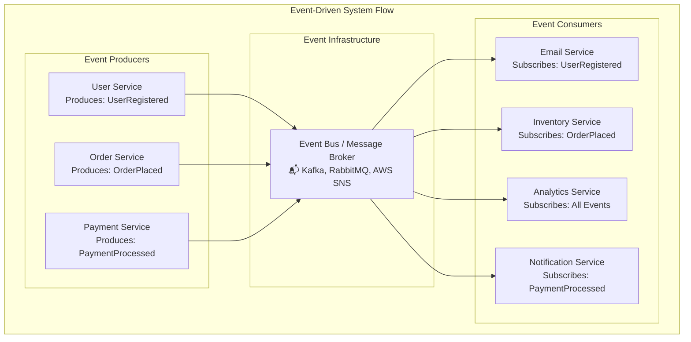

## 🏗️ Event-Driven Patterns

### 1. **Publish-Subscribe Pattern**

The most common event-driven pattern:

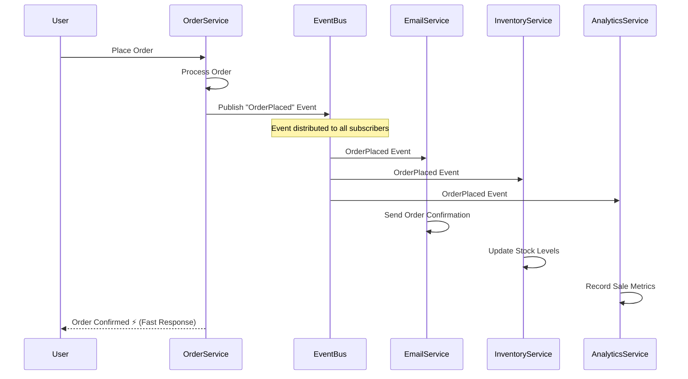

**Key Benefits**:
- **Fast Response**: OrderService responds immediately without waiting
- **Loose Coupling**: Services don't know about each other
- **Easy to Add Features**: New services can subscribe to existing events

### 2. **Event Sourcing Pattern**

Store events as the source of truth:

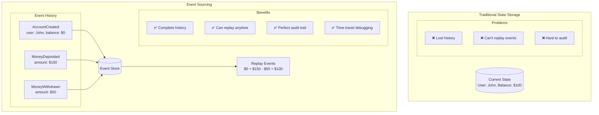

### 3. **CQRS Pattern** (Command Query Responsibility Segregation)

Separate read and write models:

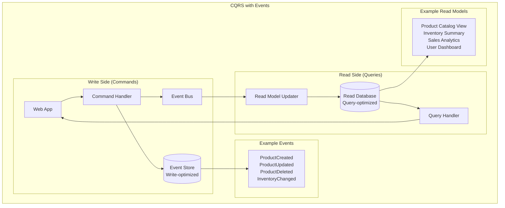

## 🌍 Real-World Examples

### 1. **Netflix Event-Driven Architecture**

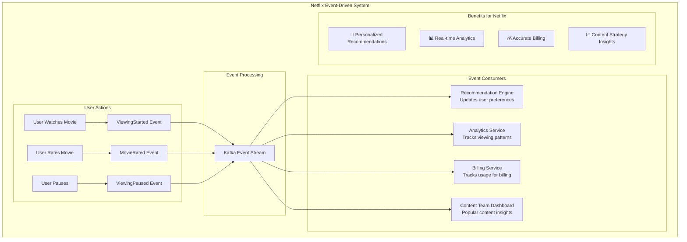

**Netflix's Event Strategy**:
- **Billions of events daily** from user interactions
- **Real-time recommendations** updated within seconds
- **A/B testing** powered by event data
- **Content decisions** based on viewing patterns

### 2. **Uber's Event-Driven Ride Matching**

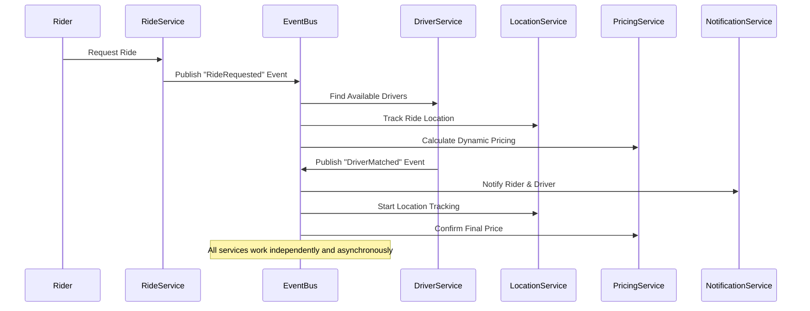

### 3. **E-commerce Order Processing**

```mermaid
graph TB
    subgraph "E-commerce Event Flow"
        subgraph "Order Placement"
            Customer[Customer Places Order] --> OrderEvent[OrderPlaced Event]
        end
        
        subgraph "Immediate Responses"
            OrderEvent --> PaymentService[Payment Service<br/>Process Payment]
            OrderEvent --> InventoryService[Inventory Service<br/>Reserve Items]
            OrderEvent --> EmailService[Email Service<br/>Send Confirmation]
        end
        
        subgraph "Payment Success"
            PaymentService --> PaymentSuccessEvent[PaymentProcessed Event]
            PaymentSuccessEvent --> FulfillmentService[Fulfillment Service<br/>Prepare Shipment]
            PaymentSuccessEvent --> LoyaltyService[Loyalty Service<br/>Award Points]
        end
        
        subgraph "Shipment Events"
            FulfillmentService --> ShipmentEvent[ItemShipped Event]
            ShipmentEvent --> TrackingService[Tracking Service<br/>Send Updates]
            ShipmentEvent --> CustomerService[Customer Service<br/>Update Status]
        end
        
        subgraph "Analytics"
            OrderEvent --> Analytics[Analytics Service]
            PaymentSuccessEvent --> Analytics
            ShipmentEvent --> Analytics
        end
    end
```

## 🛠️ Implementation Patterns

### 1. **Event Bus Implementation**

```mermaid
graph TB
    subgraph "Event Bus Architecture"
        subgraph "Publishers"
            ServiceA[Service A] --> PublishAPI[Publish API]
            ServiceB[Service B] --> PublishAPI
            ServiceC[Service C] --> PublishAPI
        end
        
        subgraph "Event Bus Core"
            PublishAPI --> EventRouter[Event Router]
            EventRouter --> TopicA[Topic: user-events]
            EventRouter --> TopicB[Topic: order-events]
            EventRouter --> TopicC[Topic: payment-events]
        end
        
        subgraph "Subscribers"
            TopicA --> SubscriberA1[Email Service]
            TopicA --> SubscriberA2[Analytics Service]
            TopicB --> SubscriberB1[Inventory Service]
            TopicB --> SubscriberB2[Fulfillment Service]
            TopicC --> SubscriberC1[Notification Service]
        end
        
        subgraph "Features"
            Features[🔄 Message Persistence<br/>⚡ At-least-once Delivery<br/>📊 Dead Letter Queues<br/>🎯 Topic Filtering<br/>📈 Monitoring & Metrics]
        end
    end
```

### 2. **Event Schema Evolution**

```mermaid
graph TB
    subgraph "Event Schema Versioning"
        subgraph "Version 1"
            V1[UserRegistered v1<br/>{<br/>  userId: "123",<br/>  email: "john@example.com"<br/>}]
        end
        
        subgraph "Version 2 (Backward Compatible)"
            V2[UserRegistered v2<br/>{<br/>  userId: "123",<br/>  email: "john@example.com",<br/>  firstName: "John", // New field<br/>  lastName: "Doe"    // New field<br/>}]
        end
        
        subgraph "Version 3 (Breaking Change)"
            V3[UserRegistered v3<br/>{<br/>  userId: "123",<br/>  contactInfo: {     // Changed structure<br/>    email: "john@example.com",<br/>    phone: "+1234567890"<br/>  },<br/>  name: {<br/>    first: "John",<br/>    last: "Doe"<br/>  }<br/>}]
        end
        
        subgraph "Migration Strategy"
            Strategy[🔄 Support multiple versions<br/>📅 Gradual migration<br/>🔄 Event transformation<br/>📋 Schema registry]
        end
    end
```

### 3. **Error Handling and Retry Logic**

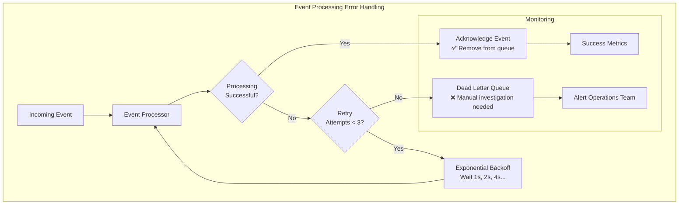

## 📊 Event Storage and Processing

### 1. **Event Store Design**

```mermaid
graph TB
    subgraph "Event Store Architecture"
        subgraph "Event Ingestion"
            Producer[Event Producer] --> Validator[Event Validator]
            Validator --> Enricher[Event Enricher<br/>Add metadata]
            Enricher --> Partitioner[Event Partitioner<br/>Distribute load]
        end
        
        subgraph "Storage Layer"
            Partitioner --> Partition1[(Partition 1<br/>Events 1-1000)]
            Partitioner --> Partition2[(Partition 2<br/>Events 1001-2000)]
            Partitioner --> Partition3[(Partition 3<br/>Events 2001-3000)]
        end
        
        subgraph "Event Retrieval"
            Partition1 --> EventQuery[Event Query Engine]
            Partition2 --> EventQuery
            Partition3 --> EventQuery
            EventQuery --> Consumer[Event Consumer]
        end
        
        subgraph "Features"
            Features[📝 Immutable events<br/>🕐 Ordered by timestamp<br/>🔍 Queryable by aggregate<br/>📦 Snapshotting<br/>🔄 Event replay capability]
        end
    end
```

### 2. **Stream Processing**

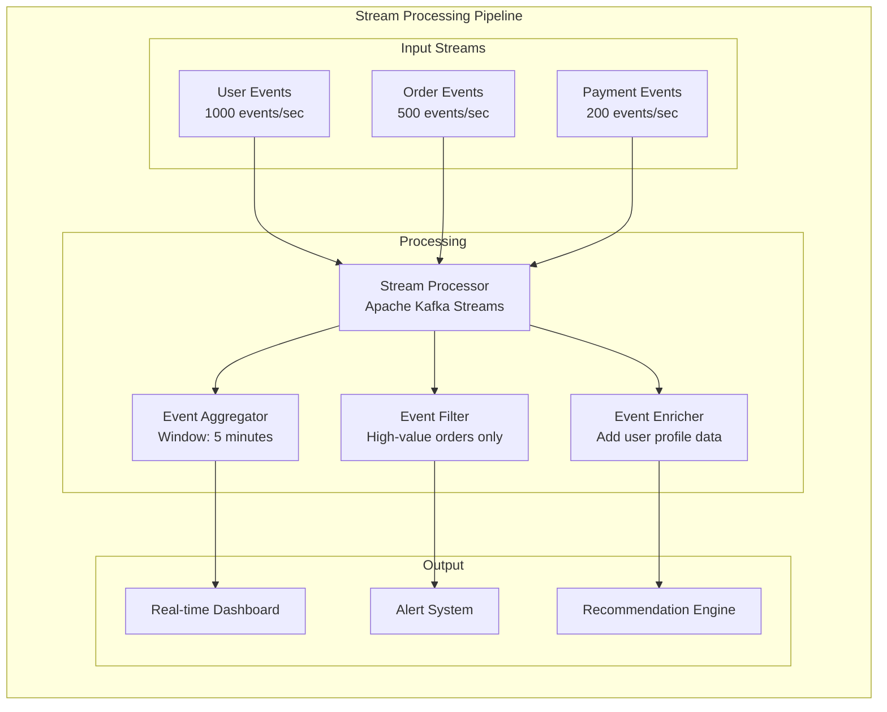

## 🔄 Event Patterns for Different Use Cases

### 1. **Saga Pattern for Distributed Transactions**

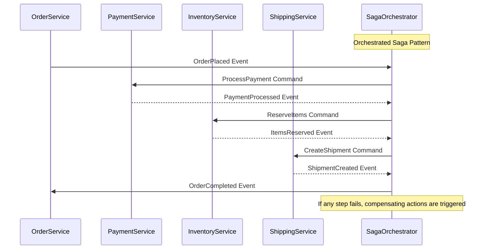

### 2. **Event Replay for System Recovery**

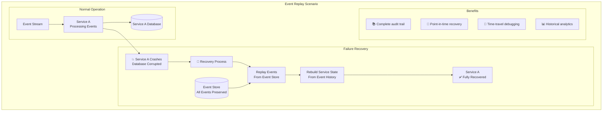

### 3. **Event-Driven Microservices Communication**

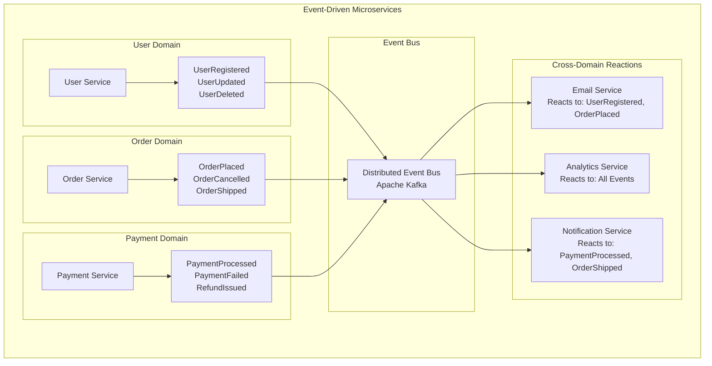

## ⚖️ Trade-offs and Considerations

### Benefits ✅

1. **Loose Coupling**
   - Services don't need to know about each other
   - Easy to add new features without modifying existing code
   - Independent scaling and deployment

2. **Scalability**
   - Asynchronous processing handles traffic spikes
   - Horizontal scaling of event consumers
   - Load distribution across multiple services

3. **Resilience**
   - System continues working if some components fail
   - Event replay capability for recovery
   - Graceful degradation possible

4. **Auditability**
   - Complete history of what happened
   - Compliance and debugging capabilities
   - Business intelligence from event data

### Challenges ❌

1. **Complexity**
   - Distributed system debugging is harder
   - Event ordering and consistency challenges
   - More moving parts to manage

2. **Eventual Consistency**
   - Data might be temporarily inconsistent
   - Need to handle duplicate events
   - Complex business logic across services

3. **Event Schema Evolution**
   - Backward compatibility requirements
   - Versioning strategy needed
   - Consumer updates coordination

4. **Operational Overhead**
   - Message broker infrastructure
   - Monitoring and alerting complexity
   - Dead letter queue management

### Performance Considerations

```mermaid
graph LR
    subgraph "Performance Trade-offs"
        subgraph "Synchronous"
            Sync[Synchronous Calls<br/>⚡ Immediate consistency<br/>🐌 Slower response<br/>💥 Cascade failures]
        end
        
        subgraph "Asynchronous"
            Async[Event-Driven<br/>⚡ Fast response<br/>🔄 Eventual consistency<br/>🛡️ Failure isolation]
        end
        
        subgraph "Hybrid"
            Hybrid[Hybrid Approach<br/>🎯 Critical: Synchronous<br/>📊 Analytics: Asynchronous<br/>⚖️ Best of both worlds]
        end
    end
```

## 🎯 When to Use Event-Driven Architecture

### ✅ Use Event-Driven Architecture When:

1. **Microservices Architecture**: Need loose coupling between services
2. **High Scalability Requirements**: Need to handle traffic spikes
3. **Complex Business Workflows**: Multiple steps with different timing
4. **Real-time Analytics**: Need immediate insights from data
5. **Integration with Multiple Systems**: Many systems need the same data
6. **Audit Requirements**: Need complete history of changes

### ❌ Avoid Event-Driven Architecture When:

1. **Simple CRUD Applications**: Basic create, read, update, delete operations
2. **Strong Consistency Requirements**: Need immediate consistency
3. **Small Team/Application**: Overhead exceeds benefits
4. **Limited Infrastructure**: Can't manage message brokers
5. **Synchronous Business Logic**: Process must complete in order

### Decision Matrix

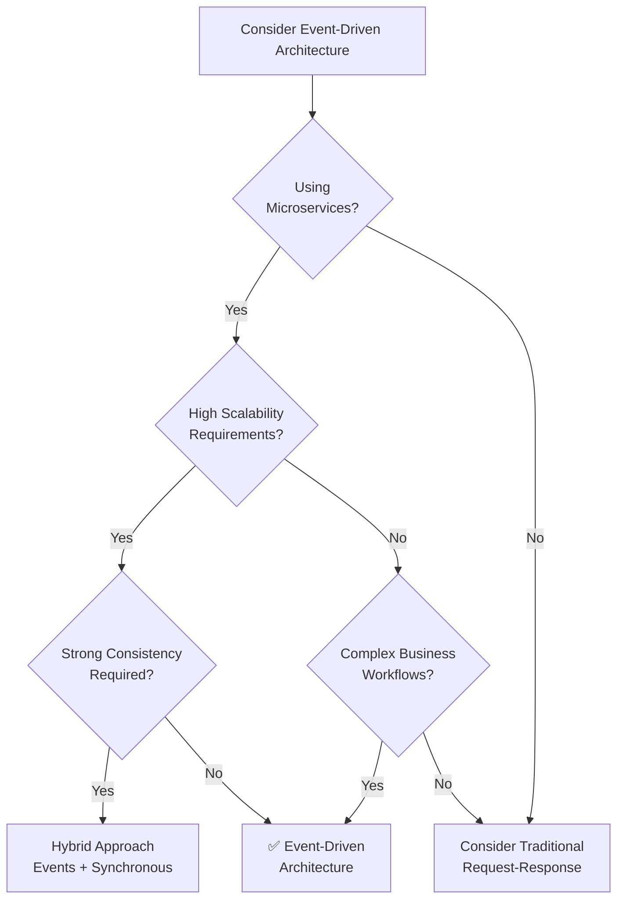

## 🚀 Implementation Best Practices

### 1. **Event Design Principles**

```yaml
# Good Event Design
event_name: "OrderPlaced"  # Past tense, specific
event_data:
  eventId: "uuid"          # Unique identifier
  eventType: "OrderPlaced" # Event type
  aggregateId: "order123"  # What entity this relates to
  timestamp: "2024-01-01T12:00:00Z"  # When it happened
  version: 1               # Schema version
  data:                    # The actual event data
    orderId: "order123"
    customerId: "customer456"
    items: [...]
    totalAmount: 99.99
  metadata:                # Additional context
    source: "order-service"
    correlationId: "trace123"
```

### 2. **Error Handling Strategy**

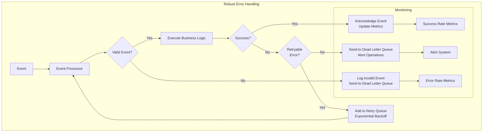

### 3. **Event Store Implementation**

```mermaid
graph TB
    subgraph "Production Event Store"
        subgraph "Write Path"
            Producer[Event Producer] --> Validator[Schema Validator]
            Validator --> Deduplicator[Deduplicator<br/>Prevent duplicates]
            Deduplicator --> Partitioner[Partitioner<br/>Distribute load]
            Partitioner --> Storage[(Distributed Storage<br/>Kafka/EventStore)]
        end
        
        subgraph "Read Path"
            Storage --> IndexBuilder[Index Builder<br/>Build query indexes]
            IndexBuilder --> QueryEngine[Query Engine<br/>Support different queries]
            QueryEngine --> Consumer[Event Consumer]
        end
        
        subgraph "Operational Features"
            Storage --> Backup[Backup & Archive<br/>Long-term storage]
            Storage --> Monitoring[Monitoring<br/>Metrics & Alerts]
            Storage --> Replay[Replay Engine<br/>Event replay capability]
        end
    end
```

## 📚 Key Takeaways

### Event-Driven Architecture Principles ✅

1. **Events are facts** - they describe what happened, not what should happen
2. **Publishers don't know subscribers** - loose coupling is key
3. **Events are immutable** - once published, they shouldn't change
4. **Design for failure** - handle duplicates, ordering, and failures
5. **Monitor everything** - events, processing, and business metrics

### Implementation Checklist ✅

- [ ] Choose appropriate message broker (Kafka, RabbitMQ, AWS SNS/SQS)
- [ ] Design event schema with versioning strategy
- [ ] Implement proper error handling and retry logic
- [ ] Set up monitoring and alerting
- [ ] Plan for event replay and recovery
- [ ] Consider event ordering requirements
- [ ] Design for idempotency
- [ ] Implement circuit breakers for external dependencies

### Common Pitfalls to Avoid ❌

1. **Event coupling** - making events too specific to consumers
2. **Missing idempotency** - not handling duplicate events
3. **Poor error handling** - losing events due to failures
4. **Ignoring ordering** - assuming events arrive in order
5. **Over-eventing** - creating events for everything
6. **Inadequate monitoring** - not tracking event flow and failures

### Remember
> "Event-Driven Architecture is not just about sending messages - it's about building systems that can evolve, scale, and recover gracefully by treating events as first-class citizens."

Event-Driven Architecture is a powerful pattern for building scalable, resilient systems. The key is understanding when to use it and implementing it with proper error handling, monitoring, and operational practices.
