# Load Balancing Patterns

## ⚖️ What is Load Balancing?

Load balancing is like having a **smart traffic director** at a busy intersection who guides cars to the least congested lanes. Instead of all traffic going to one lane (server), the load balancer **distributes requests across multiple servers** to ensure no single server gets overwhelmed.

Think of it like a **restaurant host** who seats customers across multiple tables and servers, ensuring everyone gets good service and no server is overloaded.

## 🏠 Real-World Analogy

```mermaid
graph TB
    subgraph "Restaurant Without Host (No Load Balancer)"
        Customers1[Many Customers] --> Table1[Table 1<br/>Overloaded Server]
        Customers1 --> EmptyTables[Tables 2,3,4<br/>Empty & Idle]
        
        subgraph "Problems"
            P1[😰 One server stressed]
            P2[💸 Wasted resources]
            P3[⏱️ Long wait times]
            P4[😞 Poor customer experience]
        end
    end
    
    subgraph "Restaurant With Smart Host (Load Balancer)"
        Customers2[Many Customers] --> Host[Smart Host<br/>Load Balancer]
        
        Host --> Table2[Table 1<br/>Balanced Load]
        Host --> Table3[Table 2<br/>Balanced Load]
        Host --> Table4[Table 3<br/>Balanced Load]
        Host --> Table5[Table 4<br/>Balanced Load]
        
        subgraph "Benefits"
            B1[😊 All servers happy]
            B2[⚡ Efficient resource use]
            B3[🚀 Fast service]
            B4[✨ Great experience]
        end
    end
```

## 🎯 Load Balancing Architecture

### Basic Load Balancer Setup

```mermaid
graph TB
    subgraph "Load Balancing Architecture"
        subgraph "Clients"
            User1[User 1]
            User2[User 2]
            User3[User 3]
            User4[User 4]
        end
        
        subgraph "Load Balancer"
            LB[Load Balancer<br/>🎯 Traffic Distribution<br/>❤️ Health Checking<br/>📊 Monitoring]
        end
        
        subgraph "Server Pool"
            Server1[Server 1<br/>✅ Healthy<br/>CPU: 60%]
            Server2[Server 2<br/>✅ Healthy<br/>CPU: 45%]
            Server3[Server 3<br/>❌ Unhealthy<br/>CPU: 95%]
            Server4[Server 4<br/>✅ Healthy<br/>CPU: 30%]
        end
        
        User1 --> LB
        User2 --> LB
        User3 --> LB
        User4 --> LB
        
        LB --> Server1
        LB --> Server2
        LB -.->|Skip unhealthy| Server3
        LB --> Server4
        
        subgraph "Health Checks"
            LB -.->|Regular health checks| Server1
            LB -.->|Regular health checks| Server2
            LB -.->|Regular health checks| Server3
            LB -.->|Regular health checks| Server4
        end
    end
```

## 🔄 Load Balancing Algorithms

### 1. **Round Robin** (Most Common)

**Like taking turns** - each server gets requests in order.


**Pros & Cons:**
- ✅ **Simple and fair** - everyone gets equal requests
- ✅ **Easy to implement** and understand
- ❌ **Doesn't consider server capacity** - treats all servers equally
- ❌ **Can overload slower servers**

### 2. **Weighted Round Robin**

**Give more work to stronger servers** - like assigning more tables to experienced waiters.


**Real-World Example:**
```
Server A: 16 CPU cores, Weight = 4
Server B: 8 CPU cores,  Weight = 2  
Server C: 4 CPU cores,  Weight = 1

Result: A gets 4/7 of traffic, B gets 2/7, C gets 1/7
```

### 3. **Least Connections**

**Send to the server with fewest active connections** - like seating customers at the table with the fewest people.

```mermaid
graph TB
    subgraph "Least Connections Algorithm"
        Request[New Request] --> LB[Load Balancer<br/>Checks active connections]
        
        subgraph "Server Status"
            Server1[Server 1<br/>Active Connections: 25]
            Server2[Server 2<br/>Active Connections: 12 ⭐]
            Server3[Server 3<br/>Active Connections: 18]
        end
        
        LB --> Check{Which server has<br/>least connections?}
        Check --> Server2
        
        subgraph "Decision"
            Decision[Route to Server 2<br/>It has the least load]
        end
    end
```

**Best For:**
- **Long-running requests** (file uploads, video streaming)
- **Varying request processing times**
- **WebSocket connections**

### 4. **Least Response Time**

**Send to the fastest responding server** - like choosing the quickest checkout line.


### 5. **IP Hash (Sticky Sessions)**

**Same user always goes to same server** - like having a regular table at your favorite restaurant.

```mermaid
graph TB
    subgraph "IP Hash Load Balancing"
        subgraph "Users"
            User1[User 1<br/>IP: 192.168.1.10]
            User2[User 2<br/>IP: 192.168.1.20]
            User3[User 3<br/>IP: 192.168.1.30]
        end
        
        subgraph "Hash Function"
            HashFunc[Hash Function<br/>hash(IP) % server_count]
        end
        
        User1 --> HashFunc
        User2 --> HashFunc
        User3 --> HashFunc
        
        subgraph "Server Assignment"
            HashFunc -->|hash(10) % 3 = 1| Server1[Server 1<br/>Always gets User 1]
            HashFunc -->|hash(20) % 3 = 2| Server2[Server 2<br/>Always gets User 2]
            HashFunc -->|hash(30) % 3 = 0| Server3[Server 3<br/>Always gets User 3]
        end
        
        subgraph "Benefits"
            B1[🍪 Session persistence]
            B2[💾 Local caching benefits]
            B3[🔄 Consistent user experience]
        end
    end
```

**Use Cases:**
- **Shopping carts** stored in server memory
- **User sessions** without shared storage
- **Personalized caching** per user

## 🏗️ Load Balancer Types

### 1. **Layer 4 (Transport) Load Balancer**

**Works at the network level** - doesn't look inside the data, just forwards packets.

```mermaid
graph TB
    subgraph "Layer 4 Load Balancing"
        Client[Client] --> L4LB[Layer 4 Load Balancer<br/>Operates on IP + Port<br/>Fast packet forwarding]
        
        L4LB --> Server1[Web Server 1<br/>Port 80]
        L4LB --> Server2[Web Server 2<br/>Port 80]
        L4LB --> Server3[Web Server 3<br/>Port 80]
        
        subgraph "Characteristics"
            Fast[⚡ Very Fast<br/>Low latency]
            Simple[🔧 Simple<br/>No content inspection]
            Protocol[🌐 Protocol agnostic<br/>TCP, UDP, etc.]
        end
        
        subgraph "Limitations"
            NoContent[❌ Can't route based on content]
            NoSSL[❌ Can't terminate SSL]
            NoCompression[❌ No compression/caching]
        end
    end
```

### 2. **Layer 7 (Application) Load Balancer**

**Understands the application** - can make routing decisions based on content.

```mermaid
graph TB
    subgraph "Layer 7 Load Balancing"
        Client[Client] --> L7LB[Layer 7 Load Balancer<br/>Understands HTTP<br/>Content-based routing]
        
        subgraph "Routing Rules"
            L7LB -->|/api/users/*| UserService[User Service<br/>Handles user requests]
            L7LB -->|/api/orders/*| OrderService[Order Service<br/>Handles order requests]
            L7LB -->|/api/products/*| ProductService[Product Service<br/>Handles product requests]
            L7LB -->|Static files| CDN[CDN<br/>Static content]
        end
        
        subgraph "Advanced Features"
            SSL[🔒 SSL Termination]
            Compression[📦 Content Compression]
            Caching[💾 Response Caching]
            WAF[🛡️ Web Application Firewall]
        end
    end
```

### Comparison: Layer 4 vs Layer 7

```mermaid
graph LR
    subgraph "Layer 4 (Network)"
        L4Features[⚡ Faster<br/>🔧 Simpler<br/>💰 Cheaper<br/>🌐 Protocol agnostic]
        L4Use[🎯 High-volume traffic<br/>📡 TCP/UDP services<br/>🚀 Need maximum speed]
    end
    
    subgraph "Layer 7 (Application)"
        L7Features[🧠 Intelligent routing<br/>🔒 SSL termination<br/>📊 Rich monitoring<br/>🛡️ Security features]
        L7Use[🌐 Web applications<br/>🎯 Microservices<br/>📱 API gateways<br/>🔧 Complex routing needs]
    end
```

## 🌍 Real-World Load Balancing Examples

### 1. **Netflix Global Load Balancing**

```mermaid
graph TB
    subgraph "Netflix Global Architecture"
        subgraph "Global Traffic"
            Users[100M+ Users Worldwide] --> DNS[Route 53 DNS<br/>Geographic routing]
        end
        
        subgraph "Regional Load Balancers"
            DNS --> USEast[US East Load Balancer<br/>AWS ELB]
            DNS --> USWest[US West Load Balancer<br/>AWS ELB]
            DNS --> Europe[Europe Load Balancer<br/>AWS ELB]
            DNS --> Asia[Asia Load Balancer<br/>AWS ELB]
        end
        
        subgraph "Service Load Balancing"
            USEast --> Zuul[Zuul Gateway<br/>Layer 7 Load Balancer]
            Zuul --> UserService[User Service<br/>Multiple instances]
            Zuul --> ContentService[Content Service<br/>Multiple instances]
            Zuul --> RecommendationService[Recommendation Service<br/>Multiple instances]
        end
        
        subgraph "Netflix Strategy"
            Strategy[🌍 Geographic distribution<br/>⚡ Multiple load balancer layers<br/>🎯 Service-specific routing<br/>🔄 Automatic failover]
        end
    end
```

**Netflix's Multi-Layer Strategy:**
1. **DNS-based geographic routing** - route users to nearest region
2. **Regional load balancers** - distribute within region
3. **Service mesh load balancing** - route between microservices
4. **Chaos engineering** - intentionally test failure scenarios

### 2. **Amazon's Elastic Load Balancing**

```mermaid
graph TB
    subgraph "Amazon ELB Architecture"
        subgraph "Traffic Sources"
            WebTraffic[Web Traffic] --> ALB[Application Load Balancer<br/>Layer 7 - HTTP/HTTPS]
            APITraffic[API Traffic] --> ALB
            TCPTraffic[TCP Traffic] --> NLB[Network Load Balancer<br/>Layer 4 - TCP/UDP]
            InternalTraffic[Internal Services] --> NLB
        end
        
        subgraph "Target Groups"
            ALB --> WebServers[Web Server Target Group<br/>Auto Scaling Group]
            ALB --> APIServers[API Server Target Group<br/>Container instances]
            NLB --> DatabaseCluster[Database Cluster<br/>Primary + Replicas]
        end
        
        subgraph "Features"
            HealthChecks[❤️ Health Checks]
            AutoScaling[📈 Auto Scaling Integration]
            SSL[🔒 SSL/TLS Termination]
            WAF[🛡️ WAF Integration]
            Monitoring[📊 CloudWatch Metrics]
        end
    end
```

### 3. **Google Cloud Load Balancing**

```mermaid
graph TB
    subgraph "Google Cloud Global Load Balancing"
        subgraph "Global Infrastructure"
            Users[Global Users] --> GlobalLB[Google Global Load Balancer<br/>Anycast IP]
        end
        
        subgraph "Regional Distribution"
            GlobalLB --> USRegion[US Region<br/>Multiple zones]
            GlobalLB --> EuropeRegion[Europe Region<br/>Multiple zones]
            GlobalLB --> AsiaRegion[Asia Region<br/>Multiple zones]
        end
        
        subgraph "Advanced Features"
            USRegion --> CDN[Cloud CDN<br/>Edge caching]
            USRegion --> WAF[Cloud Armor<br/>DDoS protection]
            USRegion --> AutoScale[Auto Scaling<br/>Based on load]
        end
        
        subgraph "Google's Advantages"
            Advantages[🌐 Global Anycast network<br/>⚡ Single global IP<br/>🛡️ Built-in DDoS protection<br/>📊 Integrated monitoring]
        end
    end
```

## 🔧 Advanced Load Balancing Patterns

### 1. **Health Checks and Failover**

```mermaid
graph TB
    subgraph "Health Check System"
        LB[Load Balancer] --> HealthChecker[Health Check Service]
        
        subgraph "Health Check Types"
            HealthChecker --> TCPCheck[TCP Check<br/>Can connect to port?]
            HealthChecker --> HTTPCheck[HTTP Check<br/>GET /health returns 200?]
            HealthChecker --> CustomCheck[Custom Check<br/>Application-specific logic]
        end
        
        subgraph "Server Pool"
            TCPCheck --> Server1[Server 1 ✅<br/>Healthy]
            HTTPCheck --> Server2[Server 2 ❌<br/>Unhealthy]
            CustomCheck --> Server3[Server 3 ✅<br/>Healthy]
        end
        
        subgraph "Actions"
            Server1 --> ReceiveTraffic[Receives Traffic]
            Server2 --> NoTraffic[No Traffic<br/>Until healthy]
            Server3 --> ReceiveTraffic
        end
        
        subgraph "Health Check Configuration"
            Config[⏱️ Check interval: 30s<br/>🔄 Timeout: 5s<br/>❌ Unhealthy threshold: 3 failures<br/>✅ Healthy threshold: 2 successes]
        end
    end
```

### 2. **Circuit Breaker Integration**

```mermaid
graph TB
    subgraph "Load Balancer + Circuit Breaker"
        Request[Request] --> LB[Load Balancer]
        
        LB --> CB1[Circuit Breaker 1<br/>Server 1]
        LB --> CB2[Circuit Breaker 2<br/>Server 2]
        LB --> CB3[Circuit Breaker 3<br/>Server 3]
        
        CB1 --> Server1[Server 1<br/>✅ Healthy]
        CB2 -.->|Circuit Open| Server2[Server 2<br/>💥 Failing]
        CB3 --> Server3[Server 3<br/>✅ Healthy]
        
        subgraph "Benefits"
            Benefits[🛡️ Prevent cascade failures<br/>⚡ Fast failure detection<br/>🔄 Automatic recovery<br/>📊 Per-server monitoring]
        end
    end
```

### 3. **Geographic Load Balancing**

```mermaid
graph TB
    subgraph "Geographic Load Balancing"
        subgraph "Global Users"
            USUsers[US Users] --> GeoDNS[Geographic DNS<br/>Route 53, CloudFlare]
            EUUsers[EU Users] --> GeoDNS
            AsiaUsers[Asia Users] --> GeoDNS
        end
        
        subgraph "Regional Routing"
            GeoDNS -->|Closest region| USDataCenter[US Data Center<br/>us-east-1.example.com]
            GeoDNS -->|Closest region| EUDataCenter[EU Data Center<br/>eu-west-1.example.com]
            GeoDNS -->|Closest region| AsiaDataCenter[Asia Data Center<br/>ap-southeast-1.example.com]
        end
        
        subgraph "Benefits"
            LowerLatency[⚡ Lower latency<br/>Users hit nearest servers]
            Compliance[🏛️ Data sovereignty<br/>EU data stays in EU]
            Resilience[🛡️ Regional failover<br/>If one region fails]
        end
    end
```

### 4. **Session Affinity (Sticky Sessions)**

```mermaid
graph TB
    subgraph "Session Affinity Patterns"
        subgraph "Cookie-Based Affinity"
            User1[User with Cookie] --> LB[Load Balancer<br/>Reads session cookie]
            LB --> Server2[Always routes to<br/>Server 2 for this user]
        end
        
        subgraph "IP-Based Affinity"
            UserIP[User IP: 192.168.1.100] --> HashLB[Hash-based LB<br/>hash(IP) % servers]
            HashLB --> ConsistentServer[Always routes to<br/>same server for this IP]
        end
        
        subgraph "Problems with Stickiness"
            Problems[❌ Uneven load distribution<br/>❌ Server failure loses sessions<br/>❌ Harder to scale<br/>❌ Hot spots possible]
        end
        
        subgraph "Better Alternatives"
            Alternatives[✅ Shared session storage (Redis)<br/>✅ Stateless applications<br/>✅ JWT tokens<br/>✅ Database-backed sessions]
        end
    end
```

## 📊 Load Balancing Metrics and Monitoring

### Key Metrics to Track


### Alerting Strategy

```mermaid
graph TB
    subgraph "Load Balancer Alerting"
        subgraph "Critical Alerts"
            Alert1[🚨 All servers down<br/>Page immediately]
            Alert2[🚨 Error rate > 5%<br/>Page on-call]
            Alert3[🚨 Response time > 5s<br/>High priority]
        end
        
        subgraph "Warning Alerts"
            Alert4[⚠️ Server health degraded<br/>Slack notification]
            Alert5[⚠️ High CPU usage<br/>Email team]
            Alert6[⚠️ Uneven load distribution<br/>Investigation needed]
        end
        
        subgraph "Informational"
            Alert7[ℹ️ Traffic spike detected<br/>Auto-scaling triggered]
            Alert8[ℹ️ New server added<br/>Capacity increased]
        end
    end
```

## ⚖️ Load Balancing Trade-offs

### Algorithm Comparison

```mermaid
graph TB
    subgraph "Load Balancing Algorithm Trade-offs"
        subgraph "Simple Algorithms"
            RoundRobin[Round Robin<br/>✅ Simple & fair<br/>❌ Ignores server capacity<br/>🎯 Use: Equal servers]
            
            Random[Random<br/>✅ Very simple<br/>✅ Good distribution<br/>❌ No optimization<br/>🎯 Use: Stateless apps]
        end
        
        subgraph "Adaptive Algorithms"
            LeastConn[Least Connections<br/>✅ Considers current load<br/>❌ More complex<br/>🎯 Use: Long connections]
            
            LeastTime[Least Response Time<br/>✅ Performance-based<br/>❌ Requires monitoring<br/>🎯 Use: Varying server performance]
        end
        
        subgraph "Specialized Algorithms"
            IPHash[IP Hash<br/>✅ Session persistence<br/>❌ Uneven distribution<br/>🎯 Use: Stateful apps]
            
            Geographic[Geographic<br/>✅ Low latency<br/>❌ Complex setup<br/>🎯 Use: Global applications]
        end
    end
```

### Layer 4 vs Layer 7 Trade-offs

```mermaid
graph LR
    subgraph "Performance vs Features"
        subgraph "Layer 4 Benefits"
            L4Pro[⚡ Higher throughput<br/>💰 Lower cost<br/>🔧 Simpler configuration<br/>📡 Protocol agnostic]
        end
        
        subgraph "Layer 7 Benefits"
            L7Pro[🧠 Content-aware routing<br/>🔒 SSL termination<br/>📊 Rich monitoring<br/>🛡️ Security features<br/>💾 Caching capabilities]
        end
        
        subgraph "Decision Factors"
            Decision[🎯 Application complexity<br/>💰 Budget constraints<br/>🔒 Security requirements<br/>📊 Monitoring needs<br/>⚡ Performance requirements]
        end
    end
```

## 🎯 Choosing the Right Load Balancing Strategy

### Decision Framework

```mermaid
flowchart TD
    Start[Choose Load Balancing Strategy] --> TrafficType{Traffic Type?}
    
    TrafficType -->|HTTP/HTTPS| WebApp[Web Application]
    TrafficType -->|TCP/UDP| NetworkApp[Network Application]
    
    WebApp --> ContentRouting{Need Content-based<br/>Routing?}
    NetworkApp --> L4LB[Layer 4 Load Balancer<br/>Network Load Balancer]
    
    ContentRouting -->|Yes| L7LB[Layer 7 Load Balancer<br/>Application Load Balancer]
    ContentRouting -->|No| SimpleRouting[Simple HTTP Load Balancer]
    
    L7LB --> Algorithm{Choose Algorithm}
    SimpleRouting --> Algorithm
    L4LB --> Algorithm
    
    Algorithm --> SessionState{Stateful<br/>Application?}
    SessionState -->|Yes| StickySession[IP Hash or<br/>Cookie-based Affinity]
    SessionState -->|No| StatelessAlgo[Round Robin or<br/>Least Connections]
    
    StickySession --> Geographic{Global<br/>Application?}
    StatelessAlgo --> Geographic
    
    Geographic -->|Yes| GeoDNS[Geographic DNS +<br/>Regional Load Balancers]
    Geographic -->|No| SingleRegion[Single Region<br/>Load Balancer]
```

### Use Case Recommendations

| Use Case | Load Balancer Type | Algorithm | Why |
|----------|-------------------|-----------|-----|
| **Simple Web App** | Layer 7 (ALB) | Round Robin | Easy setup, content routing |
| **High-Traffic API** | Layer 4 (NLB) | Least Connections | Maximum performance |
| **E-commerce Site** | Layer 7 (ALB) | Weighted Round Robin | Different server capacities |
| **Gaming Backend** | Layer 4 (NLB) | IP Hash | Session persistence needed |
| **Global SaaS** | Geographic DNS + ALB | Least Response Time | Global performance |
| **Microservices** | Service Mesh | Round Robin | Service-to-service communication |

## 🚀 Implementation Best Practices

### 1. **High Availability Setup**

```mermaid
graph TB
    subgraph "Highly Available Load Balancer"
        subgraph "Multiple Load Balancers"
            PrimaryLB[Primary Load Balancer<br/>Active]
            SecondaryLB[Secondary Load Balancer<br/>Standby]
        end
        
        subgraph "Health Monitoring"
            HealthCheck[Health Check Service<br/>Monitors both LBs]
        end
        
        subgraph "Failover Process"
            PrimaryLB -.->|Heartbeat| SecondaryLB
            HealthCheck --> DNSUpdate[DNS Update<br/>Point to secondary]
        end
        
        subgraph "Best Practices"
            BP[🔄 Active-passive setup<br/>❤️ Health check both LBs<br/>⚡ Fast DNS TTL<br/>🧪 Regular failover testing]
        end
    end
```

### 2. **Security Configuration**

```yaml
# Example Load Balancer Security Configuration
load_balancer:
  ssl_termination: true
  ssl_protocols: ["TLSv1.2", "TLSv1.3"]
  
  # Rate limiting
  rate_limiting:
    requests_per_second: 1000
    burst_size: 2000
    
  # Security headers
  security_headers:
    - "X-Frame-Options: DENY"
    - "X-Content-Type-Options: nosniff"
    - "Strict-Transport-Security: max-age=31536000"
    
  # IP filtering
  allowed_ips:
    - "10.0.0.0/8"
    - "192.168.0.0/16"
    
  # DDoS protection
  ddos_protection:
    enabled: true
    threshold: 10000  # requests per minute
```

### 3. **Performance Optimization**

```mermaid
graph TB
    subgraph "Load Balancer Performance Optimization"
        subgraph "Connection Optimization"
            KeepAlive[HTTP Keep-Alive<br/>Reuse connections]
            ConnectionPooling[Connection Pooling<br/>To backend servers]
            Compression[Response Compression<br/>Reduce bandwidth]
        end
        
        subgraph "Caching"
            StaticCache[Static Content Caching<br/>CSS, JS, images]
            APICache[API Response Caching<br/>Cache frequent responses]
            NegativeCache[Negative Caching<br/>Cache 404s temporarily]
        end
        
        subgraph "Resource Management"
            CPUAffinity[CPU Affinity<br/>Pin processes to cores]
            MemoryTuning[Memory Tuning<br/>Optimize buffer sizes]
            NetworkTuning[Network Tuning<br/>TCP window scaling]
        end
    end
```

## 📚 Key Takeaways

### Load Balancing Strategy Selection ✅

1. **Start with Layer 7** for web applications - more features, easier debugging
2. **Use Layer 4** for maximum performance or non-HTTP traffic
3. **Round Robin** is good default - simple and fair
4. **Avoid sticky sessions** when possible - use shared storage instead
5. **Plan for geographic distribution** for global applications
6. **Always implement health checks** - critical for reliability

### Implementation Guidelines ✅

1. **Monitor everything** - traffic, performance, errors, capacity
2. **Test failover scenarios** regularly - don't wait for real failures
3. **Use multiple load balancer layers** - DNS, regional, service-level
4. **Implement proper security** - SSL termination, rate limiting, DDoS protection
5. **Plan for capacity** - auto-scaling integration, capacity monitoring
6. **Document your configuration** - load balancing rules can get complex

### Common Mistakes to Avoid ❌

1. **Single point of failure** - always have backup load balancers
2. **Ignoring health checks** - unhealthy servers cause user impact
3. **Poor algorithm choice** - not matching algorithm to use case
4. **No monitoring** - can't optimize what you can't measure
5. **Inadequate capacity planning** - load balancers can become bottlenecks
6. **Complex sticky session logic** - prefer stateless applications

### Remember
> "Load balancing is not just about distributing traffic - it's about building resilient systems that can handle failures gracefully while providing optimal performance for users."

Load balancing is fundamental to building scalable, reliable systems. The key is understanding your traffic patterns, application requirements, and failure scenarios to choose the right strategy and configuration for your specific needs.

