# Microservices Architecture Pattern

## 🎯 What is Microservices Architecture?

Microservices architecture is a design pattern that structures an application as a **collection of small, independent services** that communicate over well-defined APIs. Instead of building one large application (monolith), you break it down into **multiple smaller services** that each handle a specific business function.

Think of it like a **restaurant kitchen**: Instead of one chef doing everything, you have specialized chefs - one for appetizers, one for main courses, one for desserts. Each chef (service) is an expert in their area and can work independently.

## 🏗️ Architecture Overview

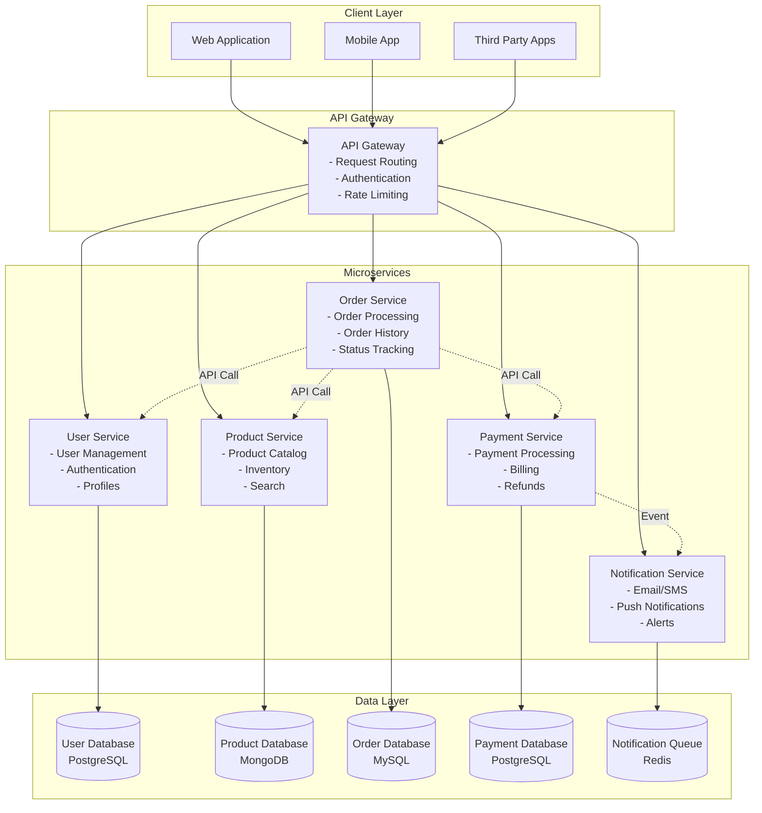

## ✅ When to Use Microservices

### Perfect For:
1. **Large, Complex Applications**: When your app has many different business domains
2. **Multiple Development Teams**: When you have several teams working on different features
3. **Different Technology Needs**: When different parts of your app need different technologies
4. **Independent Scaling**: When different parts of your app have different load patterns
5. **Rapid Development**: When you need to deploy features independently and frequently

### Real-World Example - Netflix:
Netflix has **700+ microservices** including:
- **User Service**: Handles user profiles and preferences
- **Content Service**: Manages movie/show metadata
- **Recommendation Service**: Provides personalized recommendations
- **Streaming Service**: Handles video delivery
- **Billing Service**: Manages subscriptions and payments

Each service can be updated, scaled, and deployed independently!

## 🚫 When NOT to Use Microservices

### Avoid For:
1. **Small Applications**: Simple apps with limited functionality
2. **Small Teams**: Teams with fewer than 10 developers
3. **Tight Coupling**: When services need to share a lot of data
4. **Simple CRUD Operations**: Basic create, read, update, delete applications
5. **Limited Infrastructure**: When you don't have resources for complex operations

### The "Distributed Monolith" Anti-Pattern:
❌ **Wrong**: Creating many services that all depend on each other
✅ **Right**: Creating independent services with minimal dependencies

## 🏢 Core Characteristics

### 1. **Business-Focused Services**
Each service represents a specific business capability:

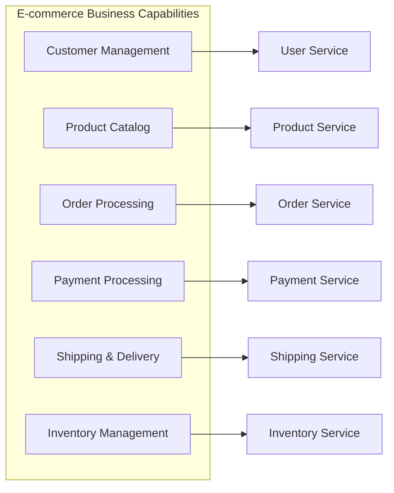

### 2. **Decentralized Data Management**
Each service owns its data:

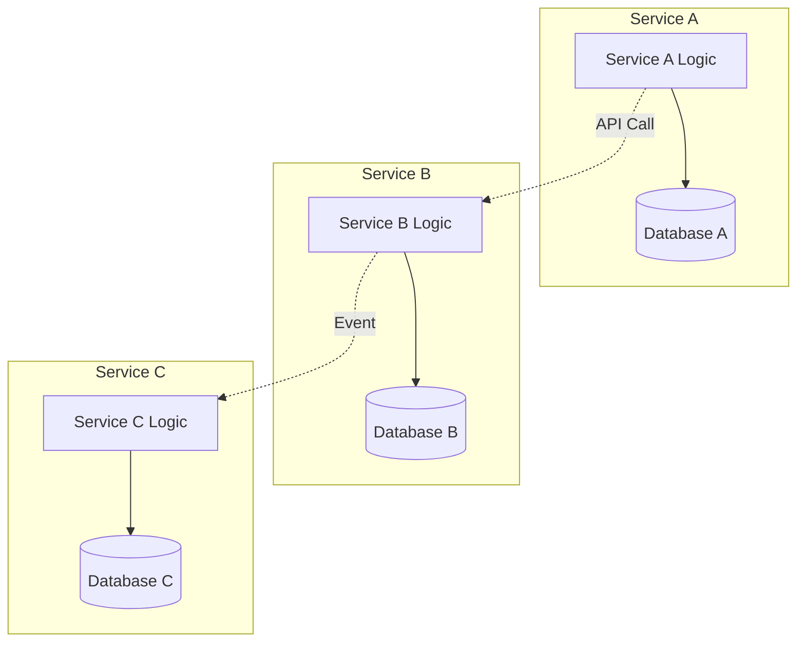

### 3. **Independent Deployment**
Services can be deployed separately:

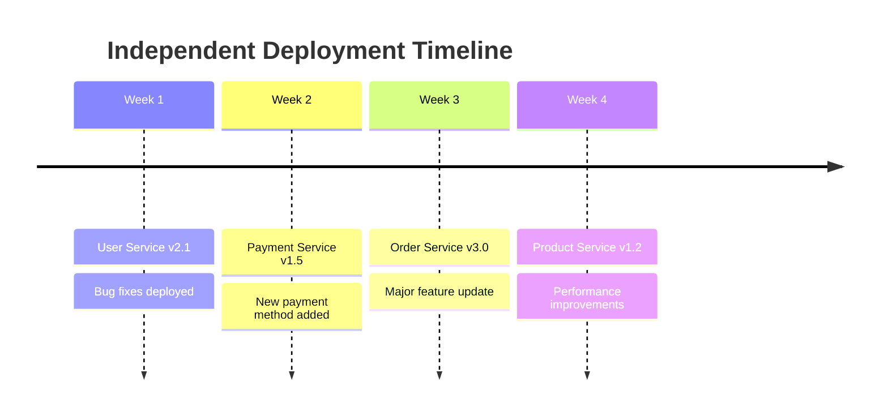

## 🔄 Communication Patterns

### 1. **Synchronous Communication (API Calls)**

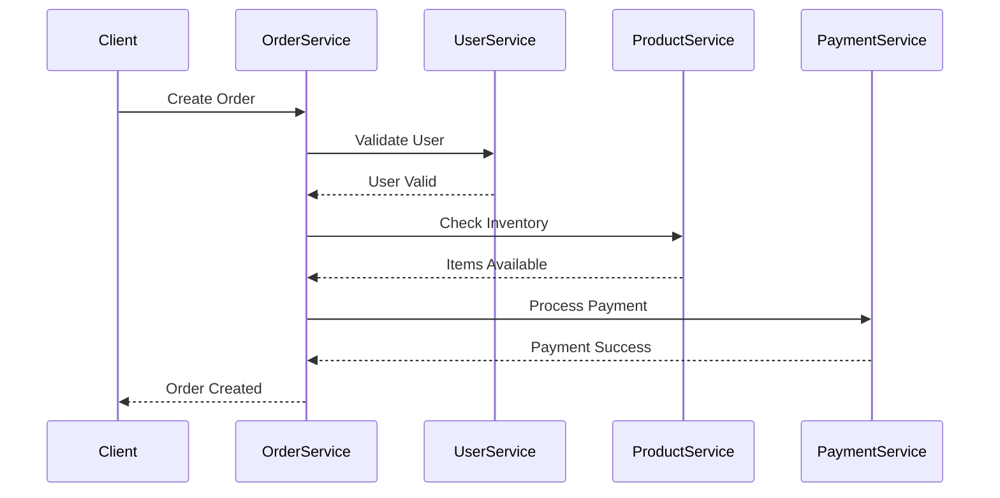

**Best For**: When you need immediate response (user validation, payment processing)

### 2. **Asynchronous Communication (Events)**

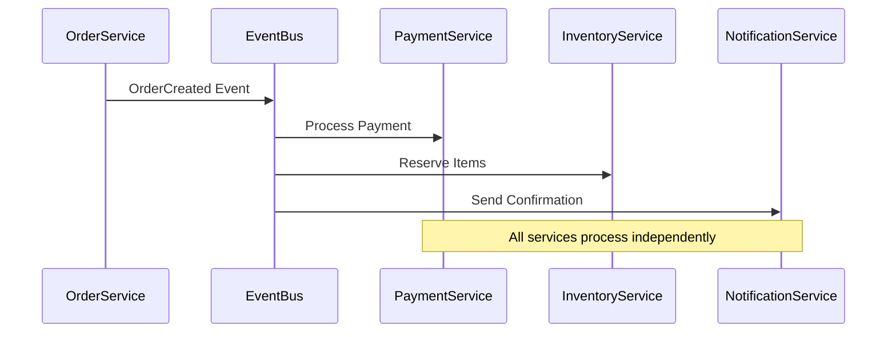

**Best For**: When you don't need immediate response (notifications, analytics, reporting)

## 🗄️ Data Management Strategies

### 1. **Database Per Service Pattern**

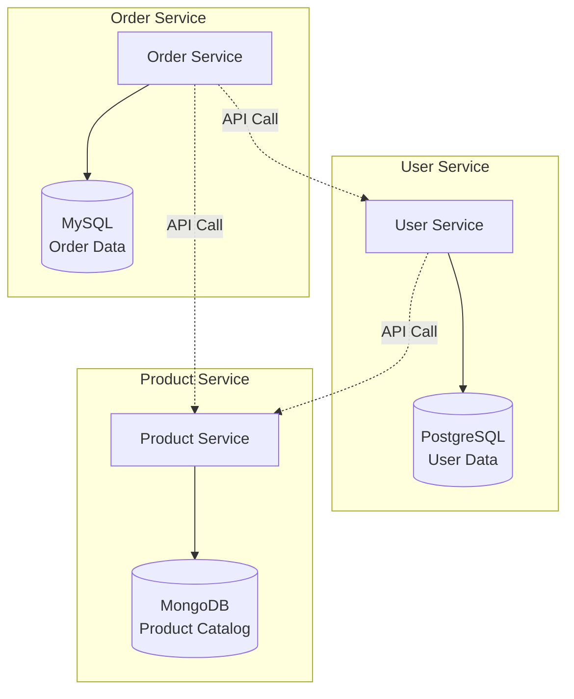

**Benefits**:
- Each service can choose the best database for its needs
- No shared database bottlenecks
- Independent scaling and optimization

### 2. **Event Sourcing for Data Consistency**

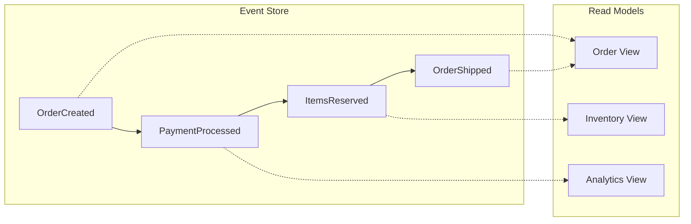

## 🚀 Real-World Implementation Examples

### 1. **Amazon's Microservices Journey**

**Before (Monolith)**:
- One large application handling everything
- Deployment took hours
- One bug could crash the entire system

**After (Microservices)**:
- **800+ independent services**
- Each team owns their services ("You build it, you run it")
- Deployments happen thousands of times per day

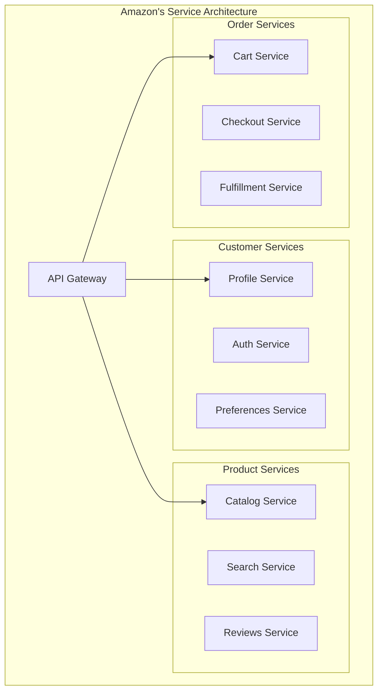

### 2. **Uber's Service Architecture**

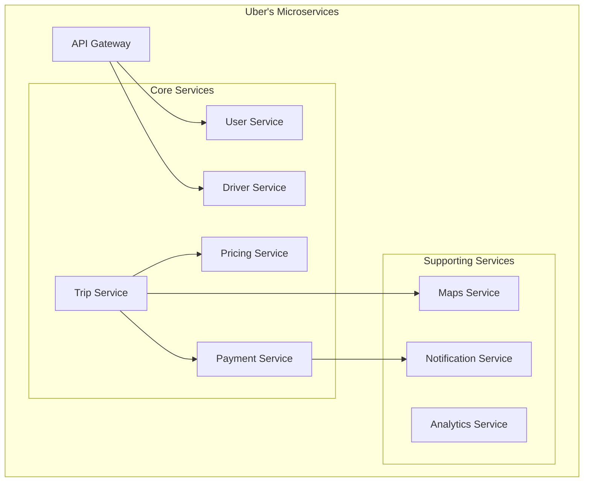

**Key Benefits for Uber**:
- **Independent Scaling**: Surge pricing service scales differently than user service
- **Technology Diversity**: Maps service uses different tech than payment service
- **Team Autonomy**: Each team can deploy independently

## 🛠️ Implementation Best Practices

### 1. **Service Design Principles**

#### Single Responsibility
Each service should have **one clear business purpose**:

✅ **Good**: 
- User Authentication Service
- Product Catalog Service
- Order Processing Service

❌ **Bad**:
- User-Product-Order Service (doing too much)

#### Loose Coupling
Services should be **independent**:

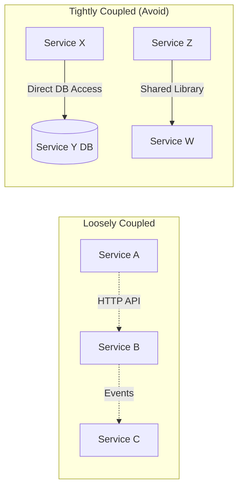

### 2. **API Design Standards**

#### RESTful APIs
```http
GET    /users/{id}           # Get user
POST   /users                # Create user
PUT    /users/{id}           # Update user
DELETE /users/{id}           # Delete user
```

#### Versioning Strategy
```http
GET /v1/users/{id}           # Version 1
GET /v2/users/{id}           # Version 2 (with new fields)
```

### 3. **Error Handling**

#### Circuit Breaker Pattern
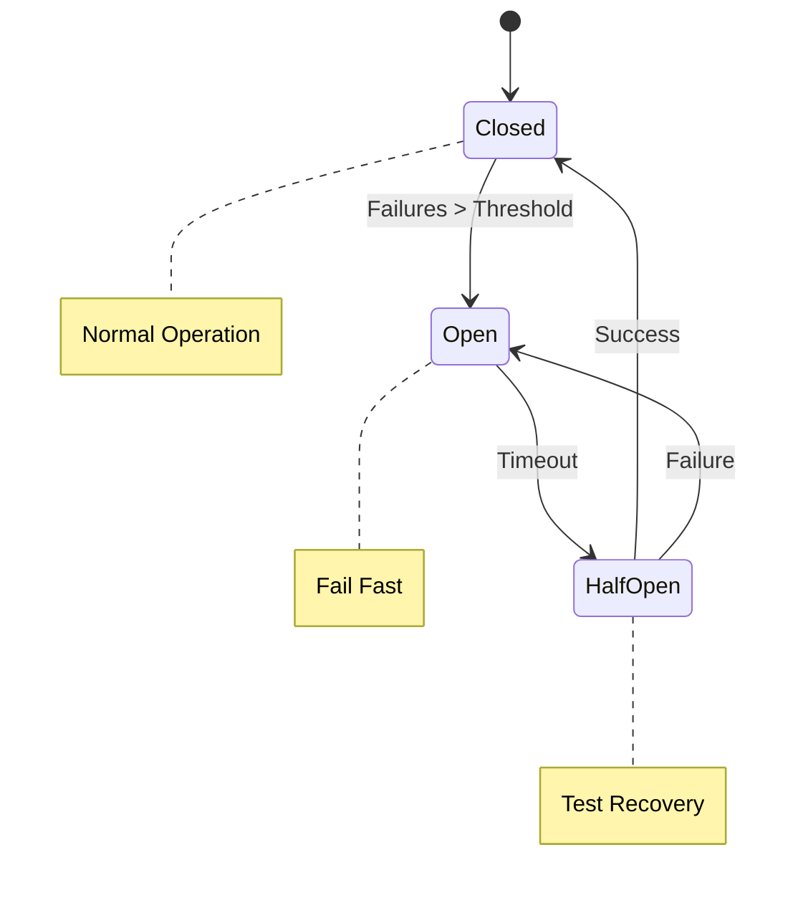

## 📊 Monitoring and Observability

### 1. **Distributed Tracing**

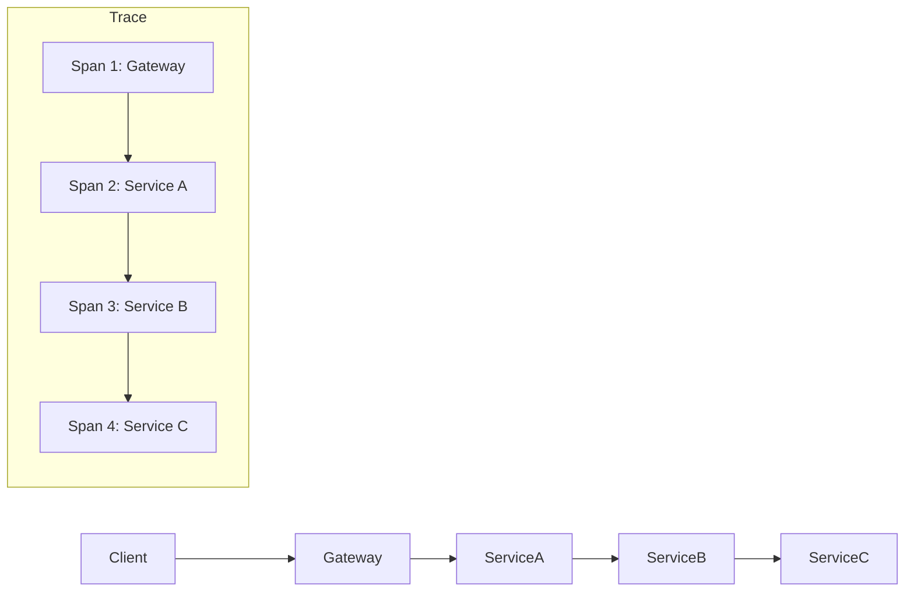

**Tools**: Jaeger, Zipkin, AWS X-Ray

### 2. **Service Mesh for Observability**

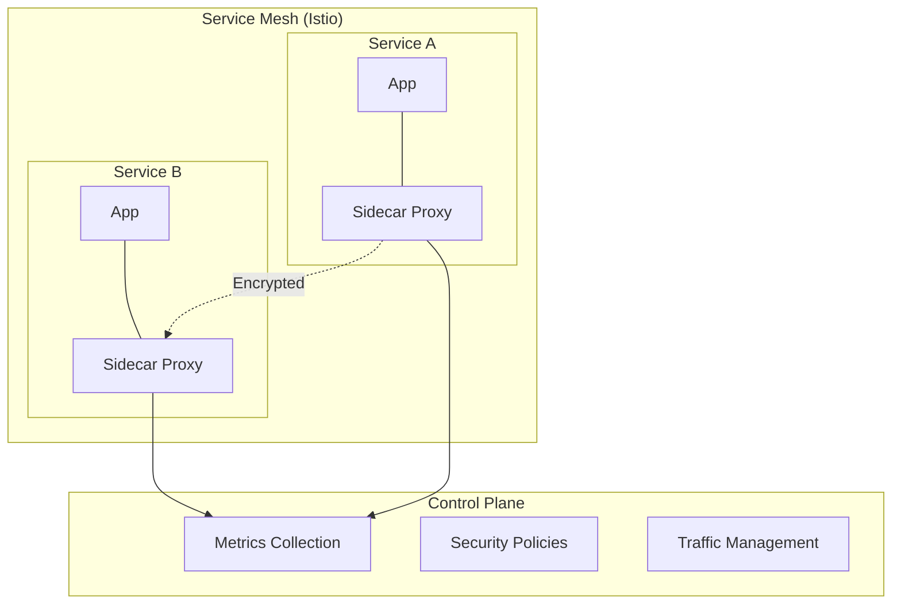

## ⚖️ Trade-offs and Considerations

### Benefits ✅
1. **Independent Development**: Teams can work autonomously
2. **Technology Diversity**: Choose best tech for each service
3. **Scalability**: Scale services independently
4. **Fault Isolation**: One service failure doesn't crash everything
5. **Faster Deployment**: Deploy services independently

### Challenges ❌
1. **Complexity**: More moving parts to manage
2. **Network Latency**: Inter-service communication overhead
3. **Data Consistency**: Managing transactions across services
4. **Testing Complexity**: Integration testing becomes harder
5. **Operational Overhead**: More services to monitor and maintain

### Cost Comparison

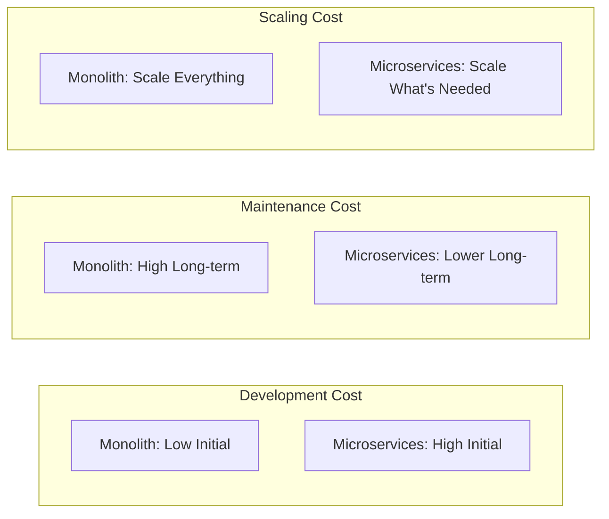

## 🎯 Migration Strategies

### 1. **Strangler Fig Pattern**

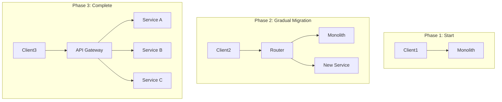

### 2. **Database Decomposition**

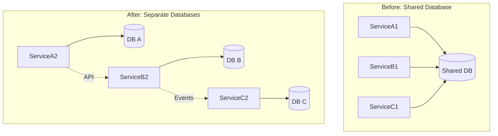

## 📚 Key Takeaways

### Start Simple, Evolve Gradually
1. **Begin with a Monolith**: Don't start with microservices for small applications
2. **Identify Boundaries**: Look for natural business boundaries
3. **Extract Services**: Pull out services one at a time
4. **Measure and Learn**: Monitor the impact of each change

### Success Metrics
- **Deployment Frequency**: How often can you deploy?
- **Lead Time**: Time from code commit to production
- **Recovery Time**: How quickly can you fix issues?
- **Team Autonomy**: Can teams work independently?

### Remember
> "Microservices are not a silver bullet. They solve certain problems but create others. Choose them when the benefits outweigh the costs."

The key is understanding **when** and **why** to use microservices, not just **how** to implement them. Start with understanding your business needs, team structure, and technical requirements before diving into the pattern.
