# Microservices Patterns

## 🏗️ Overview

Microservices patterns are architectural solutions that help you build, deploy, and manage distributed systems composed of small, independent services. This comprehensive guide covers all essential microservices patterns, from basic architecture to advanced deployment strategies.

## 📋 Table of Contents

1. [Microservices Architecture Pattern](#microservices-architecture-pattern)
2. [Service Mesh Pattern](#service-mesh-pattern)
3. [API Gateway Pattern](#api-gateway-pattern)
4. [Backend for Frontend (BFF) Pattern](#backend-for-frontend-bff-pattern)
5. [Service Discovery Pattern](#service-discovery-pattern)
6. [Configuration Management Pattern](#configuration-management-pattern)
7. [Distributed Data Management Pattern](#distributed-data-management-pattern)

---

## 1. Microservices Architecture Pattern

### 🎯 What is Microservices Architecture?

Microservices architecture structures an application as a **collection of small, independent services** that communicate over well-defined APIs. Each service is responsible for a specific business capability and can be developed, deployed, and scaled independently.

### Architecture Overview


### Key Characteristics

- **Single Responsibility**: Each service handles one business capability
- **Decentralized**: Services manage their own data and business logic
- **Independent Deployment**: Services can be deployed separately
- **Technology Diversity**: Each service can use different technologies
- **Fault Isolation**: Failure in one service doesn't affect others

### Real-World Example: Netflix

Netflix operates **700+ microservices** including:
- User Service, Content Service, Recommendation Service
- Each service scales independently based on demand
- Technology diversity: Java, Python, Node.js, etc.

---

## 2. Service Mesh Pattern

### 🕸️ What is Service Mesh?

Service Mesh is an **infrastructure layer** that handles service-to-service communication, providing features like load balancing, service discovery, encryption, and observability without requiring changes to application code.

### Service Mesh Architecture


### Service Mesh Benefits


### Popular Service Mesh Solutions

| Solution | Description | Best For |
|----------|-------------|----------|
| **Istio** | Feature-rich, Kubernetes-native | Complex enterprise environments |
| **Linkerd** | Lightweight, easy to use | Kubernetes environments |
| **Consul Connect** | HashiCorp's solution | Multi-platform environments |
| **AWS App Mesh** | Managed service mesh | AWS environments |

---

## 3. API Gateway Pattern

### 🚪 What is API Gateway?

An API Gateway acts as a **single entry point** for all client requests, providing cross-cutting concerns like authentication, rate limiting, request routing, and response transformation.

### API Gateway Architecture


### API Gateway Features

1. **Request Routing**: Route requests to appropriate backend services
2. **Authentication & Authorization**: Centralized security enforcement
3. **Rate Limiting**: Protect backend services from overload
4. **Request/Response Transformation**: Adapt between client and service formats
5. **Monitoring & Analytics**: Centralized logging and metrics collection
6. **Caching**: Cache frequently requested data

### Implementation Example

```yaml
# API Gateway Configuration Example
routes:
  - path: "/api/users/*"
    service: "user-service"
    methods: ["GET", "POST", "PUT", "DELETE"]
    auth_required: true
    rate_limit: 1000/hour
    
  - path: "/api/products/*"
    service: "product-service"
    methods: ["GET"]
    auth_required: false
    rate_limit: 5000/hour
    cache_ttl: 300
    
  - path: "/api/orders/*"
    service: "order-service"
    methods: ["GET", "POST"]
    auth_required: true
    rate_limit: 500/hour
```

---

## 4. Backend for Frontend (BFF) Pattern

### 📱 What is Backend for Frontend?

BFF creates **dedicated backend services** for each client type (web, mobile, IoT), optimizing the API and data format for each specific frontend's needs.

### BFF Architecture


### BFF Benefits


### Real-World Example: Spotify


---

## 5. Service Discovery Pattern

### 🔍 What is Service Discovery?

Service Discovery enables services to **find and communicate** with each other in a dynamic environment where service instances can start, stop, and move frequently.

### Service Discovery Types

```mermaid
graph TB
    subgraph "Service Discovery Patterns"
        subgraph "Client-Side Discovery"
            ClientSidePattern[Client-Side Discovery<br/>Client queries registry directly]
            ClientSideFlow[Client → Service Registry → Direct Call]
        end
        
        subgraph "Server-Side Discovery"
            ServerSidePattern[Server-Side Discovery<br/>Load balancer queries registry]
            ServerSideFlow[Client → Load Balancer → Service Registry → Service]
        end
        
        subgraph "Service Registry Types"
            SelfRegistration[Self-Registration<br/>Services register themselves]
            ThirdPartyRegistration[Third-Party Registration<br/>Deployment system registers services]
        end
    end
```



### Client-Side Discovery


### Server-Side Discovery


### Popular Service Discovery Solutions

| Solution | Type | Description | Best For |
|----------|------|-------------|----------|
| **Eureka** | Client-Side | Netflix's service registry | Spring Boot applications |
| **Consul** | Both | HashiCorp's service mesh solution | Multi-platform environments |
| **etcd** | Both | Kubernetes' default registry | Kubernetes environments |
| **Zookeeper** | Both | Apache's coordination service | Java-based systems |
| **AWS ELB** | Server-Side | Managed load balancer with service discovery | AWS environments |

### Health Checking

```mermaid
graph TB
    subgraph "Service Health Checking"
        ServiceRegistry[Service Registry] --> HealthChecker[Health Checker]
        
        HealthChecker --> ServiceA[Service A<br/>Status: Healthy ✅]
        HealthChecker --> ServiceB[Service B<br/>Status: Unhealthy ❌]
        HealthChecker --> ServiceC[Service C<br/>Status: Healthy ✅]
        
        subgraph "Health Check Types"
            HTTPCheck[HTTP Health Check<br/>GET /health → 200 OK]
            TCPCheck[TCP Health Check<br/>Can connect to port?]
            CustomCheck[Custom Health Check<br/>Application-specific logic]
        end
        
        subgraph "Actions"
            ServiceA --> ReceiveTraffic[Receives Traffic]
            ServiceB --> NoTraffic[Removed from Load Balancer]
            ServiceC --> ReceiveTraffic
        end
    end
```



---

## 6. Configuration Management Pattern

### ⚙️ What is Configuration Management?

Configuration Management provides a **centralized way** to manage application configuration across all services, environments, and deployments without requiring service restarts.

### Configuration Management Architecture


### Configuration Hierarchy


### Configuration Types

```yaml
# Example Configuration Structure
application:
  name: user-service
  version: 1.2.3
  
server:
  port: 8080
  ssl:
    enabled: true
    key-store: /path/to/keystore.jks
    
database:
  url: jdbc:postgresql://db-host:5432/userdb
  username: ${DB_USERNAME}
  password: ${DB_PASSWORD}
  pool:
    max-size: 20
    min-idle: 5
    
external-services:
  payment-service:
    url: https://payment-service.internal
    timeout: 5000
    retry-attempts: 3
    
feature-flags:
  new-user-flow: true
  beta-features: false
  
logging:
  level:
    root: INFO
    com.company.userservice: DEBUG
```

### Real-World Example: Spring Cloud Config

```mermaid
graph TB
    subgraph "Spring Cloud Config Implementation"
        subgraph "Config Repository"
            GitRepo[Git Repository<br/>application.yml<br/>user-service.yml<br/>order-service.yml]
        end
        
        subgraph "Config Server"
            SpringConfigServer[Spring Cloud Config Server<br/>- Serves configurations<br/>- Environment-specific configs<br/>- Encryption support]
        end
        
        subgraph "Microservices"
            UserService[User Service<br/>Fetches user-service.yml]
            OrderService[Order Service<br/>Fetches order-service.yml]
            PaymentService[Payment Service<br/>Fetches application.yml]
        end
        
        GitRepo --> SpringConfigServer
        SpringConfigServer --> UserService
        SpringConfigServer --> OrderService
        SpringConfigServer --> PaymentService
        
        subgraph "Features"
            Features[🔄 Hot reload<br/>🔒 Encryption support<br/>🌍 Environment profiles<br/>📊 Audit trail]
        end
    end
```

---

## 7. Distributed Data Management Pattern

### 🗄️ What is Distributed Data Management?

Distributed Data Management addresses how to **manage data consistency**, **transactions**, and **queries** across multiple services, each with their own databases.

### Database per Service Pattern

```mermaid
graph TB
    subgraph "Database per Service Pattern"
        subgraph "User Domain"
            UserService[User Service] --> UserDB[(User Database<br/>PostgreSQL)]
        end
        
        subgraph "Product Domain"
            ProductService[Product Service] --> ProductDB[(Product Database<br/>MongoDB)]
        end
        
        subgraph "Order Domain"
            OrderService[Order Service] --> OrderDB[(Order Database<br/>MySQL)]
        end
        
        subgraph "Payment Domain"
            PaymentService[Payment Service] --> PaymentDB[(Payment Database<br/>PostgreSQL)]
        end
        
        UserService -.->|API calls| OrderService
        OrderService -.->|API calls| ProductService
        OrderService -.->|API calls| PaymentService
        
        subgraph "Benefits"
            B1[✅ Technology diversity per service]
            B2[✅ Independent scaling]
            B3[✅ Failure isolation]
            B4[✅ Team autonomy]
        end
    end
```



### Data Consistency Patterns

#### 1. Saga Pattern for Distributed Transactions


#### 2. Event Sourcing Pattern


#### 3. CQRS (Command Query Responsibility Segregation)

```mermaid
graph TB
    subgraph "CQRS Pattern"
        subgraph "Write Side"
            WriteAPI[Write API<br/>Commands] --> CommandHandler[Command Handler]
            CommandHandler --> WriteDB[(Write Database<br/>Optimized for writes)]
        end
        
        subgraph "Read Side"
            ReadAPI[Read API<br/>Queries] --> QueryHandler[Query Handler]
            QueryHandler --> ReadDB[(Read Database<br/>Optimized for reads)]
        end
        
        subgraph "Synchronization"
            WriteDB --> EventPublisher[Event Publisher]
            EventPublisher --> EventHandler[Event Handler]
            EventHandler --> ReadDB
        end
        
        subgraph "Benefits"
            B1[⚡ Optimized read performance]
            B2[🔧 Independent scaling]
            B3[📊 Multiple read models]
        end
    end
```



### Data Synchronization Strategies


### Polyglot Persistence


## 🎯 Key Takeaways

### Microservices Pattern Selection ✅

1. **Start with Monolith** - Don't begin with microservices for small applications
2. **API Gateway is Essential** - Single entry point simplifies client development
3. **Service Mesh for Complex Systems** - When you have many service-to-service communications
4. **BFF for Multiple Clients** - When different clients have very different needs
5. **Service Discovery is Critical** - Essential for dynamic environments
6. **Centralized Configuration** - Manage configuration across all services
7. **Database per Service** - Each service owns its data

### Implementation Guidelines ✅

1. **Design for Failure** - Assume services will fail and design accordingly
2. **Monitor Everything** - Comprehensive observability is crucial
3. **Automate Deployment** - CI/CD pipelines for each service
4. **Security by Design** - Implement security at every layer
5. **Start Simple** - Begin with essential patterns, add complexity gradually
6. **Team Alignment** - Organize teams around service boundaries
7. **Documentation** - Maintain clear API documentation and architectural decisions

### Common Pitfalls to Avoid ❌

1. **Distributed Monolith** - Services that are too tightly coupled
2. **Premature Decomposition** - Breaking down services too early
3. **Ignoring Data Consistency** - Not planning for distributed data management
4. **Over-Engineering** - Adding complexity without clear benefits
5. **Poor Service Boundaries** - Services that don't align with business domains
6. **Inadequate Testing** - Not testing service interactions thoroughly
7. **Missing Monitoring** - Insufficient observability into distributed system

### Remember
> "Microservices are not a silver bullet - they solve certain problems but create others. The key is understanding when the benefits outweigh the costs and implementing the right patterns for your specific context."

This comprehensive guide provides the foundation for implementing microservices patterns effectively. Each pattern addresses specific challenges in distributed systems, and the key to success is understanding when and how to apply them appropriately.
