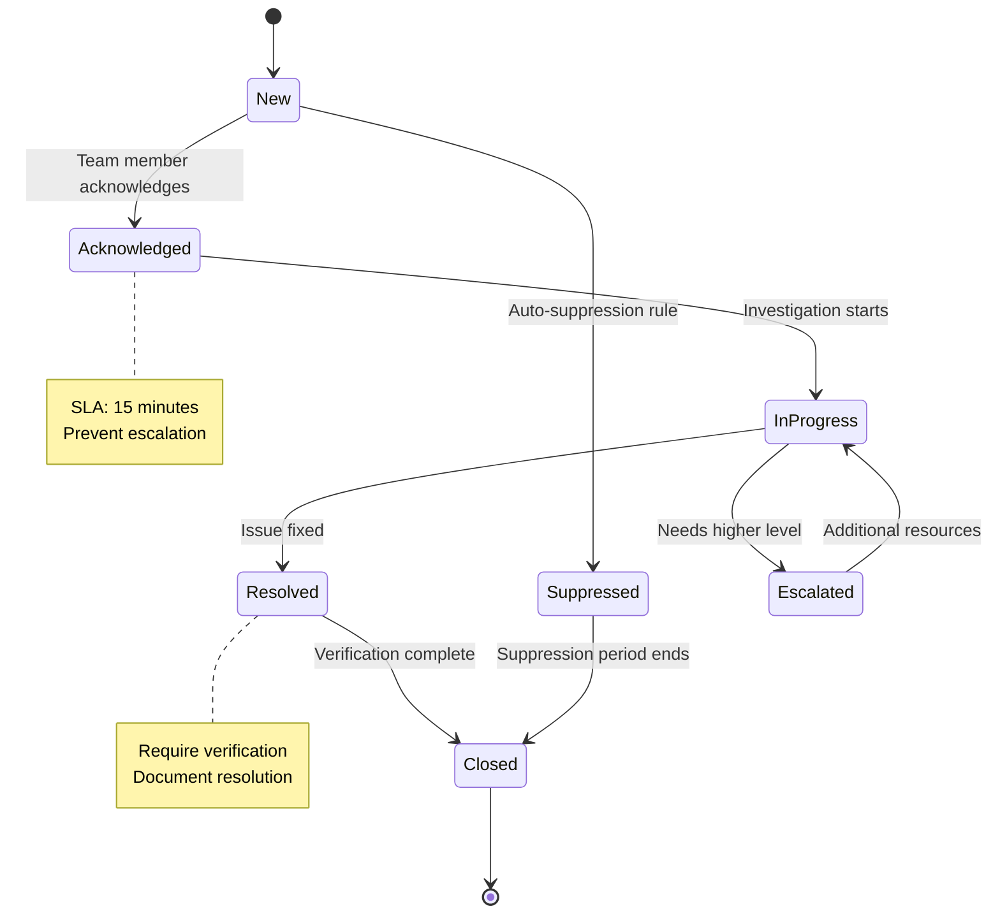

# Monitoring Patterns

## 📊 Overview

Monitoring patterns provide visibility into system behavior, performance, and health. This guide covers observability patterns and alerting strategies essential for maintaining reliable, performant distributed systems.

## 📋 Table of Contents

### Observability Patterns
1. [Health Check Pattern](#1-health-check-pattern)
2. [Heartbeat Pattern](#2-heartbeat-pattern)
3. [Log Aggregation Pattern](#3-log-aggregation-pattern)
4. [Distributed Tracing Pattern](#4-distributed-tracing-pattern)
5. [Metrics Collection Pattern](#5-metrics-collection-pattern)

### Alerting Patterns
6. [Threshold-Based Alerting Pattern](#6-threshold-based-alerting-pattern)
7. [Anomaly Detection Pattern](#7-anomaly-detection-pattern)
8. [Composite Alert Pattern](#8-composite-alert-pattern)
9. [Alert Fatigue Prevention Pattern](#9-alert-fatigue-prevention-pattern)

---

## Observability Patterns

## 1. Health Check Pattern

### ❤️ What is Health Check Pattern?

Health Check Pattern provides **endpoints for monitoring** service availability and readiness, enabling automated detection of unhealthy instances.

### Health Check Types


### Health Check Implementation

```yaml
# Kubernetes Health Check Configuration
apiVersion: v1
kind: Pod
spec:
  containers:
  - name: web-app
    image: web-app:latest
    ports:
    - containerPort: 8080
    
    # Liveness Probe
    livenessProbe:
      httpGet:
        path: /health/live
        port: 8080
      initialDelaySeconds: 30
      periodSeconds: 10
      timeoutSeconds: 5
      failureThreshold: 3
    
    # Readiness Probe
    readinessProbe:
      httpGet:
        path: /health/ready
        port: 8080
      initialDelaySeconds: 5
      periodSeconds: 5
      timeoutSeconds: 3
      failureThreshold: 3
    
    # Startup Probe
    startupProbe:
      httpGet:
        path: /health/startup
        port: 8080
      initialDelaySeconds: 10
      periodSeconds: 10
      timeoutSeconds: 5
      failureThreshold: 30
```

---

## 2. Heartbeat Pattern

### 💓 What is Heartbeat Pattern?

Heartbeat Pattern sends **periodic signals** to indicate that a service or component is alive and functioning, enabling detection of silent failures.

### Heartbeat Architecture


### Heartbeat vs Health Check

```mermaid
graph TB
    subgraph "Heartbeat vs Health Check Comparison"
        subgraph "Heartbeat Pattern"
            HeartbeatChar[Heartbeat<br/>✅ Proactive monitoring<br/>✅ Detects silent failures<br/>✅ Network partition detection<br/>❌ Additional network traffic<br/>🎯 Use: Distributed systems]
        end
        
        subgraph "Health Check Pattern"
            HealthChar[Health Check<br/>✅ On-demand status<br/>✅ Detailed health info<br/>✅ Load balancer integration<br/>❌ Reactive monitoring<br/>🎯 Use: Service endpoints]
        end
        
        subgraph "Combined Approach"
            Combined[Heartbeat + Health Check<br/>✅ Comprehensive monitoring<br/>✅ Proactive + reactive<br/>✅ Multiple failure detection<br/>🎯 Use: Critical systems]
        end
    end
```



---

## 3. Log Aggregation Pattern

### 📝 What is Log Aggregation?

Log Aggregation Pattern **centralizes logs** from distributed services, enabling unified searching, analysis, and troubleshooting across the entire system.

### Log Aggregation Architecture


### Structured Logging Example

```json
{
  "timestamp": "2024-01-15T10:30:00.123Z",
  "level": "INFO",
  "service": "user-service",
  "version": "1.2.3",
  "environment": "production",
  "correlation_id": "abc-123-def",
  "user_id": "user_456",
  "message": "User login successful",
  "duration_ms": 45,
  "http": {
    "method": "POST",
    "url": "/api/v1/login",
    "status_code": 200,
    "user_agent": "Mozilla/5.0...",
    "ip_address": "192.168.1.100"
  },
  "metadata": {
    "session_id": "session_789",
    "device_type": "mobile",
    "location": "US-East"
  }
}
```

---

## 4. Distributed Tracing Pattern

### 🔍 What is Distributed Tracing?

Distributed Tracing **tracks requests** across multiple services, providing end-to-end visibility into complex distributed transactions.

### Distributed Tracing Components


### Trace Span Structure


---

## 5. Metrics Collection Pattern

### 📈 What is Metrics Collection?

Metrics Collection Pattern **gathers quantitative data** about system performance, business metrics, and operational health for monitoring and alerting.

### Metrics Types and Architecture


### Metrics Example Configuration

```yaml
# Prometheus Metrics Configuration
metrics:
  # Application metrics
  http_requests_total:
    type: counter
    help: "Total HTTP requests"
    labels: [method, status, endpoint]
    
  http_request_duration_seconds:
    type: histogram
    help: "HTTP request duration"
    buckets: [0.1, 0.25, 0.5, 1.0, 2.5, 5.0, 10.0]
    labels: [method, endpoint]
    
  memory_usage_bytes:
    type: gauge
    help: "Current memory usage"
    
  # Business metrics
  orders_created_total:
    type: counter
    help: "Total orders created"
    labels: [product_category, payment_method]
    
  revenue_total:
    type: counter
    help: "Total revenue"
    labels: [currency, region]
    
  active_users:
    type: gauge
    help: "Currently active users"
    labels: [user_type, region]
```

---

## Alerting Patterns

## 6. Threshold-Based Alerting Pattern

### 🚨 What is Threshold-Based Alerting?

Threshold-Based Alerting **triggers alerts** when metrics exceed predefined limits, providing immediate notification of potential issues.

### Threshold Alerting Implementation


### Alert Severity Levels

```mermaid
graph TB
    subgraph "Alert Severity Levels"
        subgraph "Critical Alerts"
            Critical[Critical<br/>🔴 Service down<br/>🔴 Data loss<br/>🔴 Security breach<br/>📞 Immediate page<br/>⏰ 24/7 response]
        end
        
        subgraph "Warning Alerts"
            Warning[Warning<br/>🟡 Performance degraded<br/>🟡 High resource usage<br/>🟡 Approaching limits<br/>📧 Email notification<br/>⏰ Business hours]
        end
        
        subgraph "Info Alerts"
            Info[Info<br/>🔵 Deployment complete<br/>🔵 Scaling event<br/>🔵 Maintenance window<br/>💬 Slack notification<br/>⏰ Non-urgent]
        end
    end
```



---

## 7. Anomaly Detection Pattern

### 🔮 What is Anomaly Detection?

Anomaly Detection uses **machine learning** and statistical methods to identify unusual patterns that might indicate problems, even without predefined thresholds.

### Anomaly Detection Types


---

## 8. Composite Alert Pattern

### 🧩 What is Composite Alert?

Composite Alert Pattern **combines multiple conditions** to create more intelligent alerts, reducing noise and improving signal quality.

### Composite Alert Logic

```mermaid
graph TB
    subgraph "Composite Alert Pattern"
        subgraph "Individual Conditions"
            Condition1[High CPU Usage<br/>> 80% for 5 minutes]
            Condition2[High Memory Usage<br/>> 90% for 3 minutes]
            Condition3[Increased Error Rate<br/>> 2% for 2 minutes]
            Condition4[Slow Response Time<br/>> 1.5s for 3 minutes]
        end
        
        subgraph "Composite Logic"
            ANDLogic[AND Logic<br/>CPU AND Memory high<br/>Indicates resource exhaustion]
            
            ORLogic[OR Logic<br/>Errors OR slow response<br/>Indicates service degradation]
            
            ComplexLogic[Complex Logic<br/>(CPU > 80% AND Memory > 90%)<br/>OR<br/>(Errors > 5% AND Response > 2s)]
        end
        
        subgraph "Alert Outcomes"
            ResourceAlert[Resource Exhaustion Alert<br/>High priority<br/>Scale up recommendation]
            
            ServiceAlert[Service Degradation Alert<br/>Medium priority<br/>Investigation needed]
            
            CriticalAlert[Critical System Alert<br/>Highest priority<br/>Immediate action required]
        end
        
        Condition1 --> ANDLogic
        Condition2 --> ANDLogic
        Condition3 --> ORLogic
        Condition4 --> ORLogic
        
        ANDLogic --> ResourceAlert
        ORLogic --> ServiceAlert
        ComplexLogic --> CriticalAlert
    end
```

---

## 9. Alert Fatigue Prevention Pattern

### 😴 What is Alert Fatigue Prevention?

Alert Fatigue Prevention reduces **alert noise** through intelligent filtering, grouping, and suppression to maintain team responsiveness to genuine issues.

### Fatigue Prevention Strategies


### Alert Lifecycle Management



## Real-World Monitoring Examples

### Netflix Monitoring Architecture

```mermaid
graph TB
    subgraph "Netflix Monitoring Stack"
        subgraph "Metrics Collection"
            Atlas[Atlas<br/>Time-series database<br/>Dimensional metrics<br/>Real-time ingestion]
            
            Spectator[Spectator<br/>Client libraries<br/>Metrics instrumentation<br/>Application integration]
        end
        
        subgraph "Observability"
            Kayenta[Kayenta<br/>Automated canary analysis<br/>Statistical comparison<br/>Deployment validation]
            
            Vizceral[Vizceral<br/>Traffic visualization<br/>Service dependencies<br/>Real-time monitoring]
        end
        
        subgraph "Alerting"
            Hystrix[Hystrix<br/>Circuit breaker metrics<br/>Failure detection<br/>Cascading failure prevention]
            
            PagerDuty[PagerDuty Integration<br/>Incident management<br/>Escalation policies<br/>On-call rotation]
        end
        
        Spectator --> Atlas
        Atlas --> Kayenta
        Atlas --> Vizceral
        Vizceral --> Hystrix
        Hystrix --> PagerDuty
        
        subgraph "Benefits"
            Benefits[🎯 Proactive issue detection<br/>📊 Real-time visibility<br/>🔄 Automated remediation<br/>📈 Continuous improvement]
        end
    end
```

## 🎯 Key Takeaways

### Monitoring Pattern Selection ✅

1. **Health Checks** - Essential for load balancers and orchestrators
2. **Log Aggregation** - Critical for distributed system troubleshooting
3. **Distributed Tracing** - Necessary for complex request flows
4. **Metrics Collection** - Foundation for performance monitoring
5. **Anomaly Detection** - Advanced pattern recognition for subtle issues
6. **Alert Fatigue Prevention** - Maintain team responsiveness

### Implementation Guidelines ✅

1. **Start with Basics** - Health checks, logs, basic metrics
2. **Structured Logging** - Use consistent, searchable log formats
3. **Correlation IDs** - Track requests across service boundaries
4. **SLO-Based Alerting** - Alert on user-impacting issues
5. **Runbook Integration** - Link alerts to resolution procedures
6. **Regular Review** - Continuously improve monitoring effectiveness

### Common Pitfalls to Avoid ❌

1. **Too Many Alerts** - Alert fatigue reduces responsiveness
2. **Monitoring Everything** - Focus on actionable metrics
3. **No Correlation IDs** - Difficult to trace distributed requests
4. **Ignoring Business Metrics** - Monitor what matters to users
5. **Poor Alert Routing** - Alerts to wrong people at wrong times
6. **No Alert Testing** - Test alert rules and notification channels

### Remember
> "The goal of monitoring is not to collect data - it's to provide actionable insights that help maintain system reliability and user satisfaction."

This comprehensive guide provides essential monitoring patterns for building observable, maintainable distributed systems. Each pattern addresses specific monitoring challenges and should be implemented based on your system complexity and operational requirements.
