# Performance Patterns

## ⚡ Overview

Performance patterns optimize system speed, efficiency, and resource utilization. This guide covers optimization patterns, response time improvements, and processing strategies essential for building high-performance distributed systems.

## 📋 Table of Contents

### Optimization Patterns
1. [Lazy Loading Pattern](#1-lazy-loading-pattern)
2. [Eager Loading Pattern](#2-eager-loading-pattern)
3. [Prefetching Pattern](#3-prefetching-pattern)
4. [Connection Pooling Pattern](#4-connection-pooling-pattern)
5. [Object Pooling Pattern](#5-object-pooling-pattern)

### Response Time Patterns
6. [Asynchronous Processing Pattern](#6-asynchronous-processing-pattern)
7. [Batch Processing Pattern](#7-batch-processing-pattern)
8. [Stream Processing Pattern](#8-stream-processing-pattern)
9. [Parallel Processing Pattern](#9-parallel-processing-pattern)
10. [Pipeline Pattern](#10-pipeline-pattern)

---

## Optimization Patterns

## 1. Lazy Loading Pattern

### 😴 What is Lazy Loading?

Lazy Loading **defers initialization** of resources until they're actually needed, reducing initial load time and memory usage.

### Lazy Loading Implementation

```mermaid
graph TB
    subgraph "Lazy Loading Pattern"
        subgraph "Initial Request"
            Client[Client] --> App[Application]
            App --> Check{Resource<br/>Already Loaded?}
        end
        
        subgraph "Lazy Loading Process"
            Check -->|No| LoadResource[Load Resource<br/>Database query<br/>API call<br/>File read]
            Check -->|Yes| ReturnCached[Return Cached<br/>Resource]
            
            LoadResource --> Cache[Cache Resource<br/>Store for future use]
            Cache --> ReturnLoaded[Return Loaded<br/>Resource]
        end
        
        subgraph "Benefits"
            Benefits[⚡ Faster startup<br/>💾 Lower memory usage<br/>📊 Reduced initial load<br/>🎯 Load only what's needed]
        end
    end
```

### Lazy Loading Examples

```mermaid
graph TB
    subgraph "Lazy Loading Use Cases"
        subgraph "Web Applications"
            WebApp[Web Application<br/>Load images on scroll<br/>Fetch data on demand<br/>Initialize modules when used]
        end
        
        subgraph "Mobile Applications"
            MobileApp[Mobile App<br/>Load screens on navigation<br/>Download content on access<br/>Initialize features on use]
        end
        
        subgraph "Database Access"
            DBAccess[Database Access<br/>Load related entities on access<br/>Fetch large objects on demand<br/>Initialize connections when needed]
        end
        
        subgraph "Microservices"
            Microservices[Microservices<br/>Load service dependencies<br/>Initialize caches on demand<br/>Connect to external APIs when used]
        end
    end
```

---

## 2. Eager Loading Pattern

### 🏃‍♂️ What is Eager Loading?

Eager Loading **preloads related data** upfront to minimize the number of subsequent queries, trading initial load time for reduced latency later.

### Eager Loading Strategy

```mermaid
graph TB
    subgraph "Eager Loading Pattern"
        subgraph "Initial Query"
            Query[Database Query] --> EagerLoad[Eager Load Strategy<br/>Join related tables<br/>Fetch associated data<br/>Single database round-trip]
        end
        
        subgraph "Data Retrieval"
            EagerLoad --> MainEntity[Main Entity<br/>User profile]
            EagerLoad --> RelatedData1[Related Data 1<br/>User orders]
            EagerLoad --> RelatedData2[Related Data 2<br/>Order items]
            EagerLoad --> RelatedData3[Related Data 3<br/>Product details]
        end
        
        subgraph "Benefits vs Trade-offs"
            Benefits[✅ Fewer database queries<br/>✅ Reduced latency for related data<br/>❌ Higher initial load time<br/>❌ Potential over-fetching]
        end
    end
```



### Eager vs Lazy Loading Comparison

```mermaid
graph TB
    subgraph "Eager vs Lazy Loading"
        subgraph "Eager Loading"
            EagerChar[Eager Loading<br/>✅ Fewer queries<br/>✅ Predictable performance<br/>❌ Higher memory usage<br/>❌ Slower initial load<br/>🎯 Use: Known access patterns]
        end
        
        subgraph "Lazy Loading"
            LazyChar[Lazy Loading<br/>✅ Faster startup<br/>✅ Lower memory usage<br/>❌ N+1 query problem<br/>❌ Unpredictable latency<br/>🎯 Use: Uncertain access patterns]
        end
        
        subgraph "Hybrid Approach"
            HybridChar[Hybrid Approach<br/>✅ Critical data eager<br/>✅ Optional data lazy<br/>✅ Balanced performance<br/>🎯 Use: Mixed access patterns]
        end
    end
```



---

## 3. Prefetching Pattern

### 🔮 What is Prefetching?

Prefetching **anticipates future requests** and loads data before it's actually needed, using predictive algorithms or usage patterns.

### Prefetching Strategies


### Prefetching Implementation


---

## 4. Connection Pooling Pattern

### 🏊‍♂️ What is Connection Pooling?

Connection Pooling **reuses database connections** across multiple requests, eliminating the overhead of creating and destroying connections for each operation.

### Connection Pool Architecture

```mermaid
graph TB
    subgraph "Connection Pooling Pattern"
        subgraph "Application Threads"
            Thread1[Thread 1<br/>User request]
            Thread2[Thread 2<br/>User request]
            Thread3[Thread 3<br/>User request]
            Thread4[Thread 4<br/>User request]
        end
        
        subgraph "Connection Pool"
            Pool[Connection Pool<br/>Min: 5 connections<br/>Max: 20 connections<br/>Idle timeout: 30 min]
            
            ActiveConn[Active Connections<br/>🟢 Connection 1 (in use)<br/>🟢 Connection 2 (in use)<br/>🟢 Connection 3 (in use)]
            
            IdleConn[Idle Connections<br/>🔵 Connection 4 (available)<br/>🔵 Connection 5 (available)]
        end
        
        subgraph "Database"
            DB[(Database<br/>PostgreSQL<br/>MySQL<br/>Oracle)]
        end
        
        Thread1 --> Pool
        Thread2 --> Pool
        Thread3 --> Pool
        Thread4 --> Pool
        
        Pool --> ActiveConn
        Pool --> IdleConn
        
        ActiveConn --> DB
        IdleConn -.-> DB
    end
```

### Connection Pool Configuration

```yaml
# Database Connection Pool Configuration
database:
  connection_pool:
    # Pool sizing
    min_pool_size: 5          # Minimum connections maintained
    max_pool_size: 20         # Maximum connections allowed
    
    # Timeouts
    connection_timeout: 30s    # Time to wait for available connection
    idle_timeout: 10m         # Time before idle connection is closed
    max_lifetime: 1h          # Maximum connection lifetime
    
    # Health checks
    validation_query: "SELECT 1"
    test_on_borrow: true      # Validate before use
    test_while_idle: true     # Validate idle connections
    
    # Retry configuration
    retry_attempts: 3
    retry_delay: 1s
```

---

## 5. Object Pooling Pattern

### 🎱 What is Object Pooling?

Object Pooling **reuses expensive objects** instead of creating and destroying them repeatedly, reducing garbage collection pressure and improving performance.

### Object Pool Implementation

```mermaid
graph TB
    subgraph "Object Pooling Pattern"
        subgraph "Client Requests"
            Client1[Client 1<br/>Needs expensive object]
            Client2[Client 2<br/>Needs expensive object]
            Client3[Client 3<br/>Needs expensive object]
        end
        
        subgraph "Object Pool"
            Pool[Object Pool Manager<br/>Track available objects<br/>Handle allocation/deallocation<br/>Object lifecycle management]
            
            Available[Available Objects<br/>🟢 Object A (ready)<br/>🟢 Object B (ready)<br/>🟢 Object C (ready)]
            
            InUse[Objects In Use<br/>🔴 Object D (client 1)<br/>🔴 Object E (client 2)]
        end
        
        subgraph "Object Factory"
            Factory[Object Factory<br/>Create new objects<br/>Initialize expensive resources<br/>Configure objects]
        end
        
        Client1 --> Pool
        Client2 --> Pool
        Client3 --> Pool
        
        Pool --> Available
        Pool --> InUse
        Pool --> Factory
    end
```

### Object Pool Use Cases


---

## Response Time Patterns

## 6. Asynchronous Processing Pattern

### 🔄 What is Asynchronous Processing?

Asynchronous Processing **decouples request processing** from response delivery, allowing systems to handle more requests and improve user experience.

### Async Processing Architecture


### Async Processing Examples


---

## 7. Batch Processing Pattern

### 📦 What is Batch Processing?

Batch Processing **groups multiple operations** together for efficient processing, optimizing throughput at the cost of individual request latency.

### Batch Processing Implementation


### Batch vs Stream Processing

```mermaid
graph TB
    subgraph "Batch vs Stream Processing"
        subgraph "Batch Processing"
            BatchChar[Batch Processing<br/>✅ High throughput<br/>✅ Efficient resource use<br/>✅ Complex analytics<br/>❌ Higher latency<br/>❌ Delayed results<br/>🎯 Use: Large datasets, reports]
        end
        
        subgraph "Stream Processing"
            StreamChar[Stream Processing<br/>✅ Low latency<br/>✅ Real-time results<br/>✅ Continuous processing<br/>❌ Lower throughput<br/>❌ More complex<br/>🎯 Use: Real-time analytics]
        end
        
        subgraph "Micro-Batch"
            MicroBatch[Micro-Batch<br/>✅ Balanced approach<br/>✅ Near real-time<br/>✅ Good throughput<br/>🎯 Use: Streaming with batching benefits]
        end
    end
```



---

## 8. Stream Processing Pattern

### 🌊 What is Stream Processing?

Stream Processing handles **continuous data flows** in real-time, processing events as they arrive with minimal latency.

### Stream Processing Architecture


---

## 9. Parallel Processing Pattern

### ⚡ What is Parallel Processing?

Parallel Processing **divides work across multiple threads or processes** to reduce total processing time by utilizing multiple CPU cores.

### Parallel Processing Strategies


### Parallel Processing Implementation


---

## 10. Pipeline Pattern

### 🏭 What is Pipeline Pattern?

Pipeline Pattern processes data through **sequential stages**, where each stage performs a specific transformation and passes results to the next stage.

### Pipeline Architecture

```mermaid
graph TB
    subgraph "Pipeline Processing Pattern"
        subgraph "Input"
            RawData[Raw Data<br/>Unprocessed input<br/>Various formats<br/>High volume]
        end
        
        subgraph "Pipeline Stages"
            Stage1[Stage 1: Validation<br/>Data quality checks<br/>Format validation<br/>Error handling]
            
            Stage2[Stage 2: Transformation<br/>Data cleansing<br/>Format conversion<br/>Enrichment]
            
            Stage3[Stage 3: Aggregation<br/>Grouping operations<br/>Calculations<br/>Summarization]
            
            Stage4[Stage 4: Storage<br/>Persist results<br/>Index creation<br/>Backup]
        end
        
        subgraph "Output"
            ProcessedData[Processed Data<br/>Clean, structured<br/>Ready for consumption<br/>High quality]
        end
        
        RawData --> Stage1
        Stage1 --> Stage2
        Stage2 --> Stage3
        Stage3 --> Stage4
        Stage4 --> ProcessedData
        
        subgraph "Pipeline Benefits"
            Benefits[⚡ Parallel stage execution<br/>🔧 Modular processing<br/>📊 Easy monitoring<br/>🔄 Reusable components]
        end
    end
```



### Pipeline vs Sequential Processing

```mermaid
graph TB
    subgraph "Processing Comparison"
        subgraph "Sequential Processing"
            SeqTime[Total Time: 12 seconds<br/>Stage 1: 3s<br/>Stage 2: 4s<br/>Stage 3: 3s<br/>Stage 4: 2s<br/>❌ One item at a time]
        end
        
        subgraph "Pipeline Processing"
            PipeTime[Total Time: 6 seconds<br/>Multiple items in pipeline<br/>Stages work in parallel<br/>✅ Higher throughput<br/>✅ Better resource utilization]
        end
        
        subgraph "Pipeline Stages Timeline"
            Timeline[Time 0-3s: Stage 1 (Item 1)<br/>Time 3-7s: Stage 2 (Item 1), Stage 1 (Item 2)<br/>Time 7-10s: Stage 3 (Item 1), Stage 2 (Item 2), Stage 1 (Item 3)<br/>Time 10-12s: Stage 4 (Item 1), Stage 3 (Item 2), ...]
        end
    end
```

## Real-World Performance Examples

### Google Search Performance Optimization


## 🎯 Key Takeaways

### Performance Pattern Selection ✅

1. **Lazy Loading** - For resources that may not be needed
2. **Connection Pooling** - Essential for database-heavy applications
3. **Asynchronous Processing** - For long-running operations
4. **Batch Processing** - When throughput matters more than latency
5. **Stream Processing** - For real-time data processing needs
6. **Pipeline Pattern** - For sequential data transformation

### Implementation Guidelines ✅

1. **Measure First** - Profile before optimizing
2. **Identify Bottlenecks** - Focus on actual performance issues
3. **Cache Strategically** - Cache expensive operations and frequently accessed data
4. **Optimize Database Access** - Use connection pooling and efficient queries
5. **Leverage Parallelism** - Utilize multiple cores and distributed processing
6. **Monitor Performance** - Continuous monitoring and alerting

### Common Pitfalls to Avoid ❌

1. **Premature Optimization** - Don't optimize without measuring
2. **Over-Caching** - Can lead to stale data and memory issues
3. **Ignoring Async Benefits** - Missing opportunities for non-blocking operations
4. **Poor Resource Management** - Not properly managing pools and connections
5. **Inadequate Load Testing** - Not testing under realistic conditions
6. **Missing Monitoring** - Can't optimize what you can't measure

### Remember
> "Performance optimization is not about making everything fast - it's about making the right things fast enough to meet your requirements while maintaining system reliability and maintainability."

This comprehensive guide provides essential performance patterns for building high-performance distributed systems. Each pattern addresses specific performance challenges and should be implemented based on your specific performance requirements and system constraints.
