# Reliability Patterns

## 🛡️ Overview

Reliability patterns ensure systems remain available and functional despite failures. This guide covers fault tolerance, high availability, and disaster recovery patterns essential for building resilient distributed systems.

## 📋 Table of Contents

### Fault Tolerance Patterns
1. [Circuit Breaker Pattern](#1-circuit-breaker-pattern)
2. [Bulkhead Pattern](#2-bulkhead-pattern)
3. [Timeout Pattern](#3-timeout-pattern)
4. [Retry Pattern](#4-retry-pattern)
5. [Fallback Pattern](#5-fallback-pattern)

### High Availability Patterns
6. [Active-Active Pattern](#6-active-active-pattern)
7. [Active-Passive Pattern](#7-active-passive-pattern)
8. [Multi-Region Deployment Pattern](#8-multi-region-deployment-pattern)
9. [Blue-Green Deployment Pattern](#9-blue-green-deployment-pattern)
10. [Canary Deployment Pattern](#10-canary-deployment-pattern)

### Disaster Recovery Patterns
11. [Backup and Restore Pattern](#11-backup-and-restore-pattern)
12. [Point-in-Time Recovery Pattern](#12-point-in-time-recovery-pattern)
13. [Cross-Region Replication Pattern](#13-cross-region-replication-pattern)
14. [Disaster Recovery as a Service Pattern](#14-disaster-recovery-as-a-service-pattern)

---

## Fault Tolerance Patterns

## 1. Circuit Breaker Pattern

### ⚡ What is Circuit Breaker?

Circuit Breaker prevents cascading failures by **monitoring service calls** and "opening" the circuit when failures exceed a threshold, allowing the system to fail fast and recover.

### Circuit Breaker States


### Circuit Breaker Implementation


---

## 2. Bulkhead Pattern

### 🚢 What is Bulkhead Pattern?

Bulkhead Pattern **isolates resources** into separate pools to prevent failures in one area from affecting others, similar to watertight compartments in ships.

### Bulkhead Implementation

```mermaid
graph TB
    subgraph "Bulkhead Pattern"
        subgraph "Client Requests"
            CriticalReq[Critical Requests<br/>Payment processing<br/>User authentication]
            RegularReq[Regular Requests<br/>Product browsing<br/>Search queries]
            BulkReq[Bulk Requests<br/>Data exports<br/>Batch processing]
        end
        
        subgraph "Isolated Resource Pools"
            CriticalPool[Critical Pool<br/>Dedicated threads: 20<br/>Memory: 2GB<br/>CPU: 4 cores]
            RegularPool[Regular Pool<br/>Dedicated threads: 50<br/>Memory: 4GB<br/>CPU: 8 cores]
            BulkPool[Bulk Pool<br/>Dedicated threads: 10<br/>Memory: 1GB<br/>CPU: 2 cores]
        end
        
        CriticalReq --> CriticalPool
        RegularReq --> RegularPool
        BulkReq --> BulkPool
        
        subgraph "Isolation Benefits"
            Benefits[🛡️ Fault isolation<br/>📊 Resource guarantees<br/>⚡ Performance predictability<br/>🔧 Independent scaling]
        end
    end
```



---

## 3. Timeout Pattern

### ⏰ What is Timeout Pattern?

Timeout Pattern sets **maximum wait times** for operations, preventing indefinite blocking and enabling graceful failure handling.

### Timeout Strategy


---

## 4. Retry Pattern

### 🔄 What is Retry Pattern?

Retry Pattern **automatically retries failed operations** with appropriate delays and limits, handling transient failures gracefully.

### Retry Strategies


### Retry Implementation Flow


---

## 5. Fallback Pattern

### 🎯 What is Fallback Pattern?

Fallback Pattern provides **alternative responses** when primary services fail, ensuring graceful degradation rather than complete failure.

### Fallback Strategies


---

## High Availability Patterns

## 6. Active-Active Pattern

### ⚡ What is Active-Active?

Active-Active deploys **multiple active instances** across different locations, distributing load and providing immediate failover capability.

### Active-Active Architecture


---

## 7. Active-Passive Pattern

### 🔄 What is Active-Passive?

Active-Passive maintains a **standby system** that activates only when the primary fails, providing cost-effective disaster recovery.

### Active-Passive Implementation


---

## 8. Multi-Region Deployment Pattern

### 🌍 What is Multi-Region Deployment?

Multi-Region Deployment distributes applications across **multiple geographic regions** to ensure availability despite regional outages.

### Multi-Region Strategy


---

## 9. Blue-Green Deployment Pattern

### 🔵🟢 What is Blue-Green Deployment?

Blue-Green Deployment maintains **two identical environments** (Blue and Green), allowing instant rollback and zero-downtime deployments.

### Blue-Green Process


---

## 10. Canary Deployment Pattern

### 🐦 What is Canary Deployment?

Canary Deployment gradually **rolls out changes** to a small subset of users first, allowing validation before full deployment.

### Canary Process


---

## Disaster Recovery Patterns

## 11. Backup and Restore Pattern

### 💾 What is Backup and Restore?

Backup and Restore creates **regular data copies** and provides procedures to restore systems to a previous state after disasters.

### Backup Strategy


---

## 12. Point-in-Time Recovery Pattern

### ⏰ What is Point-in-Time Recovery?

Point-in-Time Recovery enables restoration to **any specific moment** in time, typically using transaction logs and continuous backups.

### PITR Implementation


---

## 13. Cross-Region Replication Pattern

### 🌐 What is Cross-Region Replication?

Cross-Region Replication automatically **copies data across geographic regions** to ensure availability and compliance with data sovereignty requirements.

### Cross-Region Architecture


---

## 14. Disaster Recovery as a Service Pattern

### ☁️ What is DRaaS?

DRaaS provides **cloud-based disaster recovery** capabilities, offering cost-effective backup and recovery without maintaining secondary infrastructure.

### DRaaS Architecture


## Real-World Reliability Examples

### AWS Multi-AZ RDS Implementation

```mermaid
graph TB
    subgraph "AWS RDS Multi-AZ Reliability"
        subgraph "Application Tier"
            WebApp[Web Application<br/>Connection string<br/>Automatic failover<br/>Transparent to app]
        end
        
        subgraph "Availability Zone A"
            PrimaryRDS[Primary RDS Instance<br/>Read/Write operations<br/>Synchronous replication<br/>Automated backups]
        end
        
        subgraph "Availability Zone B"
            StandbyRDS[Standby RDS Instance<br/>Synchronous replica<br/>Automatic failover<br/>No read traffic]
        end
        
        subgraph "Failure Scenarios"
            Monitoring[RDS Monitoring<br/>Health checks<br/>Failure detection<br/>Automatic failover]
            
            FailoverProcess[Failover Process<br/>1. Detect failure<br/>2. Promote standby<br/>3. Update DNS<br/>4. Resume operations]
        end
        
        WebApp --> PrimaryRDS
        PrimaryRDS <--> StandbyRDS
        Monitoring --> PrimaryRDS
        Monitoring --> StandbyRDS
        Monitoring --> FailoverProcess
        
        subgraph "Benefits"
            Benefits[🛡️ 99.95% availability<br/>⚡ Automatic failover<br/>📊 Zero data loss<br/>🔧 Transparent to applications]
        end
    end
```

## 🎯 Key Takeaways

### Reliability Pattern Selection ✅

1. **Circuit Breakers for Service Calls** - Prevent cascading failures
2. **Bulkheads for Resource Isolation** - Isolate critical from non-critical
3. **Retries with Exponential Backoff** - Handle transient failures
4. **Active-Active for High Availability** - Distribute load and risk
5. **Blue-Green for Safe Deployments** - Enable instant rollback
6. **Cross-Region for Disaster Recovery** - Protect against regional failures

### Implementation Guidelines ✅

1. **Define SLAs First** - Know your availability requirements
2. **Test Failure Scenarios** - Regularly test failover procedures
3. **Monitor Everything** - Comprehensive monitoring and alerting
4. **Automate Recovery** - Reduce human error in recovery
5. **Plan for Capacity** - Ensure standby systems can handle load
6. **Document Procedures** - Clear runbooks for incident response

### Common Pitfalls to Avoid ❌

1. **Single Points of Failure** - Eliminate all SPOFs in architecture
2. **Untested Failover** - Regularly test disaster recovery procedures
3. **Insufficient Monitoring** - Monitor all failure points and dependencies
4. **Poor Timeout Configuration** - Set appropriate timeouts for all operations
5. **Ignoring Data Consistency** - Plan for data sync in multi-region setups
6. **Inadequate Capacity Planning** - Ensure failover systems can handle full load

### Remember
> "Reliability is not about preventing failures - it's about designing systems that continue to work correctly when failures inevitably occur."

This comprehensive guide provides essential reliability patterns for building resilient distributed systems. Each pattern addresses specific failure scenarios and should be implemented based on your availability requirements and risk tolerance.
