# Saga Pattern for Distributed Transactions

## 🎭 What is the Saga Pattern?

The Saga pattern is like **organizing a complex group project** where multiple people need to complete their tasks in sequence. If someone can't complete their part, everyone needs to **undo their work** to get back to the starting point. Instead of having one person coordinate everything (which could fail), each person knows what to do and how to clean up if things go wrong.

Think of it like **planning a wedding**: caterer, venue, photographer, and band all need to be booked. If the venue cancels, you need to cancel everything else too. The Saga pattern handles this coordination automatically.

## 🏠 Real-World Analogy

```mermaid
graph TB
    subgraph "Traditional Wedding Planning (Monolithic Transaction)"
        WeddingPlanner[Wedding Planner<br/>Coordinates Everything] --> AllVendors[Books ALL vendors<br/>in one big transaction]
        AllVendors --> Success{All Available?}
        Success -->|Yes| AllBooked[✅ Everything Booked]
        Success -->|No| AllCancelled[❌ Nothing Booked<br/>Start over completely]
        
        subgraph "Problems"
            P1[💥 Single point of failure]
            P2[⏱️ Long wait for all confirmations]
            P3[🔒 Resources locked during wait]
        end
    end
    
    subgraph "Saga Wedding Planning (Distributed Transaction)"
        Couple[Couple] --> VenueFirst[1. Book Venue First]
        VenueFirst --> CatererNext[2. Book Caterer]
        CatererNext --> PhotographerNext[3. Book Photographer]
        PhotographerNext --> BandLast[4. Book Band]
        
        BandLast --> BandFails[❌ Band Not Available]
        BandFails --> UndoPhotographer[3. Cancel Photographer]
        UndoPhotographer --> UndoCaterer[2. Cancel Caterer]
        UndoCaterer --> UndoVenue[1. Cancel Venue]
        
        subgraph "Benefits"
            B1[⚡ Quick individual steps]
            B2[🛡️ Automatic compensation]
            B3[🔄 Can retry or find alternatives]
        end
    end
```



## 🎯 Why Do We Need Saga Pattern?

### The Problem with Distributed Transactions

```mermaid
graph TB
    subgraph "E-commerce Order Without Saga"
        Order[Customer Places Order] --> BigTransaction[Giant Distributed Transaction]
        
        BigTransaction --> Payment[Payment Service<br/>Charge $100]
        BigTransaction --> Inventory[Inventory Service<br/>Reserve items]
        BigTransaction --> Shipping[Shipping Service<br/>Create label]
        BigTransaction --> Email[Email Service<br/>Send confirmation]
        
        subgraph "What Goes Wrong"
            Payment --> PaymentOK[✅ Payment Success]
            Inventory --> InventoryOK[✅ Items Reserved]
            Shipping --> ShippingFail[❌ Shipping Fails]
            Email --> EmailWait[⏱️ Waiting...]
            
            ShippingFail --> RollbackAll[💥 ROLLBACK EVERYTHING<br/>Customer charged but no order!]
        end
    end
```



### Saga Pattern Solution

```mermaid
graph TB
    subgraph "E-commerce Order With Saga"
        OrderSaga[Order Saga Starts] --> Step1[Step 1: Process Payment]
        Step1 --> Step2[Step 2: Reserve Inventory]
        Step2 --> Step3[Step 3: Create Shipment]
        Step3 --> Step4[Step 4: Send Email]
        
        Step3 --> ShippingFails[❌ Shipping Fails]
        ShippingFails --> Compensate2[Compensate: Unreserve Inventory]
        Compensate2 --> Compensate1[Compensate: Refund Payment]
        Compensate1 --> OrderCancelled[Order Cancelled Cleanly]
        
        Step4 --> OrderComplete[✅ Order Complete]
        
        subgraph "Saga Benefits"
            B1[⚡ Fast individual steps]
            B2[🛡️ Automatic compensation]
            B3[📊 Clear audit trail]
            B4[🔄 Can retry failed steps]
        end
    end
```



## 🏗️ Saga Pattern Types

### 1. **Orchestrator Saga** (Centralized)

**One conductor coordinates the entire orchestra.**


**Orchestrator Characteristics:**
- ✅ **Centralized control** - easy to understand and debug
- ✅ **Clear workflow** - single place to see entire process
- ✅ **Easy monitoring** - all state in one place
- ❌ **Single point of failure** - orchestrator down = saga down
- ❌ **Coupling** - orchestrator knows about all services

### 2. **Choreography Saga** (Decentralized)

**Each dancer knows their moves and when to dance.**

```mermaid
sequenceDiagram
    participant Client
    participant PaymentService
    participant InventoryService
    participant ShippingService
    participant EventBus
    
    Client->>PaymentService: Place Order
    PaymentService->>PaymentService: Process Payment
    PaymentService->>EventBus: PaymentProcessed Event
    
    EventBus->>InventoryService: PaymentProcessed Event
    InventoryService->>InventoryService: Reserve Items
    InventoryService->>EventBus: InventoryReserved Event
    
    EventBus->>ShippingService: InventoryReserved Event
    ShippingService->>ShippingService: Create Shipment
    ShippingService->>EventBus: ShippingFailed Event ❌
    
    EventBus->>InventoryService: ShippingFailed Event
    InventoryService->>InventoryService: Unreserve Items
    InventoryService->>EventBus: InventoryUnreserved Event
    
    EventBus->>PaymentService: InventoryUnreserved Event
    PaymentService->>PaymentService: Refund Payment
    PaymentService->>EventBus: PaymentRefunded Event
    
    EventBus->>Client: OrderFailed Event
```



**Choreography Characteristics:**
- ✅ **Decentralized** - no single point of failure
- ✅ **Loose coupling** - services only know about events
- ✅ **Scalable** - each service scales independently
- ❌ **Complex debugging** - workflow scattered across services
- ❌ **Harder to monitor** - need to piece together from events

## 🎬 Orchestrator vs Choreography Comparison

```mermaid
graph TB
    subgraph "Orchestrator Saga"
        subgraph "Pros"
            OPro1[🎯 Centralized control]
            OPro2[🔍 Easy debugging]
            OPro3[📊 Clear workflow visibility]
            OPro4[🛠️ Easier testing]
        end
        
        subgraph "Cons"
            OCon1[💥 Single point of failure]
            OCon2[🔗 Service coupling]
            OCon3[📈 Orchestrator complexity grows]
        end
        
        subgraph "Best For"
            OUse[🏢 Complex business logic<br/>🔧 Need central control<br/>📋 Clear workflow requirements]
        end
    end
    
    subgraph "Choreography Saga"
        subgraph "Pros"
            CPro1[🌐 Distributed resilience]
            CPro2[🔄 Loose coupling]
            CPro3[📈 Better scalability]
            CPro4[⚡ No bottlenecks]
        end
        
        subgraph "Cons"
            CCon1[🐛 Hard to debug]
            CCon2[📊 Monitoring complexity]
            CCon3[🌪️ Workflow scattered]
        end
        
        subgraph "Best For"
            CUse[🚀 High scalability needs<br/>🔄 Event-driven architecture<br/>🌐 Microservices expertise]
        end
    end
```



## 🌍 Real-World Saga Examples

### 1. **Uber Ride Booking Saga**


**Why Uber Uses Orchestrator:**
- **Complex business rules** - surge pricing, driver ratings, route optimization
- **Real-time coordination** - need immediate response to customer
- **Regulatory compliance** - need clear audit trail for rides
- **Customer experience** - can provide real-time updates on booking progress

### 2. **Netflix Content Delivery Choreography Saga**


**Why Netflix Uses Choreography:**
- **Independent scaling** - each service scales based on its own load
- **Loose coupling** - services can be updated independently
- **Event-driven architecture** - already using events for other purposes
- **High availability** - no single point of failure for content processing

### 3. **E-commerce Order Processing (Hybrid Approach)**

```mermaid
graph TB
    subgraph "E-commerce Hybrid Saga"
        subgraph "Orchestrated Critical Path"
            OrderOrchestrator[Order Orchestrator] --> PaymentStep[1. Process Payment]
            PaymentStep --> InventoryStep[2. Reserve Inventory]
            InventoryStep --> ShippingStep[3. Create Shipping Label]
        end
        
        subgraph "Choreographed Side Effects"
            ShippingStep --> OrderCompleted[OrderCompleted Event]
            OrderCompleted --> EmailService[Email Service<br/>Send confirmation]
            OrderCompleted --> LoyaltyService[Loyalty Service<br/>Award points]
            OrderCompleted --> AnalyticsService[Analytics Service<br/>Track metrics]
            OrderCompleted --> InventoryService[Inventory Service<br/>Update forecasting]
        end
        
        subgraph "Why Hybrid?"
            Reason[🎯 Critical path needs control<br/>📊 Side effects can be async<br/>⚡ Best of both approaches]
        end
    end
```



## 🛠️ Implementation Patterns

### 1. **Saga State Management**

```mermaid
graph TB
    subgraph "Saga State Machine"
        Start[Saga Started] --> PaymentPending[Payment Pending]
        PaymentPending -->|Success| InventoryPending[Inventory Pending]
        PaymentPending -->|Failure| PaymentFailed[Payment Failed]
        
        InventoryPending -->|Success| ShippingPending[Shipping Pending]
        InventoryPending -->|Failure| CompensatePayment[Compensating Payment]
        
        ShippingPending -->|Success| Completed[Saga Completed ✅]
        ShippingPending -->|Failure| CompensateInventory[Compensating Inventory]
        
        CompensatePayment --> PaymentCompensated[Payment Compensated]
        CompensateInventory --> CompensatePayment
        PaymentCompensated --> Failed[Saga Failed ❌]
        PaymentFailed --> Failed
        
        subgraph "State Storage"
            StateDB[(Saga State Database<br/>Stores current state<br/>and compensation data)]
        end
    end
```



### 2. **Compensation Actions**


### 3. **Error Handling and Retry Logic**

```mermaid
graph TB
    subgraph "Saga Error Handling"
        SagaStep[Saga Step Execution] --> Success{Step Successful?}
        
        Success -->|Yes| NextStep[Continue to Next Step]
        Success -->|No| ErrorType{Error Type?}
        
        ErrorType -->|Transient| RetryLogic[Retry Logic<br/>Exponential backoff]
        ErrorType -->|Permanent| StartCompensation[Start Compensation]
        ErrorType -->|Timeout| TimeoutHandling[Timeout Handling<br/>Check service status]
        
        RetryLogic --> RetryAttempt{Retry Attempts<br/>< Max (3)?}
        RetryAttempt -->|Yes| SagaStep
        RetryAttempt -->|No| StartCompensation
        
        TimeoutHandling --> ServiceCheck{Service<br/>Responding?}
        ServiceCheck -->|Yes| RetryLogic
        ServiceCheck -->|No| StartCompensation
        
        StartCompensation --> CompensationChain[Execute Compensation Chain]
        CompensationChain --> SagaFailed[Saga Failed State]
        
        subgraph "Error Categories"
            TransientErrors[🔄 Network timeouts<br/>🔄 Temporary service unavailability<br/>🔄 Rate limiting]
            PermanentErrors[❌ Invalid input data<br/>❌ Business rule violations<br/>❌ Insufficient funds]
        end
    end
```

## 📊 Saga Monitoring and Observability

### Saga Metrics Dashboard


### Distributed Tracing


## ⚖️ Saga Pattern Trade-offs

### Benefits vs Challenges

```mermaid
graph TB
    subgraph "Saga Pattern Benefits"
        subgraph "Scalability"
            Benefit1[🚀 No distributed locks<br/>Each service scales independently]
        end
        
        subgraph "Resilience"
            Benefit2[🛡️ Fault tolerance<br/>Graceful failure handling]
        end
        
        subgraph "Performance"
            Benefit3[⚡ No blocking transactions<br/>Faster individual operations]
        end
        
        subgraph "Flexibility"
            Benefit4[🔄 Can retry and compensate<br/>Business logic flexibility]
        end
    end
    
    subgraph "Saga Pattern Challenges"
        subgraph "Complexity"
            Challenge1[🧩 Complex error handling<br/>Compensation logic required]
        end
        
        subgraph "Consistency"
            Challenge2[📊 Eventual consistency<br/>Temporary inconsistent states]
        end
        
        subgraph "Testing"
            Challenge3[🧪 Harder to test<br/>Many failure scenarios]
        end
        
        subgraph "Debugging"
            Challenge4[🐛 Distributed debugging<br/>Tracing across services]
        end
    end
```



### When to Use Saga Pattern

```mermaid
flowchart TD
    Start[Need Distributed Transaction?] --> SingleService{Single Service<br/>Can Handle?}
    
    SingleService -->|Yes| LocalTransaction[Use Local Transaction<br/>Keep it simple]
    SingleService -->|No| ConsistencyNeeds{Strong Consistency<br/>Required?}
    
    ConsistencyNeeds -->|Yes| TwoPhaseCommit[Consider 2PC<br/>(if you must)]
    ConsistencyNeeds -->|No| BusinessLogic{Complex Business<br/>Logic?}
    
    BusinessLogic -->|Yes| OrchestratorSaga[Orchestrator Saga<br/>Centralized control]
    BusinessLogic -->|No| EventDriven{Event-Driven<br/>Architecture?}
    
    EventDriven -->|Yes| ChoreographySaga[Choreography Saga<br/>Event-based coordination]
    EventDriven -->|No| OrchestratorSaga
    
    TwoPhaseCommit --> Warning[⚠️ Warning: 2PC has availability issues<br/>Consider if saga is really not suitable]
```

## 🚀 Implementation Best Practices

### 1. **Idempotency Design**

```yaml
# Example: Idempotent Payment Processing
payment_request:
  idempotency_key: "order_123_payment_attempt_1"  # Unique key
  amount: 100.00
  currency: "USD"
  customer_id: "customer_456"
  
# If same key is used again, return same result
# Don't charge twice!

compensation_request:
  idempotency_key: "order_123_refund_attempt_1"   # Different key for refund
  original_payment_key: "order_123_payment_attempt_1"
  amount: 100.00
  reason: "saga_compensation"
```

### 2. **Saga Timeout Management**


### 3. **Saga Testing Strategy**

```mermaid
graph TB
    subgraph "Saga Testing Pyramid"
        subgraph "Unit Tests"
            UnitTests[Individual Step Logic<br/>Compensation Logic<br/>State Machine Transitions]
        end
        
        subgraph "Integration Tests"
            IntegrationTests[Service-to-Service Communication<br/>Event Publishing/Consuming<br/>Database State Changes]
        end
        
        subgraph "End-to-End Tests"
            E2ETests[Complete Saga Workflows<br/>Happy Path Scenarios<br/>Basic Failure Scenarios]
        end
        
        subgraph "Chaos Tests"
            ChaosTests[Random Service Failures<br/>Network Partitions<br/>Timeout Scenarios<br/>Performance Under Load]
        end
        
        UnitTests --> IntegrationTests --> E2ETests --> ChaosTests
        
        subgraph "Test Scenarios"
            Scenarios[✅ All steps succeed<br/>❌ Each step fails individually<br/>⏱️ Timeout scenarios<br/>🔄 Retry scenarios<br/>🌪️ Multiple concurrent sagas]
        end
    end
```



## 📚 Key Takeaways

### Saga Pattern Selection ✅

1. **Use Orchestrator** for complex business logic and when you need centralized control
2. **Use Choreography** for event-driven architectures and high scalability needs
3. **Consider Hybrid** approach - orchestrator for critical path, choreography for side effects
4. **Avoid for simple cases** - local transactions are simpler when possible
5. **Plan compensation carefully** - every action needs a reliable undo operation

### Implementation Guidelines ✅

1. **Design for idempotency** - all operations must be safely retryable
2. **Implement proper timeouts** - both per-step and global saga timeouts
3. **Monitor everything** - saga success rates, compensation rates, performance
4. **Use distributed tracing** - essential for debugging distributed sagas
5. **Test failure scenarios** - compensation logic is critical and often untested
6. **Keep state externally** - saga state must survive service restarts

### Common Pitfalls to Avoid ❌

1. **Non-idempotent operations** - can cause double-charging or duplicate actions
2. **Missing compensation logic** - leaves system in inconsistent state
3. **Circular dependencies** - services calling each other in compensation
4. **Inadequate monitoring** - can't debug what you can't see
5. **Over-complicated workflows** - keep sagas as simple as possible
6. **Ignoring partial failures** - network issues can cause complex states

### Remember
> "The Saga pattern is not about making distributed transactions easy - it's about making them possible while maintaining system resilience and scalability."

The Saga pattern is essential for building reliable distributed systems that need to coordinate multiple services. The key is understanding that you're trading strong consistency for availability and scalability, and designing your compensation logic carefully to handle the inevitable failures in distributed systems.
