# Scalability Patterns

## 📈 Overview

Scalability patterns enable systems to handle increasing load by adding resources efficiently. This guide covers load distribution, caching, and auto-scaling patterns essential for building systems that grow with demand.

## 📋 Table of Contents

### Load Distribution Patterns
1. [Load Balancer Pattern](#1-load-balancer-pattern)
2. [Round Robin Pattern](#2-round-robin-pattern)
3. [Weighted Round Robin Pattern](#3-weighted-round-robin-pattern)
4. [Least Connections Pattern](#4-least-connections-pattern)
5. [Geographic Load Balancing Pattern](#5-geographic-load-balancing-pattern)

### Caching Patterns
6. [Cache-Aside Pattern](#6-cache-aside-pattern)
7. [Write-Through Pattern](#7-write-through-pattern)
8. [Write-Behind Pattern](#8-write-behind-pattern)
9. [Refresh-Ahead Pattern](#9-refresh-ahead-pattern)
10. [Distributed Cache Pattern](#10-distributed-cache-pattern)

### Auto-Scaling Patterns
11. [Horizontal Pod Autoscaler Pattern](#11-horizontal-pod-autoscaler-pattern)
12. [Vertical Pod Autoscaler Pattern](#12-vertical-pod-autoscaler-pattern)
13. [Predictive Scaling Pattern](#13-predictive-scaling-pattern)
14. [Reactive Scaling Pattern](#14-reactive-scaling-pattern)
15. [Scheduled Scaling Pattern](#15-scheduled-scaling-pattern)

---

## Load Distribution Patterns

## 1. Load Balancer Pattern

### ⚖️ What is Load Balancer Pattern?

Load Balancer Pattern distributes incoming requests across multiple servers to prevent any single server from becoming a bottleneck, improving performance and reliability.

### Load Balancer Architecture

```mermaid
graph TB
    subgraph "Load Balancer Pattern"
        subgraph "Clients"
            Client1[Client 1]
            Client2[Client 2]
            Client3[Client 3]
        end
        
        subgraph "Load Balancer"
            LB[Load Balancer<br/>Traffic distribution<br/>Health checking<br/>SSL termination]
        end
        
        subgraph "Server Pool"
            Server1[Server 1<br/>CPU: 60%]
            Server2[Server 2<br/>CPU: 45%]
            Server3[Server 3<br/>CPU: 70%]
        end
        
        Client1 --> LB
        Client2 --> LB
        Client3 --> LB
        
        LB --> Server1
        LB --> Server2
        LB --> Server3
        
        subgraph "Benefits"
            Benefits[📈 Improved performance<br/>🛡️ High availability<br/>📊 Better resource utilization<br/>⚡ Fault tolerance]
        end
    end
```

### Layer 4 vs Layer 7 Load Balancing

```mermaid
graph TB
    subgraph "Load Balancer Types"
        subgraph "Layer 4 (Transport)"
            L4[Layer 4 Load Balancer<br/>✅ High performance<br/>✅ Protocol agnostic<br/>❌ Limited routing options<br/>Example: Network Load Balancer]
        end
        
        subgraph "Layer 7 (Application)"
            L7[Layer 7 Load Balancer<br/>✅ Content-based routing<br/>✅ SSL termination<br/>❌ Higher latency<br/>Example: Application Load Balancer]
        end
    end
```



---

## 2. Round Robin Pattern

### 🔄 What is Round Robin?

Round Robin distributes requests **sequentially** across available servers, ensuring fair distribution when servers have similar capacity.

### Round Robin Implementation


---

## 3. Weighted Round Robin Pattern

### ⚖️ What is Weighted Round Robin?

Weighted Round Robin assigns different **weights** to servers based on their capacity, sending more requests to powerful servers.

### Weighted Distribution Example

```mermaid
graph TB
    subgraph "Weighted Round Robin"
        LoadBalancer[Load Balancer] --> Server1[Server 1<br/>Weight: 3<br/>High-performance server]
        LoadBalancer --> Server2[Server 2<br/>Weight: 2<br/>Medium-performance server]
        LoadBalancer --> Server3[Server 3<br/>Weight: 1<br/>Low-performance server]
        
        subgraph "Traffic Distribution"
            Distribution[Out of 6 requests:<br/>Server 1: 3 requests (50%)<br/>Server 2: 2 requests (33%)<br/>Server 3: 1 request (17%)]
        end
    end
```

---

## 4. Least Connections Pattern

### 🔗 What is Least Connections?

Least Connections routes requests to the server with the **fewest active connections**, ideal for long-running requests.

### Least Connections Logic

```mermaid
graph TB
    subgraph "Least Connections Pattern"
        NewRequest[New Request] --> LB[Load Balancer]
        
        LB --> Check{Check Active Connections}
        
        Check --> Server1[Server 1<br/>Active: 25 connections]
        Check --> Server2[Server 2<br/>Active: 12 connections ⭐]
        Check --> Server3[Server 3<br/>Active: 18 connections]
        
        Server2 --> Route[Route to Server 2<br/>Least connections]
    end
```



---

## 5. Geographic Load Balancing Pattern

### 🌍 What is Geographic Load Balancing?

Geographic Load Balancing routes users to the **nearest data center** based on location, reducing latency and improving user experience.

### Global Load Balancing


---

## Caching Patterns

## 6. Cache-Aside Pattern

### 💾 What is Cache-Aside?

Cache-Aside (Lazy Loading) loads data into cache **on-demand** when requested, giving applications full control over caching logic.

### Cache-Aside Flow


---

## 7. Write-Through Pattern

### ✍️ What is Write-Through?

Write-Through writes data to **both cache and database** simultaneously, ensuring consistency but with higher write latency.

### Write-Through Implementation

```mermaid
graph TB
    subgraph "Write-Through Pattern"
        Application[Application] --> WriteRequest[Write Request]
        
        WriteRequest --> Cache[Cache<br/>Update cached data]
        WriteRequest --> Database[(Database<br/>Persist data)]
        
        Cache --> Success1[Cache Updated]
        Database --> Success2[Database Updated]
        
        Success1 --> Complete[Write Complete<br/>Both updated]
        Success2 --> Complete
        
        subgraph "Characteristics"
            Characteristics[✅ Data consistency<br/>✅ Cache always current<br/>❌ Higher write latency<br/>❌ Increased complexity]
        end
    end
```

---

## 8. Write-Behind Pattern

### 🚀 What is Write-Behind?

Write-Behind (Write-Back) writes to cache **immediately** and database **asynchronously**, optimizing for write performance.

### Write-Behind Process


---

## 9. Refresh-Ahead Pattern

### 🔄 What is Refresh-Ahead?

Refresh-Ahead **proactively refreshes** cache entries before they expire, ensuring cache hits for frequently accessed data.

### Refresh-Ahead Logic

```mermaid
graph TB
    subgraph "Refresh-Ahead Pattern"
        CacheEntry[Cache Entry<br/>TTL: 60 seconds<br/>Age: 45 seconds] --> CheckTTL{TTL < Threshold?}
        
        CheckTTL -->|Yes| TriggerRefresh[Trigger Refresh<br/>Background process]
        CheckTTL -->|No| ServeFromCache[Serve from Cache<br/>Normal operation]
        
        TriggerRefresh --> BackgroundFetch[Background Fetch<br/>Load fresh data<br/>Update cache]
        
        BackgroundFetch --> UpdatedCache[Updated Cache<br/>Fresh data<br/>Reset TTL]
        
        subgraph "Benefits"
            Benefits[⚡ Always fast responses<br/>🔄 Proactive updates<br/>📊 High cache hit ratio<br/>🚀 Better user experience]
        end
    end
```

---

## 10. Distributed Cache Pattern

### 🌐 What is Distributed Cache?

Distributed Cache spreads cached data across **multiple nodes**, providing scalability and fault tolerance for large-scale applications.

### Distributed Cache Architecture


---

## Auto-Scaling Patterns

## 11. Horizontal Pod Autoscaler Pattern

### 📊 What is HPA?

HPA automatically **scales the number of pods** based on CPU utilization, memory usage, or custom metrics, maintaining performance under varying load.

### HPA Implementation


### HPA Scaling Formula

```yaml
# HPA Configuration
apiVersion: autoscaling/v2
kind: HorizontalPodAutoscaler
metadata:
  name: web-app-hpa
spec:
  scaleTargetRef:
    apiVersion: apps/v1
    kind: Deployment
    name: web-app
  minReplicas: 2
  maxReplicas: 10
  metrics:
  - type: Resource
    resource:
      name: cpu
      target:
        type: Utilization
        averageUtilization: 50
  - type: Resource
    resource:
      name: memory
      target:
        type: Utilization
        averageUtilization: 70
```

---

## 12. Vertical Pod Autoscaler Pattern

### 📏 What is VPA?

VPA automatically **adjusts CPU and memory requests** for containers based on usage patterns, optimizing resource allocation.

### VPA vs HPA Comparison

```mermaid
graph TB
    subgraph "Scaling Pattern Comparison"
        subgraph "Horizontal Scaling (HPA)"
            HPA[Horizontal Pod Autoscaler<br/>✅ Add more pod replicas<br/>✅ Handle traffic spikes<br/>✅ Distribute load<br/>❌ Resource overhead per pod]
        end
        
        subgraph "Vertical Scaling (VPA)"
            VPA[Vertical Pod Autoscaler<br/>✅ Increase pod resources<br/>✅ Optimize resource usage<br/>✅ Reduce resource waste<br/>❌ Pod restart required]
        end
        
        subgraph "Combined Approach"
            Combined[HPA + VPA<br/>✅ Best of both worlds<br/>✅ Scale out and up<br/>✅ Optimal resource usage<br/>❌ Increased complexity]
        end
    end
```



---

## 13. Predictive Scaling Pattern

### 🔮 What is Predictive Scaling?

Predictive Scaling uses **historical data and ML models** to forecast demand and scale resources proactively before load increases.

### Predictive Scaling Process


---

## 14. Reactive Scaling Pattern

### ⚡ What is Reactive Scaling?

Reactive Scaling responds to **current metrics** and scales resources based on real-time performance indicators like CPU, memory, or queue depth.

### Reactive Scaling Triggers


---

## 15. Scheduled Scaling Pattern

### 📅 What is Scheduled Scaling?

Scheduled Scaling adjusts resources based on **predictable patterns** like business hours, batch processing windows, or known traffic patterns.

### Scheduled Scaling Examples


## Real-World Scalability Examples

### Netflix Scalability Architecture

```mermaid
graph TB
    subgraph "Netflix Scalability Implementation"
        subgraph "Global Load Distribution"
            GlobalDNS[Global DNS<br/>Route users to nearest region<br/>Latency optimization<br/>Disaster recovery]
            
            RegionalLB[Regional Load Balancers<br/>Distribute across AZs<br/>Health checking<br/>Traffic shaping]
        end
        
        subgraph "Microservices Scaling"
            APIGateway[Zuul API Gateway<br/>Request routing<br/>Circuit breakers<br/>Rate limiting]
            
            Microservices[700+ Microservices<br/>Independent scaling<br/>Auto-scaling groups<br/>Container orchestration]
        end
        
        subgraph "Caching Strategy"
            CDN[Content Delivery Network<br/>Video content caching<br/>Edge locations<br/>Bandwidth optimization]
            
            ApplicationCache[Application Caches<br/>EVCache (Redis)<br/>Distributed caching<br/>Multi-layer caching]
        end
        
        subgraph "Data Scaling"
            Cassandra[Cassandra Clusters<br/>Multi-region replication<br/>Consistent hashing<br/>Linear scalability]
            
            DataPipeline[Data Pipeline<br/>Real-time streaming<br/>Batch processing<br/>Analytics scaling]
        end
        
        GlobalDNS --> RegionalLB
        RegionalLB --> APIGateway
        APIGateway --> Microservices
        Microservices --> CDN
        CDN --> ApplicationCache
        ApplicationCache --> Cassandra
        Cassandra --> DataPipeline
    end
```

## 🎯 Key Takeaways

### Scalability Pattern Selection ✅

1. **Load Balancing First** - Distribute traffic before scaling resources
2. **Cache Strategically** - Choose caching pattern based on read/write patterns
3. **Horizontal Over Vertical** - Scale out rather than up when possible
4. **Predictive When Possible** - Use historical data to scale proactively
5. **Monitor Everything** - Track metrics to make informed scaling decisions

### Implementation Guidelines ✅

1. **Start Simple** - Begin with basic patterns, add complexity as needed
2. **Test Scaling** - Regularly test auto-scaling under load
3. **Set Proper Limits** - Configure min/max scaling boundaries
4. **Cost Awareness** - Monitor scaling costs and optimize
5. **Graceful Degradation** - Handle scaling failures gracefully

### Common Pitfalls to Avoid ❌

1. **Over-Scaling** - Don't scale beyond actual needs
2. **Under-Monitoring** - Monitor all scaling triggers and actions
3. **Ignoring Costs** - Track and optimize scaling costs
4. **Poor Cache Strategy** - Choose appropriate caching patterns
5. **Single Points of Failure** - Ensure load balancers are also scalable

### Remember
> "Scalability is not just about handling more load - it's about maintaining performance, availability, and cost-effectiveness as your system grows."

This comprehensive guide provides essential scalability patterns for building systems that grow efficiently with demand. Each pattern addresses specific scaling challenges and should be implemented based on your specific performance and cost requirements.
