# Security Patterns

## 🔐 Overview

Security patterns provide proven solutions for protecting distributed systems, applications, and data. This guide covers authentication, authorization, and security architecture patterns essential for building secure, compliant systems.

## 📋 Table of Contents

### Authentication Patterns
1. [Single Sign-On (SSO) Pattern](#1-single-sign-on-sso-pattern)
2. [Multi-Factor Authentication Pattern](#2-multi-factor-authentication-pattern)
3. [OAuth 2.0 Pattern](#3-oauth-20-pattern)
4. [JWT Token Pattern](#4-jwt-token-pattern)
5. [API Key Pattern](#5-api-key-pattern)

### Authorization Patterns
6. [Role-Based Access Control (RBAC) Pattern](#6-role-based-access-control-rbac-pattern)
7. [Attribute-Based Access Control (ABAC) Pattern](#7-attribute-based-access-control-abac-pattern)
8. [Access Control List (ACL) Pattern](#8-access-control-list-acl-pattern)
9. [Policy-Based Access Control Pattern](#9-policy-based-access-control-pattern)

### Security Architecture Patterns
10. [Zero Trust Pattern](#10-zero-trust-pattern)
11. [Defense in Depth Pattern](#11-defense-in-depth-pattern)
12. [Principle of Least Privilege Pattern](#12-principle-of-least-privilege-pattern)
13. [Security by Design Pattern](#13-security-by-design-pattern)
14. [Threat Modeling Pattern](#14-threat-modeling-pattern)

---

## Authentication Patterns

## 1. Single Sign-On (SSO) Pattern

### 🎫 What is SSO?

SSO allows users to **authenticate once** and access multiple applications without re-entering credentials, improving user experience while maintaining security.

### SSO Architecture

```mermaid
graph TB
    subgraph "SSO Pattern"
        subgraph "User Journey"
            User[User] --> App1[Application 1]
            User --> App2[Application 2]
            User --> App3[Application 3]
        end
        
        subgraph "Identity Provider (IdP)"
            SSOProvider[SSO Provider<br/>Okta, Auth0, Azure AD<br/>Centralized authentication<br/>Token issuance]
        end
        
        subgraph "Authentication Flow"
            App1 --> SSOProvider
            App2 --> SSOProvider
            App3 --> SSOProvider
            
            SSOProvider --> TokenValidation[Token Validation<br/>JWT verification<br/>Session management<br/>User attributes]
        end
        
        subgraph "Benefits"
            Benefits[✅ Single login experience<br/>✅ Centralized user management<br/>✅ Reduced password fatigue<br/>✅ Enhanced security]
        end
    end
```

### SAML vs OAuth 2.0 vs OpenID Connect

```mermaid
graph TB
    subgraph "SSO Protocol Comparison"
        subgraph "SAML 2.0"
            SAML[SAML 2.0<br/>✅ Enterprise standard<br/>✅ Rich assertions<br/>❌ XML complexity<br/>❌ Mobile limitations]
        end
        
        subgraph "OAuth 2.0"
            OAuth[OAuth 2.0<br/>✅ Authorization focus<br/>✅ REST/JSON<br/>❌ Not authentication<br/>❌ No user info]
        end
        
        subgraph "OpenID Connect"
            OIDC[OpenID Connect<br/>✅ Authentication + Authorization<br/>✅ Modern standard<br/>✅ Mobile friendly<br/>❌ Newer ecosystem]
        end
    end
```



---

## 2. Multi-Factor Authentication Pattern

### 🔒 What is MFA?

MFA requires users to provide **multiple forms of verification** (something you know, have, or are) to access systems, significantly enhancing security.

### MFA Architecture

```mermaid
graph TB
    subgraph "Multi-Factor Authentication"
        User[User] --> FirstFactor[First Factor<br/>Username + Password<br/>Something you know]
        
        FirstFactor --> SecondFactor[Second Factor<br/>SMS, TOTP, Push<br/>Something you have]
        
        SecondFactor --> ThirdFactor[Third Factor (Optional)<br/>Biometrics<br/>Something you are]
        
        ThirdFactor --> AccessGranted[Access Granted<br/>All factors verified<br/>Session established]
        
        subgraph "Factor Types"
            Knowledge[Knowledge Factor<br/>🧠 Password, PIN<br/>Security questions]
            Possession[Possession Factor<br/>📱 Phone, token<br/>Smart card]
            Inherence[Inherence Factor<br/>👆 Fingerprint<br/>Face recognition]
        end
    end
```

---

## 3. OAuth 2.0 Pattern

### 🔑 What is OAuth 2.0?

OAuth 2.0 enables **secure authorization** without sharing credentials, allowing third-party applications to access user resources with explicit permission.

### OAuth 2.0 Flow


---

## 4. JWT Token Pattern

### 🎟️ What is JWT?

JWT (JSON Web Token) provides **stateless authentication** through self-contained tokens that carry user information and can be verified without database lookups.

### JWT Structure

```mermaid
graph TB
    subgraph "JWT Token Structure"
        JWT[JWT Token] --> Header[Header<br/>Algorithm & Token Type<br/>{"alg": "HS256", "typ": "JWT"}]
        JWT --> Payload[Payload<br/>Claims & User Data<br/>{"sub": "user123", "exp": 1234567890}]
        JWT --> Signature[Signature<br/>Verification Hash<br/>HMACSHA256(base64(header) + "." + base64(payload), secret)]
        
        subgraph "Benefits"
            Stateless[Stateless<br/>No server-side storage<br/>Scalable authentication]
            SelfContained[Self-Contained<br/>All info in token<br/>No database lookups]
        end
    end
```

---

## 5. API Key Pattern

### 🗝️ What is API Key?

API Keys provide **simple authentication** for programmatic access, typically used for service-to-service communication and rate limiting.

### API Key Implementation


---

## Authorization Patterns

## 6. Role-Based Access Control (RBAC) Pattern

### 👥 What is RBAC?

RBAC assigns **permissions to roles** rather than individual users, simplifying access management and ensuring consistent security policies.

### RBAC Architecture


---

## 7. Attribute-Based Access Control (ABAC) Pattern

### 🏷️ What is ABAC?

ABAC makes access decisions based on **attributes** of users, resources, environment, and actions, providing fine-grained, dynamic access control.

### ABAC Decision Process


---

## Security Architecture Patterns

## 10. Zero Trust Pattern

### 🛡️ What is Zero Trust?

Zero Trust assumes **no implicit trust** and continuously validates every transaction, implementing "never trust, always verify" principles.

### Zero Trust Architecture


---

## 11. Defense in Depth Pattern

### 🏰 What is Defense in Depth?

Defense in Depth implements **multiple layers of security controls** to protect against various attack vectors, ensuring no single point of failure.

### Defense in Depth Layers


---

## Real-World Security Implementation

### Netflix Security Architecture


## 🎯 Key Takeaways

### Security Pattern Selection ✅

1. **Authentication First** - Implement strong authentication before authorization
2. **Zero Trust Mindset** - Never trust, always verify every request
3. **Defense in Depth** - Multiple security layers prevent single points of failure
4. **Least Privilege** - Grant minimum necessary permissions
5. **Security by Design** - Build security into architecture from the start

### Implementation Guidelines ✅

1. **Monitor Everything** - Comprehensive logging and threat detection
2. **Automate Security** - Automated vulnerability scanning and compliance
3. **Regular Updates** - Keep all systems patched and updated
4. **Incident Response** - Have clear procedures for security incidents
5. **Compliance Focus** - Meet regulatory requirements (GDPR, HIPAA, SOX)

### Common Pitfalls to Avoid ❌

1. **Security as Afterthought** - Don't add security after development
2. **Over-Privileged Access** - Avoid giving excessive permissions
3. **Weak Authentication** - Don't rely on passwords alone
4. **Unencrypted Data** - Encrypt data at rest and in transit
5. **Poor Key Management** - Securely manage cryptographic keys

### Remember
> "Security is not a product, but a process. It requires continuous vigilance, regular updates, and a culture of security awareness throughout the organization."

This comprehensive guide provides essential security patterns for building secure distributed systems. Each pattern addresses specific security challenges and should be implemented as part of a holistic security strategy.
