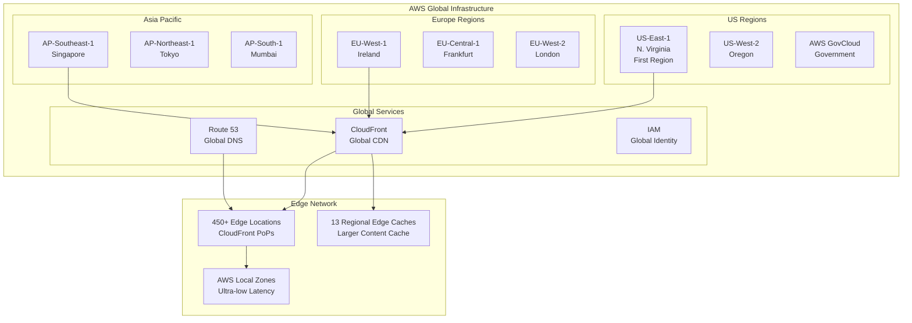
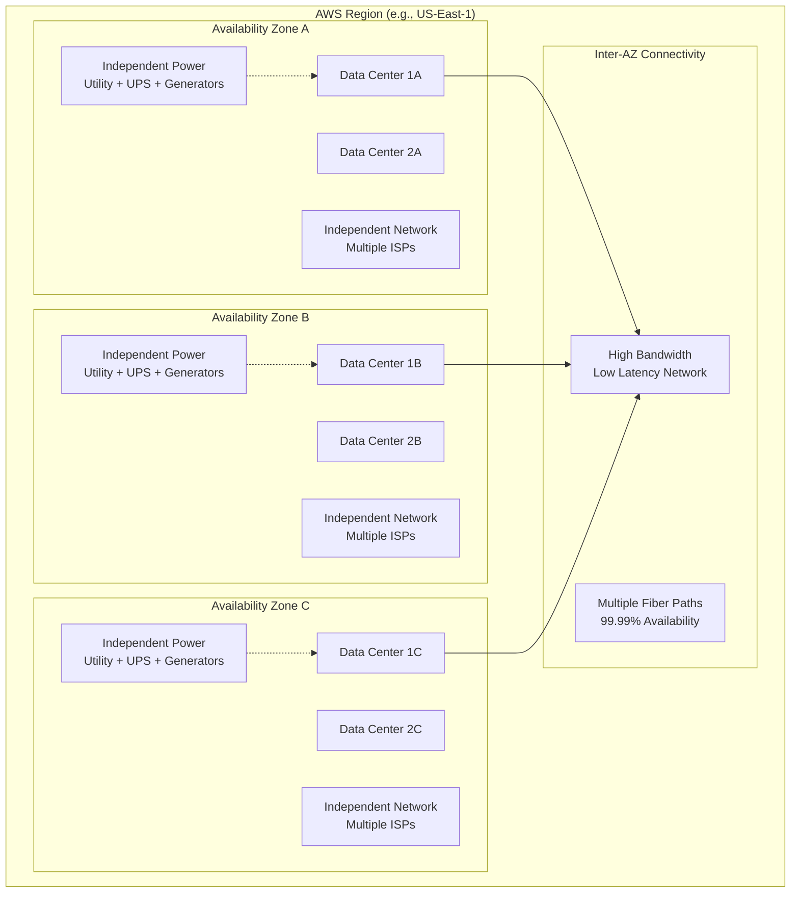
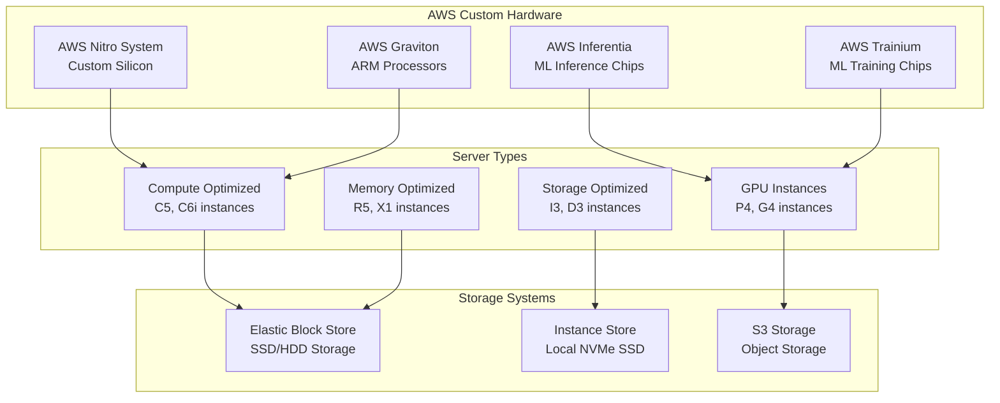
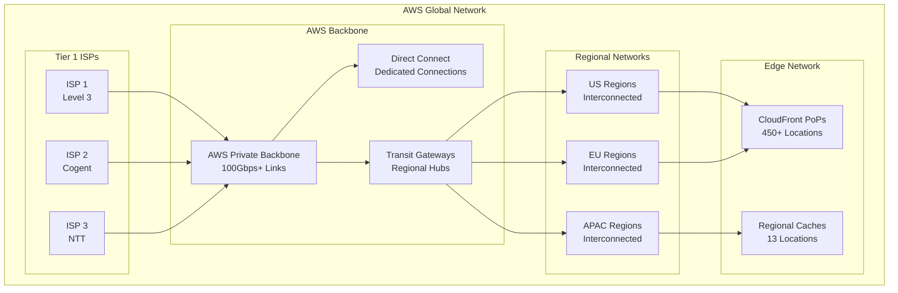
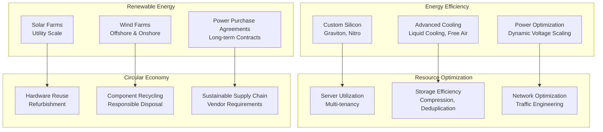

# AWS Global Infrastructure: Building the Cloud at Planetary Scale

## ☁️ Executive Summary

Amazon Web Services (AWS) represents the world's most comprehensive and widely adopted cloud platform, serving **millions of customers** across **245 countries and territories**. With **99+ services** across **31 regions** and **99 availability zones**, AWS processes **trillions of API calls** monthly while maintaining industry-leading **99.99%+ availability**. This case study explores how AWS built and operates the largest global cloud infrastructure in history.

## 🌍 Global Infrastructure Overview

### Scale Statistics
- **31 launched regions** worldwide (as of 2024)
- **99 availability zones** across all regions
- **450+ edge locations** and 13 regional edge caches
- **245 countries and territories** served
- **Millions of active customers** from startups to enterprises
- **99.99%+ availability** SLA for core services
- **Trillions of objects** stored in S3
- **Exabytes of data** transferred monthly

### Infrastructure Timeline
- **2006**: AWS launched with S3, EC2, SQS
- **2009**: First international region (EU-West-1)
- **2011**: Asia Pacific expansion
- **2014**: AWS GovCloud for government workloads
- **2016**: China regions launch
- **2019**: AWS Outposts for hybrid cloud
- **2021**: AWS Local Zones for ultra-low latency
- **2023**: AWS Wavelength for 5G edge computing

## 🏗️ Global Architecture Design

### Regional Architecture

### Availability Zone Design
Each AWS region consists of **multiple isolated availability zones**:

## 🏢 Data Center Architecture

### Physical Infrastructure

**Hyperscale Data Center Engineering:**
AWS operates **hundreds of purpose-built data centers** globally, each representing the pinnacle of hyperscale infrastructure engineering. These facilities are designed for **maximum efficiency**, **reliability**, and **security**, with each data center capable of supporting **tens of thousands of servers** and **multiple megawatts of power** consumption.

**Data Center Design Philosophy:**

**1. Availability Zone Architecture:**
- **Isolated Failure Domains**: Each AZ designed as independent failure domain with separate power, cooling, and network
- **Geographic Separation**: AZs within region separated by meaningful distances (typically 60+ miles)
- **Redundant Connectivity**: Multiple high-speed, low-latency network connections between AZs
- **Independent Infrastructure**: Separate power grids, internet connections, and cooling systems
- **Synchronous Replication**: Low-latency connections enable synchronous data replication between AZs

**2. Power and Cooling Engineering:**
- **Redundant Power Systems**: N+1 redundancy with multiple utility feeds, backup generators, and UPS systems
- **Advanced Cooling**: Custom cooling solutions achieving Power Usage Effectiveness (PUE) below 1.2
- **Liquid Cooling**: Direct liquid cooling for high-density compute and GPU workloads
- **Free Air Cooling**: Economizer systems leverage outside air when conditions permit
- **Power Monitoring**: Real-time power usage monitoring and optimization at server and rack level

**3. Physical Security Architecture:**
- **Multi-Layer Security**: Multiple security perimeters with different access controls
- **Biometric Authentication**: Multi-factor authentication including biometric scanners
- **24/7 Security Staff**: Round-the-clock physical security presence and monitoring
- **Video Surveillance**: Comprehensive camera coverage with motion detection and recording
- **Visitor Escort**: All non-AWS personnel must be escorted by authorized personnel

**4. Network Infrastructure:**
- **Redundant Network Paths**: Multiple diverse network paths to prevent single points of failure
- **High-Speed Connectivity**: 100Gbps+ connections to internet and other AWS facilities
- **Custom Network Hardware**: Purpose-built networking equipment optimized for cloud workloads
- **Software-Defined Networking**: Programmable network infrastructure for rapid provisioning
- **DDoS Protection**: Hardware-based DDoS mitigation at data center edge

#### Data Center Specifications
- **Power Capacity**: 20-50 MW per data center with room for expansion
- **Cooling Efficiency**: Advanced cooling systems achieving PUE < 1.2 industry-leading efficiency
- **Physical Space**: 50,000+ square feet typical footprint with high-density server deployment
- **Server Capacity**: 50,000+ servers per large data center with custom hardware optimization
- **Network Connectivity**: Multiple 100Gbps+ connections with diverse routing paths
- **Security Standards**: Military-grade security with SOC compliance and continuous monitoring

### Server Architecture

### AWS Nitro System
AWS developed the **Nitro System** to maximize performance and security:

**Components**:
1. **Nitro Cards**: Offload networking, storage, and management
2. **Nitro Security Chip**: Hardware root of trust
3. **Nitro Hypervisor**: Lightweight hypervisor
4. **Nitro Enclaves**: Isolated compute environments

**Benefits**:
- **Performance**: Near bare-metal performance for VMs
- **Security**: Hardware-based isolation and attestation
- **Innovation**: Enables new instance types and features
- **Efficiency**: Dedicated hardware for specific functions

## 🌐 Global Network Architecture

### AWS Backbone Network
AWS operates one of the world's largest private networks:

## 🌱 Sustainability and Green Computing

### AWS Sustainability Goals
- **100% renewable energy** by 2025 (achieved in 2023)
- **Net zero carbon** by 2040
- **Water positive** by 2030
- **Zero waste** to landfill

### Green Computing Initiatives

## 🚀 Innovation and Future Directions

### Emerging Technologies
1. **Quantum Computing**: AWS Braket quantum cloud service
2. **Satellite Connectivity**: AWS Ground Station
3. **Edge Computing**: AWS Wavelength, Local Zones
4. **Machine Learning**: Custom AI chips (Inferentia, Trainium)
5. **Autonomous Systems**: AWS RoboMaker

### Next-Generation Architecture

```mermaid
graph TB
    subgraph "Edge-to-Cloud Continuum"
        IoTDevices[IoT Devices<br/>Billions Connected]
        EdgeComputing[Edge Computing<br/>Local Processing]
        RegionalCloud[Regional Cloud<br/>AWS Regions]
        GlobalServices[Global Services<br/>Worldwide Scale]
    end
    
    subgraph "AI-Powered Infrastructure"
        AutoOptimization[Auto Optimization<br/>ML-driven Efficiency]
        PredictiveMaintenance[Predictive Maintenance<br/>Failure Prevention]
        IntelligentScaling[Intelligent Scaling<br/>Demand Prediction]
    end
    
    subgraph "Quantum-Ready Systems"
        QuantumNetworking[Quantum Networking<br/>Ultra-secure Communication]
        QuantumComputing[Quantum Computing<br/>Complex Problem Solving]
        PostQuantumCrypto[Post-quantum Cryptography<br/>Future-proof Security]
    end
    
    IoTDevices --> EdgeComputing
    EdgeComputing --> RegionalCloud
    RegionalCloud --> GlobalServices
    
    AutoOptimization --> PredictiveMaintenance
    PredictiveMaintenance --> IntelligentScaling
    
    QuantumNetworking --> QuantumComputing
    QuantumComputing --> PostQuantumCrypto
```

## 📚 Key Lessons Learned

### Infrastructure Design Principles
1. **Design for Failure**: Everything fails, plan for it
2. **Loose Coupling**: Services should be independently scalable
3. **Automation**: Automate everything that can be automated
4. **Security in Depth**: Multiple layers of security controls
5. **Continuous Innovation**: Never stop improving

### Operational Excellence
1. **Customer Obsession**: Every decision focuses on customer benefit
2. **Ownership**: Teams own what they build end-to-end
3. **Invent and Simplify**: Find simple solutions to complex problems
4. **Learn and Be Curious**: Continuous learning and improvement
5. **Think Big**: Scale solutions globally from day one

### Business Impact
- **$80+ billion revenue** (2022)
- **33% market share** in cloud infrastructure
- **Millions of customers** worldwide
- **100+ services** across compute, storage, database, analytics
- **Economic impact**: Enabled digital transformation globally

This comprehensive case study demonstrates how AWS built the world's most comprehensive cloud platform through innovative technology, relentless focus on reliability, and continuous customer-driven innovation. Their global infrastructure serves as the foundation for millions of applications and has fundamentally transformed how organizations build and deploy technology solutions.
