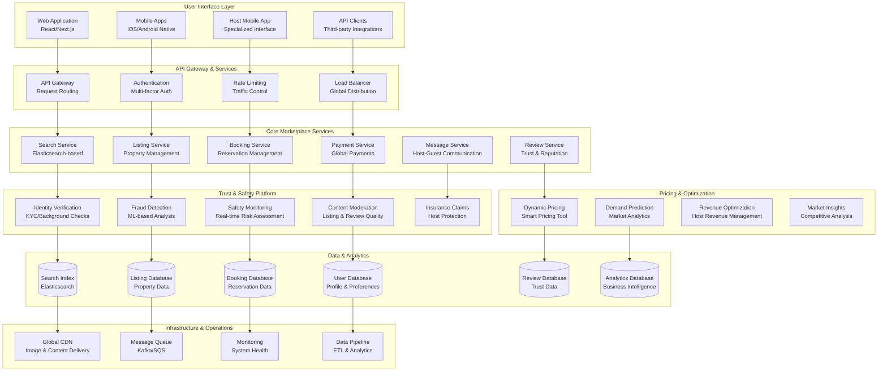

# Airbnb Marketplace Architecture: Global Trust-Based Accommodation Platform

## 🏠 Executive Summary

Airbnb revolutionized the travel industry by creating the world's largest marketplace for unique accommodations, connecting **4+ million hosts** with **1+ billion guest arrivals** across **220+ countries and regions**. Processing **millions of searches daily** and facilitating **$75+ billion in gross booking value** annually, Airbnb's architecture combines **real-time search and discovery**, **trust and safety systems**, **dynamic pricing algorithms**, and **global marketplace coordination** to enable strangers to trust each other with their homes and travels.

## 📈 Scale and Business Impact

### Key Metrics
- **1+ billion guest arrivals** since founding
- **4+ million hosts** globally
- **220+ countries and regions** served
- **100,000+ cities** with listings
- **7+ million active listings** worldwide
- **$75+ billion gross booking value** (2022)
- **Millions of searches** processed daily
- **150+ million users** on platform
- **99.9%+ platform availability**

### Platform Evolution Timeline
- **2008**: Airbnb founded, air mattresses in San Francisco
- **2009**: International expansion begins
- **2011**: 1 million nights booked milestone
- **2013**: Business travel and mobile focus
- **2016**: Experiences platform launch
- **2017**: Plus and Luxe premium tiers
- **2020**: COVID-19 adaptation, enhanced safety protocols
- **2022**: Return to travel surge, record bookings

## 🏛️ High-Level Architecture

## 🔍 Search and Discovery Architecture

**World's Most Sophisticated Accommodation Search Engine:**
Airbnb's search system processes **millions of queries daily** across **7+ million active listings**, combining **geographical search**, **availability filtering**, **personalized ranking**, and **real-time pricing** to deliver relevant results in **sub-second response times** while handling complex constraints like dates, guest counts, amenities, and budget ranges.

**Multi-Dimensional Search Architecture:**

**1. Geospatial Search Engine:**
- **Elasticsearch Integration**: Primary search infrastructure built on Elasticsearch for full-text and geospatial queries
- **Location Hierarchy**: City, neighborhood, landmark, and coordinate-based search with fuzzy matching
- **Radius Search**: Dynamic radius expansion based on listing density and user preferences
- **Map-Based Search**: Real-time search as users pan and zoom on interactive maps
- **Location Intelligence**: Machine learning models predict user intent from ambiguous location queries

**2. Availability and Constraint Filtering:**
- **Real-Time Availability**: Calendar-based availability checking across millions of listings
- **Guest Capacity Matching**: Intelligent matching of group size to property capacity
- **Amenity Filtering**: Complex boolean logic for amenity combinations (WiFi, kitchen, parking)
- **Price Range Filtering**: Dynamic price filtering with currency conversion and tax inclusion
- **Instant Book Filtering**: Separate indexes for instantly bookable vs request-to-book properties

**3. Personalized Ranking Algorithm:**
- **User Preference Learning**: Machine learning models learn from user behavior and booking history
- **Listing Quality Scoring**: Composite scores based on reviews, response rates, and host performance
- **Market Dynamics**: Real-time adjustment based on demand, seasonality, and local events
- **Diversity Optimization**: Ensures variety in search results to maximize user choice
- **A/B Testing Framework**: Continuous optimization of ranking algorithms through experimentation

**Search Processing Pipeline:**

**1. Query Understanding and Intent Detection:**
- **Natural Language Processing**: Parse complex queries like "beach house near Barcelona for 6 people"
- **Location Disambiguation**: Resolve ambiguous locations using context and user history
- **Date Parsing**: Flexible date interpretation including relative dates and ranges
- **Intent Classification**: Distinguish between business travel, vacation, long-term stays
- **Query Expansion**: Automatically expand queries with synonyms and related terms

**2. Candidate Retrieval and Filtering:**
- **Multi-Stage Filtering**: Progressive filtering to reduce candidate set efficiently
- **Geospatial Indexing**: H3 hexagonal indexing for efficient proximity queries
- **Availability Checking**: Fast calendar intersection for date range availability
- **Price Calculation**: Real-time price calculation including taxes, fees, and discounts
- **Compliance Filtering**: Remove listings that violate local regulations or platform policies

**3. Ranking and Personalization:**
- **Feature Engineering**: Extract hundreds of features from listing, host, and user data
- **Machine Learning Models**: Gradient boosting models predict user engagement and booking probability
- **Real-Time Personalization**: Adjust rankings based on user's current session behavior
- **Market Context**: Consider local supply/demand dynamics and competitive positioning
- **Business Objectives**: Balance user experience with business metrics like conversion and revenue

## 🛡️ Trust and Safety Architecture

**Comprehensive Trust Platform for Stranger-to-Stranger Commerce:**
Airbnb's trust and safety system represents one of the most sophisticated platforms for enabling trust between strangers, processing **millions of verification checks**, **analyzing billions of data points**, and **coordinating global safety operations** to maintain platform integrity and user safety across **220+ countries**.

**Multi-Layered Trust and Safety Framework:**

**1. Identity Verification System:**
- **Government ID Verification**: Machine learning-powered document authentication and fraud detection
- **Biometric Matching**: Facial recognition matching between profile photos and government IDs
- **Phone and Email Verification**: Multi-factor authentication with global carrier integration
- **Social Media Integration**: Optional social media profile linking for additional trust signals
- **Background Checks**: Criminal background checks in supported jurisdictions

**2. Real-Time Risk Assessment:**
- **Behavioral Analysis**: Machine learning models analyze user behavior patterns for anomaly detection
- **Network Analysis**: Graph-based analysis to detect coordinated fraudulent activities
- **Device Fingerprinting**: Unique device identification for fraud prevention and account security
- **Geolocation Verification**: Location consistency checks across user activities
- **Payment Risk Scoring**: Integration with payment processors for transaction risk assessment

**3. Content Moderation and Quality Control:**
- **Automated Content Screening**: AI models scan listing photos, descriptions, and reviews for policy violations
- **Image Recognition**: Computer vision detects inappropriate content, fake photos, and property misrepresentation
- **Review Authenticity**: Machine learning models identify fake reviews and coordinated manipulation
- **Listing Quality Assessment**: Automated quality scoring based on photos, descriptions, and amenities
- **Human Review Escalation**: Complex cases escalated to trained human moderators

**4. Incident Response and Resolution:**
- **24/7 Safety Hotline**: Global safety team available for emergency situations
- **Rapid Response Protocol**: Escalation procedures for safety incidents and emergencies
- **Host and Guest Support**: Specialized teams for dispute resolution and incident management
- **Insurance Integration**: Seamless integration with host protection insurance and guest refunds
- **Law Enforcement Cooperation**: Established protocols for cooperation with global law enforcement

## 💰 Dynamic Pricing and Revenue Optimization

**AI-Powered Pricing Intelligence Platform:**
Airbnb's pricing system analyzes **billions of data points** including **local market conditions**, **seasonal demand patterns**, **competitive pricing**, and **individual property characteristics** to provide hosts with **dynamic pricing recommendations** that optimize both **occupancy rates** and **revenue per night**.

**Intelligent Pricing Architecture:**

**1. Market Analysis Engine:**
- **Demand Prediction**: Machine learning models predict demand based on seasonality, events, and trends
- **Competitive Intelligence**: Real-time analysis of comparable properties and pricing strategies
- **Market Segmentation**: Different pricing strategies for business travel, leisure, long-term stays
- **Local Event Integration**: Automatic price adjustments for conferences, festivals, and major events
- **Economic Indicators**: Integration with economic data affecting travel demand

**2. Property-Specific Optimization:**
- **Individual Property Modeling**: Custom pricing models for each property based on unique characteristics
- **Amenity Value Analysis**: Quantification of amenity value impact on pricing power
- **Seasonal Pattern Learning**: Historical booking patterns specific to each property and market
- **Host Behavior Integration**: Consideration of host preferences and constraints in pricing recommendations
- **Performance Feedback Loop**: Continuous learning from booking outcomes and host decisions

**3. Revenue Management System:**
- **Occupancy Optimization**: Balance between maximizing occupancy and revenue per night
- **Length of Stay Pricing**: Dynamic pricing based on booking duration and advance booking time
- **Last-Minute Pricing**: Aggressive pricing for last-minute availability to minimize vacancy
- **Promotional Pricing**: Strategic discounting for new listings or market penetration
- **Revenue Forecasting**: Predictive analytics for host revenue planning and optimization

## 🌍 Global Marketplace Coordination

**Multi-Region Platform Architecture:**
Airbnb operates a truly global platform serving **220+ countries** with **localized experiences**, **regulatory compliance**, **currency support**, and **cultural adaptation** while maintaining **consistent platform quality** and **unified user experience** across diverse markets.

**Global Platform Design:**

**1. Localization and Cultural Adaptation:**
- **Multi-Language Support**: Platform available in 60+ languages with professional translation
- **Cultural Customization**: User interface and experience adapted for local cultural preferences
- **Local Payment Methods**: Integration with region-specific payment preferences and banking systems
- **Regulatory Compliance**: Automated compliance with local short-term rental regulations
- **Local Customer Support**: Native-language support teams in major markets

**2. Cross-Border Transaction Management:**
- **Multi-Currency Support**: Real-time currency conversion with competitive exchange rates
- **International Payment Processing**: Global payment infrastructure with local payment method integration
- **Tax Compliance**: Automated tax collection and remittance for applicable jurisdictions
- **Regulatory Reporting**: Compliance with international financial reporting requirements
- **Foreign Exchange Risk Management**: Hedging strategies for currency fluctuation protection

**3. Global Operations Coordination:**
- **Regional Data Centers**: Distributed infrastructure for optimal performance and data residency
- **Global Incident Response**: Coordinated safety and security operations across time zones
- **Market-Specific Features**: Unique features for specific markets (business travel in Asia, long-term stays in Europe)
- **Local Partnership Integration**: Integration with local service providers and government systems
- **Crisis Management**: Global coordination for natural disasters, political events, and health emergencies

## 📊 Data Architecture and Analytics

**Comprehensive Data Platform for Marketplace Intelligence:**
Airbnb processes **petabytes of data** including **user interactions**, **booking patterns**, **market dynamics**, and **operational metrics** to power **machine learning models**, **business intelligence**, and **data-driven decision making** across all aspects of the marketplace.

**Data Processing Architecture:**

**1. Real-Time Data Streaming:**
- **Event-Driven Architecture**: All user interactions and system events captured in real-time
- **Apache Kafka**: High-throughput message streaming for real-time data processing
- **Stream Processing**: Real-time analytics and alerting using Apache Spark Streaming
- **Event Sourcing**: Immutable event logs for complete system state reconstruction
- **Real-Time Dashboards**: Live monitoring of key business and operational metrics

**2. Batch Data Processing:**
- **Data Lake Architecture**: Centralized storage for structured and unstructured data
- **ETL Pipelines**: Automated data extraction, transformation, and loading processes
- **Data Warehousing**: Optimized data structures for analytical queries and reporting
- **Machine Learning Pipelines**: Automated model training and deployment workflows
- **Business Intelligence**: Self-service analytics tools for business stakeholders

**3. Advanced Analytics and Machine Learning:**
- **Recommendation Systems**: Personalized listing recommendations and search ranking
- **Demand Forecasting**: Predictive models for market demand and pricing optimization
- **Fraud Detection**: Anomaly detection and pattern recognition for platform security
- **Customer Lifetime Value**: Predictive models for user engagement and retention
- **Operational Analytics**: Performance optimization and resource allocation insights

## 📚 Key Lessons Learned

### Technical Architecture Lessons
1. **Search Complexity**: Building search for accommodation requires sophisticated geospatial, temporal, and constraint-based filtering
2. **Trust at Scale**: Enabling stranger-to-stranger commerce requires comprehensive identity verification and risk assessment
3. **Global Localization**: True global platforms must deeply adapt to local markets, regulations, and cultural preferences
4. **Dynamic Pricing**: AI-powered pricing requires sophisticated market analysis and individual property modeling
5. **Real-Time Safety**: Safety systems must operate in real-time across global time zones with human escalation capabilities

### Business Strategy Lessons
1. **Network Effects**: Two-sided marketplaces benefit from strong network effects but require careful supply-demand balancing
2. **Trust and Safety Investment**: Significant investment in trust and safety is essential for marketplace credibility
3. **Regulatory Navigation**: Global expansion requires proactive engagement with local regulations and government relations
4. **Host Empowerment**: Providing hosts with tools and insights drives supply quality and platform growth
5. **Crisis Resilience**: Building systems that can adapt to global crises and changing travel patterns

### Operational Excellence
1. **Global Operations**: 24/7 global operations require sophisticated coordination and regional expertise
2. **Quality Control**: Maintaining platform quality at scale requires both automated systems and human oversight
3. **Community Management**: Building and maintaining host and guest communities requires dedicated community programs
4. **Data-Driven Decisions**: All major platform decisions backed by comprehensive data analysis and experimentation
5. **Continuous Innovation**: Rapid iteration and experimentation essential for marketplace evolution

## 🎯 Business Impact

### Financial Performance
- **$75+ billion gross booking value** (2022)
- **$8+ billion revenue** (2022)
- **4+ million hosts** earning supplemental income
- **Global market leadership** in short-term rentals
- **Strong recovery** post-COVID-19 pandemic

### Market Transformation
1. **Travel Industry Disruption**: Fundamentally changed how people travel and experience destinations
2. **Sharing Economy Pioneer**: Demonstrated viability of asset-sharing business models
3. **Local Economic Impact**: Generated billions in economic activity for local communities
4. **Hospitality Standards**: Influenced traditional hospitality industry practices and offerings
5. **Regulatory Evolution**: Catalyzed development of short-term rental regulations globally

### Social Impact
1. **Economic Empowerment**: Enabled millions to earn income from underutilized assets
2. **Cultural Exchange**: Facilitated authentic cultural experiences and local connections
3. **Travel Accessibility**: Made travel more affordable and accessible to broader populations
4. **Community Building**: Created global community of hosts and travelers
5. **Sustainable Tourism**: Promoted distributed tourism reducing pressure on traditional hotel districts

This comprehensive case study demonstrates how Airbnb built the world's largest trust-based marketplace, enabling strangers to share homes and experiences while maintaining safety, quality, and global operational excellence across 220+ countries and regions.
