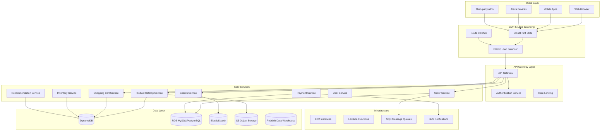
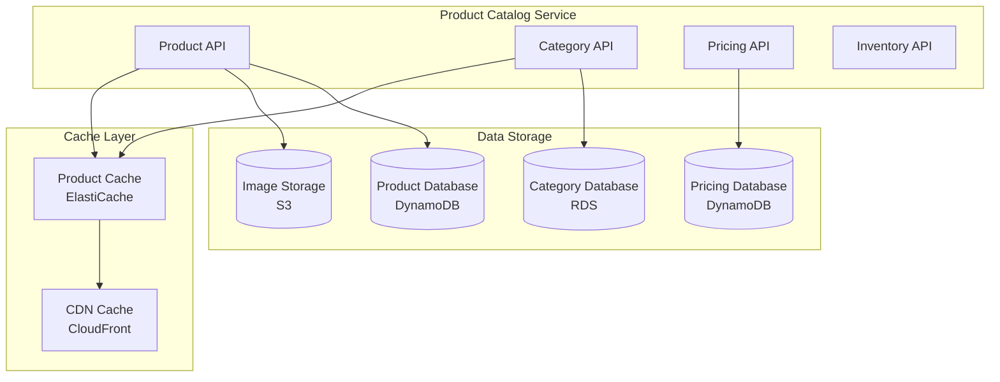
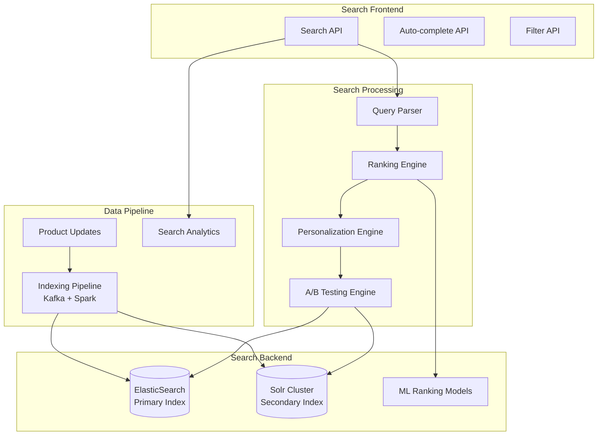
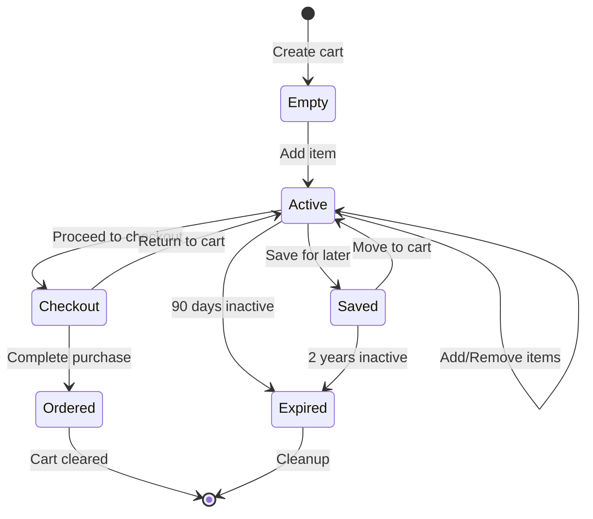

# Amazon E-Commerce Platform: From Monolith to Global Marketplace

## 🛒 Executive Summary

Amazon's transformation from an online bookstore to the world's largest e-commerce platform represents one of the most successful architectural evolutions in technology history. Starting as a monolithic application in 1994, Amazon pioneered the microservices architecture, serving over **300 million active customers** with **12 million products** across **180+ countries**, processing **billions of transactions** annually.

## 📈 Evolution Timeline

### Phase 1: Monolithic Bookstore (1994-2000)
- **Single application**: All functionality in one codebase
- **Relational database**: Traditional RDBMS approach
- **Limited scale**: Thousands of customers
- **Book-focused**: Single product category

### Phase 2: Expansion & SOA (2000-2006)
- **Service-oriented architecture**: Breaking down the monolith
- **Multiple product categories**: Beyond books
- **AWS birth**: Infrastructure as a service
- **Marketplace introduction**: Third-party sellers

### Phase 3: Microservices Pioneer (2006-2015)
- **Full microservices**: Hundreds of independent services
- **DevOps culture**: "You build it, you run it"
- **Global expansion**: Worldwide operations
- **Prime ecosystem**: Subscription service

### Phase 4: AI & Global Scale (2015-Present)
- **Machine learning**: Personalization at scale
- **Voice commerce**: Alexa integration
- **Global logistics**: Fulfillment by Amazon
- **Cloud dominance**: AWS as separate business

## 🎯 Business Requirements

### Functional Requirements
1. **Product Catalog**: Manage millions of products
2. **Search & Discovery**: Find products efficiently
3. **Shopping Cart**: Manage user selections
4. **Order Processing**: Handle purchase transactions
5. **Payment Processing**: Multiple payment methods
6. **Inventory Management**: Real-time stock tracking
7. **Shipping & Fulfillment**: Global logistics
8. **Customer Service**: Support and returns
9. **Seller Platform**: Third-party marketplace
10. **Recommendations**: Personalized product suggestions

### Non-Functional Requirements
1. **Scale**: 300M+ active customers
2. **Availability**: 99.99% uptime during peak traffic
3. **Performance**: <100ms search response time
4. **Consistency**: Eventual consistency for most data
5. **Security**: PCI compliance, fraud detection
6. **Global**: Multi-region, multi-currency
7. **Elasticity**: Handle traffic spikes (Prime Day, Black Friday)

## 🏛️ High-Level Architecture



## 🔧 Core Microservices Architecture

**The Birthplace of Modern Microservices:**
Amazon pioneered the microservices architecture transformation, evolving from a monolithic bookstore application to **800+ independent microservices** that power the world's largest e-commerce platform. This architectural revolution enabled Amazon to scale from thousands to **300+ million customers** while maintaining system reliability and enabling rapid feature development.

**Microservices Transformation Strategy:**

**1. Monolith Decomposition Approach:**
- **Domain-Driven Decomposition**: Services aligned with business domains (catalog, orders, payments, inventory)
- **Strangler Fig Pattern**: Gradually extracted services from monolith without disrupting operations
- **Data Ownership**: Each service owns its data store, eliminating shared database dependencies
- **API-First Design**: All inter-service communication through well-defined REST APIs
- **Independent Deployment**: Teams deploy services independently without coordinating releases

**2. Service Communication Architecture:**
- **Synchronous Communication**: REST APIs for real-time operations (search, checkout, payments)
- **Asynchronous Messaging**: SQS and SNS for event-driven workflows (order processing, inventory updates)
- **Event-Driven Architecture**: Services publish events for state changes, enabling loose coupling
- **Circuit Breaker Pattern**: Prevents cascade failures when downstream services are unavailable
- **Retry and Timeout Strategies**: Resilient communication patterns for distributed systems

**3. Data Management Strategy:**
- **Polyglot Persistence**: Different databases optimized for specific use cases
- **DynamoDB**: Product catalog, user sessions, shopping cart data for high-speed access
- **RDS MySQL/PostgreSQL**: Transactional data (orders, payments, user accounts) requiring ACID properties
- **ElasticSearch**: Product search, recommendations, analytics with full-text search capabilities
- **S3**: Product images, documents, static content with global CDN distribution
- **Redshift**: Data warehousing for business intelligence and analytics

**4. Service Ownership Model:**
- **Two-Pizza Teams**: Small, autonomous teams (6-8 people) own complete services
- **Full-Stack Ownership**: Teams responsible for development, testing, deployment, and operations
- **DevOps Culture**: "You build it, you run it" philosophy promotes ownership and reliability
- **Service Level Agreements**: Clear contracts between services with defined performance expectations
- **Continuous Deployment**: Multiple deployments per day with automated testing and rollback

### 1. Product Catalog Service
**Purpose**: Manage product information and metadata

**Responsibilities**:
- Product information management
- Category and taxonomy management
- Product images and media
- Pricing and promotions
- Product variants and options

**Data Model**:
```json
{
  "productId": "B08N5WRWNW",
  "title": "Echo Dot (4th Gen)",
  "brand": "Amazon",
  "category": "Electronics > Smart Home",
  "price": {
    "amount": 49.99,
    "currency": "USD",
    "discounts": [
      {
        "type": "percentage",
        "value": 20,
        "validUntil": "2024-01-31"
      }
    ]
  },
  "inventory": {
    "quantity": 1500,
    "fulfillmentCenters": ["FC1", "FC2", "FC3"]
  },
  "attributes": {
    "color": "Charcoal",
    "dimensions": "3.9 x 3.9 x 3.5 inches",
    "weight": "11.2 ounces"
  },
  "images": [
    "https://images.amazon.com/echo-dot-main.jpg"
  ],
  "reviews": {
    "averageRating": 4.5,
    "totalReviews": 89432
  }
}
```

**Architecture**:


### 2. Search Service
**Purpose**: Provide fast, relevant product search

**Technology Stack**:
- **ElasticSearch**: Primary search engine
- **Apache Solr**: Alternative search backend
- **Machine Learning**: Ranking and relevance
- **Real-time indexing**: Product updates

**Search Architecture**:


### 3. Shopping Cart Service
**Purpose**: Manage user shopping sessions

**Features**:
- Persistent cart across sessions
- Guest cart support
- Cart sharing and wishlists
- Price calculations
- Inventory validation

**Cart State Management**:


## 📚 Key Lessons Learned

### Architectural Principles
1. **Service Ownership**: "You build it, you run it"
2. **Loose Coupling**: Services communicate via APIs
3. **High Cohesion**: Related functionality grouped together
4. **Fault Isolation**: Failures contained within services
5. **Eventual Consistency**: Accept trade-offs for scale

### Scaling Strategies
1. **Horizontal Scaling**: Add more servers, not bigger servers
2. **Stateless Services**: Enable easy scaling and recovery
3. **Caching Everywhere**: Multiple layers of caching
4. **Async Processing**: Decouple heavy operations
5. **Data Partitioning**: Shard data across multiple databases

### Operational Excellence
1. **Automation First**: Automate everything possible
2. **Measure Everything**: Comprehensive metrics and monitoring
3. **Fail Fast**: Quick detection and recovery
4. **Continuous Deployment**: Multiple deployments per day
5. **Customer Obsession**: Every decision focused on customer experience

## 🎯 Business Impact

### Financial Metrics
- **$469+ billion revenue** (2021)
- **$33+ billion AWS revenue** (separate business unit)
- **300+ million Prime members** worldwide
- **12+ million products** in catalog
- **2+ million sellers** on marketplace

### Market Position
1. **E-commerce Leader**: 40%+ of US e-commerce
2. **Cloud Computing**: AWS market leader
3. **Innovation Driver**: Pioneering new technologies
4. **Global Reach**: Operations in 180+ countries
5. **Ecosystem Platform**: Enabling millions of businesses

This comprehensive case study demonstrates how Amazon transformed from a simple online bookstore to a global technology platform through innovative architecture, relentless customer focus, and continuous technological evolution. Their journey from monolith to microservices provides invaluable lessons for building and scaling complex distributed systems.
