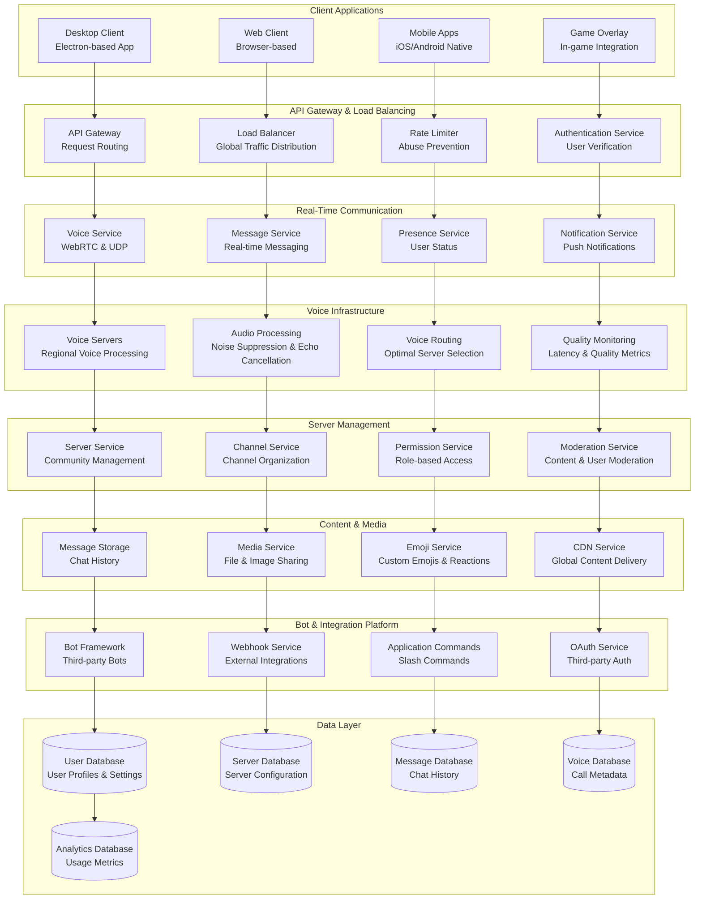

# Discord Real-Time Gaming Communication: Low-Latency Voice and Text for 150M+ Users

## 🎮 Executive Summary

Discord operates the world's leading gaming communication platform, serving **150+ million monthly active users** across **19+ million active servers** with **ultra-low latency voice chat**, **real-time messaging**, and **rich media sharing**. Processing **billions of messages daily** and handling **millions of concurrent voice connections** with **sub-100ms latency globally**, Discord's architecture combines **real-time communication protocols**, **global edge infrastructure**, **advanced audio processing**, and **scalable server management** to create seamless communication experiences for gaming communities worldwide.

## 📈 Scale and Business Impact

### Key Metrics
- **150+ million monthly active users**
- **19+ million active servers** (communities)
- **Billions of messages** sent daily
- **Millions of concurrent** voice connections
- **Sub-100ms voice latency** globally
- **99.99%+ uptime** for core services
- **4+ billion minutes** of voice chat monthly
- **500+ million messages** sent daily
- **$445+ million revenue** (2022)

### Platform Evolution Timeline
- **2015**: Discord founded, gaming-focused voice and text chat
- **2016**: Server communities and bot ecosystem launch
- **2017**: Video calling and screen sharing features
- **2018**: Game store launch (later discontinued)
- **2019**: Go Live streaming and server boosting
- **2020**: COVID-19 surge, mainstream adoption beyond gaming
- **2021**: Stage Channels for large community events
- **2022**: Forum channels and community features expansion
- **2023**: AI integration and enhanced moderation tools

## 🏛️ High-Level Architecture

## 🎙️ Real-Time Voice Communication Architecture

**Ultra-Low Latency Voice Infrastructure:**
Discord's voice system delivers **sub-100ms latency globally** while supporting **millions of concurrent voice connections** across **thousands of voice servers** worldwide. The architecture combines **WebRTC protocols**, **UDP optimization**, **advanced audio processing**, and **intelligent routing** to provide crystal-clear voice communication for gaming communities.

**Voice Communication Pipeline:**

**1. WebRTC and Protocol Optimization:**
- **WebRTC Implementation**: Optimized WebRTC stack for low-latency peer-to-peer voice communication
- **UDP Protocol**: Direct UDP connections bypassing TCP overhead for minimal latency
- **STUN/TURN Servers**: NAT traversal and relay servers for connection establishment
- **Opus Audio Codec**: High-quality, low-latency audio encoding optimized for voice
- **Adaptive Bitrate**: Dynamic quality adjustment based on network conditions

**2. Global Voice Server Network:**
- **Regional Voice Servers**: Strategically placed voice servers in major population centers
- **Intelligent Server Selection**: Automatic selection of optimal voice server based on latency
- **Load Balancing**: Dynamic load distribution across available voice servers
- **Failover Mechanisms**: Automatic failover to backup servers during outages
- **Capacity Management**: Real-time monitoring and scaling of voice server capacity

**3. Advanced Audio Processing:**
- **Noise Suppression**: AI-powered noise reduction removing background sounds
- **Echo Cancellation**: Advanced echo cancellation for clear voice communication
- **Automatic Gain Control**: Dynamic volume normalization for consistent audio levels
- **Push-to-Talk Optimization**: Ultra-low latency push-to-talk activation
- **Voice Activity Detection**: Intelligent detection of speech vs. background noise

**Voice Quality Optimization:**

**1. Network Optimization:**
- **Jitter Buffer Management**: Adaptive jitter buffers compensating for network variations
- **Packet Loss Recovery**: Forward error correction and packet retransmission strategies
- **Bandwidth Adaptation**: Dynamic quality adjustment based on available bandwidth
- **Priority Queuing**: Voice traffic prioritization over other data types
- **Network Path Optimization**: Intelligent routing through fastest network paths

**2. Audio Quality Enhancement:**
- **Krisp Integration**: AI-powered noise cancellation technology
- **Audio Normalization**: Consistent audio levels across different microphones and setups
- **Spatial Audio**: 3D positional audio for immersive gaming experiences
- **Music Mode**: High-quality audio mode for music sharing and streaming
- **Legacy Compatibility**: Support for various audio codecs and legacy devices

**3. Performance Monitoring:**
- **Real-Time Latency Monitoring**: Continuous measurement of voice latency and quality
- **Quality Metrics**: Tracking packet loss, jitter, and audio quality indicators
- **User Experience Analytics**: Understanding voice quality impact on user satisfaction
- **Server Performance Monitoring**: Monitoring voice server CPU, memory, and network usage
- **Automated Alerting**: Real-time alerts for voice quality degradation or outages

## 💬 Real-Time Messaging System

**Massive-Scale Real-Time Text Communication:**
Discord processes **billions of messages daily** across **19+ million servers** with **instant delivery**, **message history**, **rich formatting**, and **multimedia support**. The messaging system handles **extreme traffic spikes** during major gaming events while maintaining **consistent performance**.

**Messaging Architecture:**

**1. Real-Time Message Delivery:**
- **WebSocket Connections**: Persistent WebSocket connections for instant message delivery
- **Message Routing**: Intelligent routing of messages to all relevant recipients
- **Delivery Guarantees**: At-least-once delivery with deduplication mechanisms
- **Offline Message Handling**: Message queuing and delivery for offline users
- **Cross-Platform Synchronization**: Consistent message state across all user devices

**2. Message Storage and Retrieval:**
- **Distributed Message Storage**: Horizontally scaled message storage across multiple databases
- **Message Indexing**: Efficient indexing for message search and retrieval
- **Message History**: Complete message history with pagination and search capabilities
- **Message Retention**: Configurable message retention policies for different server types
- **Backup and Archival**: Automated backup and archival of message data

**3. Rich Content Support:**
- **Markdown Formatting**: Rich text formatting with markdown syntax support
- **Embed System**: Rich embeds for links, media, and structured content
- **File Attachments**: Support for various file types with size limits and virus scanning
- **Custom Emojis**: Server-specific custom emojis and animated emoji support
- **Reactions System**: Message reactions with custom and Unicode emojis

**Messaging Performance Optimization:**

**1. Scalability Strategies:**
- **Message Sharding**: Distributing messages across multiple database shards
- **Caching Layers**: Multi-level caching for frequently accessed messages
- **Read Replicas**: Database read replicas for improved query performance
- **Message Compression**: Efficient message compression for storage and transmission
- **Batch Processing**: Batching of non-critical operations for improved efficiency

**2. Real-Time Synchronization:**
- **Event Sourcing**: Complete event log for message state reconstruction
- **Conflict Resolution**: Handling concurrent message operations and conflicts
- **State Synchronization**: Keeping message state consistent across all clients
- **Offline Synchronization**: Efficient synchronization when users come back online
- **Cross-Device Consistency**: Ensuring consistent message state across user devices

## 🏰 Server and Community Management

**Scalable Community Infrastructure:**
Discord supports **19+ million active servers** ranging from **small friend groups** to **massive communities with hundreds of thousands of members**. The platform provides **sophisticated permission systems**, **moderation tools**, and **community features** while maintaining **performance** and **security** at scale.

**Server Architecture:**

**1. Hierarchical Server Structure:**
- **Server Organization**: Hierarchical structure with categories, channels, and threads
- **Channel Types**: Text channels, voice channels, stage channels, and forum channels
- **Permission System**: Role-based permissions with granular access control
- **Server Regions**: Regional server hosting for optimal performance
- **Server Limits**: Scalable limits based on server boosting and membership tiers

**2. Member Management:**
- **User Roles**: Flexible role system with customizable permissions and hierarchy
- **Member Onboarding**: Welcome screens, rules acceptance, and verification systems
- **Member Discovery**: Server discovery and invitation systems
- **Member Analytics**: Insights into member activity and engagement
- **Member Retention**: Tools and features for improving member retention

**3. Community Features:**
- **Server Boosting**: Community-driven server enhancement system
- **Events System**: Scheduled events with RSVP and reminder functionality
- **Forum Channels**: Threaded discussions for organized community conversations
- **Stage Channels**: Large-scale audio events and presentations
- **Community Insights**: Analytics and insights for community growth

**Advanced Server Management:**

**1. Moderation and Safety:**
- **AutoMod**: AI-powered automatic content moderation
- **Moderation Tools**: Comprehensive tools for community moderators
- **Audit Logs**: Complete audit trail of server actions and changes
- **Reporting System**: User reporting and safety team review processes
- **Safety Features**: Tools for protecting users from harassment and abuse

**2. Customization and Branding:**
- **Server Themes**: Custom server appearance and branding options
- **Custom Emojis**: Server-specific emoji creation and management
- **Server Icons**: Custom server icons and banners
- **Welcome Screens**: Customizable welcome messages and server information
- **Role Icons**: Custom icons for different member roles

**3. Integration and Automation:**
- **Bot Integration**: Rich bot ecosystem for server automation and features
- **Webhook Support**: External service integration through webhooks
- **API Access**: Comprehensive API for custom integrations and tools
- **Slash Commands**: Application commands for bot and service interactions
- **Server Templates**: Shareable server configurations and setups

## 🤖 Bot Ecosystem and Developer Platform

**Thriving Bot and Integration Ecosystem:**
Discord hosts **millions of bots** across its platform, providing **automated moderation**, **entertainment features**, **utility functions**, and **game integrations**. The developer platform offers **comprehensive APIs**, **development tools**, and **monetization opportunities** for bot creators.

**Bot Platform Architecture:**

**1. Bot Framework:**
- **Discord API**: Comprehensive REST API and WebSocket gateway for bot development
- **Application Commands**: Slash commands, context menus, and interactive components
- **OAuth2 Integration**: Secure bot authentication and authorization
- **Rate Limiting**: Sophisticated rate limiting preventing API abuse
- **Bot Verification**: Verification process for bots in large servers

**2. Real-Time Bot Interactions:**
- **Gateway Connection**: WebSocket gateway for real-time event streaming
- **Event System**: Comprehensive event system for bot reactivity
- **Interaction Handling**: Immediate response system for user interactions
- **Message Components**: Interactive buttons, select menus, and forms
- **Modal Dialogs**: Pop-up forms for complex user input

**3. Bot Hosting and Scaling:**
- **Bot Hosting Solutions**: Recommendations and partnerships for bot hosting
- **Scaling Guidelines**: Best practices for scaling bots across multiple servers
- **Performance Monitoring**: Tools for monitoring bot performance and reliability
- **Error Handling**: Comprehensive error handling and debugging tools
- **Bot Analytics**: Usage analytics and performance metrics for bot developers

**Developer Experience:**

**1. Development Tools:**
- **Discord.js Library**: Official JavaScript library for bot development
- **Python Discord.py**: Official Python library with comprehensive features
- **Multiple Language Support**: Official and community libraries for various programming languages
- **Development Documentation**: Comprehensive documentation with examples and tutorials
- **Developer Community**: Active community forums and support channels

**2. Testing and Debugging:**
- **Bot Testing Tools**: Local testing environments and debugging tools
- **Staging Environments**: Safe testing environments for bot development
- **Error Reporting**: Detailed error reporting and logging systems
- **Performance Profiling**: Tools for analyzing bot performance and optimization
- **Beta Features**: Early access to new API features and capabilities

**3. Monetization and Distribution:**
- **Bot Discovery**: Official bot discovery and listing systems
- **Premium Features**: Support for premium bot features and subscriptions
- **Server Monetization**: Tools for bots to support server monetization
- **Developer Revenue**: Revenue sharing and monetization opportunities
- **Verification Benefits**: Enhanced features and visibility for verified bots

## 🎨 User Experience and Interface Design

**Gaming-Optimized User Experience:**
Discord's interface is **specifically designed for gamers** with **dark themes**, **customizable layouts**, **keyboard shortcuts**, and **game integration features** that enhance the gaming experience while maintaining **accessibility** and **ease of use**.

**Interface Design Principles:**

**1. Gaming-First Design:**
- **Dark Theme**: Default dark theme reducing eye strain during extended gaming sessions
- **Game Overlay**: In-game overlay for voice chat and messaging without alt-tabbing
- **Rich Presence**: Game activity integration showing what users are playing
- **Streaming Integration**: Built-in screen sharing and streaming capabilities
- **Keyboard Shortcuts**: Comprehensive keyboard shortcuts for power users

**2. Customization and Personalization:**
- **User Profiles**: Rich user profiles with custom statuses, avatars, and banners
- **Server Customization**: Extensive server customization options for communities
- **Theme Options**: Multiple theme options and appearance settings
- **Accessibility Features**: Comprehensive accessibility options for users with disabilities
- **Mobile Optimization**: Consistent experience across desktop, web, and mobile platforms

**3. Performance and Responsiveness:**
- **Fast Loading**: Optimized loading times for messages, voice, and media
- **Smooth Animations**: Fluid animations and transitions enhancing user experience
- **Efficient Memory Usage**: Optimized memory usage for long-running sessions
- **Battery Optimization**: Mobile app optimizations for battery life
- **Offline Functionality**: Limited offline functionality for viewing cached content

## 📊 Analytics and Community Insights

**Comprehensive Platform Analytics:**
Discord provides **detailed analytics** for **server owners**, **bot developers**, and **platform administrators** to understand **community engagement**, **platform usage**, and **system performance** through sophisticated data collection and analysis.

**Analytics Architecture:**

**1. Real-Time Metrics:**
- **User Activity Tracking**: Real-time monitoring of user engagement and activity
- **Server Analytics**: Detailed insights into server growth, activity, and member engagement
- **Voice Usage Statistics**: Analysis of voice chat usage patterns and quality metrics
- **Message Analytics**: Understanding messaging patterns, frequency, and engagement
- **Bot Performance Metrics**: Comprehensive analytics for bot usage and effectiveness

**2. Community Insights:**
- **Member Growth Analysis**: Understanding factors driving community growth
- **Engagement Patterns**: Analysis of when and how community members are most active
- **Content Performance**: Understanding which types of content drive the most engagement
- **Retention Analysis**: Identifying factors that improve member retention
- **Moderation Effectiveness**: Analytics on moderation actions and their impact

**3. Platform Intelligence:**
- **Feature Usage Analytics**: Understanding how users interact with different platform features
- **Performance Monitoring**: Real-time monitoring of platform performance and reliability
- **User Feedback Analysis**: Analysis of user feedback and feature requests
- **Market Research**: Understanding user needs and competitive landscape
- **Growth Metrics**: Tracking platform growth and expansion metrics

## 📚 Key Lessons Learned

### Technical Architecture Lessons
1. **Real-Time Performance**: Gaming communication requires ultra-low latency and high reliability
2. **Global Infrastructure**: Worldwide user base demands sophisticated global infrastructure and edge computing
3. **Scalable Communities**: Supporting communities of vastly different sizes requires flexible, scalable architecture
4. **Voice Quality Priority**: Voice communication quality directly impacts user experience and retention
5. **Developer Ecosystem**: Rich API and bot ecosystem drives platform engagement and stickiness

### Business Strategy Lessons
1. **Gaming Focus**: Deep focus on gaming community needs creates strong product-market fit
2. **Community Building**: Platform success depends on thriving, engaged communities
3. **Developer Relations**: Strong developer ecosystem drives innovation and platform value
4. **Freemium Model**: Free core features with premium enhancements drives adoption and revenue
5. **Platform Evolution**: Successful expansion beyond gaming while maintaining core gaming identity

### Operational Excellence
1. **Reliability Requirements**: Gaming communities require extremely high uptime and performance
2. **Safety and Moderation**: Large-scale communities require sophisticated moderation and safety tools
3. **Global Operations**: Supporting worldwide communities requires 24/7 global operations
4. **Performance Monitoring**: Real-time monitoring essential for maintaining voice quality and user experience
5. **Community Support**: Active community engagement and support drives platform loyalty

## 🎯 Business Impact and Future Vision

### Financial Performance
- **$445+ million revenue** (2022)
- **Strong growth trajectory** with expanding user base
- **Successful freemium model** with Nitro subscriptions
- **Growing enterprise adoption** for team communication
- **Expanding monetization** through server boosting and premium features

### Market Transformation
1. **Gaming Communication Revolution**: Transformed how gamers communicate and build communities
2. **Community Platform Evolution**: Evolved from gaming chat to broader community platform
3. **Developer Ecosystem**: Created thriving ecosystem of bot developers and integrations
4. **Social Gaming**: Enhanced social aspects of gaming through persistent communities
5. **Remote Communication**: Became essential tool for remote communication during COVID-19

### Future Vision
1. **AI Integration**: Enhanced AI features for moderation, content creation, and user experience
2. **Metaverse Integration**: Integration with virtual worlds and metaverse platforms
3. **Creator Economy**: Expanding tools and monetization for content creators and community builders
4. **Enterprise Growth**: Continued expansion into business and professional communication
5. **Global Expansion**: Further international growth and localization

This comprehensive case study demonstrates how Discord built the world's leading gaming communication platform through ultra-low latency voice technology, scalable community infrastructure, and a thriving developer ecosystem that serves 150+ million users across millions of gaming communities worldwide.
