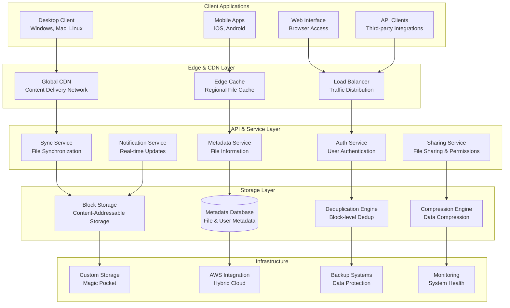
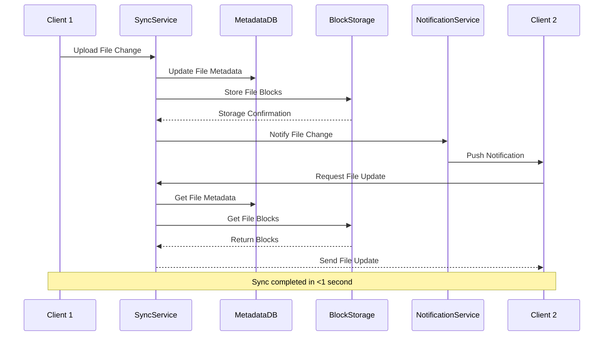
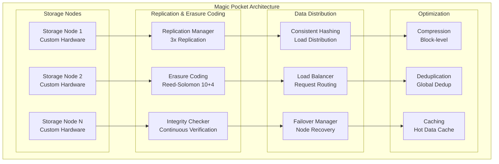

# Dropbox Storage Infrastructure: Exabyte-Scale File Storage and Synchronization

## 📁 Executive Summary

Dropbox operates one of the world's largest distributed file storage systems, serving **700+ million registered users** with **600+ petabytes of data** stored across **200+ million files** synced daily. Processing **1+ billion file operations** per day with **99.99%+ availability**, Dropbox's architecture combines **block-level deduplication**, **real-time synchronization**, **global content delivery**, and **enterprise-grade security** to provide seamless file access across **any device, anywhere**.

## 📈 Scale and Business Impact

### Key Metrics
- **700+ million registered users** globally
- **600+ petabytes of user data** stored
- **200+ million files** synced daily
- **1+ billion file operations** per day
- **99.99%+ availability** SLA
- **Sub-second sync** for small files
- **150+ countries** served
- **600,000+ business customers**
- **$2.3+ billion revenue** (2022)

### Platform Evolution Timeline
- **2008**: Dropbox founded, basic file sync
- **2011**: 50 million users milestone
- **2012**: Business team features launch
- **2013**: Datastore API for developers
- **2016**: Smart Sync and selective sync
- **2017**: Dropbox Paper collaboration tool
- **2018**: IPO and enterprise focus
- **2020**: Remote work surge, 700M users
- **2022**: AI-powered search and organization

## 🏛️ High-Level Architecture



## 🔄 File Synchronization Architecture

**World's Most Sophisticated File Synchronization System:**
Dropbox's synchronization architecture represents the pinnacle of distributed file system design, handling **200+ million files synced daily** across **billions of devices** while maintaining **consistency**, **performance**, and **reliability**. The system combines **block-level deduplication**, **real-time conflict resolution**, **bandwidth optimization**, and **offline-first design** to provide seamless file access across any device, anywhere.

**Multi-Layer Synchronization Architecture:**

**1. Block-Level Deduplication Engine:**
- **Content-Defined Chunking**: Files split into variable-size blocks based on content patterns, not fixed boundaries
- **Rolling Hash Algorithm**: Efficient detection of changes within files using rolling hash functions
- **Global Deduplication**: Identical blocks shared across all users, dramatically reducing storage requirements
- **Delta Sync**: Only changed blocks transferred, minimizing bandwidth usage for large file updates
- **Compression**: Block-level compression reduces storage footprint and transfer time

**2. Real-Time Conflict Resolution:**
- **Operational Transformation**: Mathematical framework for resolving concurrent edits to same file
- **Vector Clocks**: Distributed timestamp system tracks causality relationships between file versions
- **Last-Writer-Wins**: Simple conflict resolution for metadata changes and binary files
- **Automatic Conflict Files**: System creates conflict copies when automatic resolution isn't possible
- **User Notification**: Real-time alerts when conflicts require user intervention

**3. Offline-First Design Philosophy:**
- **Local File System Integration**: Deep integration with operating system file systems for seamless experience
- **Optimistic Updates**: Local changes applied immediately, synchronized in background
- **Conflict-Free Replicated Data Types**: CRDT algorithms ensure eventual consistency across disconnected clients
- **Intelligent Queuing**: Offline changes queued and synchronized when connectivity restored
- **Bandwidth Adaptation**: Automatic adjustment to available network conditions

**4. Multi-Device Synchronization:**
- **Device State Tracking**: Each device maintains state vector of known file versions
- **Selective Sync**: Users choose which folders to sync to each device
- **Smart Sync**: Cloud-only files appear in file system but don't consume local storage
- **Version History**: Complete version history maintained for file recovery and auditing
- **Cross-Platform Compatibility**: Consistent behavior across Windows, Mac, Linux, iOS, Android

**Synchronization Processing Pipeline:**

**1. Change Detection and Capture:**
- **File System Monitoring**: Real-time monitoring of local file system changes using OS-specific APIs
- **Content Hash Calculation**: SHA-256 hashes calculated for change detection and integrity verification
- **Metadata Extraction**: File attributes, timestamps, and permissions captured
- **Change Batching**: Multiple rapid changes batched together for efficient processing
- **Rate Limiting**: Prevents overwhelming sync service during bulk operations

**2. Block Processing and Deduplication:**
- **Variable Block Chunking**: Content-defined chunking creates blocks optimized for deduplication
- **Block Hash Calculation**: Each block assigned unique hash for deduplication lookup
- **Deduplication Check**: Server-side lookup determines if blocks already exist in system
- **Novel Block Upload**: Only new blocks uploaded, existing blocks referenced
- **Block Verification**: Integrity checks ensure uploaded blocks match expected hashes

**3. Metadata Management:**
- **File Metadata Storage**: Comprehensive metadata including permissions, timestamps, sharing settings
- **Namespace Management**: Hierarchical namespace with efficient path resolution
- **Sharing Metadata**: Complex permission structures for shared folders and files
- **Version Tracking**: Complete version history with efficient storage using block references
- **Search Indexing**: Full-text search indexing for rapid file discovery

### Real-Time Sync Engine
Dropbox synchronizes **200+ million files daily** across devices:



## 🌍 Global Content Delivery Network

### Magic Pocket Storage System
Dropbox operates custom storage infrastructure called "Magic Pocket":



## 📊 Performance Optimization

### Bandwidth Management and Optimization
```python
class BandwidthManager:
    """Intelligent bandwidth management for sync operations"""
    
    def __init__(self):
        self.network_monitor = NetworkMonitor()
        self.adaptive_sync = AdaptiveSyncManager()
        self.priority_queue = PriorityQueue()
        self.throttle_controller = ThrottleController()
        
    def optimize_sync_bandwidth(self, user_id, pending_syncs):
        """Optimize bandwidth usage for sync operations"""
        
        # Assess current network conditions
        network_conditions = self.network_monitor.get_network_conditions(user_id)
        
        # Prioritize sync operations
        prioritized_syncs = self.prioritize_sync_operations(pending_syncs, network_conditions)
        
        # Calculate optimal bandwidth allocation
        bandwidth_allocation = self.calculate_bandwidth_allocation(
            prioritized_syncs, network_conditions
        )
        
        # Apply adaptive sync strategies
        optimized_syncs = self.apply_adaptive_sync_strategies(
            prioritized_syncs, bandwidth_allocation
        )
        
        return optimized_syncs
    
    def prioritize_sync_operations(self, pending_syncs, network_conditions):
        """Prioritize sync operations based on various factors"""
        
        prioritized = []
        
        for sync_op in pending_syncs:
            priority_score = self.calculate_sync_priority(sync_op, network_conditions)
            
            prioritized.append({
                'sync_operation': sync_op,
                'priority_score': priority_score,
                'estimated_bandwidth': self.estimate_bandwidth_requirement(sync_op),
                'estimated_time': self.estimate_sync_time(sync_op, network_conditions)
            })
        
        # Sort by priority score (descending)
        prioritized.sort(key=lambda x: x['priority_score'], reverse=True)
        
        return prioritized
    
    def calculate_sync_priority(self, sync_op, network_conditions):
        """Calculate priority score for sync operation"""
        
        priority_score = 0.5  # Base priority
        
        # File type priority
        if sync_op['file_type'] in ['document', 'text']:
            priority_score += 0.3  # High priority for documents
        elif sync_op['file_type'] in ['image', 'video']:
            priority_score += 0.1  # Lower priority for media
        
        # File size factor (smaller files get higher priority)
        file_size_mb = sync_op['file_size'] / (1024 * 1024)
        if file_size_mb < 1:  # < 1MB
            priority_score += 0.2
        elif file_size_mb < 10:  # < 10MB
            priority_score += 0.1
        
        # Recency factor (recently modified files get higher priority)
        hours_since_modified = (time.time() - sync_op['modified_at']) / 3600
        if hours_since_modified < 1:  # Modified in last hour
            priority_score += 0.3
        elif hours_since_modified < 24:  # Modified in last day
            priority_score += 0.1
        
        # User activity factor (files from active users get higher priority)
        if sync_op.get('user_active', False):
            priority_score += 0.2
        
        # Network conditions factor
        if network_conditions['quality'] == 'poor':
            # Prioritize smaller files on poor connections
            if file_size_mb < 1:
                priority_score += 0.2
            else:
                priority_score -= 0.2
        
        return min(1.0, max(0.0, priority_score))
    
    def calculate_bandwidth_allocation(self, prioritized_syncs, network_conditions):
        """Calculate optimal bandwidth allocation"""
        
        available_bandwidth = network_conditions['available_bandwidth_mbps']
        
        # Reserve bandwidth for system operations
        reserved_bandwidth = available_bandwidth * 0.1  # 10% reserved
        usable_bandwidth = available_bandwidth - reserved_bandwidth
        
        # Allocate bandwidth based on priority and estimated requirements
        allocations = []
        remaining_bandwidth = usable_bandwidth
        
        for sync_info in prioritized_syncs:
            sync_op = sync_info['sync_operation']
            estimated_bandwidth = sync_info['estimated_bandwidth']
            
            # Calculate allocation based on priority and availability
            priority_factor = sync_info['priority_score']
            requested_bandwidth = min(estimated_bandwidth, remaining_bandwidth * priority_factor)
            
            if remaining_bandwidth > 0 and requested_bandwidth > 0:
                allocated_bandwidth = min(requested_bandwidth, remaining_bandwidth)
                allocations.append({
                    'sync_operation': sync_op,
                    'allocated_bandwidth': allocated_bandwidth,
                    'priority': sync_info['priority_score']
                })
                
                remaining_bandwidth -= allocated_bandwidth
            else:
                # No bandwidth available, defer sync
                allocations.append({
                    'sync_operation': sync_op,
                    'allocated_bandwidth': 0,
                    'deferred': True
                })
        
        return allocations
    
    def apply_adaptive_sync_strategies(self, prioritized_syncs, bandwidth_allocation):
        """Apply adaptive strategies based on network conditions"""
        
        optimized_syncs = []
        
        for allocation in bandwidth_allocation:
            sync_op = allocation['sync_operation']
            allocated_bandwidth = allocation['allocated_bandwidth']
            
            if allocation.get('deferred'):
                # Defer sync operation
                optimized_syncs.append({
                    'sync_operation': sync_op,
                    'action': 'defer',
                    'reason': 'insufficient_bandwidth'
                })
                continue
            
            # Determine sync strategy based on file size and bandwidth
            file_size = sync_op['file_size']
            
            if file_size < 1024 * 1024:  # < 1MB
                # Small file - sync immediately
                optimized_syncs.append({
                    'sync_operation': sync_op,
                    'action': 'immediate_sync',
                    'allocated_bandwidth': allocated_bandwidth
                })
            
            elif file_size < 100 * 1024 * 1024:  # < 100MB
                # Medium file - use delta sync if possible
                if sync_op.get('can_use_delta'):
                    optimized_syncs.append({
                        'sync_operation': sync_op,
                        'action': 'delta_sync',
                        'allocated_bandwidth': allocated_bandwidth
                    })
                else:
                    optimized_syncs.append({
                        'sync_operation': sync_op,
                        'action': 'chunked_sync',
                        'chunk_size': self.calculate_optimal_chunk_size(allocated_bandwidth),
                        'allocated_bandwidth': allocated_bandwidth
                    })
            
            else:  # > 100MB
                # Large file - use background sync with resumable uploads
                optimized_syncs.append({
                    'sync_operation': sync_op,
                    'action': 'background_sync',
                    'resumable': True,
                    'chunk_size': self.calculate_optimal_chunk_size(allocated_bandwidth),
                    'allocated_bandwidth': allocated_bandwidth
                })
        
        return optimized_syncs
    
    def calculate_optimal_chunk_size(self, allocated_bandwidth_mbps):
        """Calculate optimal chunk size based on available bandwidth"""
        
        # Base chunk size of 4MB
        base_chunk_size = 4 * 1024 * 1024
        
        # Adjust based on bandwidth
        if allocated_bandwidth_mbps > 10:  # High bandwidth
            return base_chunk_size * 2  # 8MB chunks
        elif allocated_bandwidth_mbps > 5:  # Medium bandwidth
            return base_chunk_size  # 4MB chunks
        else:  # Low bandwidth
            return base_chunk_size // 2  # 2MB chunks

class ConflictResolver:
    """Resolve file conflicts during synchronization"""
    
    def __init__(self):
        self.merge_strategies = MergeStrategies()
        self.conflict_detector = ConflictDetector()
        self.user_preferences = UserPreferences()
        
    def resolve_conflict(self, user_id, file_path, conflicting_versions):
        """Resolve conflicts between file versions"""
        
        conflict_type = self.conflict_detector.detect_conflict_type(conflicting_versions)
        
        # Get user's conflict resolution preferences
        user_prefs = self.user_preferences.get_conflict_preferences(user_id)
        
        if conflict_type == 'simple_timestamp':
            # Simple timestamp conflict - use user preference
            if user_prefs['timestamp_resolution'] == 'latest':
                return self.resolve_by_latest_timestamp(conflicting_versions)
            elif user_prefs['timestamp_resolution'] == 'manual':
                return self.create_manual_resolution_request(user_id, file_path, conflicting_versions)
        
        elif conflict_type == 'content_conflict':
            # Content has diverged - attempt automatic merge
            if self.can_auto_merge(conflicting_versions):
                return self.attempt_auto_merge(conflicting_versions)
            else:
                # Create conflict copies for manual resolution
                return self.create_conflict_copies(user_id, file_path, conflicting_versions)
        
        elif conflict_type == 'structural_conflict':
            # File vs folder conflict or similar
            return self.resolve_structural_conflict(user_id, file_path, conflicting_versions)
        
        else:
            # Unknown conflict type - default to manual resolution
            return self.create_manual_resolution_request(user_id, file_path, conflicting_versions)
    
    def create_conflict_copies(self, user_id, file_path, conflicting_versions):
        """Create conflict copies for manual resolution"""
        
        base_name, extension = os.path.splitext(file_path)
        conflict_copies = []
        
        for i, version in enumerate(conflicting_versions):
            # Create unique filename for conflict copy
            device_name = version.get('device_name', f'Device{i+1}')
            timestamp = datetime.fromtimestamp(version['modified_at']).strftime('%Y-%m-%d %H-%M-%S')
            
            conflict_filename = f"{base_name} ({device_name}'s conflicted copy {timestamp}){extension}"
            
            # Create metadata for conflict copy
            conflict_metadata = version.copy()
            conflict_metadata['file_path'] = conflict_filename
            conflict_metadata['is_conflict_copy'] = True
            conflict_metadata['original_file'] = file_path
            conflict_metadata['conflict_resolution_id'] = self.generate_conflict_id()
            
            conflict_copies.append(conflict_metadata)
        
        return {
            'resolution_type': 'conflict_copies',
            'conflict_copies': conflict_copies,
            'requires_user_action': True,
            'resolution_message': f"Conflicting versions of '{file_path}' have been saved as separate files for manual review."
        }
    
    def attempt_auto_merge(self, conflicting_versions):
        """Attempt automatic merge of conflicting versions"""
        
        if len(conflicting_versions) != 2:
            return {'success': False, 'reason': 'Auto-merge only supports 2 versions'}
        
        version1, version2 = conflicting_versions
        
        # Get file content for both versions
        content1 = self.get_file_content(version1)
        content2 = self.get_file_content(version2)
        
        # Attempt merge based on file type
        file_extension = os.path.splitext(version1['file_path'])[1].lower()
        
        if file_extension in ['.txt', '.md', '.py', '.js', '.html', '.css']:
            # Text-based file - attempt 3-way merge
            return self.merge_text_files(version1, version2, content1, content2)
        
        elif file_extension in ['.json', '.xml', '.yaml']:
            # Structured data - attempt semantic merge
            return self.merge_structured_files(version1, version2, content1, content2)
        
        else:
            # Binary file - cannot auto-merge
            return {'success': False, 'reason': 'Cannot auto-merge binary files'}
    
    def merge_text_files(self, version1, version2, content1, content2):
        """Merge text files using 3-way merge algorithm"""
        
        try:
            # Find common ancestor
            common_ancestor = self.find_common_ancestor(version1, version2)
            
            if common_ancestor:
                ancestor_content = self.get_file_content(common_ancestor)
                
                # Perform 3-way merge
                merged_content = self.three_way_merge(
                    ancestor_content, content1, content2
                )
                
                if merged_content['has_conflicts']:
                    return {
                        'success': False,
                        'reason': 'Merge conflicts detected',
                        'conflicts': merged_content['conflicts']
                    }
                else:
                    # Create merged version
                    merged_version = self.create_merged_version(
                        version1, version2, merged_content['content']
                    )
                    
                    return {
                        'success': True,
                        'resolution_type': 'auto_merge',
                        'merged_version': merged_version
                    }
            else:
                # No common ancestor - cannot perform 3-way merge
                return {'success': False, 'reason': 'No common ancestor found'}
                
        except Exception as e:
            return {'success': False, 'reason': f'Merge failed: {str(e)}'}
```

## 📚 Key Lessons Learned

### Technical Architecture Lessons
1. **Block-Level Deduplication**: Massive storage savings through global deduplication across all users
2. **Distributed Storage**: Custom storage infrastructure (Magic Pocket) optimized for file storage workloads
3. **Real-Time Sync**: Event-driven architecture enables sub-second file synchronization
4. **Conflict Resolution**: Sophisticated conflict detection and resolution for concurrent file modifications
5. **Bandwidth Optimization**: Intelligent bandwidth management and adaptive sync strategies

### Business Strategy Lessons
1. **Freemium Model**: Free tier drives user acquisition, paid tiers provide revenue
2. **Enterprise Focus**: B2B market provides higher revenue per user and better retention
3. **Platform Strategy**: APIs and integrations expand ecosystem and stickiness
4. **Global Infrastructure**: Local data centers improve performance and compliance
5. **Security First**: Enterprise-grade security essential for business adoption

### Operational Excellence
1. **Reliability**: 99.99%+ availability through redundant systems and graceful degradation
2. **Performance Monitoring**: Comprehensive monitoring of sync performance and user experience
3. **Capacity Planning**: Predictive scaling for storage and bandwidth requirements
4. **Data Protection**: Multiple layers of redundancy and backup systems
5. **Cost Optimization**: Efficient storage and bandwidth utilization through deduplication and compression

## 🎯 Business Impact

### Financial Performance
- **$2.3+ billion revenue** (2022)
- **700+ million registered users**
- **600,000+ business customers**
- **Strong gross margins** through infrastructure efficiency
- **Predictable subscription revenue** model

### Market Position
1. **File Storage Leader**: Dominant position in cloud file storage and sync
2. **Enterprise Adoption**: Strong presence in business and enterprise markets
3. **Developer Platform**: Extensive API ecosystem for third-party integrations
4. **Global Reach**: Operations in 150+ countries with local infrastructure
5. **Innovation Driver**: Pioneering advances in distributed storage and sync technology

This comprehensive case study demonstrates how Dropbox built one of the world's most sophisticated file storage and synchronization systems, handling exabytes of data while maintaining real-time sync performance and enterprise-grade reliability through innovative distributed storage architecture and intelligent optimization algorithms.
