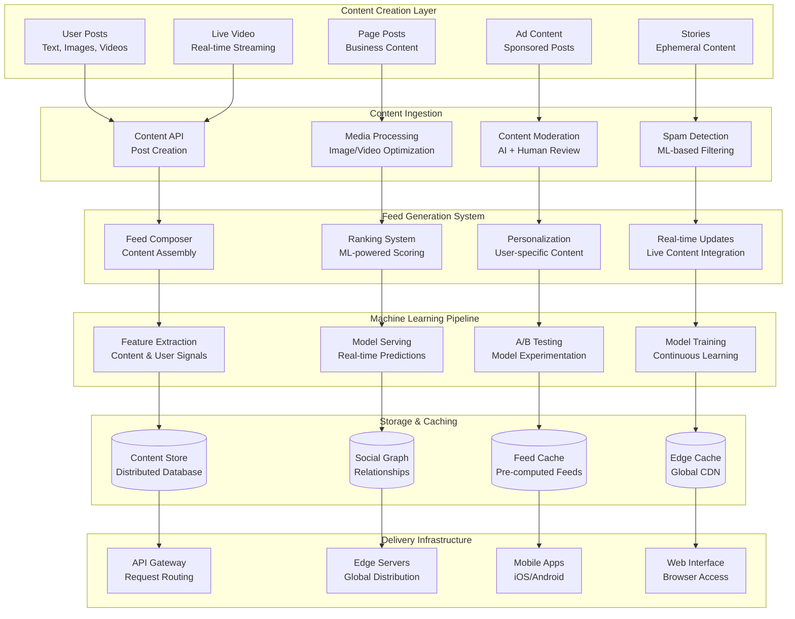
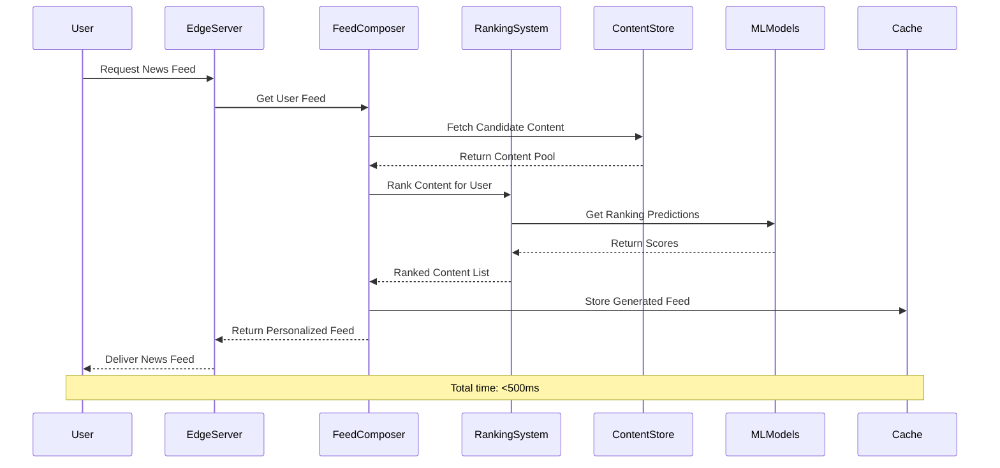
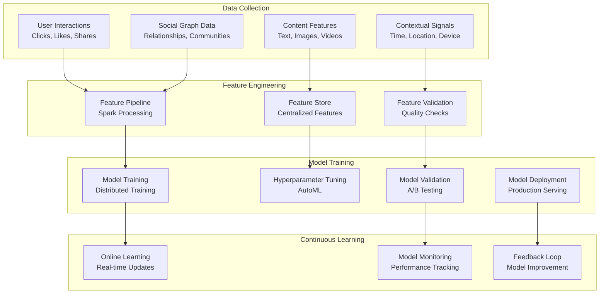
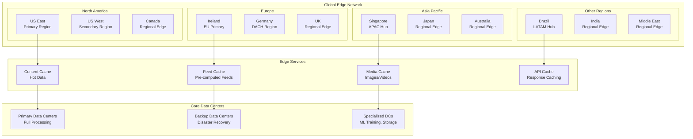

# Facebook News Feed Architecture: Scaling Social Content to 3 Billion Users

## 📱 Executive Summary

Facebook's News Feed represents one of the most complex and sophisticated content delivery systems ever built, serving **personalized content to 3+ billion users** globally. Processing **trillions of posts, interactions, and signals** daily, the News Feed architecture combines **real-time content ingestion**, **machine learning-powered ranking**, **massive distributed storage**, and **edge computing** to deliver relevant, engaging content with **sub-second latency** worldwide.

## 📈 Scale and Business Impact

### Key Metrics
- **3+ billion monthly active users**
- **2+ billion daily active users**
- **100+ billion posts** generated monthly
- **4+ petabytes** of data generated daily
- **Trillions of ranking predictions** per day
- **Sub-second feed generation** globally
- **99.95%+ availability** during peak traffic
- **150+ ML models** for content ranking
- **$117+ billion revenue** (2022)

### News Feed Evolution Timeline
- **2006**: Simple chronological feed launch
- **2009**: Introduction of ranking algorithm
- **2012**: EdgeRank algorithm for content filtering
- **2015**: Machine learning integration begins
- **2016**: Real-time personalization at scale
- **2018**: Meaningful social interactions focus
- **2020**: COVID-19 authoritative information prioritization
- **2022**: AI-powered content understanding and creation

## 🏗️ High-Level Architecture

## 📊 News Feed Generation Pipeline

### Real-Time Feed Composition
Facebook generates **billions of personalized feeds** every minute:

### Feed Generation Architecture

**Multi-Stage Content Pipeline Design:**
Facebook's News Feed generation follows a sophisticated multi-stage architecture designed to process massive content volumes while maintaining sub-second response times:

**1. Content Source Aggregation Strategy:**
- **Friends' Posts (Priority 1)**: Recent posts from direct friends within 24-hour window, capped at 3,000 posts to maintain performance
- **Pages Content (Priority 2)**: Posts from followed pages within 48-hour window, allowing slightly older content from brands/creators, limited to 2,000 posts
- **Groups Content (Priority 3)**: Posts from joined groups within 24-hour window, capped at 1,500 posts due to typically higher engagement
- **Trending Content (Priority 4)**: Location and interest-based trending posts, limited to 1,000 items to introduce fresh perspectives
- **ML-Suggested Content (Priority 5)**: Algorithm-recommended content based on user behavior patterns, capped at 1,500 posts
- **Sponsored Content (Priority 6)**: Targeted advertisements based on user profile and behavior, limited to 500 ads per feed generation

**2. Feature Engineering Architecture:**
Facebook employs a comprehensive feature extraction system that processes multiple signal types:

**Content-Based Features:**
- **Basic Metrics**: Content type classification, text length analysis, media presence detection, link analysis
- **Text Analytics**: Natural language processing for sentiment analysis, topic classification, readability scores, and engagement prediction
- **Media Analytics**: Computer vision analysis for image quality, face detection, scene recognition, and video engagement metrics
- **Engagement Signals**: Real-time like counts, comment volumes, share rates, reaction distributions, and engagement velocity calculations

**Author-Based Features:**
- **Relationship Mapping**: Friend vs. page vs. group classification, close friend designation, family relationship identification
- **Authority Metrics**: Follower counts, historical post performance, average engagement rates, content quality scores, spam probability assessment
- **Interaction History**: Historical engagement patterns between user and author, recency of interactions, interaction type distribution

**User-Content Interaction Features:**
- **Direct Interactions**: Previous likes, comments, shares on similar content
- **Social Proof**: Friends' interactions with the same content, network engagement patterns
- **Behavioral Patterns**: Time spent on similar content, scroll behavior, click-through rates

**Temporal Features:**
- **Content Freshness**: Age-based scoring with exponential decay functions, optimal posting time analysis
- **Contextual Timing**: Day-of-week patterns, hour-of-day preferences, seasonal relevance
- **Trend Analysis**: Viral coefficient calculation, engagement acceleration patterns

**3. Machine Learning Ranking System:**

**Model Ensemble Architecture:**
Facebook employs multiple specialized models working in concert:

- **Engagement Prediction Model**: Deep neural networks trained on billions of interaction examples to predict like/comment/share probability
- **Relevance Scoring Model**: Transformer-based models analyzing content-user compatibility using semantic understanding
- **Quality Assessment Model**: Multi-modal models evaluating content quality across text, images, and videos
- **Time-Spent Prediction Model**: Regression models predicting user engagement duration based on content characteristics

**Prediction Fusion Strategy:**
The system combines multiple model outputs using weighted averaging, where weights are dynamically adjusted based on:
- Model confidence scores
- Historical model performance for similar content types
- User segment-specific model effectiveness
- A/B testing results for different weight configurations

**Business Logic Integration:**
Raw ML scores are adjusted using rule-based systems:
- **Freshness Boost**: Recent content receives algorithmic promotion to maintain feed currency
- **Relationship Amplification**: Close friends' content gets significant score increases
- **Quality Promotion**: High-quality content (verified by quality models) receives ranking boosts
- **Spam Penalties**: Content flagged by spam detection systems receives score reductions
- **Social Signal Amplification**: Content with friend interactions receives engagement-based boosts
- **Diversity Balancing**: Similar content types receive diminishing returns to prevent echo chambers

**4. Diversity Optimization System:**

**Multi-Dimensional Diversity Strategy:**
- **Topic Diversity**: Natural language processing categorizes content into topics, ensuring no single topic dominates feeds
- **Author Diversity**: Limits repeated content from same authors while preserving high-quality creators
- **Content Type Diversity**: Balances text posts, images, videos, links, and other media types
- **Temporal Diversity**: Mixes fresh content with slightly older high-quality content
- **Perspective Diversity**: Introduces content from different viewpoints within user's interest areas

**Greedy Selection Algorithm:**
Facebook uses an optimized greedy approach that:
- Iterates through ranked content in score order
- Applies diversity constraints at each selection step
- Maintains quality thresholds while maximizing diversity
- Employs early stopping when diversity targets are met

**5. Caching Architecture:**

**Multi-Level Caching Strategy:**
- **L1 Cache (Redis)**: Recently generated feeds cached for 30 minutes with user-specific keys
- **L2 Cache (Memcached)**: Intermediate computation results cached for feature extraction optimization
- **L3 Cache (CDN)**: Static content elements cached at edge locations for global distribution

**Cache Invalidation Logic:**
- **Time-Based Expiration**: Feeds expire after 15-30 minutes depending on user activity levels
- **Event-Based Invalidation**: User actions (posting, liking, following) trigger selective cache invalidation
- **Predictive Refresh**: High-activity users have feeds pre-generated before expiration

**Performance Optimization Techniques:**
- **Parallel Processing**: Content fetching from multiple sources occurs simultaneously using thread pools
- **Batch Operations**: Feature extraction and ML inference performed in batches for computational efficiency
- **Connection Pooling**: Database connections reused across requests to minimize connection overhead
- **Circuit Breakers**: Failing services bypassed to maintain overall system responsiveness

## 🔄 Real-Time Content Updates

## 🧠 Machine Learning Infrastructure

### ML Model Training Pipeline
Facebook trains **150+ models** continuously using massive distributed systems:

**Machine Learning Technology Stack:**

**Training Infrastructure:**
- **PyTorch**: Primary deep learning framework for neural network development
- **Apache Spark**: Distributed feature engineering and data preprocessing at petabyte scale
- **GPU Clusters**: Thousands of NVIDIA V100/A100 GPUs for parallel model training
- **TPU Integration**: Google TPUs used for specific model architectures requiring specialized hardware

**Model Serving Architecture:**
- **TorchServe**: High-performance model serving with automatic batching and scaling
- **ONNX Runtime**: Cross-platform inference optimization for production deployment
- **Model Versioning**: Blue-green deployment strategy for seamless model updates
- **A/B Testing Framework**: Gradual rollout of new models with statistical significance testing

**Feature Engineering Platform:**
- **Feature Store**: Centralized repository of pre-computed features with versioning and lineage tracking
- **Real-time Features**: Stream processing generates features from live user interactions
- **Batch Features**: Offline computation of complex features using historical data
- **Feature Validation**: Automated testing ensures feature quality and prevents data drift

**Continuous Learning System:**
- **Online Learning**: Models updated continuously with new user interaction data
- **Incremental Training**: Efficient model updates without full retraining
- **Concept Drift Detection**: Automated monitoring identifies when model performance degrades
- **Model Ensemble Management**: Dynamic weighting of multiple models based on performance

## 🌍 Global Infrastructure

### Edge Computing Architecture
Facebook operates **hundreds of edge locations** worldwide for optimal content delivery:

**Global Infrastructure Design Principles:**

**Edge Computing Strategy:**
- **Content Localization**: Popular content cached at edge locations based on regional preferences
- **Intelligent Routing**: DNS-based traffic steering to optimal edge locations considering latency and capacity
- **Edge Processing**: Limited feed generation capabilities at edge for improved response times
- **Failover Mechanisms**: Automatic failover to backup edge locations during outages

**Data Center Architecture:**
- **Regional Hubs**: Major data centers in key regions handle full News Feed generation
- **Specialized Centers**: Dedicated facilities for ML training, data storage, and content processing
- **Interconnectivity**: High-speed private networks connect data centers globally
- **Disaster Recovery**: Multi-region backup systems ensure service continuity

**Network Optimization:**
- **BGP Optimization**: Advanced routing protocols minimize network latency
- **CDN Integration**: Third-party CDN providers supplement Facebook's edge network
- **Peering Agreements**: Direct connections with ISPs reduce network hops
- **Traffic Engineering**: Real-time traffic management optimizes network utilization

## 📊 Performance Optimization

### System Performance Architecture

**Feed Generation Optimization Strategies:**

**Parallel Processing Design:**
- **Microservice Architecture**: Feed generation split into independent, scalable services
- **Asynchronous Processing**: Non-blocking I/O operations prevent thread starvation
- **Connection Pooling**: Database connection reuse minimizes connection overhead
- **Thread Pool Management**: Optimal thread allocation based on workload characteristics

**Caching Optimization Techniques:**
- **Multi-Level Caching**: L1 (application), L2 (distributed cache), L3 (CDN) caching layers
- **Cache Warming**: Proactive cache population based on predicted user activity
- **Intelligent Invalidation**: Selective cache invalidation minimizes unnecessary cache misses
- **Cache Partitioning**: Geographic and demographic cache partitioning for better hit rates

**Database Performance Optimization:**
- **Read Replicas**: Multiple read-only database replicas distribute query load
- **Sharding Strategy**: User-based database sharding ensures scalable data distribution
- **Query Optimization**: Advanced query planning and indexing strategies
- **Connection Management**: Database connection pooling and load balancing

**Machine Learning Inference Optimization:**
- **Model Quantization**: Reduced precision models maintain accuracy while improving speed
- **Batch Inference**: Grouping predictions reduces per-prediction overhead
- **Model Caching**: Frequently used model outputs cached to avoid redundant computation
- **Hardware Acceleration**: GPU and specialized AI chips accelerate inference

### Content Moderation System Architecture

**AI-Powered Moderation Pipeline:**

**Multi-Modal Content Analysis:**
- **Text Moderation**: Natural language processing models detect hate speech, harassment, misinformation
- **Image Moderation**: Computer vision models identify inappropriate visual content
- **Video Moderation**: Temporal analysis of video content for policy violations
- **Audio Moderation**: Speech recognition and audio analysis for harmful content

**Moderation Technology Stack:**
- **Transformer Models**: BERT-based models for contextual text understanding
- **Convolutional Neural Networks**: ResNet and EfficientNet architectures for image analysis
- **Temporal Convolutional Networks**: Video analysis using 3D CNNs for temporal understanding
- **Ensemble Methods**: Multiple model outputs combined for improved accuracy

**Human-AI Collaboration:**
- **Confidence Thresholding**: Low-confidence AI decisions escalated to human reviewers
- **Active Learning**: Human decisions used to continuously improve AI models
- **Regional Expertise**: Human moderators with cultural and linguistic expertise
- **Appeals Process**: Structured appeals system with human oversight

**Policy Enforcement Architecture:**
- **Rule Engine**: Configurable policy rules applied consistently across content types
- **Severity Scoring**: Content violations assigned severity scores for appropriate actions
- **Progressive Enforcement**: Escalating consequences for repeat policy violations
- **Transparency Reporting**: Regular publication of content moderation statistics

## 📚 Key Lessons Learned

### Technical Architecture Lessons
1. **Personalization at Scale**: ML-powered ranking requires massive feature engineering and real-time inference capabilities
2. **Caching Strategy**: Multi-level caching with intelligent invalidation essential for sub-second feed generation
3. **Content Moderation**: AI + human hybrid approach necessary for policy enforcement at global scale
4. **Real-time Updates**: Stream processing architecture enables live content distribution to billions
5. **Edge Computing**: Global edge network critical for consistent user experience across regions

### Business Strategy Lessons
1. **Engagement Optimization**: Balancing user engagement with well-being and meaningful social interactions
2. **Content Creator Economy**: Supporting creators while maintaining platform quality and user experience
3. **Global Localization**: Adapting content algorithms and features for different markets and cultures
4. **Privacy by Design**: Building privacy controls into core architecture from the beginning
5. **Regulatory Compliance**: Designing systems to meet evolving global data protection regulations

### Operational Excellence
1. **Continuous Deployment**: Thousands of daily deployments with comprehensive A/B testing frameworks
2. **Performance Monitoring**: Real-time monitoring of feed generation performance across all metrics
3. **Incident Response**: Rapid response procedures for issues affecting billions of users
4. **Capacity Planning**: Predictive scaling for viral content events and global news cycles
5. **Cost Optimization**: Balancing infrastructure costs with user experience requirements

### Machine Learning Lessons
1. **Model Ensemble Benefits**: Multiple specialized models outperform single large models
2. **Feature Engineering Importance**: High-quality features more impactful than complex algorithms
3. **A/B Testing Infrastructure**: Robust experimentation platform essential for ML improvements
4. **Bias Detection and Mitigation**: Proactive bias monitoring prevents algorithmic discrimination
5. **Continuous Learning**: Online learning systems adapt to changing user behavior patterns

## 🎯 Business Impact

### Financial Performance
- **$117+ billion revenue** (2022)
- **3+ billion monthly active users**
- **$9.39 average revenue per user** globally
- **Advertising-driven business model** with 98%+ revenue from ads
- **Strong engagement metrics** driving advertising value

### Market Position
1. **Social Media Dominance**: Leading global social media platform with largest user base
2. **Digital Advertising**: Second-largest digital advertising platform after Google
3. **Platform Strategy**: Foundation for Instagram, WhatsApp, and other Meta products
4. **Metaverse Investment**: Significant investment in virtual and augmented reality future
5. **Global Connectivity**: Connecting billions of people worldwide through social technology

### Social Impact
1. **Information Distribution**: Primary news and information source for billions globally
2. **Social Connection**: Enabling long-distance relationships and community building
3. **Business Platform**: Supporting millions of businesses with marketing and e-commerce tools
4. **Crisis Communication**: Critical communication infrastructure during emergencies
5. **Cultural Exchange**: Facilitating cross-cultural communication and understanding

### Technical Innovation
1. **Open Source Contributions**: React, GraphQL, and other technologies benefiting entire industry
2. **Research Advancement**: Significant contributions to AI, computer vision, and distributed systems
3. **Infrastructure Innovation**: Pushing boundaries of large-scale system design
4. **Developer Ecosystem**: APIs and tools enabling third-party innovation
5. **Industry Standards**: Influencing social media and content platform standards globally

This comprehensive case study demonstrates how Facebook built the world's most sophisticated social content delivery system, processing trillions of interactions daily while continuously evolving to better serve users through advanced AI, machine learning, and massive distributed infrastructure that spans the globe.
